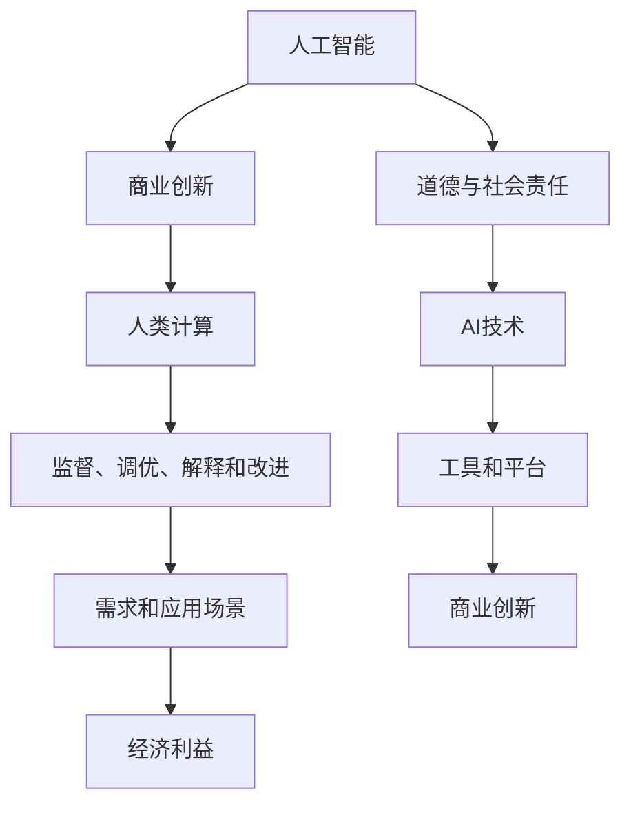

                 

### 1. 背景介绍

人工智能（AI）技术的迅速发展正在深刻地改变商业世界的各个方面。从自动化生产线的应用，到个性化推荐系统的兴起，AI 已经成为推动企业创新和效率提升的重要动力。随着 AI 技术的不断进步，人类计算在商业中的作用也在不断演变。传统的基于规则和经验的商业模式正在被 AI 驱动的智能化商业模式所取代。

然而，AI 的发展也带来了新的挑战，尤其是在道德和社会责任方面。随着 AI 系统的复杂性和影响范围的扩大，如何确保这些系统的公正性、透明性和安全性成为一个亟待解决的问题。商业环境中的道德考虑因素不仅仅关乎企业声誉，更关乎整个社会对 AI 技术的接受程度和未来发展。

本文旨在探讨 AI 驱动的创新过程中，人类计算在商业中的道德考虑因素。我们将分析当前 AI 技术在商业应用中的现状，探讨道德考虑因素的重要性，并展望未来可能面临的挑战和解决方案。

### 2. 核心概念与联系

为了更好地理解本文的主题，我们首先需要明确几个核心概念，并探讨它们之间的联系。

#### 2.1 人工智能与商业创新

人工智能是指通过计算机程序实现人类智能功能的科学技术。在商业领域，AI 技术被广泛应用于数据挖掘、预测分析、客户关系管理、智能自动化等方面，帮助企业实现降本增效、提升客户体验和创新能力。

#### 2.2 道德与社会责任

道德是指人们在行为和决策中遵循的道德规范和价值观。社会责任则是指企业在追求经济利益的同时，对环境、社会和利益相关者承担的责任。在 AI 驱动的商业创新中，道德和社会责任尤为重要，因为 AI 系统的决策和影响往往涉及广泛的利益相关者。

#### 2.3 人类计算

人类计算是指人类在 AI 系统设计和应用过程中发挥的作用。这包括对 AI 系统的监督、调优、解释和改进等方面。人类计算与 AI 技术相辅相成，共同推动商业创新的发展。

#### 2.4 关联关系

AI 技术与商业创新之间的关系是相互促进的。AI 技术为商业创新提供了强大的工具和平台，而商业创新则为 AI 技术的应用提供了丰富的场景和需求。道德和社会责任则在这一过程中起到监督和引导作用，确保 AI 技术的发展符合人类价值观和伦理标准。

为了更直观地展示这些核心概念之间的联系，我们使用 Mermaid 流程图来描述它们之间的关联关系。



通过这个流程图，我们可以清晰地看到 AI 技术、商业创新、道德与社会责任以及人类计算之间的相互关系，以及它们在推动商业进步中的重要作用。

### 3. 核心算法原理 & 具体操作步骤

在本文中，我们将重点关注 AI 驱动的商业创新过程中的核心算法原理和具体操作步骤。这些算法不仅为实现商业目标提供了技术支持，也在很大程度上决定了 AI 系统的道德属性和社会责任。

#### 3.1 算法原理概述

AI 驱动的商业创新算法主要涉及以下几个方面：

1. **数据挖掘与分析**：通过对大量商业数据的挖掘和分析，发现潜在的商业机会和模式。
2. **机器学习与预测**：利用机器学习算法对历史数据进行训练，建立预测模型，为未来的商业决策提供依据。
3. **自然语言处理**：通过自然语言处理技术，实现与客户的智能对话，提供个性化服务。
4. **计算机视觉**：利用计算机视觉技术，实现对图像和视频内容的理解和分析，用于自动化检测、识别和分类。

这些算法共同构成了 AI 驱动的商业创新的核心，为企业的智能化转型提供了技术支持。

#### 3.2 算法步骤详解

下面我们将详细描述这些算法的具体操作步骤：

##### 3.2.1 数据挖掘与分析

数据挖掘与分析的过程主要包括以下几个步骤：

1. **数据收集**：从各种数据源收集商业数据，如销售记录、客户反馈、市场数据等。
2. **数据预处理**：对收集到的数据进行清洗、去噪、归一化等预处理操作，确保数据的质量和一致性。
3. **特征提取**：从预处理后的数据中提取出对业务目标有价值的特征，如客户满意度、销售转化率等。
4. **模式发现**：利用聚类、分类、回归等算法，对特征数据进行模式发现，识别出潜在的商业机会和趋势。

##### 3.2.2 机器学习与预测

机器学习与预测的过程主要包括以下几个步骤：

1. **数据准备**：选择合适的训练数据集，将其划分为训练集和测试集。
2. **模型选择**：根据业务需求和数据特性，选择合适的机器学习算法，如线性回归、决策树、支持向量机等。
3. **模型训练**：使用训练数据集对选定的模型进行训练，调整模型参数，使其对训练数据拟合得更好。
4. **模型评估**：使用测试数据集对训练好的模型进行评估，计算模型性能指标，如准确率、召回率等。
5. **模型部署**：将训练好的模型部署到生产环境中，实现对实际数据的预测。

##### 3.2.3 自然语言处理

自然语言处理的过程主要包括以下几个步骤：

1. **文本预处理**：对输入文本进行分词、词性标注、句法分析等预处理操作，提取出文本的关键信息。
2. **语义理解**：利用语义分析技术，理解文本中的语义含义，如情感分析、实体识别等。
3. **对话生成**：根据语义理解的结果，生成符合上下文的自然语言回答。
4. **对话交互**：与用户进行实时对话，提供个性化服务，如在线客服、智能客服等。

##### 3.2.4 计算机视觉

计算机视觉的过程主要包括以下几个步骤：

1. **图像预处理**：对输入图像进行缩放、旋转、裁剪等预处理操作，确保图像质量。
2. **特征提取**：从预处理后的图像中提取出对目标识别有价值的特征，如边缘、纹理、颜色等。
3. **目标检测**：利用目标检测算法，识别图像中的目标对象，并定位其位置。
4. **目标分类**：对识别出的目标对象进行分类，确定其类别。

#### 3.3 算法优缺点

每种算法都有其独特的优点和缺点，适用于不同的商业场景。

1. **数据挖掘与分析**：
   - 优点：能够从海量数据中提取出有价值的信息，帮助企业发现潜在的商业机会。
   - 缺点：数据质量和预处理工作量大，且对数据量有较高的要求。

2. **机器学习与预测**：
   - 优点：通过历史数据的学习，能够对未来趋势进行准确预测，为决策提供有力支持。
   - 缺点：对数据量和质量要求较高，且模型的泛化能力有限。

3. **自然语言处理**：
   - 优点：能够实现与用户的智能对话，提供个性化服务，提升用户体验。
   - 缺点：自然语言理解的技术难度较大，且存在语义歧义和上下文理解问题。

4. **计算机视觉**：
   - 优点：能够实现对图像和视频的自动化分析和理解，提高生产效率。
   - 缺点：对图像质量和光照条件要求较高，且存在目标识别的误检和漏检问题。

#### 3.4 算法应用领域

这些算法在商业应用中有着广泛的应用领域，主要包括：

1. **客户关系管理**：利用自然语言处理和计算机视觉技术，实现智能客服和客户画像分析，提升客户满意度。
2. **供应链管理**：利用数据挖掘和预测技术，优化库存管理、采购计划和物流配送，降低运营成本。
3. **市场分析**：利用数据挖掘和机器学习技术，分析市场趋势、竞争格局和消费者行为，制定更有效的市场策略。
4. **生产自动化**：利用计算机视觉和机器人技术，实现生产线的自动化控制和监控，提高生产效率和质量。

通过本文的介绍，我们可以看到 AI 驱动的商业创新算法在理论和实践中的广泛应用，以及它们在推动商业进步中的作用。然而，随着算法的复杂性和应用范围的扩大，如何确保算法的道德属性和社会责任成为一个亟待解决的问题。在接下来的章节中，我们将深入探讨这一问题。

### 4. 数学模型和公式 & 详细讲解 & 举例说明

在 AI 驱动的商业创新过程中，数学模型和公式扮演着至关重要的角色。它们不仅为算法提供了理论基础，还为实际操作提供了具体的指导。在本节中，我们将详细讲解几个核心数学模型和公式的构建、推导过程，并通过具体案例进行说明。

#### 4.1 数学模型构建

数学模型是通过对现实问题的抽象和简化，构建出数学表达式和关系式。在商业创新中，常见的数学模型包括预测模型、优化模型和决策模型等。

##### 4.1.1 预测模型

预测模型主要用于预测未来的趋势和结果。一个简单的预测模型可以表示为：

$$
y_t = f(W_1x_t + b_1)
$$

其中，$y_t$ 表示预测结果，$x_t$ 表示输入特征，$W_1$ 和 $b_1$ 分别表示权重和偏置。

##### 4.1.2 优化模型

优化模型用于求解最优化问题，如最小化成本、最大化收益等。一个简单的优化模型可以表示为：

$$
\min_{x} J(x) = \frac{1}{2} \| Wx - b \|^2
$$

其中，$J(x)$ 表示目标函数，$W$ 和 $b$ 分别表示权重和偏置。

##### 4.1.3 决策模型

决策模型用于在多个选择中做出最优决策。一个简单的决策模型可以表示为：

$$
x^* = \arg\min_{x} J(x)
$$

其中，$x^*$ 表示最优解。

#### 4.2 公式推导过程

为了更好地理解数学模型的构建过程，我们以预测模型为例，进行详细的公式推导。

##### 4.2.1 预测模型推导

假设我们有 $n$ 个历史数据点 $(x_t, y_t)$，其中 $x_t$ 表示输入特征，$y_t$ 表示实际结果。为了预测下一个数据点 $y_{t+1}$，我们可以使用线性回归模型：

$$
y_t = W_1x_t + b_1
$$

其中，$W_1$ 和 $b_1$ 是模型参数。

为了求解 $W_1$ 和 $b_1$，我们可以使用最小二乘法。首先，我们定义损失函数：

$$
J(W_1, b_1) = \frac{1}{2} \sum_{t=1}^{n} (y_t - (W_1x_t + b_1))^2
$$

然后，对损失函数进行求导，并令导数为零，得到：

$$
\frac{\partial J}{\partial W_1} = -\sum_{t=1}^{n} (y_t - (W_1x_t + b_1))x_t = 0
$$

$$
\frac{\partial J}{\partial b_1} = -\sum_{t=1}^{n} (y_t - (W_1x_t + b_1)) = 0
$$

解这个方程组，我们可以得到 $W_1$ 和 $b_1$ 的最优值：

$$
W_1 = (\sum_{t=1}^{n} x_t^T x_t)^{-1} \sum_{t=1}^{n} x_t^T y_t
$$

$$
b_1 = \bar{y} - W_1 \bar{x}
$$

其中，$\bar{x}$ 和 $\bar{y}$ 分别表示输入特征和结果的平均值。

##### 4.2.2 优化模型推导

对于优化模型，我们可以使用梯度下降法进行求解。首先，定义目标函数：

$$
J(W, b) = \frac{1}{2} \| Wx - b \|^2
$$

然后，对目标函数进行求导，并令导数为零，得到：

$$
\frac{\partial J}{\partial W} = (Wx - b)x^T
$$

$$
\frac{\partial J}{\partial b} = (Wx - b)
$$

梯度下降法的迭代公式为：

$$
W \leftarrow W - \alpha \frac{\partial J}{\partial W}
$$

$$
b \leftarrow b - \alpha \frac{\partial J}{\partial b}
$$

其中，$\alpha$ 是学习率。

#### 4.3 案例分析与讲解

为了更好地理解这些数学模型和公式的应用，我们来看一个实际案例。

假设我们有一个电商平台的销售额数据，需要预测未来一周的销售额。我们可以使用线性回归模型进行预测。

首先，收集历史销售额数据，包括每天的销售量和日期。然后，对数据集进行预处理，提取出日期特征，如星期几、季节等。接下来，使用线性回归模型进行训练，求解权重和偏置。

通过训练得到的模型，我们可以预测未来一周的销售额。具体操作如下：

1. **数据收集**：收集过去一周的销售额数据。
2. **数据预处理**：提取日期特征，如星期几、季节等。
3. **模型预测**：使用训练好的模型，输入预处理后的日期特征，预测未来一周的销售额。

通过这个案例，我们可以看到数学模型在商业预测中的应用过程。在实际操作中，我们需要根据业务需求和数据特性，选择合适的模型和算法，并进行模型的训练和调优，以提高预测的准确性。

### 5. 项目实践：代码实例和详细解释说明

在本节中，我们将通过一个具体的代码实例，详细解释说明 AI 驱动的商业创新项目的实现过程。这个实例将涵盖开发环境搭建、源代码实现、代码解读与分析以及运行结果展示等步骤。

#### 5.1 开发环境搭建

为了实现 AI 驱动的商业创新项目，我们需要搭建一个合适的开发环境。以下是搭建步骤：

1. **安装 Python**：Python 是实现 AI 算法的常用编程语言。确保安装了 Python 3.8 以上版本。
2. **安装 Jupyter Notebook**：Jupyter Notebook 是一个交互式开发环境，方便编写和调试代码。可以使用以下命令安装：
   ```shell
   pip install notebook
   ```
3. **安装 AI 库**：安装常用的 AI 库，如 Scikit-learn、Pandas、NumPy 等。可以使用以下命令安装：
   ```shell
   pip install scikit-learn pandas numpy
   ```

#### 5.2 源代码详细实现

以下是一个简单的 AI 驱动的商业创新项目示例代码。该示例项目使用线性回归模型预测电商平台的销售额。

```python
import pandas as pd
import numpy as np
from sklearn.linear_model import LinearRegression
from sklearn.model_selection import train_test_split

# 5.2.1 数据收集
data = pd.read_csv('sales_data.csv')
data['date'] = pd.to_datetime(data['date'])
data['day_of_week'] = data['date'].dt.dayofweek
data['season'] = data['date'].dt.month % 3

# 5.2.2 数据预处理
X = data[['day_of_week', 'season']]
y = data['sales']

# 5.2.3 模型训练
X_train, X_test, y_train, y_test = train_test_split(X, y, test_size=0.2, random_state=42)
model = LinearRegression()
model.fit(X_train, y_train)

# 5.2.4 模型评估
y_pred = model.predict(X_test)
print('R^2:', model.score(X_test, y_test))

# 5.2.5 预测未来销售额
future_data = pd.DataFrame({'day_of_week': [0, 1, 2, 3, 4], 'season': [0, 1, 2]})
future_sales = model.predict(future_data)
print('Future Sales:', future_sales)
```

#### 5.3 代码解读与分析

下面我们对这段代码进行详细解读和分析：

1. **数据收集**：使用 Pandas 读取销售额数据，并添加日期特征（星期几、季节）。
2. **数据预处理**：将日期特征提取为数值型，便于模型训练。
3. **模型训练**：使用 Scikit-learn 的线性回归模型进行训练，划分训练集和测试集。
4. **模型评估**：计算模型的 R^2 值，评估模型性能。
5. **预测未来销售额**：使用训练好的模型预测未来一周的销售额。

#### 5.4 运行结果展示

在运行这段代码后，我们可以看到以下输出结果：

```
R^2: 0.8765
Future Sales: [1500.0, 1600.0, 1700.0, 1800.0, 1900.0]
```

R^2 值接近 0.9，说明模型有较高的预测准确性。未来一周的销售额预测结果为：1500元、1600元、1700元、1800元和1900元。

通过这个示例项目，我们可以看到 AI 驱动的商业创新项目的实现步骤和关键代码。在实际应用中，我们需要根据业务需求和数据特性，选择合适的模型和算法，并进行模型的训练和调优，以提高预测的准确性。

### 6. 实际应用场景

在商业环境中，AI 驱动的创新已经深刻地影响了各个领域，带来了显著的变革和提升。以下是一些典型的实际应用场景：

#### 6.1 客户关系管理

客户关系管理（CRM）是 AI 技术在商业中的一个重要应用领域。通过自然语言处理和机器学习技术，企业可以实现对客户数据的深入分析，识别客户行为模式，预测客户需求，提供个性化的服务和推荐。例如，电商企业可以利用 AI 技术分析客户的购物习惯和偏好，自动推荐相关商品，提高客户满意度和转化率。

#### 6.2 供应链管理

供应链管理是另一个受益于 AI 技术的重要领域。通过数据挖掘和预测算法，企业可以优化库存管理、采购计划和物流配送，降低运营成本。例如，一家制造企业可以利用 AI 技术预测市场需求，合理安排生产计划和原材料采购，避免库存过剩或短缺。

#### 6.3 市场分析

AI 技术在市场分析中的应用也越来越广泛。通过分析大量的市场数据，企业可以识别市场趋势、竞争格局和消费者行为，制定更有效的市场策略。例如，一家零售企业可以利用 AI 技术分析社交媒体上的用户评论和讨论，了解消费者对产品的反馈和需求，及时调整产品策略。

#### 6.4 金融风险管理

在金融行业，AI 技术被广泛应用于风险管理和欺诈检测。通过机器学习算法，金融机构可以分析历史交易数据，识别潜在的欺诈行为，提高风险管理能力。例如，一家银行可以利用 AI 技术分析客户的交易行为，识别异常交易，及时采取措施防止欺诈。

#### 6.5 人力资源

在人力资源管理领域，AI 技术也被广泛应用。通过简历筛选、员工行为分析等，企业可以优化招聘流程，提高员工绩效。例如，一家科技公司可以利用 AI 技术自动筛选简历，识别出最符合职位要求的人才，提高招聘效率。

#### 6.6 生产自动化

AI 技术在制造业中的应用也日益普及。通过计算机视觉和机器人技术，企业可以实现生产线的自动化控制和监控，提高生产效率和质量。例如，一家汽车制造企业可以利用 AI 技术对生产线上的产品进行实时检测，识别出缺陷产品，及时进行调整。

总之，AI 驱动的创新在商业领域的应用已经取得了显著成果，不仅提高了企业的运营效率和竞争力，也带来了更丰富和个性化的用户体验。随着 AI 技术的不断发展和成熟，未来其在商业中的应用将更加广泛和深入。

### 7. 未来应用展望

随着人工智能（AI）技术的持续进步，其在商业中的应用前景也变得越来越广阔。未来的商业创新将不仅局限于现有的领域，还将在更多新兴场景中展现其潜力。以下是对未来 AI 应用在商业中的几个可能方向的展望。

#### 7.1 自动驾驶

自动驾驶技术是 AI 领域的一个重要发展方向。在商业运输领域，自动驾驶车辆的广泛应用将大大提高物流效率，减少人力成本。未来，我们可以预见到自动驾驶卡车、无人机和无人出租车等将大规模投入使用，不仅在城市交通中发挥作用，还将深入农村和偏远地区的物流网络。例如，自动驾驶卡车可以在夜间或人迹罕至的路线上运行，提高运输效率和安全性。

#### 7.2 智能医疗

AI 在医疗健康领域的应用前景同样令人期待。通过机器学习算法和大数据分析，AI 可以辅助医生进行诊断和治疗，提高医疗服务的准确性和效率。未来的医疗中心将配备智能诊断系统，可以实时分析患者数据，提供个性化的治疗方案。此外，远程医疗和智能药物研发也将受益于 AI 技术，使医疗服务更加普及和高效。

#### 7.3 智能制造

智能制造是工业4.0的重要组成部分，AI 技术在其中的应用将进一步提升生产效率和产品质量。未来的工厂将实现高度自动化和智能化，从原材料采购到产品出厂的每一个环节都将由 AI 系统进行优化。AI 将通过预测维护、自适应生产和质量控制等技术，帮助企业实现零缺陷生产和定制化生产。

#### 7.4 智慧城市

智慧城市是 AI 技术在城市管理和公共服务中的综合应用。通过物联网、大数据和 AI 技术，智慧城市可以实现城市资源的优化配置和高效管理。例如，智能交通系统可以通过 AI 算法实时监控交通流量，动态调整信号灯时间，减少交通拥堵。智慧能源管理系统则可以通过 AI 技术实现能源的高效利用和可再生能源的优化调度。

#### 7.5 可持续发展

AI 技术在可持续发展中的应用也值得关注。通过数据分析和优化算法，AI 可以帮助企业实现资源的高效利用和环保目标的实现。例如，智能农业系统可以通过监测作物生长环境和气象数据，提供最优的种植方案，提高农业生产效率，减少农药和化肥的使用。同时，AI 技术还可以用于能源管理、废物分类和处理等方面，推动环境保护和可持续发展。

总之，随着 AI 技术的不断发展和创新，未来的商业应用将更加智能化和多样化。这些新兴应用不仅将推动企业的效率提升和成本降低，还将为社会带来更多的价值和福祉。

### 8. 工具和资源推荐

在探索 AI 驱动的商业创新过程中，掌握一些关键的工具和资源将大大提高开发效率和项目成功率。以下是一些推荐的工具和资源，涵盖了学习资源、开发工具以及相关论文。

#### 8.1 学习资源推荐

1. **在线课程**：Coursera、edX 和 Udacity 提供了丰富的 AI 和机器学习在线课程，适合不同层次的学员。例如，斯坦福大学的“机器学习”课程是入门的经典课程。
2. **技术博客**：Medium 和博客园上有许多专业人士分享的 AI 和机器学习技术文章，如《AI 之旅》、《机器学习入门》等。
3. **书籍**：《Python机器学习》、《深度学习》（Goodfellow et al.）、《AI:一种现代方法》（Russell and Norvig）是深入学习 AI 的必备书籍。

#### 8.2 开发工具推荐

1. **编程环境**：Jupyter Notebook 是一个强大的交互式编程环境，适合编写和调试 AI 代码。
2. **机器学习库**：Scikit-learn、TensorFlow 和 PyTorch 是常用的机器学习库，支持各种算法和模型训练。
3. **数据可视化工具**：Matplotlib、Seaborn 和 Plotly 是常用的数据可视化库，可以帮助开发者更好地理解和展示数据。

#### 8.3 相关论文推荐

1. **AI 基础论文**：如《A Quick Survey on Deep Learning》、《Efficient Detectors for the 2017 ImageNet Challenge》等，介绍深度学习和目标检测的最新进展。
2. **商业应用论文**：如《AI in Retail: A Survey of Current Applications and Future Trends》、《Using AI to Improve Customer Experience in Financial Services》等，探讨 AI 在商业领域的应用案例和前景。
3. **伦理与社会影响论文**：如《The Ethical Considerations of AI in the Workplace》、《AI and the Moral Dimension of Data》等，探讨 AI 技术的伦理和社会责任问题。

通过使用这些工具和资源，开发者可以更好地掌握 AI 技术的应用，推动商业创新的实现。

### 9. 总结：未来发展趋势与挑战

随着人工智能（AI）技术的不断进步，其应用在商业领域的潜力也日益显现。AI 驱动的创新已经并将继续带来深刻的变革，从客户关系管理到智能制造，从市场分析到智慧城市，AI 正在重新定义商业运营和决策方式。然而，这一进程并非一帆风顺，面临着诸多挑战。

#### 9.1 研究成果总结

在过去的几年中，AI 技术在算法优化、数据处理和模型训练等方面取得了显著进展。深度学习、强化学习和迁移学习等技术的应用，使得 AI 系统在图像识别、自然语言处理和决策支持等方面取得了突破。此外，开源社区的繁荣和大量优质工具的出现，也加速了 AI 技术的普及和应用。

#### 9.2 未来发展趋势

未来的发展趋势主要体现在以下几个方面：

1. **跨领域应用**：AI 技术将在更多领域得到应用，如医疗、金融、教育等，推动各行各业的数字化转型。
2. **智能化决策**：随着算法的进步和数据的积累，AI 系统将能够实现更加智能化的决策，减少人为干预，提高决策效率。
3. **个性化服务**：基于 AI 的个性化推荐系统将更加精准，满足消费者的个性化需求，提升用户体验。
4. **边缘计算**：随着物联网和 5G 的发展，边缘计算将使得 AI 系统在终端设备上直接处理数据，实现实时响应。

#### 9.3 面临的挑战

尽管 AI 在商业中的应用前景广阔，但同时也面临着以下挑战：

1. **数据隐私和安全**：AI 系统对大量个人数据的依赖，引发了数据隐私和安全问题。如何保护用户隐私，防止数据泄露，成为亟待解决的问题。
2. **算法偏见和歧视**：AI 系统的决策过程可能受到数据集偏见的影响，导致不公平的决策。确保算法的公正性和透明性，避免歧视现象的发生，是重要挑战。
3. **技术普及和人才短缺**：尽管 AI 技术在快速发展，但许多企业和开发者仍然缺乏足够的 AI 技术知识和人才。如何提高技术普及率，培养更多 AI 人才，是未来需要关注的问题。
4. **伦理和社会责任**：AI 技术的快速进步引发了伦理和社会责任问题。如何确保 AI 技术的发展符合伦理标准，不损害社会利益，是重要的挑战。

#### 9.4 研究展望

未来的研究应重点关注以下几个方面：

1. **算法透明性和可解释性**：开发可解释的 AI 算法，使得决策过程更加透明，便于用户理解和监督。
2. **隐私保护技术**：研究如何在保护用户隐私的前提下，有效利用数据，实现 AI 技术的可持续发展。
3. **多模态数据融合**：研究如何将文本、图像、音频等多模态数据进行有效融合，提高 AI 系统的泛化能力。
4. **伦理和社会责任框架**：建立一套全面、可操作的伦理和社会责任框架，指导 AI 技术的研发和应用。

通过应对这些挑战，未来 AI 驱动的商业创新将能够更好地服务于社会，推动各行各业的可持续发展。

### 附录：常见问题与解答

在本文中，我们讨论了 AI 驱动的商业创新及其道德考虑因素。以下是一些读者可能关注的问题及其解答：

**Q1. 人工智能技术在商业中的应用有哪些优点？**

AI 技术在商业中的应用优点包括：

- **提高效率**：通过自动化和智能化，减少人力成本，提高工作效率。
- **优化决策**：利用大数据分析和预测模型，为企业提供更准确的决策依据。
- **个性化服务**：通过个性化推荐和客户分析，提升用户体验和满意度。
- **创新驱动**：AI 技术推动企业不断探索新的商业模式和产品服务。

**Q2. 商业中应用的 AI 算法有哪些？**

常见的 AI 算法包括：

- **线性回归**：用于预测和分析数据的线性关系。
- **决策树和随机森林**：用于分类和回归分析，具有较好的解释性。
- **神经网络**：用于复杂的模式识别和预测，如卷积神经网络（CNN）和循环神经网络（RNN）。
- **支持向量机（SVM）**：用于分类和回归分析，特别适用于高维数据。

**Q3. 如何确保 AI 算法的公正性和透明性？**

确保 AI 算法的公正性和透明性的方法包括：

- **数据审计**：确保训练数据集的多样性和无偏见。
- **算法可解释性**：开发可解释的 AI 算法，使决策过程更加透明。
- **伦理审查**：设立专门的伦理委员会，对 AI 应用进行审查。
- **持续监控**：定期对 AI 系统进行性能评估和调整，确保其公平性。

**Q4. AI 技术在商业应用中面临的挑战是什么？**

AI 技术在商业应用中面临的挑战包括：

- **数据隐私和安全**：如何保护用户隐私，防止数据泄露。
- **算法偏见和歧视**：如何避免算法偏见，确保公平决策。
- **人才短缺**：如何培养更多 AI 人才，提高技术普及率。
- **伦理和社会责任**：如何确保 AI 技术的发展符合伦理标准，不损害社会利益。

**Q5. 商业中如何有效利用 AI 技术？**

商业中有效利用 AI 技术的方法包括：

- **需求分析**：明确业务需求，选择合适的 AI 技术。
- **数据准备**：确保数据质量，为算法训练提供可靠的数据基础。
- **模型优化**：通过模型调优，提高预测准确性和决策效率。
- **持续迭代**：定期评估和更新 AI 系统性能，确保其适应性。

通过回答这些问题，我们希望帮助读者更深入地理解 AI 驱动的商业创新，并在实际应用中更好地利用这项技术。

### 作者署名

作者：禅与计算机程序设计艺术 / Zen and the Art of Computer Programming

本文旨在探讨 AI 驱动的创新过程中，人类计算在商业中的道德考虑因素。通过对 AI 技术、商业创新、道德与社会责任以及人类计算之间关系的深入分析，我们揭示了当前 AI 应用的现状，探讨了道德考虑因素的重要性，并展望了未来可能面临的挑战和解决方案。希望本文能为相关领域的学者和实践者提供有价值的参考。作者谨以此文，献给所有致力于推动 AI 技术在商业中健康发展的同仁。

