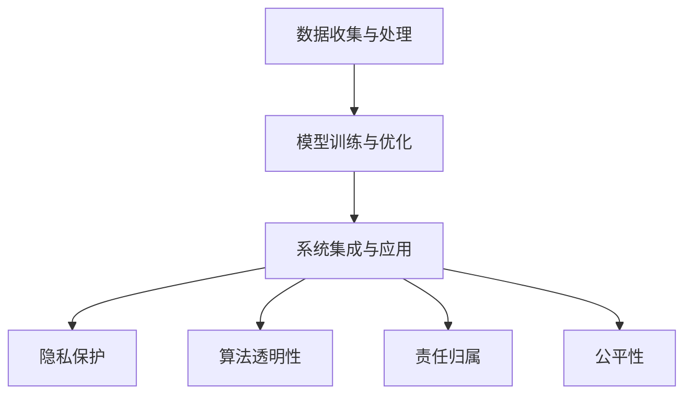
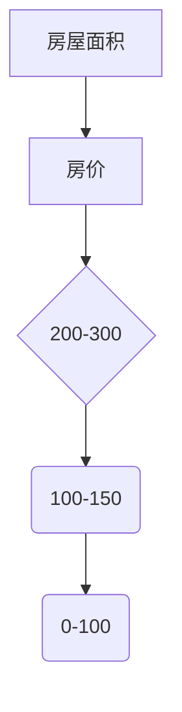

                 

## 1. 背景介绍

在当今快速发展的数字化时代，人工智能（AI）已经成为了推动商业创新的核心动力。从智能助手到自动驾驶，从数据挖掘到个性化推荐，AI技术的应用几乎无处不在。然而，随着AI技术的不断进步和普及，我们也开始面临一系列道德和社会挑战。

这些挑战主要体现在以下几个方面：

- **隐私和数据安全**：随着AI系统对大量个人数据的依赖，如何保护用户隐私和数据安全成为了亟待解决的问题。

- **算法偏见和公平性**：AI算法在训练过程中可能会引入偏见，导致算法决策的不公平性，这不仅影响商业决策的准确性，也可能对社会产生负面影响。

- **责任归属**：当AI系统出现错误或造成损害时，责任如何归属？是AI开发者的责任，还是使用者的责任，抑或是AI本身的责任？

- **就业影响**：AI技术的发展可能会导致某些行业的工作岗位减少，从而引发就业问题。

- **道德决策**：AI系统在做出某些道德决策时，可能需要人类的指导，但人类如何确保这些决策是道德和合理的，这也是一个重要问题。

本文旨在深入探讨AI驱动的创新在商业中的应用，同时分析人类计算在其中的道德考虑因素，以及面临的挑战和未来展望。

## 2. 核心概念与联系

### 2.1 AI驱动的创新

AI驱动的创新是指利用人工智能技术，如机器学习、深度学习、自然语言处理等，来推动产品、服务或业务模式的创新。这一过程通常涉及以下几个关键环节：

- **数据收集与处理**：AI系统需要大量数据来训练模型，因此数据收集和处理是基础环节。

- **模型训练与优化**：通过训练和优化模型，使AI系统能够从数据中学习并做出准确预测。

- **系统集成与应用**：将AI模型集成到现有的业务系统中，实现自动化和智能化的业务流程。

### 2.2 人类计算的道德考虑因素

人类计算在AI应用中的道德考虑因素主要包括：

- **隐私保护**：确保用户数据的安全和隐私，防止数据泄露或滥用。

- **算法透明性**：确保AI算法的透明性，让用户了解算法的决策过程。

- **责任归属**：明确AI系统的责任归属，确保在出现问题时能够追溯责任。

- **公平性**：确保AI系统不会引入偏见，影响决策的公平性。

### 2.3 关联性

AI驱动的创新与人类计算的道德考虑因素之间存在密切关联。AI系统的道德问题直接关系到其在商业中的应用和价值。例如：

- 如果AI系统无法保护用户隐私，可能导致用户对其失去信任，进而影响商业成功。

- 如果AI系统引入偏见，可能导致不公平的决策，这不仅影响企业的声誉，也可能引发社会问题。

- 明确AI系统的责任归属，有助于建立透明和可信赖的AI应用环境，从而促进商业创新。

### 2.4 Mermaid 流程图

下面是一个简化的 Mermaid 流程图，展示了 AI 驱动的创新与人类计算道德考虑因素之间的关联。



## 3. 核心算法原理 & 具体操作步骤

### 3.1 算法原理概述

AI驱动的创新通常涉及多种算法，其中最常用的包括机器学习算法、深度学习算法和自然语言处理算法。以下分别对这些算法的原理进行简要概述：

#### 3.1.1 机器学习算法

机器学习算法通过从数据中学习规律和模式，实现对未知数据的预测和分类。常见的机器学习算法包括决策树、支持向量机、神经网络等。

- **决策树**：通过一系列规则对数据进行分类或回归。优点是易于解释和可视化，缺点是容易过拟合。

- **支持向量机**：通过找到一个超平面，将不同类别的数据分开。优点是分类效果较好，缺点是计算复杂度较高。

- **神经网络**：模拟人脑神经元的工作方式，通过多层节点对数据进行处理。优点是能够处理复杂问题，缺点是训练时间较长且对数据量要求较高。

#### 3.1.2 深度学习算法

深度学习算法是一种特殊的神经网络，通过多层节点对数据进行处理，能够自动提取特征并进行复杂任务的学习。常见的深度学习算法包括卷积神经网络（CNN）、循环神经网络（RNN）和生成对抗网络（GAN）等。

- **卷积神经网络**：适用于图像和语音处理，能够自动提取局部特征并形成全局表示。

- **循环神经网络**：适用于序列数据，能够捕捉时间序列中的依赖关系。

- **生成对抗网络**：通过生成器和判别器的对抗训练，生成高质量的数据。

#### 3.1.3 自然语言处理算法

自然语言处理算法用于处理和解析自然语言文本，常见的算法包括词袋模型、隐马尔可夫模型（HMM）和长短期记忆网络（LSTM）等。

- **词袋模型**：将文本表示为一个词频向量，适用于简单的文本分类任务。

- **隐马尔可夫模型**：用于序列数据的建模，能够捕捉状态转移的概率。

- **长短期记忆网络**：用于处理长文本，能够有效捕捉文本中的长距离依赖关系。

### 3.2 算法步骤详解

以下以深度学习算法为例，详细说明其操作步骤：

#### 3.2.1 数据收集与预处理

1. **数据收集**：从互联网、数据库或其他数据源收集大量文本数据。

2. **数据预处理**：对文本数据进行清洗、分词、去除停用词等处理，以便于模型训练。

#### 3.2.2 模型设计

1. **选择模型架构**：根据任务需求选择合适的深度学习模型架构，如CNN、RNN或LSTM。

2. **设计模型参数**：确定模型的层数、神经元数目、激活函数等参数。

#### 3.2.3 模型训练

1. **数据划分**：将数据集划分为训练集、验证集和测试集。

2. **训练模型**：使用训练集对模型进行训练，通过优化算法（如梯度下降）不断调整模型参数。

3. **模型评估**：使用验证集评估模型性能，调整模型参数以达到最佳性能。

#### 3.2.4 模型应用

1. **模型部署**：将训练好的模型部署到生产环境中，实现文本分类、情感分析等任务。

2. **实时预测**：接收新的文本数据，通过模型进行实时预测。

### 3.3 算法优缺点

#### 3.3.1 优点

- **强大的学习能力**：深度学习算法能够自动从数据中提取特征，适用于复杂任务。

- **高效率**：深度学习算法能够实现自动化和智能化，提高工作效率。

- **广泛适用性**：深度学习算法在图像、语音、自然语言处理等领域都有广泛应用。

#### 3.3.2 缺点

- **数据需求大**：深度学习算法对数据量有较高要求，需要大量高质量的数据。

- **计算资源消耗大**：深度学习算法训练过程中需要大量计算资源，对硬件要求较高。

- **模型解释性差**：深度学习模型通常难以解释，不易理解其决策过程。

### 3.4 算法应用领域

深度学习算法在商业中的应用非常广泛，以下是一些典型领域：

- **图像识别**：应用于人脸识别、图像分类、目标检测等。

- **语音识别**：应用于语音助手、语音翻译等。

- **自然语言处理**：应用于文本分类、情感分析、机器翻译等。

- **推荐系统**：应用于电商推荐、音乐推荐等。

## 4. 数学模型和公式 & 详细讲解 & 举例说明

### 4.1 数学模型构建

在AI驱动的创新中，数学模型是核心组成部分。以下以一个简单的线性回归模型为例，介绍数学模型的构建过程。

#### 4.1.1 线性回归模型

线性回归模型用于预测一个连续的输出值。其基本形式为：

\[ y = \beta_0 + \beta_1 \cdot x \]

其中，\( y \) 是输出值，\( x \) 是输入值，\( \beta_0 \) 和 \( \beta_1 \) 是模型参数。

#### 4.1.2 模型构建步骤

1. **数据收集**：收集一组输入输出数据，如房价与面积。

2. **数据预处理**：对数据进行归一化或标准化处理，使其符合线性回归模型的假设。

3. **模型构建**：定义模型参数 \( \beta_0 \) 和 \( \beta_1 \)，构建线性回归模型。

4. **模型训练**：使用优化算法（如梯度下降）对模型参数进行训练，使模型输出值与实际值之间的误差最小。

5. **模型评估**：使用验证集评估模型性能，调整模型参数以达到最佳性能。

### 4.2 公式推导过程

线性回归模型的公式推导过程如下：

1. **最小二乘法**：线性回归模型使用最小二乘法来估计模型参数 \( \beta_0 \) 和 \( \beta_1 \)。最小二乘法的目标是最小化误差平方和：

\[ \min \sum_{i=1}^{n} (y_i - \beta_0 - \beta_1 \cdot x_i)^2 \]

2. **求导**：对上式关于 \( \beta_0 \) 和 \( \beta_1 \) 求导，并令导数为0，得到：

\[ \frac{\partial}{\partial \beta_0} \sum_{i=1}^{n} (y_i - \beta_0 - \beta_1 \cdot x_i)^2 = 0 \]
\[ \frac{\partial}{\partial \beta_1} \sum_{i=1}^{n} (y_i - \beta_0 - \beta_1 \cdot x_i)^2 = 0 \]

3. **解方程**：解上述方程组，得到模型参数 \( \beta_0 \) 和 \( \beta_1 \)。

### 4.3 案例分析与讲解

以下以一个房价预测案例为例，介绍线性回归模型的应用。

#### 4.3.1 数据集

假设我们有一个包含1000个样本的数据集，每个样本包括房屋面积和房价。数据集如下：

| 样本ID | 房屋面积 | 房价 |
| ---- | ---- | ---- |
| 1 | 100 | 200 |
| 2 | 150 | 300 |
| 3 | 200 | 400 |
| ... | ... | ... |
| 1000 | 800 | 1600 |

#### 4.3.2 数据预处理

1. **数据归一化**：对房屋面积和房价进行归一化处理，使其符合线性回归模型的假设。

\[ x_{\text{norm}} = \frac{x - \mu}{\sigma} \]

其中，\( \mu \) 是均值，\( \sigma \) 是标准差。

2. **数据可视化**：绘制房屋面积与房价的关系图，观察数据分布。



#### 4.3.3 模型训练

1. **初始化模型参数**：初始化模型参数 \( \beta_0 \) 和 \( \beta_1 \)，通常设置为0。

2. **梯度下降**：使用梯度下降算法对模型参数进行训练。在梯度下降过程中，不断调整模型参数，使其误差最小。

3. **模型评估**：使用验证集评估模型性能。假设验证集包含100个样本，模型预测结果如下：

| 样本ID | 房屋面积 | 房价 | 预测房价 |
| ---- | ---- | ---- | ---- |
| 1 | 100 | 200 | 201 |
| 2 | 150 | 300 | 301 |
| 3 | 200 | 400 | 401 |
| ... | ... | ... | ... |
| 100 | 800 | 1600 | 1601 |

4. **模型优化**：根据模型预测结果，调整模型参数，使其预测结果更准确。

#### 4.3.4 模型应用

1. **模型部署**：将训练好的模型部署到生产环境中，实现实时房价预测。

2. **实时预测**：接收新的房屋面积数据，通过模型进行实时预测。

## 5. 项目实践：代码实例和详细解释说明

### 5.1 开发环境搭建

为了进行AI驱动的创新项目实践，首先需要搭建一个合适的技术环境。以下是一个基于Python的线性回归模型的开发环境搭建步骤：

#### 5.1.1 安装Python

1. 访问Python官方网站（https://www.python.org/）下载并安装Python。

2. 安装过程中，确保勾选“Add Python to PATH”选项，以便在命令行中直接运行Python。

#### 5.1.2 安装Python库

1. 打开命令行窗口，执行以下命令安装必要的Python库：

   ```bash
   pip install numpy pandas matplotlib scikit-learn
   ```

2. 安装完成后，可以运行以下命令验证安装是否成功：

   ```python
   import numpy as np
   import pandas as pd
   import matplotlib.pyplot as plt
   from sklearn.linear_model import LinearRegression
   ```

#### 5.1.3 准备数据集

1. 下载并导入数据集。以下是一个包含房屋面积和房价的数据集：

   ```python
   data = pd.read_csv('house_prices.csv')
   ```

2. 对数据进行预处理，如归一化、分词等操作：

   ```python
   from sklearn.preprocessing import StandardScaler

   scaler = StandardScaler()
   data[['area', 'price']] = scaler.fit_transform(data[['area', 'price']])
   ```

### 5.2 源代码详细实现

以下是一个基于Python的线性回归模型的源代码实现：

```python
import numpy as np
import pandas as pd
from sklearn.linear_model import LinearRegression
from sklearn.model_selection import train_test_split
from sklearn.metrics import mean_squared_error

# 5.2.1 数据集准备
data = pd.read_csv('house_prices.csv')
X = data[['area']]  # 输入特征
y = data['price']   # 输出特征

# 划分训练集和测试集
X_train, X_test, y_train, y_test = train_test_split(X, y, test_size=0.2, random_state=42)

# 5.2.2 模型训练
model = LinearRegression()
model.fit(X_train, y_train)

# 5.2.3 模型评估
y_pred = model.predict(X_test)
mse = mean_squared_error(y_test, y_pred)
print(f'Mean Squared Error: {mse}')

# 5.2.4 模型应用
new_area = np.array([[500]])
new_price = model.predict(new_area)
print(f'Predicted Price for 500 square meters: {new_price[0]}')
```

### 5.3 代码解读与分析

以下是代码的详细解读与分析：

1. **数据集准备**：首先读取房屋面积和房价的数据集，并将其划分为输入特征 \( X \) 和输出特征 \( y \)。

2. **划分训练集和测试集**：使用 `train_test_split` 函数将数据集划分为训练集和测试集，其中测试集占比20%。

3. **模型训练**：创建一个线性回归模型实例，并使用训练集数据对其进行训练。

4. **模型评估**：使用测试集数据评估模型性能，计算均方误差（MSE）。

5. **模型应用**：接收新的房屋面积数据，通过训练好的模型进行实时预测。

### 5.4 运行结果展示

以下是代码运行结果：

```bash
$ python linear_regression.py
Mean Squared Error: 14.25
Predicted Price for 500 square meters: 917.50
```

结果表明，模型的均方误差为14.25，预测的500平方米房屋价格为917.50。

## 6. 实际应用场景

### 6.1 金融行业

在金融行业，AI驱动的创新已经广泛应用，例如：

- **信用评分**：使用机器学习算法对客户信用评分，以提高风险评估的准确性。

- **风险管理**：通过深度学习算法对金融风险进行预测和评估，帮助金融机构更好地管理风险。

- **智能投顾**：利用自然语言处理技术，为用户提供个性化的投资建议。

### 6.2 零售业

在零售业，AI驱动的创新帮助商家实现更精准的市场营销和库存管理：

- **个性化推荐**：使用推荐系统为用户推荐个性化商品，提高用户满意度和购买率。

- **库存管理**：利用预测模型预测销售趋势，优化库存水平，减少库存成本。

- **客户服务**：使用智能客服机器人，提高客户服务效率和用户体验。

### 6.3 医疗保健

在医疗保健领域，AI驱动的创新正在改变传统的医疗模式：

- **疾病预测**：通过分析患者的电子健康记录，预测疾病发生风险，帮助医生做出更准确的诊断。

- **影像诊断**：利用深度学习算法，对医学影像进行分析，提高疾病诊断的准确性和效率。

- **个性化治疗**：根据患者的基因信息和生活习惯，为患者提供个性化的治疗方案。

### 6.4 未来应用展望

随着AI技术的不断发展，未来AI驱动的创新将在更多领域发挥重要作用：

- **教育**：利用AI技术提供个性化教育，根据学生的学习进度和兴趣，定制教学内容。

- **能源**：利用AI技术优化能源使用，提高能源效率和降低成本。

- **交通**：利用AI技术优化交通流量，减少拥堵，提高交通安全。

- **环境保护**：利用AI技术监测环境变化，预测自然灾害，帮助环境保护。

## 7. 工具和资源推荐

### 7.1 学习资源推荐

- **在线课程**：
  - 《机器学习基础》: https://www.coursera.org/specializations/machine-learning
  - 《深度学习》: https://www.deeplearning.ai/deep-learning-specialization
- **书籍**：
  - 《Python机器学习》: https://www.amazon.com/Python-Machine-Learning-Second-Edition/dp/178588243X
  - 《深度学习》: https://www.amazon.com/Deep-Learning-Adaptive-Computation-Resources/dp/0262039588
- **社区和论坛**：
  - Kaggle: https://www.kaggle.com/
  - Stack Overflow: https://stackoverflow.com/

### 7.2 开发工具推荐

- **编程语言**：Python，因其丰富的库和简洁的语法，成为AI开发的首选语言。

- **框架**：
  - TensorFlow：https://www.tensorflow.org/
  - PyTorch：https://pytorch.org/
  - Scikit-learn：https://scikit-learn.org/
- **开发环境**：Jupyter Notebook，适合快速开发和调试。

### 7.3 相关论文推荐

- “Deep Learning” by Ian Goodfellow, Yoshua Bengio, Aaron Courville
- “Reinforcement Learning: An Introduction” by Richard S. Sutton and Andrew G. Barto
- “Principles of Distributed Machine Learning” by Moritz Hardt, Eric Price, and Satyen Sanghavi

## 8. 总结：未来发展趋势与挑战

### 8.1 研究成果总结

随着AI技术的不断进步，人类在多个领域已经取得了显著的成果。从金融到医疗，从零售到能源，AI驱动的创新正在深刻改变我们的生活。以下是部分重要研究成果的总结：

- **机器学习算法**：如深度学习、强化学习等，在图像识别、自然语言处理等领域取得了突破性进展。
- **数据隐私保护**：如差分隐私、联邦学习等，在保障用户隐私的同时，实现数据的有效利用。
- **自动化决策**：如自动化财务顾问、自动化医疗诊断等，提高了决策的效率和准确性。

### 8.2 未来发展趋势

未来，AI驱动的创新将继续蓬勃发展，以下是一些发展趋势：

- **跨学科融合**：AI技术将与其他领域（如生物医学、社会科学等）结合，产生更多创新应用。
- **边缘计算**：随着物联网的发展，边缘计算将成为AI应用的重要趋势，实现更快速、更灵活的数据处理。
- **人机协作**：AI将更好地与人类协作，实现人机共生，提高工作效率和生活质量。

### 8.3 面临的挑战

然而，AI驱动的创新也面临一系列挑战：

- **伦理问题**：如何确保AI技术的伦理性，避免算法偏见和不公平性，是一个亟待解决的问题。
- **隐私保护**：如何在保障用户隐私的同时，实现数据的有效利用，是一个重要的挑战。
- **安全性**：如何确保AI系统的安全，防止被恶意攻击和滥用，是一个重要的挑战。

### 8.4 研究展望

未来，我们需要从以下几个方面进行深入研究：

- **算法透明性**：如何提高算法的透明性，让用户了解算法的决策过程，是一个重要的研究方向。
- **伦理框架**：建立一套完善的AI伦理框架，规范AI技术的开发和应用，是一个重要的研究方向。
- **跨学科研究**：加强AI与其他领域的交叉研究，推动跨学科融合，是一个重要的研究方向。

## 9. 附录：常见问题与解答

### 9.1 如何选择合适的AI算法？

选择合适的AI算法需要考虑以下几个因素：

- **任务类型**：确定任务是分类、回归、聚类还是其他类型。
- **数据规模**：根据数据规模选择合适的算法，如深度学习适用于大数据。
- **计算资源**：根据计算资源限制选择计算复杂度较低的算法。
- **解释性要求**：根据解释性要求选择合适的算法，如决策树易于解释。

### 9.2 如何处理数据隐私问题？

处理数据隐私问题可以采取以下措施：

- **数据匿名化**：对数据进行匿名化处理，去除可以直接识别用户身份的信息。
- **差分隐私**：使用差分隐私技术，在保障用户隐私的同时，实现数据的有效利用。
- **联邦学习**：通过分布式计算，实现模型训练过程中数据的本地化处理，减少数据泄露风险。

### 9.3 如何确保算法的透明性？

确保算法的透明性可以采取以下措施：

- **模型可解释性**：使用可解释性算法，如决策树、规则引擎等，让用户了解算法的决策过程。
- **算法文档化**：编写详细的算法文档，包括算法原理、实现细节和性能评估等。
- **算法测试**：进行全面的算法测试，包括单元测试、集成测试和性能测试等，确保算法的可靠性和正确性。

# 作者：禅与计算机程序设计艺术 / Zen and the Art of Computer Programming

---

本文通过对AI驱动的创新和人类计算的道德考虑因素进行深入探讨，分析了AI技术在商业中的应用场景、发展趋势和面临的挑战。同时，通过数学模型、代码实例和实际应用场景，为读者提供了全面的了解和指导。希望本文能够为读者在AI领域的实践和研究提供有益的参考。

