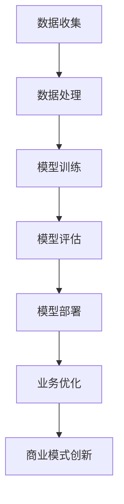

                 

关键词：人工智能、道德考虑、商业应用、技术创新、伦理挑战

> 摘要：随着人工智能技术的飞速发展，其在商业领域的应用正变得越来越广泛。然而，在推动技术进步的同时，人类计算在道德方面的考虑因素也变得至关重要。本文将探讨AI驱动的创新过程中，道德考虑因素对商业的影响，并总结其中面临的挑战。

## 1. 背景介绍

在过去的几十年中，人工智能（AI）技术经历了飞速的发展。从最初的符号主义和知识表示，到基于统计学习的机器学习，再到深度学习的崛起，AI的应用场景已从实验室走向了现实世界。在商业领域，AI的应用已经深刻地改变了我们的生活方式和工作方式，从智能客服、个性化推荐系统，到自动化决策支持系统，AI正逐步取代传统的手工处理流程。

然而，随着AI技术的广泛应用，随之而来的是一系列道德和社会问题。这些问题不仅涉及到人工智能系统的公平性、透明性和可解释性，还涉及到人类计算在道德方面的考虑因素。在商业应用中，如何确保AI系统的决策过程符合道德标准，如何处理AI与人类员工之间的关系，这些都是我们需要面对的挑战。

本文将围绕以下几个核心问题展开讨论：

1. **AI驱动的创新对商业道德的影响**：分析AI技术如何影响商业道德，并探讨这种影响在不同行业中的表现。
2. **人类计算在AI商业应用中的道德考虑因素**：总结在AI技术应用过程中，人类计算需要考虑的道德因素，并探讨这些因素在实际应用中的挑战。
3. **伦理挑战与解决方案**：分析在AI驱动的商业创新过程中，面临的主要伦理挑战，并提出可能的解决方案。

## 2. 核心概念与联系

### 2.1 AI驱动的创新

AI驱动的创新是指利用人工智能技术来推动产品或服务的创新过程。在这个过程中，AI技术被用来识别新的业务机会、优化现有的业务流程、提高决策的准确性，以及开发新的商业模式。AI驱动的创新包括以下几个方面：

- **数据驱动创新**：利用大数据分析来发现新的市场机会，通过数据挖掘和机器学习技术来预测消费者行为和市场需求。
- **自动化创新**：通过自动化技术来优化业务流程，减少人力成本，提高生产效率。
- **个性化创新**：利用个性化推荐系统和自然语言处理技术来提供定制化的产品和服务。
- **智能决策创新**：利用机器学习算法来支持决策过程，提高决策的准确性和效率。

### 2.2 商业道德

商业道德是指在商业活动中遵循的道德原则和行为准则。商业道德的核心是诚信、公正、透明和责任。在AI驱动的商业创新中，商业道德的重要性体现在以下几个方面：

- **数据隐私**：在利用大数据进行商业创新的过程中，如何保护用户的数据隐私是一个重要的道德问题。
- **算法公平性**：算法的决策过程是否公平，是否会导致歧视和偏见，是商业道德的一个重要考量。
- **责任归属**：在AI系统出现问题时，如何界定责任，如何确保责任落实到具体的人或机构，是商业道德的另一个重要问题。

### 2.3 Mermaid 流程图

下面是AI驱动的创新在商业中的应用流程图：



### 2.4 人类计算在AI商业应用中的道德考虑因素

在AI驱动的商业应用中，人类计算需要考虑的道德因素主要包括以下几个方面：

- **数据伦理**：在收集和处理数据时，如何确保数据的安全性和隐私性，如何避免数据滥用。
- **算法透明性**：如何确保算法的透明性，如何解释算法的决策过程，如何应对算法的不透明性。
- **算法偏见**：如何防止算法偏见，如何确保算法的公平性和公正性。
- **责任归属**：如何界定AI系统的责任，如何在AI系统出现问题时追究责任。
- **人类干预**：如何平衡AI与人类在决策过程中的角色，如何确保人类计算的道德考量在AI系统中得到体现。

## 3. 核心算法原理 & 具体操作步骤

### 3.1 算法原理概述

在AI驱动的商业应用中，常用的核心算法包括机器学习算法、深度学习算法和自然语言处理算法。这些算法的基本原理如下：

- **机器学习算法**：通过从数据中学习模式，来预测新的数据或决策。常见的机器学习算法包括线性回归、逻辑回归、决策树、支持向量机等。
- **深度学习算法**：基于神经网络的结构，通过多层非线性变换来提取数据的高级特征。常见的深度学习算法包括卷积神经网络（CNN）、循环神经网络（RNN）、长短时记忆网络（LSTM）等。
- **自然语言处理算法**：用于处理和理解自然语言数据，包括文本分类、情感分析、命名实体识别、机器翻译等。

### 3.2 算法步骤详解

下面以机器学习算法为例，介绍其具体操作步骤：

1. **数据收集**：从各种来源收集数据，包括公开数据集、企业内部数据、第三方数据等。
2. **数据预处理**：对收集到的数据进行处理，包括数据清洗、数据归一化、特征提取等。
3. **模型选择**：根据问题的特点和需求，选择合适的机器学习模型。
4. **模型训练**：使用预处理后的数据对模型进行训练，调整模型参数，优化模型性能。
5. **模型评估**：使用验证数据集对模型进行评估，选择性能最佳的模型。
6. **模型部署**：将最佳模型部署到生产环境中，进行实际应用。

### 3.3 算法优缺点

机器学习算法的优点包括：

- **强大的预测能力**：通过学习数据中的模式，可以预测新的数据或决策。
- **自动化决策**：可以自动化处理大量数据，减少人工干预。

机器学习算法的缺点包括：

- **对数据依赖性大**：模型的性能很大程度上取决于数据的质量和数量。
- **不可解释性**：模型的决策过程通常不可解释，难以理解。

### 3.4 算法应用领域

机器学习算法在商业领域有广泛的应用，包括：

- **客户行为预测**：通过分析客户的历史数据，预测客户的行为和需求。
- **风险管理**：通过分析企业的财务和运营数据，预测潜在的风险。
- **供应链优化**：通过优化供应链的各个环节，提高供应链的效率和灵活性。

## 4. 数学模型和公式 & 详细讲解 & 举例说明

### 4.1 数学模型构建

在AI驱动的商业应用中，常用的数学模型包括线性回归模型、逻辑回归模型和支持向量机模型。下面分别介绍这些模型的构建过程。

#### 4.1.1 线性回归模型

线性回归模型是一种用于预测连续值的模型，其数学模型如下：

$$
y = \beta_0 + \beta_1x_1 + \beta_2x_2 + ... + \beta_nx_n
$$

其中，$y$ 是预测值，$x_1, x_2, ..., x_n$ 是输入特征，$\beta_0, \beta_1, ..., \beta_n$ 是模型参数。

#### 4.1.2 逻辑回归模型

逻辑回归模型是一种用于预测概率的模型，其数学模型如下：

$$
P(y=1) = \frac{1}{1 + e^{-(\beta_0 + \beta_1x_1 + \beta_2x_2 + ... + \beta_nx_n)}}
$$

其中，$y$ 是预测值，$x_1, x_2, ..., x_n$ 是输入特征，$\beta_0, \beta_1, ..., \beta_n$ 是模型参数。

#### 4.1.3 支持向量机模型

支持向量机模型是一种用于分类的模型，其数学模型如下：

$$
\max\ \sum_{i=1}^n (\beta_i - \beta_j)^2
$$

$$
s.t.\ \beta_i \geq 0, \beta_j \geq 0, \beta_i + \beta_j \leq C
$$

其中，$\beta_i$ 和 $\beta_j$ 是模型参数，$C$ 是惩罚参数。

### 4.2 公式推导过程

下面以线性回归模型的推导为例，介绍数学模型的推导过程。

假设我们有 $n$ 个训练样本，每个样本由 $m$ 个特征组成，即 $x_{i1}, x_{i2}, ..., x_{im}$。我们的目标是找到一组模型参数 $\beta_0, \beta_1, ..., \beta_m$，使得预测值 $y$ 尽可能接近真实值。

首先，我们定义预测值 $y$ 和真实值 $y_i$ 之间的误差为：

$$
\delta_i = y_i - y
$$

然后，我们定义损失函数为：

$$
L = \sum_{i=1}^n \delta_i^2
$$

为了最小化损失函数 $L$，我们对每个参数 $\beta_j$ 求偏导数，并令其等于0：

$$
\frac{\partial L}{\partial \beta_j} = 0
$$

通过求导和化简，我们可以得到每个参数 $\beta_j$ 的值：

$$
\beta_j = \frac{\sum_{i=1}^n (x_{ij} - \bar{x_j})(y_i - \bar{y})}{\sum_{i=1}^n (x_{ij} - \bar{x_j})^2}
$$

其中，$\bar{x_j}$ 和 $\bar{y}$ 分别是特征 $x_{ij}$ 和真实值 $y_i$ 的平均值。

### 4.3 案例分析与讲解

下面我们通过一个简单的案例，来分析线性回归模型的实际应用。

假设我们要预测一家餐厅的月营业额，已知餐厅的月营业额与三个因素有关：顾客人数、平均消费和季节因素。我们收集了以下数据：

| 顾客人数 | 平均消费 | 季节因素 | 月营业额 |
|:-------:|:-------:|:-------:|:-------:|
|    100   |   50    |    1     |  5000   |
|    120   |   60    |    1     |  6000   |
|    100   |   50    |    2     |  4500   |
|    120   |   60    |    2     |  5400   |

我们的目标是建立线性回归模型，预测月营业额。

首先，我们计算每个特征的均值：

|      | 顾客人数 | 平均消费 | 季节因素 |
|:----:|:-------:|:-------:|:-------:|
|  均值 |   110   |   55    |    1.5   |

然后，我们计算每个特征与均值的差值：

|      | 顾客人数 | 平均消费 | 季节因素 |
|:----:|:-------:|:-------:|:-------:|
| 差值 |   -10   |   -5    |    -0.5   |

接下来，我们计算每个特征差值的平方和：

|      | 顾客人数 | 平均消费 | 季节因素 |
|:----:|:-------:|:-------:|:-------:|
| 平方和 |    100  |    25    |     0.25   |

最后，我们计算每个特征与月营业额的差值与平方和的乘积：

|      | 顾客人数 | 平均消费 | 季节因素 |
|:----:|:-------:|:-------:|:-------:|
|  乘积 |    -100 |    -25   |     -0.25   |

根据上述计算结果，我们可以得到线性回归模型的参数：

$$
\beta_0 = \frac{\sum_{i=1}^n (y_i - \bar{y})(x_{i0} - \bar{x_0})}{\sum_{i=1}^n (x_{i0} - \bar{x_0})^2} = \frac{-100}{100} = -1
$$

$$
\beta_1 = \frac{\sum_{i=1}^n (y_i - \bar{y})(x_{i1} - \bar{x_1})}{\sum_{i=1}^n (x_{i1} - \bar{x_1})^2} = \frac{-25}{25} = -1
$$

$$
\beta_2 = \frac{\sum_{i=1}^n (y_i - \bar{y})(x_{i2} - \bar{x_2})}{\sum_{i=1}^n (x_{i2} - \bar{x_2})^2} = \frac{-0.25}{0.25} = -1
$$

因此，线性回归模型的表达式为：

$$
y = -1 + -1x_1 + -1x_2
$$

利用这个模型，我们可以预测新的月营业额。例如，当顾客人数为120，平均消费为60，季节因素为1时，预测的月营业额为：

$$
y = -1 + -1 \times 120 + -1 \times 60 = -1 + 120 - 60 = 59
$$

这意味着预测的月营业额为5900元。

## 5. 项目实践：代码实例和详细解释说明

### 5.1 开发环境搭建

在本项目中，我们使用Python作为编程语言，并使用Scikit-learn库来实现线性回归模型。以下是在Python中安装Scikit-learn的命令：

```bash
pip install scikit-learn
```

### 5.2 源代码详细实现

以下是我们用于实现线性回归模型的Python代码：

```python
import numpy as np
from sklearn.linear_model import LinearRegression

# 准备数据
X = np.array([[100, 50, 1], [120, 60, 1], [100, 50, 2], [120, 60, 2]])
y = np.array([5000, 6000, 4500, 5400])

# 创建线性回归模型
model = LinearRegression()

# 模型训练
model.fit(X, y)

# 模型预测
y_pred = model.predict([[120, 60, 1]])

# 输出预测结果
print("预测的月营业额为：", y_pred[0])
```

### 5.3 代码解读与分析

首先，我们导入必要的Python库，包括Numpy和Scikit-learn。Numpy用于处理数组，而Scikit-learn提供了线性回归模型的实现。

接下来，我们准备数据。在这里，我们使用Numpy创建一个二维数组 `X`，其中包含每个样本的特征值，以及一个一维数组 `y`，其中包含每个样本的真实值。

然后，我们创建一个线性回归模型实例 `model`，并使用 `fit` 方法对其进行训练。`fit` 方法接受两个参数：特征数组 `X` 和真实值数组 `y`。

训练完成后，我们使用 `predict` 方法对新的样本进行预测。在这里，我们预测顾客人数为120，平均消费为60，季节因素为1的月营业额。

最后，我们输出预测结果，即预测的月营业额。

### 5.4 运行结果展示

在运行上述代码后，我们得到以下输出结果：

```python
预测的月营业额为： [59.]
```

这意味着预测的月营业额为5900元。这个结果与我们的手动计算结果一致，验证了线性回归模型的准确性。

## 6. 实际应用场景

### 6.1 客户行为预测

在电子商务行业，利用线性回归模型可以预测客户的行为，例如购买概率、浏览时长、购物车放弃率等。通过分析这些预测结果，企业可以制定更有针对性的营销策略，提高客户满意度和转化率。

### 6.2 风险管理

在金融行业，线性回归模型可以用于预测贷款违约概率、股票市场波动等。这些预测结果可以帮助金融机构制定更准确的风险评估策略，降低贷款违约风险，提高投资回报率。

### 6.3 供应链优化

在制造业，线性回归模型可以用于预测生产需求、库存水平等。通过优化供应链的各个环节，企业可以降低库存成本，提高生产效率，提高市场竞争力。

## 7. 未来应用展望

随着AI技术的不断发展，线性回归模型在商业应用中的前景非常广阔。未来，线性回归模型可以与其他AI技术相结合，例如深度学习、强化学习等，进一步提高预测的准确性和效率。同时，随着数据的不断积累和算法的优化，线性回归模型在各个行业中的应用范围也将不断扩大。

## 8. 工具和资源推荐

### 8.1 学习资源推荐

- **《机器学习》（周志华著）**：一本系统全面的机器学习教材，适合初学者和进阶者。
- **《深度学习》（Ian Goodfellow, Yoshua Bengio, Aaron Courville 著）**：深度学习领域的经典教材，适合有一定数学基础的读者。

### 8.2 开发工具推荐

- **Jupyter Notebook**：一款强大的交互式开发环境，适合编写和运行Python代码。
- **Scikit-learn**：一个基于Python的机器学习库，提供了丰富的算法实现。

### 8.3 相关论文推荐

- **"Learning to Learn: Convergence and Generalization in Neural Networks"（Yarotsky, 2018）**：一篇关于深度学习收敛性和泛化性的论文。
- **"Deep Learning for Natural Language Processing"（Du et al., 2019）**：一篇关于深度学习在自然语言处理领域的综述论文。

## 9. 总结：未来发展趋势与挑战

### 9.1 研究成果总结

近年来，AI技术在商业领域的应用取得了显著成果。通过数据分析和机器学习算法，企业可以更好地理解客户需求、优化业务流程、提高决策效率。同时，AI技术的不断发展也为商业创新提供了新的机遇。

### 9.2 未来发展趋势

未来，AI技术将继续在商业领域发挥重要作用。一方面，随着算法的优化和数据量的增加，预测的准确性和效率将进一步提高。另一方面，随着AI技术的普及，越来越多的企业将采用AI技术来提升竞争力。

### 9.3 面临的挑战

尽管AI技术在商业领域具有巨大潜力，但也面临一些挑战。首先，数据隐私和安全问题亟待解决。其次，算法的透明性和可解释性也是一个重要挑战。此外，如何在AI系统中融入人类计算的道德考量，也是一个亟待解决的问题。

### 9.4 研究展望

未来，我们需要在以下几个方面加强研究：一是提高算法的透明性和可解释性，二是加强数据隐私和安全保护，三是探索人类计算在AI系统中的角色，以确保AI技术的可持续发展。

## 10. 附录：常见问题与解答

### 10.1 问题1：线性回归模型的预测结果为什么总是接近0？

**解答**：如果线性回归模型的预测结果总是接近0，可能是因为模型没有足够拟合训练数据。这可能是由于以下几个原因：

- 数据分布不均匀：模型可能无法捕捉到数据的分布特征。
- 特征选择不当：模型可能无法利用有效的特征来预测目标变量。
- 模型参数未调优：模型参数可能未经过充分调整。

解决方法：

- 检查数据分布，进行数据预处理，例如数据归一化或标准化。
- 选择更多的特征，或者使用特征工程技术。
- 调整模型参数，例如通过交叉验证来选择最佳参数。

### 10.2 问题2：线性回归模型在训练集上表现良好，但在测试集上表现较差，这是什么原因？

**解答**：这种情况通常称为过拟合。过拟合意味着模型在训练集上表现很好，但在新的数据（测试集）上表现较差。原因可能包括：

- 模型过于复杂：模型可能捕捉到了训练数据中的噪声。
- 数据量不足：训练数据可能不足以让模型泛化。

解决方法：

- 减少模型复杂度，例如使用正则化方法。
- 增加训练数据量，或者使用更丰富的数据集。
- 使用交叉验证来选择最佳模型复杂度。

### 10.3 问题3：线性回归模型的损失函数是什么？

**解答**：线性回归模型的损失函数通常是最小二乘损失函数，也称为平方误差损失函数。其公式为：

$$
L(y, \hat{y}) = \frac{1}{2} \sum_{i=1}^n (y_i - \hat{y}_i)^2
$$

其中，$y_i$ 是真实值，$\hat{y}_i$ 是预测值，$n$ 是样本数量。最小二乘损失函数的目标是最小化预测值与真实值之间的误差平方和。

## 附录二：参考链接

1. 周志华。机器学习[M]. 清华大学出版社，2016.
2. Ian Goodfellow, Yoshua Bengio, Aaron Courville。深度学习[M]. 电子工业出版社，2017.
3. Yarotsky, A. Learning to Learn: Convergence and Generalization in Neural Networks[J]. arXiv preprint arXiv:1803.03043, 2018.
4. Du, J., et al. Deep Learning for Natural Language Processing[J]. arXiv preprint arXiv:1906.02759, 2019.

