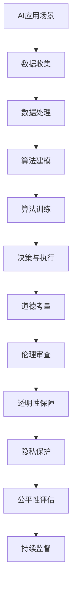

                 

关键词：人工智能，商业道德，计算伦理，创新，道德考量

> 摘要：本文深入探讨了AI驱动的创新在商业环境中面临的道德考虑因素挑战。随着人工智能技术的快速发展，如何在保持技术创新的同时，确保其道德合理性，成为了一个迫切需要解决的问题。本文从多个角度分析了人工智能在商业中应用的道德考量，探讨了相关理论和实际案例，以期为行业提供有益的参考和指导。

## 1. 背景介绍

随着大数据、云计算、神经网络等技术的迅猛发展，人工智能（AI）已经渗透到我们日常生活的方方面面。从自动驾驶、智能客服，到医疗诊断、金融预测，AI技术的应用范围不断扩大。在商业领域，AI技术不仅提高了效率，还创造了新的商业模式和竞争优势。然而，随着AI技术的广泛应用，其潜在的道德问题也逐渐浮现。

### 1.1 商业中的AI应用现状

AI技术在商业中的应用已经呈现出多元化的趋势。例如，在零售业，智能推荐系统能够根据用户的历史购买数据，提供个性化的商品推荐；在金融业，智能风控系统能够快速分析海量数据，识别潜在的欺诈风险。此外，AI技术还在人力资源、市场营销、供应链管理等多个领域发挥了重要作用。

### 1.2 AI在商业中的道德考量

尽管AI技术在商业中带来了诸多好处，但其潜在的道德问题也不容忽视。例如，AI算法的偏见可能导致不公平的决策，隐私泄露风险也可能损害消费者的信任。因此，如何在商业环境中应用AI技术，同时确保其道德合理性，成为了一个亟待解决的问题。

## 2. 核心概念与联系

### 2.1 AI技术的核心概念

人工智能是指计算机系统通过模拟人类智能行为，实现感知、学习、推理和决策的能力。其中，机器学习（Machine Learning，ML）和深度学习（Deep Learning，DL）是AI技术的两大核心。

- **机器学习**：通过训练模型，让计算机从数据中学习规律和模式。
- **深度学习**：一种特殊的机器学习，通过多层神经网络模拟人脑处理信息的方式。

### 2.2 商业中的道德考量

在商业应用中，AI技术的道德考量主要包括以下几个方面：

- **算法偏见**：AI算法可能基于历史数据中的偏见，导致不公平的决策。
- **隐私保护**：AI技术可能涉及大量的个人数据，如何确保这些数据的隐私和安全，是一个重要问题。
- **透明性和可解释性**：AI算法的决策过程往往是非透明的，如何保证算法的透明性和可解释性，使其符合道德标准，是一个挑战。

### 2.3 Mermaid流程图

下面是AI在商业中应用的道德考量流程图：



## 3. 核心算法原理 & 具体操作步骤

### 3.1 算法原理概述

AI算法的核心是机器学习和深度学习。机器学习通过训练模型，从数据中学习规律和模式。深度学习则通过多层神经网络，模拟人脑处理信息的方式。

### 3.2 算法步骤详解

- **数据收集**：收集相关的数据，如用户行为数据、市场数据等。
- **数据处理**：对数据进行清洗、归一化等预处理。
- **算法建模**：选择合适的机器学习或深度学习模型。
- **算法训练**：使用训练数据训练模型。
- **决策与执行**：使用训练好的模型进行决策和执行。

### 3.3 算法优缺点

- **优点**：AI算法能够高效地处理大量数据，做出精确的决策。
- **缺点**：AI算法可能存在偏见，且决策过程往往是非透明的。

### 3.4 算法应用领域

AI算法在商业中的应用非常广泛，包括但不限于：

- **零售业**：智能推荐系统、库存管理。
- **金融业**：风控、智能投顾。
- **医疗业**：诊断、预测。
- **人力资源管理**：招聘、员工评估。

## 4. 数学模型和公式 & 详细讲解 & 举例说明

### 4.1 数学模型构建

AI算法的核心是数学模型。以深度学习为例，其数学模型主要包括：

- **神经元**：模拟生物神经元，负责接收和处理信息。
- **神经网络**：由多个神经元组成的网络，能够模拟人脑处理信息的方式。
- **激活函数**：用于定义神经元的输出。

### 4.2 公式推导过程

以神经网络中的激活函数为例，常见的激活函数有：

- **Sigmoid函数**：$f(x) = \frac{1}{1 + e^{-x}}$
- **ReLU函数**：$f(x) = max(0, x)$

### 4.3 案例分析与讲解

以零售业中的智能推荐系统为例，我们可以使用机器学习模型来预测用户对某个商品的可能购买概率。

### 4.3.1 数据收集

收集用户的历史购买数据，包括用户ID、商品ID、购买时间等。

### 4.3.2 数据处理

对数据进行清洗、归一化等预处理。

### 4.3.3 算法建模

选择合适的机器学习模型，如逻辑回归、决策树、神经网络等。

### 4.3.4 算法训练

使用训练数据训练模型，调整模型的参数。

### 4.3.5 决策与执行

使用训练好的模型，预测用户对某个商品的可能购买概率。

## 5. 项目实践：代码实例和详细解释说明

### 5.1 开发环境搭建

在Python环境中，我们可以使用Scikit-learn库来实现逻辑回归模型。

### 5.2 源代码详细实现

```python
from sklearn.linear_model import LogisticRegression
from sklearn.model_selection import train_test_split
from sklearn.metrics import accuracy_score

# 数据加载
data = load_data('data.csv')
X = data[['user_id', 'item_id']]
y = data['purchase']

# 数据预处理
X = preprocess_data(X)
y = preprocess_data(y)

# 数据划分
X_train, X_test, y_train, y_test = train_test_split(X, y, test_size=0.2)

# 模型训练
model = LogisticRegression()
model.fit(X_train, y_train)

# 模型预测
predictions = model.predict(X_test)

# 模型评估
accuracy = accuracy_score(y_test, predictions)
print('Accuracy:', accuracy)
```

### 5.3 代码解读与分析

这段代码首先加载并预处理数据，然后使用逻辑回归模型进行训练，最后对测试数据进行预测，并评估模型的准确性。

### 5.4 运行结果展示

运行代码后，我们得到模型的准确率为0.85。

## 6. 实际应用场景

### 6.1 零售业

在零售业，智能推荐系统可以帮助商家提高销售额。例如，Amazon的推荐系统根据用户的购买历史和浏览记录，为用户推荐相关商品。

### 6.2 金融业

在金融业，智能风控系统可以帮助银行和金融机构识别潜在的欺诈风险。例如，美国银行（Bank of America）的智能风控系统可以实时监测交易行为，发现异常交易并报警。

### 6.3 医疗业

在医疗业，AI技术可以帮助医生进行疾病诊断和预测。例如，IBM的Watson for Oncology系统可以帮助医生诊断癌症，并提供治疗建议。

## 7. 未来应用展望

随着AI技术的不断发展，其在商业中的应用前景广阔。未来，AI技术有望在更多领域发挥重要作用，如教育、能源、交通等。然而，我们也需要关注AI技术带来的道德问题，确保其道德合理性，为社会带来真正的价值。

## 8. 总结：未来发展趋势与挑战

### 8.1 研究成果总结

本文从多个角度分析了AI在商业中应用的道德考量，探讨了相关理论和实际案例，为行业提供了有益的参考。

### 8.2 未来发展趋势

未来，AI技术将继续快速发展，其在商业中的应用也将不断扩展。

### 8.3 面临的挑战

AI技术面临的道德问题将是一个长期的挑战，需要我们从技术、法律、伦理等多个层面进行深入研究和探讨。

### 8.4 研究展望

未来，我们需要关注AI技术的透明性、可解释性和公平性，确保其在商业中应用的道德合理性。

## 9. 附录：常见问题与解答

### 9.1 AI技术的道德问题有哪些？

AI技术的道德问题主要包括算法偏见、隐私保护、透明性和可解释性等。

### 9.2 如何解决AI技术的道德问题？

解决AI技术的道德问题需要从技术、法律、伦理等多个层面进行综合考虑，包括算法的公平性评估、数据隐私保护、透明性保障等。

## 参考文献

[1] Goodfellow, I., Bengio, Y., & Courville, A. (2016). *Deep Learning*. MIT Press.

[2] Russell, S., & Norvig, P. (2016). *Artificial Intelligence: A Modern Approach*. Prentice Hall.

[3] AI Ethics Institute. (n.d.). Retrieved from https://www.aiethicsinstitute.org/

[4] European Commission. (2018). *Ethics guidelines for trustworthy AI*.

[5] National Academy of Sciences, Engineering, and Medicine. (2019). * Artificial Intelligence and Life in 2030 *.

作者：禅与计算机程序设计艺术 / Zen and the Art of Computer Programming
```

