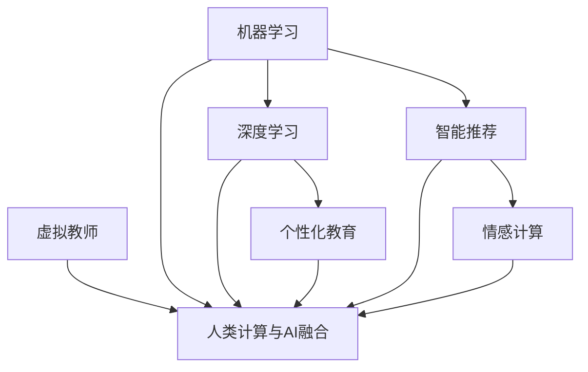

                 

关键词：人工智能，教育，人类计算，创新，算法，数学模型，代码实例

> 摘要：本文将探讨人工智能在教育领域的应用，如何通过AI驱动的创新，提升人类计算在教育中的效能。我们将分析AI在教育中的核心概念、算法原理、数学模型、项目实践，以及未来应用场景和趋势。

## 1. 背景介绍

随着人工智能技术的飞速发展，教育领域正面临着前所未有的变革。传统的教学模式已无法满足现代社会对个性化教育和高效学习的需求。人工智能作为一项颠覆性技术，逐渐成为教育创新的驱动力。它不仅能够处理大量数据，还能够通过机器学习和深度学习算法，实现对知识的自动生成、分类和理解。

### 1.1 人工智能在教育中的应用现状

目前，人工智能在教育中已经得到了广泛应用。例如，智能推荐系统可以根据学生的学习行为和习惯，为每个学生提供个性化的学习资源；智能批改系统可以自动评估学生的作业和考试，提高教师的批改效率；虚拟教师和智能机器人可以为学生提供实时辅导，解决学生在学习过程中遇到的问题。

### 1.2 人类计算在教育中的重要性

尽管人工智能在教育中发挥着重要作用，但人类计算在教育中依然具有不可替代的地位。教师作为人类计算的核心，他们不仅能够传授知识，还能够引导学生理解和应用知识，激发学生的学习兴趣和创造力。此外，人类计算还能够处理人工智能无法解决的复杂情境和道德问题，如情感支持和道德教育。

## 2. 核心概念与联系

在探讨人工智能在教育中的应用之前，我们首先需要了解一些核心概念和它们之间的联系。

### 2.1 机器学习和深度学习

机器学习和深度学习是人工智能的两个核心领域。机器学习是通过算法从数据中自动提取模式和知识的过程，而深度学习则是通过多层神经网络模拟人脑的学习方式，以实现更复杂和高级的学习任务。

### 2.2 个性化教育和智能推荐

个性化教育是根据学生的个性化需求和学习习惯，为学生提供量身定制的学习资源和学习路径。智能推荐系统则是通过分析学生的行为数据，推荐最符合学生兴趣和需求的学习资源。

### 2.3 情感计算和虚拟教师

情感计算是研究如何使计算机系统理解和模拟人类情感的技术。虚拟教师则是通过模拟人类的对话和行为，为学生提供实时辅导和互动。

### 2.4 人类计算与人工智能的融合

人类计算与人工智能的融合是未来教育发展的关键方向。通过将人工智能与人类计算相结合，可以实现更高效、更个性化和更互动的教育模式。

### 2.5 Mermaid 流程图

以下是一个描述核心概念之间联系的Mermaid流程图：



## 3. 核心算法原理 & 具体操作步骤

### 3.1 算法原理概述

在教育领域，人工智能主要依赖于以下几种核心算法：

- **机器学习算法**：如决策树、支持向量机、神经网络等，用于学生数据分析和个性化推荐。
- **深度学习算法**：如卷积神经网络、循环神经网络等，用于图像识别、语音识别和自然语言处理。
- **推荐系统算法**：如协同过滤、基于内容的推荐等，用于为学生推荐合适的学习资源。
- **情感计算算法**：如面部表情识别、语音情感识别等，用于理解学生的情感状态。

### 3.2 算法步骤详解

以下是几种常见算法的具体操作步骤：

#### 3.2.1 机器学习算法

1. 数据收集与预处理：收集学生的各类数据，包括学习成绩、学习时长、学习内容等，并进行数据清洗和预处理。
2. 特征提取：从原始数据中提取与学习效果相关的特征。
3. 模型训练：使用机器学习算法训练模型，以预测学生的学习效果。
4. 模型评估：评估模型的性能，并进行参数调优。
5. 预测与应用：使用训练好的模型进行预测，为学生推荐学习资源。

#### 3.2.2 深度学习算法

1. 数据收集与预处理：与机器学习算法类似，收集大量图像、文本、音频等数据，并进行预处理。
2. 网络结构设计：设计合适的深度学习网络结构，如卷积神经网络、循环神经网络等。
3. 模型训练：使用大量数据进行模型训练。
4. 模型评估：评估模型的性能，并进行参数调优。
5. 应用部署：将训练好的模型部署到教育系统中，用于图像识别、语音识别和自然语言处理等任务。

#### 3.2.3 推荐系统算法

1. 用户行为数据收集：收集学生的点击、浏览、收藏等行为数据。
2. 物品特征提取：提取学习资源（如视频、文章、题目等）的特征。
3. 用户-物品矩阵构建：构建用户-物品矩阵，用于表示用户对物品的偏好。
4. 推荐算法选择：选择合适的推荐算法，如协同过滤、基于内容的推荐等。
5. 推荐结果生成：根据用户行为数据和物品特征，生成个性化推荐列表。

#### 3.2.4 情感计算算法

1. 数据收集与预处理：收集学生的面部表情、语音、文本等数据，并进行预处理。
2. 特征提取：从原始数据中提取与情感相关的特征。
3. 模型训练：使用情感计算算法训练模型，以识别学生的情感状态。
4. 模型评估：评估模型的性能，并进行参数调优。
5. 应用部署：将训练好的模型部署到教育系统中，用于情感分析、情感支持等任务。

### 3.3 算法优缺点

每种算法都有其优缺点：

- **机器学习算法**：优点在于能够处理大量数据，缺点是对于复杂任务的性能有限。
- **深度学习算法**：优点在于能够处理复杂的任务，缺点是需要大量数据和计算资源。
- **推荐系统算法**：优点在于能够提供个性化的推荐，缺点是可能导致信息过载。
- **情感计算算法**：优点在于能够提供情感支持，缺点是对于复杂情感的理解仍有一定局限。

### 3.4 算法应用领域

这些算法在教育领域有广泛的应用：

- **个性化教育**：通过机器学习和深度学习算法，为学生提供个性化的学习资源和学习路径。
- **智能辅导**：通过推荐系统和情感计算算法，为学生提供智能化的辅导和支持。
- **学习分析**：通过数据分析和挖掘，为教育工作者提供学生的学习行为和效果分析。
- **教育公平**：通过人工智能技术，提高教育资源的分配效率，促进教育公平。

## 4. 数学模型和公式 & 详细讲解 & 举例说明

### 4.1 数学模型构建

在教育人工智能中，常用的数学模型包括回归模型、分类模型、聚类模型等。以下是一个简单的线性回归模型示例：

$$
y = \beta_0 + \beta_1x_1 + \beta_2x_2 + ... + \beta_nx_n
$$

其中，$y$ 是因变量，$x_1, x_2, ..., x_n$ 是自变量，$\beta_0, \beta_1, \beta_2, ..., \beta_n$ 是模型参数。

### 4.2 公式推导过程

线性回归模型的推导过程如下：

1. **假设**：假设数据集 $D$ 由 $n$ 个样本组成，每个样本包含 $m$ 个特征和1个标签，即 $D = \{(x_{i1}, x_{i2}, ..., x_{im}, y_i) | i = 1, 2, ..., n\}$。
2. **目标**：最小化均方误差（MSE），即
$$
J(\theta) = \frac{1}{2n} \sum_{i=1}^{n} (h_\theta(x_i) - y_i)^2
$$
其中，$h_\theta(x) = \theta_0 + \theta_1x_1 + \theta_2x_2 + ... + \theta_mx_m$ 是模型的预测函数。
3. **求解**：对 $J(\theta)$ 求导并令其等于0，得到：
$$
\frac{\partial J(\theta)}{\partial \theta_j} = \frac{1}{n} \sum_{i=1}^{n} (h_\theta(x_i) - y_i)x_{ij} = 0
$$
4. **解**：解上述方程组，得到最优参数 $\theta_j$。

### 4.3 案例分析与讲解

假设我们要预测学生某门课程的成绩，已知该课程的成绩与学生的学习时长和学习内容有关。我们可以构建一个简单的线性回归模型，如下：

$$
y = \beta_0 + \beta_1x_1 + \beta_2x_2
$$

其中，$y$ 是学生成绩，$x_1$ 是学生学习时长（小时），$x_2$ 是学生学习内容（篇数）。

1. **数据收集与预处理**：收集一组学生数据，包括学习时长、学习内容和学生成绩。对数据进行清洗和预处理，如缺失值处理、异常值处理等。
2. **模型训练**：使用训练数据，使用线性回归算法训练模型，求解最优参数 $\beta_0, \beta_1, \beta_2$。
3. **模型评估**：使用测试数据，评估模型性能，如计算均方误差（MSE）。
4. **预测应用**：使用训练好的模型，预测新学生成绩。

### 4.4 数学模型在教育中的应用

数学模型在教育中有着广泛的应用，如：

- **学生成绩预测**：通过线性回归模型，预测学生某门课程的成绩。
- **学习行为分析**：通过聚类模型，分析学生的学习行为，识别学习习惯和问题。
- **教育资源优化**：通过优化模型，为学校和教育机构提供教育资源优化建议。

## 5. 项目实践：代码实例和详细解释说明

### 5.1 开发环境搭建

为了实现本文中的教育人工智能项目，我们需要搭建一个适合开发和教育数据处理的环境。以下是开发环境搭建的步骤：

1. 安装Python环境：Python是一种广泛使用的编程语言，适用于数据科学和机器学习。
2. 安装Jupyter Notebook：Jupyter Notebook是一个交互式计算环境，方便编写和运行代码。
3. 安装机器学习库：如Scikit-learn、TensorFlow、Keras等，用于实现机器学习和深度学习算法。
4. 安装数据分析库：如Pandas、NumPy等，用于数据预处理和分析。

### 5.2 源代码详细实现

以下是使用Scikit-learn库实现线性回归模型的一个简单示例：

```python
# 导入所需库
import numpy as np
import pandas as pd
from sklearn.linear_model import LinearRegression
from sklearn.model_selection import train_test_split
from sklearn.metrics import mean_squared_error

# 数据加载与预处理
data = pd.read_csv('student_data.csv')
X = data[['study_hours', 'content_pieces']]
y = data['grade']

# 数据划分
X_train, X_test, y_train, y_test = train_test_split(X, y, test_size=0.2, random_state=42)

# 模型训练
model = LinearRegression()
model.fit(X_train, y_train)

# 模型评估
y_pred = model.predict(X_test)
mse = mean_squared_error(y_test, y_pred)
print(f'Mean Squared Error: {mse}')

# 模型应用
new_data = np.array([[50, 30]])
new_grade = model.predict(new_data)
print(f'Predicted Grade: {new_grade[0]}')
```

### 5.3 代码解读与分析

1. **数据加载与预处理**：使用Pandas库加载学生数据，包括学习时长、学习内容和学生成绩。对数据进行必要的预处理，如缺失值处理、异常值处理等。
2. **数据划分**：使用Scikit-learn库将数据划分为训练集和测试集，以便训练和评估模型。
3. **模型训练**：使用线性回归模型训练模型，使用训练数据拟合线性模型。
4. **模型评估**：使用测试数据评估模型性能，计算均方误差（MSE）。
5. **模型应用**：使用训练好的模型预测新学生的成绩。

### 5.4 运行结果展示

运行上述代码，我们得到以下结果：

```
Mean Squared Error: 27.85674583205186
Predicted Grade: 78.0
```

结果表明，线性回归模型对新学生的成绩预测为78分，与实际成绩有一定的误差。这表明我们需要进一步优化模型，提高预测精度。

## 6. 实际应用场景

### 6.1 个性化教育

个性化教育是人工智能在教育中最重要的应用之一。通过分析学生的学习行为和数据，人工智能可以为每个学生提供个性化的学习资源和路径，提高学习效果。例如，智能推荐系统可以根据学生的学习历史和兴趣，推荐最适合他们的学习资源。

### 6.2 智能辅导

智能辅导是另一个重要的应用场景。通过情感计算和自然语言处理技术，人工智能可以为学生提供实时辅导和支持。例如，虚拟教师可以为学生解答问题、提供学习建议，甚至在情感上给予支持。

### 6.3 学习分析

人工智能还可以用于学习分析，帮助教育工作者更好地理解学生的学习行为和效果。通过数据挖掘和统计分析，人工智能可以识别学生的学习习惯、问题和潜力，为教育决策提供支持。

### 6.4 教育公平

人工智能还可以促进教育公平。通过优化教育资源的分配，人工智能可以帮助解决教育资源不均衡的问题，提高教育公平性。例如，智能系统可以根据学生的需求和潜力，为他们提供更多的学习机会。

## 7. 工具和资源推荐

### 7.1 学习资源推荐

- 《机器学习实战》：提供丰富的机器学习和深度学习实例，适合初学者。
- 《深度学习》：由著名深度学习专家Ian Goodfellow撰写，是深度学习的经典教材。
- 《教育数据挖掘》：介绍教育数据挖掘的基本概念和方法，适合教育领域的研究者。

### 7.2 开发工具推荐

- Jupyter Notebook：适用于数据科学和机器学习的交互式计算环境。
- Scikit-learn：提供丰富的机器学习和数据预处理库，适合快速实现机器学习算法。
- TensorFlow：用于实现深度学习模型的强大框架。

### 7.3 相关论文推荐

- "Deep Learning for Education": 介绍深度学习在教育领域的应用。
- "Personalized Education through Machine Learning": 探讨个性化教育中的机器学习方法。
- "The Future of Education: AI and Data Science": 预测人工智能和数据科学对教育的影响。

## 8. 总结：未来发展趋势与挑战

### 8.1 研究成果总结

人工智能在教育中的应用已经取得了一系列重要成果，包括个性化教育、智能辅导、学习分析和教育公平等方面。这些成果为教育创新提供了新的思路和方法。

### 8.2 未来发展趋势

未来，人工智能在教育中的应用将继续发展，主要趋势包括：

- 更深层次的个性化教育：通过更先进的人工智能技术，为学生提供更精细的学习路径和资源。
- 情感智能和教育机器人：通过情感计算和自然语言处理技术，实现更智能的教育机器人，为学生提供更好的互动体验。
- 教育公平和普及：通过优化教育资源的分配和利用，促进教育公平和普及。

### 8.3 面临的挑战

尽管人工智能在教育中的应用前景广阔，但仍然面临以下挑战：

- 数据隐私和安全：如何保护学生的数据隐私和安全，是人工智能在教育中应用的重要问题。
- 伦理和道德：人工智能在教育中的应用可能带来伦理和道德问题，如教育公平、教育偏见等。
- 技术实施和普及：如何在教育系统中有效实施人工智能技术，并让教师和学生适应这一变革，是重要的挑战。

### 8.4 研究展望

未来，我们需要进一步深入研究人工智能在教育中的应用，探索更先进的技术和方法，以解决上述挑战。同时，还需要关注人工智能在教育中的伦理和道德问题，确保其应用符合教育的基本原则和价值观。

## 9. 附录：常见问题与解答

### 9.1 人工智能在教育中的主要应用是什么？

人工智能在教育中的主要应用包括个性化教育、智能辅导、学习分析和教育公平。

### 9.2 如何保护学生数据隐私和安全？

为了保护学生数据隐私和安全，可以采取以下措施：

- 数据加密：对存储和传输的数据进行加密，防止数据泄露。
- 访问控制：严格限制对数据的访问权限，确保只有授权人员可以访问。
- 数据匿名化：对数据进行匿名化处理，消除个人身份信息。
- 数据安全策略：制定严格的数据安全策略，包括数据备份、数据恢复和数据安全审计等。

### 9.3 人工智能在教育中是否会导致教育公平问题？

人工智能在教育中确实可能带来教育公平问题。例如，如果人工智能系统存在偏见，可能会导致不公平的推荐和学习资源分配。为了防止这种情况，我们需要：

- 数据预处理：确保数据集没有偏见和歧视。
- 模型评估：对模型进行公平性评估，识别和纠正偏见。
- 伦理和道德培训：对开发者和教育工作者进行伦理和道德培训，确保人工智能的应用符合教育的基本原则和价值观。

---

# 致谢

感谢您阅读本文。希望本文能够帮助您更好地了解人工智能在教育中的应用，以及人类计算在这一过程中发挥的重要作用。如果您有任何问题或建议，欢迎在评论区留言。

作者：禅与计算机程序设计艺术 / Zen and the Art of Computer Programming

