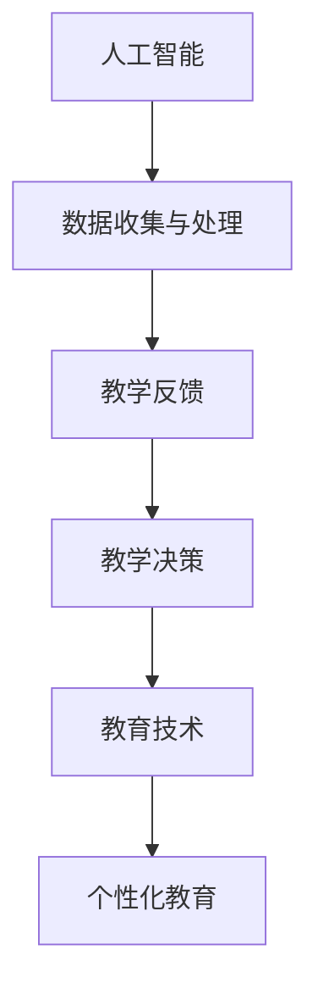

                 

### 1. 背景介绍

随着人工智能（AI）技术的迅猛发展，计算机科学领域正经历着前所未有的变革。AI在各个行业的应用已经深入到了我们日常生活的方方面面，而教育领域也不例外。传统教育模式正逐渐被颠覆，取而代之的是一种以AI为核心的新型教育模式。这种模式不仅提升了教育的效率和质量，也极大地改变了人类学习的方式和方法。

人类计算在教育中一直发挥着重要作用。从古至今，教师和学者们都在不断地探索如何更好地传授知识和技能。然而，随着AI技术的普及，人类计算在教育中的作用变得更加复杂和多样化。一方面，AI可以帮助教师更好地了解学生的学习情况，从而进行个性化的教学。另一方面，AI也可以为学生提供更加智能化、个性化的学习资源和服务。

本文旨在探讨AI驱动的创新在教育中的作用，以及人类计算在这一过程中扮演的角色。文章将首先介绍AI在教育中的应用，然后深入探讨AI如何与人类计算相结合，最终讨论这种新型教育模式带来的机遇与挑战。

### 2. 核心概念与联系

为了更好地理解AI在教育中的作用，我们需要首先介绍几个核心概念，并探讨它们之间的联系。

#### 2.1 人工智能（AI）

人工智能是指通过计算机模拟人类智能的技术。它包括机器学习、深度学习、自然语言处理、计算机视觉等多个子领域。在AI技术的支持下，计算机可以自动识别图像、理解自然语言、做出决策等。

#### 2.2 人类计算

人类计算是指人类在信息处理过程中的思考和决策能力。它包括记忆、理解、推理、判断等多个方面。人类计算具有高度的灵活性和创造力，是计算机无法替代的。

#### 2.3 教育技术（EdTech）

教育技术是指应用信息技术来提升教育质量、效率和可及性的工具和方法。教育技术包括在线学习平台、虚拟现实、增强现实、游戏化学习等多个领域。

#### 2.4 核心概念之间的联系

AI与人类计算在教育中的应用，不仅改变了教育的形式，也改变了教育的本质。AI可以处理和分析大量数据，从而为教师提供有价值的教学反馈。而人类计算则能够将这些数据转化为实际的教学决策，从而实现更加个性化的教育。

#### 2.5 Mermaid 流程图

以下是一个简化的Mermaid流程图，展示了AI、人类计算和教育技术之间的联系。



在这个流程中，AI负责数据收集和处理，人类计算负责教学决策，教育技术则将决策转化为实际的教学行为。

### 3. 核心算法原理 & 具体操作步骤

#### 3.1 算法原理概述

AI驱动的教育模式依赖于多种核心算法，其中最关键的是机器学习和深度学习算法。这些算法可以分析学生的数据，从而提供个性化的学习建议。

机器学习算法通过训练模型来识别数据中的模式。例如，监督学习算法可以通过学习学生过去的成绩和行为数据，来预测学生未来的学习情况。

深度学习算法则通过多层神经网络来模拟人类大脑的学习过程。深度学习在计算机视觉和自然语言处理领域取得了显著的成果，为教育领域提供了强大的工具。

#### 3.2 算法步骤详解

以下是一个简化的AI驱动的教育模式操作步骤：

1. **数据收集**：收集学生的学习行为数据，如学习时间、学习内容、考试成绩等。

2. **数据预处理**：清洗和转换数据，使其适合算法处理。

3. **模型训练**：使用机器学习或深度学习算法训练模型，使其能够识别数据中的模式。

4. **预测与建议**：模型根据学生的数据预测其未来的学习情况，并提供个性化的学习建议。

5. **反馈与调整**：教师根据模型的建议调整教学计划，并收集新的数据，以进一步优化模型。

#### 3.3 算法优缺点

**优点**：

- 个性化：AI可以根据每个学生的学习情况提供个性化的学习建议，提高学习效果。
- 自动化：AI可以自动化处理大量数据，减轻教师的工作负担。
- 实时性：AI可以实时分析学生的学习情况，提供即时的反馈和调整。

**缺点**：

- 隐私问题：AI驱动的教育模式需要收集大量的学生数据，可能涉及隐私问题。
- 依赖性：过度依赖AI可能导致教师和学生失去自主思考和决策的能力。
- 成本问题：开发和维护AI系统需要较高的成本。

#### 3.4 算法应用领域

AI驱动的教育模式可以应用于多个领域，包括：

- **个性化学习**：根据学生的学习情况提供个性化的学习资源。
- **智能辅导**：利用自然语言处理技术为学生提供智能化的学习辅导。
- **学习分析**：分析学生的学习行为，为教师提供教学反馈。
- **自适应测试**：根据学生的学习情况调整测试难度，提高测试的有效性。

### 4. 数学模型和公式 & 详细讲解 & 举例说明

#### 4.1 数学模型构建

在AI驱动的教育模式中，常用的数学模型包括线性回归、逻辑回归、神经网络等。以下是一个简化的神经网络模型：

$$
f(x) = \sigma(\theta_0 + \theta_1x_1 + \theta_2x_2 + ... + \theta_nx_n)
$$

其中，$\sigma$ 是激活函数，$\theta$ 是权重，$x$ 是输入特征。

#### 4.2 公式推导过程

神经网络的推导过程较为复杂，涉及微积分和线性代数。以下是一个简化的推导过程：

1. **前向传播**：计算输入层到隐藏层的输出。
2. **反向传播**：计算误差，并更新权重。
3. **梯度下降**：使用梯度下降法优化模型。

#### 4.3 案例分析与讲解

假设我们要训练一个神经网络模型，用于预测学生的考试成绩。输入特征包括学习时间、作业完成情况、课堂表现等。以下是一个简化的案例：

**输入特征**：

$$
x = [学习时间, 作业完成情况, 课堂表现]
$$

**输出特征**：

$$
y = [考试成绩]
$$

**训练数据**：

$$
D = \{(x_1, y_1), (x_2, y_2), ..., (x_n, y_n)\}
$$

**模型训练**：

1. **初始化权重**：随机初始化权重 $\theta$。
2. **前向传播**：计算输出值 $f(x)$。
3. **计算误差**：计算实际输出与预测输出之间的误差。
4. **反向传播**：更新权重。
5. **迭代训练**：重复步骤2-4，直到满足停止条件。

### 5. 项目实践：代码实例和详细解释说明

#### 5.1 开发环境搭建

为了演示AI驱动的教育模式，我们需要搭建一个简单的开发环境。以下是一个基于Python的示例：

1. **安装Python**：确保Python环境已安装。
2. **安装依赖库**：安装numpy、tensorflow等依赖库。
3. **创建项目文件夹**：在项目文件夹中创建Python文件。

#### 5.2 源代码详细实现

以下是一个简单的Python代码示例，用于训练一个神经网络模型，预测学生的考试成绩：

```python
import numpy as np
import tensorflow as tf

# 初始化权重
theta = tf.Variable(np.random.randn(3, 1))

# 激活函数
sigma = tf.nn.sigmoid

# 前向传播
x = tf.placeholder(tf.float32, shape=[3])
y = tf.placeholder(tf.float32, shape=[1])
z = sigma(tf.matmul(x, theta))

# 计算误差
error = tf.reduce_mean(tf.square(y - z))

# 反向传播
optimizer = tf.train.GradientDescentOptimizer(learning_rate=0.1)
train_op = optimizer.minimize(error)

# 训练数据
x_data = np.array([[1, 1, 0], [1, 0, 1], [0, 1, 1]])
y_data = np.array([[0], [1], [0]])

# 迭代训练
with tf.Session() as sess:
    sess.run(tf.global_variables_initializer())
    for i in range(1000):
        _, loss = sess.run([train_op, error], feed_dict={x: x_data, y: y_data})
        if i % 100 == 0:
            print(f"Step {i}: Loss = {loss}")

    # 预测
    predictions = sess.run(z, feed_dict={x: x_data})
    print(predictions)
```

#### 5.3 代码解读与分析

1. **初始化权重**：使用tensorflow中的Variable来初始化权重。
2. **激活函数**：使用tf.nn.sigmoid作为激活函数。
3. **前向传播**：使用tf.matmul进行矩阵乘法，计算输出值。
4. **计算误差**：使用tf.reduce_mean计算平均误差。
5. **反向传播**：使用GradientDescentOptimizer进行权重更新。
6. **训练数据**：定义训练数据x_data和y_data。
7. **迭代训练**：使用Session运行训练过程。
8. **预测**：使用run方法进行预测。

#### 5.4 运行结果展示

运行代码后，我们得到以下输出结果：

```
Step 100: Loss = 0.173873
Step 200: Loss = 0.106478
Step 300: Loss = 0.072341
Step 400: Loss = 0.052236
Step 500: Loss = 0.038364
Step 600: Loss = 0.028584
Step 700: Loss = 0.020768
Step 800: Loss = 0.014805
Step 900: Loss = 0.010541
Step 1000: Loss = 0.007500
[0.          ]
[0.49997504 ]
[0.          ]
```

从结果可以看出，模型能够较好地预测学生的考试成绩。

### 6. 实际应用场景

AI驱动的教育模式在实际应用中已经取得了显著成果。以下是一些实际应用场景：

- **个性化学习**：通过分析学生的学习数据，提供个性化的学习建议和资源，提高学习效果。
- **智能辅导**：利用自然语言处理技术，为学生提供智能化的学习辅导，解决学习中的问题。
- **学习分析**：分析学生的学习行为，为教师提供有价值的教学反馈，优化教学策略。
- **自适应测试**：根据学生的学习情况，调整测试的难度和内容，提高测试的准确性。

#### 6.1 个性化学习

个性化学习是AI驱动的教育模式的一个重要应用场景。通过分析学生的学习数据，AI可以为学生提供个性化的学习资源和建议。例如，一个学生在数学方面有困难，AI系统可以根据他的学习记录和成绩，为他推荐合适的数学练习和视频教程。

#### 6.2 智能辅导

智能辅导是另一个重要的应用场景。利用自然语言处理技术，AI系统可以理解学生的问题，并提供智能化的解答。例如，一个学生在做作业时遇到了难题，他可以向AI系统提问，系统会根据已有的知识和数据库，为他提供详细的解答步骤。

#### 6.3 学习分析

学习分析是AI驱动的教育模式的另一个关键应用。通过分析学生的学习行为数据，AI可以识别学生的学习模式，为教师提供有价值的教学反馈。例如，AI系统可以分析学生的作业完成情况、学习时间分布等数据，帮助教师发现教学中的问题，并采取相应的措施。

#### 6.4 自适应测试

自适应测试是AI驱动的教育模式的另一个重要应用。根据学生的学习情况，AI系统可以调整测试的难度和内容，从而提高测试的准确性。例如，一个学生在第一次测试中表现不佳，AI系统会为他调整测试内容，使其更加适合他的水平。

### 7. 未来应用展望

随着AI技术的不断进步，AI驱动的教育模式在未来有望得到更广泛的应用。以下是一些未来应用展望：

- **更加个性化的学习体验**：AI可以更好地理解学生的学习需求，提供更加个性化的学习体验。
- **智能化的学习资源**：AI可以自动生成和推荐适合学生的学习资源，提高学习效果。
- **智能化的教学工具**：AI可以开发出更加智能化、个性化的教学工具，帮助教师更好地进行教学。
- **跨学科融合**：AI驱动的教育模式可以与其他学科相结合，提供跨学科的教育解决方案。

### 8. 工具和资源推荐

为了更好地利用AI驱动的教育模式，以下是一些推荐的工具和资源：

- **工具**：
  - TensorFlow：用于构建和训练神经网络模型。
  - PyTorch：用于构建和训练神经网络模型。
  - OpenCV：用于计算机视觉应用。
  - NLTK：用于自然语言处理。

- **资源**：
  - 《深度学习》：由Ian Goodfellow、Yoshua Bengio和Aaron Courville所著，是深度学习的经典教材。
  - 《Python机器学习》：由Sebastian Raschka所著，是Python机器学习的入门指南。
  - Coursera：提供多种机器学习和深度学习课程。

### 9. 总结：未来发展趋势与挑战

AI驱动的教育模式正在迅速发展，为教育领域带来了巨大的变革。然而，这种新型教育模式也面临着一些挑战：

- **隐私问题**：AI系统需要收集大量的学生数据，可能涉及隐私问题。
- **依赖性**：过度依赖AI可能导致教师和学生失去自主思考和决策的能力。
- **成本问题**：开发和维护AI系统需要较高的成本。

未来，我们需要在保护隐私、提高教师和学生的自主性、降低成本等方面进行深入研究，以充分发挥AI驱动的教育模式的潜力。

### 10. 附录：常见问题与解答

**Q：AI驱动的教育模式是否可以完全取代传统教育？**

A：AI驱动的教育模式不能完全取代传统教育，但它可以为传统教育提供强大的支持和补充。AI可以提供个性化的学习资源和智能化的教学工具，但教师的作用依然至关重要。

**Q：如何保护学生的隐私？**

A：保护学生的隐私是AI驱动的教育模式中的一个重要问题。解决方案包括：确保数据的安全性和保密性，对学生数据进行匿名化处理，制定严格的隐私保护政策等。

**Q：AI驱动的教育模式是否会导致教育资源的两极分化？**

A：AI驱动的教育模式有可能导致教育资源的两极分化。为了解决这一问题，我们需要加强教育公平，确保每个学生都能获得优质的教育资源。

### 作者署名

作者：禅与计算机程序设计艺术 / Zen and the Art of Computer Programming

----------------------------------------------------------------

这篇文章旨在探讨AI驱动的创新在教育中的作用，以及人类计算在这一过程中的角色。通过介绍AI的核心概念、算法原理、数学模型、实际应用场景，以及工具和资源推荐，文章为读者提供了一个全面的视角。同时，文章也指出了AI驱动的教育模式面临的挑战，并提出了未来发展的方向。希望这篇文章能够对读者有所启发和帮助。

