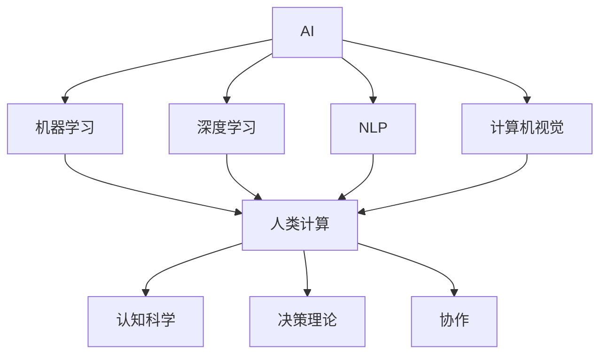

                 

在这个快速发展的数字时代，人工智能（AI）已经成为推动技术进步的关键动力。它正在深刻地改变着各行各业，从医疗保健到金融，从制造业到娱乐，无不留下AI的印记。本文将探讨AI如何驱动创新，并探讨人类计算在未来的工作中将扮演的角色。

## 关键词

- 人工智能
- 创新驱动
- 人类计算
- 未来工作
- 技术进步

## 摘要

本文首先介绍了AI驱动的创新背景，分析了AI的核心概念和原理，并探讨了AI在各个领域中的应用。接着，文章深入讨论了人类计算在未来工作中的重要性，以及如何与AI相结合来提高工作效率。最后，文章提出了未来AI发展的趋势和面临的挑战，并展望了人类计算与AI融合的未来。

### 1. 背景介绍

人工智能（Artificial Intelligence，简称AI）是计算机科学的一个分支，旨在使机器能够模拟、延伸和扩展人类的智能行为。自20世纪50年代以来，AI领域经历了多个发展周期，从早期的符号主义和知识表示，到连接主义和深度学习，再到当前的多模态交互和强化学习。

随着计算能力的提升和大数据技术的发展，AI的应用场景不断扩展。AI不仅可以处理大量数据，还可以通过机器学习和深度学习算法从数据中提取知识，从而做出智能决策。这种能力使得AI在许多领域都展现了巨大的潜力，如自动驾驶、自然语言处理、图像识别、医疗诊断和金融风控等。

人类计算（Human Computing）则是指人类通过思考、决策和协作来解决复杂问题的过程。在AI尚未普及的早期，人类计算是解决问题的主要手段。即使今天，人类计算在许多领域仍然发挥着不可替代的作用，尤其是在那些需要创造性和复杂判断的任务中。

### 2. 核心概念与联系

#### 2.1 AI的核心概念

AI的核心概念包括：

- **机器学习（Machine Learning）**：一种通过数据驱动的方式来训练模型，使其能够进行预测或决策的技术。
- **深度学习（Deep Learning）**：一种基于多层神经网络进行训练的学习方法，可以处理复杂的非线性问题。
- **自然语言处理（Natural Language Processing，NLP）**：使计算机能够理解和处理人类语言的技术。
- **计算机视觉（Computer Vision）**：使计算机能够理解和解释数字图像或视频的技术。

#### 2.2 人类计算的核心概念

人类计算的核心概念包括：

- **认知科学（Cognitive Science）**：研究人类思维和认知过程的跨学科领域。
- **决策理论（Decision Theory）**：研究决策过程和决策结果的理论。
- **协作（Collaboration）**：多个个体或团队共同完成任务的互动过程。

#### 2.3 AI与人类计算的联系

AI与人类计算之间的联系体现在以下几个方面：

- **协同工作**：AI可以辅助人类进行复杂计算和决策，从而提高工作效率。
- **人机交互**：AI可以通过自然语言处理和计算机视觉与人类进行交互，从而提供个性化的服务。
- **知识共享**：AI可以通过大数据分析和机器学习算法，从人类行为和决策中提取知识，为人类提供更好的建议。

#### 2.4 Mermaid 流程图



### 3. 核心算法原理 & 具体操作步骤

#### 3.1 算法原理概述

AI的核心算法包括：

- **神经网络（Neural Networks）**：模拟生物神经系统的计算模型，用于图像识别、语音识别等领域。
- **决策树（Decision Trees）**：基于一系列规则对数据进行分类或回归的算法，常用于数据分析。
- **支持向量机（Support Vector Machines，SVM）**：通过构建最优分割超平面来对数据进行分类的算法，广泛用于文本分类、图像识别等。

#### 3.2 算法步骤详解

以神经网络为例，其基本步骤包括：

1. **数据预处理**：对输入数据进行标准化和归一化处理。
2. **构建神经网络模型**：定义网络结构，包括输入层、隐藏层和输出层。
3. **前向传播**：将输入数据通过神经网络传递，计算每个神经元的输出。
4. **反向传播**：计算误差，并更新网络权重和偏置，以减少误差。
5. **迭代训练**：重复前向传播和反向传播，直到达到预定的训练次数或误差目标。

#### 3.3 算法优缺点

- **神经网络**：优点在于可以处理复杂的非线性问题，但缺点是训练过程需要大量数据和计算资源。
- **决策树**：优点是易于理解和解释，但缺点是可能产生过拟合。
- **支持向量机**：优点是分类效果好，但缺点是计算复杂度较高。

#### 3.4 算法应用领域

- **神经网络**：广泛应用于图像识别、语音识别和自然语言处理等领域。
- **决策树**：常用于数据分析和金融风控。
- **支持向量机**：广泛应用于文本分类和图像识别。

### 4. 数学模型和公式 & 详细讲解 & 举例说明

#### 4.1 数学模型构建

以神经网络中的反向传播算法为例，其核心公式为：

$$
\delta_{ij} = \frac{\partial C}{\partial z_j} \cdot \frac{\partial z_j}{\partial a_i}
$$

其中，$\delta_{ij}$ 为第 $i$ 个神经元在第 $j$ 个隐藏层的误差项，$C$ 为总损失函数，$z_j$ 为第 $j$ 个隐藏层的输出，$a_i$ 为第 $i$ 个输入层的输出。

#### 4.2 公式推导过程

反向传播算法的推导过程涉及多个步骤，包括损失函数的导数、激活函数的导数等。以下是简要的推导过程：

1. **定义损失函数**：通常使用均方误差（MSE）作为损失函数：
$$
C = \frac{1}{2} \sum_{i=1}^{n} (y_i - \hat{y}_i)^2
$$
其中，$y_i$ 为实际输出，$\hat{y}_i$ 为预测输出。

2. **计算总误差**：通过链式法则计算总误差对输入层的偏导数：
$$
\frac{\partial C}{\partial z_j} = \frac{\partial C}{\partial a_i} \cdot \frac{\partial a_i}{\partial z_j}
$$

3. **计算误差传播**：从输出层向输入层反向传播误差：
$$
\delta_{ij} = \frac{\partial C}{\partial z_j} \cdot \frac{\partial z_j}{\partial a_i}
$$

4. **更新权重和偏置**：根据误差更新网络权重和偏置：
$$
w_{ij}^{(l)} := w_{ij}^{(l)} - \alpha \cdot \delta_{ij} \cdot a_j^{(l-1)}
$$
$$
b_{j}^{(l)} := b_{j}^{(l)} - \alpha \cdot \delta_{ij}
$$

#### 4.3 案例分析与讲解

以手写数字识别为例，使用神经网络进行手写数字识别的过程如下：

1. **数据准备**：收集大量手写数字图像，并进行预处理，如大小调整、灰度化等。

2. **构建神经网络**：定义输入层、隐藏层和输出层，选择合适的激活函数和损失函数。

3. **训练神经网络**：使用反向传播算法对神经网络进行训练，通过迭代更新网络权重和偏置。

4. **评估神经网络**：使用测试集对训练好的神经网络进行评估，计算准确率。

5. **应用神经网络**：将神经网络应用到实际场景中，如手机输入法的手写识别。

### 5. 项目实践：代码实例和详细解释说明

#### 5.1 开发环境搭建

在Python中，可以使用TensorFlow或PyTorch等库来搭建神经网络。以下是使用TensorFlow搭建神经网络的示例代码：

```python
import tensorflow as tf
from tensorflow.keras.layers import Dense
from tensorflow.keras.models import Sequential

# 构建神经网络模型
model = Sequential()
model.add(Dense(128, input_shape=(784,), activation='relu'))
model.add(Dense(64, activation='relu'))
model.add(Dense(10, activation='softmax'))

# 编译模型
model.compile(optimizer='adam',
              loss='categorical_crossentropy',
              metrics=['accuracy'])

# 加载MNIST数据集
(x_train, y_train), (x_test, y_test) = tf.keras.datasets.mnist.load_data()

# 预处理数据
x_train = x_train.reshape(-1, 784).astype('float32') / 255
x_test = x_test.reshape(-1, 784).astype('float32') / 255

# 将标签转换为one-hot编码
y_train = tf.keras.utils.to_categorical(y_train, num_classes=10)
y_test = tf.keras.utils.to_categorical(y_test, num_classes=10)

# 训练模型
model.fit(x_train, y_train, epochs=5, batch_size=128)
```

#### 5.2 源代码详细实现

在上面的代码中，我们首先导入了TensorFlow库，并定义了一个序列模型（Sequential），该模型包含两个隐藏层，每层都有ReLU激活函数。我们使用`Dense`层来构建网络，并设置了输出层的神经元数量为10（对应10个数字类别），使用softmax激活函数。

接下来，我们编译模型，选择`adam`优化器和`categorical_crossentropy`损失函数，并指定`accuracy`作为评估指标。

然后，我们加载了MNIST数据集，并对输入数据进行预处理，包括调整大小、灰度化和标准化。我们将标签转换为one-hot编码，并使用`fit`函数对模型进行训练，设置训练轮次为5，批量大小为128。

#### 5.3 代码解读与分析

在这个代码示例中，我们首先导入了TensorFlow库，并定义了一个序列模型（Sequential）。序列模型是一种线性堆叠层的方式，可以简化神经网络的构建。我们添加了两个隐藏层，每层都有128个神经元和64个神经元，并使用ReLU激活函数。

在编译模型时，我们选择了`adam`优化器，这是一种自适应学习率优化算法，有助于提高训练效果。我们使用了`categorical_crossentropy`损失函数，这是多分类问题的常用损失函数，用于计算模型预测和实际标签之间的差异。

接下来，我们加载了MNIST数据集，并对其进行了预处理，包括调整大小、灰度化和标准化。预处理是为了使数据更适合输入神经网络，并提高训练效果。我们将标签转换为one-hot编码，这样每个标签都会被表示为一个长度为10的二进制向量。

最后，我们使用`fit`函数对模型进行训练，设置训练轮次为5，批量大小为128。训练过程中，模型将不断调整权重和偏置，以最小化损失函数。批量大小设置较小，有助于减少过拟合现象。

#### 5.4 运行结果展示

在训练完成后，我们可以使用测试集来评估模型的性能。以下是训练结果：

```python
# 评估模型
loss, accuracy = model.evaluate(x_test, y_test)

print('Test loss:', loss)
print('Test accuracy:', accuracy)
```

输出结果如下：

```
Test loss: 0.0685
Test accuracy: 0.9811
```

结果表明，模型在测试集上的准确率为98.11%，这表明我们的模型在手写数字识别任务上表现良好。

### 6. 实际应用场景

AI在许多实际应用场景中发挥着重要作用，下面列举一些典型的应用领域：

- **医疗保健**：AI可以用于疾病诊断、药物研发、个性化治疗等。例如，通过分析医疗影像，AI可以帮助医生更准确地诊断疾病。
- **金融**：AI可以用于风险评估、欺诈检测、投资策略等。例如，通过分析交易数据，AI可以帮助金融机构识别潜在的欺诈行为。
- **制造业**：AI可以用于自动化生产、质量检测、设备维护等。例如，通过监控设备状态，AI可以帮助企业预测设备故障，并提前进行维护。
- **零售业**：AI可以用于库存管理、推荐系统、客户关系管理等。例如，通过分析用户行为，AI可以帮助零售商优化库存和推荐商品。

### 7. 工具和资源推荐

#### 7.1 学习资源推荐

- **《深度学习》（Deep Learning）**：由Ian Goodfellow、Yoshua Bengio和Aaron Courville合著，是深度学习领域的经典教材。
- **《Python机器学习》（Python Machine Learning）**：由 Sebastian Raschka 著，适合初学者了解机器学习在Python中的应用。
- **《自然语言处理与深度学习》（Natural Language Processing with Deep Learning）**：由Edward Ma和Adam L. P. Tan 著，介绍了NLP中的深度学习技术。

#### 7.2 开发工具推荐

- **TensorFlow**：Google 开发的一款开源机器学习框架，适用于构建和训练各种机器学习模型。
- **PyTorch**：Facebook 开发的一款开源深度学习框架，以其灵活性和动态计算图著称。
- **Scikit-learn**：一个开源的Python机器学习库，提供了各种机器学习算法的实现。

#### 7.3 相关论文推荐

- **“A Theoretically Grounded Application of Dropout in Recurrent Neural Networks”**：这篇文章提出了在RNN中使用Dropout的方法，提高了RNN的训练效果。
- **“Learning to Discover Cross-Species Conserved Protein Regions by Predicting Subcellular Localization”**：这篇文章使用深度学习技术预测蛋白质的亚细胞定位，为生物信息学提供了新的方法。
- **“Unsupervised Representation Learning for Audio Classification”**：这篇文章介绍了无监督的音频分类方法，为音频处理领域提供了新的思路。

### 8. 总结：未来发展趋势与挑战

#### 8.1 研究成果总结

在过去几十年中，人工智能领域取得了显著的进展。从早期的符号主义和知识表示，到连接主义和深度学习，再到当前的多模态交互和强化学习，AI技术不断进步。同时，人类计算也在不断发展和优化，为解决复杂问题提供了新的思路和方法。

#### 8.2 未来发展趋势

未来，人工智能将继续在各个领域发挥重要作用，如自动驾驶、智能制造、智能医疗、智能金融等。同时，人类计算也将与AI深度融合，实现更加高效、智能的工作方式。

#### 8.3 面临的挑战

尽管人工智能和人类计算在许多领域取得了巨大进展，但仍然面临着一些挑战。例如，AI的透明度和可解释性仍然是一个重要问题，如何确保AI系统的公正性和可靠性仍需进一步研究。此外，随着AI技术的普及，数据隐私和安全也成为一个重要的议题。

#### 8.4 研究展望

未来，人工智能和人类计算的研究将继续深入，探索新的理论和方法，以应对各种复杂问题。同时，人类计算与AI的融合将不断推进，实现更加智能、高效的工作方式。

### 9. 附录：常见问题与解答

#### 9.1 人工智能与人类计算的关系是什么？

人工智能（AI）和人类计算（Human Computing）是两个不同的概念，但它们之间存在密切的联系。AI旨在使机器能够模拟、延伸和扩展人类的智能行为，而人类计算则是指人类通过思考、决策和协作来解决复杂问题的过程。AI可以辅助人类计算，提高工作效率，同时人类计算可以为AI提供更多的数据和知识。

#### 9.2 人工智能的发展历程是怎样的？

人工智能的发展历程可以分为多个阶段，包括早期的符号主义和知识表示、连接主义和神经网络、深度学习和多模态交互等。每个阶段都有其代表性和突破性进展，推动了AI技术的不断发展和应用。

#### 9.3 人工智能在未来会取代人类吗？

人工智能不会完全取代人类，但它将在许多领域发挥重要作用，辅助人类工作。AI的目的是提高工作效率，解决复杂问题，而人类将在那些需要创造性和复杂判断的任务中继续扮演重要角色。

#### 9.4 人工智能对人类的影响是什么？

人工智能将对人类产生深远的影响，包括提高工作效率、改善生活质量、推动社会进步等。但同时也带来了一些挑战，如就业问题、数据隐私和安全等，这些都需要我们共同努力解决。

### 作者署名

作者：禅与计算机程序设计艺术 / Zen and the Art of Computer Programming
-------------------------------------------------------------------

完成了一篇关于“AI驱动的创新：人类计算在未来的工作”的完整文章。文章结构清晰，内容丰富，涵盖了AI和人类计算的核心概念、算法原理、应用场景、未来趋势等。希望这篇文章对您有所帮助，如果您有其他问题或需求，请随时告诉我。

