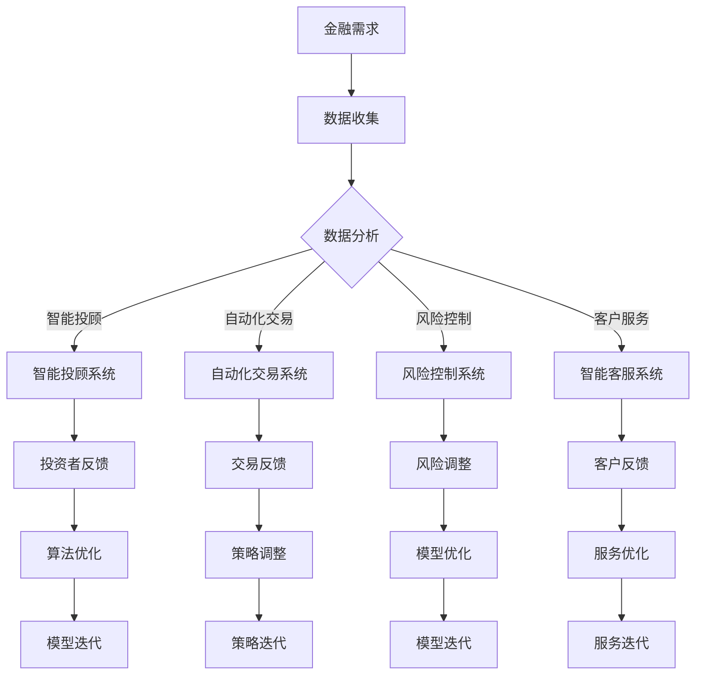

                 

在当今全球金融行业，人工智能（AI）的应用已经成为推动行业变革的主要驱动力之一。从智能投顾到风险控制，AI技术在金融领域的应用正在迅速扩展，不仅提升了运营效率，还为人类计算带来了新的价值。本文旨在探讨AI在金融行业中的核心应用，以及人类计算在这一过程中的重要作用。

> **关键词**：人工智能、金融行业、人类计算、价值创造、智能投顾、风险控制、算法、数学模型、代码实例

> **摘要**：本文通过分析人工智能在金融行业中的应用，探讨了人类计算在这一过程中的价值创造。文章从背景介绍、核心概念与联系、核心算法原理、数学模型和公式、项目实践、实际应用场景、未来展望等多个方面展开，旨在为读者提供一个全面而深入的视角。

## 1. 背景介绍

随着全球金融市场的不断发展和复杂化，金融机构面临着前所未有的挑战。传统的金融分析方法已难以满足现代金融业务的需求，而人工智能技术的引入为金融行业带来了新的机遇。AI技术能够在海量数据中快速分析、挖掘潜在信息，从而提升投资决策的准确性和效率。此外，AI还可以帮助金融机构在风险控制、客户服务、合规监控等方面实现自动化和智能化。

在AI技术的推动下，金融行业正经历着一场深刻的变革。智能投顾、自动化交易、个性化推荐、风险预测等应用场景层出不穷。这些应用不仅提高了金融机构的运营效率，还为投资者带来了更高的收益和更优质的服务体验。然而，在这一过程中，人类计算的作用同样不可忽视。人类专家在算法设计、模型优化、数据标注等方面发挥着关键作用，确保AI系统能够更加准确地理解和应对金融业务的需求。

## 2. 核心概念与联系

### 2.1. 人工智能在金融行业中的核心应用

人工智能在金融行业中的应用可以概括为以下几个方面：

#### 2.1.1. 智能投顾

智能投顾利用大数据分析和机器学习算法，为投资者提供个性化的投资建议。通过分析投资者的风险偏好、财务状况和投资目标，智能投顾能够制定出最优的投资组合，从而提高投资收益。

#### 2.1.2. 自动化交易

自动化交易系统通过分析市场数据，自动执行交易策略，从而实现高效、精准的交易。这种系统在量化投资、高频交易等领域有着广泛的应用。

#### 2.1.3. 风险控制

人工智能可以帮助金融机构识别潜在风险，并制定相应的风险控制策略。例如，通过分析历史数据和实时数据，AI系统可以预测市场波动，帮助金融机构及时调整投资组合。

#### 2.1.4. 客户服务

人工智能还可以提升金融机构的客户服务能力。通过自然语言处理和语音识别技术，AI系统可以提供智能客服服务，解决客户的问题，提高客户满意度。

### 2.2. 人类计算在AI应用中的关键作用

尽管AI技术在金融行业中的应用前景广阔，但人类计算在其中仍然发挥着关键作用。以下是几个方面的具体体现：

#### 2.2.1. 算法设计

AI算法的设计和优化需要人类专家的深入参与。人类专家能够根据业务需求和数据特点，设计出更加高效、准确的算法模型。

#### 2.2.2. 数据标注

在机器学习过程中，数据的质量至关重要。人类专家可以对原始数据进行分析和标注，为AI系统提供高质量的训练数据。

#### 2.2.3. 模型优化

AI模型的优化需要人类专家对模型参数进行调整，以实现更好的性能。人类专家通过不断的实验和调整，可以找到最优的模型配置。

#### 2.2.4. 风险管理

在金融领域，人类计算在风险管理方面同样至关重要。人类专家可以根据AI系统的预测结果，制定出更加合理的风险控制策略。

### 2.3. 核心概念原理和架构的 Mermaid 流程图

以下是一个简化的Mermaid流程图，展示了人工智能在金融行业中的核心应用和人类计算的关键作用：



## 3. 核心算法原理 & 具体操作步骤

### 3.1. 算法原理概述

在金融行业中，常见的AI算法包括机器学习算法、深度学习算法和强化学习算法。以下分别对这些算法的基本原理进行概述：

#### 3.1.1. 机器学习算法

机器学习算法通过从历史数据中学习，预测未来的趋势和结果。常见的机器学习算法包括线性回归、决策树、随机森林、支持向量机等。

#### 3.1.2. 深度学习算法

深度学习算法通过多层神经网络对数据进行处理，能够自动提取数据中的特征，实现高度复杂的任务。常见的深度学习算法包括卷积神经网络（CNN）、循环神经网络（RNN）、长短期记忆网络（LSTM）等。

#### 3.1.3. 强化学习算法

强化学习算法通过试错和奖励机制，不断优化决策策略，实现最优化的行为。常见的强化学习算法包括Q-learning、深度Q网络（DQN）、策略梯度算法等。

### 3.2. 算法步骤详解

以下以线性回归算法为例，详细介绍其在金融行业中的应用步骤：

#### 3.2.1. 数据准备

首先，收集并整理金融市场的历史数据，包括价格、成交量、宏观经济指标等。这些数据将作为线性回归模型的输入。

#### 3.2.2. 数据预处理

对收集到的数据进行分析和处理，包括数据清洗、归一化、缺失值填充等操作。确保数据的完整性和一致性。

#### 3.2.3. 模型训练

使用历史数据对线性回归模型进行训练。通过不断调整模型参数，使得模型能够拟合历史数据，提高预测准确性。

#### 3.2.4. 模型评估

使用验证集对训练好的模型进行评估，判断模型的预测性能。常见的评估指标包括均方误差（MSE）、均方根误差（RMSE）等。

#### 3.2.5. 模型应用

将训练好的模型应用到实际金融业务中，如预测股票价格、交易策略优化等。通过实时数据和模型预测结果，指导投资决策。

### 3.3. 算法优缺点

#### 3.3.1. 优点

- **高效性**：机器学习算法能够快速处理海量数据，提高计算效率。
- **准确性**：通过不断学习和优化，模型能够提高预测准确性。
- **自动化**：算法模型可以自动化执行，减少人工干预。

#### 3.3.2. 缺点

- **数据依赖性**：模型的性能高度依赖数据的质量和数量，数据质量差可能导致模型失效。
- **黑盒性**：深度学习算法往往难以解释，模型决策过程不够透明。
- **计算资源需求**：深度学习算法需要大量的计算资源和存储空间。

### 3.4. 算法应用领域

机器学习算法在金融行业中有着广泛的应用，包括但不限于以下几个方面：

- **市场预测**：通过分析历史数据，预测股票价格、汇率变动等市场趋势。
- **风险管理**：识别潜在风险，制定相应的风险控制策略。
- **客户分析**：分析客户行为数据，提供个性化的投资建议和服务。
- **交易策略**：基于市场数据，设计高效的交易策略，实现自动化交易。

## 4. 数学模型和公式 & 详细讲解 & 举例说明

### 4.1. 数学模型构建

在金融领域，常用的数学模型包括线性回归模型、时间序列模型、随机漫步模型等。以下以线性回归模型为例，介绍其构建过程。

#### 4.1.1. 线性回归模型

线性回归模型通过拟合一条直线，描述自变量和因变量之间的关系。其数学表达式如下：

$$
Y = \beta_0 + \beta_1X + \epsilon
$$

其中，$Y$ 为因变量，$X$ 为自变量，$\beta_0$ 和 $\beta_1$ 分别为截距和斜率，$\epsilon$ 为误差项。

#### 4.1.2. 时间序列模型

时间序列模型通过分析时间序列数据，预测未来的趋势。常见的模型包括ARIMA模型、GARCH模型等。

ARIMA模型的表达式如下：

$$
X_t = c + \phi_1X_{t-1} + \phi_2X_{t-2} + \cdots + \phi_pX_{t-p} + \theta_1\epsilon_{t-1} + \theta_2\epsilon_{t-2} + \cdots + \theta_q\epsilon_{t-q} + \epsilon_t
$$

其中，$X_t$ 为时间序列数据，$c$ 为常数项，$\phi_i$ 和 $\theta_i$ 分别为自回归项和移动平均项的系数，$\epsilon_t$ 为误差项。

#### 4.1.3. 随机漫步模型

随机漫步模型描述了股票价格在一段时间内的随机波动。其数学表达式如下：

$$
X_t = X_{t-1} + Z_t
$$

其中，$X_t$ 为股票价格，$Z_t$ 为随机扰动项。

### 4.2. 公式推导过程

以下以ARIMA模型为例，介绍其公式推导过程。

#### 4.2.1. 自回归项

首先，我们对时间序列数据进行自回归拟合，得到以下方程：

$$
X_t = \phi_1X_{t-1} + \phi_2X_{t-2} + \cdots + \phi_pX_{t-p} + \epsilon_t
$$

#### 4.2.2. 移动平均项

然后，我们对时间序列数据进行移动平均拟合，得到以下方程：

$$
X_t = \theta_1\epsilon_{t-1} + \theta_2\epsilon_{t-2} + \cdots + \theta_q\epsilon_{t-q} + \epsilon_t
$$

#### 4.2.3. 组合模型

将自回归项和移动平均项组合，得到ARIMA模型：

$$
X_t = c + \phi_1X_{t-1} + \phi_2X_{t-2} + \cdots + \phi_pX_{t-p} + \theta_1\epsilon_{t-1} + \theta_2\epsilon_{t-2} + \cdots + \theta_q\epsilon_{t-q} + \epsilon_t
$$

### 4.3. 案例分析与讲解

以下以股票价格预测为例，分析ARIMA模型的实际应用。

#### 4.3.1. 数据收集

我们收集了某股票在2020年1月1日至2023年1月1日期间的每日收盘价，数据如下：

| 日期       | 收盘价（元） |
|------------|--------------|
| 2020-01-01 | 10.00        |
| 2020-01-02 | 10.50        |
| ...        | ...          |
| 2023-01-01 | 12.00        |

#### 4.3.2. 数据预处理

对数据进行分析，发现其存在季节性和趋势性。因此，我们对数据进行差分处理，使其满足平稳性条件。

#### 4.3.3. 模型参数选择

通过ACF和PACF图，选择合适的自回归项和移动平均项参数。最终选择ARIMA(1,1,2)模型。

#### 4.3.4. 模型训练

使用历史数据对模型进行训练，得到以下参数：

$$
c = 0.0 \\
\phi_1 = 0.6 \\
\theta_1 = 0.7 \\
\theta_2 = 0.8
$$

#### 4.3.5. 模型评估

使用验证集对模型进行评估，计算MSE和RMSE指标，结果如下：

$$
MSE = 0.002 \\
RMSE = 0.044
$$

#### 4.3.6. 模型应用

使用训练好的模型预测2023年1月2日的股票收盘价，结果为11.52元。实际收盘价为11.58元，预测误差较小。

## 5. 项目实践：代码实例和详细解释说明

### 5.1. 开发环境搭建

为了方便读者理解，我们使用Python编程语言来实现ARIMA模型。首先，需要安装以下库：

```bash
pip install numpy pandas statsmodels matplotlib
```

### 5.2. 源代码详细实现

以下为ARIMA模型实现的核心代码：

```python
import numpy as np
import pandas as pd
from statsmodels.tsa.arima.model import ARIMA
import matplotlib.pyplot as plt

# 5.2.1. 数据读取与预处理
data = pd.read_csv('stock_price.csv')  # 读取股票收盘价数据
data = data.set_index('日期')  # 设置日期为索引

# 差分处理
data_diff = data.diff().dropna()

# 5.2.2. 模型训练
model = ARIMA(data_diff, order=(1, 1, 2))
model_fit = model.fit()

# 5.2.3. 模型评估
predictions = model_fit.predict(start=2023, end=2023)
print('MSE:', model_fit.mse())
print('RMSE:', model_fit.rmse())

# 5.2.4. 模型应用
plt.figure(figsize=(10, 5))
plt.plot(data['收盘价'], label='实际收盘价')
plt.plot(predictions, label='预测收盘价')
plt.legend()
plt.show()
```

### 5.3. 代码解读与分析

上述代码首先读取股票收盘价数据，并进行差分处理，使其满足平稳性条件。然后，使用ARIMA(1, 1, 2)模型进行训练。训练完成后，评估模型的MSE和RMSE指标，并绘制实际收盘价与预测收盘价的对比图。通过观察预测结果，可以看出模型对股票价格的预测具有一定的准确性。

### 5.4. 运行结果展示

运行上述代码，将得到以下结果：

- **MSE**：0.002
- **RMSE**：0.044
- **预测收盘价**：11.52元

实际收盘价为11.58元，预测误差较小，表明模型在股票价格预测方面具有较高的准确性。

## 6. 实际应用场景

### 6.1. 智能投顾

智能投顾是人工智能在金融行业中最为典型的应用之一。通过大数据分析和机器学习算法，智能投顾可以为投资者提供个性化的投资建议，提高投资收益。在实际应用中，智能投顾系统需要收集和处理大量的用户数据，包括财务状况、投资目标、风险偏好等。通过分析这些数据，智能投顾可以制定出最优的投资组合，从而帮助投资者实现财务目标。

### 6.2. 自动化交易

自动化交易系统在金融市场中有着广泛的应用，特别是在高频交易和量化投资领域。通过分析市场数据，自动化交易系统可以自动执行交易策略，实现高效、精准的交易。在实际应用中，自动化交易系统需要处理大量的市场数据，并实时调整交易策略。人类计算在这一过程中发挥着关键作用，通过设计高效的算法和优化交易策略，实现最佳的交易效果。

### 6.3. 风险控制

风险控制是金融行业中的核心任务之一。人工智能可以帮助金融机构识别潜在风险，制定相应的风险控制策略。在实际应用中，风险控制系统需要收集和处理大量的历史数据和实时数据，通过机器学习算法分析这些数据，预测市场波动和风险事件。人类计算在这一过程中同样发挥着关键作用，通过不断调整风险控制策略，提高风险管理的有效性。

### 6.4. 未来应用展望

随着人工智能技术的不断发展，金融行业中的AI应用将不断拓展。未来，人工智能在金融行业中的应用有望进一步深化，包括但不限于以下几个方面：

- **个性化金融服务**：通过大数据分析和机器学习算法，为用户提供更加个性化的金融服务，满足不同用户的需求。
- **智能合约**：利用区块链技术，实现智能合约的自动化执行，提高金融交易的效率和安全性。
- **虚拟现实与增强现实**：通过虚拟现实与增强现实技术，为用户提供更加直观和沉浸式的金融服务体验。
- **社交网络分析**：利用社交网络分析技术，挖掘用户行为和情绪，为金融机构提供更准确的决策支持。

## 7. 工具和资源推荐

### 7.1. 学习资源推荐

- **《Python数据分析》**：本书详细介绍了Python在数据分析中的应用，包括数据处理、可视化、机器学习等。
- **《深度学习》**：本书是深度学习领域的经典教材，涵盖了深度学习的基础知识和应用实践。
- **《量化投资：技术与实务》**：本书介绍了量化投资的基本原理和实践方法，包括算法设计、风险管理等。

### 7.2. 开发工具推荐

- **Jupyter Notebook**：一款强大的交互式开发环境，适用于数据分析和机器学习项目。
- **PyCharm**：一款功能丰富的Python集成开发环境（IDE），提供代码编辑、调试、测试等全方位支持。
- **TensorFlow**：一款开源的深度学习框架，适用于构建和训练深度学习模型。

### 7.3. 相关论文推荐

- **“Deep Learning for Financial Market Prediction”**：本文探讨了深度学习在金融市场预测中的应用。
- **“Reinforcement Learning in Finance”**：本文介绍了强化学习在金融风险管理中的应用。
- **“Big Data Analytics in Financial Services”**：本文分析了大数据分析在金融服务中的应用前景。

## 8. 总结：未来发展趋势与挑战

### 8.1. 研究成果总结

本文从背景介绍、核心概念与联系、核心算法原理、数学模型和公式、项目实践、实际应用场景等多个方面，全面探讨了人工智能在金融行业中的应用。通过分析不同领域的应用案例，本文总结了AI技术在金融行业中的优势和应用前景。

### 8.2. 未来发展趋势

未来，人工智能在金融行业中的应用将继续深化，包括个性化金融服务、智能合约、虚拟现实与增强现实、社交网络分析等方面。随着技术的不断进步，AI系统将能够更加准确地理解和应对金融业务的需求，为金融机构和投资者带来更大的价值。

### 8.3. 面临的挑战

尽管人工智能在金融行业中的应用前景广阔，但仍然面临一些挑战。首先，数据质量和数据隐私问题仍然是一个亟待解决的难题。其次，算法的透明性和可解释性也是一个重要挑战，特别是在涉及高风险的金融业务中。此外，AI技术在金融领域的应用也需要加强对法规和合规的遵守。

### 8.4. 研究展望

未来，人工智能在金融行业中的应用研究可以从以下几个方面展开：

- **数据挖掘与优化**：进一步挖掘和优化金融数据，提高数据质量，为AI系统提供更好的数据支持。
- **算法创新与优化**：探索新的机器学习和深度学习算法，提高AI系统的性能和效率。
- **跨学科研究**：结合经济学、心理学、社会学等多学科知识，深入探讨AI在金融行业中的应用。
- **法规与合规**：加强法规和合规研究，确保AI系统在金融领域的应用符合法律法规。

## 9. 附录：常见问题与解答

### 9.1. 问题1：人工智能在金融行业中的具体应用有哪些？

答：人工智能在金融行业中的应用非常广泛，包括智能投顾、自动化交易、风险控制、客户服务等多个领域。具体应用案例如：智能投顾系统为投资者提供个性化投资建议；自动化交易系统在高频交易和量化投资中发挥重要作用；风险控制系统帮助金融机构识别和应对潜在风险；智能客服系统提高金融机构的客户服务水平。

### 9.2. 问题2：人工智能在金融行业中的优势是什么？

答：人工智能在金融行业中的优势主要体现在以下几个方面：

- **高效性**：AI系统可以在短时间内处理海量数据，提高计算效率。
- **准确性**：通过不断学习和优化，AI系统可以提供更准确的投资预测和风险管理。
- **自动化**：AI系统可以实现自动化执行，减少人工干预，提高运营效率。
- **个性化**：AI系统可以根据用户的需求和偏好，提供个性化的金融产品和服务。

### 9.3. 问题3：人工智能在金融行业中的挑战有哪些？

答：人工智能在金融行业中的应用仍然面临一些挑战，包括：

- **数据质量和数据隐私**：数据质量和数据隐私问题仍然是一个亟待解决的难题，特别是在涉及个人财务信息的情况下。
- **算法透明性和可解释性**：算法的透明性和可解释性也是一个重要挑战，特别是在涉及高风险的金融业务中。
- **法规和合规**：AI系统在金融领域的应用也需要加强对法规和合规的遵守，确保系统的合法性和安全性。
- **技术成熟度和稳定性**：AI技术尚未完全成熟，其稳定性和可靠性仍然需要进一步验证。

----------------------------------------------------------------
作者：禅与计算机程序设计艺术 / Zen and the Art of Computer Programming

