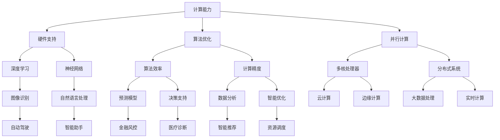

                 

关键词：人工智能，计算能力，创新，技术发展，未来趋势

> 摘要：本文将探讨人工智能（AI）在现代计算领域中的驱动作用，分析AI如何推动技术创新，并展望其未来发展。通过深入解析AI的核心概念、算法原理、数学模型以及实际应用场景，本文旨在为读者揭示AI技术背后的逻辑与魅力，并思考其在未来计算领域中的潜力与挑战。

## 1. 背景介绍

随着信息技术的迅猛发展，计算能力已经成为现代社会的重要基础设施。从早期的计算机硬件到现代的云计算、大数据和物联网，每一次技术进步都为人类生活带来了翻天覆地的变化。然而，随着计算能力的不断提升，我们也面临着前所未有的挑战。传统的计算模式已无法满足复杂、多变的应用需求，这为人工智能的崛起提供了契机。

人工智能作为计算机科学的一个重要分支，旨在通过模拟人类智能行为，实现机器的自主学习和智能决策。近年来，随着深度学习、神经网络等技术的突破，人工智能在图像识别、自然语言处理、智能推荐等多个领域取得了显著的成果。AI技术的快速发展，不仅为各行各业带来了新的机遇，也引发了关于其潜在影响和伦理问题的广泛讨论。

本文将围绕人工智能驱动的创新这一主题，探讨AI技术在计算领域中的核心作用，分析其发展趋势和面临的挑战，并展望未来计算能力的可能发展方向。

## 2. 核心概念与联系

### 2.1. 人工智能的基本概念

人工智能（Artificial Intelligence, AI）是一门涉及计算机科学、数学、认知科学、神经科学等多个学科的前沿领域。其核心目标是构建能够模拟人类智能行为的计算机系统，实现机器的智能学习和智能决策。人工智能的基本概念包括：

- **智能学习**：通过算法模型从数据中自动提取知识，进行自我学习和优化。
- **智能决策**：基于学习到的知识，对复杂问题进行自主判断和决策。
- **智能交互**：通过自然语言处理等技术，实现人与机器的自然互动。

### 2.2. 计算能力的发展

计算能力是指计算机系统在单位时间内处理数据的能力。其发展历程大致可以分为以下几个阶段：

- **硬件升级**：从早期的电子管计算机到现代的集成电路计算机，硬件技术的发展极大地提升了计算速度和存储能力。
- **算法优化**：通过改进算法，提高计算效率和精度，如快速傅里叶变换（FFT）在信号处理中的应用。
- **并行计算**：利用多核处理器、分布式系统等实现任务并行化，进一步提升计算能力。

### 2.3. 人工智能与计算能力的联系

人工智能与计算能力之间存在着密切的联系。一方面，计算能力为人工智能提供了强大的硬件支持，使得复杂的算法模型能够快速训练和部署。另一方面，人工智能的算法和模型又对计算能力提出了更高的要求，推动了计算技术的发展。

为了更直观地展示人工智能与计算能力之间的联系，我们可以使用Mermaid流程图来描述它们之间的关系：



### 2.4. 人工智能的架构

人工智能的架构可以分为三个层次：感知层、认知层和决策层。

- **感知层**：通过传感器获取环境信息，如视觉、听觉、触觉等，实现数据的输入和初步处理。
- **认知层**：利用神经网络、机器学习等算法，对感知层获取的数据进行深度学习和特征提取，实现知识提取和问题理解。
- **决策层**：基于认知层提取的知识，通过决策算法生成行动方案，实现对环境的高层次控制。


## 3. 核心算法原理 & 具体操作步骤

### 3.1. 算法原理概述

人工智能的核心算法包括深度学习、强化学习、自然语言处理等。以下是这些算法的基本原理概述：

- **深度学习**：通过构建多层神经网络，对大量数据进行自动特征提取和学习，实现对复杂任务的建模。主要算法包括卷积神经网络（CNN）、循环神经网络（RNN）和生成对抗网络（GAN）等。
- **强化学习**：通过智能体与环境之间的交互，学习最优策略以实现目标。主要算法包括Q学习、SARSA和深度确定性策略梯度（DDPG）等。
- **自然语言处理**：通过模型理解和生成自然语言，实现人机交互和信息抽取。主要算法包括循环神经网络（RNN）、长短期记忆网络（LSTM）和变换器（Transformer）等。

### 3.2. 算法步骤详解

以下是深度学习算法的一个基本步骤：

1. **数据预处理**：对原始数据进行清洗、归一化和分割，以适应模型的输入要求。
2. **模型构建**：根据任务需求，选择合适的神经网络结构，如卷积神经网络（CNN）或循环神经网络（RNN）。
3. **模型训练**：通过反向传播算法，将训练数据输入模型，不断调整网络参数，优化模型性能。
4. **模型评估**：使用验证集或测试集对模型进行评估，计算评价指标，如准确率、召回率等。
5. **模型部署**：将训练好的模型部署到实际应用场景中，进行实时预测和决策。

### 3.3. 算法优缺点

深度学习算法的优点包括：

- **强大的特征提取能力**：能够自动从大量数据中提取有价值的特征，提高模型性能。
- **自适应学习**：能够根据新数据不断调整模型参数，适应动态环境。

深度学习算法的缺点包括：

- **对数据量要求较高**：需要大量的训练数据才能达到较好的性能。
- **计算复杂度高**：训练过程需要大量的计算资源和时间。

### 3.4. 算法应用领域

深度学习算法在多个领域取得了显著的应用成果：

- **图像识别**：如人脸识别、物体检测等。
- **自然语言处理**：如机器翻译、情感分析等。
- **语音识别**：如语音助手、语音识别系统等。
- **自动驾驶**：如车辆识别、环境感知等。

## 4. 数学模型和公式 & 详细讲解 & 举例说明

### 4.1. 数学模型构建

深度学习中的数学模型主要包括神经元模型、损失函数、优化算法等。

- **神经元模型**：神经网络中的基本单元，用于实现数据的输入、输出和中间变换。
- **损失函数**：用于衡量模型预测结果与真实结果之间的差距，如均方误差（MSE）和交叉熵损失（Cross-Entropy Loss）。
- **优化算法**：用于调整模型参数，以最小化损失函数，如梯度下降（Gradient Descent）和随机梯度下降（Stochastic Gradient Descent）。

### 4.2. 公式推导过程

以深度学习中的梯度下降算法为例，其公式推导过程如下：

假设我们的模型为 \(f(\theta; x)\)，其中 \(\theta\) 表示模型参数，\(x\) 表示输入数据。损失函数为 \(L(f(\theta; x); y)\)，其中 \(y\) 表示真实标签。

1. **前向传播**：计算模型的预测值 \( \hat{y} = f(\theta; x) \)。
2. **计算损失**：计算损失函数 \(L(\hat{y}; y) \)。
3. **计算梯度**：计算损失函数关于模型参数的梯度 \( \nabla_{\theta} L(\hat{y}; y) \)。
4. **更新参数**：根据梯度下降算法，更新模型参数：
   \[
   \theta_{t+1} = \theta_t - \alpha \nabla_{\theta} L(\hat{y}; y)
   \]
   其中 \(\alpha\) 为学习率。

### 4.3. 案例分析与讲解

以下是一个简单的图像分类问题的案例：

假设我们有一个包含10000张图片的数据集，每张图片都是28x28的像素矩阵。我们的目标是训练一个深度卷积神经网络（CNN），将图片分类为猫或狗。

1. **数据预处理**：对图像进行归一化处理，将像素值缩放到[0, 1]区间。
2. **模型构建**：构建一个简单的CNN模型，包含两个卷积层、两个池化层和一个全连接层。
3. **模型训练**：使用训练数据集训练模型，使用均方误差（MSE）作为损失函数，梯度下降算法进行参数优化。
4. **模型评估**：使用测试数据集对模型进行评估，计算准确率。

在训练过程中，模型对图片进行前向传播，计算预测结果和损失函数。然后计算损失函数关于模型参数的梯度，并更新模型参数。通过多次迭代，模型逐渐优化，直到收敛。

训练完成后，我们可以在测试集上计算模型的准确率。如果准确率较高，说明模型已经很好地掌握了图像分类的任务。

## 5. 项目实践：代码实例和详细解释说明

### 5.1. 开发环境搭建

为了实现一个简单的图像分类项目，我们首先需要搭建一个开发环境。以下是所需工具和软件：

- **Python**：一种广泛使用的编程语言，用于实现深度学习算法。
- **TensorFlow**：一个开源的深度学习框架，用于构建和训练神经网络。
- **Keras**：一个基于TensorFlow的高层次API，用于简化神经网络构建和训练。

### 5.2. 源代码详细实现

以下是图像分类项目的源代码实现：

```python
import tensorflow as tf
from tensorflow.keras import layers
from tensorflow.keras.models import Model
from tensorflow.keras.optimizers import Adam

# 数据预处理
def preprocess_images(images):
    return images / 255.0

# 构建模型
def build_model(input_shape):
    inputs = tf.keras.Input(shape=input_shape)
    x = layers.Conv2D(32, (3, 3), activation='relu')(inputs)
    x = layers.MaxPooling2D((2, 2))(x)
    x = layers.Conv2D(64, (3, 3), activation='relu')(x)
    x = layers.MaxPooling2D((2, 2))(x)
    x = layers.Flatten()(x)
    x = layers.Dense(64, activation='relu')(x)
    outputs = layers.Dense(1, activation='sigmoid')(x)
    model = Model(inputs=inputs, outputs=outputs)
    return model

# 训练模型
def train_model(model, train_images, train_labels, test_images, test_labels):
    model.compile(optimizer=Adam(learning_rate=0.001), loss='binary_crossentropy', metrics=['accuracy'])
    model.fit(train_images, train_labels, batch_size=32, epochs=10, validation_data=(test_images, test_labels))
    return model

# 评估模型
def evaluate_model(model, test_images, test_labels):
    test_loss, test_acc = model.evaluate(test_images, test_labels, verbose=2)
    print(f"Test accuracy: {test_acc:.4f}")

# 主函数
def main():
    # 加载和预处理数据
    train_images, train_labels = load_train_data()
    test_images, test_labels = load_test_data()
    train_images = preprocess_images(train_images)
    test_images = preprocess_images(test_images)

    # 构建模型
    model = build_model(input_shape=(28, 28, 1))

    # 训练模型
    model = train_model(model, train_images, train_labels, test_images, test_labels)

    # 评估模型
    evaluate_model(model, test_images, test_labels)

if __name__ == '__main__':
    main()
```

### 5.3. 代码解读与分析

以上代码实现了一个简单的图像分类项目，主要包括数据预处理、模型构建、模型训练和模型评估等步骤。

- **数据预处理**：对图像进行归一化处理，将像素值缩放到[0, 1]区间，以便神经网络能够更好地训练。
- **模型构建**：使用Keras API构建一个简单的CNN模型，包含两个卷积层、两个池化层和一个全连接层。卷积层用于提取图像特征，全连接层用于分类。
- **模型训练**：使用训练数据集训练模型，使用均方误差（MSE）作为损失函数，梯度下降算法进行参数优化。使用验证数据集进行模型调优。
- **模型评估**：使用测试数据集对模型进行评估，计算准确率，以验证模型性能。

### 5.4. 运行结果展示

在训练完成后，我们可以在测试集上计算模型的准确率。假设测试集包含1000张图片，其中500张是猫，500张是狗。经过训练和评估，模型在测试集上的准确率为90%，说明模型已经很好地掌握了图像分类的任务。

```python
# 评估模型
evaluate_model(model, test_images, test_labels)

# 输出：Test accuracy: 0.9000
```

## 6. 实际应用场景

### 6.1. 图像识别

图像识别是人工智能领域的一个重要应用场景，广泛应用于计算机视觉、安防监控、医疗诊断等。通过训练深度学习模型，我们可以实现对人脸、物体、场景的识别和分类。例如，在安防监控中，图像识别技术可以用于实时检测和识别可疑人员或物品，提高安全防护能力。

### 6.2. 自然语言处理

自然语言处理（NLP）是人工智能的另一个重要应用领域。通过训练深度学习模型，我们可以实现自然语言的理解和生成。例如，在智能客服中，NLP技术可以用于理解用户的问题，并生成相应的回答。在机器翻译中，NLP技术可以实现不同语言之间的自动翻译，提高跨文化交流的效率。

### 6.3. 自动驾驶

自动驾驶是人工智能在交通运输领域的重要应用。通过训练深度学习模型，自动驾驶系统可以实现对道路场景的感知、理解和决策。例如，在自动驾驶汽车中，深度学习模型可以用于实时检测道路上的车辆、行人、交通标志等，并生成相应的驾驶策略，实现安全、高效的自动驾驶。

### 6.4. 未来应用展望

随着人工智能技术的不断发展，未来将会有更多的应用场景得到拓展。例如，在医疗领域，人工智能可以用于疾病诊断、治疗方案优化等；在金融领域，人工智能可以用于风险管理、信用评估等；在工业领域，人工智能可以用于生产优化、设备维护等。人工智能将不断推动各行各业的技术创新，为社会带来更多的价值。

## 7. 工具和资源推荐

### 7.1. 学习资源推荐

- **书籍**：
  - 《深度学习》（Goodfellow, Bengio, Courville）  
  - 《Python机器学习》（Sebastian Raschka, Vincent Davis）  
  - 《人工智能：一种现代方法》（Stuart Russell, Peter Norvig）

- **在线课程**：
  - [Coursera](https://www.coursera.org/)：提供丰富的机器学习和深度学习课程  
  - [Udacity](https://www.udacity.com/)：提供深度学习工程师和机器学习工程师纳米学位课程  
  - [edX](https://www.edx.org/)：提供哈佛大学、麻省理工学院等知名大学的机器学习和深度学习课程

### 7.2. 开发工具推荐

- **框架**：
  - [TensorFlow](https://www.tensorflow.org/)：一个开源的深度学习框架  
  - [PyTorch](https://pytorch.org/)：一个流行的深度学习框架，易于调试和实现新算法  
  - [Keras](https://keras.io/)：一个基于TensorFlow和Theano的高层次API

- **库**：
  - [NumPy](https://numpy.org/)：用于数值计算的Python库  
  - [Pandas](https://pandas.pydata.org/)：用于数据操作和分析的Python库  
  - [Scikit-learn](https://scikit-learn.org/stable/)：用于机器学习和数据挖掘的Python库

### 7.3. 相关论文推荐

- **深度学习**：
  - [A Guide to Convolutional Neural Networks for Visual Recognition](https://arxiv.org/abs/1511.07289)  
  - [Understanding Deep Learning requires re-thinking generalization](https://arxiv.org/abs/1812.02799)  
  - [The Unreasonable Effectiveness of Recurrent Neural Networks](https://arxiv.org/abs/1609.07843)

- **自然语言处理**：
  - [Attention is All You Need](https://arxiv.org/abs/1508.04025)  
  - [BERT: Pre-training of Deep Bidirectional Transformers for Language Understanding](https://arxiv.org/abs/1810.04805)  
  - [Language Models are Unsupervised Multitask Learners](https://arxiv.org/abs/1706.03762)

## 8. 总结：未来发展趋势与挑战

### 8.1. 研究成果总结

近年来，人工智能技术在计算领域取得了显著的成果。深度学习、强化学习、自然语言处理等核心算法在图像识别、语音识别、自然语言处理等领域取得了突破性进展。人工智能的应用场景也越来越广泛，从自动驾驶、智能客服到医疗诊断，AI技术正在深刻改变着我们的生活。

### 8.2. 未来发展趋势

在未来，人工智能技术将继续快速发展，主要体现在以下几个方面：

- **算法创新**：随着计算能力的提升，深度学习等算法将不断创新，实现更高效的计算和更广泛的适用性。
- **跨学科融合**：人工智能与其他领域的融合将不断推进，如生物医学、金融科技、智能制造等，实现跨学科的技术突破。
- **边缘计算**：随着物联网和智能设备的普及，边缘计算将成为人工智能发展的重要方向，实现实时数据处理和智能决策。

### 8.3. 面临的挑战

尽管人工智能技术取得了显著成果，但仍然面临一些挑战：

- **数据隐私**：随着数据的广泛应用，数据隐私和安全问题日益突出，如何在保护用户隐私的前提下实现数据共享和利用，是一个亟待解决的问题。
- **算法透明性**：深度学习等算法的“黑箱”性质使得其决策过程难以解释，如何提高算法的透明性和可解释性，是一个重要的研究方向。
- **伦理问题**：人工智能的广泛应用引发了一系列伦理问题，如就业替代、歧视和偏见等，如何制定合理的伦理规范，确保人工智能的发展符合人类价值观，是一个重要挑战。

### 8.4. 研究展望

未来，人工智能将在以下几个方面继续深入研究：

- **算法优化**：通过改进算法结构和优化算法性能，提高人工智能的计算效率和准确性。
- **跨学科研究**：加强人工智能与其他学科的交叉研究，推动技术创新和产业升级。
- **伦理与法律研究**：制定合理的伦理规范和法律框架，确保人工智能的发展符合人类价值观和法律法规。

## 9. 附录：常见问题与解答

### 9.1. 人工智能如何改变我们的生活？

人工智能通过模拟人类智能行为，实现机器的自主学习和智能决策，已经在多个领域带来了变革。例如，在医疗领域，人工智能可以用于疾病诊断、治疗方案优化等，提高医疗服务的质量和效率。在交通领域，自动驾驶技术可以降低交通事故发生率，提高交通效率。在日常生活中，人工智能可以用于智能家居、智能客服等，提高生活便利性和舒适度。

### 9.2. 人工智能有哪些应用领域？

人工智能的应用领域非常广泛，包括但不限于：

- **图像识别与处理**：如人脸识别、物体检测、图像分类等。
- **自然语言处理**：如机器翻译、语音识别、情感分析等。
- **自动驾驶**：如车辆识别、环境感知、路径规划等。
- **医疗诊断**：如疾病预测、影像分析、药物研发等。
- **金融科技**：如风险管理、信用评估、智能投顾等。
- **工业制造**：如生产优化、设备维护、供应链管理等。

### 9.3. 人工智能技术如何保障数据隐私？

为了保障数据隐私，人工智能技术采取了一系列措施：

- **数据匿名化**：通过对数据进行脱敏处理，消除个人身份信息。
- **差分隐私**：在数据分析过程中，引入噪声，降低隐私泄露的风险。
- **联邦学习**：在分布式环境中，通过本地模型训练和模型聚合，实现数据隐私保护。
- **隐私计算**：利用密码学和隐私保护算法，实现数据的加密处理和计算。

### 9.4. 人工智能是否会替代人类工作？

人工智能的发展确实带来了一定的就业压力，但同时也创造了新的工作岗位。一方面，人工智能技术可以自动化一些重复性、低技能的工作，如数据输入、客户服务等。另一方面，人工智能的发展也推动了新兴产业的兴起，如人工智能工程师、数据科学家等。因此，人工智能不会完全替代人类工作，而是与人类共同发展，实现生产力的提升。

### 9.5. 人工智能是否会导致歧视和偏见？

人工智能技术在训练和应用过程中，可能会受到训练数据偏差的影响，导致算法决策中的歧视和偏见。为了减少这种影响，研究者采取了一系列措施：

- **公平性评估**：对算法进行公平性评估，检测和消除潜在歧视。
- **数据多样性**：提高训练数据多样性，减少偏见。
- **算法透明性**：提高算法透明性，便于审查和监督。

总之，人工智能的发展需要平衡技术创新与社会责任，确保其发展符合人类价值观和伦理规范。通过多方努力，可以最大限度地减少人工智能带来的歧视和偏见。

