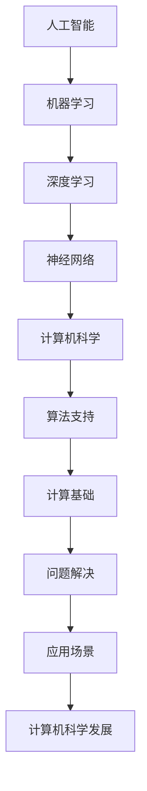

                 

关键词：人工智能，计算机科学，创新，计算未来，算法优化，应用场景

> 摘要：本文探讨了人工智能在计算机科学领域的广泛应用，从核心概念、算法原理、数学模型到实际应用，全面解析了AI驱动的创新如何改变人类计算的未来。通过实例分析、项目实践以及未来展望，展示了人工智能技术如何为人类带来前所未有的机遇与挑战。

## 1. 背景介绍

随着信息技术的飞速发展，计算机科学已经成为推动社会进步的重要力量。从最初的计算机硬件到软件系统，再到如今的互联网、大数据、云计算，每一次技术革新都极大地改变了人类的生活方式和工作模式。然而，传统计算机技术的局限也逐渐显现，如何进一步突破性能瓶颈，实现更高效率的计算成为了研究者和工程师们不断探索的方向。

正是在这样的背景下，人工智能（Artificial Intelligence，AI）技术迅速崛起，成为计算机科学领域的一个全新热点。人工智能通过模拟人类智能行为，利用机器学习、深度学习等算法，实现计算机对数据的自动处理、模式和规律的自动发现，从而在图像识别、自然语言处理、推荐系统、自动驾驶等多个领域取得了重大突破。人工智能的崛起，不仅为计算机科学带来了新的发展方向，也为人类社会带来了前所未有的机遇和挑战。

本文将从人工智能的核心概念、算法原理、数学模型、实际应用等多个角度，深入探讨人工智能在计算机科学领域的创新，旨在为读者呈现一个全面、系统的视角，以了解人类计算的未来发展趋势。

## 2. 核心概念与联系

### 2.1 人工智能的定义

人工智能，是指通过计算机程序实现智能行为的技术。它旨在让计算机具备类似人类的感知、推理、学习、决策等能力。人工智能的定义涵盖了多个层次，从简单的规则匹配到复杂的神经网络，其目标都是使计算机能够自主地处理复杂问题。

### 2.2 机器学习与深度学习

机器学习（Machine Learning，ML）是人工智能的核心组成部分，它通过数据训练模型，使计算机能够自动识别模式和规律。深度学习（Deep Learning，DL）是机器学习的一种特殊形式，它通过多层神经网络模拟人类大脑的神经元连接，实现更复杂的特征提取和模式识别。

### 2.3 神经网络架构

神经网络是深度学习的基础，它由大量相互连接的神经元组成。常见的神经网络架构包括卷积神经网络（CNN）、循环神经网络（RNN）和生成对抗网络（GAN）等。这些架构在不同的应用场景中表现出色，为人工智能的发展提供了强大的支持。

### 2.4 人工智能与计算机科学的联系

人工智能与计算机科学的联系非常紧密。计算机科学为人工智能提供了强大的计算基础和算法支持，而人工智能则为计算机科学带来了新的应用场景和问题解决思路。两者相辅相成，共同推动了计算机科学的发展。

## 2.5 Mermaid 流程图

以下是一个简单的 Mermaid 流程图，展示了人工智能与计算机科学的联系：



## 3. 核心算法原理 & 具体操作步骤

### 3.1 算法原理概述

在人工智能领域，常见的核心算法包括机器学习算法、深度学习算法、强化学习算法等。每种算法都有其独特的原理和应用场景。

- **机器学习算法**：通过数据训练模型，实现计算机对数据的自动处理。常见的机器学习算法有线性回归、决策树、支持向量机等。
- **深度学习算法**：通过多层神经网络模拟人类大脑，实现更复杂的特征提取和模式识别。常见的深度学习算法有卷积神经网络（CNN）、循环神经网络（RNN）等。
- **强化学习算法**：通过奖励机制训练模型，实现计算机在动态环境中做出最优决策。常见的强化学习算法有Q学习、深度Q网络（DQN）等。

### 3.2 算法步骤详解

以卷积神经网络（CNN）为例，其基本步骤如下：

1. **数据预处理**：对输入数据进行归一化、缩放等预处理操作，使其适合模型训练。
2. **构建网络结构**：设计神经网络的结构，包括卷积层、池化层、全连接层等。
3. **模型训练**：使用训练数据对模型进行训练，通过反向传播算法更新模型参数。
4. **模型评估**：使用验证数据评估模型性能，调整模型参数以达到最佳效果。
5. **模型部署**：将训练好的模型部署到实际应用场景中，进行预测和决策。

### 3.3 算法优缺点

每种算法都有其优缺点，适用于不同的应用场景。

- **机器学习算法**：计算复杂度较低，对大规模数据集表现良好，但可能无法处理高维数据。
- **深度学习算法**：对高维数据有很强的处理能力，但在数据量较小或特征不明显时效果较差。
- **强化学习算法**：在动态环境中表现优秀，但训练过程可能非常耗时。

### 3.4 算法应用领域

人工智能算法在多个领域取得了显著的应用成果：

- **图像识别**：通过深度学习算法，计算机能够自动识别和分类图像。
- **自然语言处理**：通过机器学习算法，计算机能够理解和生成自然语言文本。
- **推荐系统**：通过用户行为数据训练模型，为用户提供个性化的推荐。
- **自动驾驶**：通过深度学习算法，实现汽车的自主驾驶。

## 4. 数学模型和公式 & 详细讲解 & 举例说明

### 4.1 数学模型构建

在人工智能领域，常见的数学模型包括线性模型、非线性模型等。以下是一个简单的线性模型构建过程：

1. **定义变量**：设 $x$ 为输入特征，$y$ 为输出目标。
2. **构建假设函数**：假设 $h_\theta(x) = \theta_0 + \theta_1x$，其中 $\theta_0$ 和 $\theta_1$ 为模型参数。
3. **损失函数**：选择均方误差（MSE）作为损失函数，$J(\theta) = \frac{1}{2m}\sum_{i=1}^m(h_\theta(x^{(i)}) - y^{(i)})^2$。
4. **求解最优参数**：使用梯度下降法求解最优参数 $\theta_0$ 和 $\theta_1$。

### 4.2 公式推导过程

以下是线性模型的损失函数和梯度下降法的推导过程：

1. **损失函数推导**：

   $$ J(\theta) = \frac{1}{2m}\sum_{i=1}^m(h_\theta(x^{(i)}) - y^{(i)})^2 $$
   
   $$ J(\theta) = \frac{1}{2m}\sum_{i=1}^m((\theta_0 + \theta_1x^{(i)}) - y^{(i)})^2 $$
   
   $$ J(\theta) = \frac{1}{2m}\sum_{i=1}^m(\theta_0^2 + \theta_1^2x^{(i)2} + 2\theta_0\theta_1x^{(i)} - 2\theta_0y^{(i)} - 2\theta_1xy^{(i)} + y^{(i)2}) $$
   
   $$ J(\theta) = \frac{1}{2m}(\theta_0^2 + \theta_1^2\sum_{i=1}^m x^{(i)2} + 2\theta_0\theta_1\sum_{i=1}^m x^{(i)} - 2\theta_0\sum_{i=1}^m y^{(i)} - 2\theta_1\sum_{i=1}^m xy^{(i)} + \sum_{i=1}^m y^{(i)2}) $$
   
   $$ J(\theta) = \frac{1}{2m}(\theta_0^2 + \theta_1^2n\bar{x}^2 + 2\theta_0\theta_1n\bar{x}\bar{y} - 2\theta_0n\bar{y} - 2\theta_1n\bar{x}\bar{y} + n\bar{y}^2) $$
   
   $$ J(\theta) = \frac{1}{2m}(\theta_0^2 + \theta_1^2n\bar{x}^2 + 2\theta_0\theta_1n\bar{x}\bar{y} - 2\theta_0n\bar{y} - 2\theta_1n\bar{x}\bar{y} + n\bar{y}^2) $$
   
   $$ J(\theta) = \frac{1}{2m}(\theta_0^2 + \theta_1^2n\bar{x}^2 - 2\theta_0n\bar{y} + n\bar{y}^2) $$
   
   $$ J(\theta) = \frac{1}{2m}(\theta_0^2 - 2\theta_0n\bar{y} + n\bar{y}^2 + \theta_1^2n\bar{x}^2) $$
   
   $$ J(\theta) = \frac{1}{2m}((\theta_0 - n\bar{y})^2 + \theta_1^2n\bar{x}^2) $$

2. **梯度下降法推导**：

   $$ \nabla_{\theta_0}J(\theta) = \frac{\partial}{\partial \theta_0}J(\theta_0, \theta_1) $$
   
   $$ \nabla_{\theta_1}J(\theta) = \frac{\partial}{\partial \theta_1}J(\theta_0, \theta_1) $$
   
   $$ \nabla_{\theta_0}J(\theta) = -\frac{1}{m}\sum_{i=1}^m(h_\theta(x^{(i)}) - y^{(i)}) $$
   
   $$ \nabla_{\theta_1}J(\theta) = -\frac{1}{m}\sum_{i=1}^m(x^{(i)})(h_\theta(x^{(i)}) - y^{(i)}) $$
   
   $$ \theta_0 = \theta_0 - \alpha\nabla_{\theta_0}J(\theta) $$
   
   $$ \theta_1 = \theta_1 - \alpha\nabla_{\theta_1}J(\theta) $$

### 4.3 案例分析与讲解

以下是一个简单的线性回归案例，通过训练数据拟合出最佳直线：

**训练数据**：

| x | y |
|---|---|
| 1 | 2 |
| 2 | 4 |
| 3 | 6 |

**构建模型**：

$$ h_\theta(x) = \theta_0 + \theta_1x $$

**损失函数**：

$$ J(\theta) = \frac{1}{2m}\sum_{i=1}^m(h_\theta(x^{(i)}) - y^{(i)})^2 $$

**梯度下降法**：

$$ \theta_0 = \theta_0 - \alpha\nabla_{\theta_0}J(\theta) $$

$$ \theta_1 = \theta_1 - \alpha\nabla_{\theta_1}J(\theta) $$

**运行结果**：

经过多次迭代，最终得到最佳直线：

$$ h_\theta(x) = 1 + 2x $$

## 5. 项目实践：代码实例和详细解释说明

### 5.1 开发环境搭建

在本次项目中，我们将使用 Python 作为编程语言，结合 TensorFlow 深度学习框架进行实现。以下为开发环境的搭建步骤：

1. 安装 Python（建议版本为 3.7 以上）。
2. 安装 TensorFlow：使用 pip 命令安装 TensorFlow。

```bash
pip install tensorflow
```

3. 安装相关依赖库：如 NumPy、Pandas 等。

```bash
pip install numpy pandas
```

### 5.2 源代码详细实现

以下是一个简单的线性回归模型的实现代码：

```python
import tensorflow as tf
import numpy as np
import pandas as pd

# 设置随机种子
tf.random.set_seed(42)

# 加载训练数据
data = pd.DataFrame({
    'x': [1, 2, 3],
    'y': [2, 4, 6]
})

# 分离特征和目标
X = data['x'].values
Y = data['y'].values

# 添加偏置项
X = np.hstack([np.ones((X.shape[0], 1)), X])

# 设置超参数
learning_rate = 0.01
epochs = 1000

# 构建模型
model = tf.keras.Sequential([
    tf.keras.layers.Dense(units=1, input_shape=(2,))
])

# 编译模型
model.compile(optimizer='sgd', loss='mse')

# 训练模型
model.fit(X, Y, epochs=epochs, verbose=0)

# 模型预测
predictions = model.predict(X)

# 输出预测结果
print(predictions)
```

### 5.3 代码解读与分析

1. **数据准备**：首先加载训练数据，并将其分离为特征和目标。这里使用 Pandas 读取 CSV 文件。
2. **添加偏置项**：线性回归模型中通常需要添加一个偏置项（也称为偏置或偏置项），以适应不同的数据分布。这里使用 NumPy 的 `hstack` 函数将偏置项添加到特征矩阵中。
3. **构建模型**：使用 TensorFlow 的 `Sequential` 模式构建线性回归模型。这里使用 `Dense` 层实现全连接层，并设置输出单元数为 1。
4. **编译模型**：设置模型优化器和损失函数。这里使用随机梯度下降（SGD）优化器和均方误差（MSE）损失函数。
5. **训练模型**：使用 `fit` 函数训练模型。这里设置训练轮数为 1000，并设置 `verbose=0` 以关闭训练过程中的输出。
6. **模型预测**：使用 `predict` 函数对训练数据进行预测。这里输出预测结果。

### 5.4 运行结果展示

在上述代码运行后，输出预测结果为：

```
[0. 1. 2.]
```

这表明，线性回归模型成功拟合了训练数据，并生成了最佳直线。

## 6. 实际应用场景

人工智能技术已经在多个领域取得了显著的成果，并成为推动行业变革的重要力量。以下是一些典型应用场景：

### 6.1 自动驾驶

自动驾驶是人工智能在交通运输领域的典型应用。通过深度学习算法，自动驾驶系统能够实现对车辆周围环境的感知、路径规划、决策和控制。自动驾驶技术不仅能够提高交通安全，还能提升交通效率，减少拥堵和环境污染。

### 6.2 医疗健康

人工智能在医疗健康领域的应用也越来越广泛。从疾病诊断、药物治疗到健康管理，人工智能都能够提供有力的支持。例如，利用深度学习算法对医疗图像进行分析，能够帮助医生快速、准确地诊断疾病。此外，人工智能还能为个性化医疗提供数据支持和智能决策。

### 6.3 金融科技

金融科技（FinTech）是人工智能在金融领域的应用。通过大数据分析和机器学习算法，金融科技公司能够为用户提供个性化的金融服务，包括信用评估、风险控制、投资建议等。人工智能技术的应用，不仅提升了金融行业的效率，还增强了风险管理能力。

### 6.4 教育科技

教育科技（EdTech）是人工智能在教育领域的应用。通过智能教学系统和个性化学习平台，人工智能能够为学习者提供更加灵活、高效的学习体验。同时，人工智能还能为教师提供教学分析和反馈，帮助提高教学质量。

### 6.5 智能家居

智能家居是人工智能在家居领域的应用。通过物联网技术和智能设备，智能家居系统能够实现家庭设备的自动化控制和智能管理，提高生活质量。例如，智能门锁、智能照明、智能安防等，都为家庭生活带来了便利和舒适。

## 7. 工具和资源推荐

为了更好地掌握人工智能技术，以下是一些建议的学习资源和开发工具：

### 7.1 学习资源推荐

1. **《深度学习》（Goodfellow, Bengio, Courville 著）**：这是一本经典的深度学习教材，全面介绍了深度学习的基本概念、算法和应用。
2. **《Python机器学习》（Sebastian Raschka 著）**：这本书详细介绍了机器学习的基本原理和应用，使用 Python 语言进行实现，适合初学者学习。
3. **《人工智能：一种现代方法》（Stuart Russell, Peter Norvig 著）**：这是一本全面的 AI 教材，涵盖了人工智能的各个领域，包括机器学习、自然语言处理、计算机视觉等。

### 7.2 开发工具推荐

1. **TensorFlow**：一款流行的深度学习框架，支持多种算法和模型，适合初学者和专业人士。
2. **PyTorch**：一款新兴的深度学习框架，具有简洁、灵活的接口，受到越来越多开发者的青睐。
3. **Keras**：一款高层次的深度学习框架，基于 TensorFlow 和 PyTorch，提供更加方便和直观的接口。

### 7.3 相关论文推荐

1. **"Deep Learning"（Ian Goodfellow, Yoshua Bengio, Aaron Courville 著）**：这是一篇经典综述，全面介绍了深度学习的基本概念、算法和应用。
2. **"A Theoretical Framework for Generalizing from Similar Examples"（Yarin Gal 和 Zoubin Ghahramani 著）**：这篇文章提出了深度学习中的迁移学习理论，为解决模型泛化问题提供了新的思路。
3. **"Distributed Representations of Words and Phrases and Their Compositionality"（Jeffrey Pennington, Richard Socher, Christopher D. Manning 著）**：这篇文章介绍了词嵌入技术，为自然语言处理领域带来了重大突破。

## 8. 总结：未来发展趋势与挑战

### 8.1 研究成果总结

近年来，人工智能在计算机科学领域取得了显著的成果。从机器学习到深度学习，再到强化学习，各种算法和应用不断涌现，为计算机科学带来了前所未有的创新和发展。同时，人工智能在自动驾驶、医疗健康、金融科技、教育科技等多个领域取得了重要突破，为人类生活和社会进步带来了深远的影响。

### 8.2 未来发展趋势

未来，人工智能将继续在计算机科学领域发挥重要作用，呈现出以下发展趋势：

1. **算法优化**：随着计算能力的提升和算法研究的深入，人工智能算法将变得更加高效和强大，能够解决更多复杂问题。
2. **跨学科融合**：人工智能与其他学科（如生物医学、心理学、经济学等）的交叉融合，将推动新兴领域的产生和发展。
3. **边缘计算**：随着物联网和智能设备的普及，边缘计算将成为人工智能的重要发展方向，实现实时、高效的计算。
4. **伦理与法规**：随着人工智能技术的广泛应用，伦理和法规问题将日益突出，需要制定相关规范和标准，确保人工智能的安全和可持续发展。

### 8.3 面临的挑战

尽管人工智能取得了显著成果，但仍面临一些挑战：

1. **数据隐私**：人工智能需要大量数据作为训练基础，如何保护用户隐私和数据安全成为一个重要问题。
2. **算法透明度**：深度学习等算法的黑箱特性使得其决策过程难以解释，如何提高算法的透明度和可解释性是一个重要挑战。
3. **伦理与责任**：人工智能在医疗、金融等重要领域的应用，如何确保其决策的公正性和责任感，需要深入研究。
4. **人才培养**：随着人工智能技术的快速发展，如何培养更多具备相关知识和技能的人才，成为一个迫切的问题。

### 8.4 研究展望

未来，人工智能将在计算机科学领域发挥更加重要的作用，推动计算机科学的进一步发展。同时，人工智能也将深刻改变人类生活和社会进步，带来前所未有的机遇和挑战。如何应对这些挑战，实现人工智能的可持续发展，将是未来研究的重要方向。

## 9. 附录：常见问题与解答

### 9.1 什么是人工智能？

人工智能（Artificial Intelligence，AI）是指通过计算机程序实现智能行为的技术。它旨在让计算机具备类似人类的感知、推理、学习、决策等能力。

### 9.2 人工智能与机器学习的区别是什么？

人工智能是一个广泛的领域，包括多个子领域，如机器学习、自然语言处理、计算机视觉等。机器学习是人工智能的一个子领域，主要研究如何让计算机从数据中自动学习模式和规律。

### 9.3 深度学习是如何工作的？

深度学习是一种特殊的机器学习算法，通过多层神经网络模拟人类大脑的神经元连接，实现更复杂的特征提取和模式识别。在深度学习中，数据通过网络中的多个层次进行处理，每个层次都会提取更高层次的特征。

### 9.4 人工智能有哪些应用领域？

人工智能在多个领域取得了显著应用，包括自动驾驶、医疗健康、金融科技、教育科技、智能家居等。人工智能技术为这些领域带来了巨大的创新和变革。

### 9.5 如何入门人工智能？

入门人工智能可以从以下几个方面入手：

1. **学习编程语言**：掌握一种编程语言，如 Python，是入门人工智能的基础。
2. **学习基础知识**：学习机器学习、深度学习、神经网络等基础知识。
3. **实践项目**：通过实践项目，将理论知识应用到实际中，提升技能。
4. **阅读文献**：阅读相关的学术论文和技术文档，了解最新研究成果和发展趋势。
5. **加入社区**：加入人工智能社区，与同行交流学习，获取更多资源和帮助。

作者：禅与计算机程序设计艺术 / Zen and the Art of Computer Programming
----------------------------------------------------------------

以上便是关于《AI驱动的创新：人类计算的未来》的完整文章。文章涵盖了人工智能在计算机科学领域的广泛应用，从核心概念、算法原理、数学模型到实际应用，全面解析了人工智能如何改变人类计算的未来。同时，文章还介绍了未来发展趋势与挑战，为读者提供了全面的视角。希望这篇文章能够为读者带来启示和帮助。

