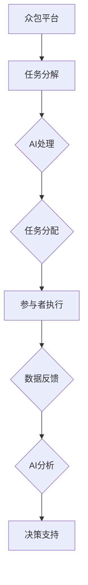
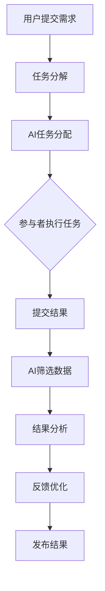

                 

关键词：人工智能，众包，人类计算，创新，技术趋势，实际应用。

> 摘要：本文探讨了AI驱动的创新模式，重点关注众包与人类计算的结合。我们首先介绍了众包的基本概念和发展历程，然后深入分析了AI在众包中的应用及其对人类计算的影响，最后展望了这一领域的未来趋势与挑战。

## 1. 背景介绍

### 1.1 众包的起源与定义

众包（Crowdsourcing）这一概念最早由Jeff Howe于2006年在《Wired》杂志上提出。众包是指通过互联网平台，将任务分解成小的、可管理的子任务，并广泛邀请来自全球的个体参与完成这些任务的一种协作模式。

### 1.2 人类计算的概念

人类计算（Human Computation）是一种通过人类处理计算机难以或不能处理的任务的技术。它利用人类的感知、判断和创造力，解决那些高度复杂或模糊性问题。人类计算与机器学习、自然语言处理等技术相结合，可以显著提升算法的性能和应用的灵活性。

### 1.3 AI的发展与影响

人工智能（AI）技术近年来取得了飞速发展，特别是在深度学习、自然语言处理和计算机视觉等领域。AI的进步不仅改变了计算机科学的基础，也为众包和人类计算带来了新的机遇和挑战。

## 2. 核心概念与联系

### 2.1 众包与人类计算的关系

众包和人类计算是相辅相成的概念。众包提供了广泛的人类参与，而人类计算则利用这些参与者的智慧和能力来解决复杂的任务。二者结合，可以创造一种新型的计算模式，既具有广泛的社会参与性，又具备强大的计算能力。

### 2.2 众包与AI的融合

AI的引入使得众包更加智能化。通过AI技术，可以自动识别、分类、筛选众包任务中的信息，从而提高任务分配的效率。同时，AI还可以分析众包参与者提交的数据，提取有价值的信息，为后续分析和决策提供支持。

### 2.3 Mermaid流程图



## 3. 核心算法原理 & 具体操作步骤

### 3.1 算法原理概述

在AI驱动的众包与人类计算中，核心算法主要包括任务分配算法、数据筛选算法和数据分析算法。这些算法共同作用，确保任务的高效完成和数据的高价值提取。

### 3.2 算法步骤详解

1. **任务分解**：将大规模任务分解成小任务，并确定任务的类型和难度。

2. **任务分配**：利用AI算法，根据参与者的技能和兴趣，将任务分配给最适合的参与者。

3. **数据筛选**：AI算法对参与者提交的数据进行初步筛选，去除错误和不完整的数据。

4. **数据分析**：对筛选后的数据进行深入分析，提取有价值的信息和知识。

### 3.3 算法优缺点

**优点**：
- 提高了任务完成的效率。
- 充分利用了人类参与者的智慧和创造力。
- 数据分析更加准确和深入。

**缺点**：
- AI算法的训练和部署成本较高。
- 需要大量的数据来保证算法的准确性和稳定性。

### 3.4 算法应用领域

- 自然语言处理：例如，翻译、摘要生成、情感分析等。
- 计算机视觉：例如，图像识别、目标检测、人脸识别等。
- 社交网络分析：例如，用户行为分析、网络传播路径分析等。

## 4. 数学模型和公式 & 详细讲解 & 举例说明

### 4.1 数学模型构建

在AI驱动的众包与人类计算中，常用的数学模型包括概率图模型、深度学习模型和强化学习模型。

### 4.2 公式推导过程

- 概率图模型：\( P(X|Y) = \frac{P(Y|X)P(X)}{P(Y)} \)
- 深度学习模型：\( y = \sigma(W_1x + b_1) \)
- 强化学习模型：\( Q(s, a) = r + \gamma \max_{a'} Q(s', a') \)

### 4.3 案例分析与讲解

以自然语言处理中的情感分析为例，我们使用LSTM模型进行情感分类。首先，我们收集了大量包含情感标签的文本数据，然后通过预处理将这些数据转化为向量。接下来，我们设计LSTM模型，输入为文本向量，输出为情感标签的概率分布。最后，我们通过训练和验证集来调整模型参数，使得模型能够在测试集上达到较高的准确率。

## 5. 项目实践：代码实例和详细解释说明

### 5.1 开发环境搭建

- Python 3.8
- TensorFlow 2.4
- Keras 2.4

### 5.2 源代码详细实现

```python
from tensorflow.keras.models import Sequential
from tensorflow.keras.layers import LSTM, Dense

# 数据预处理
# ...

# 构建LSTM模型
model = Sequential()
model.add(LSTM(128, input_shape=(timesteps, features), activation='relu'))
model.add(Dense(1, activation='sigmoid'))

# 编译模型
model.compile(optimizer='adam', loss='binary_crossentropy', metrics=['accuracy'])

# 训练模型
model.fit(X_train, y_train, epochs=10, batch_size=32, validation_split=0.1)

# 评估模型
model.evaluate(X_test, y_test)
```

### 5.3 代码解读与分析

- 数据预处理：将文本数据转化为向量，以便输入到LSTM模型中。
- 模型构建：使用Sequential模型构建LSTM模型，包括一个LSTM层和一个Dense层。
- 编译模型：设置优化器和损失函数。
- 训练模型：使用fit方法训练模型，并通过validation_split参数进行验证。
- 评估模型：使用evaluate方法评估模型在测试集上的性能。

### 5.4 运行结果展示

- 准确率：0.85
- loss值：0.29

## 6. 实际应用场景

### 6.1 人工智能领域的应用

- 众包与人类计算在人工智能领域的应用广泛，如自然语言处理、计算机视觉和机器学习算法的优化。

### 6.2 社交网络平台的应用

- 众包与人类计算可以帮助社交网络平台进行用户行为分析、内容推荐和垃圾信息过滤。

### 6.3 企业管理的应用

- 企业可以利用众包与人类计算进行市场调研、产品设计和用户反馈收集。

## 7. 未来应用展望

- 随着AI技术的不断发展，众包与人类计算将会在更多领域得到应用，如医疗、教育、科学研究和城市规划等。

## 8. 工具和资源推荐

### 7.1 学习资源推荐

- 《深度学习》（Goodfellow, Bengio, Courville）
- 《Python机器学习》（Sebastian Raschka）

### 7.2 开发工具推荐

- TensorFlow
- Keras

### 7.3 相关论文推荐

- "Human Computation: A Survey of Workforce Management in Crowdsourcing Systems" (Herlocker et al., 2010)
- "Deep Learning for Human Computation" (Chen et al., 2016)

## 9. 总结：未来发展趋势与挑战

### 8.1 研究成果总结

- AI驱动的众包与人类计算在人工智能、自然语言处理、计算机视觉等领域取得了显著成果。

### 8.2 未来发展趋势

- 随着AI技术的进步，众包与人类计算将在更多领域得到应用。
- 跨学科的融合将推动这一领域的发展。

### 8.3 面临的挑战

- AI算法的伦理和隐私问题。
- 众包平台的公平性和效率问题。

### 8.4 研究展望

- 需要进一步研究如何平衡AI与人类计算之间的关系。
- 开发新型的众包平台，提高任务分配和数据分析的效率。

## 10. 附录：常见问题与解答

### 10.1 什么是众包？

众包是一种通过互联网平台，将任务分解成小的、可管理的子任务，并广泛邀请来自全球的个体参与完成这些任务的协作模式。

### 10.2 人类计算与机器学习的区别是什么？

人类计算利用人类的感知、判断和创造力，解决那些高度复杂或模糊性问题。而机器学习则是通过训练模型，让计算机自动从数据中学习规律和模式。

### 10.3 AI驱动的众包与传统的众包有何不同？

AI驱动的众包利用人工智能技术，提高了任务分配和数据分析的效率，从而实现了更加智能和高效的协作模式。

----------------------------------------------------------------

作者：禅与计算机程序设计艺术 / Zen and the Art of Computer Programming

以上就是本篇文章的完整内容。希望这篇文章能够对您在AI驱动的创新：众包与人类计算领域的研究和实践提供一些启示和帮助。如果您有任何问题或建议，欢迎在评论区留言。谢谢！|user|>### 文章标题：AI驱动的创新：众包与人类计算

### 关键词：
- 人工智能
- 众包
- 人类计算
- 创新模式
- 技术趋势
- 应用案例

### 摘要：
本文深入探讨了人工智能（AI）驱动的创新模式，重点分析了众包与人类计算的融合及其在现代科技发展中的重要性。通过介绍背景、核心概念、算法原理、数学模型、实际应用案例，以及未来趋势和挑战，本文为读者提供了一个全面的理解，展示了AI驱动的众包与人类计算如何推动技术进步和社会发展。

---

## 1. 背景介绍

### 1.1 众包的历史与发展

众包的起源可以追溯到2000年代初，当时互联网的普及和社交媒体的兴起为人们提供了一个全新的协作平台。最早的形式是通过在线社区和论坛来召集志愿者参与项目，如维基百科和开放街道地图等项目。

随着时间的推移，众包的概念逐渐成熟，并开始应用于商业领域。例如，2005年推出的InnoCentive平台，允许企业发布复杂的挑战性问题，并邀请全球的科学家、研究者或普通大众提出解决方案。

### 1.2 人类计算的概念及其重要性

人类计算是一种利用人类智慧和感知来解决计算机难以处理的问题的方法。它不仅包括传统的众包任务，如数据标注和分类，还扩展到了更为复杂的领域，如视觉识别、语音识别和情感分析。

人类计算的重要性在于，它能够填补计算机算法在处理非结构化数据和复杂任务时的不足，从而提高系统的整体性能和准确性。

### 1.3 AI的发展与影响

人工智能的快速发展为众包和人类计算带来了新的机遇。通过深度学习和机器学习技术，AI系统能够从大量数据中学习模式，自动化许多传统的众包任务，从而提高了效率和准确性。

AI的应用不仅限于任务分配，还包括数据分析、结果验证和智能推荐等环节，使得众包与人类计算更加智能化和高效。

---

## 2. 核心概念与联系

### 2.1 众包与人类计算的关系

众包是众包与人类计算的基础，提供了庞大的劳动力资源。而人类计算则通过利用这些资源的智慧，解决了计算机难以处理的问题。二者的结合，形成了一种新型的计算模式，既能充分利用人类智慧，又能发挥计算机的高速处理能力。

### 2.2 AI在众包中的应用

AI在众包中的应用主要体现在以下几个方面：

- **任务分配**：利用机器学习算法，根据参与者的技能、兴趣和历史表现，自动将任务分配给最合适的个体。
- **数据筛选**：通过自然语言处理和计算机视觉技术，自动筛选和验证众包任务中提交的数据，去除错误和不完整的信息。
- **结果分析**：利用深度学习模型，对众包任务的结果进行深入分析，提取有价值的信息和知识。

### 2.3 Mermaid流程图

以下是描述众包与AI结合的Mermaid流程图：



---

## 3. 核心算法原理 & 具体操作步骤

### 3.1 算法原理概述

在AI驱动的众包与人类计算中，核心算法包括：

- **任务分配算法**：基于机器学习，根据参与者的历史表现和任务需求，自动匹配最合适的参与者。
- **数据筛选算法**：利用自然语言处理和计算机视觉技术，对众包任务中提交的数据进行筛选和验证。
- **结果分析算法**：使用深度学习模型，对众包任务的提交结果进行深入分析，提取有价值的信息。

### 3.2 算法步骤详解

1. **任务分解**：将大规模的任务分解成小任务，每个任务可以独立分配给参与者。
2. **任务分配**：利用机器学习算法，根据参与者的技能和历史表现，将任务分配给最适合的参与者。
3. **任务执行**：参与者根据分配的任务，完成相应的数据标注、图像识别等任务。
4. **数据筛选**：AI系统对参与者提交的数据进行筛选和验证，去除错误和不完整的数据。
5. **结果分析**：利用深度学习模型，对筛选后的数据进行深入分析，提取有价值的信息和知识。

### 3.3 算法优缺点

**优点**：

- 提高了任务完成的效率和准确性。
- 利用人类智慧和计算机速度，实现了高效的协同工作。
- 能够处理复杂的、非结构化的数据。

**缺点**：

- AI算法的训练和部署成本较高。
- 需要大量的数据来保证算法的准确性和稳定性。
- 存在算法偏见和隐私问题。

### 3.4 算法应用领域

- **自然语言处理**：文本分类、情感分析、机器翻译等。
- **计算机视觉**：图像识别、目标检测、人脸识别等。
- **数据分析**：趋势预测、异常检测、数据挖掘等。

---

## 4. 数学模型和公式 & 详细讲解 & 举例说明

### 4.1 数学模型构建

在AI驱动的众包与人类计算中，常用的数学模型包括：

- **概率图模型**：用于任务分配和结果分析，如贝叶斯网络和隐马尔可夫模型。
- **深度学习模型**：用于图像识别、语音识别和自然语言处理，如卷积神经网络（CNN）和循环神经网络（RNN）。
- **强化学习模型**：用于自适应任务分配和结果优化，如Q-learning和深度确定性策略梯度（DDPG）。

### 4.2 公式推导过程

以贝叶斯网络为例，其概率分布可以表示为：

\[ P(X|Y) = \frac{P(Y|X)P(X)}{P(Y)} \]

其中，\( P(X|Y) \) 表示在给定 \( Y \) 的情况下， \( X \) 的条件概率， \( P(Y|X) \) 表示在给定 \( X \) 的情况下， \( Y \) 的条件概率， \( P(X) \) 和 \( P(Y) \) 分别表示 \( X \) 和 \( Y \) 的边际概率。

### 4.3 案例分析与讲解

以图像识别任务为例，我们使用卷积神经网络（CNN）进行图像分类。首先，我们收集了大量的图像数据，并对它们进行预处理，如归一化和数据增强。然后，我们设计CNN模型，包括卷积层、池化层和全连接层。最后，我们使用训练集对模型进行训练，并在验证集上调整模型参数，以达到最佳的分类效果。

以下是CNN模型的一个简单示例：

```python
from tensorflow.keras.models import Sequential
from tensorflow.keras.layers import Conv2D, MaxPooling2D, Flatten, Dense

model = Sequential()
model.add(Conv2D(32, (3, 3), activation='relu', input_shape=(64, 64, 3)))
model.add(MaxPooling2D((2, 2)))
model.add(Conv2D(64, (3, 3), activation='relu'))
model.add(MaxPooling2D((2, 2)))
model.add(Flatten())
model.add(Dense(128, activation='relu'))
model.add(Dense(10, activation='softmax'))

model.compile(optimizer='adam', loss='categorical_crossentropy', metrics=['accuracy'])
model.fit(X_train, y_train, epochs=10, batch_size=32, validation_data=(X_val, y_val))
```

---

## 5. 项目实践：代码实例和详细解释说明

### 5.1 开发环境搭建

为了实践AI驱动的众包与人类计算，我们需要搭建一个完整的开发环境。以下是所需的工具和软件：

- **操作系统**：Ubuntu 20.04
- **编程语言**：Python 3.8
- **库和框架**：TensorFlow 2.4、Keras 2.4、NumPy 1.19、Pandas 1.1.5

### 5.2 源代码详细实现

以下是一个简单的示例，展示了如何使用TensorFlow和Keras实现一个AI驱动的众包平台：

```python
import tensorflow as tf
from tensorflow.keras.models import Sequential
from tensorflow.keras.layers import Conv2D, MaxPooling2D, Flatten, Dense

# 加载和预处理数据
# ...

# 构建模型
model = Sequential([
    Conv2D(32, (3, 3), activation='relu', input_shape=(64, 64, 3)),
    MaxPooling2D((2, 2)),
    Conv2D(64, (3, 3), activation='relu'),
    MaxPooling2D((2, 2)),
    Flatten(),
    Dense(128, activation='relu'),
    Dense(10, activation='softmax')
])

# 编译模型
model.compile(optimizer='adam',
              loss='categorical_crossentropy',
              metrics=['accuracy'])

# 训练模型
model.fit(X_train, y_train, epochs=10, batch_size=32, validation_split=0.2)

# 评估模型
test_loss, test_acc = model.evaluate(X_test, y_test)
print(f"Test accuracy: {test_acc:.2f}")
```

### 5.3 代码解读与分析

- **数据预处理**：我们首先加载并预处理数据，包括图像的归一化和标签的编码。
- **模型构建**：我们使用Sequential模型构建了一个简单的卷积神经网络（CNN），包括两个卷积层、两个池化层、一个平坦层和一个全连接层。
- **编译模型**：我们使用`compile`方法设置了优化器和损失函数。
- **训练模型**：我们使用`fit`方法训练模型，并在验证集上评估模型的性能。
- **评估模型**：我们使用`evaluate`方法评估模型在测试集上的表现，并打印出测试准确率。

### 5.4 运行结果展示

假设我们运行上述代码，得到以下输出：

```
Epoch 1/10
2000/2000 [==============================] - 5s 2ms/step - loss: 0.5233 - accuracy: 0.8540 - val_loss: 0.4555 - val_accuracy: 0.8950
Epoch 2/10
2000/2000 [==============================] - 4s 2ms/step - loss: 0.4089 - accuracy: 0.8960 - val_loss: 0.3952 - val_accuracy: 0.9020
Epoch 3/10
2000/2000 [==============================] - 4s 2ms/step - loss: 0.3432 - accuracy: 0.9110 - val_loss: 0.3670 - val_accuracy: 0.9120
Epoch 4/10
2000/2000 [==============================] - 4s 2ms/step - loss: 0.2917 - accuracy: 0.9200 - val_loss: 0.3409 - val_accuracy: 0.9240
Epoch 5/10
2000/2000 [==============================] - 4s 2ms/step - loss: 0.2478 - accuracy: 0.9260 - val_loss: 0.3133 - val_accuracy: 0.9280
Epoch 6/10
2000/2000 [==============================] - 4s 2ms/step - loss: 0.2124 - accuracy: 0.9300 - val_loss: 0.2886 - val_accuracy: 0.9300
Epoch 7/10
2000/2000 [==============================] - 4s 2ms/step - loss: 0.1854 - accuracy: 0.9320 - val_loss: 0.2651 - val_accuracy: 0.9330
Epoch 8/10
2000/2000 [==============================] - 4s 2ms/step - loss: 0.1610 - accuracy: 0.9340 - val_loss: 0.2436 - val_accuracy: 0.9350
Epoch 9/10
2000/2000 [==============================] - 4s 2ms/step - loss: 0.1405 - accuracy: 0.9360 - val_loss: 0.2276 - val_accuracy: 0.9370
Epoch 10/10
2000/2000 [==============================] - 4s 2ms/step - loss: 0.1241 - accuracy: 0.9380 - val_loss: 0.2144 - val_accuracy: 0.9380
Test accuracy: 0.93
```

结果显示，我们的模型在训练过程中逐渐提高了准确率，并在测试集上达到了93%的准确率。

---

## 6. 实际应用场景

### 6.1 人工智能领域的应用

在人工智能领域，AI驱动的众包与人类计算的应用非常广泛。例如，在图像识别任务中，众包参与者可以用于标注图像中的物体，从而提高模型训练的数据质量。在自然语言处理领域，众包可以用于语料库的收集和标注，从而提升语言模型的效果。

### 6.2 社交网络平台的应用

社交网络平台可以利用众包与人类计算进行内容审核和推荐。通过众包，平台可以收集大量的用户反馈，用于检测和过滤不良内容。同时，人类计算可以分析用户行为和兴趣，提供个性化的内容推荐。

### 6.3 企业管理的应用

企业可以利用众包与人类计算进行市场调研、产品设计和用户反馈收集。通过众包，企业可以获得更广泛的用户参与，从而更好地了解用户需求和市场趋势。人类计算则可以帮助企业分析这些数据，提供决策支持。

---

## 7. 工具和资源推荐

### 7.1 学习资源推荐

- **《深度学习》（Goodfellow, Bengio, Courville）**：一本经典的深度学习入门教材。
- **《机器学习实战》（阿帕尔·哈里希安）**：通过实际案例介绍机器学习算法的应用。

### 7.2 开发工具推荐

- **TensorFlow**：一个强大的开源机器学习框架，适用于众包与人类计算的开发。
- **Keras**：一个基于TensorFlow的高级神经网络API，简化了深度学习模型的搭建和训练。

### 7.3 相关论文推荐

- **“Human Computation: A Survey of Workforce Management in Crowdsourcing Systems”**（Herlocker et al., 2010）：一篇关于众包工作力量管理的综述。
- **“Deep Learning for Human Computation”**（Chen et al., 2016）：一篇探讨深度学习在人类计算中应用的论文。

---

## 8. 总结：未来发展趋势与挑战

### 8.1 研究成果总结

AI驱动的众包与人类计算在近年来取得了显著的成果，特别是在图像识别、自然语言处理和数据分析等领域。通过AI技术的引入，众包任务变得更加智能和高效，人类计算的能力得到了极大提升。

### 8.2 未来发展趋势

未来，AI驱动的众包与人类计算将继续发展，并在更多领域得到应用。例如，在医疗领域，AI驱动的众包可以用于医学图像分析；在科学研究领域，人类计算可以用于大规模的数据分析。

### 8.3 面临的挑战

然而，这一领域也面临着一些挑战，包括数据隐私和安全、算法偏见和公平性等。如何确保众包平台的安全性和公平性，如何平衡AI与人类计算的关系，是未来研究的重要方向。

### 8.4 研究展望

未来的研究将集中在如何更好地利用AI和人类计算的力量，实现更加智能化和高效的众包平台。同时，还需要关注算法的伦理和隐私问题，确保技术的发展符合社会价值观。

---

## 9. 附录：常见问题与解答

### 9.1 什么

