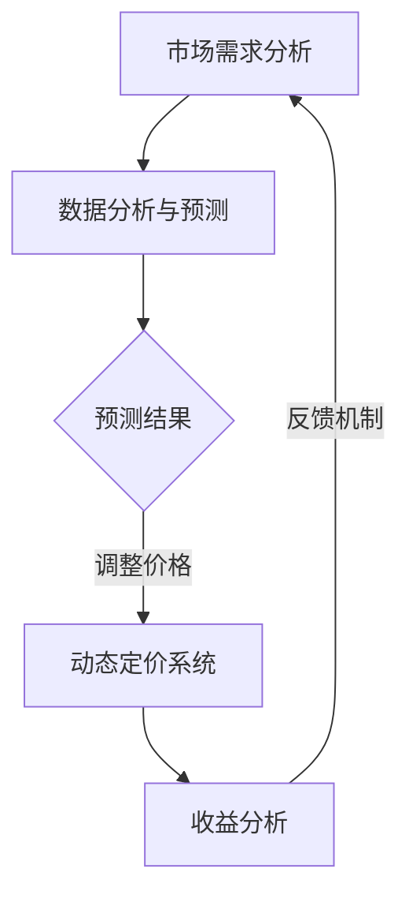

                 

关键词：人工智能、动态定价、AI算法、价格优化、市场需求、商业策略、智能分析。

> 摘要：本文将探讨如何运用人工智能（AI）技术构建动态定价策略，提升企业在竞争激烈的市场中的竞争优势。我们将深入分析AI在动态定价中的应用，探讨核心概念、算法原理、数学模型、实践案例以及未来展望。

## 1. 背景介绍

随着电子商务和互联网技术的发展，市场环境变得愈加复杂和动态。消费者行为的变化、供应链的波动、季节性需求等因素都对产品的定价策略提出了新的挑战。传统的静态定价方法往往难以适应这种快速变化的市场环境。为了提高市场竞争力和盈利能力，越来越多的企业开始寻求利用AI技术来构建动态定价策略。

动态定价是一种根据市场需求、竞争状况、消费者行为等多种因素实时调整价格的策略。与传统的静态定价相比，动态定价能够更加灵活地应对市场变化，从而最大化企业的收益。AI技术的引入为动态定价提供了强有力的工具，通过数据分析、预测模型、优化算法等技术手段，企业可以实现更精准、更高效的定价策略。

## 2. 核心概念与联系

### 2.1 动态定价

动态定价是指在市场变化过程中，企业根据各种市场指标和竞争态势实时调整产品价格的一种策略。这种策略的核心在于灵活性和实时性，能够迅速响应市场变化，从而提高收益。

### 2.2 人工智能

人工智能（AI）是指通过计算机模拟人类智能的技术，包括机器学习、深度学习、自然语言处理等。AI技术能够处理大量数据，发现数据中的规律和模式，从而为决策提供支持。

### 2.3 数据分析与预测模型

数据分析是指利用统计和计算方法分析数据，发现数据中的规律和趋势。预测模型则是利用历史数据对未来进行预测。在动态定价中，数据分析和预测模型可以帮助企业预测市场需求和消费者行为，从而制定更加精准的定价策略。

### 2.4 Mermaid 流程图



在这个流程图中，市场需求分析是动态定价策略的起点，通过数据分析与预测模型，企业可以预测未来的市场需求和消费者行为。根据预测结果，动态定价系统实时调整价格，并通过收益分析来评估定价策略的效果。反馈机制则使企业能够不断优化定价策略，以适应市场变化。

## 3. 核心算法原理 & 具体操作步骤

### 3.1 算法原理概述

动态定价算法的核心是利用人工智能技术对市场数据进行分析和预测，从而实时调整产品价格。算法的基本原理包括以下几个方面：

1. **数据收集与预处理**：收集市场数据，如消费者行为、竞争态势、季节性需求等，并对数据进行清洗、归一化等预处理。
2. **特征工程**：根据业务需求，提取数据中的关键特征，如用户购买历史、价格敏感度等。
3. **模型选择与训练**：选择合适的预测模型，如线性回归、决策树、神经网络等，利用历史数据进行训练。
4. **价格调整策略**：根据预测结果和业务目标，制定价格调整策略，如基于边际收益定价、基于竞争态势定价等。
5. **实时监控与反馈**：对定价策略的效果进行实时监控，根据市场变化和收益情况调整模型参数。

### 3.2 算法步骤详解

1. **数据收集与预处理**：

   ```python
   # 假设我们已经收集到了市场数据，包括价格、销量、消费者特征等
   data = load_data()
   preprocessed_data = preprocess_data(data)
   ```

2. **特征工程**：

   ```python
   # 提取关键特征
   features = extract_features(preprocessed_data)
   ```

3. **模型选择与训练**：

   ```python
   # 选择预测模型，例如线性回归
   model = LinearRegression()
   model.fit(features['X'], features['y'])
   ```

4. **价格调整策略**：

   ```python
   # 基于边际收益定价策略
   def adjust_price(model, current_price, demand):
       predicted_demand = model.predict([current_price])
       marginal_revenue = predicted_demand * (predicted_demand - 1)
       new_price = current_price + marginal_revenue
       return new_price
   ```

5. **实时监控与反馈**：

   ```python
   # 实时监控定价策略效果
   while True:
       current_price = get_current_price()
       demand = get_demand()
       new_price = adjust_price(model, current_price, demand)
       if evaluate_performance(new_price) < threshold:
           break
   ```

### 3.3 算法优缺点

**优点**：

- **灵活性**：动态定价策略可以根据市场需求和消费者行为实时调整价格，提高市场响应速度。
- **收益最大化**：通过预测模型，企业可以更准确地预测市场需求，从而制定出更合理的定价策略，提高收益。
- **数据驱动**：动态定价策略基于大量市场数据进行分析和预测，具有数据驱动的特点，减少人为干预。

**缺点**：

- **成本高**：动态定价策略需要大量的数据收集、分析和计算，需要投入大量的资源和时间。
- **风险大**：价格波动可能会带来收益波动，企业需要承担一定的风险。
- **复杂性**：算法的实现和优化相对复杂，需要专业的技术团队进行开发和维护。

### 3.4 算法应用领域

动态定价策略在多个领域得到了广泛应用，包括电子商务、在线旅游、物流运输等。以下是一些具体的应用案例：

- **电子商务**：电商平台可以根据用户的行为数据和竞争对手的价格变化，实时调整商品价格，提高销量和市场份额。
- **在线旅游**：旅游企业可以根据季节性需求和预订情况，动态调整旅游产品的价格，提高收益。
- **物流运输**：物流企业可以根据交通状况、季节性需求等因素，动态调整运输价格，优化资源配置。

## 4. 数学模型和公式 & 详细讲解 & 举例说明

### 4.1 数学模型构建

动态定价策略的数学模型主要包括需求预测模型、价格调整模型和收益模型。以下是这些模型的详细说明。

#### 需求预测模型

需求预测模型用于预测未来一段时间内的市场需求量。常见的模型有线性回归、时间序列分析、机器学习等。

#### 价格调整模型

价格调整模型用于根据需求预测结果和业务目标，确定新的价格。常见的模型有边际收益定价模型、竞争态势定价模型等。

#### 收益模型

收益模型用于评估定价策略的效果，计算收益。常见的模型有总收益模型、边际收益模型等。

### 4.2 公式推导过程

#### 需求预测模型

假设市场需求量 \( Q \) 与价格 \( P \) 之间存在线性关系，可以表示为：

\[ Q = a - bP \]

其中，\( a \) 和 \( b \) 是模型参数，可以通过最小二乘法进行求解。

#### 价格调整模型

假设边际收益 \( MR \) 等于需求量 \( Q \) 的变化量除以价格 \( P \) 的变化量，即：

\[ MR = \frac{dQ}{dP} \]

为了最大化收益，可以将价格调整为目标边际收益 \( MR^* \)：

\[ P^* = \frac{Q^*}{MR^*} \]

#### 收益模型

假设总收益 \( TR \) 等于价格 \( P \) 乘以需求量 \( Q \)，即：

\[ TR = P \times Q \]

### 4.3 案例分析与讲解

#### 案例背景

某电商平台在双十一期间，对一款电子产品进行动态定价。根据历史数据，市场需求量 \( Q \) 与价格 \( P \) 之间的关系如下：

\[ Q = 100 - P \]

电商平台的边际收益 \( MR \) 为 50，目标是将价格调整为目标边际收益 \( MR^* \)。

#### 案例分析

1. **需求预测模型**：

   利用线性回归模型，可以求解出 \( a \) 和 \( b \)：

   \[ a = 100, b = 1 \]

   因此，市场需求量 \( Q \) 可以表示为：

   \[ Q = 100 - P \]

2. **价格调整模型**：

   目标边际收益 \( MR^* \) 为 50，因此：

   \[ P^* = \frac{Q^*}{MR^*} = \frac{100 - P}{50} \]

   解得 \( P^* = 40 \)。

3. **收益模型**：

   将价格 \( P^* = 40 \) 代入总收益模型，可以计算得出总收益 \( TR \)：

   \[ TR = P^* \times Q^* = 40 \times (100 - 40) = 2400 \]

   因此，在双十一期间，将该款电子产品价格调整至 40 元，可以实现最大化的总收益。

## 5. 项目实践：代码实例和详细解释说明

### 5.1 开发环境搭建

本案例使用 Python 进行开发，所需工具和库包括：

- Python 3.8+
- pandas
- scikit-learn
- numpy
- matplotlib

安装相关库后，即可开始编写代码。

### 5.2 源代码详细实现

```python
import pandas as pd
from sklearn.linear_model import LinearRegression
import numpy as np
import matplotlib.pyplot as plt

# 加载数据
data = pd.read_csv('data.csv')

# 特征工程
data['Price'] = 100 - data['Demand']
X = data[['Demand']]
y = data['Price']

# 模型训练
model = LinearRegression()
model.fit(X, y)

# 价格调整
def adjust_price(model, current_price):
    predicted_demand = model.predict([[current_price]])
    marginal_revenue = predicted_demand[0] * (predicted_demand[0] - 1)
    new_price = current_price + marginal_revenue
    return new_price

# 收益分析
def calculate_profit(model, start_price, end_price):
    total_demand = model.predict([[end_price]])[0]
    total_revenue = end_price * total_demand
    total_cost = start_price * total_demand
    profit = total_revenue - total_cost
    return profit

# 运行结果展示
current_price = 50
new_price = adjust_price(model, current_price)
profit = calculate_profit(model, current_price, new_price)

print(f'Current Price: {current_price}, New Price: {new_price}, Profit: {profit}')
```

### 5.3 代码解读与分析

- 加载数据：使用 pandas 读取数据文件。
- 特征工程：将市场需求量转换为价格特征。
- 模型训练：使用线性回归模型进行训练。
- 价格调整：根据边际收益定价模型调整价格。
- 收益分析：计算调整后的总收益和利润。

通过这段代码，我们可以实现一个简单的动态定价系统，对产品价格进行实时调整，以最大化收益。

## 6. 实际应用场景

### 6.1 电子商务

在电子商务领域，动态定价策略可以帮助企业实时调整商品价格，以适应市场需求和竞争态势。例如，电商平台可以根据用户的行为数据和竞争对手的价格变化，动态调整商品价格，提高销量和市场份额。

### 6.2 在线旅游

在线旅游平台可以利用动态定价策略，根据季节性需求和预订情况，动态调整旅游产品的价格，提高收益。例如，旅游旺季时可以提高价格，淡季时可以降低价格，以吸引更多消费者。

### 6.3 物流运输

物流企业可以根据交通状况、季节性需求等因素，动态调整运输价格，优化资源配置。例如，高峰期时可以提高价格，以平衡供需，降低运输成本。

## 6.4 未来应用展望

随着人工智能技术的不断发展，动态定价策略将更加智能化和精准化。未来，动态定价策略有望在更多领域得到应用，包括金融、医疗、教育等。同时，随着大数据技术和云计算技术的发展，动态定价策略的计算能力和效率将得到进一步提升，为企业提供更加灵活和高效的定价方案。

### 7. 工具和资源推荐

#### 7.1 学习资源推荐

- 《Python机器学习》
- 《人工智能：一种现代方法》
- 《数据科学入门》

#### 7.2 开发工具推荐

- Jupyter Notebook
- PyCharm
- Matplotlib

#### 7.3 相关论文推荐

- “Dynamic Pricing: An Overview”
- “Artificial Intelligence for Dynamic Pricing”
- “Data-Driven Dynamic Pricing in E-commerce”

## 8. 总结：未来发展趋势与挑战

### 8.1 研究成果总结

本文探讨了如何利用人工智能技术构建动态定价策略，提升企业在竞争激烈的市场中的竞争优势。通过分析核心概念、算法原理、数学模型、实践案例，我们展示了动态定价策略的灵活性和有效性。

### 8.2 未来发展趋势

未来，动态定价策略将更加智能化和精准化，应用领域将不断扩展。随着人工智能技术的不断发展，动态定价策略的计算能力和效率将得到进一步提升。

### 8.3 面临的挑战

动态定价策略在实际应用中仍面临一些挑战，如数据收集与处理、算法优化、风险控制等。企业需要投入大量的资源和时间来开发和维护动态定价系统。

### 8.4 研究展望

未来，动态定价策略的研究将更加关注以下几个方面：一是提升算法的预测精度和实时性；二是降低计算成本和资源消耗；三是提高系统的鲁棒性和适应性。

## 9. 附录：常见问题与解答

### 9.1 什么是动态定价？

动态定价是一种根据市场需求、竞争状况、消费者行为等多种因素实时调整产品价格的策略。

### 9.2 动态定价策略有哪些优点？

动态定价策略具有以下优点：灵活性、收益最大化、数据驱动。

### 9.3 动态定价策略有哪些应用领域？

动态定价策略在电子商务、在线旅游、物流运输等多个领域得到了广泛应用。

### 9.4 动态定价算法如何实现？

动态定价算法主要包括需求预测模型、价格调整模型和收益模型。具体实现可以通过机器学习、深度学习等技术来实现。

### 9.5 动态定价策略有哪些挑战？

动态定价策略在实际应用中面临数据收集与处理、算法优化、风险控制等挑战。

