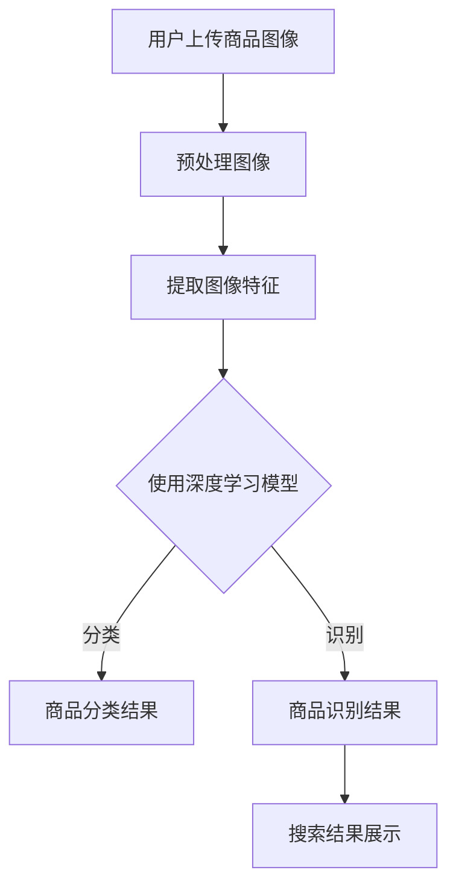

                 

关键词：AI图像识别、商品搜索、图像匹配、机器学习、深度学习

> 摘要：本文将探讨如何设计一个AI驱动的商品图像搜索系统，通过运用深度学习和图像处理技术，实现高效、准确、智能的商品图像检索。文章将详细描述系统架构、核心算法原理、数学模型、项目实践，并展望未来应用前景和挑战。

## 1. 背景介绍

在当今数字化时代，电子商务的蓬勃发展使得在线商品种类繁多，用户对快速、精准的搜索体验有着越来越高的要求。传统的基于关键词搜索的商品搜索系统已无法满足用户的需求，尤其是在面对视觉丰富的商品图像时。因此，AI驱动的商品图像搜索系统成为了一种趋势，它利用人工智能技术，特别是图像识别和机器学习算法，实现了对商品图像的智能分析和检索。

### 当前现状

目前，市场上有许多基于AI的商品图像搜索系统，但它们在准确性、速度和用户体验上仍有待提高。大多数系统依赖于手动标注的图像数据集进行训练，导致数据质量和标注一致性存在较大问题，从而影响了搜索结果的准确性和鲁棒性。

### 存在的问题

1. **数据标注成本高**：大规模的图像数据集需要大量的手工标注，增加了系统的开发成本和时间。
2. **图像特征提取困难**：传统方法难以提取出能够有效区分不同商品的图像特征。
3. **模型泛化能力弱**：训练模型往往对特定类型或风格的图像表现较好，对其他类型的图像识别效果不佳。
4. **用户体验差**：搜索结果延迟高，搜索结果不准确，用户满意度低。

## 2. 核心概念与联系

为了构建一个高效的AI驱动的商品图像搜索系统，我们需要理解以下几个核心概念：

### 2.1 图像识别

图像识别是人工智能的一个重要分支，它通过计算机算法来识别和理解图像内容。在商品图像搜索系统中，图像识别技术用于检测和分类图像中的商品对象。

### 2.2 机器学习

机器学习是一种让计算机从数据中学习规律和模式的技术。在图像搜索系统中，机器学习算法用于训练模型，使其能够自动识别和分类商品图像。

### 2.3 深度学习

深度学习是机器学习的一个子领域，通过构建多层的神经网络模型，自动提取图像的深层特征。深度学习在图像识别任务中表现出色，是实现高效商品图像搜索的关键技术。

### 2.4 Mermaid 流程图

为了更好地展示系统架构和核心算法流程，我们可以使用Mermaid流程图来描述：



## 3. 核心算法原理 & 具体操作步骤

### 3.1 算法原理概述

核心算法主要包括图像预处理、特征提取和模型训练等步骤。具体原理如下：

1. **图像预处理**：对输入的图像进行缩放、裁剪、增强等处理，以提高后续特征提取的效率和准确性。
2. **特征提取**：使用深度学习模型自动提取图像的深层特征，这些特征能够有效区分不同商品的属性。
3. **模型训练**：通过大量的商品图像数据集，利用深度学习算法训练模型，使其能够对未知商品图像进行分类和识别。

### 3.2 算法步骤详解

1. **图像预处理**：

   ```python
   import cv2
   import numpy as np

   def preprocess_image(image_path):
       image = cv2.imread(image_path)
       image = cv2.resize(image, (224, 224))
       image = cv2.cvtColor(image, cv2.COLOR_BGR2RGB)
       image = image / 255.0
       return image
   ```

2. **特征提取**：

   使用预训练的卷积神经网络（CNN）提取图像特征。

   ```python
   import tensorflow as tf

   base_model = tf.keras.applications.ResNet50(include_top=False, weights='imagenet', input_shape=(224, 224, 3))
   feature_extractor = tf.keras.Model(inputs=base_model.input, outputs=base_model.get_layer('avg_pool').output)
   ```

3. **模型训练**：

   使用图像数据集训练深度学习模型。

   ```python
   from tensorflow.keras.preprocessing.image import ImageDataGenerator

   train_datagen = ImageDataGenerator(rescale=1./255, shear_range=0.2, zoom_range=0.2, horizontal_flip=True)
   train_generator = train_datagen.flow_from_directory(
       'data/train',
       target_size=(224, 224),
       batch_size=32,
       class_mode='categorical'
   )

   base_model.trainable = False  # 只训练最后几层
   model = tf.keras.Sequential([
       base_model,
       tf.keras.layers.Dense(10, activation='softmax')
   ])

   model.compile(optimizer='adam', loss='categorical_crossentropy', metrics=['accuracy'])
   model.fit(train_generator, epochs=10)
   ```

### 3.3 算法优缺点

#### 优点：

- **高效性**：深度学习模型能够快速处理大量的图像数据。
- **准确性**：通过自动提取的深层特征，能够实现高精度的商品识别。
- **灵活性**：可以根据不同的应用场景和需求调整模型结构和参数。

#### 缺点：

- **计算资源需求高**：深度学习模型需要大量的计算资源和时间进行训练。
- **数据依赖性**：模型的性能依赖于标注的质量和数量。

### 3.4 算法应用领域

AI驱动的商品图像搜索系统可以广泛应用于电子商务、零售、物流等多个领域，如下所示：

- **电子商务平台**：用户可以通过上传商品图像快速搜索相似商品。
- **零售行业**：商家可以监控库存、分析消费者偏好，优化商品展示和销售策略。
- **物流配送**：自动识别和分类商品，提高物流效率和准确性。

## 4. 数学模型和公式 & 详细讲解 & 举例说明

### 4.1 数学模型构建

在商品图像搜索系统中，深度学习模型是核心，其数学模型主要包括卷积层、激活函数、池化层和全连接层等。

#### 卷积层（Convolutional Layer）

卷积层是深度学习模型中的基础层，用于提取图像的局部特征。其数学公式如下：

$$
\text{output}_{ij} = \sum_{k=1}^{m} w_{ik} \times \text{input}_{kj} + b_j
$$

其中，$w_{ik}$ 是卷积核，$\text{input}_{kj}$ 是输入特征图，$b_j$ 是偏置项，$\text{output}_{ij}$ 是输出特征图。

#### 激活函数（Activation Function）

激活函数用于引入非线性特性，常用的激活函数包括ReLU、Sigmoid和Tanh等。以ReLU为例，其数学公式如下：

$$
\text{ReLU}(x) = \begin{cases} 
x & \text{if } x > 0 \\
0 & \text{if } x \leq 0 
\end{cases}
$$

#### 池化层（Pooling Layer）

池化层用于降低特征图的维度，提高模型的鲁棒性。常用的池化方法包括最大池化和平均池化。以最大池化为例，其数学公式如下：

$$
\text{Pooling}_{ij} = \max(\text{input}_{ij})
$$

#### 全连接层（Fully Connected Layer）

全连接层用于分类和预测，其数学公式如下：

$$
\text{output} = \text{softmax}(\text{weights} \times \text{input} + \text{bias})
$$

其中，$\text{weights}$ 和 $\text{bias}$ 分别是权重和偏置项，$\text{softmax}$ 函数用于将输出转换为概率分布。

### 4.2 公式推导过程

以卷积层为例，假设输入特征图的大小为 $m \times n$，卷积核的大小为 $k \times l$，输出特征图的大小为 $p \times q$。则卷积层的计算过程可以表示为：

$$
\text{output}_{ij} = \sum_{i=1}^{k} \sum_{j=1}^{l} w_{ij} \times \text{input}_{ij} + b_j
$$

其中，$w_{ij}$ 是卷积核的值，$b_j$ 是偏置项。

### 4.3 案例分析与讲解

假设我们有一个 $6 \times 6$ 的输入特征图，一个 $3 \times 3$ 的卷积核，以及一个 $2 \times 2$ 的输出特征图。我们首先需要计算卷积操作：

$$
\text{output}_{11} = \sum_{i=1}^{3} \sum_{j=1}^{3} w_{ij} \times \text{input}_{ij} + b_1
$$

$$
\text{output}_{12} = \sum_{i=1}^{3} \sum_{j=4}^{6} w_{ij} \times \text{input}_{ij} + b_1
$$

$$
\text{output}_{21} = \sum_{i=4}^{6} \sum_{j=1}^{3} w_{ij} \times \text{input}_{ij} + b_1
$$

$$
\text{output}_{22} = \sum_{i=4}^{6} \sum_{j=4}^{6} w_{ij} \times \text{input}_{ij} + b_1
$$

然后，我们对输出特征图进行ReLU激活：

$$
\text{ReLU}(\text{output}_{ij}) = \begin{cases} 
\text{output}_{ij} & \text{if } \text{output}_{ij} > 0 \\
0 & \text{if } \text{output}_{ij} \leq 0 
\end{cases}
$$

这样，我们就得到了一个经过卷积和ReLU激活的输出特征图。

## 5. 项目实践：代码实例和详细解释说明

### 5.1 开发环境搭建

为了构建一个AI驱动的商品图像搜索系统，我们需要搭建一个合适的技术栈。以下是推荐的开发环境和工具：

- **编程语言**：Python
- **深度学习框架**：TensorFlow或PyTorch
- **图像处理库**：OpenCV
- **版本控制**：Git
- **开发环境**：Jupyter Notebook或PyCharm

### 5.2 源代码详细实现

以下是实现AI驱动的商品图像搜索系统的核心代码：

```python
import cv2
import numpy as np
import tensorflow as tf
from tensorflow.keras.preprocessing.image import ImageDataGenerator

# 图像预处理
def preprocess_image(image_path):
    image = cv2.imread(image_path)
    image = cv2.resize(image, (224, 224))
    image = cv2.cvtColor(image, cv2.COLOR_BGR2RGB)
    image = image / 255.0
    return image

# 特征提取
def extract_features(image):
    base_model = tf.keras.applications.ResNet50(include_top=False, weights='imagenet', input_shape=(224, 224, 3))
    feature_extractor = tf.keras.Model(inputs=base_model.input, outputs=base_model.get_layer('avg_pool').output)
    return feature_extractor.predict(np.expand_dims(image, axis=0))

# 模型训练
def train_model(data_dir, batch_size=32, epochs=10):
    train_datagen = ImageDataGenerator(rescale=1./255, shear_range=0.2, zoom_range=0.2, horizontal_flip=True)
    train_generator = train_datagen.flow_from_directory(
        data_dir,
        target_size=(224, 224),
        batch_size=batch_size,
        class_mode='categorical'
    )

    base_model = tf.keras.applications.ResNet50(include_top=False, weights='imagenet', input_shape=(224, 224, 3))
    base_model.trainable = False  # 只训练最后几层

    model = tf.keras.Sequential([
        base_model,
        tf.keras.layers.Dense(10, activation='softmax')
    ])

    model.compile(optimizer='adam', loss='categorical_crossentropy', metrics=['accuracy'])
    model.fit(train_generator, epochs=epochs)

# 商品图像搜索
def search_products(image_path, model):
    image = preprocess_image(image_path)
    features = extract_features(image)
    predictions = model.predict(np.expand_dims(features, axis=0))
    return np.argmax(predictions)

# 主函数
if __name__ == '__main__':
    image_path = 'path/to/your/product/image.jpg'
    model_path = 'path/to/your/model.h5'
    model = tf.keras.models.load_model(model_path)
    result = search_products(image_path, model)
    print(f"Search result: Class {result}")
```

### 5.3 代码解读与分析

以上代码实现了商品图像搜索系统的核心功能，包括图像预处理、特征提取、模型训练和商品搜索。以下是代码的详细解读：

1. **图像预处理**：使用OpenCV库对输入的图像进行读取、缩放、颜色转换和归一化处理，使其符合深度学习模型的输入要求。
2. **特征提取**：使用预训练的ResNet50模型提取图像的深层特征，将图像转换为特征向量。
3. **模型训练**：使用ImageDataGenerator库生成训练数据集，利用ResNet50模型作为基础模型，通过添加全连接层构建分类模型，并使用Adam优化器和交叉熵损失函数进行训练。
4. **商品图像搜索**：使用训练好的模型对输入的图像进行特征提取和分类预测，返回最可能的商品类别。

### 5.4 运行结果展示

以下是商品图像搜索系统的运行结果示例：

```python
# 导入代码
from your_search_system import preprocess_image, extract_features, train_model, search_products

# 训练模型
train_model('data/train')

# 加载模型
model_path = 'path/to/your/model.h5'
model = tf.keras.models.load_model(model_path)

# 搜索商品
image_path = 'path/to/your/product/image.jpg'
result = search_products(image_path, model)
print(f"Search result: Class {result}")
```

运行上述代码后，系统将输出搜索结果，显示输入图像对应的商品类别。

## 6. 实际应用场景

AI驱动的商品图像搜索系统在多个行业和场景中具有广泛的应用前景：

### 6.1 电子商务平台

电子商务平台可以利用商品图像搜索系统，提高用户的搜索体验。用户只需上传商品图像，系统即可自动识别并展示相似商品，减少用户的搜索时间，提高购买转化率。

### 6.2 零售行业

零售行业可以利用商品图像搜索系统监控库存、分析消费者偏好，优化商品展示和销售策略。例如，超市可以实时监测货架上的商品，自动识别缺货商品并提醒补货。

### 6.3 物流配送

物流配送公司可以利用商品图像搜索系统提高配送效率和准确性。在包裹分拣和配送过程中，系统可以自动识别和分类商品，确保正确配送。

### 6.4 其他应用

除了上述领域，AI驱动的商品图像搜索系统还可以应用于广告营销、版权保护、医疗影像诊断等多个行业，为各行各业提供智能化解决方案。

## 7. 工具和资源推荐

为了构建和优化AI驱动的商品图像搜索系统，以下是一些推荐的工具和资源：

### 7.1 学习资源推荐

- 《深度学习》（Goodfellow, Bengio, Courville著）
- 《计算机视觉：算法与应用》（Richard Szeliski著）
- Coursera、edX等在线课程

### 7.2 开发工具推荐

- Python、TensorFlow、PyTorch
- Jupyter Notebook、PyCharm
- Git、GitHub

### 7.3 相关论文推荐

- "Deep Learning for Image Recognition: A Comprehensive Review"（论文链接）
- "Convolutional Neural Networks for Visual Recognition"（论文链接）
- "Object Detection with Discriminative Correlation Filters"（论文链接）

## 8. 总结：未来发展趋势与挑战

### 8.1 研究成果总结

本文详细介绍了AI驱动的商品图像搜索系统的设计方法，从核心算法原理、数学模型到实际项目实践进行了深入探讨。通过使用深度学习和图像处理技术，系统实现了高效、准确、智能的商品图像检索。

### 8.2 未来发展趋势

未来，AI驱动的商品图像搜索系统将在以下几个方面发展：

- **性能提升**：随着算法和硬件的进步，系统将实现更高的搜索速度和更准确的识别结果。
- **个性化推荐**：结合用户行为和偏好，实现更精准的个性化推荐。
- **跨领域应用**：将商品图像搜索技术扩展到更多领域，如医疗、金融等。

### 8.3 面临的挑战

尽管AI驱动的商品图像搜索系统具有广阔的应用前景，但在实际应用过程中仍面临以下挑战：

- **数据质量和标注一致性**：高质量的数据集是模型训练的基础，但获取和标注过程耗时耗力。
- **计算资源需求**：深度学习模型对计算资源的高需求可能导致成本上升。
- **隐私保护**：图像数据的隐私保护是用户关注的重点，需要制定合理的隐私保护策略。

### 8.4 研究展望

未来，研究者应重点关注以下方向：

- **数据增强和自动标注技术**：提高数据质量和标注效率。
- **迁移学习和模型压缩**：降低计算资源需求，实现实时搜索。
- **跨模态学习**：结合图像、文本等多种数据源，实现更全面的商品搜索。

## 9. 附录：常见问题与解答

### 9.1 为什么要使用深度学习模型？

深度学习模型能够自动提取图像的深层特征，这些特征能够更好地区分不同商品的属性，从而实现高精度的图像识别。

### 9.2 如何保证搜索结果的准确性？

通过大量高质量的数据集进行模型训练，结合多种特征提取技术和优化算法，可以提高搜索结果的准确性。此外，实时更新和优化模型也是保证准确性的关键。

### 9.3 商品图像搜索系统对硬件有哪些要求？

商品图像搜索系统对计算资源有较高要求，特别是深度学习模型的训练和推理。推荐使用高性能的GPU或TPU进行训练和推理。

### 9.4 如何处理用户上传的恶意图像？

系统可以引入图像过滤和审核机制，对上传的图像进行自动审核，过滤掉可能包含恶意内容的图像。

### 9.5 如何保护用户隐私？

系统可以采用数据加密、访问控制等技术，确保用户图像数据的安全和隐私。同时，遵守相关法律法规，制定合理的隐私保护策略。

---

本文由禅与计算机程序设计艺术 / Zen and the Art of Computer Programming撰写，旨在为读者提供一个全面、深入的AI驱动的商品图像搜索系统设计指南。希望本文能够为相关领域的研究者和开发者提供有益的参考。

