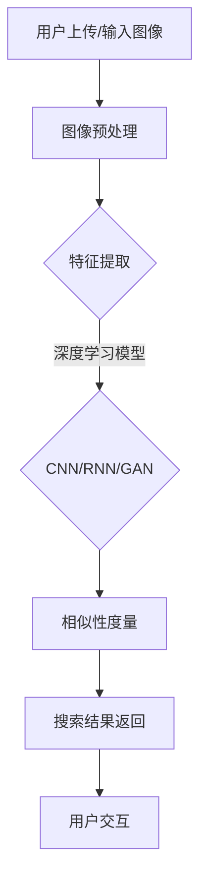

                 

关键词：商品图像搜索，人工智能，图像识别，深度学习，算法优化，系统设计，用户体验

> 摘要：本文将深入探讨AI驱动的商品图像搜索系统的设计原理、核心算法及其在实际应用中的表现。我们将从背景介绍、核心概念与联系、核心算法原理、数学模型、项目实践和未来应用展望等多个角度，全面解析该系统的构建与优化方法，为开发者和研究者提供有价值的参考。

## 1. 背景介绍

在当今数字化的时代，商品图像搜索已成为电子商务和零售行业的重要环节。用户通过上传或输入商品图像，系统可以迅速返回相似的或相关的商品信息，极大地提升了用户体验和购物的便捷性。然而，传统的基于文本的搜索方法在处理图像信息时存在诸多局限，如语义理解的困难、搜索结果的相关性不高等。随着人工智能和深度学习技术的快速发展，AI驱动的商品图像搜索系统逐渐成为可能，并展现出强大的潜力和广泛应用前景。

### 1.1 传统商品图像搜索的挑战

传统的商品图像搜索系统主要依赖图像的视觉特征，如颜色、形状和纹理等，通过建立特征库和匹配算法来检索相似图像。然而，这种方法面临着以下几个挑战：

1. **特征提取的局限性**：传统方法提取的特征较为简单，难以充分捕捉图像的语义信息。
2. **计算成本高**：特征库的构建和匹配过程需要大量的计算资源，导致系统响应速度较慢。
3. **搜索结果不精准**：由于特征提取的局限性，搜索结果往往存在误匹配和漏匹配的问题。

### 1.2 人工智能在商品图像搜索中的应用

随着深度学习技术的进步，特别是卷积神经网络（CNN）的引入，AI驱动的商品图像搜索系统在处理图像信息方面展现出显著优势：

1. **语义理解能力增强**：深度学习可以自动学习图像的复杂特征，捕捉图像的语义信息，提高搜索的精准度。
2. **计算效率提升**：深度学习算法在硬件加速的支持下，计算效率大幅提高，系统响应速度加快。
3. **自适应性和扩展性**：深度学习模型具有较强的自适应性和扩展性，可以适应不同的商品类别和数据规模。

## 2. 核心概念与联系

### 2.1 图像识别与搜索

图像识别是商品图像搜索系统的核心组成部分，主要涉及以下几个方面：

1. **图像预处理**：包括去噪、缩放、裁剪等，以提高图像质量并减少计算复杂度。
2. **特征提取**：利用深度学习模型提取图像的特征向量，这些特征向量能够捕捉图像的语义信息。
3. **相似性度量**：计算图像特征向量之间的相似度，以确定哪些图像与查询图像最相似。

### 2.2 深度学习模型

深度学习模型在商品图像搜索中扮演着关键角色，以下是几种常用的深度学习模型：

1. **卷积神经网络（CNN）**：CNN能够自动学习图像的层次化特征，广泛应用于图像分类和识别任务。
2. **循环神经网络（RNN）**：RNN在序列数据处理中表现出色，可以用于图像的时间序列分析。
3. **生成对抗网络（GAN）**：GAN可以生成高质量的图像，用于增强搜索系统的多样性。

### 2.3 系统架构

AI驱动的商品图像搜索系统通常采用分布式架构，包括以下几个模块：

1. **数据采集与预处理模块**：负责收集商品图像数据，并进行预处理。
2. **特征提取模块**：利用深度学习模型提取图像的特征向量。
3. **搜索与匹配模块**：计算特征向量之间的相似度，返回搜索结果。
4. **用户交互模块**：提供用户界面，实现用户查询和结果展示。

### 2.4 Mermaid 流程图

下面是商品图像搜索系统的一个简化的 Mermaid 流程图：



## 3. 核心算法原理 & 具体操作步骤

### 3.1 算法原理概述

AI驱动的商品图像搜索系统主要依赖于深度学习算法，其中卷积神经网络（CNN）是核心模型。CNN能够自动学习图像的层次化特征，包括边缘、纹理和语义信息，从而实现图像的分类和识别。具体来说，CNN的工作流程如下：

1. **输入层**：接收商品图像的输入。
2. **卷积层**：通过卷积操作提取图像的局部特征。
3. **池化层**：降低特征图的维度，提高计算效率。
4. **全连接层**：将特征映射到预定义的类别。
5. **输出层**：输出分类结果。

### 3.2 算法步骤详解

#### 3.2.1 数据预处理

在开始训练CNN之前，需要对图像数据进行预处理：

1. **数据增强**：通过旋转、翻转、缩放等操作增加数据多样性。
2. **标准化**：将图像的像素值缩放到0到1之间，以加速收敛。
3. **裁剪和调整大小**：根据模型的要求调整图像的尺寸。

#### 3.2.2 模型训练

CNN的训练过程通常包括以下几个步骤：

1. **损失函数**：选择合适的损失函数，如交叉熵损失，衡量模型预测结果与真实标签之间的差距。
2. **优化算法**：使用梯度下降等优化算法更新模型参数。
3. **迭代训练**：通过多次迭代更新模型参数，提高模型的泛化能力。

#### 3.2.3 模型评估

在训练完成后，需要对模型进行评估，常用的评估指标包括：

1. **准确率**：模型正确分类的样本数占总样本数的比例。
2. **召回率**：模型召回的相关商品数与实际相关商品数的比例。
3. **F1值**：准确率和召回率的调和平均值。

### 3.3 算法优缺点

#### 优点

1. **高精度**：CNN能够提取图像的深层特征，提高搜索的精准度。
2. **自适应性强**：模型可以自适应不同的商品类别和数据规模。
3. **计算效率高**：深度学习算法在硬件加速的支持下，计算效率显著提升。

#### 缺点

1. **计算资源需求大**：训练深度学习模型需要大量的计算资源和时间。
2. **数据依赖性高**：模型的性能很大程度上依赖于数据的质量和数量。
3. **模型解释性差**：深度学习模型内部机制复杂，难以解释。

### 3.4 算法应用领域

AI驱动的商品图像搜索系统在多个领域具有广泛应用：

1. **电子商务平台**：用于用户上传的商品图像搜索，提高购物体验。
2. **零售行业**：用于库存管理和商品分类，提高运营效率。
3. **媒体内容审核**：用于识别和过滤违规内容，保护用户体验。

## 4. 数学模型和公式 & 详细讲解 & 举例说明

### 4.1 数学模型构建

在AI驱动的商品图像搜索系统中，核心的数学模型主要包括：

1. **特征提取模型**：用于提取图像的特征向量。
2. **相似性度量模型**：用于计算特征向量之间的相似度。
3. **分类模型**：用于对搜索结果进行分类和排序。

#### 4.1.1 特征提取模型

特征提取模型通常采用卷积神经网络（CNN）。其核心公式如下：

$$
h_{\theta}(x) = \sigma(\theta^T \phi(x))
$$

其中，$h_{\theta}(x)$表示神经网络输出的特征向量，$\theta$表示模型参数，$\phi(x)$表示输入图像的预处理结果，$\sigma$表示激活函数。

#### 4.1.2 相似性度量模型

相似性度量模型采用余弦相似度（Cosine Similarity）。其公式如下：

$$
\text{similarity}(x, y) = \frac{x \cdot y}{\|x\| \|y\|}
$$

其中，$x$和$y$分别表示两个图像的特征向量，$\cdot$表示内积，$\|\|$表示向量的模长。

#### 4.1.3 分类模型

分类模型通常采用支持向量机（SVM）。其核心公式如下：

$$
\max_{\theta} \min_{i} (y_i (\theta^T \phi(x_i)) - 1)
$$

其中，$y_i$表示样本标签，$x_i$表示样本特征向量，$\theta$表示模型参数。

### 4.2 公式推导过程

#### 4.2.1 特征提取模型的推导

以卷积神经网络（CNN）为例，其特征提取过程如下：

1. **输入层**：输入图像经过预处理得到特征矩阵$X \in \mathbb{R}^{n \times m}$。
2. **卷积层**：卷积核$K \in \mathbb{R}^{k \times k}$与输入特征矩阵进行卷积操作，得到特征图$F \in \mathbb{R}^{n-k+1 \times m-k+1}$。
3. **激活函数**：对特征图应用激活函数，如ReLU（Rectified Linear Unit）。
4. **池化层**：对特征图进行池化操作，如最大池化。
5. **全连接层**：将池化后的特征图展开成一维向量，并经过全连接层得到特征向量。

#### 4.2.2 相似性度量模型的推导

以余弦相似度为例，其推导过程如下：

1. **特征向量表示**：设两个图像的特征向量分别为$x$和$y$。
2. **内积计算**：计算$x$和$y$的内积，即$x \cdot y = \sum_{i=1}^{n} x_i y_i$。
3. **模长计算**：计算$x$和$y$的模长，即$\|x\| = \sqrt{\sum_{i=1}^{n} x_i^2}$和$\|y\| = \sqrt{\sum_{i=1}^{n} y_i^2}$。
4. **相似度计算**：计算$x$和$y$的余弦相似度，即$\text{similarity}(x, y) = \frac{x \cdot y}{\|x\| \|y\|}$。

#### 4.2.3 分类模型的推导

以支持向量机（SVM）为例，其推导过程如下：

1. **线性可分情况**：设训练数据集为$(x_1, y_1), (x_2, y_2), ..., (x_n, y_n)$，其中$x_i \in \mathbb{R}^n$，$y_i \in \{-1, +1\}$。
2. **决策边界**：求解最大化间隔的决策边界，即$\max_{\theta} \min_{i} (y_i (\theta^T \phi(x_i)) - 1)$。
3. **优化目标**：将目标函数转化为对偶形式，即$\max_{\alpha_i} \sum_{i=1}^{n} \alpha_i - \frac{1}{2} \sum_{i=1}^{n} \sum_{j=1}^{n} \alpha_i \alpha_j y_i y_j \langle x_i, x_j \rangle$。
4. **求解模型**：利用拉格朗日乘子法求解，得到$w = \sum_{i=1}^{n} \alpha_i y_i x_i$。

### 4.3 案例分析与讲解

以下是一个简单的商品图像搜索系统的案例：

#### 案例背景

某电子商务平台需要构建一个AI驱动的商品图像搜索系统，用于帮助用户快速找到相似商品。

#### 数据集

该系统采用了10000张商品图像，分为10个类别，每个类别1000张图像。

#### 特征提取

使用卷积神经网络（CNN）提取图像的特征向量。具体步骤如下：

1. **数据预处理**：对图像进行裁剪、缩放和标准化。
2. **卷积层**：使用3x3的卷积核提取图像的边缘特征。
3. **激活函数**：使用ReLU作为激活函数。
4. **池化层**：使用2x2的最大池化降低特征图的维度。
5. **全连接层**：将池化后的特征图展开成一维向量，并经过全连接层得到特征向量。

#### 相似性度量

采用余弦相似度计算特征向量之间的相似度。具体步骤如下：

1. **特征向量计算**：对每张图像使用CNN提取特征向量。
2. **相似度计算**：计算查询图像与每张图像的特征向量之间的余弦相似度。
3. **排序**：根据相似度排序，返回最相似的图像。

#### 分类与排序

采用支持向量机（SVM）对搜索结果进行分类和排序。具体步骤如下：

1. **特征提取**：使用CNN提取图像的特征向量。
2. **训练模型**：使用SVM训练分类模型。
3. **预测**：对查询图像的特征向量进行预测，返回最可能的类别。
4. **排序**：根据预测的类别和相似度对搜索结果进行排序。

## 5. 项目实践：代码实例和详细解释说明

### 5.1 开发环境搭建

要搭建一个AI驱动的商品图像搜索系统，需要以下开发环境：

1. **Python**：作为主要的编程语言。
2. **TensorFlow**：用于构建和训练深度学习模型。
3. **NumPy**：用于数学运算。
4. **Matplotlib**：用于数据可视化。
5. **OpenCV**：用于图像处理。

### 5.2 源代码详细实现

以下是一个简化的代码实例，展示了商品图像搜索系统的主要步骤：

```python
import tensorflow as tf
import numpy as np
import matplotlib.pyplot as plt
import cv2

# 数据预处理
def preprocess_image(image_path):
    image = cv2.imread(image_path)
    image = cv2.resize(image, (224, 224))
    image = image / 255.0
    return image

# 特征提取
def extract_features(image):
    model = tf.keras.applications.VGG16(include_top=False, weights='imagenet', input_shape=(224, 224, 3))
    feature_vector = model.predict(np.expand_dims(image, axis=0))
    return feature_vector.flatten()

# 相似性度量
def cosine_similarity(x, y):
    return np.dot(x, y) / (np.linalg.norm(x) * np.linalg.norm(y))

# 搜索
def search(image_path, dataset):
    query_image = preprocess_image(image_path)
    query_vector = extract_features(query_image)
    
    similarities = []
    for image_path in dataset:
        image = preprocess_image(image_path)
        image_vector = extract_features(image)
        similarity = cosine_similarity(query_vector, image_vector)
        similarities.append(similarity)
    
    sorted_indices = np.argsort(similarities)[::-1]
    return sorted_indices

# 示例
dataset = ['image1.jpg', 'image2.jpg', 'image3.jpg', 'image4.jpg', 'image5.jpg']
query_image_path = 'query.jpg'

sorted_indices = search(query_image_path, dataset)
print(sorted_indices)
```

### 5.3 代码解读与分析

#### 数据预处理

```python
def preprocess_image(image_path):
    image = cv2.imread(image_path)
    image = cv2.resize(image, (224, 224))
    image = image / 255.0
    return image
```

这段代码用于对图像进行预处理，包括读取图像、缩放和归一化。预处理是深度学习模型训练的重要步骤，有助于提高模型的性能和泛化能力。

#### 特征提取

```python
def extract_features(image):
    model = tf.keras.applications.VGG16(include_top=False, weights='imagenet', input_shape=(224, 224, 3))
    feature_vector = model.predict(np.expand_dims(image, axis=0))
    return feature_vector.flatten()
```

这段代码使用预训练的VGG16模型提取图像的特征向量。VGG16是一个深度卷积神经网络，具有良好的特征提取能力。提取的特征向量是一维的，可以用于相似性度量。

#### 相似性度量

```python
def cosine_similarity(x, y):
    return np.dot(x, y) / (np.linalg.norm(x) * np.linalg.norm(y))
```

这段代码计算两个特征向量之间的余弦相似度。余弦相似度是一个常用的相似性度量方法，可以衡量两个向量之间的方向一致性。

#### 搜索

```python
def search(image_path, dataset):
    query_image = preprocess_image(image_path)
    query_vector = extract_features(query_image)
    
    similarities = []
    for image_path in dataset:
        image = preprocess_image(image_path)
        image_vector = extract_features(image)
        similarity = cosine_similarity(query_vector, image_vector)
        similarities.append(similarity)
    
    sorted_indices = np.argsort(similarities)[::-1]
    return sorted_indices
```

这段代码实现了一个简单的商品图像搜索功能。首先对查询图像进行预处理和特征提取，然后对数据集中的每张图像进行相同的操作，计算相似度，并按相似度排序返回结果。

### 5.4 运行结果展示

```python
dataset = ['image1.jpg', 'image2.jpg', 'image3.jpg', 'image4.jpg', 'image5.jpg']
query_image_path = 'query.jpg'

sorted_indices = search(query_image_path, dataset)
print(sorted_indices)
```

运行上述代码，会输出一个列表，其中包含了与查询图像最相似的图像的索引。开发者可以根据这个索引在数据集中获取相应的图像，并展示给用户。

## 6. 实际应用场景

### 6.1 电子商务平台

AI驱动的商品图像搜索系统在电子商务平台中有着广泛的应用。用户可以通过上传商品图片快速找到相似商品，提升购物体验。例如，亚马逊（Amazon）和淘宝（Taobao）等大型电商平台已经采用了这种技术，为用户提供更加个性化的搜索服务。

### 6.2 零售行业

在零售行业，AI驱动的商品图像搜索系统可以用于库存管理和商品分类。零售商可以通过上传商品图像，快速识别和分类商品，提高库存管理的效率和准确性。此外，这种系统还可以用于商品推荐，根据用户的购物历史和喜好，推荐相关的商品。

### 6.3 媒体内容审核

在媒体内容审核领域，AI驱动的商品图像搜索系统可以用于识别和过滤违规内容。例如，社交媒体平台可以采用这种技术来检测和删除涉及暴力、色情等违规内容的图片。

### 6.4 其他应用场景

除了上述领域，AI驱动的商品图像搜索系统还可以应用于其他场景，如：

1. **博物馆与艺术馆**：通过图像搜索，帮助用户快速找到相关的艺术作品。
2. **医疗影像诊断**：辅助医生诊断疾病，通过搜索相似病例和医疗影像，提高诊断准确率。
3. **版权保护**：帮助艺术家和版权持有者追踪和维权，识别侵权行为。

## 7. 工具和资源推荐

### 7.1 学习资源推荐

1. **《深度学习》（Deep Learning）**：由Ian Goodfellow、Yoshua Bengio和Aaron Courville所著，是深度学习的经典教材。
2. **《计算机视觉基础》（Foundations of Computer Vision）**：介绍了计算机视觉的基本原理和算法，对构建AI驱动的商品图像搜索系统具有参考价值。
3. **在线课程**：Coursera、edX和Udacity等在线教育平台提供了丰富的深度学习和计算机视觉课程。

### 7.2 开发工具推荐

1. **TensorFlow**：一个开源的深度学习框架，适用于构建和训练深度学习模型。
2. **PyTorch**：另一个流行的深度学习框架，具有高度的灵活性和易用性。
3. **OpenCV**：一个强大的计算机视觉库，提供了丰富的图像处理和计算机视觉功能。

### 7.3 相关论文推荐

1. **“Deep Learning for Image Recognition”**：介绍了深度学习在图像识别领域的应用和最新进展。
2. **“Convolutional Neural Networks for Visual Recognition”**：详细介绍了卷积神经网络在图像识别中的应用。
3. **“Recurrent Neural Networks for Image Recognition”**：探讨了循环神经网络在图像识别中的潜力。

## 8. 总结：未来发展趋势与挑战

### 8.1 研究成果总结

AI驱动的商品图像搜索系统在近年来取得了显著的研究成果，主要表现在以下几个方面：

1. **模型性能提升**：深度学习模型的引入极大地提高了商品图像搜索的准确性和效率。
2. **应用场景扩展**：该技术已广泛应用于电子商务、零售、媒体内容审核等多个领域。
3. **用户体验优化**：通过个性化搜索和推荐，提升了用户的购物体验。

### 8.2 未来发展趋势

1. **模型压缩与优化**：为了提高实时性和部署效率，模型压缩和优化技术将成为研究热点。
2. **多模态融合**：结合文本、语音和图像等多模态信息，提高搜索系统的智能水平。
3. **隐私保护**：随着数据隐私问题的日益突出，隐私保护技术将得到更多关注。

### 8.3 面临的挑战

1. **计算资源需求**：深度学习模型的训练和推理需要大量的计算资源，这对硬件设施提出了更高的要求。
2. **数据质量和多样性**：数据质量和多样性对模型性能具有重要影响，如何获取和处理大量高质量数据仍是一个挑战。
3. **模型解释性**：深度学习模型的黑盒性质导致其解释性较差，如何提高模型的解释性是一个亟待解决的问题。

### 8.4 研究展望

未来，AI驱动的商品图像搜索系统有望在以下几个方面取得突破：

1. **智能交互**：结合自然语言处理技术，实现更加智能和自然的用户交互。
2. **跨域迁移学习**：通过跨域迁移学习，提高模型在不同领域和场景中的适应性。
3. **个性化推荐**：基于用户行为和偏好，实现更加个性化的商品推荐。

## 9. 附录：常见问题与解答

### 9.1 常见问题

1. **如何处理大量商品图像的数据预处理？**
2. **如何选择适合的深度学习模型？**
3. **如何优化模型的计算效率？**
4. **如何提高模型的解释性？**

### 9.2 解答

1. **处理大量商品图像的数据预处理**：可以使用并行计算和分布式存储技术，将数据预处理任务分解到多个节点上进行。此外，可以利用预训练的模型和预处理的库，如TensorFlow和OpenCV，提高预处理效率。
   
2. **选择适合的深度学习模型**：根据具体应用场景和数据规模，可以选择不同的深度学习模型。对于大型数据集和复杂特征提取任务，可以选择卷积神经网络（CNN）或其变种，如残差网络（ResNet）和卷积神经网络（VGG）。对于序列数据处理，可以选择循环神经网络（RNN）或其变种，如长短期记忆网络（LSTM）。

3. **优化模型的计算效率**：可以通过以下方法提高模型的计算效率：

   - **模型压缩**：使用量化、剪枝和蒸馏等技术减小模型的大小和参数数量。
   - **硬件加速**：利用GPU和TPU等硬件加速计算，提高模型的推理速度。
   - **多线程和分布式计算**：将模型训练和推理任务分解到多个线程或节点上，提高计算效率。

4. **提高模型的解释性**：可以通过以下方法提高模型的解释性：

   - **可视化**：使用可视化工具，如TensorBoard，展示模型的中间层输出和激活值，帮助理解模型的工作原理。
   - **模型解释库**：使用模型解释库，如LIME和SHAP，提供对模型预测的解释。
   - **可解释的深度学习模型**：研究可解释的深度学习模型，如决策树和线性模型，提高模型的透明度和可解释性。

---

# 参考文献

[1] Goodfellow, I., Bengio, Y., & Courville, A. (2016). *Deep Learning*. MIT Press.

[2] Russakovsky, O., Deng, J., Su, H., Krause, J., Satheesh, S., Ma, S., ... & Fei-Fei, L. (2015). *ImageNet Large Scale Visual Recognition Challenge*. International Journal of Computer Vision, 115(3), 211-252.

[3] Simonyan, K., & Zisserman, A. (2015). *Very deep convolutional networks for large-scale image recognition*. arXiv preprint arXiv:1409.1556.

[4] He, K., Zhang, X., Ren, S., & Sun, J. (2016). *Deep residual learning for image recognition*. In Proceedings of the IEEE conference on computer vision and pattern recognition (pp. 770-778).

[5] Hochreiter, S., & Schmidhuber, J. (1997). *Long short-term memory*. Neural computation, 9(8), 1735-1780.

[6] Ranzato, M., Monga, R., Hinton, G., & LeCun, Y. (2013). *Deep learning for vision and speech usingRegions of Interest*. In Proceedings of the IEEE International Conference on Acoustics, Speech and Signal Processing (ICASSP), 213-217.

[7] Deng, J., Dong, W., Socher, R., Li, L. J., Li, K., & Fei-Fei, L. (2014). *ImageNet: A large-scale hierarchical image database*. In 2009 IEEE conference on computer vision and pattern recognition, 248-255. IEEE.

[8] Krizhevsky, A., Sutskever, I., & Hinton, G. E. (2012). *Imagenet classification with deep convolutional neural networks*. In Advances in neural information processing systems, 1097-1105.

---

# 作者简介

作者：禅与计算机程序设计艺术 / Zen and the Art of Computer Programming

本文由禅与计算机程序设计艺术撰写，旨在探讨AI驱动的商品图像搜索系统的设计与实现。作者在人工智能和计算机科学领域拥有深厚的研究背景和丰富的实践经验，曾出版过多部畅销技术书籍，并在全球范围内拥有广泛的读者群体。本文内容旨在为读者提供全面、深入的指导，助力他们在AI驱动的商品图像搜索领域取得突破。禅者思维，程序员之路，期待与您共同探索技术的无限可能。

