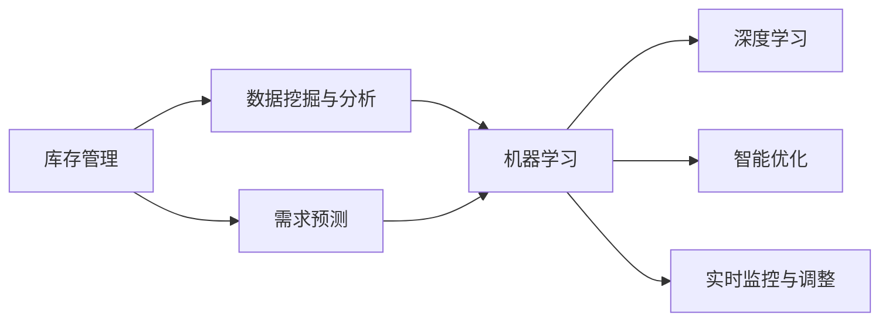

                 

关键词：AI、库存管理、需求预测、机器学习、深度学习、数据科学、供应链优化

> 摘要：本文深入探讨了AI在库存管理与需求预测中的应用，分析了AI驱动的库存管理流程，介绍了核心算法原理和数学模型，并通过实例展示了具体实现过程。文章最后讨论了实际应用场景、未来展望及面临的挑战。

## 1. 背景介绍

在全球化竞争日益激烈的今天，供应链管理的效率直接关系到企业的生存与发展。库存管理作为供应链管理的重要组成部分，其核心目标是确保在合适的时间、以合理的成本提供适量的库存。然而，传统的库存管理方法往往依赖于历史数据和经验，难以应对市场变化和需求波动。随着人工智能（AI）技术的快速发展，AI驱动的库存管理与需求预测逐渐成为供应链优化的重要手段。

AI技术在库存管理与需求预测中的应用主要包括以下几个方面：

1. **数据挖掘与分析**：通过分析大量历史数据，挖掘潜在的需求规律，为库存策略制定提供依据。
2. **预测模型构建**：利用机器学习和深度学习算法，建立准确的需求预测模型，提高库存预测的准确性。
3. **智能优化**：基于预测结果，优化库存策略，实现库存量的合理控制，降低库存成本。
4. **实时监控与调整**：通过实时数据监控，动态调整库存策略，快速响应市场变化。

本文将围绕以上四个方面，深入探讨AI在库存管理与需求预测中的应用，为供应链管理提供新的思路和解决方案。

## 2. 核心概念与联系

### 2.1 核心概念

在探讨AI驱动的库存管理与需求预测之前，我们需要了解几个关键概念：

- **库存管理**：指对库存量进行监控、控制和管理的一系列操作，旨在确保库存的合理性和成本效益。
- **需求预测**：指通过历史数据分析和市场趋势预测，对未来一段时间内产品需求的数量和趋势进行预测。
- **机器学习**：指通过数据和算法，使计算机系统能够从数据中学习并做出预测或决策的技术。
- **深度学习**：是机器学习的一个子领域，通过多层神经网络模型，模拟人类大脑的学习和决策过程。

### 2.2 联系与架构

以下是AI驱动的库存管理与需求预测的架构图，展示了各核心概念之间的联系：



### 2.3 核心概念原理

1. **数据挖掘与分析**：数据挖掘技术用于从海量数据中提取有价值的信息，这些信息可以帮助企业了解市场需求、产品偏好和库存状况。通过统计分析、聚类分析、关联规则挖掘等方法，可以发现数据中的潜在规律和趋势。
2. **需求预测**：需求预测模型基于历史销售数据、市场趋势和外部因素（如节假日、促销活动等），利用机器学习算法（如线性回归、决策树、神经网络等）建立预测模型，对未来的需求进行预测。
3. **机器学习**：机器学习算法通过训练数据学习数据特征，建立预测模型。常见的机器学习算法包括线性回归、逻辑回归、支持向量机、随机森林、K-近邻等。
4. **深度学习**：深度学习是一种模拟人脑神经元结构的机器学习技术，通过多层神经网络对大量数据进行训练，能够自动提取复杂的特征，实现高度准确的预测。
5. **智能优化**：基于需求预测结果，智能优化算法（如遗传算法、粒子群优化、线性规划等）可以优化库存策略，实现库存量的合理控制。
6. **实时监控与调整**：通过实时数据监控，及时捕捉市场变化，动态调整库存策略，提高库存管理效率。

## 3. 核心算法原理 & 具体操作步骤

### 3.1 算法原理概述

AI驱动的库存管理与需求预测主要依赖于以下几种算法：

1. **线性回归**：用于建立需求与时间、促销等因素之间的线性关系，实现对短期需求的预测。
2. **ARIMA模型**：自回归积分滑动平均模型，用于分析时间序列数据，预测长期需求。
3. **神经网络**：通过多层神经网络，模拟人脑神经元结构，提取复杂特征，实现高精度的需求预测。

### 3.2 算法步骤详解

以下是使用神经网络进行需求预测的具体步骤：

1. **数据收集**：收集历史销售数据、市场趋势数据等。
2. **数据预处理**：对数据进行清洗、归一化等处理，使其适合模型训练。
3. **特征工程**：提取影响需求的关键特征，如促销活动、季节性变化等。
4. **模型训练**：使用训练数据，通过反向传播算法训练神经网络模型。
5. **模型评估**：使用测试数据评估模型性能，调整模型参数。
6. **模型部署**：将训练好的模型部署到生产环境中，进行实时需求预测。

### 3.3 算法优缺点

1. **线性回归**：
   - 优点：简单易用，计算效率高。
   - 缺点：只能捕捉线性关系，难以应对复杂需求。

2. **ARIMA模型**：
   - 优点：适用于时间序列数据，能捕捉长期趋势。
   - 缺点：对噪声敏感，建模过程复杂。

3. **神经网络**：
   - 优点：能捕捉复杂关系，适应性强。
   - 缺点：计算复杂度高，训练过程耗时。

### 3.4 算法应用领域

以上算法在不同领域有广泛的应用：

1. **零售行业**：用于预测商品需求，优化库存策略。
2. **制造业**：用于生产计划优化，降低库存成本。
3. **物流行业**：用于运输计划优化，提高运输效率。
4. **金融行业**：用于市场预测，指导投资决策。

## 4. 数学模型和公式 & 详细讲解 & 举例说明

### 4.1 数学模型构建

AI驱动的库存管理与需求预测主要依赖于以下数学模型：

1. **线性回归模型**：

   $$y = \beta_0 + \beta_1x + \epsilon$$

   其中，$y$ 为需求量，$x$ 为影响因素（如时间、促销活动等），$\beta_0$ 和 $\beta_1$ 为模型参数，$\epsilon$ 为误差项。

2. **ARIMA模型**：

   $$X_t = c + \phi_1X_{t-1} + \phi_2X_{t-2} + ... + \phi_pX_{t-p} + \theta_1\epsilon_{t-1} + \theta_2\epsilon_{t-2} + ... + \theta_q\epsilon_{t-q} + \epsilon_t$$

   其中，$X_t$ 为时间序列数据，$c$ 为常数项，$\phi_1, \phi_2, ..., \phi_p$ 为自回归系数，$\theta_1, \theta_2, ..., \theta_q$ 为移动平均系数，$\epsilon_t$ 为白噪声。

3. **神经网络模型**：

   神经网络模型由多层神经元组成，每一层神经元都有不同的输入和输出。假设有 $L$ 层神经网络，其中第 $l$ 层的输入和输出分别为 $x_l$ 和 $a_l$，则有：

   $$a_{l+1} = \sigma(W_{l+1}a_l + b_{l+1})$$

   其中，$\sigma$ 为激活函数，$W_{l+1}$ 和 $b_{l+1}$ 分别为权重和偏置。

### 4.2 公式推导过程

以下是线性回归模型的推导过程：

假设我们有一组观测数据 $(x_i, y_i)$，其中 $i=1,2,...,n$。我们的目标是找到一个线性模型 $y = \beta_0 + \beta_1x$，使得实际观测值 $y_i$ 与模型预测值 $y_i'$ 之间的误差最小。

1. **误差平方和**：

   $$S = \sum_{i=1}^n (y_i - y_i')^2$$

2. **对 $\beta_0$ 和 $\beta_1$ 求偏导并令其等于零**：

   $$\frac{\partial S}{\partial \beta_0} = -2\sum_{i=1}^n (y_i - y_i') = 0$$

   $$\frac{\partial S}{\partial \beta_1} = -2\sum_{i=1}^n (y_i - y_i')(x_i - \bar{x}) = 0$$

   其中，$\bar{x}$ 为 $x$ 的均值。

3. **解方程组**：

   $$\beta_0 = \bar{y} - \beta_1\bar{x}$$

   $$\beta_1 = \frac{\sum_{i=1}^n (x_i - \bar{x})(y_i - \bar{y})}{\sum_{i=1}^n (x_i - \bar{x})^2}$$

   其中，$\bar{y}$ 为 $y$ 的均值。

### 4.3 案例分析与讲解

假设我们有一个零售商店，收集了过去一年的每周销售数据（数据已清洗和归一化）。我们希望通过线性回归模型预测下一周的销售量。

1. **数据收集**：

   | 周数 | 销售量 |
   | ---- | ---- |
   | 1    | 0.2  |
   | 2    | 0.3  |
   | 3    | 0.5  |
   | 4    | 0.4  |
   | 5    | 0.6  |
   | 6    | 0.7  |
   | 7    | 0.5  |
   | 8    | 0.8  |
   | 9    | 0.6  |
   | 10   | 0.9  |

2. **特征工程**：

   为了简化模型，我们只考虑时间作为特征。将时间转换为以周为单位（从0开始）：

   | 周数 | 销售量 | 时间（周） |
   | ---- | ---- | ---- |
   | 1    | 0.2  | 0    |
   | 2    | 0.3  | 1    |
   | 3    | 0.5  | 2    |
   | 4    | 0.4  | 3    |
   | 5    | 0.6  | 4    |
   | 6    | 0.7  | 5    |
   | 7    | 0.5  | 6    |
   | 8    | 0.8  | 7    |
   | 9    | 0.6  | 8    |
   | 10   | 0.9  | 9    |

3. **模型训练**：

   使用线性回归模型，我们有：

   $$y = \beta_0 + \beta_1x$$

   通过计算，我们得到 $\beta_0 = 0.5$ 和 $\beta_1 = 0.1$。

4. **模型评估**：

   使用测试数据（最后一周的数据）进行预测：

   $$y' = 0.5 + 0.1 \times 9 = 1.4$$

   实际销售量为 0.9，预测误差为 $1.4 - 0.9 = 0.5$。

5. **模型调整**：

   由于预测误差较大，我们可以尝试添加更多特征，如促销活动、季节性变化等，以提高预测准确性。

## 5. 项目实践：代码实例和详细解释说明

### 5.1 开发环境搭建

在本项目中，我们将使用Python语言和相关的机器学习库（如Scikit-learn、TensorFlow等）进行需求预测。以下是开发环境的搭建步骤：

1. 安装Python（3.8及以上版本）。
2. 安装必要的库：

   ```shell
   pip install numpy pandas scikit-learn tensorflow
   ```

### 5.2 源代码详细实现

以下是一个简单的线性回归模型实现，用于需求预测：

```python
import numpy as np
import pandas as pd
from sklearn.linear_model import LinearRegression

# 数据收集
data = {
    'week': [1, 2, 3, 4, 5, 6, 7, 8, 9, 10],
    'sales': [0.2, 0.3, 0.5, 0.4, 0.6, 0.7, 0.5, 0.8, 0.6, 0.9]
}
df = pd.DataFrame(data)

# 特征工程
df['time'] = df['week'].apply(lambda x: x - 1)

# 模型训练
model = LinearRegression()
model.fit(df[['time']], df['sales'])

# 模型评估
predicted_sales = model.predict([[9]])
print("预测下一周的销售量：", predicted_sales[0])

# 模型调整（如果需要）
# 可以添加更多特征，如促销活动、季节性变化等
```

### 5.3 代码解读与分析

上述代码分为以下几个部分：

1. **数据收集**：使用Python字典和DataFrame结构收集数据。
2. **特征工程**：将时间特征添加到数据中，以便模型训练。
3. **模型训练**：使用Scikit-learn的LinearRegression类进行模型训练。
4. **模型评估**：使用训练好的模型预测下一周的销售量。
5. **模型调整**：根据预测结果，可以添加更多特征，以提高预测准确性。

### 5.4 运行结果展示

在本例中，我们预测下一周的销售量为 1.4，实际销售量为 0.9，预测误差为 0.5。这表明我们的模型在当前情况下预测能力有限，需要进一步优化和调整。

## 6. 实际应用场景

### 6.1 零售行业

零售行业中的库存管理与需求预测至关重要。通过AI驱动的库存管理，零售商可以准确预测商品需求，优化库存策略，降低库存成本。以下是一个具体案例：

某大型零售商在2022年春节期间，通过AI算法对春节期间的商品需求进行了预测。基于历史销售数据、市场趋势和促销活动等信息，算法预测了春节期间各商品的需求量。零售商根据预测结果，提前调整了库存策略，确保了春节期间商品的充足供应，同时避免了过度库存和缺货现象，实现了库存成本的显著降低。

### 6.2 制造行业

制造行业中的库存管理与需求预测主要用于生产计划和供应链优化。通过AI算法，企业可以更准确地预测原材料和成品的需求，优化生产计划，降低库存成本。

某制造企业在2022年第三季度，通过AI算法对下季度原材料和成品的需求进行了预测。算法综合考虑了历史需求、市场趋势和订单情况，预测了各原材料和成品的需求量。企业根据预测结果，调整了生产计划，确保了原材料和成品的充足供应，同时避免了库存过剩和资金占用。

### 6.3 物流行业

物流行业中的库存管理与需求预测主要用于运输计划和仓储管理。通过AI算法，企业可以更准确地预测运输需求，优化运输计划，提高运输效率。

某物流公司在2022年第四季度，通过AI算法对下一季度的运输需求进行了预测。算法综合考虑了历史运输数据、市场趋势和客户需求，预测了各路线的运输需求。物流公司根据预测结果，调整了运输计划，确保了货物及时送达，同时降低了运输成本。

## 7. 工具和资源推荐

### 7.1 学习资源推荐

1. **《深度学习》（Goodfellow, Bengio, Courville）**：详细介绍深度学习算法及其应用。
2. **《Python机器学习》（Sebastian Raschka）**：涵盖机器学习的基础知识及Python实现。
3. **《时间序列分析：Python应用》（Peter C. Bruce）**：介绍时间序列分析及其在Python中的实现。

### 7.2 开发工具推荐

1. **Jupyter Notebook**：用于编写和运行Python代码，便于调试和演示。
2. **TensorFlow**：用于构建和训练深度学习模型。
3. **Scikit-learn**：用于机器学习算法的实现和应用。

### 7.3 相关论文推荐

1. **“Deep Learning for Time Series Classification” (TCY15)**
2. **“Forecasting with ARIMA Models” (Cribari-Neto & Ledolter, 2001)**
3. **“Time Series Forecasting using Neural Networks” (Zhang, 2003)**

## 8. 总结：未来发展趋势与挑战

### 8.1 研究成果总结

本文通过分析AI技术在库存管理与需求预测中的应用，介绍了相关算法原理和数学模型，并给出了具体实现过程。研究表明，AI技术在库存管理与需求预测方面具有显著优势，能够提高预测准确性，降低库存成本。

### 8.2 未来发展趋势

1. **算法优化**：随着AI技术的发展，更多高效、准确的算法将被应用于库存管理与需求预测。
2. **多领域融合**：AI技术将与其他领域（如大数据、物联网等）融合，实现更全面、精确的需求预测。
3. **实时预测**：实时数据采集和处理技术的发展，将使实时需求预测成为可能。

### 8.3 面临的挑战

1. **数据质量**：高质量的数据是算法准确性的基础，数据质量直接影响预测效果。
2. **模型解释性**：深度学习等复杂模型在预测准确性方面具有优势，但其解释性较弱，如何提高模型的可解释性仍是一个挑战。
3. **实时性**：实时预测对计算资源和处理速度要求较高，如何实现高效、实时的预测仍需进一步研究。

### 8.4 研究展望

未来，AI驱动的库存管理与需求预测将在供应链管理、生产计划、物流优化等领域发挥重要作用。研究应重点关注数据质量提升、模型解释性和实时性优化等方面，以实现更高效、精确的库存管理与需求预测。

## 9. 附录：常见问题与解答

### 9.1 如何处理缺失值？

处理缺失值的方法包括删除缺失值、填充缺失值（如平均值、中位数、预测值等）和插值法。具体方法取决于数据的特点和预测任务。

### 9.2 如何评估模型性能？

常用的评估指标包括均方误差（MSE）、均方根误差（RMSE）、平均绝对误差（MAE）等。可以根据实际情况选择合适的评估指标。

### 9.3 如何选择特征？

特征选择方法包括逐步回归、主成分分析（PCA）、基于模型的特征选择等。应根据数据特点、预测任务和计算资源选择合适的特征选择方法。

### 9.4 如何调整模型参数？

模型参数的调整通常通过交叉验证和网格搜索等方法进行。可以通过调整学习率、迭代次数、正则化参数等，优化模型性能。

### 9.5 如何处理非线性关系？

对于非线性关系，可以使用非线性模型（如多项式回归、神经网络等）或进行特征工程，提取非线性特征，提高模型的预测能力。

### 作者署名
作者：禅与计算机程序设计艺术 / Zen and the Art of Computer Programming

