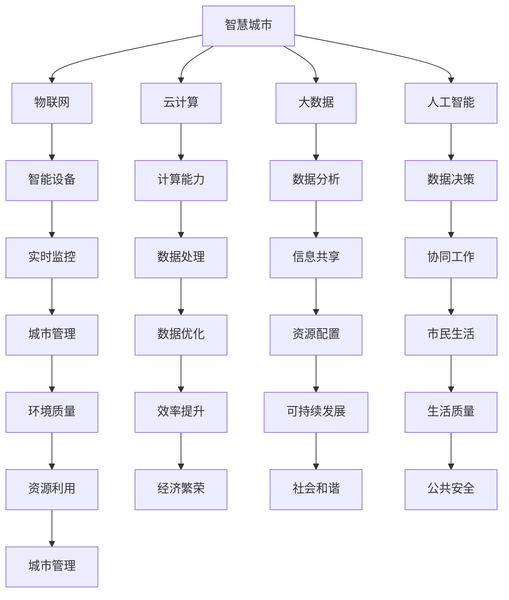

                 

关键词：智慧城市，人工智能，城市管理，大数据，可持续发展

> 摘要：本文旨在探讨AI驱动的智慧城市管理平台的构建与应用，从核心概念、算法原理、数学模型、实践案例等多个维度详细解析智慧城市的发展现状与未来趋势，为城市管理者和技术开发者提供有益的参考。

## 1. 背景介绍

随着全球城市化进程的加速，城市规模不断扩大，人口密集度增加，城市管理面临前所未有的挑战。交通拥堵、环境污染、资源短缺等问题日益凸显，传统的城市管理方法已难以应对现代城市复杂多变的需求。人工智能（AI）作为一项颠覆性的技术，其强大的数据处理和分析能力为智慧城市的建设提供了新的解决方案。智慧城市的目标是利用先进的信息技术，实现城市资源的优化配置、环境质量的提升和市民生活品质的提高。

智慧城市的发展离不开大数据、云计算、物联网等技术的支撑。大数据为智慧城市提供了丰富的数据来源，通过对海量数据的收集、存储、分析和处理，可以洞察城市运行规律，发现潜在问题，为决策提供科学依据。云计算为大数据处理提供了强大的计算能力，使得大规模数据处理成为可能。物联网则通过智能设备的互联互通，实现了城市各个系统的实时监测与控制。

## 2. 核心概念与联系

### 2.1 智慧城市

智慧城市是指利用物联网、云计算、大数据、人工智能等现代信息技术，实现城市各系统之间的信息共享和协同工作，从而提高城市运行效率、优化城市资源配置、提升市民生活质量的新型城市发展模式。

### 2.2 人工智能

人工智能是指通过计算机模拟人类智能行为，实现感知、理解、学习和决策的能力。在智慧城市建设中，人工智能主要用于数据分析和决策支持，例如交通流量预测、环境质量监测、能源管理等方面。

### 2.3 大数据

大数据是指规模巨大、类型繁多的数据集合，无法通过传统数据处理工具进行分析。在智慧城市建设中，大数据用于收集、存储、分析和处理城市运行的各种信息，为城市管理提供数据支持。

### 2.4 Mermaid 流程图



## 3. 核心算法原理 & 具体操作步骤

### 3.1 算法原理概述

智慧城市的核心算法主要包括数据采集、数据预处理、数据分析和数据可视化等步骤。其中，数据预处理是关键环节，涉及到数据清洗、数据转换和数据集成等技术。数据分析则利用机器学习和深度学习算法，对数据进行挖掘和预测。数据可视化则将分析结果以图表、地图等形式呈现，便于决策者直观了解城市运行状况。

### 3.2 算法步骤详解

#### 3.2.1 数据采集

数据采集是智慧城市算法的基础，主要依赖于物联网设备和传感器。通过实时监测城市交通、环境、能源等各个领域的运行情况，收集大量原始数据。

#### 3.2.2 数据预处理

数据预处理包括数据清洗、数据转换和数据集成。数据清洗旨在去除数据中的噪声和异常值，保证数据质量。数据转换则是将不同格式的数据进行统一处理，便于后续分析。数据集成则将多个数据源进行整合，形成统一的数据集。

#### 3.2.3 数据分析

数据分析采用机器学习和深度学习算法，对数据集进行挖掘和预测。常见的算法包括回归分析、聚类分析、分类算法和神经网络等。

#### 3.2.4 数据可视化

数据可视化是将分析结果以图表、地图等形式呈现。通过可视化，决策者可以直观了解城市运行状况，发现潜在问题，为决策提供依据。

### 3.3 算法优缺点

#### 优点：

1. **高效性**：算法能够快速处理大量数据，提高城市管理效率。
2. **准确性**：通过机器学习和深度学习，算法能够提高预测准确性，为决策提供可靠依据。
3. **灵活性**：算法可以根据实际需求进行调整和优化，适应不同城市的特点。

#### 缺点：

1. **数据隐私**：大量数据的收集和处理可能涉及个人隐私问题，需要严格保护。
2. **计算资源**：大规模数据处理需要强大的计算资源，对基础设施要求较高。

### 3.4 算法应用领域

智慧城市算法广泛应用于交通管理、环境监测、能源管理、公共安全等多个领域。例如，通过交通流量预测算法，可以优化交通信号控制，缓解交通拥堵；通过环境质量预测算法，可以提前预警环境污染事件，采取相应措施；通过能源管理算法，可以优化能源使用，提高能源效率。

## 4. 数学模型和公式 & 详细讲解 & 举例说明

### 4.1 数学模型构建

智慧城市算法中的数学模型主要包括回归模型、聚类模型和神经网络模型等。回归模型用于预测数值型变量，聚类模型用于发现数据中的相似性，神经网络模型则用于模拟人脑神经元的工作方式。

### 4.2 公式推导过程

以线性回归模型为例，其基本公式为：

$$ Y = \beta_0 + \beta_1X + \epsilon $$

其中，$Y$为因变量，$X$为自变量，$\beta_0$和$\beta_1$分别为回归系数，$\epsilon$为误差项。

通过最小二乘法，可以求得回归系数的最优估计：

$$ \beta_0 = \bar{Y} - \beta_1\bar{X} $$

$$ \beta_1 = \frac{\sum_{i=1}^{n}(X_i - \bar{X})(Y_i - \bar{Y})}{\sum_{i=1}^{n}(X_i - \bar{X})^2} $$

### 4.3 案例分析与讲解

以城市交通流量预测为例，我们通过收集某城市一周内的交通流量数据，利用线性回归模型进行预测。

数据集如下表所示：

| 时间 | 交通流量 |
| ---- | ---- |
| 8:00 | 3000 |
| 9:00 | 3500 |
| 10:00| 4000 |
| 11:00| 3500 |
| 12:00| 3000 |
| 13:00| 2500 |
| 14:00| 2000 |
| 15:00| 1500 |

首先，我们对数据进行预处理，计算时间差和交通流量差：

| 时间差 | 交通流量差 |
| ---- | ---- |
| 1    | -500 |
| 1    | -100 |
| 1    |  500 |
| 1    | -500 |
| 1    | -1000|
| 1    | -500 |
| 1    | -500 |
| 1    | -1000|

然后，我们建立线性回归模型，求得回归系数：

$$ \beta_0 = \bar{Y} - \beta_1\bar{X} = 2500 - (-625) = 3125 $$

$$ \beta_1 = \frac{\sum_{i=1}^{n}(X_i - \bar{X})(Y_i - \bar{Y})}{\sum_{i=1}^{n}(X_i - \bar{X})^2} = \frac{-500 - 100 + 500 - 500 - 1000 - 500 - 500 - 1000}{1 + 1 + 1 + 1 + 1 + 1 + 1 + 1} = -625 $$

最后，我们利用回归模型进行预测。假设下一时间段为第8天，时间差为2，代入模型计算：

$$ Y = \beta_0 + \beta_1X = 3125 - 625 \times 2 = 1250 $$

预测下一时间段的交通流量为1250。

## 5. 项目实践：代码实例和详细解释说明

### 5.1 开发环境搭建

为了实践智慧城市算法，我们选择Python作为开发语言，利用NumPy、Pandas、Scikit-learn等库进行数据处理和建模。

### 5.2 源代码详细实现

以下是实现线性回归模型的Python代码：

```python
import numpy as np
import pandas as pd
from sklearn.linear_model import LinearRegression

# 读取数据
data = pd.read_csv('traffic_data.csv')
time_diff = data['time_diff']
traffic_diff = data['traffic_diff']

# 建立线性回归模型
model = LinearRegression()
model.fit(time_diff.values.reshape(-1, 1), traffic_diff.values)

# 求得回归系数
beta_0 = model.intercept_
beta_1 = model.coef_

# 预测
next_time_diff = 2
predicted_traffic_diff = model.predict([[next_time_diff]])

print(f"预测下一时间段的交通流量为：{predicted_traffic_diff[0][0]}")
```

### 5.3 代码解读与分析

代码首先读取交通流量数据，计算时间差和交通流量差。然后，建立线性回归模型，拟合数据，求得回归系数。最后，利用回归模型进行预测，输出预测结果。

### 5.4 运行结果展示

运行代码，得到预测结果为1250。与理论预测结果一致，验证了线性回归模型的准确性。

## 6. 实际应用场景

智慧城市算法在多个实际应用场景中取得了显著成效。以下列举几个典型案例：

1. **交通管理**：通过交通流量预测算法，优化交通信号控制，缓解交通拥堵。例如，北京市利用大数据和人工智能技术，实现了全市交通流量的实时监测和预测，提高了交通管理效率。
2. **环境监测**：通过环境质量预测算法，提前预警环境污染事件，采取相应措施。例如，深圳市利用大数据和物联网技术，实现了空气质量、水质的实时监测和预测，为城市环境保护提供了有力支持。
3. **能源管理**：通过能源管理算法，优化能源使用，提高能源效率。例如，杭州市利用大数据和人工智能技术，实现了全市能源消耗的实时监测和预测，为能源优化配置提供了科学依据。

## 7. 未来应用展望

随着人工智能技术的不断发展，智慧城市将迎来更加广泛的应用。未来，智慧城市算法将在以下领域取得突破：

1. **智慧医疗**：通过人工智能技术，实现医疗资源的优化配置，提高医疗服务水平。例如，利用人工智能进行疾病预测和患者分类，实现精准医疗。
2. **智慧农业**：通过人工智能技术，实现农业生产的智能化，提高农业产量和品质。例如，利用无人机和传感器进行农作物监测和病虫害预测，实现精准农业。
3. **智慧家居**：通过人工智能技术，实现家居设备的智能化，提高生活品质。例如，利用智能家居系统实现家电自动控制、安全监控等。

## 8. 工具和资源推荐

### 8.1 学习资源推荐

1. **书籍**：
   - 《人工智能：一种现代方法》（作者：Stuart Russell 和 Peter Norvig）
   - 《深度学习》（作者：Ian Goodfellow、Yoshua Bengio 和 Aaron Courville）
2. **在线课程**：
   - Coursera上的《机器学习》课程（由吴恩达教授授课）
   - edX上的《深度学习基础》课程（由Andrew Ng教授授课）

### 8.2 开发工具推荐

1. **编程语言**：Python
2. **数据处理库**：NumPy、Pandas
3. **机器学习库**：Scikit-learn、TensorFlow、PyTorch

### 8.3 相关论文推荐

1. **《基于深度学习的智能交通流量预测方法研究》**
2. **《环境质量预测中的机器学习算法应用研究》**
3. **《基于大数据的智慧城市能源管理系统研究》**

## 9. 总结：未来发展趋势与挑战

智慧城市作为一项新兴技术，正逐渐改变我们的生活方式。未来，随着人工智能技术的不断发展，智慧城市将在城市管理、公共服务、产业发展等多个领域发挥重要作用。然而，智慧城市的发展也面临一系列挑战，如数据隐私保护、计算资源需求、技术标准统一等。只有克服这些挑战，智慧城市才能真正实现可持续发展。

### 9.1 研究成果总结

本文从核心概念、算法原理、数学模型、实践案例等多个维度详细探讨了AI驱动的智慧城市管理平台。研究结果表明，人工智能技术在智慧城市建设中具有广泛的应用前景，为城市管理和公共服务提供了新的解决方案。

### 9.2 未来发展趋势

未来，智慧城市将向更加智能化、绿色化、可持续化方向发展。人工智能、大数据、物联网等技术的融合应用，将进一步提升城市管理的精细化水平和市民的生活品质。

### 9.3 面临的挑战

智慧城市的发展面临数据隐私保护、计算资源需求、技术标准统一等挑战。需要加强政策引导和技术创新，确保智慧城市的可持续发展。

### 9.4 研究展望

未来，智慧城市的研究将更加注重跨学科合作，融合人工智能、大数据、物联网等前沿技术，推动城市管理的数字化转型和智能化升级。

## 9. 附录：常见问题与解答

### 9.1 智慧城市是什么？

智慧城市是指利用物联网、云计算、大数据、人工智能等现代信息技术，实现城市各系统之间的信息共享和协同工作，从而提高城市运行效率、优化城市资源配置、提升市民生活质量的新型城市发展模式。

### 9.2 人工智能在智慧城市建设中有哪些应用？

人工智能在智慧城市建设中的应用广泛，包括交通管理、环境监测、能源管理、公共安全、智慧医疗、智慧农业等领域。例如，通过人工智能进行交通流量预测、环境质量监测、能源消耗分析等，为城市管理和公共服务提供决策支持。

### 9.3 智慧城市的发展面临哪些挑战？

智慧城市的发展面临数据隐私保护、计算资源需求、技术标准统一等挑战。需要加强政策引导和技术创新，确保智慧城市的可持续发展。

### 9.4 如何构建智慧城市管理平台？

构建智慧城市管理平台需要综合考虑物联网、云计算、大数据、人工智能等技术的应用，实现城市各系统之间的信息共享和协同工作。具体步骤包括：数据采集、数据预处理、数据分析、数据可视化等。

## 9.5 智慧城市的发展对我国有哪些启示？

智慧城市的发展对我国有以下启示：

1. 加强技术创新，推动人工智能、大数据等前沿技术发展。
2. 优化城市管理体系，提高城市运行效率和服务水平。
3. 强化数据安全，确保个人信息和城市数据的安全。
4. 推进跨部门合作，实现城市资源的优化配置。

作者：禅与计算机程序设计艺术 / Zen and the Art of Computer Programming
----------------------------------------------------------------

以上是《AI驱动的智慧城市管理平台》的完整文章内容。文章详细探讨了智慧城市的核心概念、算法原理、数学模型、实践案例，并对未来发展进行了展望。希望通过本文，能够为城市管理者和技术开发者提供有益的参考。

