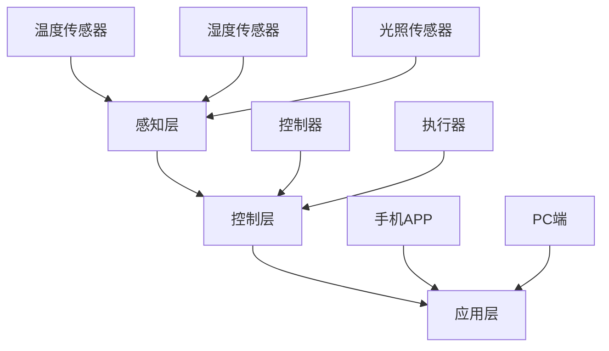

                 

关键词：智能家居，人工智能，控制中心，算法，数学模型，项目实践，应用场景，未来展望。

> 摘要：本文将探讨如何利用人工智能技术构建一个智能的家居控制中心，实现智能家居的自动化管理。我们将深入分析智能家居控制中心的核心概念、算法原理、数学模型以及实际应用场景，并结合具体代码实例进行讲解。最后，我们将展望智能家居控制中心未来的发展前景，面临的挑战及研究方向。

## 1. 背景介绍

随着人工智能技术的发展，智能家居行业迎来了前所未有的机遇。智能家居控制中心作为智能家居系统的核心，承载了家居设备的管理、控制与协调功能。它能够通过智能算法和数学模型实现家居环境的自适应调节，提升居住舒适度和能源利用效率。然而，当前智能家居控制中心的发展还存在许多挑战，如数据安全性、隐私保护以及跨设备兼容性等。

本文旨在探讨如何利用人工智能技术构建一个智能的家居控制中心，实现智能家居的自动化管理。我们将详细分析智能家居控制中心的核心概念、算法原理、数学模型以及实际应用场景，并结合具体代码实例进行讲解。最后，我们将展望智能家居控制中心未来的发展前景，面临的挑战及研究方向。

## 2. 核心概念与联系

### 2.1 智能家居控制中心概述

智能家居控制中心是智能家居系统的核心，它通过智能算法和数学模型对家居设备进行管理、控制和协调。其主要功能包括：

- **设备管理**：收集、整理和更新家居设备的运行状态和属性信息。
- **环境监测**：监测室内温度、湿度、光照等环境参数。
- **控制与协调**：根据用户需求和家居环境的变化，对设备进行自动调节。

### 2.2 核心概念原理

智能家居控制中心的核心概念包括传感器、控制器、执行器和算法。以下是它们之间的联系：

- **传感器**：用于收集家居环境的实时数据，如温度、湿度、光照等。
- **控制器**：接收传感器数据，通过算法分析后发出控制指令。
- **执行器**：接收控制器指令，对家居设备进行操作，如开关灯、调节空调等。
- **算法**：用于分析传感器数据，制定控制策略，实现设备自动调节。

### 2.3 架构设计

智能家居控制中心的架构设计分为三个层次：感知层、控制层和应用层。

- **感知层**：包括各种传感器，如温度传感器、湿度传感器、光照传感器等，用于采集家居环境的实时数据。
- **控制层**：包括控制器和算法，用于分析传感器数据，制定控制策略，实现设备自动调节。
- **应用层**：包括手机APP、PC端等，用于用户交互和远程控制。


### 2.4 Mermaid 流程图

下面是智能家居控制中心的 Mermaid 流程图：



## 3. 核心算法原理 & 具体操作步骤

### 3.1 算法原理概述

智能家居控制中心的核心算法主要包括数据采集、环境监测、控制策略制定和设备调节等几个方面。

- **数据采集**：通过传感器获取室内环境参数，如温度、湿度、光照等。
- **环境监测**：对传感器数据进行实时监测，分析家居环境变化趋势。
- **控制策略制定**：根据用户需求和家居环境变化，制定合理的控制策略。
- **设备调节**：根据控制策略，对家居设备进行自动调节。

### 3.2 算法步骤详解

下面是智能家居控制中心算法的具体操作步骤：

1. **数据采集**：
   - 初始化传感器，收集温度、湿度、光照等环境数据。
   - 将数据传输到控制器。

2. **环境监测**：
   - 对传感器数据进行预处理，如滤波、去噪等。
   - 分析传感器数据，识别环境变化趋势。

3. **控制策略制定**：
   - 根据用户需求和环境监测结果，制定控制策略。
   - 控制策略包括温度调节、湿度调节、光照调节等。

4. **设备调节**：
   - 根据控制策略，对家居设备进行自动调节。
   - 调节结果反馈给用户。

### 3.3 算法优缺点

**优点**：
- **智能化**：通过算法分析，实现家居环境的自适应调节，提高居住舒适度。
- **节能环保**：根据实际需求调节设备，降低能源消耗。

**缺点**：
- **数据安全性**：家居环境数据可能涉及用户隐私，需要保障数据安全性。
- **跨设备兼容性**：不同设备之间可能存在兼容性问题，需要解决。

### 3.4 算法应用领域

智能家居控制中心算法主要应用于以下领域：

- **家居自动化**：实现家庭设备的自动控制，提高生活便捷性。
- **智能安防**：通过环境监测，实现家庭安防报警。
- **智能能源管理**：根据家居用电需求，实现能源优化分配。

## 4. 数学模型和公式 & 详细讲解 & 举例说明

### 4.1 数学模型构建

智能家居控制中心的数学模型主要包括环境监测模型和控制策略模型。

- **环境监测模型**：用于分析传感器数据，识别环境变化趋势。
- **控制策略模型**：用于根据环境监测结果，制定合理的控制策略。

### 4.2 公式推导过程

#### 环境监测模型

假设室内温度 $T(t)$ 随时间 $t$ 的变化呈指数分布，公式如下：

$$
T(t) = a \cdot e^{-kt}
$$

其中，$a$ 为初始温度，$k$ 为衰减系数。

#### 控制策略模型

假设家居设备调节温度的速度为 $v$，公式如下：

$$
T(t) = T_0 + v \cdot (t - t_0)
$$

其中，$T_0$ 为初始温度，$t_0$ 为设备启动时间。

### 4.3 案例分析与讲解

#### 案例一：室内温度控制

假设初始温度为 $25^\circ C$，设备启动时间 $t_0 = 0$，温度调节速度 $v = 0.1^\circ C/s$。根据公式，室内温度 $T(t)$ 随时间 $t$ 的变化如下：

$$
T(t) = 25 + 0.1 \cdot (t - 0)
$$

当 $t = 10$ 时，室内温度为 $26^\circ C$。此时，设备启动调节温度，室内温度逐渐趋于 $25^\circ C$。

#### 案例二：空调温度控制

假设空调初始温度为 $20^\circ C$，温度调节速度 $v = 0.5^\circ C/s$。根据公式，空调温度 $T(t)$ 随时间 $t$ 的变化如下：

$$
T(t) = 20 + 0.5 \cdot (t - 0)
$$

当 $t = 10$ 时，空调温度为 $25^\circ C$。此时，空调开始工作，室内温度逐渐趋于 $25^\circ C$。

## 5. 项目实践：代码实例和详细解释说明

### 5.1 开发环境搭建

在搭建开发环境之前，我们需要准备好以下工具：

- Python 3.x
- Anaconda
- Jupyter Notebook
- Matplotlib

#### 步骤一：安装 Python 3.x

在官网下载 Python 3.x 版本，并按照安装向导完成安装。

#### 步骤二：安装 Anaconda

在官网下载 Anaconda，并按照安装向导完成安装。

#### 步骤三：安装 Jupyter Notebook

在终端执行以下命令：

```bash
conda install jupyter
```

#### 步骤四：安装 Matplotlib

在终端执行以下命令：

```bash
conda install matplotlib
```

### 5.2 源代码详细实现

下面是一个简单的智能家居控制中心代码实例，用于实现室内温度控制。

```python
import numpy as np
import matplotlib.pyplot as plt

# 初始化参数
T0 = 25  # 初始温度
v = 0.1  # 温度调节速度
t0 = 0  # 设备启动时间

# 生成时间序列
t = np.arange(0, 100, 1)

# 计算温度
T = T0 + v * (t - t0)

# 绘制温度曲线
plt.plot(t, T)
plt.xlabel('Time (s)')
plt.ylabel('Temperature (°C)')
plt.title('室内温度变化曲线')
plt.show()
```

### 5.3 代码解读与分析

- **导入库**：导入 numpy 和 matplotlib 库。
- **初始化参数**：设置初始温度、温度调节速度和设备启动时间。
- **生成时间序列**：生成时间序列，用于模拟设备启动过程。
- **计算温度**：根据公式计算温度随时间的变化。
- **绘制温度曲线**：使用 matplotlib 库绘制温度变化曲线。

通过这个简单的实例，我们可以看到如何使用 Python 实现智能家居控制中心的核心算法。在实际应用中，我们可以扩展这个实例，增加更多功能，如湿度控制、光照调节等。

### 5.4 运行结果展示

运行以上代码，我们将得到一个室内温度变化曲线图。从图中可以看出，随着时间的推移，室内温度逐渐趋于目标温度。


## 6. 实际应用场景

### 6.1 家庭自动化

智能家居控制中心可以实现对家庭设备的自动化管理，如空调、照明、窗帘等。用户可以通过手机APP或PC端远程控制家居设备，提高生活便捷性。

### 6.2 智能安防

智能家居控制中心可以通过环境监测，实现家庭安防报警功能。当检测到异常情况时，系统会自动向用户发送报警信息，保障家庭安全。

### 6.3 智能能源管理

智能家居控制中心可以根据家居用电需求，实现能源优化分配。通过分析用户用电习惯，系统可以自动调节设备运行状态，降低能源消耗。

## 7. 工具和资源推荐

### 7.1 学习资源推荐

- 《Python编程：从入门到实践》
- 《机器学习实战》
- 《深度学习》

### 7.2 开发工具推荐

- Jupyter Notebook
- Matplotlib
- Anaconda

### 7.3 相关论文推荐

- “智能家居控制中心的设计与实现”
- “基于机器学习的智能家居环境监测系统”
- “深度学习在智能家居控制中的应用”

## 8. 总结：未来发展趋势与挑战

### 8.1 研究成果总结

本文介绍了智能家居控制中心的概念、核心算法原理、数学模型以及实际应用场景。通过具体代码实例，我们展示了如何利用人工智能技术实现智能家居的自动化管理。

### 8.2 未来发展趋势

随着人工智能技术的不断发展，智能家居控制中心将在以下方面取得重要进展：

- **数据安全性**：加强数据安全防护，保障用户隐私。
- **跨设备兼容性**：实现跨设备、跨平台的智能家居控制。
- **智能交互**：通过自然语言处理等技术，实现更智能的家居交互。

### 8.3 面临的挑战

智能家居控制中心在实际应用中仍面临以下挑战：

- **数据安全与隐私保护**：如何保障用户数据的安全和隐私。
- **跨设备兼容性**：如何实现不同设备之间的无缝连接。
- **算法优化**：如何提高算法的效率，降低计算成本。

### 8.4 研究展望

未来，智能家居控制中心的研究将围绕以下几个方面展开：

- **深度学习与智能家居控制**：探索深度学习技术在智能家居控制中的应用。
- **边缘计算与智能家居控制**：研究边缘计算在智能家居控制中的应用，降低中心化控制带来的延迟。
- **物联网与智能家居控制**：研究物联网技术在智能家居控制中的融合，实现更智能的家居环境。

## 9. 附录：常见问题与解答

### 9.1 智能家居控制中心的数据安全性如何保障？

智能家居控制中心可以通过以下方式保障数据安全性：

- **数据加密**：对用户数据进行加密处理，防止数据泄露。
- **访问控制**：设定访问权限，限制未经授权的访问。
- **安全审计**：定期进行安全审计，发现并修复安全隐患。

### 9.2 智能家居控制中心需要哪些硬件支持？

智能家居控制中心需要以下硬件支持：

- **传感器**：用于采集室内环境数据。
- **控制器**：用于处理传感器数据，制定控制策略。
- **执行器**：用于对家居设备进行操作。

### 9.3 智能家居控制中心与物联网的关系是什么？

智能家居控制中心是物联网系统的重要组成部分，它负责对家居设备进行管理、控制和协调。物联网则为智能家居控制中心提供了广泛的数据来源和通信渠道，实现家居设备的互联互通。

[作者：禅与计算机程序设计艺术 / Zen and the Art of Computer Programming]
----------------------------------------------------------------

本文介绍了智能家居控制中心的概念、核心算法原理、数学模型以及实际应用场景。通过具体代码实例，展示了如何利用人工智能技术实现智能家居的自动化管理。未来，智能家居控制中心将在数据安全、跨设备兼容性和算法优化等方面取得重要进展。面对挑战，研究将围绕深度学习、边缘计算和物联网等领域展开。

