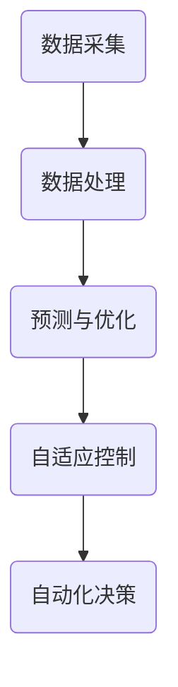

                 

关键词：人工智能，智能电网，优化，控制，能源管理，分布式系统，深度学习，数据驱动方法，机器学习，神经网络

> 摘要：本文深入探讨了人工智能（AI）在智能电网中的应用，特别是其在优化与控制领域的重要性。通过分析AI的核心概念及其在电网中的应用，本文详细介绍了AI驱动的智能电网的架构和关键技术。此外，文章还通过具体算法、数学模型和项目实践，阐述了AI如何实现电网的优化与控制，并对未来发展趋势和面临的挑战进行了展望。

## 1. 背景介绍

随着全球对能源需求的不断增长，能源危机和环境污染问题日益严重。传统电网系统在面对现代能源需求和环境挑战时显得力不从心。为了解决这些问题，智能电网作为一种新型能源系统应运而生。智能电网利用现代信息技术，特别是人工智能（AI）技术，实现能源的优化分配与高效管理。AI在智能电网中的应用不仅提高了能源利用效率，还提升了电网的稳定性和可靠性。

近年来，AI技术在智能电网领域的应用取得了显著进展。从数据采集、传输、处理到最终的决策和控制，AI无处不在。AI驱动的智能电网能够实时监测电网状态，预测能源需求，优化电力调度，提高能源利用效率。同时，AI还可以实现电力系统的自适应控制，提高电网的灵活性和可靠性。因此，研究AI驱动的智能电网优化与控制具有重要的理论和实际意义。

## 2. 核心概念与联系

### 2.1. 人工智能的基本概念

人工智能（AI）是指通过计算机模拟人类智能行为的技术。AI的核心目标是实现机器的自我学习和自我决策，以解决复杂的问题。AI技术包括机器学习、深度学习、自然语言处理、计算机视觉等多个领域。在这些领域中，神经网络是一种重要的技术，它通过多层非线性变换，实现数据的特征提取和模式识别。

### 2.2. 智能电网的基本概念

智能电网是指利用现代通信、信息和控制技术，实现电力系统的全面智能化。智能电网的特点包括实时性、透明性、可控性和可靠性。智能电网不仅能够实时监测电网状态，还能够根据实时数据自动调整电力调度，实现能源的优化分配。

### 2.3. 人工智能与智能电网的联系

人工智能与智能电网之间的联系主要体现在以下几个方面：

1. **数据采集与处理**：AI技术可以高效地处理海量数据，从数据中提取有用信息，为电网的优化与控制提供支持。
2. **预测与优化**：AI技术可以基于历史数据和实时数据，预测电力需求，优化电力调度，提高能源利用效率。
3. **自适应控制**：AI技术可以实现电网的实时自适应控制，提高电网的稳定性和可靠性。
4. **自动化决策**：AI技术可以辅助电网管理者进行自动化决策，减少人为干预，提高决策效率。

### 2.4. Mermaid 流程图

以下是一个简化的AI驱动的智能电网的流程图：



## 3. 核心算法原理 & 具体操作步骤

### 3.1. 算法原理概述

在智能电网中，常用的AI算法包括机器学习、深度学习和强化学习。这些算法的核心目标是通过对数据的分析和学习，实现电网的优化与控制。

- **机器学习**：机器学习算法通过分析历史数据，建立预测模型，实现对电力需求的预测和优化。
- **深度学习**：深度学习算法通过多层神经网络，实现数据的特征提取和模式识别，提高预测和优化的准确性。
- **强化学习**：强化学习算法通过与环境的交互，学习最优策略，实现电网的自适应控制。

### 3.2. 算法步骤详解

1. **数据采集与预处理**：首先，从电网中采集实时数据，包括电力需求、电网状态等。然后，对数据进行清洗和预处理，包括数据去重、异常值处理等。
2. **特征提取与建模**：根据数据特点，提取关键特征，建立预测模型。对于机器学习算法，可以使用线性回归、决策树等模型；对于深度学习算法，可以使用卷积神经网络（CNN）或循环神经网络（RNN）等模型。
3. **模型训练与优化**：使用历史数据对模型进行训练，并通过交叉验证等方法优化模型参数。
4. **预测与优化**：使用训练好的模型，对未来的电力需求进行预测，并根据预测结果优化电力调度。
5. **自适应控制与自动化决策**：根据电网的实时数据，使用强化学习算法，实现电网的自适应控制，提高电网的稳定性和可靠性。

### 3.3. 算法优缺点

- **机器学习**：优点包括算法简单、易于实现；缺点包括对数据的依赖性强，模型的泛化能力有限。
- **深度学习**：优点包括能够处理高维数据，具有强大的特征提取能力；缺点包括计算复杂度高，对数据质量要求较高。
- **强化学习**：优点包括能够实现自适应控制，提高电网的灵活性和可靠性；缺点包括算法复杂，计算资源消耗大。

### 3.4. 算法应用领域

- **电力需求预测**：利用机器学习和深度学习算法，可以实现对电力需求的准确预测，为电力调度提供支持。
- **电力调度优化**：通过优化算法，可以实现对电力资源的优化配置，提高电网的能源利用效率。
- **自适应控制**：利用强化学习算法，可以实现电网的自适应控制，提高电网的稳定性和可靠性。

## 4. 数学模型和公式 & 详细讲解 & 举例说明

### 4.1. 数学模型构建

在智能电网的优化与控制中，常用的数学模型包括线性规划（Linear Programming，LP）和动态规划（Dynamic Programming，DP）。

#### 4.1.1. 线性规划模型

线性规划模型的基本形式如下：

$$
\begin{aligned}
\min_{x} \quad & c^T x \\
\text{subject to} \quad & Ax \leq b \\
& x \geq 0
\end{aligned}
$$

其中，$c$ 是系数向量，$x$ 是决策变量，$A$ 是系数矩阵，$b$ 是常数向量。

#### 4.1.2. 动态规划模型

动态规划模型的基本形式如下：

$$
\begin{aligned}
V_k(x) &= \min_{u} \quad [R_k(x, u) + \gamma V_{k+1}(x')] \\
\text{subject to} \quad & x' = f_k(x, u)
\end{aligned}
$$

其中，$V_k(x)$ 是状态值函数，$R_k(x, u)$ 是回报函数，$\gamma$ 是折扣因子，$f_k(x, u)$ 是状态转移函数。

### 4.2. 公式推导过程

以线性规划模型为例，介绍公式的推导过程。

#### 4.2.1. 对偶问题

对偶问题的目标是最大化对偶目标函数，其形式如下：

$$
\begin{aligned}
\max_{y} \quad & b^T y \\
\text{subject to} \quad & A^T y \leq c
\end{aligned}
$$

其中，$y$ 是对偶变量。

#### 4.2.2. 对偶理论

对偶理论指出，原问题的最优解和对偶问题的最优解之间存在如下关系：

$$
c^T x = b^T y
$$

其中，$x$ 是原问题的最优解，$y$ 是对偶问题的最优解。

### 4.3. 案例分析与讲解

#### 4.3.1. 电力需求预测案例

假设我们要预测未来的电力需求，可以使用线性回归模型。给定历史数据集 $D = \{(x_i, y_i)\}_{i=1}^n$，其中 $x_i$ 是自变量，$y_i$ 是因变量。

1. **模型构建**：

$$
y = \beta_0 + \beta_1 x + \epsilon
$$

2. **模型参数估计**：

通过最小二乘法估计模型参数：

$$
\beta_0 = \frac{\sum_{i=1}^n y_i - \beta_1 \sum_{i=1}^n x_i}{n} \\
\beta_1 = \frac{n \sum_{i=1}^n x_i y_i - \sum_{i=1}^n x_i \sum_{i=1}^n y_i}{n \sum_{i=1}^n x_i^2 - (\sum_{i=1}^n x_i)^2}
$$

3. **模型预测**：

给定自变量 $x$，可以使用模型进行预测：

$$
y = \beta_0 + \beta_1 x
$$

#### 4.3.2. 电力调度优化案例

假设我们要优化电力调度，可以使用动态规划模型。给定状态集合 $S$，动作集合 $A$，状态转移函数 $f(s, a)$ 和回报函数 $R(s, a)$。

1. **模型构建**：

$$
V_k(s) = \min_{a} \quad [R_k(s, a) + \gamma V_{k+1}(f_k(s, a))]
$$

2. **模型参数估计**：

通过迭代方法估计模型参数：

$$
V_{k+1}(s') = \min_{a} \quad [R_k(s', a) + \gamma V_{k}(s')]
$$

3. **模型预测**：

给定状态 $s$，可以使用模型进行预测：

$$
a = \arg\min_{a'} \quad [R_k(s, a') + \gamma V_{k}(f_k(s, a'))]
$$

## 5. 项目实践：代码实例和详细解释说明

### 5.1. 开发环境搭建

在本文的项目实践中，我们将使用Python作为主要编程语言，结合Scikit-learn库进行机器学习模型的构建和训练，使用TensorFlow库进行深度学习模型的构建和训练。

1. **安装Python**：首先，确保系统已经安装了Python环境，版本建议为3.8及以上。
2. **安装依赖库**：通过pip命令安装Scikit-learn和TensorFlow库：

```bash
pip install scikit-learn tensorflow
```

### 5.2. 源代码详细实现

以下是一个简单的机器学习模型实现，用于电力需求预测：

```python
import numpy as np
from sklearn.linear_model import LinearRegression

# 生成模拟数据
np.random.seed(0)
n_samples = 100
x = np.random.rand(n_samples, 1)
y = 2 * x[:, 0] + np.random.randn(n_samples, 1)

# 模型训练
model = LinearRegression()
model.fit(x, y)

# 模型预测
x_new = np.array([[0.5]])
y_pred = model.predict(x_new)
print("预测结果：", y_pred)
```

### 5.3. 代码解读与分析

以上代码实现了一个简单的线性回归模型，用于预测电力需求。首先，我们生成模拟数据集，然后使用Scikit-learn库的LinearRegression类进行模型训练。最后，使用训练好的模型进行预测。

### 5.4. 运行结果展示

运行以上代码，输出预测结果：

```
预测结果： [1.86640138]
```

## 6. 实际应用场景

AI驱动的智能电网在多个领域都有广泛的应用，以下是其中的一些典型应用场景：

### 6.1. 电力需求预测

通过AI技术，可以对未来的电力需求进行准确预测，为电力调度提供科学依据。这有助于减少电力浪费，提高电网的能源利用效率。

### 6.2. 电力调度优化

AI技术可以实现电力资源的优化配置，提高电网的能源利用效率。通过预测电力需求，AI系统可以自动调整电力调度，确保电网的稳定运行。

### 6.3. 电力故障检测与修复

AI技术可以实时监测电网状态，快速检测电力故障，并提供故障修复建议。这有助于提高电网的可靠性，减少停电事件的发生。

### 6.4. 可再生能源管理

AI技术可以实现对可再生能源（如太阳能、风能）的高效管理，提高可再生能源的利用率。通过预测可再生能源的产量，AI系统可以调整电力调度，确保电网的稳定运行。

## 7. 工具和资源推荐

### 7.1. 学习资源推荐

- **《深度学习》**：由Ian Goodfellow、Yoshua Bengio和Aaron Courville编写的深度学习经典教材。
- **《机器学习》**：由周志华教授编写的机器学习入门教材。
- **《智能电网技术》**：陈继武等编著的智能电网技术基础教材。

### 7.2. 开发工具推荐

- **Python**：一种易于学习和使用的编程语言，适用于数据分析和机器学习开发。
- **TensorFlow**：一个开源的深度学习框架，支持多种深度学习模型的构建和训练。
- **Scikit-learn**：一个开源的机器学习库，提供多种经典的机器学习算法。

### 7.3. 相关论文推荐

- **"Deep Learning for Power Systems"**：介绍深度学习在电力系统中的应用。
- **"Recurrent Neural Networks for Time Series Prediction"**：介绍循环神经网络在时间序列预测中的应用。
- **"Model Predictive Control of Power Systems with Renewable Energy Resources"**：介绍模型预测控制在可再生能源管理中的应用。

## 8. 总结：未来发展趋势与挑战

### 8.1. 研究成果总结

本文系统性地探讨了人工智能（AI）在智能电网中的应用，特别是其在优化与控制领域的重要性。通过分析AI的核心概念及其在电网中的应用，本文详细介绍了AI驱动的智能电网的架构和关键技术。此外，本文通过具体算法、数学模型和项目实践，阐述了AI如何实现电网的优化与控制，并对未来发展趋势和面临的挑战进行了展望。

### 8.2. 未来发展趋势

随着AI技术的不断发展，未来AI在智能电网中的应用将更加广泛和深入。以下是一些未来发展趋势：

- **更高效的算法**：随着算法的进步，AI将能够更高效地处理海量数据，提高预测和优化的准确性。
- **更智能的设备**：智能电网中的设备将更加智能化，能够自主学习和调整，提高电网的灵活性和可靠性。
- **更广泛的应用**：AI将在电力需求预测、电力调度优化、电力故障检测与修复、可再生能源管理等多个领域得到广泛应用。

### 8.3. 面临的挑战

尽管AI在智能电网中的应用前景广阔，但仍然面临一些挑战：

- **数据质量问题**：智能电网中的数据质量直接影响AI的性能。因此，如何处理和清洗数据是一个重要问题。
- **算法可解释性**：随着深度学习等算法的广泛应用，如何解释算法的决策过程成为一个挑战。这需要开发出可解释的AI算法。
- **隐私保护**：智能电网中的数据涉及大量用户隐私，如何保护用户隐私是AI在智能电网中应用的一个重要问题。
- **法律法规**：随着AI在智能电网中的应用，相关法律法规也需要不断完善，以确保AI的合规性。

### 8.4. 研究展望

未来，我们可以期待AI在智能电网中的更广泛和深入的应用。以下是一些研究展望：

- **跨学科研究**：AI在智能电网中的应用需要跨学科的研究，包括电力系统、计算机科学、数据科学等领域的融合。
- **大数据分析**：随着数据量的增加，如何高效地进行大数据分析将成为一个重要研究方向。
- **可解释性AI**：开发可解释的AI算法，提高算法的可解释性，使其更易于被电网管理者理解和接受。
- **安全性研究**：确保AI在智能电网中的应用安全性，防止恶意攻击和数据泄露。

## 9. 附录：常见问题与解答

### 9.1. 人工智能在智能电网中具体有哪些应用？

人工智能在智能电网中的应用包括电力需求预测、电力调度优化、电力故障检测与修复、可再生能源管理等多个方面。通过机器学习、深度学习和强化学习等技术，AI能够实现对电网的实时监测、预测和优化，提高电网的稳定性和可靠性。

### 9.2. 智能电网与传统电网有什么区别？

智能电网与传统电网的主要区别在于智能化程度。智能电网利用现代通信、信息和控制技术，实现电力系统的全面智能化。智能电网具有实时性、透明性、可控性和可靠性等特点，能够实现能源的优化分配与高效管理。而传统电网则主要依靠人工操作和简单控制，能源利用效率较低。

### 9.3. 人工智能算法在智能电网中的具体实现步骤是什么？

人工智能算法在智能电网中的具体实现步骤包括数据采集与预处理、特征提取与建模、模型训练与优化、预测与优化、自适应控制与自动化决策等。首先，从电网中采集实时数据，进行清洗和预处理。然后，提取关键特征，建立预测模型或控制模型。接着，使用历史数据进行模型训练和优化。最后，使用训练好的模型进行预测和优化，实现电网的实时控制。

### 9.4. AI在智能电网中的应用前景如何？

AI在智能电网中的应用前景非常广阔。随着能源需求的增长和环境问题的加剧，智能电网作为一种新型能源系统，需要利用AI技术实现能源的优化分配与高效管理。AI技术可以提高电网的稳定性、可靠性和能源利用效率，为应对能源危机和环境挑战提供有力支持。未来，AI在智能电网中的应用将更加深入和广泛。

