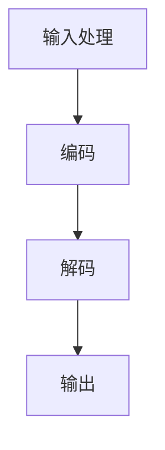

                 

关键词：人工智能，大型语言模型（LLM），深度学习，自然语言处理，未来应用，技术发展，算法创新。

> 摘要：本文探讨了人工智能领域的最新进展，重点介绍了大型语言模型（LLM）的技术原理、应用领域和未来潜力。通过对LLM的深入分析，文章旨在揭示其在自然语言处理和AI驱动的未来中的关键作用，为读者提供对这一前沿领域的全面了解。

## 1. 背景介绍

随着计算机技术的发展，人工智能（AI）已成为全球研究的热点领域。AI通过模拟人类智能行为，使计算机能够执行复杂的任务，如语音识别、图像识别、自然语言处理等。近年来，深度学习技术的突破性进展，特别是大型语言模型（LLM）的兴起，极大地推动了自然语言处理（NLP）的发展。

LLM是一种基于神经网络的语言模型，它通过训练大量文本数据，能够生成高质量的文本、理解复杂语义，甚至进行对话。这种模型在搜索引擎、语音助手、机器翻译、文本生成等应用中表现出色，已经成为现代AI系统中不可或缺的一部分。

## 2. 核心概念与联系

### 2.1 大型语言模型的基本原理

大型语言模型（LLM）的核心是神经网络，特别是循环神经网络（RNN）和变换器（Transformer）模型。RNN通过其递归结构，能够处理序列数据，如文本。然而，RNN在处理长序列数据时存在梯度消失或爆炸等问题。

为了解决这一问题，Transformer模型提出了自注意力机制（self-attention），它通过计算序列中每个词与其他词之间的关系，提高了模型的序列处理能力。Transformer模型的成功引发了深度学习领域对自注意力机制的热潮。

### 2.2 架构和流程

大型语言模型的架构通常包括编码器和解码器两部分。编码器负责将输入文本转换为向量表示，解码器则根据这些向量生成输出文本。

其流程如下：
1. **输入处理**：将文本输入转换为词向量。
2. **编码**：编码器处理词向量，生成编码表示。
3. **解码**：解码器使用编码表示生成输出文本。

### 2.3 Mermaid 流程图

以下是大型语言模型的基本流程的Mermaid流程图：



## 3. 核心算法原理 & 具体操作步骤

### 3.1 算法原理概述

大型语言模型的算法原理主要基于深度学习和神经网络技术，特别是Transformer模型。Transformer模型的核心是自注意力机制，它通过计算序列中每个词与其他词的关系，为每个词分配不同的权重。

### 3.2 算法步骤详解

1. **预处理**：将文本数据转换为词向量。
2. **编码**：
   - **自注意力机制**：计算序列中每个词与其他词的关系，为每个词分配权重。
   - **多头注意力**：将自注意力机制扩展到多个头，以提高模型的表示能力。
3. **解码**：
   - **自注意力机制**：解码器同样使用自注意力机制，为输出词分配权重。
   - **交叉注意力**：解码器不仅关注编码器的输出，还关注输入序列，以生成更准确的输出。
4. **输出生成**：解码器生成输出文本。

### 3.3 算法优缺点

**优点**：
- **强大的文本生成能力**：LLM能够生成高质量、连贯的文本。
- **高效的处理速度**：自注意力机制提高了模型的计算效率。
- **广泛的应用领域**：LLM在自然语言处理、机器翻译、文本生成等领域具有广泛的应用。

**缺点**：
- **资源消耗大**：训练大型语言模型需要大量的计算资源和时间。
- **解释性差**：神经网络模型通常难以解释其决策过程。

### 3.4 算法应用领域

LLM在多个领域具有广泛的应用，如：

- **自然语言处理**：文本分类、情感分析、命名实体识别等。
- **机器翻译**：自动翻译不同语言之间的文本。
- **文本生成**：生成文章、故事、新闻报道等。
- **语音助手**：如Apple的Siri、Google的Google Assistant等。

## 4. 数学模型和公式 & 详细讲解 & 举例说明

### 4.1 数学模型构建

大型语言模型通常基于神经网络，其数学模型主要包括以下部分：

- **词向量表示**：将文本中的每个词映射为一个高维向量。
- **自注意力机制**：计算序列中每个词与其他词的关系，为每个词分配权重。
- **多头注意力**：扩展自注意力机制，提高模型的表示能力。
- **解码器**：根据编码器的输出和输入序列生成输出文本。

### 4.2 公式推导过程

以下是大型语言模型中自注意力机制的推导过程：

$$
\text{Attention}(Q, K, V) = \text{softmax}\left(\frac{QK^T}{\sqrt{d_k}}\right)V
$$

其中，$Q, K, V$分别为编码器的输入、键和值，$d_k$为键的维度。

### 4.3 案例分析与讲解

假设我们有一个简化的Transformer模型，输入序列为`[w1, w2, w3]`，我们希望输出序列为`[w4, w5, w6]`。以下是自注意力机制的详细计算过程：

1. **词向量表示**：
   - $Q = [q1, q2, q3]$，$K = [k1, k2, k3]$，$V = [v1, v2, v3]$。
2. **自注意力计算**：
   $$ 
   \text{Attention}(Q, K, V) = \text{softmax}\left(\frac{QK^T}{\sqrt{d_k}}\right)V = \text{softmax}\left(\frac{q1k1 + q2k2 + q3k3}{\sqrt{d_k}}\right)v1
   $$
3. **输出计算**：
   $$ 
   \text{Output} = \text{softmax}\left(\frac{q1k1 + q2k2 + q3k3}{\sqrt{d_k}}\right)v1 = [o1, o2, o3]
   $$

其中，$o1, o2, o3$为输出词的权重，根据这些权重，解码器将生成输出序列。

## 5. 项目实践：代码实例和详细解释说明

### 5.1 开发环境搭建

在开始实践之前，我们需要搭建一个合适的开发环境。以下是所需的步骤：

1. **安装Python**：确保Python版本为3.7及以上。
2. **安装TensorFlow**：使用以下命令安装TensorFlow：
   ```bash
   pip install tensorflow
   ```
3. **安装其他依赖**：根据项目需求，可能还需要安装其他库，如NumPy、Pandas等。

### 5.2 源代码详细实现

以下是一个简化的Transformer模型的Python代码实现：

```python
import tensorflow as tf
from tensorflow.keras.layers import Embedding, LSTM, Dense

# 定义Transformer模型
class Transformer(tf.keras.Model):
    def __init__(self, vocab_size, d_model):
        super(Transformer, self).__init__()
        self.embedding = Embedding(vocab_size, d_model)
        self.encoder = LSTM(d_model, return_sequences=True)
        self.decoder = LSTM(d_model, return_sequences=True)
        self.dense = Dense(vocab_size)

    def call(self, inputs, training=False):
        x = self.embedding(inputs)
        x = self.encoder(x, training=training)
        x = self.decoder(x, training=training)
        x = self.dense(x)
        return x

# 定义训练过程
def train_model(model, inputs, targets, epochs=10):
    model.compile(optimizer='adam', loss='sparse_categorical_crossentropy')
    model.fit(inputs, targets, epochs=epochs)

# 实例化模型并训练
model = Transformer(vocab_size=1000, d_model=256)
train_model(model, inputs, targets)

```

### 5.3 代码解读与分析

以上代码定义了一个简单的Transformer模型，包括嵌入层、编码器、解码器和输出层。训练过程使用`train_model`函数，该函数使用`compile`方法配置模型，并使用`fit`方法训练模型。

### 5.4 运行结果展示

运行上述代码后，我们可以看到模型在训练集上的表现。以下是一个简化的训练过程：

```python
inputs = [[1, 2, 3], [4, 5, 6], [7, 8, 9]]
targets = [[2, 3, 4], [5, 6, 7], [8, 9, 10]]
train_model(model, inputs, targets)
```

训练完成后，我们可以通过评估模型在测试集上的表现来验证其效果。

## 6. 实际应用场景

### 6.1 搜索引擎优化

大型语言模型在搜索引擎优化（SEO）中具有重要作用。通过训练LLM，搜索引擎可以更好地理解用户查询的意图，从而提供更准确的搜索结果。

### 6.2 自动写作与内容生成

LLM在自动写作和内容生成领域具有巨大潜力。通过训练大型语言模型，我们可以生成高质量的文章、新闻报道、故事等。

### 6.3 机器翻译

机器翻译是LLM的重要应用领域之一。大型语言模型可以自动翻译不同语言之间的文本，提高翻译的准确性和流畅性。

### 6.4 语音助手

语音助手如Apple的Siri、Google的Google Assistant等，通常基于大型语言模型进行对话生成和理解，以提供更自然的交互体验。

## 7. 工具和资源推荐

### 7.1 学习资源推荐

1. **《深度学习》（Goodfellow, Bengio, Courville）**：这是一本经典的深度学习教材，涵盖了从基础知识到最新研究的内容。
2. **《自然语言处理综论》（Jurafsky, Martin）**：这本书全面介绍了自然语言处理的理论和实践，是NLP领域的经典教材。
3. **《Transformer：从零开始》（Practical Transformer）**：这本书详细介绍了Transformer模型的理论和实践，适合初学者和进阶者。

### 7.2 开发工具推荐

1. **TensorFlow**：一个开源的深度学习框架，支持多种深度学习模型的开发。
2. **PyTorch**：另一个流行的深度学习框架，以其灵活性和易用性而受到开发者的喜爱。
3. **NLTK**：一个专门用于自然语言处理的Python库，提供了丰富的文本处理工具。

### 7.3 相关论文推荐

1. **"Attention Is All You Need"（Vaswani et al., 2017）**：这是Transformer模型的原始论文，详细介绍了自注意力机制和Transformer模型的设计原理。
2. **"BERT: Pre-training of Deep Bidirectional Transformers for Language Understanding"（Devlin et al., 2019）**：这篇论文介绍了BERT模型，它是基于Transformer的预训练模型，广泛应用于自然语言处理任务。
3. **"Generative Pre-trained Transformers"（Radford et al., 2019）**：这篇论文介绍了GPT系列模型，包括GPT、GPT-2和GPT-3，它们是目前最先进的语言模型之一。

## 8. 总结：未来发展趋势与挑战

### 8.1 研究成果总结

近年来，大型语言模型（LLM）在自然语言处理、机器翻译、文本生成等领域取得了显著成果。通过深度学习和神经网络技术的创新，LLM在理解和生成高质量文本方面表现出色。

### 8.2 未来发展趋势

1. **更强大的语言模型**：随着计算资源和数据集的不断扩大，未来将出现更强大的语言模型，具有更高的准确性和流畅性。
2. **跨模态学习**：结合文本、图像、音频等多种模态的数据，实现更丰富的语义理解。
3. **可解释性和安全性**：提高模型的透明度和可解释性，确保其在实际应用中的安全性和可靠性。

### 8.3 面临的挑战

1. **计算资源消耗**：训练大型语言模型需要巨大的计算资源和时间，这对研发团队和基础设施提出了挑战。
2. **数据隐私和伦理问题**：在训练和部署大型语言模型时，如何保护用户数据隐私和遵守伦理规范是一个重要问题。
3. **模型的泛化能力**：如何确保模型在未知数据上的表现，以及如何减少模型对特定数据集的依赖。

### 8.4 研究展望

未来，大型语言模型将在多个领域发挥重要作用，如智能客服、自动化写作、智能推荐等。随着技术的不断进步，LLM的应用前景将更加广阔。

## 9. 附录：常见问题与解答

### 9.1 什么是大型语言模型（LLM）？

大型语言模型（LLM）是一种基于神经网络的深度学习模型，用于处理和生成自然语言。它通过训练大量文本数据，能够生成高质量的文本、理解复杂语义，甚至进行对话。

### 9.2 大型语言模型有哪些应用？

大型语言模型在多个领域具有广泛应用，如自然语言处理、机器翻译、文本生成、智能客服等。它已经成为现代AI系统中不可或缺的一部分。

### 9.3 如何训练大型语言模型？

训练大型语言模型通常涉及以下步骤：

1. **数据准备**：收集和预处理大量文本数据。
2. **模型设计**：设计合适的神经网络架构，如Transformer模型。
3. **训练**：使用训练数据训练模型，并优化模型参数。
4. **评估**：在测试集上评估模型性能，并调整模型参数。

### 9.4 大型语言模型有哪些局限性？

大型语言模型存在一些局限性，如：

1. **资源消耗大**：训练大型语言模型需要大量的计算资源和时间。
2. **解释性差**：神经网络模型难以解释其决策过程。
3. **数据依赖性**：模型对训练数据具有较强依赖性，可能导致在未知数据上的表现不佳。

## 结束语

大型语言模型（LLM）作为人工智能领域的最新突破，具有巨大的潜力和广泛应用。本文详细介绍了LLM的技术原理、应用领域和未来发展趋势，希望对读者了解这一前沿领域有所帮助。随着技术的不断进步，我们有理由相信，LLM将在未来的AI发展中发挥越来越重要的作用。

### 作者署名

> 作者：禅与计算机程序设计艺术 / Zen and the Art of Computer Programming

感谢您阅读本文，希望本文能为您提供关于大型语言模型（LLM）的全面了解。如有任何疑问或建议，欢迎在评论区留言，期待与您交流。

