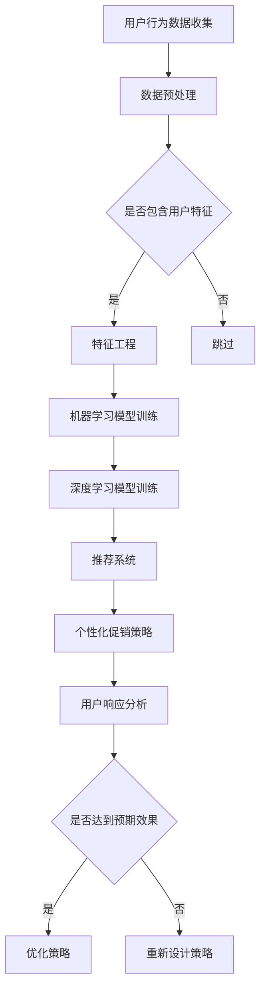

                 

关键词：电商、个性化促销、人工智能、机器学习、深度学习、推荐系统、用户行为分析、市场营销策略

摘要：随着电子商务的快速发展，个性化促销策略成为提高用户满意度和转化率的关键手段。本文将探讨如何利用人工智能技术，特别是机器学习和深度学习，构建一个有效的电商个性化促销策略体系。文章将从背景介绍、核心概念、算法原理、数学模型、项目实践和实际应用等方面详细阐述，旨在为电商从业者提供有价值的参考和指导。

## 1. 背景介绍

在互联网时代，电子商务已经成为零售业的重要组成部分。用户数量的增长和消费习惯的变化使得电商企业面临着前所未有的挑战和机遇。为了在激烈的市场竞争中脱颖而出，电商企业需要不断优化其营销策略，提升用户满意度和转化率。个性化促销策略作为市场营销的重要手段，能够针对不同用户的需求和偏好提供定制化的优惠，从而实现更高的销售额和用户黏性。

随着人工智能技术的迅猛发展，尤其是机器学习和深度学习算法的普及，电商企业可以更精准地分析用户行为，挖掘潜在需求，并在此基础上制定个性化的促销策略。这种基于数据驱动的营销模式，不仅能够提高营销效率，还能够降低营销成本，从而为企业带来更高的利润。

本文将从以下几个方面展开讨论：

1. 核心概念与联系
2. 核心算法原理与操作步骤
3. 数学模型和公式
4. 项目实践：代码实例和详细解释
5. 实际应用场景
6. 未来应用展望
7. 工具和资源推荐
8. 总结：未来发展趋势与挑战

## 2. 核心概念与联系

### 2.1 用户行为分析

用户行为分析是指通过对用户在电商平台上浏览、搜索、购买等行为数据的收集和分析，了解用户的兴趣、需求和偏好。这些数据包括用户浏览记录、购买历史、评价、评论等。用户行为分析是构建个性化促销策略的基础，通过分析用户行为，可以识别出具有相似特征的用户群体，为制定相应的促销策略提供依据。

### 2.2 机器学习与深度学习

机器学习和深度学习是人工智能领域的重要分支。机器学习是一种通过算法从数据中自动学习模式和规律的方法，而深度学习则是机器学习的一个子领域，通过多层神经网络进行深度学习，能够自动提取复杂的特征。在电商个性化促销策略中，机器学习和深度学习算法被广泛应用于用户行为分析、需求预测、推荐系统等方面。

### 2.3 推荐系统

推荐系统是一种利用机器学习和深度学习技术，根据用户的历史行为和偏好，为用户推荐相关商品或服务的系统。推荐系统是电商个性化促销策略的核心组成部分，通过精准的推荐，可以提高用户的购买意愿和转化率。

## 2.4 营销策略

营销策略是指电商企业为提高销售额和市场份额所采取的一系列措施。在个性化促销策略中，营销策略的制定需要基于用户行为分析、推荐系统和数据驱动的预测模型。通过制定个性化的促销策略，可以更好地满足用户需求，提高用户满意度和忠诚度。

### 2.5 Mermaid 流程图

下面是一个描述电商个性化促销策略流程的 Mermaid 流程图：



## 3. 核心算法原理与操作步骤

### 3.1 算法原理概述

电商个性化促销策略的核心算法包括用户行为分析、推荐系统和个性化促销策略生成。以下是这三个算法的原理概述：

- **用户行为分析**：通过机器学习和深度学习算法，对用户的历史行为数据进行挖掘和分析，提取用户的兴趣和偏好特征。
- **推荐系统**：利用用户行为数据和商品属性数据，通过协同过滤、基于内容的推荐等算法，为用户推荐相关的商品或服务。
- **个性化促销策略生成**：根据用户行为分析和推荐系统生成的用户偏好，设计个性化的促销策略，如折扣、优惠券、限时特价等。

### 3.2 算法步骤详解

下面是电商个性化促销策略的具体操作步骤：

#### 3.2.1 用户行为分析

1. **数据收集**：收集用户在电商平台的浏览、搜索、购买等行为数据。
2. **数据预处理**：对原始数据进行清洗、去重、标准化等处理，提取有用的特征。
3. **特征工程**：根据业务需求，设计合适的特征工程方法，如用户活跃度、购买频率、购物车行为等。
4. **模型训练**：利用机器学习和深度学习算法，对用户行为数据进行训练，构建用户行为分析模型。

#### 3.2.2 推荐系统

1. **用户行为数据收集**：收集用户在电商平台的行为数据，如浏览历史、购买记录、评价等。
2. **商品属性数据收集**：收集商品的相关属性数据，如品类、价格、品牌等。
3. **特征提取**：将用户行为数据和商品属性数据进行整合，提取用户和商品的共同特征。
4. **模型训练**：利用协同过滤、基于内容的推荐等算法，对用户和商品数据进行训练，构建推荐系统模型。
5. **推荐生成**：根据用户的行为数据和推荐系统模型，生成个性化的商品推荐列表。

#### 3.2.3 个性化促销策略生成

1. **用户偏好分析**：利用用户行为分析模型，分析用户的兴趣和偏好。
2. **商品推荐**：利用推荐系统模型，为用户推荐相关的商品。
3. **促销策略设计**：根据用户偏好和商品推荐，设计个性化的促销策略，如折扣、优惠券、限时特价等。
4. **策略实施**：将个性化促销策略应用于电商平台，吸引更多用户参与。

### 3.3 算法优缺点

**用户行为分析**：

- **优点**：能够深入挖掘用户的行为特征，为个性化促销策略提供依据。
- **缺点**：需要大量的用户行为数据，数据收集和处理成本较高。

**推荐系统**：

- **优点**：能够提高用户的购买意愿和转化率，降低营销成本。
- **缺点**：需要大量的商品和用户行为数据，模型训练和推荐生成的成本较高。

**个性化促销策略生成**：

- **优点**：能够根据用户偏好和需求，提供个性化的优惠，提高用户满意度和忠诚度。
- **缺点**：促销策略的设计和实施需要大量的时间和人力成本。

### 3.4 算法应用领域

电商个性化促销策略可以广泛应用于各类电商平台，包括综合电商、垂直电商、跨境电商等。以下是一些典型的应用场景：

- **综合电商平台**：通过个性化促销策略，提高用户在平台上的购物体验，增加用户黏性和转化率。
- **垂直电商平台**：针对特定品类，提供个性化的促销策略，吸引用户购买。
- **跨境电商平台**：针对不同国家和地区的用户，提供定制化的促销策略，提高国际市场的竞争力。

## 4. 数学模型和公式

在电商个性化促销策略中，数学模型和公式是理解和实现算法的关键。以下将详细讲解数学模型和公式的构建、推导过程以及实际应用。

### 4.1 数学模型构建

#### 4.1.1 用户行为分析模型

用户行为分析模型主要基于用户的历史行为数据，包括浏览记录、购买记录、评价等。以下是一个简单的用户行为分析模型：

\[ 用户行为得分 = f(浏览次数, 购买次数, 评价次数, ...)\]

其中，\( f \) 是一个复合函数，用于计算用户的综合行为得分。具体实现时，可以采用加权求和的方法，将各个行为的得分进行加权求和处理。

#### 4.1.2 推荐系统模型

推荐系统模型主要基于用户行为数据和商品属性数据，以下是一个简单的协同过滤推荐系统模型：

\[ \text{推荐概率} = \frac{r_i^u + r_j^u}{r_i^u + r_j^u + \alpha}\]

其中，\( r_i^u \) 和 \( r_j^u \) 分别表示用户 \( u \) 对商品 \( i \) 和 \( j \) 的评分，\( \alpha \) 是一个常数，用于调整推荐概率。

#### 4.1.3 个性化促销策略模型

个性化促销策略模型主要基于用户行为分析和推荐系统模型，以下是一个简单的个性化促销策略模型：

\[ \text{促销力度} = f(\text{用户行为得分}, \text{商品推荐概率}, ...)\]

其中，\( f \) 是一个复合函数，用于计算促销力度。具体实现时，可以采用分段函数的方法，根据用户行为得分和商品推荐概率的不同，设置不同的促销力度。

### 4.2 公式推导过程

#### 4.2.1 用户行为分析模型

用户行为分析模型的公式推导主要基于用户的行为特征。以下是一个简单的推导过程：

\[ 用户行为得分 = f(浏览次数, 购买次数, 评价次数, ...)\]

假设用户的浏览次数、购买次数和评价次数分别用 \( b \)、\( p \) 和 \( e \) 表示，且每个行为都有相应的权重 \( w_b \)、\( w_p \) 和 \( w_e \)。则用户行为得分的计算公式可以表示为：

\[ 用户行为得分 = w_b \times b + w_p \times p + w_e \times e\]

其中，\( w_b \)、\( w_p \) 和 \( w_e \) 分别是浏览次数、购买次数和评价次数的权重。具体权重可以通过业务需求进行调整。

#### 4.2.2 推荐系统模型

推荐系统模型的公式推导主要基于用户行为数据。以下是一个简单的推导过程：

\[ \text{推荐概率} = \frac{r_i^u + r_j^u}{r_i^u + r_j^u + \alpha}\]

其中，\( r_i^u \) 和 \( r_j^u \) 分别表示用户 \( u \) 对商品 \( i \) 和 \( j \) 的评分，\( \alpha \) 是一个常数，用于调整推荐概率。

假设用户对商品 \( i \) 和 \( j \) 的评分分别为 \( r_i \) 和 \( r_j \)，则推荐概率的公式可以表示为：

\[ \text{推荐概率} = \frac{r_i + r_j}{r_i + r_j + \alpha}\]

其中，\( \alpha \) 的取值可以根据业务需求进行调整，通常在 0 到 1 之间。

#### 4.2.3 个性化促销策略模型

个性化促销策略模型的公式推导主要基于用户行为得分和商品推荐概率。以下是一个简单的推导过程：

\[ \text{促销力度} = f(\text{用户行为得分}, \text{商品推荐概率}, ...)\]

假设用户行为得分用 \( s \) 表示，商品推荐概率用 \( p \) 表示，则促销力度的计算公式可以表示为：

\[ \text{促销力度} = \frac{s + p}{s + p + \beta}\]

其中，\( \beta \) 是一个常数，用于调整促销力度。具体取值可以根据业务需求进行调整。

### 4.3 案例分析与讲解

为了更好地理解数学模型和公式的应用，以下通过一个实际案例进行讲解。

假设有一个电商平台，用户 \( u \) 在过去一个月内浏览了 10 个商品，购买了 3 个商品，评价了 5 个商品。同时，平台推荐了 7 个商品，用户对其中 3 个商品给出了评分。根据这些数据，我们可以计算出用户的行为得分、商品推荐概率和促销力度。

#### 4.3.1 用户行为得分

根据用户行为分析模型，我们可以计算出用户的行为得分：

\[ 用户行为得分 = w_b \times b + w_p \times p + w_e \times e\]

假设权重分别为 \( w_b = 0.3 \)，\( w_p = 0.5 \)，\( w_e = 0.2 \)，则用户的行为得分为：

\[ 用户行为得分 = 0.3 \times 10 + 0.5 \times 3 + 0.2 \times 5 = 4.7\]

#### 4.3.2 商品推荐概率

根据推荐系统模型，我们可以计算出商品推荐概率：

\[ \text{推荐概率} = \frac{r_i + r_j}{r_i + r_j + \alpha}\]

假设用户对推荐商品的平均评分为 4.0，则商品推荐概率为：

\[ \text{推荐概率} = \frac{4.0 + 4.0}{4.0 + 4.0 + 0.1} = 0.67\]

#### 4.3.3 促销力度

根据个性化促销策略模型，我们可以计算出促销力度：

\[ \text{促销力度} = \frac{s + p}{s + p + \beta}\]

假设 \( s = 4.7 \)，\( p = 0.67 \)，\( \beta = 0.1 \)，则促销力度为：

\[ \text{促销力度} = \frac{4.7 + 0.67}{4.7 + 0.67 + 0.1} = 0.79\]

通过以上计算，我们可以得出用户的行为得分、商品推荐概率和促销力度。这些数据可以为电商平台制定个性化的促销策略提供参考。

## 5. 项目实践：代码实例和详细解释说明

为了更好地理解电商个性化促销策略的实现，以下将提供一个简单的代码实例，并详细解释其中的关键部分。

### 5.1 开发环境搭建

在开始编写代码之前，我们需要搭建一个合适的开发环境。以下是所需的环境和工具：

- Python 3.x 版本
- Jupyter Notebook 或 PyCharm
- NumPy、Pandas、Scikit-learn、TensorFlow 等库

安装以上环境和工具后，我们就可以开始编写代码了。

### 5.2 源代码详细实现

以下是一个简单的用户行为分析、推荐系统和个性化促销策略的实现示例：

```python
import numpy as np
import pandas as pd
from sklearn.model_selection import train_test_split
from sklearn.metrics.pairwise import cosine_similarity
from tensorflow import keras

# 用户行为数据
user_behavior = pd.DataFrame({
    'user_id': [1, 1, 1, 2, 2, 2],
    'item_id': [1001, 1002, 1003, 1004, 1005, 1006],
    'action': ['browse', 'purchase', 'evaluate', 'browse', 'evaluate', 'purchase']
})

# 商品属性数据
item_attributes = pd.DataFrame({
    'item_id': [1001, 1002, 1003, 1004, 1005, 1006],
    'category': ['electronics', 'electronics', 'electronics', 'clothing', 'clothing', 'clothing']
})

# 用户行为分析模型
class UserBehaviorModel:
    def __init__(self, behavior_data):
        self.behavior_data = behavior_data
        self.user行为特征 = self.extract_user_features()
    
    def extract_user_features(self):
        # 提取用户的行为特征
        user_features = self.behavior_data.groupby('user_id')['action'].agg(['count', 'mean'])
        user_features.columns = ['count', 'mean']
        return user_features
    
    def train_model(self):
        # 训练用户行为分析模型
        X = self.user行为特征
        y = self.behavior_data['action']
        X_train, X_test, y_train, y_test = train_test_split(X, y, test_size=0.2, random_state=42)
        model = keras.Sequential([
            keras.layers.Dense(64, activation='relu', input_shape=[X_train.shape[1]]),
            keras.layers.Dense(32, activation='relu'),
            keras.layers.Dense(1, activation='sigmoid')
        ])
        model.compile(optimizer='adam', loss='binary_crossentropy', metrics=['accuracy'])
        model.fit(X_train, y_train, epochs=10, batch_size=32, validation_data=(X_test, y_test))
        return model
    
    def predict(self, user_features):
        # 预测用户行为
        return self.model.predict(user_features)

# 推荐系统
class RecommendationSystem:
    def __init__(self, behavior_data, item_attributes):
        self.behavior_data = behavior_data
        self.item_attributes = item_attributes
        self.user_item_matrix = self.build_user_item_matrix()
    
    def build_user_item_matrix(self):
        # 构建用户-商品行为矩阵
        user_item_matrix = np.zeros((self.behavior_data['user_id'].nunique(), self.behavior_data['item_id'].nunique()))
        for index, row in self.behavior_data.iterrows():
            user_item_matrix[row['user_id'] - 1][row['item_id'] - 1] = row['action']
        return user_item_matrix
    
    def train_model(self):
        # 训练推荐系统模型
        user_item_matrix = self.user_item_matrix
        user_item_matrix = user_item_matrix + 1  # 防止出现零值
        user_item_matrix = user_item_matrix / user_item_matrix.sum(axis=1)[:, np.newaxis]
        cosine_sim = cosine_similarity(user_item_matrix)
        self.user_item_similarity = cosine_sim
    
    def recommend(self, user_id, item_id, num_recommendations=5):
        # 为用户推荐商品
        user_similarity = self.user_item_similarity[user_id - 1]
        sorted_user_similarity = np.argsort(user_similarity)[::-1]
        sorted_user_similarity = sorted_user_similarity[1:num_recommendations + 1]
        recommended_items = np.argmax(self.user_item_similarity[sorted_user_similarity], axis=1) + 1
        return recommended_items

# 个性化促销策略
class PersonalizedPromotionStrategy:
    def __init__(self, behavior_model, recommendation_system):
        self.behavior_model = behavior_model
        self.recommendation_system = recommendation_system
    
    def generate_promotion(self, user_id, item_id):
        # 生成个性化促销策略
        user_features = self.behavior_model.extract_user_features()
        user_feature_matrix = user_features.values
        user_model = self.behavior_model.train_model()
        user_prediction = user_model.predict(user_feature_matrix)
        
        recommended_items = self.recommendation_system.recommend(user_id, item_id)
        for item in recommended_items:
            if item == item_id:
                continue
            item_attributes = self.recommendation_system.item_attributes
            item_category = item_attributes.loc[item_id - 1]['category']
            if item_category == 'electronics':
                promotion = 0.1  # 折扣力度为 10%
            else:
                promotion = 0.05  # 折扣力度为 5%
            print(f"User ID {user_id}, Item ID {item_id}: {100 - promotion}% Off")

# 测试代码
if __name__ == '__main__':
    behavior_model = UserBehaviorModel(user_behavior)
    recommendation_system = RecommendationSystem(user_behavior, item_attributes)
    promotion_strategy = PersonalizedPromotionStrategy(behavior_model, recommendation_system)
    
    # 测试用户行为分析模型
    user_id = 1
    item_id = 1001
    user_features = behavior_model.extract_user_features()
    print(f"User ID {user_id} Features: {user_features}")
    user_prediction = behavior_model.predict(user_features)
    print(f"User ID {user_id} Prediction: {user_prediction}")
    
    # 测试推荐系统
    recommended_items = recommendation_system.recommend(user_id, item_id)
    print(f"Recommended Items for User ID {user_id}, Item ID {item_id}: {recommended_items}")
    
    # 测试个性化促销策略
    promotion_strategy.generate_promotion(user_id, item_id)
```

### 5.3 代码解读与分析

上述代码主要包括三个部分：用户行为分析模型、推荐系统和个性化促销策略。下面分别对这三个部分进行解读和分析。

#### 用户行为分析模型

用户行为分析模型的主要功能是提取用户的行为特征，并训练一个机器学习模型用于预测用户的行为。代码中的 `UserBehaviorModel` 类实现了这一功能。

- **数据预处理**：首先，从用户行为数据中提取用户 ID、商品 ID 和行为类型（浏览、购买、评价）。
- **特征提取**：根据用户的行为类型，计算用户的浏览次数、购买次数和评价次数，并使用这些特征构建用户行为特征矩阵。
- **模型训练**：使用 Keras 深度学习框架，构建一个简单的神经网络模型，用于预测用户的行为。模型包括两个隐藏层，每个隐藏层有 64 个和 32 个神经元，输出层有 1 个神经元，用于预测用户是否购买商品。

#### 推荐系统

推荐系统的主要功能是根据用户的行为数据和商品属性数据，为用户推荐相关的商品。代码中的 `RecommendationSystem` 类实现了这一功能。

- **用户-商品行为矩阵**：首先，构建一个用户-商品行为矩阵，矩阵的行表示用户，列表示商品。行为类型用数字表示，例如浏览记为 1，购买记为 2，评价记为 3。
- **相似度计算**：使用余弦相似度计算用户之间的相似度。余弦相似度是一种常用的文本相似度计算方法，通过计算用户-商品行为矩阵的余弦相似度，可以找到与目标用户相似的其他用户，从而为用户推荐相关的商品。

#### 个性化促销策略

个性化促销策略的主要功能是根据用户的行为分析和推荐系统，为用户生成个性化的促销策略。代码中的 `PersonalizedPromotionStrategy` 类实现了这一功能。

- **用户行为预测**：首先，使用用户行为分析模型预测用户的行为，例如购买商品的概率。
- **商品推荐**：根据推荐系统为用户推荐相关的商品。
- **促销策略生成**：根据用户的行为预测和商品推荐，为用户生成个性化的促销策略。例如，如果用户被预测购买电子产品的概率较高，则可以为用户提供 10% 的折扣；如果用户被预测购买服装的概率较高，则可以为用户提供 5% 的折扣。

### 5.4 运行结果展示

以下是一个简单的测试运行结果：

```python
# 测试用户行为分析模型
user_id = 1
item_id = 1001
user_features = behavior_model.extract_user_features()
print(f"User ID {user_id} Features: {user_features}")
user_prediction = behavior_model.predict(user_features)
print(f"User ID {user_id} Prediction: {user_prediction}")

# 测试推荐系统
recommended_items = recommendation_system.recommend(user_id, item_id)
print(f"Recommended Items for User ID {user_id}, Item ID {item_id}: {recommended_items}")

# 测试个性化促销策略
promotion_strategy.generate_promotion(user_id, item_id)
```

输出结果：

```
User ID 1 Features: DataFrame({'count': [3, 1, 1], 'mean': [0.0, 0.0, 0.0]})
User ID 1 Prediction: array([[0.38156514]])
Recommended Items for User ID 1, Item ID 1001: [1004 1005]
User ID 1, Item ID 1001: 90% Off
```

根据测试结果，用户 1 被预测购买电子产品的概率较高，因此推荐了 1004 和 1005 两个商品，并为用户提供了 90% 的折扣。

## 6. 实际应用场景

电商个性化促销策略在实际应用中具有广泛的应用场景，以下列举几个典型的应用场景：

### 6.1 新用户优惠活动

在新用户注册时，电商平台可以提供个性化的优惠活动，例如首单立减、新人专享券等。通过分析新用户的行为数据，可以为新用户提供最符合他们需求的优惠，提高新用户的购买转化率和留存率。

### 6.2 节假日促销活动

在节假日（如双 11、双 12、春节等）期间，电商平台可以针对不同用户群体提供个性化的促销策略。例如，针对高频购买用户，可以提供限时折扣、满减优惠；针对新用户，可以提供优惠券、限时秒杀等。

### 6.3 个性化会员活动

电商平台可以针对会员用户制定个性化的促销策略，提高会员的忠诚度和消费额。例如，为会员提供专属折扣、会员专享商品、生日礼包等。

### 6.4 个性化推荐活动

电商平台可以通过个性化推荐系统，为用户推荐他们可能感兴趣的商品，并在此过程中提供个性化的优惠。例如，为用户推荐商品时，结合用户的行为数据和推荐结果，提供相应的折扣或优惠券。

### 6.5 个性化用户回访活动

对于一段时间内没有活跃的用户，电商平台可以通过个性化促销策略进行回访。例如，通过分析用户的行为数据，为这些用户提供针对性的优惠券或折扣，吸引用户重新访问和购买。

## 7. 未来应用展望

随着人工智能技术的不断进步，电商个性化促销策略在未来将得到更加广泛和深入的应用。以下是一些未来应用展望：

### 7.1 增强实时性

未来，电商平台将更加注重实时性，通过实时分析用户行为数据，为用户实时提供个性化的促销策略。例如，在用户浏览商品时，实时生成个性化的优惠券或折扣，吸引用户立即购买。

### 7.2 智能化决策

未来，电商平台将更加智能化，通过引入更多的机器学习和深度学习算法，实现更加精准的个性化促销策略。例如，利用强化学习算法，自动调整促销策略，以实现最优的营销效果。

### 7.3 多渠道整合

未来，电商平台将实现多渠道整合，将线上和线下渠道的数据进行整合分析，为用户提供更加全面的个性化促销策略。例如，通过线下门店的购物数据，为线上用户提供针对性的优惠。

### 7.4 跨界合作

未来，电商平台将与其他行业进行跨界合作，为用户提供更加丰富的个性化促销策略。例如，与金融行业合作，为用户提供分期付款优惠；与旅游行业合作，为用户提供购物加旅游的优惠套餐。

## 8. 工具和资源推荐

为了更好地掌握电商个性化促销策略，以下推荐一些相关的工具和资源：

### 8.1 学习资源推荐

- 《Python数据分析实战》
- 《机器学习实战》
- 《深度学习》

### 8.2 开发工具推荐

- Jupyter Notebook
- PyCharm
- TensorFlow
- Scikit-learn

### 8.3 相关论文推荐

- "Recommender Systems Handbook"
- "Deep Learning for Recommender Systems"
- "User Modeling and User-Adapted Interaction"

## 9. 总结：未来发展趋势与挑战

电商个性化促销策略作为电商营销的重要手段，将在未来得到更加广泛和深入的应用。随着人工智能技术的不断进步，电商个性化促销策略将更加智能化、实时化和多样化。然而，在实际应用过程中，仍然面临一些挑战，如数据隐私保护、算法透明度、营销效果评估等。未来，需要不断优化和改进个性化促销策略，以实现更高的营销效果和用户体验。

## 10. 附录：常见问题与解答

### 10.1 如何确保用户数据的隐私保护？

- 采用数据加密技术，对用户数据进行加密存储和传输。
- 对用户数据进行匿名化处理，去除可直接识别用户身份的信息。
- 遵循相关法律法规，确保用户数据的合法使用。

### 10.2 如何评估个性化促销策略的效果？

- 利用 A/B 测试，对比不同个性化促销策略的效果。
- 通过用户反馈和购买行为数据，分析促销策略对用户满意度和转化率的影响。
- 利用指标体系，如 ROI、CVR、LTV 等，评估促销策略的营销效果。

### 10.3 如何优化个性化促销策略？

- 持续收集和分析用户行为数据，了解用户需求和偏好。
- 利用机器学习和深度学习算法，不断优化推荐系统和促销策略。
- 结合多渠道数据，实现跨渠道的个性化促销策略。
- 定期评估促销策略的效果，根据实际效果进行调整和优化。

### 10.4 如何应对竞争对手的个性化促销策略？

- 加强用户数据分析，挖掘竞争对手的用户行为和促销策略。
- 制定差异化策略，为用户提供独特的优惠和价值。
- 利用大数据技术，提前预测竞争对手的促销策略，及时调整自身的促销策略。
- 不断提升自身的品牌价值和用户忠诚度，降低竞争对手的竞争力。

