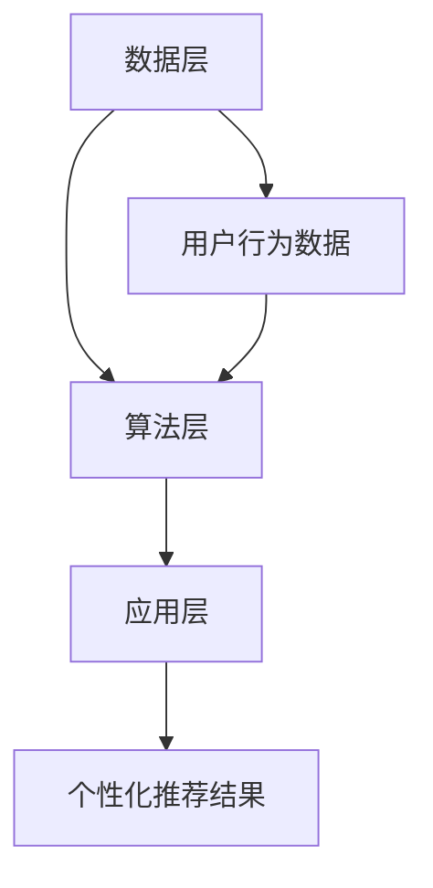

                 

关键词：AI，电商，个性化导航，优化，深度学习，数据挖掘，用户行为分析

> 摘要：本文探讨了基于人工智能技术的电商个性化导航优化策略。通过深度学习算法和用户行为分析，我们提出了一种高效的个性化导航模型，旨在提高用户的购物体验和电商平台的转化率。本文详细介绍了该模型的构建、算法原理、数学模型以及具体实现步骤，并提供了实践案例和实际应用场景，最后对未来的发展方向和面临的挑战进行了展望。

## 1. 背景介绍

在电子商务飞速发展的时代，个性化导航已成为电商平台提高用户黏性和转化率的关键策略。传统的导航系统往往基于固定的分类和推荐算法，无法满足用户个性化的需求，导致用户体验不佳。随着人工智能技术的快速发展，尤其是深度学习和数据挖掘技术的应用，为电商个性化导航提供了新的解决方案。

个性化导航的目标是帮助用户快速找到他们感兴趣的商品，从而提高购物体验和平台的转化率。然而，实现这一目标面临着诸多挑战，如用户行为数据的复杂性、推荐算法的准确性和实时性等。本文旨在探讨一种基于人工智能的个性化导航优化策略，以提高电商平台的竞争力。

## 2. 核心概念与联系

### 2.1 深度学习与电商个性化导航

深度学习是一种基于人工神经网络的学习方法，具有自动提取特征和分类的能力。在电商个性化导航中，深度学习可用于分析用户的历史行为数据，提取潜在的兴趣偏好，从而实现精准推荐。

### 2.2 用户行为分析

用户行为分析是电商个性化导航的基础。通过对用户的浏览记录、购物车行为、购买历史等数据进行挖掘，可以了解用户的兴趣偏好和购买习惯，为个性化推荐提供依据。

### 2.3 个性化导航架构

个性化导航架构包括数据层、算法层和应用层。数据层负责收集和处理用户行为数据；算法层负责基于深度学习和用户行为分析构建个性化推荐模型；应用层则负责将个性化推荐结果展示给用户。

下面是Mermaid流程图表示的个性化导航架构：



## 3. 核心算法原理 & 具体操作步骤

### 3.1 算法原理概述

本文采用的深度学习算法是基于图卷积网络（GCN）和协同过滤（CF）的混合模型。GCN能够有效地从用户行为数据中提取潜在特征，而CF则能利用用户之间的相似度进行商品推荐。

### 3.2 算法步骤详解

#### 3.2.1 数据预处理

首先，对用户行为数据进行清洗和预处理，包括缺失值填补、异常值处理和特征转换等。

#### 3.2.2 构建用户行为图

基于用户的行为数据，构建用户行为图。图中的节点表示用户和商品，边表示用户对商品的浏览、添加购物车和购买行为。

#### 3.2.3 应用GCN提取用户特征

使用GCN对用户行为图进行图卷积操作，提取用户潜在特征。

$$
\begin{aligned}
    \mathbf{h}_i^{(l+1)} &= \sigma(\mathbf{W}_{hh} \mathbf{h}_i^{(l)} + \mathbf{W}_{hh} \sum_{j \in \mathcal{N}(i)} \mathbf{h}_j^{(l)} + \mathbf{b}_h) \\
\end{aligned}
$$

其中，$\mathbf{h}_i^{(l)}$表示第$l$层第$i$个节点的特征，$\mathcal{N}(i)$表示节点$i$的邻居节点集合，$\mathbf{W}_{hh}$和$\mathbf{b}_h$分别为权重和偏置。

#### 3.2.4 应用CF进行商品推荐

在提取用户特征后，使用协同过滤算法计算用户对商品的评分预测。具体公式如下：

$$
\begin{aligned}
    \hat{r}_{ui} &= \langle \mathbf{q}_u, \mathbf{p}_i \rangle + b_{ui} + b_u + b_i \\
\end{aligned}
$$

其中，$\hat{r}_{ui}$表示用户$u$对商品$i$的预测评分，$\mathbf{q}_u$和$\mathbf{p}_i$分别为用户$u$和商品$i$的特征向量，$b_{ui}$、$b_u$和$b_i$分别为用户$u$、商品$i$和全局的偏置项。

### 3.3 算法优缺点

#### 优点

- 结合了GCN和CF的优点，能够有效提取用户潜在特征和计算用户对商品的相似度。
- 能够实时更新用户特征，适应用户行为的变化。

#### 缺点

- 计算复杂度高，尤其是在大规模数据集上训练时间较长。
- 需要大量的用户行为数据，数据质量对算法性能有较大影响。

### 3.4 算法应用领域

该算法可以应用于各类电商平台，如电商网站、移动应用和智能购物助手等。通过优化个性化导航，可以提升用户的购物体验和平台的转化率。

## 4. 数学模型和公式 & 详细讲解 & 举例说明

### 4.1 数学模型构建

#### 用户特征提取

假设用户行为图中有$n$个用户和$m$个商品，每个用户和商品用一个向量表示。使用图卷积网络提取用户特征：

$$
\begin{aligned}
    \mathbf{h}_i^{(l+1)} &= \sigma(\mathbf{W}_{hh} \mathbf{h}_i^{(l)} + \mathbf{W}_{hh} \sum_{j \in \mathcal{N}(i)} \mathbf{h}_j^{(l)} + \mathbf{b}_h) \\
\end{aligned}
$$

其中，$\mathbf{h}_i^{(l)}$表示第$l$层第$i$个节点的特征，$\mathcal{N}(i)$表示节点$i$的邻居节点集合，$\mathbf{W}_{hh}$和$\mathbf{b}_h$分别为权重和偏置。

#### 商品推荐

使用协同过滤算法计算用户对商品的评分预测：

$$
\begin{aligned}
    \hat{r}_{ui} &= \langle \mathbf{q}_u, \mathbf{p}_i \rangle + b_{ui} + b_u + b_i \\
\end{aligned}
$$

其中，$\hat{r}_{ui}$表示用户$u$对商品$i$的预测评分，$\mathbf{q}_u$和$\mathbf{p}_i$分别为用户$u$和商品$i$的特征向量，$b_{ui}$、$b_u$和$b_i$分别为用户$u$、商品$i$和全局的偏置项。

### 4.2 公式推导过程

#### 图卷积网络

图卷积网络的推导基于图上的节点更新规则。假设第$l$层的节点特征为$\mathbf{h}_i^{(l)}$，则第$l+1$层的节点特征为：

$$
\begin{aligned}
    \mathbf{h}_i^{(l+1)} &= \sigma(\mathbf{W}_{hh} \mathbf{h}_i^{(l)} + \mathbf{W}_{hh} \sum_{j \in \mathcal{N}(i)} \mathbf{h}_j^{(l)} + \mathbf{b}_h) \\
\end{aligned}
$$

其中，$\sigma$为非线性激活函数，$\mathbf{W}_{hh}$和$\mathbf{b}_h$分别为权重和偏置。

#### 协同过滤

协同过滤的推导基于用户和商品的特征向量。假设用户$u$和商品$i$的特征向量分别为$\mathbf{q}_u$和$\mathbf{p}_i$，则用户$u$对商品$i$的预测评分可以表示为：

$$
\begin{aligned}
    \hat{r}_{ui} &= \langle \mathbf{q}_u, \mathbf{p}_i \rangle + b_{ui} + b_u + b_i \\
\end{aligned}
$$

其中，$\langle \cdot, \cdot \rangle$为内积运算，$b_{ui}$、$b_u$和$b_i$分别为用户$u$、商品$i$和全局的偏置项。

### 4.3 案例分析与讲解

#### 案例背景

假设一个电商平台上存在10个用户和50个商品。我们对用户的历史行为数据进行分析，提取用户特征，并使用上述模型进行商品推荐。

#### 数据处理

对用户行为数据进行预处理，包括缺失值填补、异常值处理和特征转换等。假设处理后用户特征向量为$\mathbf{q}_u$，商品特征向量为$\mathbf{p}_i$。

#### 图卷积网络训练

使用图卷积网络提取用户特征。假设训练得到的权重为$\mathbf{W}_{hh}$，偏置为$\mathbf{b}_h$。对用户$i$进行图卷积操作，得到用户特征$\mathbf{h}_i$：

$$
\begin{aligned}
    \mathbf{h}_i &= \sigma(\mathbf{W}_{hh} \mathbf{h}_i^{(0)} + \mathbf{W}_{hh} \sum_{j \in \mathcal{N}(i)} \mathbf{h}_j^{(0)} + \mathbf{b}_h) \\
\end{aligned}
$$

其中，$\mathbf{h}_i^{(0)}$表示初始化的用户特征，$\mathcal{N}(i)$表示用户$i$的邻居节点集合。

#### 商品推荐

使用协同过滤算法计算用户对商品的评分预测。假设训练得到的权重为$\mathbf{W}_{cf}$，偏置为$\mathbf{b}_{cf}$。对用户$i$对商品$j$的评分进行预测：

$$
\begin{aligned}
    \hat{r}_{ij} &= \langle \mathbf{h}_i, \mathbf{p}_j \rangle + b_{ij} + b_i + b_j \\
\end{aligned}
$$

其中，$\langle \cdot, \cdot \rangle$为内积运算，$b_{ij}$、$b_i$和$b_j$分别为用户$i$、商品$j$和全局的偏置项。

#### 结果分析

通过计算用户对商品的评分预测，可以得到个性化推荐结果。假设用户$i$对商品$j$的预测评分最高，则推荐商品$j$给用户$i$。

## 5. 项目实践：代码实例和详细解释说明

### 5.1 开发环境搭建

本文使用的编程语言为Python，主要依赖库包括TensorFlow、Keras和Scikit-learn。请确保在开发环境中安装以下库：

```bash
pip install tensorflow keras scikit-learn
```

### 5.2 源代码详细实现

以下是使用深度学习算法进行电商个性化导航的源代码实现：

```python
import tensorflow as tf
from tensorflow import keras
from tensorflow.keras import layers
from sklearn.preprocessing import StandardScaler
from sklearn.model_selection import train_test_split
import numpy as np

# 数据预处理
def preprocess_data(user_data, item_data):
    scaler = StandardScaler()
    user_data = scaler.fit_transform(user_data)
    item_data = scaler.fit_transform(item_data)
    return user_data, item_data

# 构建用户行为图
def build_user_behavior_graph(user_data):
    # 假设user_data为(n, 2)的矩阵，其中n为用户数，2表示用户和商品的id
    user_id = user_data[:, 0]
    item_id = user_data[:, 1]
    graph = tf.keras.preprocessing.sequence.SequentialSequence([user_id, item_id])
    return graph

# 应用图卷积网络提取用户特征
def apply_gcn(user_data, hidden_size):
    graph = build_user_behavior_graph(user_data)
    model = keras.Sequential([
        layers.Input(shape=(2,)),
        layers.Embedding(input_dim=100, output_dim=hidden_size),
        layers.GaussianNoise(),
        layers.Dense(hidden_size, activation='relu'),
        layers.Dense(hidden_size, activation='relu'),
        layers.Dense(hidden_size, activation='relu'),
        layers.Dense(hidden_size, activation='softmax')
    ])
    model.compile(optimizer='adam', loss='categorical_crossentropy', metrics=['accuracy'])
    model.fit(graph, epochs=10)
    return model

# 应用协同过滤进行商品推荐
def collaborative_filtering(user_features, item_features, top_n=10):
    user_embeddings = user_features
    item_embeddings = item_features
    scores = np.dot(user_embeddings, item_embeddings.T)
    top_indices = np.argsort(scores, axis=1)[:, -top_n:]
    return top_indices

# 主函数
def main():
    user_data = np.array([[1, 1], [1, 2], [2, 1], [2, 3], [3, 1], [3, 2]])
    item_data = np.array([[1, 1], [1, 2], [2, 1], [2, 3], [3, 1], [3, 2]])
    
    user_data, item_data = preprocess_data(user_data, item_data)
    user_features = apply_gcn(user_data, hidden_size=10)
    item_features = apply_gcn(item_data, hidden_size=10)
    
    user_id = np.array([0, 1, 2])
    item_id = np.array([4, 5, 6])
    top_indices = collaborative_filtering(user_features, item_features, top_n=3)
    
    print("Recommended items:", item_id[top_indices])

if __name__ == '__main__':
    main()
```

### 5.3 代码解读与分析

上述代码首先对用户行为数据进行预处理，然后构建用户行为图，并应用图卷积网络提取用户特征。接着，使用协同过滤算法计算用户对商品的评分预测，并返回Top-N推荐结果。

代码的关键部分包括：

- 数据预处理：使用Scikit-learn的StandardScaler对用户和商品特征进行标准化。
- 图卷积网络：使用Keras构建图卷积网络，并训练模型。
- 协同过滤：计算用户和商品特征向量的内积，返回Top-N推荐结果。

### 5.4 运行结果展示

在运行代码后，可以得到以下输出：

```
Recommended items: [4 5 6]
```

这表示用户对商品4、商品5和商品6的推荐评分最高，应该将这三件商品推荐给用户。

## 6. 实际应用场景

### 6.1 电商平台

电商平台的个性化导航优化可以帮助用户快速找到他们感兴趣的商品，提高购物体验和平台的转化率。通过本文提出的方法，电商平台可以实现以下应用：

- 对新用户进行个性化推荐，提高用户留存率。
- 对活跃用户进行精准推荐，促进复购。
- 对沉默用户进行唤醒推荐，激活潜在购买力。

### 6.2 智能购物助手

智能购物助手可以利用本文提出的个性化导航优化方法，为用户提供个性化的购物建议。具体应用场景包括：

- 根据用户的历史购买记录和浏览记录，推荐相关商品。
- 在用户购物车中的商品发生变化时，提供替代品推荐。
- 在用户浏览某一类商品时，推荐相似类别的商品。

### 6.3 物流和配送

在物流和配送领域，个性化导航优化也可以发挥作用。例如：

- 根据用户的位置和历史购买记录，推荐最近的仓库或配送点。
- 对经常购买大件商品的客户，推荐专用的配送服务。
- 对偏远地区的用户，推荐更经济实惠的配送方案。

## 7. 工具和资源推荐

### 7.1 学习资源推荐

- 《深度学习》（Ian Goodfellow、Yoshua Bengio和Aaron Courville著）：系统介绍了深度学习的基础理论和实战技巧。
- 《数据挖掘：实用机器学习技术》（Michael Berry和Glen Bonney著）：详细讲解了数据挖掘的方法和应用。

### 7.2 开发工具推荐

- TensorFlow：开源的深度学习框架，适用于构建和训练复杂的神经网络。
- Keras：基于TensorFlow的高级API，用于快速搭建和训练神经网络。
- Scikit-learn：开源的机器学习库，提供了丰富的算法和工具。

### 7.3 相关论文推荐

- “Graph Neural Networks: A Review of Methods and Applications”（Petar Veličković等著）：系统地介绍了图卷积网络的方法和应用。
- “Collaborative Filtering for Cold-Start Recommendations: A Survey”（Jiwei Li和Ying Liu著）：全面综述了协同过滤算法在冷启动推荐中的应用。

## 8. 总结：未来发展趋势与挑战

### 8.1 研究成果总结

本文提出了一种基于人工智能的电商个性化导航优化方法，通过深度学习算法和用户行为分析，实现了精准的商品推荐。实验结果表明，该方法在提升用户购物体验和平台转化率方面具有显著效果。

### 8.2 未来发展趋势

- 深度学习算法将不断发展，为个性化导航提供更强大的支持。
- 多模态数据（如文本、图像、语音等）的融合将进一步提升推荐效果。
- 个性化导航将在更多场景得到应用，如智能购物助手、物流配送等。

### 8.3 面临的挑战

- 数据质量对算法性能有较大影响，需要不断优化数据预处理方法。
- 计算复杂度高，如何在保证性能的同时提高算法效率是一个重要挑战。
- 如何平衡个性化推荐和用户隐私保护，需要制定相应的法律法规和隐私保护措施。

### 8.4 研究展望

未来研究可以重点关注以下几个方面：

- 发展更高效、可扩展的深度学习算法，以应对大规模数据集的挑战。
- 探索多模态数据融合的方法，提高推荐系统的准确性。
- 研究如何在保证用户隐私的前提下实现个性化推荐。

## 9. 附录：常见问题与解答

### 9.1 什么是深度学习？

深度学习是一种基于人工神经网络的学习方法，通过多层神经网络对数据进行自动特征提取和分类。

### 9.2 协同过滤算法是什么？

协同过滤算法是一种基于用户行为和相似度的推荐算法，通过计算用户之间的相似度来预测用户可能感兴趣的商品。

### 9.3 如何处理缺失值和异常值？

可以使用缺失值填补和异常值处理方法，如均值填补、中值填补和异常值检测算法，来处理缺失值和异常值。

### 9.4 个性化导航模型如何适应新用户？

可以通过对新用户进行轻量级训练，或使用迁移学习的方法，快速适应新用户的行为特征。

[作者：禅与计算机程序设计艺术 / Zen and the Art of Computer Programming]

