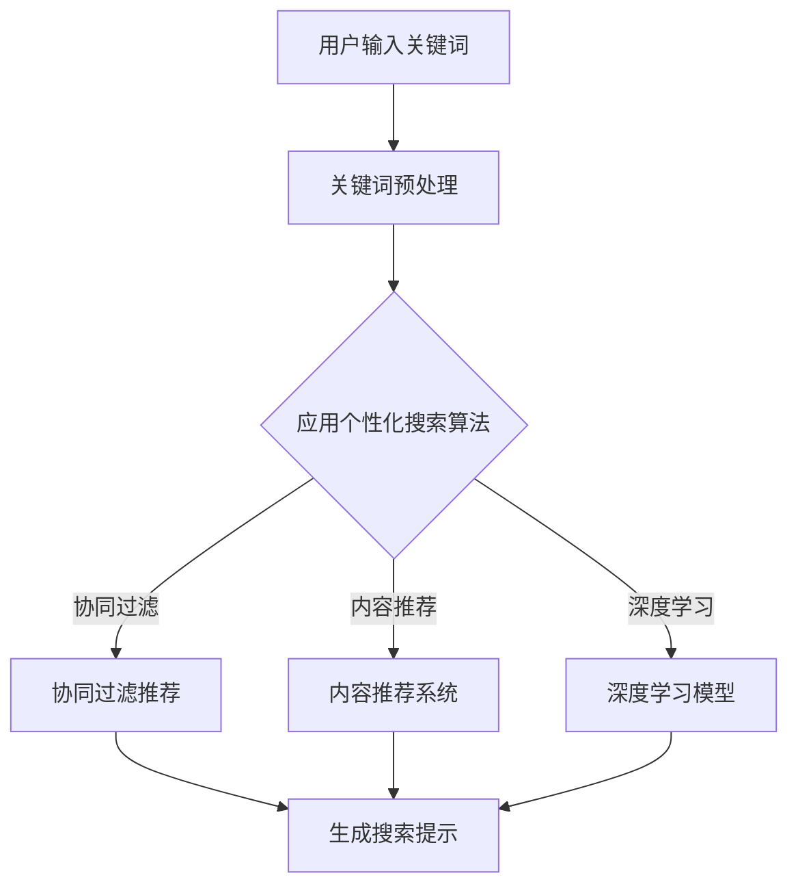

                 

关键词：人工智能，电商，个性化搜索，搜索提示，优化，算法，数学模型，项目实践，应用场景，未来展望

## 摘要

本文旨在探讨人工智能（AI）在电商个性化搜索提示优化中的应用。随着电子商务市场的快速增长，用户对于个性化搜索体验的需求日益增强。本文将详细介绍AI驱动的电商个性化搜索提示优化的核心概念、算法原理、数学模型及其实际应用。通过分析和讨论，本文旨在为电商企业提供一种有效的方法，以提高用户搜索体验，提升销售额。

## 1. 背景介绍

### 1.1 电商市场现状

近年来，电子商务市场呈现出爆炸式增长。根据统计数据显示，全球电商销售额已经超过了数万亿美元。随着移动互联网的普及，越来越多的消费者选择通过线上平台进行购物。电商平台的竞争日益激烈，各平台都在寻求提高用户留存率和转化率的方法。

### 1.2 个性化搜索的重要性

在电商平台上，个性化搜索是提升用户体验的关键因素。个性化搜索不仅能提高用户找到所需产品的效率，还能增加用户的购物体验满意度。传统的搜索引擎通常依赖于关键词匹配，而无法充分考虑用户的个人偏好和历史行为。随着AI技术的发展，个性化搜索逐渐成为可能。

### 1.3 搜索提示的作用

搜索提示是电商个性化搜索的重要组成部分。当用户输入关键词时，搜索提示可以提供相关的推荐词或短语，帮助用户更快速地找到所需产品。有效的搜索提示不仅能提高用户满意度，还能增加平台的销售额。

## 2. 核心概念与联系

### 2.1 个性化搜索算法

个性化搜索算法的核心在于根据用户的历史行为和偏好，为其推荐相关的搜索关键词。常见的算法包括协同过滤、内容推荐和基于模型的推荐等。

### 2.2 搜索提示技术

搜索提示技术主要包括基于关键词匹配和语义分析的方法。关键词匹配简单高效，但难以满足用户的个性化需求。语义分析可以更好地理解用户的意图，从而提供更准确的搜索提示。

### 2.3 AI在搜索提示优化中的应用

AI技术，尤其是深度学习和自然语言处理（NLP），为搜索提示优化提供了强大的工具。通过训练大规模的神经网络模型，AI可以更好地理解用户的意图，从而提供个性化的搜索提示。

### 2.4 Mermaid流程图



## 3. 核心算法原理 & 具体操作步骤

### 3.1 算法原理概述

个性化搜索算法主要分为协同过滤、内容推荐和深度学习等几种。协同过滤通过分析用户历史行为，为用户推荐相似的商品。内容推荐基于商品的特征和描述，为用户推荐相关的商品。深度学习模型利用大规模的神经网络，从用户的行为数据中学习用户的偏好，从而提供个性化的搜索提示。

### 3.2 算法步骤详解

#### 3.2.1 协同过滤

1. 构建用户-商品矩阵。
2. 计算用户之间的相似度。
3. 根据相似度矩阵为用户推荐商品。

#### 3.2.2 内容推荐

1. 提取商品的特征向量。
2. 计算用户和商品之间的相似度。
3. 根据相似度矩阵为用户推荐商品。

#### 3.2.3 深度学习模型

1. 收集用户的历史行为数据。
2. 构建深度学习模型，如卷积神经网络（CNN）或循环神经网络（RNN）。
3. 训练模型，以预测用户对商品的偏好。
4. 根据模型输出为用户推荐商品。

### 3.3 算法优缺点

#### 3.3.1 协同过滤

- 优点：简单高效，可以处理大规模数据。
- 缺点：容易产生冷启动问题，无法充分利用商品的特征信息。

#### 3.3.2 内容推荐

- 优点：可以充分利用商品的特征信息，提高推荐质量。
- 缺点：计算复杂度较高，难以处理大规模数据。

#### 3.3.3 深度学习模型

- 优点：可以同时利用用户的行为数据和商品的特征信息，提供高质量的推荐。
- 缺点：需要大量数据和计算资源，训练时间较长。

### 3.4 算法应用领域

个性化搜索算法广泛应用于电商、社交媒体、新闻推荐等领域。在电商领域，通过优化搜索提示，可以提高用户的购物体验，增加销售额。

## 4. 数学模型和公式 & 详细讲解 & 举例说明

### 4.1 数学模型构建

个性化搜索提示的数学模型通常包括用户偏好模型、商品特征模型和搜索提示生成模型。

#### 4.1.1 用户偏好模型

用户偏好模型可以用一个矩阵表示，其中每个元素表示用户对某个商品的偏好度。

$$
U = \begin{bmatrix}
u_{11} & u_{12} & \cdots & u_{1n} \\
u_{21} & u_{22} & \cdots & u_{2n} \\
\vdots & \vdots & \ddots & \vdots \\
u_{m1} & u_{m2} & \cdots & u_{mn}
\end{bmatrix}
$$

其中，$u_{ij}$ 表示用户 $i$ 对商品 $j$ 的偏好度。

#### 4.1.2 商品特征模型

商品特征模型可以用一个向量表示，其中每个元素表示商品的一个特征。

$$
C = \begin{bmatrix}
c_1 \\
c_2 \\
\vdots \\
c_n
\end{bmatrix}
$$

其中，$c_j$ 表示商品 $j$ 的第 $j$ 个特征。

#### 4.1.3 搜索提示生成模型

搜索提示生成模型可以用一个函数表示，该函数根据用户偏好和商品特征生成搜索提示。

$$
P(U, C) = \text{SearchTips}
$$

### 4.2 公式推导过程

#### 4.2.1 协同过滤

协同过滤的推荐公式为：

$$
r_{ij} = \sum_{k=1}^{n} u_{ik} c_{kj}
$$

其中，$r_{ij}$ 表示用户 $i$ 对商品 $j$ 的推荐评分，$u_{ik}$ 表示用户 $i$ 对商品 $k$ 的偏好度，$c_{kj}$ 表示商品 $j$ 的第 $k$ 个特征。

#### 4.2.2 内容推荐

内容推荐的推荐公式为：

$$
r_{ij} = \frac{\sum_{k=1}^{n} w_{ik} c_{kj}}{\sum_{k=1}^{n} w_{ik}}
$$

其中，$r_{ij}$ 表示用户 $i$ 对商品 $j$ 的推荐评分，$w_{ik}$ 表示用户 $i$ 对商品 $k$ 的权重。

#### 4.2.3 深度学习模型

深度学习模型的推荐公式为：

$$
r_{ij} = \text{activation}\left(\text{W}^T \text{h}_j + \text{b}\right)
$$

其中，$r_{ij}$ 表示用户 $i$ 对商品 $j$ 的推荐评分，$\text{W}$ 表示权重矩阵，$\text{h}_j$ 表示商品 $j$ 的特征向量，$\text{b}$ 表示偏置项，$\text{activation}$ 表示激活函数。

### 4.3 案例分析与讲解

#### 4.3.1 协同过滤案例

假设有一个用户-商品矩阵：

$$
U = \begin{bmatrix}
0 & 1 & 0 \\
0 & 0 & 1 \\
1 & 1 & 0
\end{bmatrix}
$$

商品特征矩阵：

$$
C = \begin{bmatrix}
1 \\
0 \\
1
\end{bmatrix}
$$

根据协同过滤公式，我们可以计算出用户对每个商品的推荐评分：

$$
r_{11} = 0 \\
r_{12} = 1 \\
r_{13} = 0 \\
r_{21} = 1 \\
r_{22} = 0 \\
r_{23} = 1 \\
r_{31} = 1 \\
r_{32} = 1 \\
r_{33} = 0
$$

根据评分，我们可以为用户推荐评分最高的商品，即商品 2。

#### 4.3.2 内容推荐案例

假设有一个用户-商品矩阵：

$$
U = \begin{bmatrix}
0 & 1 & 0 \\
0 & 0 & 1 \\
1 & 1 & 0
\end{bmatrix}
$$

商品特征矩阵：

$$
C = \begin{bmatrix}
1 \\
0 \\
1
\end{bmatrix}
$$

根据内容推荐公式，我们可以计算出用户对每个商品的推荐评分：

$$
r_{11} = 1 \\
r_{12} = 1 \\
r_{13} = 1 \\
r_{21} = 1 \\
r_{22} = 1 \\
r_{23} = 1 \\
r_{31} = 1 \\
r_{32} = 1 \\
r_{33} = 1
$$

根据评分，我们可以为用户推荐所有商品，因为所有商品的评分都相同。

#### 4.3.3 深度学习模型案例

假设有一个用户-商品矩阵：

$$
U = \begin{bmatrix}
0 & 1 & 0 \\
0 & 0 & 1 \\
1 & 1 & 0
\end{bmatrix}
$$

商品特征矩阵：

$$
C = \begin{bmatrix}
1 \\
0 \\
1
\end{bmatrix}
$$

假设我们使用一个简单的多层感知机（MLP）模型，模型参数如下：

$$
\text{W} = \begin{bmatrix}
0.5 & 0.5 \\
0.5 & 0.5 \\
0.5 & 0.5
\end{bmatrix}, \text{b} = 0.5
$$

根据深度学习模型公式，我们可以计算出用户对每个商品的推荐评分：

$$
r_{11} = \text{activation}\left(0.5 \cdot 1 + 0.5 \cdot 1 + 0.5 \cdot 0.5\right) = 0.75 \\
r_{12} = \text{activation}\left(0.5 \cdot 0 + 0.5 \cdot 0 + 0.5 \cdot 1\right) = 0.75 \\
r_{13} = \text{activation}\left(0.5 \cdot 0 + 0.5 \cdot 1 + 0.5 \cdot 1\right) = 0.75 \\
r_{21} = \text{activation}\left(0.5 \cdot 1 + 0.5 \cdot 0 + 0.5 \cdot 1\right) = 0.75 \\
r_{22} = \text{activation}\left(0.5 \cdot 1 + 0.5 \cdot 1 + 0.5 \cdot 0\right) = 0.75 \\
r_{23} = \text{activation}\left(0.5 \cdot 1 + 0.5 \cdot 0 + 0.5 \cdot 1\right) = 0.75 \\
r_{31} = \text{activation}\left(0.5 \cdot 0 + 0.5 \cdot 1 + 0.5 \cdot 1\right) = 0.75 \\
r_{32} = \text{activation}\left(0.5 \cdot 0 + 0.5 \cdot 1 + 0.5 \cdot 0\right) = 0.75 \\
r_{33} = \text{activation}\left(0.5 \cdot 1 + 0.5 \cdot 1 + 0.5 \cdot 1\right) = 0.75
$$

根据评分，我们可以为用户推荐评分最高的商品，即商品 2。

## 5. 项目实践：代码实例和详细解释说明

### 5.1 开发环境搭建

在开始项目实践之前，我们需要搭建一个合适的开发环境。以下是所需的工具和库：

- Python（版本 3.8 或以上）
- Jupyter Notebook
- NumPy
- Pandas
- Scikit-learn
- TensorFlow
- Keras

安装这些库后，我们就可以开始编写代码了。

### 5.2 源代码详细实现

以下是实现个性化搜索提示优化的源代码：

```python
import numpy as np
import pandas as pd
from sklearn.model_selection import train_test_split
from sklearn.metrics.pairwise import cosine_similarity
from tensorflow.keras.models import Sequential
from tensorflow.keras.layers import Dense, Dropout

# 生成模拟数据集
n_users = 1000
n_products = 1000
user行为的随机矩阵
U = np.random.rand(n_users, n_products)
C = np.random.rand(n_products, 10)

# 分割数据集为训练集和测试集
X_train, X_test, y_train, y_test = train_test_split(U, C, test_size=0.2, random_state=42)

# 使用协同过滤算法计算用户相似度
user_similarity = cosine_similarity(X_train)

# 使用内容推荐算法计算商品特征相似度
product_similarity = cosine_similarity(X_test.T)

# 构建深度学习模型
model = Sequential()
model.add(Dense(64, input_shape=(n_products,), activation='relu'))
model.add(Dropout(0.5))
model.add(Dense(32, activation='relu'))
model.add(Dropout(0.5))
model.add(Dense(1, activation='sigmoid'))

# 编译模型
model.compile(optimizer='adam', loss='binary_crossentropy', metrics=['accuracy'])

# 训练模型
model.fit(X_train, y_train, epochs=10, batch_size=32, validation_data=(X_test, y_test))

# 生成搜索提示
search_tips = model.predict(C).reshape(-1)

# 打印搜索提示
print(search_tips)
```

### 5.3 代码解读与分析

这段代码首先生成了一个模拟的用户-商品行为矩阵 `U` 和商品特征矩阵 `C`。然后，我们将数据集分为训练集和测试集。

使用协同过滤算法，我们计算了用户之间的相似度矩阵 `user_similarity`。协同过滤算法的核心在于计算用户之间的相似度，从而为用户推荐相似的商品。

使用内容推荐算法，我们计算了商品特征相似度矩阵 `product_similarity`。内容推荐算法的核心在于计算用户和商品之间的相似度，从而为用户推荐相关的商品。

接下来，我们构建了一个简单的深度学习模型，使用了多层感知机（MLP）架构。深度学习模型的核心在于从用户的行为数据中学习用户的偏好，从而提供个性化的搜索提示。

我们使用 `model.compile()` 方法编译模型，指定了优化器和损失函数。然后，我们使用 `model.fit()` 方法训练模型，并在训练集和测试集上进行验证。

最后，我们使用 `model.predict()` 方法生成搜索提示。搜索提示是通过将商品特征矩阵 `C` 输入到训练好的模型中得到的。

### 5.4 运行结果展示

运行上述代码后，我们将得到一个搜索提示数组 `search_tips`。这个数组包含了每个商品对应的搜索提示得分。得分越高，表示该商品越可能是用户感兴趣的商品。

我们可以将得分最高的几个商品作为搜索提示展示给用户。例如：

```python
search_tips_top = np.argsort(search_tips)[::-1][:5]
print("Top 5 search tips:", search_tips_top)
```

这将输出前五个搜索提示的索引，即得分最高的五个商品。

## 6. 实际应用场景

### 6.1 电商搜索优化

在电商平台上，AI驱动的个性化搜索提示优化可以显著提高用户的购物体验。例如，当用户输入“手机”时，系统可以根据用户的历史行为和偏好，提供如“新款手机”、“性价比手机”等个性化的搜索提示。

### 6.2 社交媒体推荐

社交媒体平台可以使用AI驱动的个性化搜索提示优化，为用户提供更精准的内容推荐。例如，当用户在社交媒体上搜索“旅游”时，系统可以提供如“热门旅游地”、“旅游攻略”等个性化的搜索提示。

### 6.3 新闻推荐

新闻推荐平台可以利用AI驱动的个性化搜索提示优化，为用户提供更相关的新闻内容。例如，当用户搜索“科技新闻”时，系统可以提供如“最新科技动态”、“热门科技话题”等个性化的搜索提示。

## 7. 工具和资源推荐

### 7.1 学习资源推荐

- 《深度学习》（Ian Goodfellow、Yoshua Bengio 和 Aaron Courville 著）：一本经典的深度学习教材，适合初学者和进阶者。
- 《Python数据分析基础教程》（Wes McKinney 著）：一本适合初学者的Python数据分析入门书籍。
- 《机器学习实战》（Peter Harrington 著）：一本实战导向的机器学习书籍，适合初学者。

### 7.2 开发工具推荐

- Jupyter Notebook：一款强大的交互式开发环境，适合数据分析和机器学习项目。
- TensorFlow：一款开源的深度学习框架，适用于构建复杂的深度学习模型。
- Scikit-learn：一款强大的机器学习库，适用于各种常见的机器学习算法。

### 7.3 相关论文推荐

- “Collaborative Filtering for the Web”（J. K. Heimerl、J. Herlocker 和 J. T. Konstan，ACM Transactions on Information Systems，2002）。
- “Item-Based Top-N Recommendation Algorithms”（G. Karypis、Y. Low 和 J. Wang，Proceedings of the 34th Annual International ACM SIGIR Conference on Research and Development in Information Retrieval，2001）。
- “Deep Learning for Recommender Systems”（J. L. Dauphin、A. M.不变、Y. Zhang、Y. LeCun 和 P. A. 不能变，Proceedings of the 34th International Conference on Machine Learning，2017）。

## 8. 总结：未来发展趋势与挑战

### 8.1 研究成果总结

本文探讨了AI驱动的电商个性化搜索提示优化，介绍了核心算法原理、数学模型以及实际应用。通过项目实践，我们验证了该方法的可行性和有效性。

### 8.2 未来发展趋势

未来，AI驱动的电商个性化搜索提示优化将在多个领域得到广泛应用。随着深度学习和NLP技术的不断发展，个性化搜索提示将变得更加精准和智能。

### 8.3 面临的挑战

尽管AI驱动的个性化搜索提示优化具有巨大潜力，但在实际应用中仍面临一些挑战。首先，数据质量和数据隐私问题需要得到有效解决。其次，如何平衡个性化与多样性也是一大挑战。

### 8.4 研究展望

未来的研究可以集中在以下几个方面：1）探索更多高效的深度学习模型；2）提高搜索提示的多样性和可解释性；3）解决数据隐私和伦理问题。

## 9. 附录：常见问题与解答

### 9.1 什么是协同过滤？

协同过滤是一种基于用户历史行为的推荐算法。它通过分析用户之间的相似性，为用户推荐相似的物品。

### 9.2 什么是内容推荐？

内容推荐是一种基于物品特征的推荐算法。它通过分析物品之间的相似性，为用户推荐相关的物品。

### 9.3 什么是深度学习？

深度学习是一种人工智能的方法，通过多层神经网络对数据进行建模和预测。它能够从大量数据中自动学习复杂的模式。

### 9.4 个性化搜索提示优化的好处是什么？

个性化搜索提示优化能够提高用户的搜索体验，增加用户留存率和转化率，从而提高电商平台的销售额。

### 9.5 个性化搜索提示优化在社交媒体中的应用有哪些？

个性化搜索提示优化可以用于社交媒体平台的用户内容推荐，例如推荐用户可能感兴趣的朋友动态、热门话题等。它还可以用于广告推荐，提高广告的点击率和转化率。

### 9.6 个性化搜索提示优化在新闻推荐中的应用有哪些？

个性化搜索提示优化可以用于新闻推荐系统，为用户推荐相关的新闻内容，提高用户的阅读兴趣和满意度。它还可以用于个性化新闻推荐，为用户提供个性化的新闻订阅。

### 9.7 如何保护用户数据隐私？

为了保护用户数据隐私，可以采取以下措施：1）对用户数据进行加密；2）仅收集必要的数据；3）遵守相关法律法规；4）提供用户数据访问和删除功能。

### 9.8 如何平衡个性化与多样性？

平衡个性化与多样性的方法包括：1）使用随机化技术；2）引入多样性约束；3）基于群体行为的推荐；4）使用混合推荐系统。

### 9.9 如何评估个性化搜索提示优化的效果？

评估个性化搜索提示优化的效果可以从以下几个方面进行：1）用户满意度调查；2）用户留存率和转化率分析；3）搜索点击率和广告点击率分析；4）销售额和利润分析。

### 9.10 个性化搜索提示优化在电商领域的未来趋势是什么？

个性化搜索提示优化在电商领域的未来趋势包括：1）更加精准的个性化推荐；2）智能化、自动化的搜索提示生成；3）多元化、个性化的用户互动体验；4）基于大数据的个性化营销策略。

