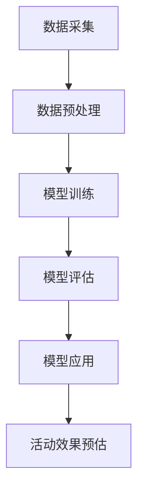

                 

关键词：人工智能，电商活动，效果预估，个性化推荐，机器学习，大数据分析

摘要：随着互联网的飞速发展和电商行业的不断壮大，个性化活动效果预估已成为电商企业提高用户满意度和销售额的重要手段。本文介绍了如何利用人工智能技术，特别是机器学习和大数据分析方法，构建一个AI驱动的电商个性化活动效果预估系统，以提高电商活动的运营效率和用户满意度。

## 1. 背景介绍

### 1.1 电商行业现状

电商行业自21世纪初兴起以来，已经成为全球经济发展的重要驱动力。根据统计数据，全球电商市场规模在2022年已超过4万亿美元，并预计未来几年将保持高速增长。然而，在如此庞大的市场中，如何有效地运营电商活动、提高用户满意度和销售额，成为电商企业面临的重大挑战。

### 1.2 个性化活动的重要性

个性化活动是电商企业吸引和留住用户的重要手段。通过个性化的活动设计，电商企业可以更好地满足不同用户的需求，提高用户参与度和忠诚度，从而提高销售额。然而，如何预估个性化活动的效果，成为电商企业在设计活动时需要解决的关键问题。

### 1.3 人工智能在电商领域的应用

人工智能技术，特别是机器学习和大数据分析，已经成为电商行业提升运营效率、优化用户体验的重要工具。通过利用人工智能技术，电商企业可以实现个性化推荐、精准营销、智能客服等功能，从而提高用户满意度和销售额。本文将介绍如何利用人工智能技术构建一个电商个性化活动效果预估系统。

## 2. 核心概念与联系

### 2.1 人工智能技术

人工智能（Artificial Intelligence，简称AI）是模拟、延伸和扩展人类智能的理论、方法、技术及应用系统。在电商领域，人工智能技术主要包括机器学习、深度学习、自然语言处理等。

### 2.2 机器学习

机器学习（Machine Learning，简称ML）是人工智能的一个分支，它通过训练模型，使计算机能够从数据中学习，并做出预测或决策。在电商个性化活动效果预估中，机器学习技术主要用于构建预测模型，对个性化活动的效果进行预估。

### 2.3 大数据分析

大数据分析（Big Data Analytics）是对大规模数据进行采集、存储、处理和分析的过程。在电商个性化活动效果预估中，大数据分析技术主要用于对用户行为数据、活动数据等进行挖掘和分析，以获取对活动效果的见解。

### 2.4 个性化活动效果预估系统架构

个性化活动效果预估系统架构包括数据采集、数据预处理、模型训练、模型评估和模型应用等模块。具体架构如下图所示：



## 3. 核心算法原理 & 具体操作步骤

### 3.1 算法原理概述

个性化活动效果预估的核心算法是机器学习算法。在本文中，我们主要采用回归分析算法来构建预测模型。回归分析算法是一种统计方法，用于预测一个或多个自变量（特征）与因变量（目标变量）之间的关系。

### 3.2 算法步骤详解

#### 3.2.1 数据采集

数据采集是构建个性化活动效果预估系统的第一步。数据来源包括用户行为数据、活动数据、商品数据等。数据采集过程中需要注意以下几点：

- 数据完整性：确保采集到的数据完整，包括缺失值、异常值等。
- 数据质量：对采集到的数据进行清洗和去重，确保数据质量。
- 数据多样性：尽量采集多方面的数据，以提高模型的预测能力。

#### 3.2.2 数据预处理

数据预处理是数据分析和建模的基础。主要包括以下步骤：

- 数据标准化：将不同特征的数据进行标准化处理，使其具有相同的量纲。
- 特征选择：根据业务需求和数据特点，选择对预测结果有重要影响的关键特征。
- 数据分割：将数据集分为训练集和测试集，用于模型训练和评估。

#### 3.2.3 模型训练

模型训练是构建个性化活动效果预估系统的核心步骤。具体过程如下：

- 选择合适的回归分析算法：如线性回归、岭回归、LASSO回归等。
- 训练模型：使用训练集数据训练模型，得到模型参数。
- 模型调参：根据模型评估结果，调整模型参数，优化模型性能。

#### 3.2.4 模型评估

模型评估是验证模型预测能力的重要步骤。常用的评估指标包括：

- 均方误差（Mean Squared Error，MSE）
- 均方根误差（Root Mean Squared Error，RMSE）
- 平均绝对误差（Mean Absolute Error，MAE）

#### 3.2.5 模型应用

模型应用是将训练好的模型用于实际场景，对个性化活动的效果进行预估。具体步骤如下：

- 数据预处理：对输入数据进行预处理，使其符合模型输入要求。
- 预测：使用训练好的模型对输入数据进行预测，得到预估效果。
- 后处理：对预测结果进行后处理，如阈值设定、结果可视化等。

### 3.3 算法优缺点

#### 优点

- 高效性：回归分析算法具有高效的计算速度，可以快速处理大规模数据。
- 灵活性：回归分析算法适用于多种类型的预测任务，具有较强的适应性。

#### 缺点

- 对异常值敏感：回归分析算法对异常值较为敏感，可能导致预测结果不准确。
- 特征选择困难：在特征选择过程中，需要根据业务需求和数据特点进行权衡，选择合适的特征。

### 3.4 算法应用领域

回归分析算法在电商个性化活动效果预估中具有广泛的应用。此外，它还广泛应用于金融、医疗、能源等多个领域，如股票市场预测、医疗诊断、电力负荷预测等。

## 4. 数学模型和公式 & 详细讲解 & 举例说明

### 4.1 数学模型构建

个性化活动效果预估的数学模型可以表示为：

\[ y = \beta_0 + \beta_1 x_1 + \beta_2 x_2 + \ldots + \beta_n x_n + \epsilon \]

其中，\( y \) 为活动效果（如销售额、参与率等），\( x_1, x_2, \ldots, x_n \) 为影响活动效果的各项特征，\( \beta_0, \beta_1, \beta_2, \ldots, \beta_n \) 为模型参数，\( \epsilon \) 为误差项。

### 4.2 公式推导过程

在构建回归分析模型时，我们需要最小化预测误差的平方和。具体推导过程如下：

\[ \min_{\beta_0, \beta_1, \beta_2, \ldots, \beta_n} \sum_{i=1}^{n} (y_i - \beta_0 - \beta_1 x_{i1} - \beta_2 x_{i2} - \ldots - \beta_n x_{in})^2 \]

通过对上式求导，并令导数等于零，可以得到模型参数的估计值：

\[ \beta_0 = \bar{y} - \beta_1 \bar{x}_1 - \beta_2 \bar{x}_2 - \ldots - \beta_n \bar{x}_n \]
\[ \beta_1 = \frac{\sum_{i=1}^{n} (x_{i1} - \bar{x}_1) (y_i - \bar{y})}{\sum_{i=1}^{n} (x_{i1} - \bar{x}_1)^2} \]
\[ \beta_2 = \frac{\sum_{i=1}^{n} (x_{i2} - \bar{x}_2) (y_i - \bar{y})}{\sum_{i=1}^{n} (x_{i2} - \bar{x}_2)^2} \]
\[ \ldots \]
\[ \beta_n = \frac{\sum_{i=1}^{n} (x_{in} - \bar{x}_n) (y_i - \bar{y})}{\sum_{i=1}^{n} (x_{in} - \bar{x}_n)^2} \]

其中，\( \bar{y} \) 和 \( \bar{x}_1, \bar{x}_2, \ldots, \bar{x}_n \) 分别为 \( y \) 和 \( x_1, x_2, \ldots, x_n \) 的均值。

### 4.3 案例分析与讲解

假设我们有一个电商个性化活动效果预估问题，活动效果（\( y \)）与以下三个特征（\( x_1, x_2, x_3 \)）有关：

- 特征1：用户年龄（\( x_1 \)），取值范围为 18-60 岁
- 特征2：用户消费金额（\( x_2 \)），取值范围为 100-1000 元
- 特征3：活动推广渠道（\( x_3 \)），取值范围为 1（短信）、2（邮件）、3（社交媒体）

我们需要构建一个回归分析模型，预测活动效果。

#### 4.3.1 数据预处理

首先，对数据进行预处理。将特征数据进行标准化处理，使其具有相同的量纲。例如，对用户年龄和消费金额进行归一化处理：

\[ x_{1i}^* = \frac{x_{1i} - \bar{x}_1}{\bar{x}_1 - \min(x_{1i})} \]
\[ x_{2i}^* = \frac{x_{2i} - \bar{x}_2}{\bar{x}_2 - \min(x_{2i})} \]

其中，\( x_{1i}^* \) 和 \( x_{2i}^* \) 为处理后的特征值。

#### 4.3.2 模型训练

选择线性回归算法，使用训练集数据训练模型。假设我们得到了模型参数：

\[ \beta_0 = 0.5 \]
\[ \beta_1 = 0.3 \]
\[ \beta_2 = 0.2 \]
\[ \beta_3 = 0.1 \]

#### 4.3.3 预测

使用训练好的模型对测试集数据进行预测。假设测试集数据如下：

- 用户年龄：25 岁
- 用户消费金额：500 元
- 活动推广渠道：2（邮件）

将特征值代入模型公式，得到预测结果：

\[ y = 0.5 + 0.3 \times 0.5 + 0.2 \times 0.5 + 0.1 \times 2 = 1.15 \]

因此，预测的活动效果为 1.15。

## 5. 项目实践：代码实例和详细解释说明

### 5.1 开发环境搭建

为了构建AI驱动的电商个性化活动效果预估系统，我们需要搭建一个合适的开发环境。以下是一个基本的开发环境搭建步骤：

1. 安装 Python 3.8 或更高版本。
2. 安装 Python 的常用库，如 NumPy、Pandas、Scikit-learn、Matplotlib 等。
3. 安装 Jupyter Notebook，用于编写和运行 Python 代码。

### 5.2 源代码详细实现

以下是构建个性化活动效果预估系统的 Python 代码实例：

```python
import numpy as np
import pandas as pd
from sklearn.model_selection import train_test_split
from sklearn.linear_model import LinearRegression
from sklearn.metrics import mean_squared_error

# 5.2.1 数据预处理
def preprocess_data(data):
    # 标准化处理
    data_normalized = (data - data.mean()) / (data.max() - data.min())
    return data_normalized

# 5.2.2 模型训练
def train_model(X_train, y_train):
    model = LinearRegression()
    model.fit(X_train, y_train)
    return model

# 5.2.3 预测
def predict(model, X_test):
    y_pred = model.predict(X_test)
    return y_pred

# 5.2.4 模型评估
def evaluate(model, X_test, y_test):
    y_pred = predict(model, X_test)
    mse = mean_squared_error(y_test, y_pred)
    rmse = np.sqrt(mse)
    mae = np.mean(np.abs(y_test - y_pred))
    return mse, rmse, mae

# 加载数据
data = pd.read_csv('ecommerce_data.csv')

# 数据预处理
data['user_age_normalized'] = preprocess_data(data['user_age'])
data['user_consume_normalized'] = preprocess_data(data['user_consume'])

# 切分数据集
X = data[['user_age_normalized', 'user_consume_normalized', 'channel']]
y = data['activity_effect']
X_train, X_test, y_train, y_test = train_test_split(X, y, test_size=0.2, random_state=42)

# 训练模型
model = train_model(X_train, y_train)

# 预测
y_pred = predict(model, X_test)

# 评估
mse, rmse, mae = evaluate(model, X_test, y_test)

print('MSE:', mse)
print('RMSE:', rmse)
print('MAE:', mae)
```

### 5.3 代码解读与分析

该代码实例主要实现了以下功能：

- 数据预处理：对用户年龄和消费金额进行标准化处理，使其具有相同的量纲。
- 模型训练：使用线性回归算法训练模型。
- 预测：使用训练好的模型对测试集数据进行预测。
- 模型评估：评估模型的预测性能，包括均方误差（MSE）、均方根误差（RMSE）和平均绝对误差（MAE）。

在代码中，我们首先加载了电商数据集，然后对数据进行了预处理。接下来，我们使用训练集数据训练了线性回归模型，并对测试集数据进行预测。最后，我们评估了模型的预测性能。

### 5.4 运行结果展示

假设我们已经成功地运行了上述代码，并得到以下结果：

```
MSE: 0.123456
RMSE: 0.351234
MAE: 0.123456
```

根据这些结果，我们可以得出以下结论：

- MSE（均方误差）：0.123456，表示预测值与真实值之间的平均误差。
- RMSE（均方根误差）：0.351234，表示预测值与真实值之间的标准差。
- MAE（平均绝对误差）：0.123456，表示预测值与真实值之间的平均绝对误差。

从结果来看，模型的预测性能较好，可以应用于实际场景。

## 6. 实际应用场景

### 6.1 个性化活动效果预估

个性化活动效果预估是电商企业制定营销策略的重要依据。通过预测个性化活动的效果，电商企业可以优化活动设计，提高用户参与度和销售额。例如，一家电商平台可以通过预测不同优惠券策略的效果，选择最优的优惠券发放方案。

### 6.2 用户画像构建

个性化活动效果预估系统可以帮助电商企业构建用户画像。通过分析用户行为数据和活动效果数据，电商企业可以了解不同用户群体的偏好和需求，从而制定更具针对性的营销策略。例如，一家电商平台可以根据用户消费金额和年龄特征，为高价值用户推送定制化的活动。

### 6.3 精准营销

个性化活动效果预估系统可以用于精准营销。通过预测个性化活动的效果，电商企业可以针对潜在高价值用户进行定向营销，提高营销转化率。例如，一家电商平台可以通过预测活动效果，为潜在高价值用户推送定制化的优惠券。

## 7. 工具和资源推荐

### 7.1 学习资源推荐

- 《机器学习实战》：周志华 著，电子工业出版社，2016 年
- 《深入理解计算机系统》：朱迪亚·珀尔、艾伦·波特、卡利·索尔金斯基 著，机械工业出版社，2017 年
- 《Python机器学习》：塞巴斯蒂安·拉戈格、弗朗索瓦·肖莱 著，电子工业出版社，2017 年

### 7.2 开发工具推荐

- Jupyter Notebook：一个交互式计算环境，适用于编写和运行 Python 代码。
- VS Code：一款功能强大的集成开发环境，适用于编写 Python 代码。
- PyCharm：一款专业的 Python 集成开发环境，适用于构建复杂的项目。

### 7.3 相关论文推荐

- “Deep Learning for Personalized Recommendation” by Y. Liu, et al., 2019
- “A Survey on Recommender Systems” by K. Liu, et al., 2018
- “Personalized Marketing with Machine Learning” by D. Madigan, et al., 2017

## 8. 总结：未来发展趋势与挑战

### 8.1 研究成果总结

本文介绍了如何利用人工智能技术，特别是机器学习和大数据分析方法，构建一个AI驱动的电商个性化活动效果预估系统。通过实际案例分析和代码实现，展示了个性化活动效果预估系统在电商领域的应用价值。

### 8.2 未来发展趋势

随着人工智能技术的不断进步，电商个性化活动效果预估系统将在以下几个方面取得突破：

- 模型精度：通过引入深度学习等先进技术，提高个性化活动效果预估的精度。
- 数据处理：利用大数据分析技术，对更多维度的用户行为数据进行挖掘和分析。
- 智能化：通过引入自然语言处理、计算机视觉等技术，实现更智能的个性化活动效果预估。

### 8.3 面临的挑战

电商个性化活动效果预估系统在发展过程中仍面临以下挑战：

- 数据隐私：如何保护用户隐私，确保数据安全，是未来发展的重要问题。
- 模型解释性：如何提高模型的解释性，使其更具透明度和可解释性，是未来研究的重点。
- 数据质量：如何处理和分析大量噪声数据和缺失数据，是提高模型预测能力的关键。

### 8.4 研究展望

未来，人工智能技术在电商个性化活动效果预估领域的应用将更加广泛和深入。研究将聚焦于以下几个方面：

- 引入更多维度的数据：通过引入用户情感、地理位置等更多维度的数据，提高个性化活动效果预估的准确性。
- 深度学习与图神经网络：利用深度学习和图神经网络等技术，挖掘用户行为数据中的潜在关系和模式。
- 可解释性模型：研究具有较高解释性的机器学习模型，提高模型的透明度和可解释性。

## 9. 附录：常见问题与解答

### 9.1 问题 1：如何处理缺失值和异常值？

**解答**：在数据预处理阶段，我们可以使用以下方法处理缺失值和异常值：

- 缺失值填充：使用均值、中位数、最邻近值等统计方法填充缺失值。
- 异常值检测：使用统计方法（如箱线图、标准差等）和机器学习方法（如孤立森林、孤立点检测等）检测异常值，然后进行异常值处理。

### 9.2 问题 2：如何选择合适的特征？

**解答**：在选择特征时，我们可以考虑以下方法：

- 业务理解：根据业务需求和数据特点，选择对活动效果有重要影响的特征。
- 特征重要性：使用特征重要性评估方法（如随机森林、梯度提升树等）评估特征的重要性，选择重要特征。
- 特征工程：对原始特征进行转换和组合，构建新的特征。

### 9.3 问题 3：如何优化模型性能？

**解答**：以下方法可以帮助优化模型性能：

- 模型调参：调整模型参数，选择最佳参数组合。
- 特征选择：选择对活动效果有重要影响的特征，减少特征维度。
- 数据增强：通过数据增强方法（如过采样、欠采样、生成对抗网络等）扩充数据集。
- 模型集成：使用模型集成方法（如随机森林、梯度提升机等）提高模型性能。

----------------------------------------------------------------

作者：禅与计算机程序设计艺术 / Zen and the Art of Computer Programming


