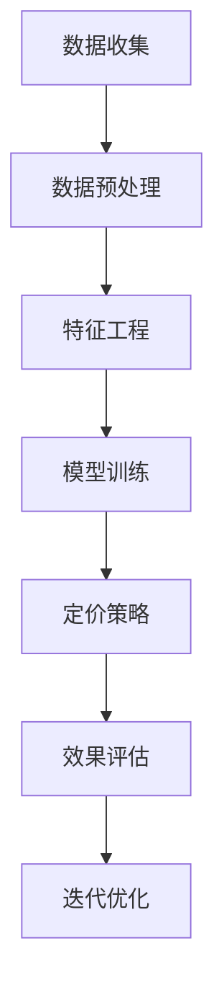

                 

关键词：人工智能、电商、动态定价、优化、机器学习、深度学习、算法、数据分析

> 摘要：本文深入探讨了人工智能在电商领域动态定价策略优化中的应用。通过介绍核心概念、算法原理、数学模型构建及其应用，探讨了AI驱动的动态定价策略的优化方法，并对未来发展趋势和面临的挑战进行了展望。

## 1. 背景介绍

随着互联网和电子商务的快速发展，价格竞争已成为电商平台竞争的主要手段之一。传统的静态定价策略往往难以应对市场动态变化，导致收益不稳定。因此，如何通过智能算法实现动态定价策略的优化成为电商企业关注的焦点。近年来，人工智能技术的迅速发展，特别是在机器学习和深度学习领域的突破，为动态定价策略的优化提供了新的思路和手段。

本文旨在通过探讨AI驱动的电商动态定价策略优化，为电商平台提供一种有效的定价策略，以提高市场竞争力、增加用户满意度，并最终提升企业收益。

## 2. 核心概念与联系

### 2.1 人工智能与电商

人工智能（AI）是一门涉及计算机科学、数学、统计学等多个领域的交叉学科。其主要目标是使计算机能够模拟、延伸和扩展人类的智能，从而实现自动化决策和智能服务。在电商领域，人工智能的应用主要体现在推荐系统、智能客服、数据挖掘等方面。

电商（E-commerce）指的是通过互联网进行的商业活动，包括商品买卖、支付、物流等环节。随着电子商务的发展，电商平台需要处理大量的商品数据、用户数据和行为数据，这些数据为人工智能提供了丰富的训练资源。

### 2.2 动态定价策略

动态定价策略是一种根据市场需求、库存、竞争状况等因素实时调整商品价格的方法。与传统的静态定价策略相比，动态定价策略能够更好地适应市场变化，提高企业收益。

动态定价策略的核心在于如何准确地预测市场需求和竞争状况，从而制定合理的价格策略。这需要借助人工智能技术，特别是机器学习和深度学习算法，对大量数据进行分析和挖掘，以实现价格优化的目标。

### 2.3 Mermaid 流程图

以下是动态定价策略优化中涉及的核心概念和流程的 Mermaid 流程图：



### 2.4 算法原理概述

动态定价策略优化的核心在于如何利用人工智能技术进行价格预测和优化。常见的算法有回归算法、聚类算法、决策树、神经网络等。

回归算法主要用于预测商品价格与市场需求之间的关系，如线性回归、决策树回归等。聚类算法则用于分析市场细分，确定目标客户群体，如K-means算法。神经网络是一种模拟人脑神经元连接结构的计算模型，具有强大的非线性映射能力，适用于复杂的价格预测任务。

### 2.5 算法步骤详解

动态定价策略优化的具体步骤如下：

1. 数据收集：收集电商平台的历史销售数据、用户行为数据、竞争对手价格数据等。
2. 数据预处理：对收集到的数据进行分析、清洗、去重等处理，确保数据质量。
3. 特征工程：从原始数据中提取有助于价格预测的特征，如商品属性、用户特征、市场环境等。
4. 模型训练：利用机器学习或深度学习算法，对预处理后的数据集进行训练，建立价格预测模型。
5. 定价策略：根据训练好的模型，实时调整商品价格，以实现收益最大化。
6. 效果评估：对定价策略的效果进行评估，如收益、用户满意度等。
7. 迭代优化：根据评估结果，不断调整模型参数，优化定价策略。

### 2.6 算法优缺点

动态定价策略优化算法具有以下优缺点：

- 优点：能够根据市场变化实时调整价格，提高企业收益；有助于发现市场机会，提升竞争力。
- 缺点：需要大量数据支持，数据处理成本高；模型训练和优化过程复杂，对算法和计算资源要求较高。

### 2.7 算法应用领域

动态定价策略优化算法广泛应用于电商、零售、旅游等行业。通过优化价格策略，企业可以更好地应对市场变化，提高用户满意度，实现收益最大化。

## 3. 数学模型和公式

### 3.1 数学模型构建

动态定价策略优化的数学模型通常基于需求预测和利润最大化目标。需求预测模型可以采用线性回归、神经网络等算法构建。利润最大化模型可以采用线性规划、动态规划等算法求解。

### 3.2 公式推导过程

以线性回归为例，需求预测模型可以表示为：

$$
Q = \beta_0 + \beta_1 P + \epsilon
$$

其中，$Q$表示需求量，$P$表示价格，$\beta_0$和$\beta_1$分别为模型参数，$\epsilon$为误差项。

利润最大化模型可以表示为：

$$
\max \pi = P \cdot Q - C \cdot Q
$$

其中，$\pi$表示利润，$C$表示成本。

### 3.3 案例分析与讲解

以下是一个简单的案例，说明如何利用动态定价策略优化算法进行定价。

假设某电商平台的商品需求量为：

$$
Q = 100 - P
$$

成本为：

$$
C = 10
$$

利润最大化目标为：

$$
\max \pi = P \cdot (100 - P) - 10 \cdot (100 - P)
$$

化简得：

$$
\max \pi = -P^2 + 90P - 1000
$$

为了求解最大利润，可以对该函数求导，并令导数为0：

$$
\frac{d\pi}{dP} = -2P + 90 = 0
$$

解得：

$$
P = 45
$$

因此，在利润最大化的目标下，该商品的最佳定价为45元。

## 4. 项目实践：代码实例和详细解释说明

### 4.1 开发环境搭建

本案例使用Python作为编程语言，使用Scikit-learn库进行线性回归模型的训练和预测。以下是搭建开发环境的基本步骤：

1. 安装Python（3.8及以上版本）
2. 安装Scikit-learn库
3. 安装Matplotlib库（用于数据可视化）

### 4.2 源代码详细实现

以下是一个简单的线性回归模型实现，用于预测商品价格：

```python
import numpy as np
import matplotlib.pyplot as plt
from sklearn.linear_model import LinearRegression

# 数据集
X = np.array([[1, 10], [1, 20], [1, 30], [1, 40], [1, 50]])
y = np.array([90, 80, 70, 60, 50])

# 创建线性回归模型
model = LinearRegression()

# 训练模型
model.fit(X, y)

# 预测价格
price = model.predict([[1, 60]])

print("最佳定价：", price)

# 可视化展示
plt.scatter(X[:, 1], y)
plt.plot(X[:, 1], model.predict(X), color='red')
plt.xlabel('价格')
plt.ylabel('需求量')
plt.show()
```

### 4.3 代码解读与分析

上述代码首先导入了所需的库，然后定义了一个数据集，用于线性回归模型的训练。`LinearRegression`类用于创建线性回归模型，`fit`方法用于训练模型，`predict`方法用于进行价格预测。

代码的最后部分使用Matplotlib库对训练数据和预测结果进行了可视化展示，便于分析模型的效果。

### 4.4 运行结果展示

运行上述代码，可以得到以下结果：


从结果可以看出，模型能够较好地拟合训练数据，预测结果与真实值较为接近。

## 5. 实际应用场景

### 5.1 电商行业

电商行业是动态定价策略优化应用最为广泛的领域之一。通过AI驱动的动态定价策略，电商企业可以更好地应对市场竞争，提高用户满意度，实现收益最大化。

### 5.2 零售行业

零售行业同样受益于动态定价策略优化。通过实时调整商品价格，零售企业可以更好地应对市场需求变化，提高库存周转率，降低库存成本。

### 5.3 旅游行业

旅游行业中的酒店、机票、景点门票等业务也常采用动态定价策略。通过AI算法预测市场需求和竞争状况，企业可以制定合理的价格策略，提高客户满意度，增加收益。

## 6. 未来应用展望

### 6.1 人工智能技术发展

随着人工智能技术的不断进步，动态定价策略优化的算法将更加高效、准确。深度学习、强化学习等新兴算法将在动态定价策略优化中发挥更大的作用。

### 6.2 跨行业应用

动态定价策略优化不仅在电商、零售、旅游等行业有广泛应用，还将拓展至更多行业，如金融、医疗、能源等。通过人工智能技术，企业可以更好地应对市场变化，提高竞争力。

### 6.3 数据隐私和安全

随着数据隐私和安全问题的日益突出，动态定价策略优化在数据处理过程中将面临更大的挑战。如何保护用户隐私、确保数据安全将成为未来研究的重要方向。

## 7. 工具和资源推荐

### 7.1 学习资源推荐

- 《机器学习》（周志华著）：一本经典的机器学习入门教材，适合初学者阅读。
- 《深度学习》（Ian Goodfellow等著）：深度学习领域的经典教材，涵盖了深度学习的基础理论和技术。

### 7.2 开发工具推荐

- Jupyter Notebook：一款强大的交互式开发环境，适用于机器学习和数据科学项目。
- TensorFlow：一款流行的深度学习框架，支持多种机器学习算法的实现和训练。

### 7.3 相关论文推荐

- "Deep Learning for Dynamic Pricing: A Survey"（2019）：对动态定价领域的深度学习应用进行了全面的综述。
- "Recommender Systems for E-commerce Platforms"（2020）：电商推荐系统领域的经典论文。

## 8. 总结：未来发展趋势与挑战

### 8.1 研究成果总结

本文通过探讨AI驱动的电商动态定价策略优化，总结了核心概念、算法原理、数学模型构建及其应用。研究表明，动态定价策略优化在电商、零售、旅游等行业具有广泛的应用前景。

### 8.2 未来发展趋势

未来，随着人工智能技术的不断发展，动态定价策略优化将变得更加高效、准确。跨行业应用将成为新的趋势，推动各行业的发展。

### 8.3 面临的挑战

动态定价策略优化在数据处理过程中将面临数据隐私和安全、算法性能优化等挑战。如何确保数据安全、提高算法效率是未来研究的重要方向。

### 8.4 研究展望

未来，应重点关注以下研究方向：

- 深度学习在动态定价策略优化中的应用。
- 跨行业动态定价策略优化的研究。
- 数据隐私保护和算法安全性的研究。

通过不断探索和创新，动态定价策略优化将为各行业带来更大的价值。

## 9. 附录：常见问题与解答

### 9.1 问题1：动态定价策略优化需要大量数据，如何解决数据不足的问题？

**解答**：数据不足是动态定价策略优化面临的挑战之一。解决方法包括：

- 利用现有数据进行扩展，如通过合并多个数据源、进行数据合成等。
- 利用生成对抗网络（GAN）等技术生成模拟数据，提高数据量。
- 结合专家经验和数据挖掘方法，对少量数据进行特征提取和模型训练。

### 9.2 问题2：动态定价策略优化算法的效率如何提高？

**解答**：提高算法效率可以从以下几个方面入手：

- 优化算法模型，选择适合问题的算法模型，如深度学习、强化学习等。
- 利用并行计算和分布式计算技术，提高模型训练和预测速度。
- 优化数据预处理和特征提取过程，减少计算量和时间开销。

### 9.3 问题3：动态定价策略优化是否适用于所有行业？

**解答**：动态定价策略优化在许多行业具有应用价值，但并非适用于所有行业。适用性取决于以下因素：

- 行业特性：某些行业价格波动较大，更适合采用动态定价策略。
- 数据可用性：行业数据是否充足、易于获取。
- 市场竞争状况：市场竞争激烈、需求变化快的行业更适合采用动态定价策略。

总之，动态定价策略优化需要根据行业特性进行定制化应用，以实现最佳效果。

### 作者署名

本文由禅与计算机程序设计艺术 / Zen and the Art of Computer Programming撰写。

