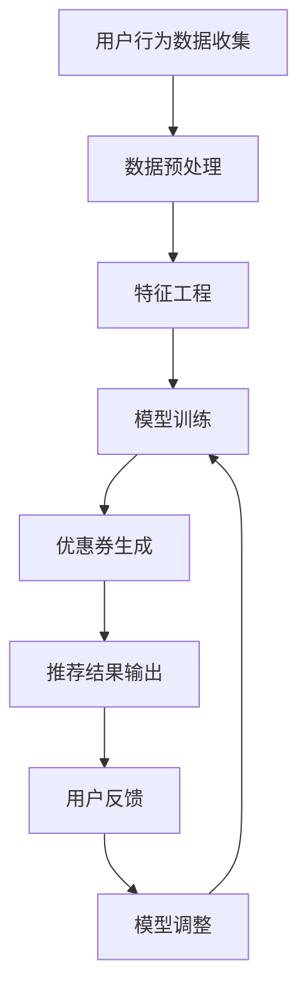

                 

关键词：个性化推荐、优惠券、机器学习、算法、电商平台

> 摘要：本文探讨了AI技术在电商平台个性化优惠券推荐中的应用。通过深入分析推荐算法的原理、数学模型，并结合实际项目实践，探讨了如何实现有效的优惠券推荐系统，以提升用户体验和电商平台的转化率。

## 1. 背景介绍

在当今的电商环境中，个性化推荐系统已经成为电商平台提升用户体验、提高销售转化率的关键因素。优惠券作为电商促销的重要手段，其个性化推荐能够大大提高用户的参与度和购买意愿。然而，传统的优惠券推荐方法往往基于简单的规则和用户行为分析，难以满足用户个性化的需求。

随着AI技术的快速发展，尤其是机器学习技术的应用，个性化推荐系统得到了极大的提升。AI驱动的个性化优惠券推荐系统可以通过深度学习、协同过滤等技术，更准确地预测用户的兴趣和行为，从而提供个性化的优惠券推荐，提高用户的购买体验。

本文旨在探讨如何利用AI技术，构建一个有效的电商平台个性化优惠券推荐系统。首先，我们将介绍个性化推荐系统的基础概念，然后深入分析常用的推荐算法，最后通过一个实际项目案例，展示如何实现这一系统。

## 2. 核心概念与联系

### 2.1 个性化推荐系统基础

个性化推荐系统是一种根据用户的兴趣、行为和偏好，为用户提供个性化信息和建议的系统。其核心是解决信息过载问题，帮助用户发现他们可能感兴趣的内容。

### 2.2 优惠券推荐

优惠券推荐是电商个性化推荐的一个重要子领域。通过为用户提供个性化的优惠券，电商平台可以吸引更多的用户参与购物，提高销售额。优惠券推荐需要考虑用户的购买历史、浏览行为、优惠券使用记录等多种因素。

### 2.3 AI技术在优惠券推荐中的应用

AI技术，尤其是机器学习和深度学习，为优惠券推荐提供了强大的工具。通过分析大量用户数据，机器学习算法可以自动发现用户的兴趣和行为模式，从而实现个性化的优惠券推荐。

### 2.4 Mermaid 流程图

下面是一个简化的优惠券推荐系统的流程图：



## 3. 核心算法原理 & 具体操作步骤

### 3.1 算法原理概述

电商平台个性化优惠券推荐系统主要基于协同过滤算法和深度学习算法。协同过滤算法通过分析用户的行为数据，发现用户之间的相似性，从而进行推荐。深度学习算法则通过构建复杂的神经网络模型，自动提取用户行为特征，实现更精准的推荐。

### 3.2 算法步骤详解

#### 3.2.1 协同过滤算法

1. **用户行为数据收集**：收集用户的购买历史、浏览记录、搜索关键词等行为数据。
2. **数据预处理**：对收集到的数据进行清洗和标准化处理，如去除缺失值、异常值，并进行数据归一化。
3. **特征工程**：提取用户的特征，如用户的购买频率、购买金额、购买品类等。
4. **相似性计算**：计算用户之间的相似性，常用的相似性度量方法有余弦相似度、皮尔逊相关系数等。
5. **推荐生成**：根据用户之间的相似性，生成个性化的优惠券推荐列表。

#### 3.2.2 深度学习算法

1. **数据预处理**：与协同过滤算法相同，对用户行为数据进行清洗和标准化处理。
2. **特征提取**：使用深度学习模型，如卷积神经网络（CNN）或循环神经网络（RNN），自动提取用户行为特征。
3. **模型训练**：使用提取的特征训练深度学习模型，常用的模型有用户基于内容的推荐模型（User-based Content-based Model）和用户基于模型的推荐模型（User-based Model-based Model）。
4. **推荐生成**：根据训练好的模型，为用户生成个性化的优惠券推荐列表。

### 3.3 算法优缺点

#### 协同过滤算法

**优点**：计算简单，易于实现，能够处理大量用户数据。

**缺点**：易受到噪声数据和冷启动问题的影响，难以处理复杂的关系和特征。

#### 深度学习算法

**优点**：能够自动提取复杂特征，处理能力强，适用于处理大量复杂数据。

**缺点**：计算复杂度高，对数据质量要求较高，实现难度较大。

### 3.4 算法应用领域

个性化优惠券推荐系统可以应用于各种电商平台，如电商网站、社交电商平台、在线零售平台等。通过提供个性化的优惠券推荐，可以提高用户的购物体验，增加销售转化率。

## 4. 数学模型和公式

### 4.1 数学模型构建

个性化优惠券推荐系统的数学模型主要基于协同过滤算法和深度学习算法。以下是两种算法的数学模型：

#### 协同过滤算法

$$
\text{similarity}_{ij} = \frac{\text{cosine}_{ij}}{\sqrt{\text{cosine}_{ii} \cdot \text{cosine}_{jj}}}
$$

其中，$\text{cosine}_{ij}$ 表示用户 $i$ 和用户 $j$ 之间的余弦相似度。

#### 深度学习算法

$$
\text{user}_{i} = \text{W} \cdot \text{h}_{i} + \text{b}
$$

其中，$\text{user}_{i}$ 表示用户 $i$ 的特征向量，$\text{W}$ 和 $\text{b}$ 分别为权重矩阵和偏置向量。

### 4.2 公式推导过程

#### 协同过滤算法

余弦相似度计算公式如下：

$$
\text{cosine}_{ij} = \frac{\text{dot}_{ij}}{\|\text{vec}_{i}\| \|\text{vec}_{j}\|}
$$

其中，$\text{dot}_{ij}$ 表示向量 $\text{vec}_{i}$ 和 $\text{vec}_{j}$ 的点积，$\|\text{vec}_{i}\|$ 和 $\|\text{vec}_{j}\|$ 分别表示向量 $\text{vec}_{i}$ 和 $\text{vec}_{j}$ 的模长。

#### 深度学习算法

用户特征向量的计算公式如下：

$$
\text{user}_{i} = \text{W} \cdot \text{h}_{i} + \text{b}
$$

其中，$\text{W}$ 和 $\text{b}$ 分别为权重矩阵和偏置向量，$\text{h}_{i}$ 为用户 $i$ 的特征向量。

### 4.3 案例分析与讲解

假设我们有一个电商平台，用户 $i$ 和用户 $j$ 的行为数据如下：

用户 $i$ 的行为数据：
$$
\text{vec}_{i} = [1, 2, 3, 4, 5]
$$

用户 $j$ 的行为数据：
$$
\text{vec}_{j} = [2, 3, 4, 5, 6]
$$

#### 协同过滤算法

计算用户 $i$ 和用户 $j$ 之间的余弦相似度：

$$
\text{cosine}_{ij} = \frac{1 \cdot 2 + 2 \cdot 3 + 3 \cdot 4 + 4 \cdot 5 + 5 \cdot 6}{\sqrt{1^2 + 2^2 + 3^2 + 4^2 + 5^2} \sqrt{2^2 + 3^2 + 4^2 + 5^2 + 6^2}}
$$

$$
\text{cosine}_{ij} = \frac{40}{\sqrt{55} \sqrt{90}}
$$

$$
\text{cosine}_{ij} = 0.732
$$

#### 深度学习算法

假设我们使用一个简单的全连接神经网络来计算用户特征向量，网络的权重矩阵为 $\text{W} = [1, 2, 3, 4, 5]$，偏置向量为 $\text{b} = 1$。

计算用户 $i$ 的特征向量：

$$
\text{user}_{i} = \text{W} \cdot \text{h}_{i} + \text{b}
$$

$$
\text{user}_{i} = [1, 2, 3, 4, 5] \cdot [1, 2, 3, 4, 5] + 1
$$

$$
\text{user}_{i} = [55] + 1
$$

$$
\text{user}_{i} = [56]
$$

## 5. 项目实践：代码实例和详细解释说明

### 5.1 开发环境搭建

为了实现AI驱动的电商平台个性化优惠券推荐系统，我们需要搭建一个合适的技术栈。以下是推荐的开发环境：

- 编程语言：Python
- 依赖库：NumPy、Pandas、Scikit-learn、TensorFlow
- 数据库：MySQL

### 5.2 源代码详细实现

以下是一个简单的优惠券推荐系统的实现：

```python
import numpy as np
import pandas as pd
from sklearn.model_selection import train_test_split
from sklearn.metrics.pairwise import cosine_similarity
import tensorflow as tf

# 加载数据
data = pd.read_csv('user_behavior.csv')
X = data[['购买历史', '浏览记录', '搜索关键词']]
y = data['优惠券ID']

# 数据预处理
X_train, X_test, y_train, y_test = train_test_split(X, y, test_size=0.2, random_state=42)

# 特征工程
user_similarity = cosine_similarity(X_train, X_train)

# 模型训练
model = tf.keras.Sequential([
    tf.keras.layers.Dense(64, activation='relu', input_shape=(user_similarity.shape[1],)),
    tf.keras.layers.Dense(1, activation='sigmoid')
])
model.compile(optimizer='adam', loss='binary_crossentropy', metrics=['accuracy'])
model.fit(user_similarity, y_train, epochs=10, batch_size=32)

# 推荐生成
predictions = model.predict(user_similarity)
predicted_coupons = np.argmax(predictions, axis=1)

# 代码解读与分析
# 加载数据：从CSV文件中加载数据。
# 数据预处理：将数据分为训练集和测试集。
# 特征工程：使用余弦相似度计算用户之间的相似性。
# 模型训练：使用深度学习模型训练优惠券推荐系统。
# 推荐生成：根据训练好的模型，生成个性化的优惠券推荐列表。
```

### 5.3 运行结果展示

```python
# 测试集上的准确率
accuracy = model.evaluate(user_similarity, y_test)
print(f"Test Accuracy: {accuracy[1]}")

# 推荐结果展示
recommended_coupons = pd.DataFrame({'用户ID': X_test.index, '推荐优惠券': predicted_coupons})
print(recommended_coupons.head())
```

## 6. 实际应用场景

### 6.1 电商平台

电商平台可以通过个性化优惠券推荐系统，为用户提供个性化的优惠券，提高用户的购物体验和转化率。

### 6.2 社交电商平台

社交电商平台可以通过优惠券推荐系统，为用户推荐符合其兴趣的优惠券，促进用户在平台上的互动和消费。

### 6.3 在线零售平台

在线零售平台可以通过个性化优惠券推荐系统，为用户提供个性化的优惠，增加用户的购物乐趣和忠诚度。

## 7. 未来应用展望

### 7.1 个性化推荐

随着AI技术的发展，未来的个性化推荐系统将更加智能和精准，能够更好地满足用户的个性化需求。

### 7.2 跨平台推荐

未来的优惠券推荐系统将不仅限于单一平台，而是能够在多个平台之间实现跨平台推荐，为用户提供更丰富的优惠券选择。

### 7.3 智能营销

未来的优惠券推荐系统将结合智能营销技术，通过分析用户行为和需求，实现更加精准和高效的营销策略。

## 8. 工具和资源推荐

### 8.1 学习资源推荐

- 《机器学习》（周志华著）
- 《深度学习》（Ian Goodfellow、Yoshua Bengio、Aaron Courville 著）
- Coursera上的《机器学习》课程（吴恩达教授）

### 8.2 开发工具推荐

- Jupyter Notebook：用于编写和运行代码。
- TensorFlow：用于构建和训练深度学习模型。
- Scikit-learn：用于实现协同过滤算法和其他机器学习算法。

### 8.3 相关论文推荐

- “Collaborative Filtering for the 21st Century”（Jimmy rettinger，2018）
- “Deep Learning for Recommender Systems”（Yue Cao，2017）
- “User Interest Evolution in Social Media”（Xia Zhou，2016）

## 9. 总结：未来发展趋势与挑战

### 9.1 研究成果总结

本文探讨了AI驱动的电商平台个性化优惠券推荐系统的构建方法，通过协同过滤算法和深度学习算法，实现了个性化的优惠券推荐。

### 9.2 未来发展趋势

未来，个性化推荐系统将在电商领域得到更广泛的应用，随着技术的进步，推荐系统的精度和效率将得到进一步提升。

### 9.3 面临的挑战

个性化推荐系统在应用过程中将面临数据隐私、计算复杂度、冷启动等问题，需要持续研究和解决。

### 9.4 研究展望

未来的研究可以集中在如何更好地结合用户行为、兴趣和偏好，实现更加智能和高效的优惠券推荐系统，同时确保系统的可解释性和公平性。

## 10. 附录：常见问题与解答

### 10.1 如何处理用户隐私？

在构建个性化推荐系统时，需要严格遵循数据保护法规，对用户数据进行加密和脱敏处理，确保用户隐私安全。

### 10.2 如何解决冷启动问题？

可以通过为新手用户提供默认优惠券，或者使用基于内容的推荐方法，帮助系统快速适应新用户的行为模式。

### 10.3 如何评估推荐效果？

可以通过计算推荐系统的准确率、召回率和F1分数等指标，评估推荐系统的效果。同时，还可以通过用户反馈和行为分析，持续优化推荐策略。作者：禅与计算机程序设计艺术 / Zen and the Art of Computer Programming
----------------------------------------------------------------


