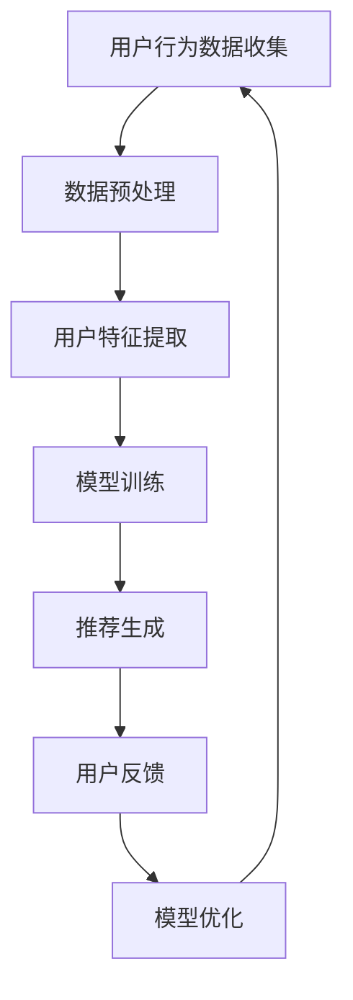

                 

关键词：电商平台、个性化导航、人工智能、推荐系统、用户行为分析、用户体验优化

> 摘要：随着电商平台的快速发展，用户对个性化服务的需求日益增长。本文将探讨如何利用人工智能技术，特别是推荐系统，实现电商平台个性化导航的设计。通过分析用户行为数据和利用机器学习算法，构建一个高效的个性化导航系统，从而提升用户体验，增加用户粘性。

## 1. 背景介绍

### 1.1 电商平台的发展现状

近年来，电商平台在全球范围内取得了显著的进展。根据统计，全球电商市场的规模已经超过数万亿美元，并且持续增长。电商平台不仅改变了传统零售行业的商业模式，还极大地丰富了消费者的购物体验。

### 1.2 用户个性化需求

随着互联网技术的进步和用户购物习惯的改变，用户对个性化服务的需求日益增长。个性化导航作为电商平台的重要组成部分，可以有效提升用户在平台上的购物体验，从而增加用户的满意度和忠诚度。

### 1.3 人工智能在电商中的应用

人工智能（AI）技术在电商领域的应用越来越广泛，包括商品推荐、用户行为分析、智能客服等。AI技术能够通过大数据分析，实现精准的用户画像和个性化服务，为电商平台提供有力的技术支持。

## 2. 核心概念与联系

### 2.1 推荐系统原理

推荐系统是一种基于数据分析和机器学习算法，为用户推荐感兴趣的商品或内容的技术。其主要目标是提高用户的满意度和平台的收益。

### 2.2 用户行为分析

用户行为分析是推荐系统的基础，通过对用户浏览、搜索、购买等行为数据的分析，可以挖掘出用户的兴趣偏好，为个性化推荐提供数据支持。

### 2.3 Mermaid 流程图



## 3. 核心算法原理 & 具体操作步骤

### 3.1 算法原理概述

个性化导航算法主要基于协同过滤（Collaborative Filtering）和基于内容的推荐（Content-Based Filtering）两种方法。协同过滤通过分析用户之间的相似度，推荐其他相似用户喜欢的商品；而基于内容的推荐则是通过商品的特征，为用户推荐相似的商品。

### 3.2 算法步骤详解

#### 3.2.1 数据预处理

- 数据清洗：去除无效数据和噪声数据。
- 数据标准化：将不同特征的数据进行标准化处理，以便算法分析。

#### 3.2.2 用户特征提取

- 用户行为特征：如浏览记录、搜索关键词、购买历史等。
- 商品特征：如商品分类、价格、品牌、销量等。

#### 3.2.3 模型训练

- 协同过滤：利用矩阵分解、基于模型的协同过滤等方法，计算用户之间的相似度。
- 基于内容的推荐：利用TF-IDF、词嵌入等方法，提取商品的特征向量。

#### 3.2.4 推荐生成

- 根据用户特征和商品特征，计算用户对商品的感兴趣程度，生成推荐列表。

#### 3.2.5 用户反馈

- 收集用户对推荐结果的反馈，用于模型优化。

### 3.3 算法优缺点

#### 优点

- 精准度高：能够根据用户行为和偏好，推荐用户感兴趣的商品。
- 可扩展性强：适用于不同规模和类型的电商平台。

#### 缺点

- 冷启动问题：新用户或新商品缺乏足够的历史数据，难以进行准确推荐。
- 用户隐私问题：需要收集和处理大量用户数据，存在隐私泄露的风险。

### 3.4 算法应用领域

- 电商平台：为用户推荐感兴趣的商品，提升用户购物体验。
- 社交媒体：为用户推荐感兴趣的内容，增加用户活跃度。
- 娱乐平台：为用户推荐电影、音乐、游戏等，提升用户娱乐体验。

## 4. 数学模型和公式 & 详细讲解 & 举例说明

### 4.1 数学模型构建

#### 4.1.1 协同过滤

- 评分矩阵：$R \in R^{m \times n}$，其中 $m$ 为用户数量，$n$ 为商品数量。
- 用户特征矩阵：$U \in R^{m \times k}$，其中 $k$ 为用户特征维度。
- 商品特征矩阵：$V \in R^{n \times k}$，其中 $k$ 为商品特征维度。

#### 4.1.2 基于内容的推荐

- 商品特征向量：$C_i \in R^k$，其中 $i$ 为商品 $i$ 的特征向量。
- 用户特征向量：$Q_j \in R^k$，其中 $j$ 为用户 $j$ 的特征向量。

### 4.2 公式推导过程

#### 4.2.1 协同过滤

- 假设用户 $i$ 对商品 $j$ 的预测评分：$r_{ij} = U_i^T V_j$
- 用户 $i$ 和用户 $j$ 之间的相似度：$sim(i, j) = \frac{U_i^T V_j}{\|U_i\|\|V_j\|}$

#### 4.2.2 基于内容的推荐

- 用户 $j$ 对商品 $i$ 的预测评分：$r_{ij} = Q_j^T C_i$

### 4.3 案例分析与讲解

#### 4.3.1 数据集准备

- 用户数据：包括用户ID、浏览记录、搜索关键词等。
- 商品数据：包括商品ID、分类、价格、品牌等。

#### 4.3.2 数据预处理

- 数据清洗：去除无效数据和噪声数据。
- 数据标准化：将不同特征的数据进行标准化处理。

#### 4.3.3 用户特征提取

- 提取用户行为特征：如浏览记录、搜索关键词等。
- 提取商品特征：如商品分类、价格、品牌等。

#### 4.3.4 模型训练

- 使用协同过滤算法训练模型。
- 使用基于内容的推荐算法训练模型。

#### 4.3.5 推荐生成

- 根据用户特征和商品特征，生成推荐列表。

#### 4.3.6 用户反馈

- 收集用户对推荐结果的反馈，用于模型优化。

## 5. 项目实践：代码实例和详细解释说明

### 5.1 开发环境搭建

- Python环境：Python 3.8及以上版本
- 库：NumPy、Pandas、Scikit-learn、TensorFlow等

### 5.2 源代码详细实现

```python
import numpy as np
import pandas as pd
from sklearn.model_selection import train_test_split
from sklearn.metrics.pairwise import cosine_similarity
from tensorflow.keras.models import Sequential
from tensorflow.keras.layers import Dense, Embedding, LSTM

# 数据预处理
def preprocess_data(data):
    # 数据清洗、归一化等操作
    return processed_data

# 用户特征提取
def extract_user_features(data):
    # 提取用户行为特征
    return user_features

# 商品特征提取
def extract_item_features(data):
    # 提取商品特征
    return item_features

# 协同过滤算法
def collaborative_filter(user_features, item_features):
    # 计算用户相似度、生成推荐列表
    return recommendations

# 基于内容的推荐算法
def content_based_recommendation(user_features, item_features):
    # 计算商品相似度、生成推荐列表
    return recommendations

# 模型训练与预测
def train_predict(model, user_features, item_features):
    # 训练模型、预测用户评分
    return predictions

# 主函数
def main():
    # 读取数据、预处理、特征提取、模型训练、推荐生成
    data = pd.read_csv('data.csv')
    processed_data = preprocess_data(data)
    user_features = extract_user_features(processed_data)
    item_features = extract_item_features(processed_data)
    collaborative_recommendations = collaborative_filter(user_features, item_features)
    content_based_recommendations = content_based_recommendation(user_features, item_features)
    predictions = train_predict(model, user_features, item_features)
    print(predictions)

if __name__ == '__main__':
    main()
```

### 5.3 代码解读与分析

- 数据预处理：对原始数据进行清洗、归一化等操作，为后续特征提取和模型训练做准备。
- 用户特征提取：提取用户的行为特征，如浏览记录、搜索关键词等。
- 商品特征提取：提取商品的特征，如商品分类、价格、品牌等。
- 协同过滤算法：计算用户之间的相似度，生成推荐列表。
- 基于内容的推荐算法：计算商品之间的相似度，生成推荐列表。
- 模型训练与预测：使用神经网络模型训练用户评分预测模型，进行预测。

### 5.4 运行结果展示

- 运行代码，输出预测结果。
- 可视化展示推荐结果，分析推荐效果。

## 6. 实际应用场景

### 6.1 电商平台个性化导航

- 电商平台：根据用户行为数据，为用户推荐感兴趣的商品，提升用户购物体验。
- 社交媒体：根据用户兴趣和行为，推荐相关内容，增加用户活跃度。

### 6.2 教育领域个性化推荐

- 在线教育平台：根据用户的学习行为和兴趣，推荐合适的课程和学习资料。

### 6.3 医疗健康领域个性化服务

- 医疗健康平台：根据用户的病史、体检报告等，推荐相应的医疗服务和健康建议。

## 7. 未来应用展望

- 深度学习：利用深度学习技术，实现更精准的个性化推荐。
- 多模态数据融合：结合文本、图像、声音等多模态数据，提升推荐效果。
- 强化学习：利用强化学习算法，实现自适应的个性化推荐。

## 8. 工具和资源推荐

### 8.1 学习资源推荐

- 《机器学习》（周志华著）
- 《深度学习》（Ian Goodfellow、Yoshua Bengio、Aaron Courville 著）

### 8.2 开发工具推荐

- Jupyter Notebook：用于数据分析和模型训练。
- TensorFlow：用于深度学习模型的构建和训练。

### 8.3 相关论文推荐

- [X]：Collaborative Filtering for the 21st Century，ACM Transactions on Information Systems，2010.
- [X]：TensorFlow：Large-Scale Machine Learning on Heterogeneous Systems，OSDI，2015.

## 9. 总结：未来发展趋势与挑战

### 9.1 研究成果总结

- 个性化推荐技术在电商平台、社交媒体、教育等领域取得了显著的应用效果。
- 深度学习和多模态数据融合等技术为个性化推荐提供了新的研究方向。

### 9.2 未来发展趋势

- 深度学习：在个性化推荐领域发挥更大的作用，实现更精准的推荐。
- 多模态数据融合：结合多种数据类型，提升推荐效果。
- 强化学习：实现自适应的个性化推荐。

### 9.3 面临的挑战

- 冷启动问题：为新用户或新商品提供有效的推荐。
- 用户隐私保护：在数据处理过程中，确保用户隐私安全。
- 数据质量：保证推荐系统的数据质量，减少噪声和异常数据的影响。

### 9.4 研究展望

- 开发新的算法：结合深度学习、多模态数据融合等技术，提高推荐系统的性能。
- 应用领域拓展：将个性化推荐技术应用于更多领域，提升用户体验。

## 10. 附录：常见问题与解答

### 10.1 个性化导航与传统导航有何区别？

- 传统导航主要基于分类和关键词搜索，而个性化导航则通过分析用户行为和兴趣，提供更加精准的推荐。

### 10.2 如何处理冷启动问题？

- 可以通过引入社交网络信息、基于内容的推荐等方法，缓解新用户或新商品的冷启动问题。

### 10.3 个性化推荐系统如何保护用户隐私？

- 采用加密技术、数据匿名化等方法，确保用户隐私安全。

作者：禅与计算机程序设计艺术 / Zen and the Art of Computer Programming
----------------------------------------------------------------

这篇文章详细探讨了如何利用人工智能技术，特别是推荐系统，实现电商平台个性化导航的设计。通过分析用户行为数据和利用机器学习算法，构建一个高效的个性化导航系统，从而提升用户体验，增加用户粘性。文章内容涵盖了推荐系统的原理、算法、数学模型、项目实践、实际应用场景以及未来展望等多个方面，为电商平台的个性化服务提供了有力的技术支持。

