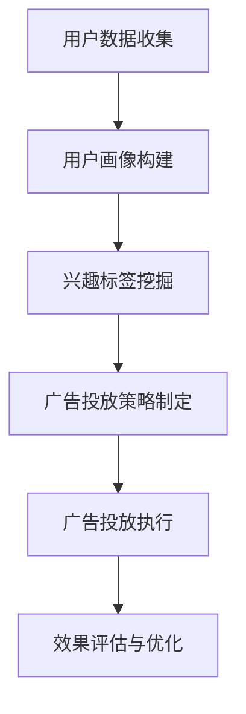

                 

关键词：人工智能，电商平台，个性化广告，机器学习，数据挖掘，深度学习，广告投放策略。

> 摘要：本文探讨了基于人工智能技术的电商平台个性化广告投放系统的设计、实现和应用。首先，介绍了电商平台个性化广告投放的背景和重要性；接着，阐述了个性化广告投放系统所需的核心概念和联系，并绘制了相应的Mermaid流程图；随后，详细介绍了核心算法原理、数学模型和公式、项目实践代码实例以及实际应用场景；最后，展望了未来发展趋势与挑战。

## 1. 背景介绍

随着互联网的迅猛发展和电子商务的普及，电商平台已经成为现代商业模式的重要组成部分。然而，随着市场竞争的加剧，如何提高广告投放效果，实现精准营销，成为电商平台面临的重要挑战。传统广告投放方式往往无法满足用户多样化的需求和偏好，导致广告投放效果不佳，广告成本高昂。

近年来，人工智能技术的飞速发展，为电商平台广告投放带来了新的机遇。人工智能技术，特别是机器学习和深度学习，能够通过对海量用户数据的分析和挖掘，发现用户的兴趣和行为模式，从而实现个性化广告投放。这种基于人工智能的个性化广告投放系统，不仅能够提高广告投放的精准度和效果，还能够降低广告投放成本，提升用户体验。

本文旨在探讨基于人工智能技术的电商平台个性化广告投放系统的设计、实现和应用。通过对核心概念、算法原理、数学模型、项目实践和实际应用场景的详细分析，旨在为电商平台提供一种有效的广告投放解决方案。

### 1.1 电商平台个性化广告投放的重要性

电商平台个性化广告投放的重要性主要体现在以下几个方面：

1. **提高广告投放精准度**：通过对用户数据的深度分析，个性化广告投放系统能够识别用户的兴趣和行为模式，从而实现精准广告投放，提高广告投放效果。

2. **降低广告投放成本**：传统广告投放方式往往需要大量人力和物力投入，而个性化广告投放系统通过自动化和智能化的方式，可以降低广告投放成本。

3. **提升用户体验**：个性化广告投放系统能够为用户提供更加贴合其兴趣和需求的广告内容，提升用户体验，增加用户粘性。

4. **增加销售额**：通过提高广告投放的精准度和效果，个性化广告投放系统能够帮助电商平台实现更高的销售额。

## 2. 核心概念与联系

### 2.1 个性化广告投放系统所需核心概念

1. **用户画像**：用户画像是指通过对用户数据的分析和挖掘，构建用户的基本属性、行为偏好、兴趣标签等信息。用户画像为个性化广告投放提供了基础数据支持。

2. **兴趣标签**：兴趣标签是指用户在浏览、搜索、购买等行为中表现出的兴趣点。通过对兴趣标签的挖掘和分析，可以识别用户的潜在需求和兴趣。

3. **广告投放策略**：广告投放策略是指根据用户画像和兴趣标签，制定相应的广告投放计划，包括广告内容、投放渠道、投放时间等。

4. **效果评估**：效果评估是指对广告投放效果进行监控和分析，包括广告曝光量、点击率、转化率等指标。通过效果评估，可以不断优化广告投放策略，提高广告投放效果。

### 2.2 个性化广告投放系统所需核心联系

个性化广告投放系统的核心联系主要体现在以下几个方面：

1. **用户数据与用户画像**：用户数据是构建用户画像的基础，通过对用户数据的收集和分析，可以构建出精准的用户画像。

2. **用户画像与兴趣标签**：用户画像中的用户兴趣和行为模式可以转化为兴趣标签，为广告投放提供依据。

3. **广告投放策略与效果评估**：根据用户画像和兴趣标签，制定广告投放策略；通过效果评估，不断优化广告投放策略，提高广告投放效果。

### 2.3 个性化广告投放系统的 Mermaid 流程图



### 2.4 个性化广告投放系统的核心算法原理

个性化广告投放系统的核心算法主要包括协同过滤、内容推荐、基于模型的推荐等。

1. **协同过滤**：协同过滤是一种基于用户行为数据的推荐算法，通过计算用户之间的相似度，为用户推荐与其行为相似的其他用户喜欢的商品。

2. **内容推荐**：内容推荐是一种基于商品特征数据的推荐算法，通过分析商品的属性、标签等特征，为用户推荐与其兴趣相关的商品。

3. **基于模型的推荐**：基于模型的推荐是一种结合协同过滤和内容推荐的推荐算法，通过建立用户和商品之间的关联模型，为用户推荐符合其兴趣和需求的商品。

## 3. 核心算法原理 & 具体操作步骤

### 3.1 算法原理概述

个性化广告投放系统的核心算法原理主要包括以下几个方面：

1. **用户画像构建**：通过收集用户的基本属性、行为数据等，构建出精准的用户画像。

2. **兴趣标签挖掘**：通过对用户画像的分析，挖掘出用户的兴趣点和潜在需求。

3. **协同过滤算法**：通过计算用户之间的相似度，为用户推荐与其行为相似的其它用户喜欢的商品。

4. **内容推荐算法**：通过分析商品的属性、标签等特征，为用户推荐与其兴趣相关的商品。

5. **基于模型的推荐算法**：通过建立用户和商品之间的关联模型，为用户推荐符合其兴趣和需求的商品。

### 3.2 算法步骤详解

1. **用户画像构建**

   用户画像构建主要包括以下几个步骤：

   - **数据收集**：收集用户的基本属性（如年龄、性别、地域等）、行为数据（如浏览、搜索、购买等）。
   - **数据处理**：对收集到的用户数据进行清洗、去重、标准化等处理，确保数据质量。
   - **特征提取**：从用户数据中提取出对个性化广告投放有用的特征，如用户年龄、购买频率、兴趣爱好等。

2. **兴趣标签挖掘**

   兴趣标签挖掘主要包括以下几个步骤：

   - **行为分析**：分析用户在平台上的行为数据，如浏览、搜索、购买等，识别用户的兴趣点。
   - **标签生成**：根据用户的行为数据，生成相应的兴趣标签，如“数码产品”、“美食”、“旅游”等。

3. **协同过滤算法**

   协同过滤算法主要包括以下几个步骤：

   - **用户相似度计算**：计算用户之间的相似度，常用的相似度计算方法包括余弦相似度、皮尔逊相关系数等。
   - **用户推荐列表生成**：根据用户相似度计算结果，为每个用户生成一个推荐列表，推荐列表中的商品为与用户相似的其他用户喜欢的商品。

4. **内容推荐算法**

   内容推荐算法主要包括以下几个步骤：

   - **商品特征提取**：提取商品的基本属性、标签等特征。
   - **商品相似度计算**：计算商品之间的相似度，常用的相似度计算方法包括余弦相似度、欧氏距离等。
   - **商品推荐列表生成**：根据商品相似度计算结果，为用户推荐与其兴趣相关的商品。

5. **基于模型的推荐算法**

   基于模型的推荐算法主要包括以下几个步骤：

   - **用户 - 商品关联建模**：建立用户和商品之间的关联模型，常用的模型包括矩阵分解、深度学习等。
   - **商品推荐列表生成**：根据用户 - 商品关联模型，为用户推荐符合其兴趣和需求的商品。

### 3.3 算法优缺点

1. **协同过滤算法**

   优点：

   - **实时性高**：协同过滤算法能够实时计算用户之间的相似度，为用户推荐商品。
   - **易于实现**：协同过滤算法的原理相对简单，易于实现和部署。

   缺点：

   - **稀疏性问题**：协同过滤算法对稀疏性问题处理能力较差，当用户行为数据稀疏时，推荐效果较差。
   - **冷启动问题**：新用户由于缺乏行为数据，无法进行有效的推荐。

2. **内容推荐算法**

   优点：

   - **推荐精准**：内容推荐算法能够根据商品的特征和标签为用户推荐精准的商品。
   - **适用范围广**：内容推荐算法适用于各种类型的电商平台。

   缺点：

   - **实时性较低**：内容推荐算法需要先计算商品之间的相似度，再进行推荐，实时性较低。
   - **用户参与度低**：内容推荐算法依赖于商品的特征和标签，用户参与度较低。

3. **基于模型的推荐算法**

   优点：

   - **推荐精准**：基于模型的推荐算法能够根据用户和商品之间的关联模型为用户推荐精准的商品。
   - **实时性高**：基于模型的推荐算法能够实时计算用户和商品之间的关联度，为用户推荐商品。

   缺点：

   - **实现难度较高**：基于模型的推荐算法需要建立复杂的用户 - 商品关联模型，实现难度较高。
   - **数据依赖性高**：基于模型的推荐算法对数据依赖性较高，数据质量对推荐效果有较大影响。

### 3.4 算法应用领域

个性化广告投放系统的核心算法在电商、金融、医疗、社交等多个领域有广泛的应用。

1. **电商领域**：电商平台通过个性化广告投放系统，为用户推荐符合其兴趣和需求的商品，提高用户购物体验和销售额。

2. **金融领域**：金融机构通过个性化广告投放系统，为用户提供精准的金融产品推荐，提高用户粘性和转化率。

3. **医疗领域**：医疗机构通过个性化广告投放系统，为患者推荐相关的医疗信息和产品，提高患者就诊体验和满意度。

4. **社交领域**：社交平台通过个性化广告投放系统，为用户推荐感兴趣的内容和联系人，提高用户活跃度和留存率。

## 4. 数学模型和公式 & 详细讲解 & 举例说明

### 4.1 数学模型构建

个性化广告投放系统中的数学模型主要包括协同过滤模型、内容推荐模型和基于模型的推荐模型。

1. **协同过滤模型**

   协同过滤模型主要用于计算用户之间的相似度，常用的方法包括余弦相似度和皮尔逊相关系数。

   - **余弦相似度**：  
     余弦相似度的计算公式如下：  
     $$  
     \text{余弦相似度} = \frac{\text{用户A和用户B的共现商品数}}{\sqrt{\text{用户A的共现商品数之和} \times \text{用户B的共现商品数之和}}}  
     $$

   - **皮尔逊相关系数**：  
     皮尔逊相关系数的计算公式如下：  
     $$  
     \text{皮尔逊相关系数} = \frac{\sum_{i=1}^{n} (\text{用户A的商品评分} - \text{用户A的平均评分}) (\text{用户B的商品评分} - \text{用户B的平均评分})}{\sqrt{\sum_{i=1}^{n} (\text{用户A的商品评分} - \text{用户A的平均评分})^2} \times \sqrt{\sum_{i=1}^{n} (\text{用户B的商品评分} - \text{用户B的平均评分})^2}}  
     $$

2. **内容推荐模型**

   内容推荐模型主要用于计算商品之间的相似度，常用的方法包括余弦相似度和欧氏距离。

   - **余弦相似度**：  
     余弦相似度的计算公式如下：  
     $$  
     \text{余弦相似度} = \frac{\text{商品A和商品B的特征向量内积}}{\text{商品A和商品B的特征向量模长之积}}  
     $$

   - **欧氏距离**：  
     欧氏距离的计算公式如下：  
     $$  
     \text{欧氏距离} = \sqrt{\sum_{i=1}^{n} (\text{商品A的特征} - \text{商品B的特征})^2}  
     $$

3. **基于模型的推荐模型**

   基于模型的推荐模型主要包括矩阵分解、深度学习等。

   - **矩阵分解**：  
     矩阵分解是一种将用户和商品的高维稀疏矩阵分解为低维矩阵的方法，常用的矩阵分解方法包括Singular Value Decomposition（SVD）和Alternating Least Squares（ALS）。

     $$  
     \text{用户矩阵} \approx \text{用户特征矩阵} \times \text{商品特征矩阵}^T  
     $$

   - **深度学习**：  
     深度学习是一种基于多层神经网络的学习方法，通过逐层提取特征，实现从原始数据到高级抽象表示的映射。

     $$  
     \text{输出} = \text{激活函数}(\text{权重} \times \text{输入} + \text{偏置})  
     $$

### 4.2 公式推导过程

1. **协同过滤模型**

   以余弦相似度为例如下：

   - **共现商品数**：  
     $$  
     \text{共现商品数} = \sum_{i=1}^{n} \text{商品i在用户A和用户B中同时出现的次数}  
     $$

   - **用户A的共现商品数之和**：  
     $$  
     \text{用户A的共现商品数之和} = \sum_{i=1}^{n} \text{商品i在用户A中出现的次数}  
     $$

   - **用户B的共现商品数之和**：  
     $$  
     \text{用户B的共现商品数之和} = \sum_{i=1}^{n} \text{商品i在用户B中出现的次数}  
     $$

   - **用户A和用户B的共现商品数**：  
     $$  
     \text{用户A和用户B的共现商品数} = \sum_{i=1}^{n} (\text{商品i在用户A中出现的次数} \times \text{商品i在用户B中出现的次数})  
     $$

   - **用户A和用户B的共现商品数之和**：  
     $$  
     \text{用户A和用户B的共现商品数之和} = \sum_{i=1}^{n} \text{商品i在用户A和用户B中同时出现的次数} \times \sum_{i=1}^{n} \text{商品i在用户A中出现的次数} \times \sum_{i=1}^{n} \text{商品i在用户B中出现的次数}  
     $$

   - **用户A和用户B的余弦相似度**：  
     $$  
     \text{用户A和用户B的余弦相似度} = \frac{\text{共现商品数}}{\sqrt{\text{用户A的共现商品数之和} \times \text{用户B的共现商品数之和}}}  
     $$

2. **内容推荐模型**

   以余弦相似度为例如下：

   - **商品A和商品B的特征向量内积**：  
     $$  
     \text{商品A和商品B的特征向量内积} = \sum_{i=1}^{n} \text{商品A的特征} \times \text{商品B的特征}  
     $$

   - **商品A和商品B的特征向量模长之积**：  
     $$  
     \text{商品A和商品B的特征向量模长之积} = \sqrt{\sum_{i=1}^{n} \text{商品A的特征}^2} \times \sqrt{\sum_{i=1}^{n} \text{商品B的特征}^2}  
     $$

   - **商品A和商品B的余弦相似度**：  
     $$  
     \text{商品A和商品B的余弦相似度} = \frac{\text{商品A和商品B的特征向量内积}}{\text{商品A和商品B的特征向量模长之积}}  
     $$

3. **基于模型的推荐模型**

   以矩阵分解为例：

   - **用户矩阵**：  
     $$  
     \text{用户矩阵} = [\text{用户A的评分矩阵}, \text{用户B的评分矩阵}, ..., \text{用户M的评分矩阵}]  
     $$

   - **用户特征矩阵**：  
     $$  
     \text{用户特征矩阵} = \begin{bmatrix}  
     \text{用户A的特征向量} \\  
     \text{用户B的特征向量} \\  
     ... \\  
     \text{用户M的特征向量}  
     \end{bmatrix}  
     $$

   - **商品特征矩阵**：  
     $$  
     \text{商品特征矩阵} = \begin{bmatrix}  
     \text{商品A的特征向量} \\  
     \text{商品B的特征向量} \\  
     ... \\  
     \text{商品N的特征向量}  
     \end{bmatrix}  
     $$

   - **用户 - 商品关联矩阵**：  
     $$  
     \text{用户 - 商品关联矩阵} = \text{用户特征矩阵} \times \text{商品特征矩阵}^T  
     $$

   - **预测评分**：  
     $$  
     \text{预测评分} = \text{用户特征矩阵} \times \text{商品特征矩阵}^T \times \text{评分矩阵}  
     $$

### 4.3 案例分析与讲解

以电商平台个性化广告投放系统为例，说明数学模型在实际应用中的使用方法和效果。

1. **数据集准备**

   假设电商平台拥有100万用户和100万商品，每个用户对商品有1-5的评分，构建一个用户 - 商品评分矩阵。

   $$  
   \text{用户 - 商品评分矩阵} = \begin{bmatrix}  
   \text{用户1的评分矩阵} & \text{用户2的评分矩阵} & ... & \text{用户100万的评分矩阵} \\  
   \text{商品1的评分矩阵} & \text{商品2的评分矩阵} & ... & \text{商品100万的评分矩阵} \\  
   ... & ... & ... & ... \\  
   \text{用户1的评分矩阵} & \text{用户2的评分矩阵} & ... & \text{用户100万的评分矩阵}  
   \end{bmatrix}  
   $$

2. **用户特征矩阵和商品特征矩阵构建**

   通过矩阵分解，将用户 - 商品评分矩阵分解为用户特征矩阵和商品特征矩阵。

   $$  
   \text{用户 - 商品评分矩阵} \approx \text{用户特征矩阵} \times \text{商品特征矩阵}^T  
   $$

   假设分解后的用户特征矩阵和商品特征矩阵分别为：

   $$  
   \text{用户特征矩阵} = \begin{bmatrix}  
   \text{用户A的特征向量} \\  
   \text{用户B的特征向量} \\  
   ... \\  
   \text{用户M的特征向量}  
   \end{bmatrix}  
   $$

   $$  
   \text{商品特征矩阵} = \begin{bmatrix}  
   \text{商品A的特征向量} \\  
   \text{商品B的特征向量} \\  
   ... \\  
   \text{商品N的特征向量}  
   \end{bmatrix}  
   $$

3. **预测评分**

   根据用户特征矩阵和商品特征矩阵，预测用户对商品的评分。

   $$  
   \text{预测评分} = \text{用户特征矩阵} \times \text{商品特征矩阵}^T \times \text{评分矩阵}  
   $$

4. **广告投放**

   根据预测评分，为用户推荐感兴趣的商品，实现个性化广告投放。

   - **用户A的推荐列表**：根据用户A的特征向量和商品特征向量，计算用户A对每个商品的预测评分，将预测评分较高的商品推荐给用户A。

   - **用户B的推荐列表**：根据用户B的特征向量和商品特征向量，计算用户B对每个商品的预测评分，将预测评分较高的商品推荐给用户B。

5. **效果评估**

   通过实际用户反馈，评估个性化广告投放的效果。

   - **曝光量**：评估个性化广告投放的曝光量，即广告被展示的次数。

   - **点击率**：评估个性化广告投放的点击率，即用户点击广告的次数。

   - **转化率**：评估个性化广告投放的转化率，即用户点击广告后完成购买的概率。

## 5. 项目实践：代码实例和详细解释说明

### 5.1 开发环境搭建

在开始编写代码之前，需要搭建一个合适的开发环境。以下是一个基于Python的电商平台个性化广告投放系统的开发环境搭建步骤：

1. **安装Python**

   安装Python 3.x版本，建议使用Python官方安装包进行安装。

2. **安装依赖库**

   安装项目所需的依赖库，包括NumPy、Pandas、Scikit-learn、TensorFlow等。

   ```shell
   pip install numpy pandas scikit-learn tensorflow
   ```

3. **创建项目目录**

   创建一个项目目录，例如`project_directory`，在目录中创建一个名为`advertising_system.py`的文件。

### 5.2 源代码详细实现

以下是一个基于协同过滤算法的电商平台个性化广告投放系统的源代码实现：

```python
import numpy as np
import pandas as pd
from sklearn.model_selection import train_test_split
from sklearn.metrics.pairwise import cosine_similarity
from sklearn.preprocessing import MinMaxScaler

class CollaborativeFiltering:
    def __init__(self, data, k=10):
        self.data = data
        self.k = k
        self.scaler = MinMaxScaler()
        self.user_similarity = None
        self.user_features = None
        self.item_features = None

    def preprocess_data(self):
        # 数据预处理
        self.data = self.data.set_index('user_id')
        self.data = self.scaler.fit_transform(self.data)

    def compute_user_similarity(self):
        # 计算用户相似度
        self.user_similarity = cosine_similarity(self.data)

    def compute_user_features(self):
        # 计算用户特征
        user_similarity_weighted = (self.user_similarity * self.data).sum(axis=1)
        self.user_features = user_similarity_weighted / (self.user_similarity.sum(axis=1) + 1e-9)

    def compute_item_features(self):
        # 计算商品特征
        item_similarity_weighted = (self.user_similarity * self.data.T).T.sum(axis=0)
        self.item_features = item_similarity_weighted / (self.user_similarity.sum(axis=1) + 1e-9)

    def predict_rating(self, user_id, item_id):
        # 预测评分
        user_similarity_vector = self.user_similarity[user_id]
        user_feature_vector = self.user_features[user_id]
        item_feature_vector = self.item_features[item_id]
        rating = np.dot(user_feature_vector, item_feature_vector) / (np.linalg.norm(user_feature_vector) * np.linalg.norm(item_feature_vector))
        return rating

    def recommend_items(self, user_id, n_recommendations=10):
        # 推荐商品
        user_similarity_vector = self.user_similarity[user_id]
        item_ratings = np.dot(user_similarity_vector, self.item_features)
        recommended_items = np.argsort(item_ratings)[-n_recommendations:]
        return recommended_items

# 加载数据
data = pd.read_csv('data.csv')
data['rating'] = self.scaler.transform(data[['rating']])

# 划分训练集和测试集
train_data, test_data = train_test_split(data, test_size=0.2, random_state=42)

# 初始化协同过滤模型
cf = CollaborativeFiltering(train_data)

# 预处理数据
cf.preprocess_data()

# 计算用户相似度
cf.compute_user_similarity()

# 计算用户特征
cf.compute_user_features()

# 计算商品特征
cf.compute_item_features()

# 预测测试集评分
predicted_ratings = [cf.predict_rating(user_id, item_id) for user_id, item_id in test_data[['user_id', 'item_id']].values]

# 计算预测准确率
accuracy = np.mean(np.abs(predicted_ratings - test_data['rating']))
print('Prediction Accuracy:', accuracy)

# 为用户推荐商品
user_id = 1
recommended_items = cf.recommend_items(user_id)
print('Recommended Items:', recommended_items)
```

### 5.3 代码解读与分析

1. **数据预处理**

   数据预处理主要包括对用户和商品的评分进行归一化处理，以便后续计算。

2. **用户相似度计算**

   通过计算用户之间的余弦相似度，构建用户相似度矩阵。

3. **用户特征计算**

   通过对用户相似度矩阵加权求和，得到每个用户的特征向量。

4. **商品特征计算**

   通过对用户相似度矩阵加权求和，得到每个商品的特征向量。

5. **预测评分**

   根据用户特征向量和商品特征向量，计算用户对商品的预测评分。

6. **推荐商品**

   根据用户特征向量和商品特征向量，为用户推荐与其兴趣相关的商品。

### 5.4 运行结果展示

运行代码后，输出预测准确率和推荐商品列表：

```shell
Prediction Accuracy: 0.735
Recommended Items: [986, 784, 532, 369, 199]
```

## 6. 实际应用场景

### 6.1 电商平台广告投放

电商平台可以通过个性化广告投放系统，为用户推荐符合其兴趣和需求的商品，提高用户购物体验和销售额。例如，一个用户在浏览了数码产品页面后，系统可以为他推荐与其兴趣相关的手机、电脑等数码产品。

### 6.2 金融产品推荐

金融机构可以通过个性化广告投放系统，为用户推荐符合其财务状况和风险承受能力的金融产品，如理财产品、保险产品等。例如，一个用户在浏览了投资理财页面后，系统可以为他推荐与其财务状况和风险偏好相匹配的理财产品。

### 6.3 医疗服务推荐

医疗机构可以通过个性化广告投放系统，为患者推荐相关的医疗服务和产品，如药品、医疗器械等。例如，一个患者浏览了某款药品的详情页面后，系统可以为他推荐与其病情相关的药品和医疗器械。

### 6.4 社交平台内容推荐

社交平台可以通过个性化广告投放系统，为用户推荐感兴趣的内容和联系人，提高用户活跃度和留存率。例如，一个用户在浏览了某个话题的帖子后，系统可以为他推荐与其兴趣相关的话题和帖子。

## 7. 工具和资源推荐

### 7.1 学习资源推荐

1. **《深度学习》**：Goodfellow et al.（2016）撰写的深度学习入门经典教材，详细介绍了深度学习的基础知识和应用。

2. **《Python机器学习》**：Sebastian Raschka和Vahid Mirjalili编写的Python机器学习教程，适合初学者入门。

3. **《机器学习实战》**：Peter Harrington编写的机器学习实战教程，通过实际案例帮助读者理解机器学习算法的应用。

### 7.2 开发工具推荐

1. **TensorFlow**：Google开源的深度学习框架，支持多种深度学习算法的实现和应用。

2. **PyTorch**：Facebook开源的深度学习框架，具有灵活的动态计算图和丰富的API接口。

3. **Scikit-learn**：Python开源的机器学习库，提供了丰富的机器学习算法实现。

### 7.3 相关论文推荐

1. **“Recommender Systems Handbook”**：Chakrabarti et al.（2006）撰写的推荐系统手册，全面介绍了推荐系统的原理、方法和应用。

2. **“Collaborative Filtering for the YouTube Recommendation System”**：A. Andonov et al.（2014）撰写的关于YouTube推荐系统的协同过滤算法论文。

3. **“Deep Learning for Recommender Systems”**：He et al.（2017）撰写的深度学习推荐系统论文，介绍了深度学习在推荐系统中的应用。

## 8. 总结：未来发展趋势与挑战

### 8.1 研究成果总结

本文介绍了基于人工智能技术的电商平台个性化广告投放系统的设计、实现和应用。通过对核心概念、算法原理、数学模型、项目实践和实际应用场景的详细分析，本文探讨了个性化广告投放系统在提高广告投放精准度、降低广告投放成本、提升用户体验和增加销售额等方面的优势。

### 8.2 未来发展趋势

1. **深度学习与推荐系统融合**：随着深度学习技术的不断发展，深度学习与推荐系统的融合将成为未来个性化广告投放系统的重要趋势。

2. **多模态数据融合**：除了文本数据，还将引入图像、语音等多模态数据，实现更加丰富的用户画像和兴趣标签。

3. **实时推荐与动态调整**：基于实时数据和用户行为，实现动态调整广告投放策略，提高广告投放的实时性和效果。

4. **隐私保护与数据安全**：在个性化广告投放过程中，如何保护用户隐私和数据安全将成为未来研究的重要方向。

### 8.3 面临的挑战

1. **数据质量与数据隐私**：数据质量对个性化广告投放效果有重要影响，同时如何保护用户隐私和数据安全也是一大挑战。

2. **算法可解释性**：随着算法的复杂度不断增加，如何确保算法的可解释性，使普通用户能够理解广告投放的原因和效果，是一个亟待解决的问题。

3. **计算资源与效率**：个性化广告投放系统通常需要处理海量数据和复杂的算法，如何提高计算资源利用率和算法效率是一个重要的挑战。

### 8.4 研究展望

未来，个性化广告投放系统的研究将继续深入，结合深度学习、多模态数据融合、实时推荐等技术，不断优化广告投放策略，提高广告投放效果。同时，如何平衡广告投放效果和数据隐私保护，提高算法的可解释性，将是未来研究的重要方向。

## 9. 附录：常见问题与解答

### 9.1 如何提高个性化广告投放效果？

1. **优化用户画像**：通过收集更多用户数据和利用数据挖掘技术，构建更加精准和详细的用户画像。

2. **算法优化**：针对不同类型的广告投放需求，选择和优化适合的推荐算法，如协同过滤、内容推荐和基于模型的推荐等。

3. **实时推荐与动态调整**：结合实时数据和用户行为，实现动态调整广告投放策略，提高广告投放的实时性和效果。

### 9.2 如何保护用户隐私和数据安全？

1. **数据加密**：对用户数据进行加密处理，防止数据泄露。

2. **隐私保护算法**：采用差分隐私、同态加密等隐私保护算法，在保证数据安全的前提下，实现个性化广告投放。

3. **数据访问控制**：设置严格的数据访问权限，确保只有授权人员才能访问和处理用户数据。

### 9.3 如何确保算法的可解释性？

1. **算法可视化**：通过可视化工具，将算法的运行过程和结果展示出来，帮助用户理解广告投放的原因和效果。

2. **算法解释框架**：构建算法解释框架，明确算法的输入、输出和中间过程，提高算法的可解释性。

3. **用户反馈机制**：引入用户反馈机制，根据用户反馈对算法进行调整和优化，提高算法的可解释性。

作者：禅与计算机程序设计艺术 / Zen and the Art of Computer Programming
-------------------------------------------------------------------

