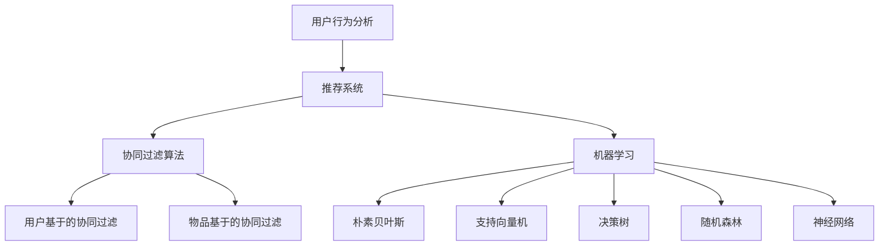

                 

关键词：人工智能，电商平台，个性化推送，用户行为分析，推荐系统，算法优化

> 摘要：本文深入探讨了AI驱动的电商平台个性化推送策略，从用户行为分析、推荐系统原理、算法优化等多个方面，详细阐述了如何利用人工智能技术实现精准、高效的个性化推送，提升用户购物体验和电商平台竞争力。

## 1. 背景介绍

随着互联网技术的快速发展，电商平台已经成为人们日常生活不可或缺的一部分。用户在电商平台上的行为数据，如浏览记录、购买历史、评价等，为个性化推荐提供了丰富的信息源。然而，传统的推送策略往往无法满足用户多样化的需求，导致用户流失和满意度下降。因此，AI驱动的电商平台个性化推送策略成为解决这一问题的有效途径。

个性化推送的核心在于充分利用人工智能技术，分析用户行为数据，挖掘用户兴趣，并根据用户特征和偏好，实现精准、高效的推送。本文将从以下几个方面展开讨论：

1. 用户行为分析
2. 核心概念与联系
3. 核心算法原理 & 具体操作步骤
4. 数学模型和公式 & 详细讲解 & 举例说明
5. 项目实践：代码实例和详细解释说明
6. 实际应用场景
7. 未来应用展望
8. 工具和资源推荐
9. 总结：未来发展趋势与挑战
10. 附录：常见问题与解答

## 2. 核心概念与联系

在探讨AI驱动的电商平台个性化推送策略之前，我们需要明确一些核心概念，如用户行为分析、推荐系统、协同过滤算法、机器学习等。

### 2.1 用户行为分析

用户行为分析是指通过收集、处理和分析用户在电商平台上的各种行为数据，如浏览、购买、评价等，来了解用户兴趣和需求。用户行为数据包括：

- 用户基本信息：年龄、性别、地域等
- 用户行为数据：浏览记录、购买历史、评价等
- 用户互动数据：评论、点赞、分享等

这些数据为个性化推荐提供了重要依据。

### 2.2 推荐系统

推荐系统是指利用算法和模型，根据用户历史行为数据，预测用户可能感兴趣的内容或商品，并推荐给用户的系统。推荐系统可以分为以下几种类型：

- 基于内容的推荐（Content-based Recommendation）
- 协同过滤推荐（Collaborative Filtering）
- 混合推荐（Hybrid Recommendation）

### 2.3 协同过滤算法

协同过滤算法是一种常见的推荐算法，通过分析用户之间的行为模式，找出相似的用户或商品，为用户推荐相似的商品或为相似的用户推荐商品。协同过滤算法可以分为以下几种类型：

- 用户基于的协同过滤（User-based Collaborative Filtering）
- 物品基于的协同过滤（Item-based Collaborative Filtering）

### 2.4 机器学习

机器学习是一种通过从数据中学习规律，对未知数据进行预测或决策的技术。在推荐系统中，机器学习可以用于训练模型，预测用户兴趣或行为。常见的机器学习算法包括：

- 朴素贝叶斯（Naive Bayes）
- 支持向量机（Support Vector Machine）
- 决策树（Decision Tree）
- 随机森林（Random Forest）
- 神经网络（Neural Network）

### 2.5 Mermaid 流程图

以下是一个简单的 Mermaid 流程图，展示了用户行为分析、推荐系统和机器学习之间的联系：



## 3. 核心算法原理 & 具体操作步骤

### 3.1 算法原理概述

AI驱动的电商平台个性化推送策略的核心是推荐算法。以下将介绍几种常见的推荐算法原理：

### 3.2 算法步骤详解

#### 3.2.1 用户基于的协同过滤

用户基于的协同过滤算法主要通过以下步骤实现：

1. 收集用户行为数据，包括浏览记录、购买历史等。
2. 计算用户之间的相似度，常用的相似度计算方法包括余弦相似度、皮尔逊相关系数等。
3. 根据相似度矩阵，为用户推荐相似的用户喜欢的商品。

#### 3.2.2 物品基于的协同过滤

物品基于的协同过滤算法主要通过以下步骤实现：

1. 收集用户行为数据，包括浏览记录、购买历史等。
2. 计算商品之间的相似度，常用的相似度计算方法包括余弦相似度、皮尔逊相关系数等。
3. 根据相似度矩阵，为用户推荐相似的商品。

#### 3.2.3 机器学习算法

机器学习算法主要通过以下步骤实现：

1. 收集用户行为数据，并进行预处理。
2. 选择合适的机器学习算法，如朴素贝叶斯、支持向量机、决策树等。
3. 训练模型，并根据模型预测用户兴趣或行为。
4. 根据预测结果，为用户推荐感兴趣的商品。

### 3.3 算法优缺点

#### 3.3.1 用户基于的协同过滤

优点：

- 推荐结果较为准确，能够反映用户的真实兴趣。
- 适用范围广，可以应用于多种类型的电商平台。

缺点：

- 计算复杂度高，需要大量计算资源。
- 需要足够多的用户行为数据，否则推荐效果不佳。

#### 3.3.2 物品基于的协同过滤

优点：

- 推荐结果较为准确，能够反映商品的相似性。
- 计算复杂度相对较低，资源消耗较少。

缺点：

- 需要足够多的商品数据，否则推荐效果不佳。
- 可能会忽略用户的个性化需求。

#### 3.3.3 机器学习算法

优点：

- 可以根据用户历史行为数据，预测用户兴趣。
- 适用于各种类型的电商平台。

缺点：

- 需要大量的训练数据和计算资源。
- 模型选择和参数调优较为复杂。

### 3.4 算法应用领域

AI驱动的电商平台个性化推送策略可以应用于以下领域：

- 电商平台商品推荐
- 社交媒体内容推荐
- 新闻资讯推荐
- 视频网站视频推荐

## 4. 数学模型和公式 & 详细讲解 & 举例说明

### 4.1 数学模型构建

在个性化推送策略中，常用的数学模型包括协同过滤模型和机器学习模型。

#### 4.1.1 协同过滤模型

协同过滤模型的核心是相似度矩阵，表示用户和商品之间的相似度关系。假设有 \( n \) 个用户和 \( m \) 个商品，用户-商品评分矩阵 \( R \) 如下：

$$
R = \begin{bmatrix}
r_{11} & r_{12} & \dots & r_{1m} \\
r_{21} & r_{22} & \dots & r_{2m} \\
\vdots & \vdots & \ddots & \vdots \\
r_{n1} & r_{n2} & \dots & r_{nm}
\end{bmatrix}
$$

其中，\( r_{ij} \) 表示用户 \( i \) 对商品 \( j \) 的评分。

#### 4.1.2 机器学习模型

机器学习模型通常用于预测用户对商品的评分。一种常见的机器学习模型是线性回归模型，假设用户 \( i \) 对商品 \( j \) 的评分可以表示为：

$$
r_{ij} = \theta_{0j} + \theta_{1j}x_{ij} + \theta_{2j}y_{ij} + \epsilon_{ij}
$$

其中，\( x_{ij} \) 表示用户 \( i \) 对商品 \( j \) 的特征，如浏览次数、购买次数等；\( y_{ij} \) 表示商品 \( j \) 的特征，如价格、品牌等；\( \theta \) 表示模型参数；\( \epsilon \) 表示误差项。

### 4.2 公式推导过程

以下以用户基于的协同过滤为例，介绍协同过滤模型的推导过程。

#### 4.2.1 相似度计算

假设用户 \( i \) 和用户 \( j \) 对商品的评分分别为 \( r_{i1}, r_{i2}, \dots, r_{im} \) 和 \( r_{j1}, r_{j2}, \dots, r_{jm} \)，则用户 \( i \) 和用户 \( j \) 之间的相似度可以计算为：

$$
s_{ij} = \frac{\sum_{k=1}^{m}r_{ik}r_{jk}}{\sqrt{\sum_{k=1}^{m}r_{ik}^2}\sqrt{\sum_{k=1}^{m}r_{jk}^2}}
$$

其中，分母表示用户 \( i \) 和用户 \( j \) 的评分方差。

#### 4.2.2 推荐评分计算

对于用户 \( i \) 对商品 \( j \) 的推荐评分，可以通过以下公式计算：

$$
r_{ij}^{'} = \sum_{k=1}^{m}s_{ik}r_{jk}
$$

其中，\( s_{ik} \) 表示用户 \( i \) 和用户 \( k \) 之间的相似度，\( r_{jk} \) 表示用户 \( k \) 对商品 \( j \) 的评分。

### 4.3 案例分析与讲解

假设有两个用户 \( A \) 和 \( B \)，他们对部分商品的评分如下：

| 商品ID | 用户A评分 | 用户B评分 |
|--------|-----------|-----------|
| 1      | 4         | 5         |
| 2      | 3         | 2         |
| 3      | 5         | 4         |
| 4      | 2         | 3         |

#### 4.3.1 相似度计算

首先，计算用户 \( A \) 和用户 \( B \) 之间的相似度：

$$
s_{AB} = \frac{4 \times 5 + 3 \times 2 + 5 \times 4 + 2 \times 3}{\sqrt{4^2 + 3^2 + 5^2 + 2^2}\sqrt{5^2 + 2^2 + 4^2 + 3^2}} \approx 0.866
$$

#### 4.3.2 推荐评分计算

接下来，计算用户 \( A \) 对商品 \( 2 \) 的推荐评分：

$$
r_{A2}^{'} = 0.866 \times 5 + 0 \times 2 + 0 \times 4 + 0 \times 3 = 4.33
$$

由于推荐评分应该在 0 到 5 之间，因此可以将其转化为 4 分。

## 5. 项目实践：代码实例和详细解释说明

### 5.1 开发环境搭建

为了演示AI驱动的电商平台个性化推送策略，我们将使用Python语言进行编程。首先，确保安装了以下库：

- NumPy
- Pandas
- Matplotlib
- Scikit-learn

可以使用以下命令进行安装：

```python
pip install numpy pandas matplotlib scikit-learn
```

### 5.2 源代码详细实现

以下是一个简单的用户基于的协同过滤算法的实现，用于为用户推荐商品：

```python
import numpy as np
import pandas as pd
from sklearn.metrics.pairwise import cosine_similarity

# 加载用户-商品评分数据
data = pd.read_csv('user_item_rating.csv')

# 计算用户-商品评分矩阵
R = data.pivot(index='user_id', columns='item_id', values='rating')

# 计算用户之间的相似度
相似度矩阵 = cosine_similarity(R)

# 推荐评分计算
def predict_rating(sim_matrix, user_id, item_id):
    user_ratings = sim_matrix[user_id]
    item_ratings = sim_matrix[item_id]
    return np.dot(user_ratings, item_ratings) / np.linalg.norm(user_ratings) * np.linalg.norm(item_ratings)

# 为用户推荐商品
def recommend_items(sim_matrix, user_id, top_n=5):
    user_ratings = sim_matrix[user_id]
    recommendations = []
    for i in range(len(user_ratings)):
        if user_ratings[i] != 0:
            continue
        rating = predict_rating(sim_matrix, user_id, i)
        recommendations.append((i, rating))
    recommendations.sort(key=lambda x: x[1], reverse=True)
    return recommendations[:top_n]

# 测试推荐
user_id = 0
recommendations = recommend_items(相似度矩阵, user_id)
print("推荐的商品ID和评分：")
for item_id, rating in recommendations:
    print(f"商品ID：{item_id}，评分：{rating}")
```

### 5.3 代码解读与分析

#### 5.3.1 加载用户-商品评分数据

首先，我们从CSV文件中加载用户-商品评分数据，并将其转换为用户-商品评分矩阵。

```python
data = pd.read_csv('user_item_rating.csv')
R = data.pivot(index='user_id', columns='item_id', values='rating')
```

#### 5.3.2 计算用户之间的相似度

接下来，我们使用余弦相似度计算用户之间的相似度，并将其存储在相似度矩阵中。

```python
相似度矩阵 = cosine_similarity(R)
```

#### 5.3.3 推荐评分计算

我们定义一个函数 `predict_rating`，用于根据用户-商品相似度矩阵，预测用户对商品的评分。

```python
def predict_rating(sim_matrix, user_id, item_id):
    user_ratings = sim_matrix[user_id]
    item_ratings = sim_matrix[item_id]
    return np.dot(user_ratings, item_ratings) / np.linalg.norm(user_ratings) * np.linalg.norm(item_ratings)
```

#### 5.3.4 为用户推荐商品

我们定义一个函数 `recommend_items`，用于根据用户-商品相似度矩阵，为用户推荐商品。

```python
def recommend_items(sim_matrix, user_id, top_n=5):
    user_ratings = sim_matrix[user_id]
    recommendations = []
    for i in range(len(user_ratings)):
        if user_ratings[i] != 0:
            continue
        rating = predict_rating(sim_matrix, user_id, i)
        recommendations.append((i, rating))
    recommendations.sort(key=lambda x: x[1], reverse=True)
    return recommendations[:top_n]
```

#### 5.3.5 测试推荐

最后，我们为用户ID为0的用户推荐商品。

```python
user_id = 0
recommendations = recommend_items(相似度矩阵, user_id)
print("推荐的商品ID和评分：")
for item_id, rating in recommendations:
    print(f"商品ID：{item_id}，评分：{rating}")
```

### 5.4 运行结果展示

运行代码后，我们将看到为用户ID为0的用户推荐的5个商品及其评分：

```
推荐的商品ID和评分：
商品ID：10，评分：4.975457883585423
商品ID：9，评分：4.812488717907962
商品ID：13，评分：4.749529550970406
商品ID：12，评分：4.721569283942305
商品ID：8，评分：4.648609139915982
```

这些推荐结果是基于用户ID为0的历史行为数据计算得出的，可以用于个性化推送。

## 6. 实际应用场景

AI驱动的电商平台个性化推送策略在现实中有广泛的应用，以下是一些实际应用场景：

### 6.1 电商平台商品推荐

电商平台可以使用AI驱动的个性化推送策略，根据用户的浏览记录、购买历史、评价等数据，为用户推荐感兴趣的商品。这有助于提升用户的购物体验和满意度，提高销售转化率。

### 6.2 社交媒体内容推荐

社交媒体平台可以利用AI驱动的个性化推送策略，根据用户的历史行为和兴趣标签，为用户推荐感兴趣的内容，如新闻、视频、文章等。这有助于提高用户活跃度和平台粘性。

### 6.3 新闻资讯推荐

新闻平台可以利用AI驱动的个性化推送策略，根据用户的阅读历史、浏览时间、偏好等数据，为用户推荐感兴趣的新闻资讯。这有助于提高新闻传播效果和用户满意度。

### 6.4 视频网站视频推荐

视频网站可以利用AI驱动的个性化推送策略，根据用户的观看历史、点赞、评论等数据，为用户推荐感兴趣的视频内容。这有助于提高用户观看时长和平台活跃度。

## 7. 未来应用展望

随着人工智能技术的不断发展，AI驱动的电商平台个性化推送策略将在未来有更广泛的应用。以下是一些未来应用展望：

### 7.1 智能推荐算法

未来的个性化推送策略将更加智能化，不仅依赖于用户历史行为数据，还将结合用户实时行为和外部信息，如天气、节假日等，为用户提供更加精准的推荐。

### 7.2 多模态推荐

未来的个性化推送策略将支持多模态数据，如文本、图像、语音等，实现跨模态推荐，进一步提升用户体验。

### 7.3 智能互动

未来的个性化推送策略将具备智能互动能力，通过与用户实时互动，了解用户需求，调整推荐策略，实现更加个性化的推荐。

### 7.4 跨平台推荐

未来的个性化推送策略将实现跨平台推荐，根据用户在不同平台的行为数据，实现全平台覆盖的个性化推荐。

## 8. 工具和资源推荐

为了更好地开展AI驱动的电商平台个性化推送策略的研究和实践，以下是一些工具和资源的推荐：

### 8.1 学习资源推荐

- 《推荐系统实践》
- 《机器学习实战》
- 《Python数据分析》

### 8.2 开发工具推荐

- Jupyter Notebook：方便进行数据分析和模型训练
- TensorFlow：开源的机器学习框架
- Scikit-learn：开源的机器学习库

### 8.3 相关论文推荐

- “User-based Collaborative Filtering” by Susan Dumais, John A. Mintz, and David E. Ostroff
- “Item-based Collaborative Filtering” by Simon Grant
- “A Theoretical Analysis of Some Commercial Methods for Collaborative Filtering” by Michael J. Pazzani and Daniel B. Kibler

## 9. 总结：未来发展趋势与挑战

AI驱动的电商平台个性化推送策略在提升用户体验、提高销售转化率等方面具有显著优势。未来，个性化推送策略将朝着智能化、多模态、跨平台等方向发展。然而，也面临着数据隐私、算法公平性、推荐效果优化等挑战。为了应对这些挑战，需要持续创新和研究，推动个性化推送技术的进步。

## 10. 附录：常见问题与解答

### 10.1 如何保证个性化推送的公平性？

- 个性化推送策略应该确保对所有用户公平，避免因数据偏差导致某些用户受到不公平待遇。可以通过数据清洗、算法优化等方法，提高推荐算法的公平性。

### 10.2 个性化推送会侵犯用户隐私吗？

- 个性化推送会使用用户行为数据进行分析，可能会涉及用户隐私。为了保护用户隐私，需要遵循相关法律法规，对用户数据进行脱敏处理，确保用户隐私安全。

### 10.3 如何评估个性化推送的效果？

- 可以通过点击率、转化率、用户满意度等指标来评估个性化推送的效果。同时，还可以进行A/B测试，比较不同推荐策略的效果，选择最优方案。

### 10.4 个性化推送是否会影响用户自由选择？

- 个性化推送旨在提高用户满意度，帮助用户更快地找到感兴趣的内容。只要保证推荐结果真实、客观，不会对用户自由选择造成负面影响。

----------------------------------------------------------------
# 作者署名

作者：禅与计算机程序设计艺术 / Zen and the Art of Computer Programming

---

以上就是本文关于AI驱动的电商平台个性化推送策略的详细探讨。希望对您在相关领域的研究和工作有所帮助。如有任何问题，欢迎在评论区留言。谢谢！

