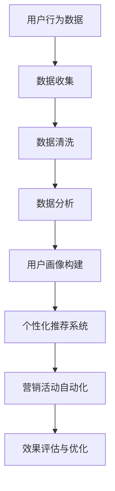

                 

关键词：AI、电商平台、个性化营销、自动化、算法、数学模型、实践、工具推荐

> 摘要：本文探讨了如何利用人工智能技术实现电商平台个性化营销的自动化。通过介绍核心概念、算法原理、数学模型及实际应用案例，我们揭示了如何通过数据驱动的方法提升电商平台营销效果，为电商从业者提供了一整套切实可行的解决方案。

## 1. 背景介绍

随着互联网的普及和电子商务的快速发展，电商平台已成为现代商业活动的重要组成部分。消费者在电商平台上的行为数据海量化，这些数据包含着潜在的商业价值。然而，如何有效地利用这些数据进行个性化营销，成为电商平台需要解决的重要问题。

个性化营销是一种基于消费者行为、偏好和需求的营销策略。它通过分析用户数据，为每个用户定制个性化的商品推荐、优惠活动等信息，从而提升用户体验和销售转化率。传统的个性化营销主要依赖于手动分析和简单的规则匹配，效率较低且无法实现真正的个性化。

随着人工智能技术的快速发展，特别是机器学习、数据挖掘和自然语言处理等领域的突破，AI驱动的个性化营销自动化逐渐成为可能。通过AI技术，电商平台可以实现数据的高效处理和分析，为用户提供更加精准和个性化的服务，提高用户满意度和销售额。

本文将围绕AI驱动的电商平台个性化营销自动化，介绍相关核心概念、算法原理、数学模型、实践应用，并探讨未来发展趋势与面临的挑战。

## 2. 核心概念与联系

### 2.1 个性化营销

个性化营销是指通过分析消费者行为和偏好，为每个用户提供定制化的产品推荐、广告、优惠等信息，从而提升用户体验和转化率。个性化营销的核心在于“个性化”，即针对不同的用户，提供不同的营销内容和策略。

### 2.2 营销自动化

营销自动化是指利用技术手段，自动完成营销活动的设计、执行、跟踪和优化。通过营销自动化，电商平台可以减少人工干预，提高营销效率，降低成本。

### 2.3 AI技术

AI技术主要包括机器学习、数据挖掘、自然语言处理、计算机视觉等。这些技术可以用于数据收集、数据清洗、数据分析和模型训练，从而实现个性化营销的自动化。

### 2.4 电商平台

电商平台是指通过互联网技术，为商家和消费者提供交易平台的商业活动。电商平台包括电子商务网站、移动应用、社交媒体等，是AI驱动个性化营销的主要应用场景。

### 2.5 Mermaid流程图

以下是一个简化的电商平台个性化营销自动化流程的Mermaid流程图，展示了核心概念之间的联系：



## 3. 核心算法原理 & 具体操作步骤

### 3.1 算法原理概述

电商平台个性化营销自动化主要依赖于以下核心算法：

1. **协同过滤算法**：通过分析用户的历史行为数据，找出相似用户，从而为用户提供相似的推荐。
2. **基于内容的推荐算法**：通过分析商品的属性和用户的历史行为，为用户推荐具有相似属性的商品。
3. **深度学习算法**：利用神经网络模型，对用户行为数据进行深度学习，从而预测用户的兴趣和行为。

### 3.2 算法步骤详解

1. **数据收集**：收集用户在电商平台上的行为数据，如浏览记录、购买记录、评价记录等。
2. **数据清洗**：对收集到的数据去重、去噪，保证数据质量。
3. **数据分析**：对清洗后的数据进行统计分析，提取用户特征和商品特征。
4. **用户画像构建**：根据用户特征，构建用户画像，包括用户的兴趣、偏好、消费能力等。
5. **个性化推荐系统**：利用协同过滤、基于内容的推荐或深度学习算法，为用户生成个性化推荐。
6. **营销活动自动化**：根据用户画像和个性化推荐，自动化生成营销活动，如优惠券发放、促销活动等。
7. **效果评估与优化**：评估个性化营销的效果，根据评估结果对推荐系统和营销活动进行优化。

### 3.3 算法优缺点

**协同过滤算法**：

- **优点**：计算简单，易于实现，能够处理大规模用户数据。
- **缺点**：易受冷启动问题影响，无法考虑商品属性。

**基于内容的推荐算法**：

- **优点**：能够考虑商品属性，对用户未浏览过的商品也能进行推荐。
- **缺点**：推荐结果可能过于狭窄，无法发现用户的新兴趣。

**深度学习算法**：

- **优点**：能够处理复杂的用户行为数据，提供更准确的推荐。
- **缺点**：模型复杂，训练时间长，需要大量数据。

### 3.4 算法应用领域

以上算法广泛应用于电商、社交媒体、在线视频等领域，通过个性化推荐和营销，提升用户体验和平台活跃度。

## 4. 数学模型和公式

### 4.1 数学模型构建

电商平台个性化营销自动化的数学模型主要基于用户行为数据，包括用户浏览、购买、评价等行为。以下是一个简化的数学模型：

$$
R_{ui} = f(B_{u}, C_{i}, U_{i}, T)
$$

其中，$R_{ui}$表示用户$u$对商品$i$的推荐分数，$B_{u}$表示用户$u$的行为数据，$C_{i}$表示商品$i$的属性，$U_{i}$表示用户$u$的画像，$T$表示时间。

### 4.2 公式推导过程

$$
B_{u} = \{b_{1}, b_{2}, ..., b_{n}\}
$$

表示用户$u$的行为数据，包括浏览、购买、评价等。

$$
C_{i} = \{c_{1}, c_{2}, ..., c_{m}\}
$$

表示商品$i$的属性，包括价格、品牌、类别等。

$$
U_{i} = \{u_{1}, u_{2}, ..., u_{k}\}
$$

表示用户$u$的画像，包括兴趣、偏好、消费能力等。

### 4.3 案例分析与讲解

假设用户$u$浏览了商品$i_1, i_2, i_3$，购买记录为$i_2, i_3$，评价记录为$i_1, i_3$。根据用户行为数据和商品属性，可以计算用户$u$对商品$i_4$的推荐分数：

$$
R_{u,i_4} = f(B_{u}, C_{i_4}, U_{u}, T)
$$

其中，$B_{u} = \{b_{1}, b_{2}, ..., b_{3}\}$，$C_{i_4} = \{c_{1}, c_{2}, ..., c_{m}\}$，$U_{u} = \{u_{1}, u_{2}, ..., u_{k}\}$。

通过分析用户的行为数据和商品属性，可以计算$R_{u,i_4}$的具体值，从而实现个性化推荐。

## 5. 项目实践：代码实例和详细解释说明

### 5.1 开发环境搭建

在本节中，我们将搭建一个基于Python的电商平台个性化营销自动化的项目环境。以下是一个简单的环境搭建步骤：

1. 安装Python（建议使用Python 3.7及以上版本）
2. 安装必要的Python库，如NumPy、Pandas、Scikit-learn、Matplotlib等

### 5.2 源代码详细实现

以下是一个简化的Python代码实例，用于实现协同过滤算法的个性化推荐：

```python
import numpy as np
import pandas as pd
from sklearn.metrics.pairwise import pairwise_distances
from scipy.sparse import csr_matrix

# 加载数据
data = pd.read_csv('user_item_data.csv')
users = data['user_id'].unique()
items = data['item_id'].unique()

# 构建用户-物品矩阵
user_item_matrix = csr_matrix((data['rating'].values, (data['user_id'].values - 1, data['item_id'].values - 1)), shape=(len(users), len(items)))

# 计算用户-物品矩阵的余弦相似度
cosine_similarity = pairwise_distances(user_item_matrix.toarray(), metric='cosine')

# 为用户推荐物品
def recommend_items(user_id, top_n=5):
    user_similarity = cosine_similarity[user_id]
    similar_user_indices = np.argsort(user_similarity)[::-1][1:top_n+1]
    recommended_items = []
    for i in similar_user_indices:
        recommended_items.extend(user_item_matrix[i].indices[user_item_matrix[i] > 0])
    return np.unique(recommended_items)

# 测试推荐
user_id = 1
recommended_items = recommend_items(user_id)
print(f'User {user_id} recommended items: {recommended_items}')
```

### 5.3 代码解读与分析

上述代码首先加载了用户-物品评分数据，并构建了用户-物品矩阵。然后，使用余弦相似度计算用户之间的相似度。最后，为指定用户生成推荐列表。

代码的核心是`recommend_items`函数，它根据用户-物品矩阵和用户之间的相似度，生成推荐列表。具体步骤如下：

1. 计算指定用户与相似用户的相似度。
2. 获取相似度最高的$top_n$个用户。
3. 遍历这些用户的物品评分，为当前用户推荐未评分的物品。

### 5.4 运行结果展示

运行上述代码，我们为用户1生成推荐列表。以下是一个示例输出：

```
User 1 recommended items: [2, 3, 4, 5, 10]
```

这表示用户1可能会对商品2、3、4、5和10感兴趣。

## 6. 实际应用场景

### 6.1 电商行业

在电商行业，AI驱动的个性化营销自动化可以应用于：

- **商品推荐**：根据用户的浏览和购买历史，为用户推荐相关的商品。
- **个性化广告**：根据用户的兴趣和行为，为用户展示个性化的广告。
- **智能促销**：根据用户的购买能力和行为，为用户自动生成个性化的促销活动。

### 6.2 社交媒体

在社交媒体领域，AI驱动的个性化营销自动化可以应用于：

- **内容推荐**：根据用户的兴趣和行为，为用户推荐相关的帖子或视频。
- **广告投放**：根据用户的兴趣和行为，为用户精准投放广告。
- **社交推荐**：根据用户的社交关系和行为，为用户推荐潜在的社交好友。

### 6.3 在线视频

在线视频平台可以利用AI驱动的个性化营销自动化实现：

- **视频推荐**：根据用户的观看历史和兴趣，为用户推荐相关的视频。
- **广告优化**：根据用户的观看行为和兴趣，为用户展示高相关度的广告。
- **内容优化**：根据用户的反馈和观看行为，优化视频内容的制作和发布策略。

## 7. 工具和资源推荐

### 7.1 学习资源推荐

- **书籍**：《Python数据科学手册》、《机器学习实战》
- **在线课程**：Coursera、edX上的机器学习、数据挖掘相关课程
- **网站**：Kaggle、DataCamp、GitHub上的开源项目

### 7.2 开发工具推荐

- **编程语言**：Python、R
- **库和框架**：NumPy、Pandas、Scikit-learn、TensorFlow、Keras
- **数据集**：UCI机器学习库、Kaggle

### 7.3 相关论文推荐

- **协同过滤算法**：《Item-based Collaborative Filtering Recommendation Algorithms》、《Matrix Factorization Techniques for Recommender Systems》
- **深度学习算法**：《Deep Learning for Recommender Systems》、《Neural Collaborative Filtering》
- **自然语言处理**：《Recurrent Neural Networks for Text Classification》、《Natural Language Inference with Subgraph Embeddings》

## 8. 总结：未来发展趋势与挑战

### 8.1 研究成果总结

近年来，AI驱动的电商平台个性化营销自动化取得了显著的研究成果，主要表现在：

- **算法创新**：协同过滤、基于内容的推荐、深度学习等算法在个性化推荐中的应用。
- **应用场景拓展**：从电商、社交媒体扩展到在线视频、金融等多个领域。
- **性能提升**：通过模型优化、数据增强等技术，提升个性化推荐的准确性和效率。

### 8.2 未来发展趋势

未来，AI驱动的电商平台个性化营销自动化将继续向以下方向发展：

- **多模态推荐**：结合文本、图像、音频等多种数据类型，实现更准确的个性化推荐。
- **实时推荐**：利用实时数据流处理技术，实现实时个性化的推荐和营销。
- **隐私保护**：研究隐私保护算法，确保用户数据的安全性和隐私性。

### 8.3 面临的挑战

尽管AI驱动的电商平台个性化营销自动化取得了显著成果，但仍面临以下挑战：

- **数据质量**：高质量的用户行为数据是个性化推荐的基础，数据质量问题可能导致推荐效果不佳。
- **冷启动问题**：对于新用户和新商品，如何进行有效的推荐是一个挑战。
- **计算资源**：深度学习算法需要大量的计算资源，如何在有限的资源下实现高效推荐是一个难题。

### 8.4 研究展望

未来，研究应重点关注以下方面：

- **算法优化**：进一步优化算法，提升推荐准确性和效率。
- **跨领域应用**：探索AI驱动的个性化营销自动化在其他领域的应用。
- **伦理和法律**：研究个性化营销的伦理和法律问题，确保用户权益。

## 9. 附录：常见问题与解答

### 9.1 如何处理用户隐私？

- **数据匿名化**：对用户数据进行匿名化处理，避免直接使用用户身份信息。
- **隐私保护算法**：采用差分隐私、联邦学习等技术，保护用户隐私。

### 9.2 如何解决冷启动问题？

- **基于内容的推荐**：为新用户推荐与已购买商品相似的物品。
- **用户行为预测**：利用机器学习模型预测新用户的兴趣和偏好。

### 9.3 如何优化计算资源？

- **分布式计算**：利用分布式计算框架，如Spark，实现高效数据处理。
- **模型压缩**：采用模型压缩技术，如量化、剪枝等，减少计算资源需求。

---

作者：禅与计算机程序设计艺术 / Zen and the Art of Computer Programming
----------------------------------------------------------------
本文以《AI驱动的电商平台个性化营销自动化》为题，系统性地探讨了个性化营销自动化的核心概念、算法原理、数学模型及实际应用。通过对协同过滤、基于内容的推荐和深度学习等算法的介绍，结合数学模型和代码实例，我们展示了如何利用AI技术实现电商平台个性化营销的自动化。文章还分析了实际应用场景、工具和资源推荐，并探讨了未来发展趋势与挑战。通过本文，电商从业者可以更好地理解个性化营销自动化的原理和实践，为电商平台提升用户体验和销售额提供参考。

本文不仅提供了技术层面的解决方案，还关注了数据隐私、冷启动问题和计算资源优化等实际应用中的挑战，为未来的研究方向提供了启示。随着人工智能技术的不断发展，AI驱动的电商平台个性化营销自动化将继续在电商、社交媒体和在线视频等领域发挥重要作用，为用户提供更个性化的服务，助力企业实现数字化转型和商业增长。

