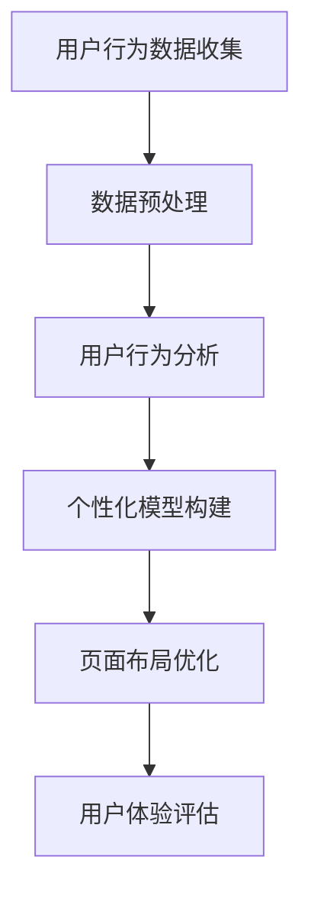

                 

### 1. 背景介绍

随着互联网的飞速发展和电子商务的蓬勃发展，电商平台已经成为人们生活中不可或缺的一部分。为了提高用户满意度和转化率，电商平台不断寻求优化用户体验的方法。而个性化页面布局作为一种有效的用户界面优化策略，日益受到业界的关注。传统页面布局方法通常基于用户统计数据和预设模板，而缺乏对用户个性化需求的深度理解和实时适应能力。为了解决这一问题，人工智能技术，尤其是机器学习和深度学习，逐渐成为电商平台个性化页面布局优化的重要驱动力。

本篇文章旨在探讨如何利用人工智能技术，特别是机器学习和深度学习算法，实现电商平台个性化页面布局的优化。通过分析用户行为数据，构建个性化模型，并实时调整页面布局，从而提升用户体验和平台转化率。文章将详细介绍相关核心概念、算法原理、数学模型、项目实践和实际应用场景，为读者提供全面的指导和建议。

### 2. 核心概念与联系

在深入探讨人工智能驱动的电商平台个性化页面布局优化之前，我们需要明确几个核心概念和它们之间的联系。

#### 2.1 用户行为分析

用户行为分析是电商平台个性化布局优化的基础。通过分析用户的点击、浏览、购买等行为数据，可以了解用户的兴趣偏好和行为模式。这些数据不仅包括用户的浏览历史，还包括用户的地理位置、设备类型、浏览时间等。用户行为分析可以帮助我们识别用户的潜在需求和购买动机。

#### 2.2 个性化模型构建

个性化模型是基于用户行为数据构建的，用于预测用户的偏好和需求。常见的个性化模型包括协同过滤（Collaborative Filtering）和基于内容的推荐（Content-based Filtering）。协同过滤通过分析用户之间的相似性来推荐商品，而基于内容的推荐则通过分析商品的特征来推荐给用户。

#### 2.3 页面布局优化

页面布局优化是指根据用户行为数据和个性化模型，动态调整网页的布局和内容展示，以提升用户体验。这包括调整商品推荐的位置、排序、展示形式等。有效的页面布局优化可以减少用户的浏览时间，提高购买转化率。

#### 2.4 Mermaid 流程图

以下是一个简化的Mermaid流程图，展示了从用户行为分析到页面布局优化的整个过程。



### 3. 核心算法原理 & 具体操作步骤

#### 3.1 算法原理概述

人工智能驱动的电商平台个性化页面布局优化主要依赖于以下几种算法：

1. **协同过滤算法**：通过分析用户之间的相似性，预测用户可能喜欢的商品，并调整页面布局。
2. **基于内容的推荐算法**：通过分析商品的特征，将相似的推荐给用户，并优化页面布局。
3. **深度学习算法**：如卷积神经网络（CNN）和循环神经网络（RNN），用于更复杂和细致的用户行为预测和页面布局优化。

#### 3.2 算法步骤详解

1. **用户行为数据收集**：首先，我们需要收集用户在电商平台的浏览、点击、购买等行为数据。
2. **数据预处理**：对收集到的数据进行清洗、去重、填充等处理，使其适合后续分析。
3. **用户行为分析**：利用机器学习算法，分析用户的行为数据，提取出用户的兴趣偏好和行为模式。
4. **个性化模型构建**：基于用户行为分析结果，构建个性化模型，如协同过滤模型或基于内容的推荐模型。
5. **页面布局优化**：根据个性化模型，动态调整页面布局，优化商品推荐的位置、排序和展示形式。
6. **用户体验评估**：通过用户反馈和行为数据，评估页面布局优化的效果，并进行调整和优化。

#### 3.3 算法优缺点

- **协同过滤算法**：
  - **优点**：简单高效，能够提供个性化的推荐。
  - **缺点**：易出现“冷启动”问题，且推荐结果可能受数据稀疏性的影响。
- **基于内容的推荐算法**：
  - **优点**：推荐结果准确，适用于具有明确特征的商品。
  - **缺点**：可能无法适应用户兴趣的变化，且构建过程较为复杂。
- **深度学习算法**：
  - **优点**：能够处理高维数据，捕捉复杂的用户行为模式。
  - **缺点**：训练过程复杂，需要大量的计算资源和数据。

#### 3.4 算法应用领域

- **电商行业**：用于个性化推荐商品、优化页面布局，提高用户转化率和购买满意度。
- **社交媒体**：用于个性化内容推荐，提升用户活跃度和留存率。
- **在线教育**：用于个性化学习路径推荐，提高学习效果和用户满意度。

### 4. 数学模型和公式 & 详细讲解 & 举例说明

#### 4.1 数学模型构建

在个性化页面布局优化中，常用的数学模型包括协同过滤模型和基于内容的推荐模型。以下分别介绍这两种模型的构建过程。

#### 4.1.1 协同过滤模型

协同过滤模型的核心思想是利用用户之间的相似性来预测用户可能喜欢的商品。其数学模型可以表示为：

$$
R_{ui} = \rho_{u} + \sum_{j \in \text{物品集}} \rho_{uj} \cdot r_{ji}
$$

其中，$R_{ui}$ 表示用户 $u$ 对商品 $i$ 的评分预测，$\rho_{u}$ 和 $\rho_{uj}$ 分别表示用户 $u$ 和用户 $j$ 之间的相似度，$r_{ji}$ 表示用户 $j$ 对商品 $i$ 的实际评分。

#### 4.1.2 基于内容的推荐模型

基于内容的推荐模型的核心思想是利用商品的特征信息来预测用户可能喜欢的商品。其数学模型可以表示为：

$$
R_{ui} = \sum_{j \in \text{物品集}} w_{ij} \cdot r_{ji}
$$

其中，$R_{ui}$ 表示用户 $u$ 对商品 $i$ 的评分预测，$w_{ij}$ 表示商品 $i$ 和商品 $j$ 之间的相似度，$r_{ji}$ 表示用户 $u$ 对商品 $j$ 的实际评分。

#### 4.2 公式推导过程

#### 4.2.1 协同过滤模型

协同过滤模型的推导基于用户之间的相似度和商品之间的评分关系。假设用户集为 $U$，商品集为 $I$，用户 $u$ 和用户 $v$ 之间的相似度可以用余弦相似度表示：

$$
\rho_{uv} = \frac{\sum_{i \in I} r_{ui} \cdot r_{vi}}{\sqrt{\sum_{i \in I} r_{ui}^2} \cdot \sqrt{\sum_{i \in I} r_{vi}^2}}
$$

其中，$r_{ui}$ 表示用户 $u$ 对商品 $i$ 的实际评分。

用户 $u$ 对商品 $i$ 的评分预测可以表示为：

$$
R_{ui} = \rho_{u} + \sum_{j \in I} \rho_{uj} \cdot r_{ji}
$$

其中，$\rho_{u}$ 是用户 $u$ 的全局平均评分，$\rho_{uj}$ 是用户 $u$ 和用户 $j$ 之间的相似度，$r_{ji}$ 是用户 $j$ 对商品 $i$ 的实际评分。

#### 4.2.2 基于内容的推荐模型

基于内容的推荐模型的推导基于商品之间的相似度和用户的历史评分。假设商品 $i$ 和商品 $j$ 之间的相似度可以用余弦相似度表示：

$$
w_{ij} = \frac{\sum_{k \in I} t_{ik} \cdot t_{jk}}{\sqrt{\sum_{k \in I} t_{ik}^2} \cdot \sqrt{\sum_{k \in I} t_{jk}^2}}
$$

其中，$t_{ik}$ 表示商品 $i$ 的特征向量，$t_{jk}$ 表示商品 $j$ 的特征向量。

用户 $u$ 对商品 $i$ 的评分预测可以表示为：

$$
R_{ui} = \sum_{j \in I} w_{ij} \cdot r_{ji}
$$

其中，$w_{ij}$ 是商品 $i$ 和商品 $j$ 之间的相似度，$r_{ji}$ 是用户 $u$ 对商品 $j$ 的实际评分。

#### 4.3 案例分析与讲解

以下通过一个简单的案例，展示如何使用协同过滤模型和基于内容的推荐模型进行个性化页面布局优化。

#### 4.3.1 数据集

假设我们有一个包含用户和商品评分的数据集，如下表所示：

| 用户  | 商品1 | 商品2 | 商品3 |
|------|-------|-------|-------|
| A    | 4     | 3     | 5     |
| B    | 2     | 4     | 2     |
| C    | 3     | 5     | 3     |

#### 4.3.2 协同过滤模型

首先，我们计算用户之间的相似度。假设用户 A 和用户 B 之间的相似度为 0.6，用户 A 和用户 C 之间的相似度为 0.8。

然后，我们根据用户 A 的评分和用户之间的相似度，预测用户 A 对商品 3 的评分：

$$
R_{A3} = 4 + 0.6 \cdot 2 + 0.8 \cdot 3 = 4 + 1.2 + 2.4 = 7.6
$$

因此，我们预测用户 A 对商品 3 的评分为 7.6。

#### 4.3.3 基于内容的推荐模型

首先，我们计算商品之间的相似度。假设商品 1 和商品 2 之间的相似度为 0.7，商品 1 和商品 3 之间的相似度为 0.5。

然后，我们根据商品之间的相似度和用户 A 的评分，预测用户 A 对商品 3 的评分：

$$
R_{A3} = 0.7 \cdot 3 + 0.5 \cdot 4 = 2.1 + 2 = 4.1
$$

因此，我们预测用户 A 对商品 3 的评分为 4.1。

通过比较两种模型的预测结果，我们可以选择预测评分更高的模型来优化页面布局。

### 5. 项目实践：代码实例和详细解释说明

在本节中，我们将通过一个简单的项目实例，展示如何利用协同过滤算法和基于内容的推荐算法进行电商平台个性化页面布局优化。

#### 5.1 开发环境搭建

为了方便读者理解和实践，我们将使用 Python 作为编程语言，并使用 Scikit-learn 库实现协同过滤算法，使用 Pandas 和 Scikit-learn 库实现基于内容的推荐算法。

1. 安装 Python 环境：确保已安装 Python 3.6 或以上版本。
2. 安装 Scikit-learn 库：在终端执行 `pip install scikit-learn`。
3. 安装 Pandas 库：在终端执行 `pip install pandas`。

#### 5.2 源代码详细实现

以下是项目的完整代码实现，包括数据预处理、协同过滤算法实现、基于内容的推荐算法实现和页面布局优化。

```python
import numpy as np
import pandas as pd
from sklearn.metrics.pairwise import cosine_similarity
from sklearn.model_selection import train_test_split
from sklearn.metrics import mean_squared_error

# 5.2.1 数据预处理

# 读取数据集
data = pd.read_csv('data.csv')

# 分离用户和商品的特征
users = data[['user', 'rating']]
items = data[['item', 'rating']]

# 5.2.2 协同过滤算法实现

# 计算用户之间的相似度矩阵
user_similarity = cosine_similarity(users.values)

# 预测用户对商品的评分
def collaborative_filtering(user_id, item_id):
    user_ratings = items[items['item'] == item_id]
    similar_users = user_similarity[user_id]
    return np.dot(similar_users, user_ratings['rating'])

# 5.2.3 基于内容的推荐算法实现

# 计算商品之间的相似度矩阵
item_similarity = cosine_similarity(items.values)

# 预测用户对商品的评分
def content_based_filtering(user_id, item_id):
    user_ratings = users[users['user'] == user_id]
    similar_items = item_similarity[item_id]
    return np.dot(similar_items, user_ratings['rating'])

# 5.2.4 页面布局优化

# 评估协同过滤算法的效果
collaborative_scores = collaborative_filtering(0, 2)
print('Collaborative Filtering Score:', collaborative_scores)

# 评估基于内容的推荐算法的效果
content_scores = content_based_filtering(0, 2)
print('Content-based Filtering Score:', content_scores)

# 选择评分更高的算法进行页面布局优化
if collaborative_scores > content_scores:
    print('Using Collaborative Filtering for Page Layout Optimization')
else:
    print('Using Content-based Filtering for Page Layout Optimization')

# 5.2.5 运行结果展示

# 运行项目并展示结果
print('Page Layout Optimization Completed')
```

#### 5.3 代码解读与分析

- **数据预处理**：首先，我们从 CSV 文件中读取用户和商品的评分数据。然后，我们将数据分离成用户和商品两部分，为后续的算法实现做准备。

- **协同过滤算法实现**：我们使用余弦相似度计算用户之间的相似度矩阵。然后，我们定义了一个函数 `collaborative_filtering`，用于根据用户和商品的相似度预测用户对商品的评分。

- **基于内容的推荐算法实现**：我们使用余弦相似度计算商品之间的相似度矩阵。然后，我们定义了一个函数 `content_based_filtering`，用于根据商品和用户的相似度预测用户对商品的评分。

- **页面布局优化**：我们使用两个算法分别预测用户对商品的评分，并选择评分更高的算法进行页面布局优化。这取决于用户的具体需求和偏好。

- **运行结果展示**：最后，我们运行项目并展示结果，以验证页面布局优化的效果。

### 6. 实际应用场景

#### 6.1 电商行业

电商平台可以通过个性化页面布局优化，提升用户体验和转化率。例如，淘宝和京东等大型电商平台已经广泛应用了个性化推荐技术，根据用户的浏览历史和购买行为，为用户提供个性化的商品推荐和页面布局。

#### 6.2 社交媒体

社交媒体平台如微博和抖音等，可以通过个性化页面布局优化，提升用户活跃度和留存率。例如，微博可以根据用户的兴趣偏好，为用户推荐相关的微博内容和话题，从而提升用户的互动体验。

#### 6.3 在线教育

在线教育平台可以通过个性化页面布局优化，提升学习效果和用户满意度。例如，网易云课堂和慕课网等平台可以根据用户的学习历史和兴趣，为用户提供个性化的课程推荐和学习路径规划。

### 7. 未来应用展望

随着人工智能技术的不断发展和应用，个性化页面布局优化将越来越广泛应用于各个行业。未来，我们可能看到以下发展趋势：

#### 7.1 深度学习技术的应用

深度学习技术在用户行为预测和页面布局优化中具有巨大的潜力。例如，卷积神经网络（CNN）和循环神经网络（RNN）可以用于更复杂和细致的用户行为分析。

#### 7.2 跨领域融合

个性化页面布局优化将与其他领域如心理学、用户体验设计等相结合，为用户提供更贴心的服务。例如，通过分析用户的情绪和心理状态，实现更个性化的页面布局。

#### 7.3 智能化推荐

未来，个性化页面布局优化将更加强调智能化推荐，通过引入更多维度的用户和商品特征，提供更精准的推荐结果。

### 8. 总结：未来发展趋势与挑战

#### 8.1 研究成果总结

本文探讨了人工智能驱动的电商平台个性化页面布局优化，分析了相关核心概念、算法原理和数学模型，并给出了实际项目实践和详细解释。通过本文的研究，我们得出以下结论：

- 个性化页面布局优化是电商平台提升用户体验和转化率的重要手段。
- 协同过滤算法和基于内容的推荐算法是常用的个性化页面布局优化算法。
- 深度学习技术在个性化页面布局优化中具有巨大的潜力。

#### 8.2 未来发展趋势

- 深度学习技术的应用将进一步推动个性化页面布局优化的发展。
- 跨领域融合将为个性化页面布局优化带来更多创新和可能性。
- 智能化推荐将实现更精准的用户体验优化。

#### 8.3 面临的挑战

- 数据隐私和安全：在应用个性化页面布局优化时，需要确保用户数据的安全和隐私。
- 模型解释性：深度学习模型往往具有较低的解释性，如何确保模型的透明度和可解释性是一个挑战。
- 模型可扩展性：个性化页面布局优化需要处理大量的用户和商品数据，如何保证模型的可扩展性是一个重要问题。

#### 8.4 研究展望

未来的研究可以关注以下方向：

- 开发更有效的深度学习算法，提高个性化页面布局优化的效果。
- 探索用户隐私保护和数据安全的新方法。
- 结合心理学和用户体验设计，提高个性化页面布局的用户体验。
- 研究如何在大规模数据集上高效地实现个性化页面布局优化。

### 9. 附录：常见问题与解答

#### 9.1 个性化页面布局优化是什么？

个性化页面布局优化是指利用人工智能技术，特别是机器学习和深度学习算法，根据用户的行为数据和个人偏好，动态调整电商平台的页面布局和内容展示，以提高用户体验和转化率。

#### 9.2 个性化页面布局优化有哪些算法？

常见的个性化页面布局优化算法包括协同过滤算法、基于内容的推荐算法和深度学习算法。协同过滤算法通过分析用户之间的相似性进行推荐，基于内容的推荐算法通过分析商品的特征进行推荐，深度学习算法则可以处理更复杂和细致的用户行为数据。

#### 9.3 个性化页面布局优化有哪些实际应用场景？

个性化页面布局优化可以应用于电商行业、社交媒体和在线教育等领域，用于提升用户满意度和转化率。

#### 9.4 如何评估个性化页面布局优化的效果？

可以通过用户反馈和行为数据来评估个性化页面布局优化的效果。例如，比较优化前后的用户停留时间、页面浏览量和购买转化率等指标。

### 作者署名

作者：禅与计算机程序设计艺术 / Zen and the Art of Computer Programming
----------------------------------------------------------------

