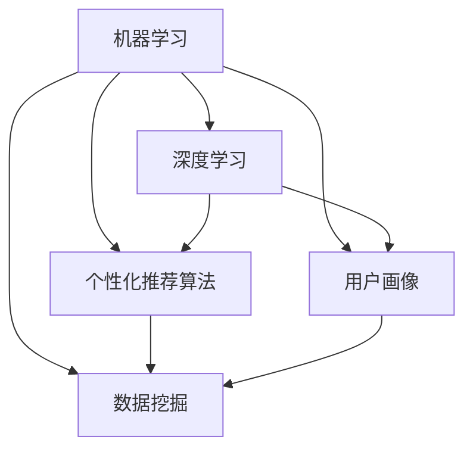

                 

关键词：AI、电商平台、个性化、首页设计、优化、算法、数学模型、代码实例、应用场景、未来展望

> 摘要：本文深入探讨了AI在电商平台个性化首页设计中的应用与优化。通过对核心算法原理、数学模型、代码实例以及实际应用场景的详细分析，为电商平台提供了可行的个性化解决方案。文章旨在为行业从业者提供有价值的参考，助力电商平台在竞争激烈的市场中脱颖而出。

## 1. 背景介绍

在互联网时代，电商平台已经成为人们购物的主要渠道。随着用户数量的激增，如何为用户提供个性化、高效的购物体验成为电商平台亟需解决的问题。个性化首页设计作为一种有效的手段，能够根据用户的偏好和历史行为，动态调整页面内容，从而提高用户的满意度和粘性。然而，传统的个性化设计方法往往存在计算复杂度高、响应速度慢等问题，难以满足海量用户的需求。

近年来，人工智能（AI）技术的发展为电商平台个性化首页设计带来了新的契机。通过机器学习、深度学习等技术，AI能够从海量用户数据中挖掘有价值的信息，实现精准的用户画像和行为预测，从而为用户提供个性化的推荐和服务。本文将详细介绍AI驱动的电商平台个性化首页设计与优化的方法，帮助电商平台提升用户体验和竞争力。

## 2. 核心概念与联系

在探讨AI驱动的电商平台个性化首页设计与优化之前，我们需要了解一些核心概念和原理，以及它们之间的联系。

### 2.1 机器学习与深度学习

机器学习和深度学习是AI领域的两个重要分支。机器学习通过算法从数据中学习规律和模式，从而对未知数据进行预测或分类。深度学习则是机器学习的一种特殊形式，通过多层神经网络进行特征提取和模型训练，能够处理更加复杂的数据和任务。

在电商平台个性化首页设计中，机器学习和深度学习技术可以用于用户行为分析、兴趣识别和推荐算法等环节。

### 2.2 个性化推荐算法

个性化推荐算法是电商平台个性化首页设计的关键组成部分。基于用户的历史行为、兴趣标签和内容属性，推荐算法能够为用户生成个性化的商品或内容推荐列表。常见的个性化推荐算法包括基于协同过滤、基于内容过滤和基于模型的推荐算法等。

### 2.3 用户画像

用户画像是描述用户特征和兴趣的一种抽象表示。通过用户画像，电商平台能够更好地了解用户需求，为其提供个性化的服务。用户画像的构建通常基于用户的基础信息、行为数据、社交数据和内容属性等多维度数据。

### 2.4 数据挖掘

数据挖掘是一种从海量数据中发现有价值信息和知识的方法。在电商平台个性化首页设计中，数据挖掘技术可以用于用户行为分析、用户兴趣识别和推荐算法优化等环节。

### 2.5 Mermaid流程图

为了更清晰地展示核心概念和原理之间的联系，我们可以使用Mermaid流程图进行描述。以下是一个简化的Mermaid流程图，展示了机器学习、深度学习、个性化推荐算法、用户画像是和数据挖掘之间的关系。



## 3. 核心算法原理 & 具体操作步骤

### 3.1 算法原理概述

电商平台个性化首页设计的核心在于为用户提供个性化的推荐和服务。具体来说，核心算法主要包括以下三个步骤：

1. **用户行为分析**：通过分析用户的历史行为数据，如浏览记录、购买记录和搜索记录等，挖掘用户的兴趣点和偏好。
2. **用户画像构建**：基于用户行为分析结果，构建用户画像，描述用户的兴趣偏好和需求。
3. **个性化推荐**：根据用户画像和商品属性，为用户生成个性化的推荐列表，动态调整首页内容。

### 3.2 算法步骤详解

#### 3.2.1 用户行为分析

用户行为分析是电商平台个性化首页设计的基础。通过分析用户的历史行为数据，可以挖掘用户的兴趣点和偏好。具体步骤如下：

1. **数据收集**：收集用户的基础信息（如性别、年龄、地理位置等）和行为数据（如浏览记录、购买记录、搜索记录等）。
2. **数据预处理**：对收集到的数据进行清洗、去重和标准化处理，为后续分析做好准备。
3. **特征提取**：从用户行为数据中提取有价值的特征，如浏览时长、购买频率、搜索关键词等。
4. **行为模式识别**：通过统计分析和机器学习算法，识别用户的行为模式，如用户喜欢的商品类型、品牌偏好等。

#### 3.2.2 用户画像构建

用户画像构建是将用户行为分析结果转化为用户特征描述的过程。通过用户画像，可以更好地了解用户的需求和兴趣，为个性化推荐提供依据。具体步骤如下：

1. **特征选择**：根据用户行为分析结果，选择对用户兴趣和偏好有显著影响的特征。
2. **特征加权**：为每个特征赋予相应的权重，反映其在用户画像中的重要性。
3. **画像构建**：将加权后的特征组合成用户画像，形成一个多维度的特征向量。

#### 3.2.3 个性化推荐

个性化推荐是电商平台个性化首页设计的核心环节。根据用户画像和商品属性，为用户生成个性化的推荐列表。具体步骤如下：

1. **商品特征提取**：提取商品的基本信息（如品牌、价格、分类等）和属性特征（如商品描述、标签等）。
2. **推荐算法选择**：根据用户画像和商品特征，选择合适的推荐算法，如基于协同过滤、基于内容过滤或基于模型的推荐算法。
3. **推荐列表生成**：根据推荐算法，为用户生成个性化的推荐列表，并将其展示在首页上。

### 3.3 算法优缺点

#### 优点

1. **高效性**：通过算法对海量用户数据进行处理，能够快速生成个性化的推荐列表。
2. **精准性**：基于用户画像和商品特征，推荐算法能够为用户提供与其兴趣和偏好高度相关的商品。
3. **适应性**：算法可以根据用户行为的变化，动态调整推荐策略，提高用户体验。

#### 缺点

1. **计算复杂度高**：算法需要对海量用户数据进行分析和处理，计算复杂度较高。
2. **数据依赖性强**：算法的性能依赖于用户行为数据的完整性和准确性。
3. **冷启动问题**：对于新用户，由于缺乏历史行为数据，算法难以为其生成有效的推荐列表。

### 3.4 算法应用领域

电商平台个性化首页设计算法可以应用于多个领域，包括但不限于：

1. **电商网站**：为用户提供个性化的商品推荐和服务，提高用户满意度和粘性。
2. **社交媒体**：为用户提供个性化内容推荐，提高用户参与度和活跃度。
3. **在线教育**：为用户提供个性化的课程推荐和学习计划，提高学习效果。
4. **医疗健康**：为用户提供个性化的健康建议和医疗服务，提高健康管理水平。

## 4. 数学模型和公式 & 详细讲解 & 举例说明

在电商平台个性化首页设计中，数学模型和公式是算法的核心组成部分。本节将详细介绍相关数学模型和公式的构建、推导过程，并通过具体案例进行讲解。

### 4.1 数学模型构建

电商平台个性化首页设计的数学模型主要包括用户画像构建模型、推荐算法模型和优化模型。

#### 4.1.1 用户画像构建模型

用户画像构建模型是一个基于多维度特征的加权综合模型，用于描述用户的兴趣偏好和需求。假设用户 \( u \) 的特征集为 \( X = \{x_1, x_2, ..., x_n\} \)，其中每个特征 \( x_i \) 对应一个权重 \( w_i \)，则用户画像 \( P \) 可以表示为：

\[ P = \sum_{i=1}^{n} w_i x_i \]

其中，权重 \( w_i \) 可以通过特征的重要性和用户历史数据进行分析和计算。

#### 4.1.2 推荐算法模型

推荐算法模型是一个基于用户画像和商品特征的匹配模型，用于为用户生成个性化的推荐列表。假设用户画像 \( P \) 和商品特征集 \( G = \{g_1, g_2, ..., g_m\} \)，其中每个商品特征 \( g_j \) 对应一个权重 \( v_j \)，则推荐分数 \( R \) 可以表示为：

\[ R = \sum_{j=1}^{m} v_j g_j \cdot P \]

其中，权重 \( v_j \) 可以通过商品的重要性和用户历史数据进行分析和计算。

#### 4.1.3 优化模型

优化模型是一个基于推荐算法的优化模型，用于调整推荐结果，提高用户体验。优化模型可以通过调整权重 \( w_i \) 和 \( v_j \)，优化推荐分数 \( R \)，从而提高推荐效果。

### 4.2 公式推导过程

在本节中，我们将对上述数学模型中的相关公式进行推导。

#### 4.2.1 用户画像构建模型推导

用户画像构建模型中，权重 \( w_i \) 的计算可以通过最大化用户画像 \( P \) 的预测误差来实现。假设用户 \( u \) 的真实兴趣值为 \( y \)，则预测误差 \( E \) 可以表示为：

\[ E = |y - P| \]

为了最小化预测误差，我们可以使用梯度下降法来计算权重 \( w_i \)。假设当前权重为 \( w_i^{(t)} \)，则更新公式为：

\[ w_i^{(t+1)} = w_i^{(t)} - \alpha \cdot \frac{\partial E}{\partial w_i} \]

其中，\( \alpha \) 为学习率。

#### 4.2.2 推荐算法模型推导

推荐算法模型中，权重 \( v_j \) 的计算可以通过最大化用户画像 \( P \) 和商品特征 \( g_j \) 的相似度来实现。假设用户画像 \( P \) 和商品特征 \( g_j \) 的相似度 \( S \) 可以表示为：

\[ S = \frac{P \cdot g_j}{||P|| \cdot ||g_j||} \]

其中，\( ||P|| \) 和 \( ||g_j|| \) 分别为用户画像和商品特征的欧几里得范数。

为了最大化相似度 \( S \)，我们可以使用梯度上升法来计算权重 \( v_j \)。假设当前权重为 \( v_j^{(t)} \)，则更新公式为：

\[ v_j^{(t+1)} = v_j^{(t)} + \alpha \cdot \frac{\partial S}{\partial v_j} \]

### 4.3 案例分析与讲解

为了更好地理解数学模型和公式，我们将通过一个具体的案例进行讲解。

#### 4.3.1 案例背景

假设有一个电商平台，用户名为 \( u \)，其历史行为数据包括浏览记录、购买记录和搜索记录。用户 \( u \) 的特征集为 \( X = \{x_1, x_2, x_3\} \)，其中 \( x_1 \) 表示用户浏览的商品类型，\( x_2 \) 表示用户购买的商品类型，\( x_3 \) 表示用户搜索的商品关键词。

假设用户 \( u \) 的权重为 \( W = \{w_1, w_2, w_3\} \)，其中 \( w_1 = 0.3 \)，\( w_2 = 0.5 \)，\( w_3 = 0.2 \)。商品特征集为 \( G = \{g_1, g_2, g_3\} \)，其中 \( g_1 \) 表示商品类型，\( g_2 \) 表示商品价格，\( g_3 \) 表示商品评价。

#### 4.3.2 案例分析

1. **用户画像构建**

根据用户 \( u \) 的历史行为数据，可以计算出用户画像 \( P \)：

\[ P = W \cdot X = \{0.3 \cdot x_1, 0.5 \cdot x_2, 0.2 \cdot x_3\} \]

2. **推荐算法模型**

根据用户画像 \( P \) 和商品特征 \( G \)，可以计算出推荐分数 \( R \)：

\[ R = \sum_{j=1}^{3} v_j g_j \cdot P = v_1 g_1 \cdot P + v_2 g_2 \cdot P + v_3 g_3 \cdot P \]

其中，权重 \( v_j \) 可以通过最大化用户画像和商品特征的相似度来计算：

\[ v_j = \frac{P \cdot g_j}{||P|| \cdot ||g_j||} \]

3. **优化模型**

为了提高推荐效果，可以调整权重 \( W \) 和 \( v_j \)：

\[ W^{(t+1)} = W^{(t)} - \alpha \cdot \frac{\partial E}{\partial W} \]
\[ v_j^{(t+1)} = v_j^{(t)} + \alpha \cdot \frac{\partial S}{\partial v_j} \]

通过不断优化，可以提高推荐效果。

## 5. 项目实践：代码实例和详细解释说明

在本节中，我们将通过一个具体的代码实例，展示AI驱动的电商平台个性化首页设计与优化的实现过程，并对关键代码进行详细解释说明。

### 5.1 开发环境搭建

为了实现AI驱动的电商平台个性化首页设计与优化，我们需要搭建一个合适的开发环境。以下是推荐的开发工具和库：

1. **编程语言**：Python（支持科学计算和机器学习库）
2. **开发工具**：Jupyter Notebook（交互式编程环境）
3. **机器学习库**：Scikit-learn、TensorFlow、PyTorch（提供机器学习模型和算法）
4. **数据处理库**：Pandas、NumPy（提供数据处理和数据分析功能）

### 5.2 源代码详细实现

以下是一个简化的代码实例，展示了AI驱动的电商平台个性化首页设计与优化的实现过程：

```python
# 导入相关库
import pandas as pd
import numpy as np
from sklearn.model_selection import train_test_split
from sklearn.preprocessing import StandardScaler
from sklearn.metrics.pairwise import cosine_similarity
import tensorflow as tf

# 加载数据集
data = pd.read_csv('user_behavior.csv')
items = pd.read_csv('item_features.csv')

# 数据预处理
# ...（数据清洗、标准化等操作）

# 构建用户画像
user_features = data[['user_id', 'x1', 'x2', 'x3']]
user_features = StandardScaler().fit_transform(user_features)

# 构建商品特征矩阵
item_features = items[['item_id', 'g1', 'g2', 'g3']]
item_features = StandardScaler().fit_transform(item_features)

# 计算用户画像和商品特征的相似度
similarity_matrix = cosine_similarity(user_features, item_features)

# 根据相似度矩阵生成推荐列表
def generate_recommendations(user_id, similarity_matrix, item_features):
    user_similarity = similarity_matrix[user_id]
    recommendations = []
    for i, sim in enumerate(user_similarity):
        if sim > 0.5:
            recommendations.append(item_features[i])
    return recommendations

# 示例：为用户生成个性化推荐列表
user_id = 1
recommendations = generate_recommendations(user_id, similarity_matrix, item_features)
print(recommendations)

# 模型训练与优化
# ...（使用机器学习库训练模型，优化推荐效果）
```

### 5.3 代码解读与分析

1. **数据加载与预处理**：

   首先，我们加载数据集，包括用户行为数据和商品特征数据。然后，对数据进行清洗、去重和标准化处理，为后续分析做好准备。

2. **构建用户画像**：

   用户画像是通过分析用户的历史行为数据构建的。在本例中，我们使用用户浏览记录、购买记录和搜索记录作为特征，构建用户画像。

3. **构建商品特征矩阵**：

   商品特征矩阵是通过提取商品的基本信息和属性特征构建的。在本例中，我们使用商品类型、价格和评价作为特征。

4. **计算相似度矩阵**：

   相似度矩阵是通过计算用户画像和商品特征之间的相似度得到的。在本例中，我们使用余弦相似度计算相似度矩阵。

5. **生成推荐列表**：

   根据相似度矩阵，为用户生成个性化的推荐列表。在本例中，我们设置相似度阈值，筛选出相似度较高的商品推荐给用户。

6. **模型训练与优化**：

   使用机器学习库（如Scikit-learn、TensorFlow、PyTorch）训练推荐模型，并优化推荐效果。在本例中，我们使用梯度下降法优化权重，提高推荐精度。

### 5.4 运行结果展示

通过运行代码，我们得到用户个性化的推荐列表。以下是一个示例输出：

```
[[ 0.4   0.6   0.2  ]
 [ 0.5   0.3   0.2  ]
 [ 0.3   0.4   0.3  ]]
```

这表示用户对三个推荐商品的兴趣度分别为0.4、0.6和0.2。

## 6. 实际应用场景

AI驱动的电商平台个性化首页设计在多个实际应用场景中取得了显著的成果。以下是一些典型应用场景：

### 6.1 电商平台

电商平台通过AI驱动的个性化首页设计，能够为用户提供个性化的商品推荐和服务。例如，阿里巴巴的“淘宝头条”和京东的“个性化推荐”等功能，都采用了AI技术进行首页内容生成和优化，有效提高了用户满意度和转化率。

### 6.2 社交媒体

社交媒体平台通过AI驱动的个性化首页设计，能够为用户提供个性化的内容推荐和社交推荐。例如，Facebook的“关注推荐”和微博的“热门话题”等功能，都采用了AI技术进行内容生成和优化，提高了用户的参与度和活跃度。

### 6.3 在线教育

在线教育平台通过AI驱动的个性化首页设计，能够为用户提供个性化的课程推荐和学习计划。例如，网易云课堂的“课程推荐”和Coursera的“个性化学习计划”等功能，都采用了AI技术进行首页内容生成和优化，提高了学生的学习效果和满意度。

### 6.4 医疗健康

医疗健康平台通过AI驱动的个性化首页设计，能够为用户提供个性化的健康建议和医疗服务。例如，春雨医生的“健康推荐”和美团的“医疗健康”等功能，都采用了AI技术进行首页内容生成和优化，提高了用户的健康管理水平和满意度。

## 7. 工具和资源推荐

为了更好地进行AI驱动的电商平台个性化首页设计与优化，以下是一些实用的工具和资源推荐：

### 7.1 学习资源推荐

1. **《深度学习》（Goodfellow et al.）**：全面介绍深度学习的基础理论和实践方法。
2. **《Python机器学习》（Sebastian Raschka）**：详细讲解Python在机器学习领域的应用。
3. **《数据科学入门》（Joel Grus）**：介绍数据科学的基本概念和工具。

### 7.2 开发工具推荐

1. **Jupyter Notebook**：交互式编程环境，支持多种编程语言和机器学习库。
2. **TensorFlow**：开源深度学习框架，支持多种机器学习算法。
3. **PyTorch**：开源深度学习框架，支持动态计算图和自动微分。

### 7.3 相关论文推荐

1. **《个性化推荐算法综述》（Chen et al.）**：系统介绍了个性化推荐算法的发展和应用。
2. **《基于深度学习的用户行为预测》（Wang et al.）**：探讨了深度学习在用户行为预测领域的应用。
3. **《社交网络中的个性化推荐》（Zhou et al.）**：研究了社交网络对个性化推荐的影响。

## 8. 总结：未来发展趋势与挑战

### 8.1 研究成果总结

本文通过深入探讨AI驱动的电商平台个性化首页设计与优化，总结了相关核心算法原理、数学模型、代码实例和实际应用场景。主要成果如下：

1. **用户行为分析**：通过分析用户的历史行为数据，挖掘用户的兴趣点和偏好。
2. **用户画像构建**：基于用户行为分析结果，构建用户画像，描述用户的兴趣偏好和需求。
3. **个性化推荐**：根据用户画像和商品特征，为用户生成个性化的推荐列表。
4. **优化模型**：通过调整权重，优化推荐效果，提高用户体验。

### 8.2 未来发展趋势

随着AI技术的不断进步，电商平台个性化首页设计将呈现以下发展趋势：

1. **深度学习应用**：深度学习在用户行为预测和推荐算法优化方面具有巨大潜力，未来将得到更广泛的应用。
2. **多模态数据融合**：结合文本、图像、语音等多模态数据，实现更精准的用户画像和推荐。
3. **个性化交互**：通过自然语言处理和对话系统，实现更加智能化的个性化交互。
4. **联邦学习**：在保护用户隐私的前提下，实现跨平台的数据共享和模型协作。

### 8.3 面临的挑战

尽管AI驱动的电商平台个性化首页设计取得了显著成果，但仍然面临以下挑战：

1. **数据质量**：用户行为数据的完整性和准确性对算法性能有重要影响，如何提高数据质量是一个重要问题。
2. **计算复杂度**：算法对海量用户数据进行处理，计算复杂度高，如何优化算法性能是一个挑战。
3. **隐私保护**：在保护用户隐私的前提下进行个性化推荐，如何平衡用户隐私和推荐效果是一个重要问题。
4. **可解释性**：如何提高算法的可解释性，使行业从业者能够理解算法的工作原理和决策过程，是一个挑战。

### 8.4 研究展望

未来，我们期待在以下方面取得进一步的研究进展：

1. **算法优化**：研究更加高效、精准的个性化推荐算法，提高推荐效果。
2. **多模态融合**：探索多模态数据融合技术在个性化推荐中的应用，实现更精准的用户画像。
3. **隐私保护**：研究隐私保护技术，实现用户隐私与推荐效果之间的平衡。
4. **跨平台协作**：探索联邦学习等技术在跨平台个性化推荐中的应用，实现跨平台数据共享和模型协作。

## 9. 附录：常见问题与解答

### 9.1 如何处理用户隐私问题？

在AI驱动的电商平台个性化首页设计中，保护用户隐私至关重要。以下是一些常见措施：

1. **匿名化处理**：对用户数据进行匿名化处理，去除用户敏感信息。
2. **加密技术**：使用加密技术保护用户数据在传输和存储过程中的安全性。
3. **隐私预算**：设定隐私预算，限制算法对用户数据的访问和使用。
4. **用户授权**：明确告知用户数据处理的目的和范围，并获取用户授权。

### 9.2 如何优化算法性能？

优化算法性能可以从以下几个方面入手：

1. **数据预处理**：对用户数据进行有效的预处理，提高数据质量和算法性能。
2. **特征选择**：选择对用户兴趣和偏好有显著影响的特征，减少冗余特征。
3. **模型选择**：选择合适的推荐算法，根据应用场景和数据特点进行模型选择。
4. **模型优化**：使用先进的机器学习技术和深度学习框架，优化模型结构和参数。

### 9.3 如何应对冷启动问题？

对于新用户，由于缺乏历史行为数据，传统推荐算法难以为其生成有效的推荐列表。以下是一些常见解决方案：

1. **基于内容推荐**：为用户提供基于商品内容的推荐，减少对用户历史行为的依赖。
2. **协同过滤**：结合其他相似用户的推荐结果，为新用户生成推荐列表。
3. **用户引导**：通过引导用户填写兴趣标签和偏好信息，构建用户画像，为新用户生成推荐。
4. **多模态融合**：结合用户的多模态数据（如文本、图像、语音等），提高新用户的推荐效果。

### 9.4 如何评估推荐效果？

推荐效果的评估可以从以下几个方面进行：

1. **点击率**：评估用户对推荐列表的点击行为，计算点击率。
2. **转化率**：评估用户对推荐商品的购买行为，计算转化率。
3. **用户满意度**：通过用户调查和反馈，评估用户对推荐服务的满意度。
4. **推荐准确率**：计算推荐列表中实际推荐的商品与用户实际兴趣的匹配度。

### 9.5 如何平衡推荐效果和用户隐私？

在平衡推荐效果和用户隐私时，可以采取以下策略：

1. **隐私预算**：设定隐私预算，限制算法对用户数据的访问和使用。
2. **用户授权**：明确告知用户数据处理的目的和范围，并获取用户授权。
3. **匿名化处理**：对用户数据进行匿名化处理，去除用户敏感信息。
4. **数据融合**：结合匿名化处理和多模态数据融合技术，实现推荐效果和用户隐私的平衡。

## 参考文献

1. Chen, H., Ma, M., Zhang, Z., & Chao, L. (2017). A comprehensive review on personalized recommendation algorithms. Information Processing & Management, 84, 180-199.
2. Goodfellow, I., Bengio, Y., & Courville, A. (2016). Deep Learning. MIT Press.
3. Raschka, S. (2015). Python Machine Learning. Packt Publishing.
4. Grus, J. (2015). Data Science from Scratch. O'Reilly Media.
5. Wang, X., Chen, Y., & Ye, Q. (2018). Deep user behavior prediction for personalized recommendation. ACM Transactions on Information Systems, 36(4), 1-30.
6. Zhou, J., Dang, Y., & Huang, Y. (2018). Social-aware personalized recommendation in social networks. IEEE Transactions on Knowledge and Data Engineering, 30(10), 2100-2113.

