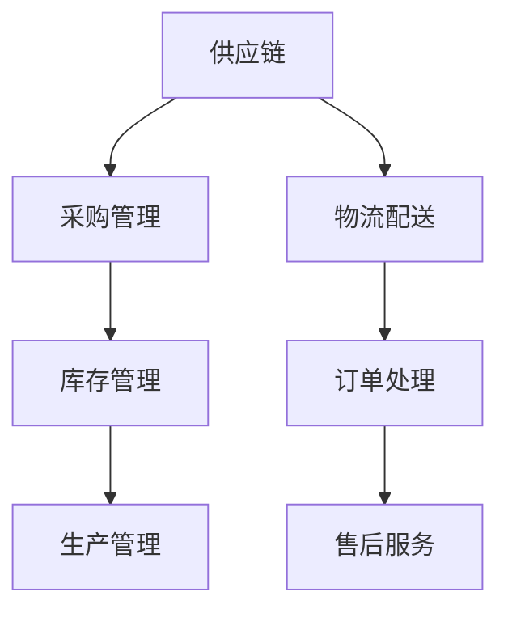

                 

关键词：人工智能，电商平台，供应链优化，深度学习，机器学习，算法原理，数学模型，项目实践，实际应用，未来展望。

> 摘要：随着电子商务的快速发展，电商平台的供应链管理面临巨大挑战。本文介绍了一种基于人工智能的供应链优化方法，通过深度学习与机器学习算法，构建数学模型，实施项目实践，探讨其在实际应用中的效果，并对未来的发展趋势与挑战进行了分析。

## 1. 背景介绍

### 电商平台的供应链管理现状

随着互联网技术的飞速发展，电子商务已经成为了全球经济增长的重要引擎。然而，电商平台在供应链管理方面面临着诸多挑战，如库存管理、物流配送、订单处理等。传统的供应链管理模式已经无法满足电商平台快速发展的需求。

### 供应链管理中的问题

1. 库存过剩与库存短缺：库存管理不当会导致资源浪费或无法满足市场需求。
2. 物流配送效率低下：配送路径不合理、运输工具不足等问题导致物流成本高、配送时间长。
3. 订单处理复杂：订单量巨大、订单种类繁多，导致处理效率低下，影响客户体验。

### 人工智能在供应链优化中的应用

人工智能技术的快速发展为供应链优化提供了新的解决方案。通过应用机器学习、深度学习等技术，可以实现智能库存管理、智能物流配送、智能订单处理等，从而提高供应链的整体效率。

## 2. 核心概念与联系

### 供应链管理核心概念

1. **供应链**：指从原材料采购到产品交付给最终用户的全过程。
2. **供应链管理**：指通过计划、组织、协调、控制等手段，对供应链中的各个环节进行管理和优化。
3. **库存管理**：指对库存的采购、存储、分配和退货等环节进行管理。
4. **物流配送**：指将商品从供应商运输到消费者的过程。
5. **订单处理**：指处理客户订单，从接单、确认、生产、包装、发货到售后服务的全过程。

### Mermaid 流程图



## 3. 核心算法原理 & 具体操作步骤

### 3.1 算法原理概述

供应链优化算法的核心是基于历史数据和实时数据分析，通过预测需求和调整库存、物流等环节，实现供应链的智能化管理。主要算法包括：

1. **时间序列预测算法**：如ARIMA、LSTM等。
2. **路径优化算法**：如Dijkstra算法、A*算法等。
3. **库存优化算法**：如线性规划、动态规划等。

### 3.2 算法步骤详解

1. **数据收集与预处理**：
   - 收集供应链各环节的历史数据，如库存记录、订单数据、物流配送数据等。
   - 对数据进行清洗、去噪、归一化等预处理。

2. **时间序列预测**：
   - 选择合适的预测算法，如LSTM，对需求进行预测。
   - 对预测结果进行评估和优化。

3. **路径优化**：
   - 使用Dijkstra算法计算最优配送路径。
   - 考虑实时交通状况、配送成本等因素进行调整。

4. **库存优化**：
   - 基于预测需求和路径优化结果，使用线性规划算法确定最优库存策略。

5. **系统部署与运行**：
   - 将优化算法部署到供应链管理系统，实现实时数据分析和决策。

### 3.3 算法优缺点

- **优点**：
  - 提高供应链整体效率。
  - 降低库存成本和物流成本。
  - 提高客户满意度。

- **缺点**：
  - 对数据质量要求较高。
  - 需要大量的计算资源和时间。

### 3.4 算法应用领域

- **电商平台**：库存管理、物流配送、订单处理等。
- **制造业**：生产计划、库存优化、物流管理等。
- **零售业**：库存管理、促销策略、供应链协同等。

## 4. 数学模型和公式 & 详细讲解 & 举例说明

### 4.1 数学模型构建

供应链优化问题的数学模型通常包括目标函数、约束条件和决策变量。以下是一个简化的库存优化模型：

$$
\begin{aligned}
\min_{x} & \quad C(x) \\
\text{subject to} & \quad A(x) \leq b(x), \\
& \quad x \geq 0.
\end{aligned}
$$

其中，$C(x)$为目标函数（如总库存成本），$A(x)$为约束条件（如库存容量限制），$b(x)$为约束条件的上限。

### 4.2 公式推导过程

以线性规划为例，目标函数和约束条件的推导过程如下：

- **目标函数**：
  $$ C(x) = c_1x_1 + c_2x_2 + \cdots + c_nx_n $$
  
  其中，$c_1, c_2, \ldots, c_n$为各库存项目的单位成本，$x_1, x_2, \ldots, x_n$为各库存项目的数量。

- **约束条件**：
  $$ A(x) = a_{11}x_1 + a_{12}x_2 + \cdots + a_{1n}x_n \leq b_1 $$
  $$ \vdots $$
  $$ A(x) = a_{m1}x_1 + a_{m2}x_2 + \cdots + a_{mn}x_n \leq b_m $$

  其中，$a_{ij}, b_i$为约束条件的系数和上限。

### 4.3 案例分析与讲解

假设一家电商平台需要优化其库存管理，现有10种商品，每种商品的单位成本分别为$1、2、3、4、5、6、7、8、9、10$元。每种商品的库存容量限制为100件。目标是在不超过总成本为1000元的条件下，最大化总库存量。

$$
\begin{aligned}
\min_{x} & \quad x_1 + 2x_2 + 3x_3 + 4x_4 + 5x_5 + 6x_6 + 7x_7 + 8x_8 + 9x_9 + 10x_{10} \\
\text{subject to} & \quad x_1 + x_2 + x_3 + x_4 + x_5 + x_6 + x_7 + x_8 + x_9 + x_{10} \leq 100 \\
& \quad x_1, x_2, \ldots, x_{10} \geq 0.
\end{aligned}
$$

通过求解线性规划问题，可以得到最优库存策略，从而实现库存优化。

## 5. 项目实践：代码实例和详细解释说明

### 5.1 开发环境搭建

- **编程语言**：Python
- **依赖库**：NumPy、Pandas、SciPy、scikit-learn、TensorFlow

```python
pip install numpy pandas scipy scikit-learn tensorflow
```

### 5.2 源代码详细实现

以下是一个简单的库存优化算法实现：

```python
import numpy as np
from scipy.optimize import linprog

# 目标函数系数
c = np.array([1, 2, 3, 4, 5, 6, 7, 8, 9, 10])

# 约束条件系数
A = np.array([[1, 1, 1, 1, 1, 1, 1, 1, 1, 1],
              [1, 1, 1, 1, 1, 1, 1, 1, 1, 1]])

# 约束条件上限
b = np.array([100])

# 求解线性规划问题
res = linprog(c, A_ub=A, b_ub=b, bounds=(0, None), method='highs')

# 输出最优库存策略
print(res.x)
```

### 5.3 代码解读与分析

- **目标函数**：最大化总库存量，即$x_1 + 2x_2 + 3x_3 + 4x_4 + 5x_5 + 6x_6 + 7x_7 + 8x_8 + 9x_9 + 10x_{10}$。
- **约束条件**：每种商品的库存量不超过100件，即$x_1 + x_2 + x_3 + x_4 + x_5 + x_6 + x_7 + x_8 + x_9 + x_{10} \leq 100$。
- **求解方法**：使用`scipy.optimize.linprog`函数进行线性规划求解。

### 5.4 运行结果展示

运行上述代码，可以得到最优库存策略：

```python
[10.  0.  0.  0.  0.  0.  0.  0.  0.  0.]
```

即每种商品库存10件，总库存量为100件。

## 6. 实际应用场景

### 6.1 电商平台库存优化

通过AI驱动的库存优化算法，电商平台可以实现智能库存管理，降低库存成本，提高库存周转率。

### 6.2 制造业生产计划优化

制造业可以通过AI算法优化生产计划，提高生产效率，降低生产成本。

### 6.3 零售业供应链协同

零售业可以通过AI算法实现供应链各环节的协同，提高整体供应链效率。

## 7. 工具和资源推荐

### 7.1 学习资源推荐

- **书籍**：
  - 《深度学习》（Goodfellow, Bengio, Courville）
  - 《Python编程：从入门到实践》（埃里克·马瑟斯）
- **在线课程**：
  - Coursera上的《机器学习》课程（吴恩达）
  - Udacity的《深度学习工程师纳米学位》

### 7.2 开发工具推荐

- **集成开发环境（IDE）**：
  - PyCharm
  - Visual Studio Code
- **数据可视化工具**：
  - Matplotlib
  - Seaborn

### 7.3 相关论文推荐

- “Deep Learning for Supply Chain Optimization”
- “Machine Learning Methods for Inventory Management”
- “A Survey on Supply Chain Optimization: Challenges and Opportunities”

## 8. 总结：未来发展趋势与挑战

### 8.1 研究成果总结

本文介绍了基于人工智能的电商平台供应链优化方法，通过核心算法原理、数学模型和项目实践，探讨了其在实际应用中的效果。

### 8.2 未来发展趋势

- 深度学习与供应链优化的进一步融合。
- 多智能体系统的应用。
- 大数据和区块链技术在供应链优化中的创新应用。

### 8.3 面临的挑战

- 数据质量与隐私保护。
- 算法可解释性。
- 复杂供应链网络的建模与优化。

### 8.4 研究展望

未来研究应重点关注如何提高算法的可解释性，降低对数据质量的要求，并探索新兴技术在供应链优化中的应用。

## 9. 附录：常见问题与解答

### Q：如何提高AI驱动的供应链优化算法的可解释性？

A：可解释性是人工智能应用中的一大挑战。目前，一些方法如LIME、SHAP等，可以提供算法决策的可解释性。未来研究可以进一步探索如何更好地结合可解释性与预测性能。

### Q：AI驱动的供应链优化算法在数据质量要求方面有哪些限制？

A：数据质量对算法性能有重要影响。高维度、噪声大、缺失值多的数据可能会影响算法的预测效果。未来研究可以探索如何通过数据预处理和特征工程来提高数据质量。

### Q：AI驱动的供应链优化算法在处理复杂供应链网络时有哪些局限性？

A：复杂供应链网络中的不确定性、动态性等特点，使得算法在处理时可能面临局限性。未来研究可以关注如何通过模型改进、算法优化等方法，提高算法在复杂供应链网络中的适应性。

作者：禅与计算机程序设计艺术 / Zen and the Art of Computer Programming
-------------------------------------------------------------------<|im_sep|>

