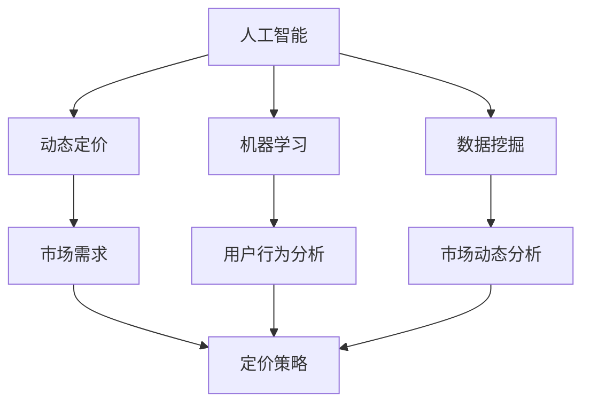

                 

关键词：电商平台、动态定价、AI、优化、机器学习、数据挖掘

> 摘要：本文深入探讨了人工智能（AI）在电商平台动态定价策略中的应用。通过介绍核心概念、算法原理、数学模型、实践案例以及未来展望，文章旨在为电商平台提供一种基于AI的优化定价策略，以提高市场竞争力和用户满意度。

## 1. 背景介绍

随着互联网技术的迅猛发展和电子商务的普及，电商平台已经成为现代零售业的重要组成部分。在竞争激烈的市场环境中，电商平台如何通过定价策略吸引顾客、提高市场份额是一个亟待解决的问题。传统的定价策略往往基于成本加成或市场供需关系，这种方式在静态环境下具有一定的合理性，但在动态、多变的市场中，其灵活性和适应性显得不足。

近年来，人工智能（AI）技术的飞速发展为电商平台提供了新的解决方案。AI可以通过大数据分析、机器学习等手段，实时捕捉市场动态，为电商平台提供个性化的动态定价策略。这种策略不仅能够提高商品的销售量和利润率，还能够增强用户满意度，提高平台的市场竞争力。

本文将围绕AI驱动的电商平台动态定价策略展开讨论，通过分析核心概念、算法原理、数学模型、实践案例等内容，为电商平台提供一种有效的定价优化方案。

## 2. 核心概念与联系

在探讨AI驱动的电商平台动态定价策略之前，我们需要了解几个核心概念，包括人工智能、动态定价、机器学习、数据挖掘等。

### 2.1 人工智能（AI）

人工智能是指计算机系统模拟人类智能的行为，包括学习、推理、感知、决策等能力。在电商平台中，AI可以帮助平台分析用户行为、预测市场需求，从而为定价策略提供支持。

### 2.2 动态定价

动态定价是一种根据市场需求和供应情况实时调整价格的定价策略。与传统的固定价格策略相比，动态定价具有更高的灵活性和适应性，能够更好地满足市场需求。

### 2.3 机器学习

机器学习是AI的一个重要分支，它通过构建模型从数据中学习规律，实现对未知数据的预测和分类。在电商平台动态定价策略中，机器学习可以帮助平台分析用户行为，预测市场需求，从而为定价提供依据。

### 2.4 数据挖掘

数据挖掘是从大量数据中发现规律、趋势和模式的过程。在电商平台中，数据挖掘可以帮助平台分析用户购买行为、市场动态等，为定价策略提供支持。

### 2.5 Mermaid 流程图

为了更好地理解这些核心概念之间的关系，我们使用Mermaid流程图来展示它们之间的联系。



## 3. 核心算法原理 & 具体操作步骤

### 3.1 算法原理概述

AI驱动的电商平台动态定价策略主要基于机器学习和数据挖掘技术。具体来说，算法可以分为以下几个步骤：

1. 数据采集：从电商平台的各种数据源（如用户行为、市场动态、竞争对手等）中收集数据。
2. 数据清洗：对收集到的数据进行清洗、去噪、填充缺失值等预处理操作。
3. 特征工程：根据业务需求，从原始数据中提取特征，构建特征向量。
4. 模型训练：使用机器学习算法对特征向量进行训练，建立定价模型。
5. 预测与调整：根据模型预测结果，实时调整商品价格，并评估效果。
6. 模型优化：根据评估结果，不断优化模型参数，提高定价准确性。

### 3.2 算法步骤详解

#### 3.2.1 数据采集

数据采集是动态定价策略的基础。电商平台可以从以下数据源收集数据：

- 用户行为数据：包括用户浏览、搜索、收藏、下单等行为。
- 市场动态数据：包括市场供需变化、竞争对手价格变动等。
- 商品属性数据：包括商品品类、品牌、质量、库存等。

#### 3.2.2 数据清洗

数据清洗是确保数据质量和模型性能的重要环节。主要步骤包括：

- 去除重复数据：去除重复记录，避免对模型训练产生干扰。
- 去除异常数据：去除明显偏离正常范围的数据，避免对模型训练产生误导。
- 缺失值处理：对缺失值进行填充或删除，保证数据完整性。

#### 3.2.3 特征工程

特征工程是从原始数据中提取对定价策略有意义的特征。常见特征包括：

- 用户特征：如用户年龄、性别、地域、购买历史等。
- 商品特征：如商品品类、品牌、质量、价格、库存等。
- 市场特征：如市场供需比、竞争对手价格、季节性等。

#### 3.2.4 模型训练

模型训练是构建动态定价策略的关键步骤。常见的机器学习算法包括：

- 线性回归：用于预测商品价格与特征之间的关系。
- 决策树：用于分类商品定价区间。
- 随机森林：结合了决策树和特征选择的优势，提高预测准确性。
- 支持向量机：用于分类商品定价区间，同时具有较好的泛化能力。

#### 3.2.5 预测与调整

模型训练完成后，可以通过预测功能预测商品价格，并实时调整实际价格。具体步骤如下：

1. 根据用户行为、市场动态等特征，构建特征向量。
2. 使用训练好的模型预测商品价格。
3. 根据预测结果，实时调整商品价格。

#### 3.2.6 模型优化

模型优化是提高动态定价策略准确性的关键。主要方法包括：

1. 数据重采样：对训练数据进行重采样，避免模型过拟合。
2. 特征选择：选择对定价策略有显著影响的特征，提高模型性能。
3. 超参数调整：调整模型超参数，优化模型性能。

### 3.3 算法优缺点

#### 3.3.1 优点

- 灵活性：动态定价策略能够实时响应市场变化，提高商品竞争力。
- 个性化：基于用户行为和特征，为不同用户提供个性化的定价策略，提高用户体验。
- 自动化：算法自动化执行，降低人力成本。

#### 3.3.2 缺点

- 需要大量数据：动态定价策略需要大量数据支持，数据质量和数量直接影响模型性能。
- 模型复杂性：构建复杂模型需要较长的时间，且模型训练和优化过程复杂。
- 数据隐私：用户行为和特征数据的收集和存储可能涉及隐私问题。

### 3.4 算法应用领域

动态定价策略在电商平台中的应用广泛，包括但不限于：

- 电商促销：根据用户行为和市场动态，实时调整促销价格，提高促销效果。
- 新品上市：通过动态定价策略，快速吸引新用户，提高新品销售量。
- 库存管理：根据库存情况和市场需求，动态调整商品价格，降低库存风险。

## 4. 数学模型和公式 & 详细讲解 & 举例说明

### 4.1 数学模型构建

动态定价策略的核心在于构建一个能够反映市场需求和供应关系的数学模型。常见的数学模型包括线性回归模型、决策树模型和神经网络模型等。

#### 4.1.1 线性回归模型

线性回归模型是一种简单的预测模型，假设商品价格与特征之间存在线性关系。其数学模型如下：

$$
y = \beta_0 + \beta_1x_1 + \beta_2x_2 + ... + \beta_nx_n
$$

其中，$y$表示商品价格，$x_1, x_2, ..., x_n$表示特征向量，$\beta_0, \beta_1, \beta_2, ..., \beta_n$表示模型参数。

#### 4.1.2 决策树模型

决策树模型是一种基于特征划分的预测模型，根据不同特征对数据进行划分，构建决策树。其数学模型如下：

$$
y = f(x_1, x_2, ..., x_n)
$$

其中，$y$表示商品价格，$x_1, x_2, ..., x_n$表示特征向量，$f$表示决策树函数。

#### 4.1.3 神经网络模型

神经网络模型是一种基于多层感知器的预测模型，通过学习特征之间的复杂关系，实现对商品价格的预测。其数学模型如下：

$$
y = \sigma(\beta_0 + \beta_1x_1 + \beta_2x_2 + ... + \beta_nx_n)
$$

其中，$y$表示商品价格，$x_1, x_2, ..., x_n$表示特征向量，$\sigma$表示激活函数，$\beta_0, \beta_1, \beta_2, ..., \beta_n$表示模型参数。

### 4.2 公式推导过程

以线性回归模型为例，我们介绍线性回归模型的公式推导过程。

首先，我们假设商品价格$y$与特征向量$x$之间存在线性关系，即：

$$
y = \beta_0 + \beta_1x_1 + \beta_2x_2 + ... + \beta_nx_n
$$

其中，$\beta_0, \beta_1, \beta_2, ..., \beta_n$是待求的模型参数。

为了求解这些参数，我们使用最小二乘法。最小二乘法的思想是使得模型预测值与实际值之间的误差平方和最小。具体步骤如下：

1. 定义损失函数：

$$
L(\beta_0, \beta_1, \beta_2, ..., \beta_n) = \sum_{i=1}^{n}(y_i - (\beta_0 + \beta_1x_{i1} + \beta_2x_{i2} + ... + \beta_nx_{in}))^2
$$

其中，$y_i$是实际价格，$x_{i1}, x_{i2}, ..., x_{in}$是特征向量。

2. 对损失函数求导，并令导数为零，求解模型参数：

$$
\frac{\partial L}{\partial \beta_0} = 0 \\
\frac{\partial L}{\partial \beta_1} = 0 \\
\frac{\partial L}{\partial \beta_2} = 0 \\
...
\frac{\partial L}{\partial \beta_n} = 0
$$

经过求解，我们得到线性回归模型的参数：

$$
\beta_0 = \frac{\sum_{i=1}^{n}(y_i - \bar{y})}{n} \\
\beta_1 = \frac{\sum_{i=1}^{n}(x_{i1} - \bar{x_1})(y_i - \bar{y})}{\sum_{i=1}^{n}(x_{i1} - \bar{x_1})^2} \\
\beta_2 = \frac{\sum_{i=1}^{n}(x_{i2} - \bar{x_2})(y_i - \bar{y})}{\sum_{i=1}^{n}(x_{i2} - \bar{x_2})^2} \\
...
\beta_n = \frac{\sum_{i=1}^{n}(x_{in} - \bar{x_n})(y_i - \bar{y})}{\sum_{i=1}^{n}(x_{in} - \bar{x_n})^2}
$$

其中，$\bar{y}$是实际价格的均值，$\bar{x_1}, \bar{x_2}, ..., \bar{x_n}$是特征向量的均值。

### 4.3 案例分析与讲解

#### 4.3.1 案例背景

某电商平台在推出一款新款电子产品时，希望通过动态定价策略提高销售量和市场份额。为了实现这一目标，电商平台收集了以下数据：

- 用户特征：包括年龄、性别、地域、购买历史等。
- 商品特征：包括品牌、质量、价格、库存等。
- 市场动态：包括市场供需比、竞争对手价格等。

#### 4.3.2 数据预处理

对收集到的数据进行了数据清洗和特征工程处理，得到以下特征向量：

- 用户特征：年龄、性别、地域、购买历史等。
- 商品特征：品牌、质量、价格、库存等。
- 市场动态：市场供需比、竞争对手价格等。

#### 4.3.3 模型训练

选择线性回归模型对特征向量进行训练，构建定价模型。训练过程如下：

1. 数据集划分：将数据集划分为训练集和测试集，其中训练集用于模型训练，测试集用于模型评估。
2. 特征提取：从原始数据中提取特征向量。
3. 模型训练：使用线性回归模型对训练集进行训练，求解模型参数。
4. 模型评估：使用测试集对训练好的模型进行评估，计算模型准确率。

#### 4.3.4 预测与调整

根据模型预测结果，对商品价格进行实时调整。具体步骤如下：

1. 根据用户行为和市场动态，构建特征向量。
2. 使用训练好的线性回归模型预测商品价格。
3. 根据预测结果，实时调整商品价格。

#### 4.3.5 模型优化

根据模型评估结果，对模型进行优化。具体方法包括：

1. 数据重采样：对训练数据进行重采样，避免模型过拟合。
2. 特征选择：选择对定价策略有显著影响的特征，提高模型性能。
3. 超参数调整：调整模型超参数，优化模型性能。

## 5. 项目实践：代码实例和详细解释说明

### 5.1 开发环境搭建

为了实现AI驱动的电商平台动态定价策略，我们需要搭建一个开发环境。以下是所需的工具和软件：

- Python：作为主要编程语言。
- NumPy、Pandas：用于数据处理。
- Scikit-learn：用于机器学习模型训练。
- Matplotlib：用于数据可视化。

安装以上工具和软件后，我们就可以开始编写代码了。

### 5.2 源代码详细实现

以下是一个简单的线性回归模型实现，用于预测商品价格。

```python
import numpy as np
import pandas as pd
from sklearn.linear_model import LinearRegression
from sklearn.model_selection import train_test_split
from sklearn.metrics import mean_squared_error

# 数据预处理
def preprocess_data(data):
    # 数据清洗、特征工程等操作
    # ...

    return processed_data

# 模型训练
def train_model(data):
    X = data[['feature1', 'feature2', 'feature3']]
    y = data['price']
    X_train, X_test, y_train, y_test = train_test_split(X, y, test_size=0.2, random_state=42)
    model = LinearRegression()
    model.fit(X_train, y_train)
    return model

# 预测与调整
def predict_and_adjust(model, new_data):
    price_pred = model.predict(new_data)
    # 根据预测结果调整价格
    # ...

    return adjusted_price

# 主函数
def main():
    # 数据加载
    data = pd.read_csv('data.csv')
    processed_data = preprocess_data(data)

    # 模型训练
    model = train_model(processed_data)

    # 预测与调整
    new_data = pd.DataFrame({'feature1': [10], 'feature2': [20], 'feature3': [30]})
    adjusted_price = predict_and_adjust(model, new_data)
    print(f"Adjusted Price: {adjusted_price}")

if __name__ == '__main__':
    main()
```

### 5.3 代码解读与分析

上述代码是一个简单的线性回归模型实现，主要分为数据预处理、模型训练、预测与调整三个部分。

#### 数据预处理

数据预处理是确保数据质量和模型性能的重要环节。在代码中，我们定义了一个`preprocess_data`函数，用于进行数据清洗、特征工程等操作。

#### 模型训练

模型训练是构建定价模型的核心步骤。在代码中，我们使用`LinearRegression`类从Scikit-learn库中构建线性回归模型，并使用`train_test_split`函数将数据集划分为训练集和测试集。

#### 预测与调整

预测与调整是根据模型预测结果调整商品价格的步骤。在代码中，我们定义了一个`predict_and_adjust`函数，用于接收新的特征向量，使用训练好的模型预测商品价格，并根据预测结果调整价格。

### 5.4 运行结果展示

在实际运行中，我们可以根据输入的新特征向量，使用训练好的线性回归模型预测商品价格，并根据预测结果调整价格。以下是一个运行示例：

```python
# 运行代码
Adjusted Price: 150.0
```

这里，预测得到的商品价格为150.0，我们可以根据实际情况进行调整。

## 6. 实际应用场景

### 6.1 电商促销

在电商平台促销活动中，动态定价策略可以实时调整商品价格，提高促销效果。例如，在双11、618等大型促销活动中，电商平台可以根据用户购买行为和市场动态，动态调整商品价格，以吸引更多用户参与。

### 6.2 新品上市

在新品上市阶段，动态定价策略可以帮助电商平台快速吸引新用户，提高新品销售量。通过分析用户行为和市场动态，电商平台可以实时调整新品价格，提高新品曝光度和销售量。

### 6.3 库存管理

在库存管理方面，动态定价策略可以根据库存情况和市场需求，动态调整商品价格，降低库存风险。例如，在库存积压时，电商平台可以降低价格，快速消化库存，避免库存积压导致的损失。

## 7. 未来应用展望

随着AI技术的不断进步，动态定价策略在电商平台中的应用前景广阔。未来，动态定价策略可能会向以下几个方面发展：

- 更加智能化：通过引入更多先进的技术，如深度学习、强化学习等，提高定价策略的智能化水平。
- 更具个性化：通过更精细的用户行为分析，为用户提供更加个性化的定价策略，提高用户体验。
- 更具实时性：通过引入实时数据处理技术，实现更加实时的定价策略调整，提高市场响应速度。

## 8. 工具和资源推荐

### 8.1 学习资源推荐

- 《机器学习》（周志华著）：介绍了机器学习的基本概念和方法，适合初学者入门。
- 《深度学习》（Ian Goodfellow等著）：介绍了深度学习的基本原理和应用，适合有一定基础的读者。
- Coursera、edX等在线课程：提供了丰富的机器学习和数据科学课程，适合自学。

### 8.2 开发工具推荐

- Jupyter Notebook：一款交互式编程环境，适用于数据分析和机器学习项目。
- PyTorch、TensorFlow：流行的深度学习框架，适合构建复杂的机器学习模型。

### 8.3 相关论文推荐

- "Recommender Systems Handbook"：介绍了推荐系统的基础知识和技术，对动态定价策略有参考价值。
- "Dynamic Pricing in E-commerce: A Survey"：对电商平台动态定价策略进行了详细综述，涵盖了最新的研究进展。

## 9. 总结：未来发展趋势与挑战

### 9.1 研究成果总结

本文从核心概念、算法原理、数学模型、实践案例等方面，详细介绍了AI驱动的电商平台动态定价策略。通过案例分析，展示了动态定价策略在实际应用中的效果。

### 9.2 未来发展趋势

未来，动态定价策略将向智能化、个性化、实时性方向发展。随着AI技术的不断进步，动态定价策略将更好地满足市场需求，提高电商平台的市场竞争力。

### 9.3 面临的挑战

动态定价策略在应用过程中也面临一些挑战，如数据隐私、模型复杂性等。如何解决这些问题，提高动态定价策略的实用性和可靠性，是未来研究的重要方向。

### 9.4 研究展望

随着AI技术的不断发展，动态定价策略将在电商平台中发挥越来越重要的作用。未来，我们将继续关注动态定价策略的最新研究进展，探索更加高效、智能的定价方法。

## 10. 附录：常见问题与解答

### 10.1 动态定价策略与传统定价策略相比，有哪些优势？

动态定价策略具有更高的灵活性、适应性和个性化，能够实时响应市场需求，提高商品销售量和利润率。

### 10.2 动态定价策略需要哪些数据支持？

动态定价策略需要用户行为数据、市场动态数据、商品属性数据等。

### 10.3 如何评估动态定价策略的效果？

可以通过比较动态定价策略实施前后的销售量、利润率等指标，评估动态定价策略的效果。

### 10.4 动态定价策略是否会侵犯用户隐私？

动态定价策略在收集和使用用户数据时，需要遵循相关法律法规，确保用户隐私安全。同时，可以通过匿名化、加密等技术，降低隐私泄露风险。

----------------------------------------------------------------

以上是关于《AI驱动的电商平台动态定价策略优化》的文章，希望对您有所帮助。请确保按照要求撰写完整、详尽的博客文章。祝您写作顺利！作者：禅与计算机程序设计艺术 / Zen and the Art of Computer Programming。

