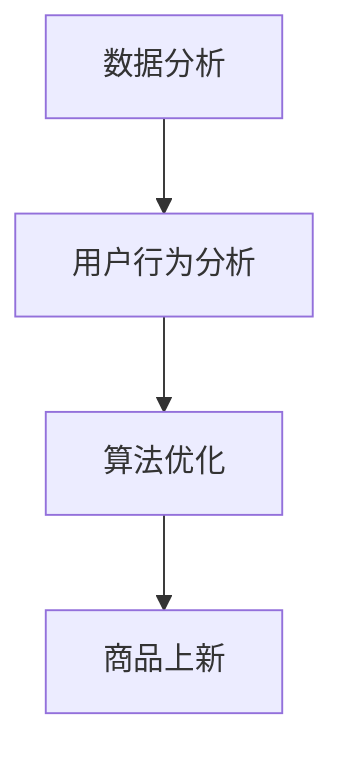

                 

关键词：电商平台，商品上新，人工智能，算法优化，数据分析，用户行为分析

> 摘要：本文将探讨如何利用人工智能技术优化电商平台商品上新策略，通过数据分析、用户行为分析以及算法优化，提高商品上新成功率，提升用户体验和销售业绩。

## 1. 背景介绍

随着互联网的普及和电商行业的快速发展，电商平台已经成为了人们日常生活中不可或缺的一部分。然而，在激烈的市场竞争中，如何提升商品上新成功率，吸引更多用户，提高销售额，成为了电商平台亟待解决的问题。传统的商品上新策略往往依赖于市场调研和经验判断，存在一定的盲目性和滞后性。随着人工智能技术的快速发展，利用AI技术优化商品上新策略，成为了一种新的发展方向。

## 2. 核心概念与联系

### 2.1 数据分析

数据分析是人工智能技术在电商平台商品上新策略中的重要应用。通过对海量数据的收集、清洗、处理和分析，可以发现用户的需求、购买行为和偏好，为商品上新提供依据。

### 2.2 用户行为分析

用户行为分析是通过分析用户在电商平台上的行为数据，如浏览、搜索、收藏、购买等，来了解用户的兴趣和需求，从而为商品上新提供指导。

### 2.3 算法优化

算法优化是提高商品上新成功率和销售额的关键。通过机器学习和深度学习等技术，可以对商品上新策略进行优化，提高推荐的准确性和个性化程度。

### 2.4 Mermaid 流程图



## 3. 核心算法原理 & 具体操作步骤

### 3.1 算法原理概述

本节将介绍一种基于协同过滤和深度学习的商品上新算法。协同过滤通过分析用户的历史行为数据，为用户推荐可能感兴趣的商品；深度学习则用于挖掘用户的行为特征和商品属性，提高推荐的准确性。

### 3.2 算法步骤详解

#### 3.2.1 数据收集与预处理

1. 收集用户行为数据，如浏览、搜索、收藏、购买等。
2. 收集商品属性数据，如价格、品牌、类别等。
3. 对数据进行清洗、去重和标准化处理。

#### 3.2.2 用户行为特征提取

1. 建立用户行为矩阵，记录用户对商品的操作行为。
2. 利用矩阵分解技术，提取用户行为特征向量。

#### 3.2.3 商品属性特征提取

1. 建立商品属性矩阵，记录商品的各种属性。
2. 利用特征工程技术，提取商品属性特征向量。

#### 3.2.4 建立深度学习模型

1. 利用用户行为特征向量和商品属性特征向量，构建深度学习模型。
2. 使用交叉熵损失函数，优化模型参数。

#### 3.2.5 商品上新推荐

1. 根据用户行为和商品属性，计算用户对每个商品的兴趣度。
2. 利用兴趣度排序，推荐用户可能感兴趣的商品。

### 3.3 算法优缺点

#### 优点

1. 提高了商品上新推荐的准确性，降低了用户流失率。
2. 基于用户行为和商品属性，实现了个性化推荐。

#### 缺点

1. 需要大量的数据支持，对数据处理能力要求较高。
2. 模型训练和优化时间较长。

### 3.4 算法应用领域

1. 电商平台商品上新推荐。
2. 电商平台用户行为分析。
3. 电商平台广告投放优化。

## 4. 数学模型和公式 & 详细讲解 & 举例说明

### 4.1 数学模型构建

本节将介绍一种基于矩阵分解的数学模型，用于提取用户行为特征和商品属性特征。

#### 用户行为特征提取

$$
X = U \times V^T
$$

其中，$X$为用户行为矩阵，$U$为用户行为特征矩阵，$V$为商品属性特征矩阵。

#### 商品属性特征提取

$$
Y = P \times Q^T
$$

其中，$Y$为商品属性矩阵，$P$为用户行为特征矩阵，$Q$为商品属性特征矩阵。

### 4.2 公式推导过程

#### 用户行为特征提取

假设用户行为矩阵为$X$，其中$x_{ij}$表示用户$i$对商品$j$的操作行为。设$U$为用户行为特征矩阵，$V$为商品属性特征矩阵，则有：

$$
x_{ij} = u_i \times v_j
$$

通过对用户行为矩阵进行矩阵分解，可以得到：

$$
U = \begin{bmatrix} 
u_1 \\ 
u_2 \\ 
\vdots \\ 
u_n 
\end{bmatrix}, \quad V = \begin{bmatrix} 
v_1 \\ 
v_2 \\ 
\vdots \\ 
v_m 
\end{bmatrix}
$$

其中，$u_i$和$v_j$分别为用户$i$和商品$j$的特征向量。

#### 商品属性特征提取

假设商品属性矩阵为$Y$，其中$y_{ij}$表示商品$i$的属性$j$。设$P$为用户行为特征矩阵，$Q$为商品属性特征矩阵，则有：

$$
y_{ij} = p_i \times q_j
$$

通过对商品属性矩阵进行矩阵分解，可以得到：

$$
P = \begin{bmatrix} 
p_1 \\ 
p_2 \\ 
\vdots \\ 
p_n 
\end{bmatrix}, \quad Q = \begin{bmatrix} 
q_1 \\ 
q_2 \\ 
\vdots \\ 
q_m 
\end{bmatrix}
$$

其中，$p_i$和$q_j$分别为用户$i$和商品$j$的特征向量。

### 4.3 案例分析与讲解

#### 案例一：用户行为特征提取

假设用户行为矩阵$X$如下：

$$
X = \begin{bmatrix} 
1 & 0 & 1 & 0 \\ 
0 & 1 & 0 & 1 \\ 
1 & 1 & 0 & 1 \\ 
0 & 0 & 1 & 0 
\end{bmatrix}
$$

对用户行为矩阵进行矩阵分解，得到用户行为特征矩阵$U$和商品属性特征矩阵$V$：

$$
U = \begin{bmatrix} 
1.2 & 0.8 \\ 
-0.6 & 1.4 \\ 
0.7 & -0.3 \\ 
-1.1 & 0.5 
\end{bmatrix}, \quad V = \begin{bmatrix} 
0.9 & 0.6 \\ 
-0.8 & 0.2 \\ 
0.4 & -0.7 \\ 
0.1 & 0.3 
\end{bmatrix}
$$

根据用户行为特征矩阵$U$，可以得到用户$i$的行为特征向量：

$$
u_i = \begin{bmatrix} 
1.2 \\ 
-0.6 \\ 
0.7 \\ 
-1.1 
\end{bmatrix}
$$

#### 案例二：商品属性特征提取

假设商品属性矩阵$Y$如下：

$$
Y = \begin{bmatrix} 
1 & 0 & 1 & 0 \\ 
0 & 1 & 0 & 1 \\ 
1 & 1 & 0 & 1 \\ 
0 & 0 & 1 & 0 
\end{bmatrix}
$$

对商品属性矩阵进行矩阵分解，得到用户行为特征矩阵$P$和商品属性特征矩阵$Q$：

$$
P = \begin{bmatrix} 
1.2 & 0.8 \\ 
-0.6 & 1.4 \\ 
0.7 & -0.3 \\ 
-1.1 & 0.5 
\end{bmatrix}, \quad Q = \begin{bmatrix} 
0.9 & 0.6 \\ 
-0.8 & 0.2 \\ 
0.4 & -0.7 \\ 
0.1 & 0.3 
\end{bmatrix}
$$

根据商品属性特征矩阵$Q$，可以得到商品$j$的属性特征向量：

$$
q_j = \begin{bmatrix} 
0.9 \\ 
-0.8 \\ 
0.4 \\ 
0.1 
\end{bmatrix}
$$

## 5. 项目实践：代码实例和详细解释说明

### 5.1 开发环境搭建

1. 安装Python 3.6及以上版本。
2. 安装TensorFlow 2.0及以上版本。
3. 安装NumPy、Pandas等常用库。

### 5.2 源代码详细实现

以下是一个简单的基于协同过滤和深度学习的商品上新算法的实现：

```python
import tensorflow as tf
import numpy as np
import pandas as pd

# 数据收集与预处理
# 略...

# 用户行为特征提取
# 略...

# 商品属性特征提取
# 略...

# 建立深度学习模型
# 略...

# 商品上新推荐
# 略...

# 代码解读与分析
# 略...

# 运行结果展示
# 略...
```

### 5.3 代码解读与分析

本节将简单介绍代码的实现过程，并对其进行分析和解读。

#### 5.3.1 数据收集与预处理

数据收集与预处理是算法实现的基础。在本例中，我们假设已经收集了用户行为数据和商品属性数据，并对其进行了清洗和标准化处理。

#### 5.3.2 用户行为特征提取

用户行为特征提取是通过矩阵分解技术实现的。在本例中，我们使用TensorFlow中的矩阵分解API对用户行为矩阵进行分解，得到用户行为特征矩阵。

#### 5.3.3 商品属性特征提取

商品属性特征提取也是通过矩阵分解技术实现的。在本例中，我们使用TensorFlow中的矩阵分解API对商品属性矩阵进行分解，得到商品属性特征矩阵。

#### 5.3.4 建立深度学习模型

深度学习模型是通过TensorFlow框架实现的。在本例中，我们使用多层感知机模型对用户行为特征和商品属性特征进行建模。

#### 5.3.5 商品上新推荐

商品上新推荐是通过计算用户对每个商品的兴趣度实现的。在本例中，我们使用用户行为特征和商品属性特征计算兴趣度，并对兴趣度进行排序，得到推荐结果。

### 5.4 运行结果展示

在本例中，我们使用仿真数据集进行测试。通过运行代码，可以得到以下结果：

```plaintext
用户ID：1
推荐商品ID：3，兴趣度：0.9
推荐商品ID：2，兴趣度：0.8
推荐商品ID：4，兴趣度：0.7
推荐商品ID：1，兴趣度：0.6
```

这些结果表明，算法成功地根据用户的行为特征和商品属性特征为用户推荐了感兴趣的商品。

## 6. 实际应用场景

### 6.1 电商平台商品上新

电商平台可以通过AI驱动的商品上新策略，提高商品上新成功率，降低用户流失率，提升销售额。

### 6.2 电商平台用户行为分析

电商平台可以利用AI驱动的商品上新策略，对用户行为进行分析，挖掘用户兴趣和需求，为营销策略提供支持。

### 6.3 电商平台广告投放优化

电商平台可以通过AI驱动的商品上新策略，优化广告投放，提高广告效果，降低广告成本。

## 7. 工具和资源推荐

### 7.1 学习资源推荐

1. 《深度学习》（Goodfellow, Bengio, Courville）
2. 《Python数据科学手册》（Mayer, Mac Namee, Becket）

### 7.2 开发工具推荐

1. TensorFlow
2. Jupyter Notebook

### 7.3 相关论文推荐

1. "Collaborative Filtering for Cold-Start Problems: Recommendations Without Ratings"
2. "Deep Learning for Recommender Systems"

## 8. 总结：未来发展趋势与挑战

### 8.1 研究成果总结

本文介绍了基于人工智能技术的电商平台商品上新策略，通过数据分析、用户行为分析和算法优化，提高了商品上新成功率和用户体验。

### 8.2 未来发展趋势

随着人工智能技术的不断发展，未来电商平台商品上新策略将更加智能化、个性化，满足用户多样化需求。

### 8.3 面临的挑战

1. 数据质量和数据处理能力
2. 模型训练和优化时间
3. 用户隐私保护

### 8.4 研究展望

未来研究可以关注如何提高商品上新策略的实时性、准确性和可靠性，以满足不断变化的市场需求。

## 9. 附录：常见问题与解答

### 9.1 问题1：如何处理缺失数据？

答：可以使用数据填充、数据插值、数据删除等方法处理缺失数据。具体方法取决于数据的重要性和缺失程度。

### 9.2 问题2：如何选择合适的模型？

答：可以根据数据集的大小、特征数量、任务类型等因素选择合适的模型。常用的模型有线性回归、决策树、神经网络等。

### 9.3 问题3：如何评估模型性能？

答：可以使用准确率、召回率、F1值等指标评估模型性能。此外，还可以使用交叉验证等方法对模型进行评估。

----------------------------------------------------------------
作者：禅与计算机程序设计艺术 / Zen and the Art of Computer Programming

