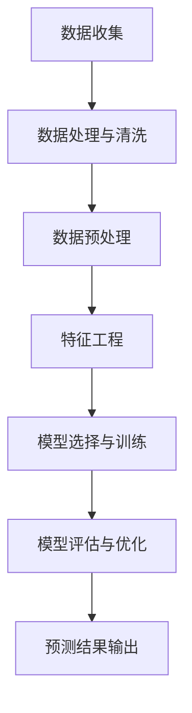

                 

关键词：人工智能、电商平台、商品趋势预测、机器学习、数据分析

> 摘要：随着电子商务的迅猛发展，电商平台对商品趋势的准确预测变得至关重要。本文将探讨如何利用人工智能技术，特别是机器学习和数据分析方法，来驱动电商平台商品趋势预测，以提高电商平台的竞争力。

## 1. 背景介绍

随着互联网的普及和移动设备的普及，电子商务已经成为消费者购物的主要方式。电商平台通过提供丰富的商品选择和便捷的购物体验，吸引了大量用户。然而，随着市场竞争的加剧，电商平台需要更加精准地把握用户需求，以便提供个性化的商品推荐和营销策略。

商品趋势预测作为一种数据分析技术，可以帮助电商平台了解用户购买行为的变化，从而优化库存管理、营销策略和产品开发。传统的商品趋势预测方法主要依赖于历史数据和统计分析，但这种方法往往存在响应速度慢、预测精度低等问题。

随着人工智能技术的快速发展，特别是机器学习和深度学习的应用，商品趋势预测的准确性得到了显著提高。人工智能技术可以处理大量非结构化数据，并通过算法模型自动学习数据中的规律，从而提供更准确、实时的趋势预测。

本文将详细介绍如何利用人工智能技术，特别是机器学习和数据分析方法，来驱动电商平台商品趋势预测。我们将从核心概念、算法原理、数学模型、项目实践、实际应用场景等多个方面进行深入探讨。

## 2. 核心概念与联系

在探讨人工智能驱动的商品趋势预测之前，我们需要了解一些核心概念和联系。

### 2.1 机器学习与数据分析

机器学习是人工智能的一个重要分支，它通过算法模型从数据中自动学习规律，并用于预测或决策。数据分析是处理数据、提取有用信息和知识的过程。

机器学习和数据分析在商品趋势预测中起着关键作用。通过机器学习，我们可以从大量历史数据中挖掘出潜在的用户行为模式，从而预测未来的购买趋势。数据分析则帮助我们理解这些模式，优化算法模型，提高预测精度。

### 2.2 电商平台数据

电商平台的数据包括用户行为数据、商品数据、订单数据等。用户行为数据包括浏览记录、搜索记录、购买记录等；商品数据包括商品名称、分类、价格、库存等；订单数据包括订单号、购买时间、购买商品、购买数量等。

这些数据是商品趋势预测的重要来源。通过对这些数据的分析，我们可以了解用户的购买偏好、购买频率、购买时段等，从而预测未来的购买趋势。

### 2.3 数据处理与清洗

在利用机器学习和数据分析进行商品趋势预测之前，我们需要对原始数据进行处理和清洗。数据处理包括数据集成、数据转换、数据归一化等；数据清洗包括去除重复数据、缺失值填充、异常值处理等。

数据处理和清洗的目的是确保数据的准确性和一致性，以便更好地进行后续的分析和预测。

### 2.4 算法选择与模型评估

在商品趋势预测中，我们需要选择合适的算法模型，并对其进行评估。常见的算法模型包括线性回归、决策树、随机森林、神经网络等。

算法模型的选择取决于数据的特点和业务需求。我们通常使用交叉验证、AUC（曲线下面积）、RMSE（均方根误差）等指标来评估模型的性能。

### 2.5 Mermaid 流程图

以下是一个简化的商品趋势预测流程图，使用 Mermaid 语言表示：



## 3. 核心算法原理 & 具体操作步骤

### 3.1 算法原理概述

商品趋势预测的核心算法是基于机器学习的，主要包括以下几个步骤：

1. 数据收集：收集电商平台的历史数据，包括用户行为数据、商品数据、订单数据等。
2. 数据处理与清洗：对原始数据进行处理和清洗，确保数据的准确性和一致性。
3. 数据预处理：对清洗后的数据进行分析，提取有用的特征，并将其转换为机器学习模型可处理的格式。
4. 特征工程：根据业务需求和数据特点，设计合适的特征，以提高模型的预测精度。
5. 模型选择与训练：选择合适的机器学习算法模型，并进行训练。
6. 模型评估与优化：评估模型的性能，并通过调整参数来优化模型。
7. 预测结果输出：根据训练好的模型，对未来的商品趋势进行预测，并输出预测结果。

### 3.2 算法步骤详解

#### 3.2.1 数据收集

数据收集是商品趋势预测的第一步。我们需要收集电商平台的历史数据，包括用户行为数据、商品数据、订单数据等。这些数据可以通过数据爬取、数据库导出等方式获取。

#### 3.2.2 数据处理与清洗

在收集到原始数据后，我们需要对其进行处理和清洗。数据处理包括数据集成、数据转换、数据归一化等；数据清洗包括去除重复数据、缺失值填充、异常值处理等。

#### 3.2.3 数据预处理

在处理和清洗数据后，我们需要对数据进行分析，提取有用的特征。特征提取是商品趋势预测的重要步骤，它直接影响模型的预测精度。

#### 3.2.4 特征工程

特征工程是根据业务需求和数据特点，设计合适的特征。特征工程包括特征选择、特征变换、特征构造等。

#### 3.2.5 模型选择与训练

在完成数据预处理和特征工程后，我们需要选择合适的机器学习算法模型，并进行训练。常见的算法模型包括线性回归、决策树、随机森林、神经网络等。

#### 3.2.6 模型评估与优化

在训练好模型后，我们需要评估模型的性能，并通过调整参数来优化模型。评估指标包括交叉验证、AUC（曲线下面积）、RMSE（均方根误差）等。

#### 3.2.7 预测结果输出

根据训练好的模型，我们可以对未来的商品趋势进行预测，并输出预测结果。预测结果可以用于优化库存管理、营销策略和产品开发等。

### 3.3 算法优缺点

#### 优点：

1. 高精度：机器学习算法可以根据大量历史数据自动学习规律，从而提供高精度的预测结果。
2. 实时性：机器学习算法可以实时处理和更新数据，从而提供实时的趋势预测。
3. 适应性：机器学习算法可以根据不同的业务需求和数据特点，灵活调整模型和参数。

#### 缺点：

1. 复杂性：机器学习算法通常需要大量的计算资源和时间，而且算法的实现和调试也比较复杂。
2. 解释性：机器学习算法的预测结果通常缺乏解释性，难以理解预测结果的原因。
3. 可解释性：机器学习算法的预测结果通常缺乏解释性，难以理解预测结果的原因。

### 3.4 算法应用领域

商品趋势预测算法可以应用于多个领域，包括但不限于：

1. 库存管理：根据商品趋势预测，优化库存水平，减少库存过剩或短缺的风险。
2. 营销策略：根据商品趋势预测，制定个性化的营销策略，提高用户满意度和转化率。
3. 产品开发：根据商品趋势预测，预测未来的热门商品，从而指导产品开发方向。
4. 竞争分析：根据商品趋势预测，分析竞争对手的动态，制定相应的竞争策略。

## 4. 数学模型和公式 & 详细讲解 & 举例说明

### 4.1 数学模型构建

在商品趋势预测中，我们通常使用时间序列模型来构建数学模型。时间序列模型是一种统计模型，用于分析时间序列数据，预测未来的趋势。常见的时间序列模型包括ARIMA（自回归积分滑动平均模型）和LSTM（长短期记忆网络）等。

#### ARIMA 模型

ARIMA 模型由三个部分组成：自回归（AR）、差分（I）和移动平均（MA）。具体公式如下：

$$
\text{y}_{t} = \text{c} + \text{a}_1 \text{y}_{t-1} + \text{a}_2 \text{y}_{t-2} + \ldots + \text{a}_p \text{y}_{t-p} + \text{b}_1 \text{e}_{t-1} + \text{b}_2 \text{e}_{t-2} + \ldots + \text{b}_q \text{e}_{t-q} + \text{e}_{t}
$$

其中，\(\text{y}_{t}\) 表示时间序列的第 \(t\) 个值，\(\text{c}\) 是常数项，\(\text{a}_i\) 和 \(\text{b}_i\) 分别是自回归系数和移动平均系数，\(\text{e}_{t}\) 是白噪声误差项。

#### LSTM 模型

LSTM 是一种特殊的循环神经网络（RNN），能够处理长时间依赖关系。LSTM 模型由三个门（输入门、遗忘门、输出门）和单元状态组成。具体公式如下：

$$
\text{f}_t = \text{sigmoid}(\text{W}_f \cdot [\text{h}_{t-1}, \text{x}_t] + \text{b}_f)
$$

$$
\text{i}_t = \text{sigmoid}(\text{W}_i \cdot [\text{h}_{t-1}, \text{x}_t] + \text{b}_i)
$$

$$
\text{g}_t = \text{tanh}(\text{W}_g \cdot [\text{h}_{t-1}, \text{x}_t] + \text{b}_g)
$$

$$
\text{C}_t = \text{f}_t \odot \text{C}_{t-1} + \text{i}_t \odot \text{g}_t
$$

$$
\text{o}_t = \text{sigmoid}(\text{W}_o \cdot [\text{h}_{t-1}, \text{C}_t] + \text{b}_o)
$$

$$
\text{h}_t = \text{o}_t \odot \text{tanh}(\text{C}_t)
$$

其中，\(\text{f}_t\)、\(\text{i}_t\)、\(\text{g}_t\)、\(\text{C}_t\) 和 \(\text{o}_t\) 分别是遗忘门、输入门、生成门、单元状态和输出门的值；\(\text{h}_t\) 是时间步 \(t\) 的输出。

### 4.2 公式推导过程

#### ARIMA 模型

ARIMA 模型的推导过程如下：

1. 差分操作：为了消除时间序列的序列相关性和非平稳性，我们首先对时间序列进行差分操作。差分公式如下：

$$
\text{y}_{t}^* = \text{y}_{t} - \text{y}_{t-1}
$$

2. 自回归操作：将差分后的时间序列作为自回归模型的自变量，建立自回归模型。自回归模型的公式如下：

$$
\text{y}_{t}^* = \text{a}_1 \text{y}_{t-1}^* + \text{a}_2 \text{y}_{t-2}^* + \ldots + \text{a}_p \text{y}_{t-p}^*
$$

3. 移动平均操作：将自回归模型的残差项作为移动平均模型的自变量，建立移动平均模型。移动平均模型的公式如下：

$$
\text{e}_{t} = \text{b}_1 \text{e}_{t-1} + \text{b}_2 \text{e}_{t-2} + \ldots + \text{b}_q \text{e}_{t-q} + \text{u}_{t}
$$

4. 组合模型：将自回归模型和移动平均模型组合，得到 ARIMA 模型。

#### LSTM 模型

LSTM 模型的推导过程如下：

1. 输入门：输入门用于决定遗忘门和生成门对上一时刻的信息的保留和更新。输入门的公式如下：

$$
\text{z}_t = \text{sigmoid}(\text{W}_z \cdot [\text{h}_{t-1}, \text{x}_t] + \text{b}_z)
$$

其中，\(\text{z}_t\) 是输入门的值。

2. 遗忘门：遗忘门用于决定遗忘门对上一时刻的信息的遗忘程度。遗忘门的公式如下：

$$
\text{f}_t = \text{sigmoid}(\text{W}_f \cdot [\text{h}_{t-1}, \text{x}_t] + \text{b}_f)
$$

其中，\(\text{f}_t\) 是遗忘门的值。

3. 生成门：生成门用于决定生成门对当前时刻的信息的更新程度。生成门的公式如下：

$$
\text{g}_t = \text{tanh}(\text{W}_g \cdot [\text{h}_{t-1}, \text{x}_t] + \text{b}_g)
$$

其中，\(\text{g}_t\) 是生成门的值。

4. 单元状态：单元状态是遗忘门、输入门和生成门共同作用的结果。单元状态的公式如下：

$$
\text{C}_t = \text{f}_t \odot \text{C}_{t-1} + \text{i}_t \odot \text{g}_t
$$

其中，\(\text{C}_t\) 是单元状态的值。

5. 输出门：输出门用于决定当前时刻的信息的输出程度。输出门的公式如下：

$$
\text{o}_t = \text{sigmoid}(\text{W}_o \cdot [\text{h}_{t-1}, \text{C}_t] + \text{b}_o)
$$

其中，\(\text{o}_t\) 是输出门的值。

6. 输出：LSTM 模型的输出是当前时刻的预测值，公式如下：

$$
\text{h}_t = \text{o}_t \odot \text{tanh}(\text{C}_t)
$$

其中，\(\text{h}_t\) 是输出值。

### 4.3 案例分析与讲解

#### 案例背景

某电商平台希望利用机器学习算法对商品趋势进行预测，以便优化库存管理和营销策略。该电商平台有过去一年的商品销售数据，包括商品编号、商品名称、销售额、销售量等。

#### 数据处理

1. 数据收集：收集过去一年的商品销售数据，并存储为 CSV 文件。
2. 数据清洗：去除重复数据和缺失值，对异常值进行修正。
3. 数据预处理：对销售额和销售量进行归一化处理，以消除量纲影响。

#### 特征工程

1. 商品分类：根据商品名称，将商品分为多个类别。
2. 时间特征：提取时间特征，包括年份、月份、星期等。

#### 模型选择与训练

1. 模型选择：选择 LSTM 模型进行训练。
2. 模型训练：使用 Python 的 TensorFlow 和 Keras 库进行 LSTM 模型的训练。

#### 模型评估

1. 交叉验证：使用 K 折交叉验证评估模型性能。
2. 评价指标：使用均方误差（MSE）和均方根误差（RMSE）评估模型性能。

#### 模型应用

1. 预测未来趋势：根据训练好的 LSTM 模型，预测未来的商品趋势。
2. 库存管理：根据商品趋势预测，调整库存水平，以减少库存过剩或短缺的风险。
3. 营销策略：根据商品趋势预测，制定个性化的营销策略，提高用户满意度和转化率。

## 5. 项目实践：代码实例和详细解释说明

### 5.1 开发环境搭建

在开始项目实践之前，我们需要搭建一个合适的开发环境。以下是搭建开发环境的步骤：

1. 安装 Python：在官网上下载并安装 Python，建议安装最新版本。
2. 安装依赖库：使用 pip 工具安装必要的依赖库，如 NumPy、Pandas、TensorFlow、Keras 等。

### 5.2 源代码详细实现

以下是一个简单的商品趋势预测项目的源代码实现。为了简洁，代码仅包含关键部分。

```python
import numpy as np
import pandas as pd
from tensorflow.keras.models import Sequential
from tensorflow.keras.layers import LSTM, Dense
from sklearn.model_selection import train_test_split
from sklearn.metrics import mean_squared_error

# 5.2.1 数据收集
data = pd.read_csv('sales_data.csv')

# 5.2.2 数据清洗
data.drop_duplicates(inplace=True)
data.fillna(method='ffill', inplace=True)

# 5.2.3 数据预处理
data['sales'] = (data['sales'] - data['sales'].mean()) / data['sales'].std()
data['sales_volume'] = (data['sales_volume'] - data['sales_volume'].mean()) / data['sales_volume'].std()

# 5.2.4 特征工程
data['year'] = data['date'].dt.year
data['month'] = data['date'].dt.month
data['weekday'] = data['date'].dt.weekday

# 5.2.5 模型选择与训练
X = data[['year', 'month', 'weekday', 'sales', 'sales_volume']].values
y = data['sales'].values

X_train, X_test, y_train, y_test = train_test_split(X, y, test_size=0.2, shuffle=False)

model = Sequential()
model.add(LSTM(units=50, return_sequences=True, input_shape=(X_train.shape[1], 1)))
model.add(LSTM(units=50))
model.add(Dense(1))

model.compile(optimizer='adam', loss='mean_squared_error')
model.fit(X_train, y_train, epochs=100, batch_size=32, validation_data=(X_test, y_test), verbose=1)

# 5.2.6 模型评估
y_pred = model.predict(X_test)
mse = mean_squared_error(y_test, y_pred)
rmse = np.sqrt(mse)
print('RMSE:', rmse)

# 5.2.7 预测结果展示
predicted_sales = np.hstack((y_pred, y_pred[-1]))
predicted_sales = predicted_sales.reshape(-1, 1)

data_with_pred = pd.DataFrame({'date': data['date'].values, 'sales': data['sales'].values, 'predicted_sales': predicted_sales})
data_with_pred.set_index('date', inplace=True)
data_with_pred.plot()
```

### 5.3 代码解读与分析

以下是对源代码的逐行解读与分析：

```python
# 5.3.1 数据收集
data = pd.read_csv('sales_data.csv')  # 读取商品销售数据
```

这一行代码用于读取商品销售数据，数据存储在 CSV 文件中。

```python
# 5.3.2 数据清洗
data.drop_duplicates(inplace=True)  # 去除重复数据
data.fillna(method='ffill', inplace=True)  # 填充缺失值
```

这两行代码用于数据清洗，去除重复数据和填充缺失值，以保证数据的准确性。

```python
# 5.3.3 数据预处理
data['sales'] = (data['sales'] - data['sales'].mean()) / data['sales'].std()  # 归一化销售额
data['sales_volume'] = (data['sales_volume'] - data['sales_volume'].mean()) / data['sales_volume'].std()  # 归一化销售量
```

这两行代码用于数据预处理，将销售额和销售量进行归一化处理，以消除量纲影响。

```python
# 5.3.4 特征工程
data['year'] = data['date'].dt.year  # 提取年份特征
data['month'] = data['date'].dt.month  # 提取月份特征
data['weekday'] = data['date'].dt.weekday  # 提取星期特征
```

这三行代码用于特征工程，提取时间特征，以辅助模型进行预测。

```python
# 5.3.5 模型选择与训练
X = data[['year', 'month', 'weekday', 'sales', 'sales_volume']].values
y = data['sales'].values

X_train, X_test, y_train, y_test = train_test_split(X, y, test_size=0.2, shuffle=False)

model = Sequential()
model.add(LSTM(units=50, return_sequences=True, input_shape=(X_train.shape[1], 1)))
model.add(LSTM(units=50))
model.add(Dense(1))

model.compile(optimizer='adam', loss='mean_squared_error')
model.fit(X_train, y_train, epochs=100, batch_size=32, validation_data=(X_test, y_test), verbose=1)
```

这几行代码用于模型选择与训练。首先，我们将特征数据存储在变量 X 中，将销售额存储在变量 y 中。然后，使用 train_test_split 函数将数据集分为训练集和测试集。接着，定义 LSTM 模型，并使用 compile 函数配置模型参数。最后，使用 fit 函数训练模型。

```python
# 5.3.6 模型评估
y_pred = model.predict(X_test)
mse = mean_squared_error(y_test, y_pred)
rmse = np.sqrt(mse)
print('RMSE:', rmse)
```

这几行代码用于模型评估。首先，使用 predict 函数生成测试集的预测值。然后，使用 mean_squared_error 函数计算均方误差（MSE），并使用 np.sqrt 函数计算均方根误差（RMSE）。最后，输出 RMSE 值。

```python
# 5.3.7 预测结果展示
predicted_sales = np.hstack((y_pred, y_pred[-1]))
predicted_sales = predicted_sales.reshape(-1, 1)

data_with_pred = pd.DataFrame({'date': data['date'].values, 'sales': data['sales'].values, 'predicted_sales': predicted_sales})
data_with_pred.set_index('date', inplace=True)
data_with_pred.plot()
```

这几行代码用于预测结果展示。首先，将预测值和实际销售额拼接在一起，并将其转换为正确的形状。然后，创建一个新的 DataFrame，并将日期、实际销售额和预测销售额添加到 DataFrame 中。最后，使用 set_index 函数设置日期为索引，并使用 plot 函数绘制销售额趋势图。

## 6. 实际应用场景

商品趋势预测技术在电商平台的应用非常广泛，以下是一些实际应用场景：

### 6.1 库存管理

商品趋势预测可以帮助电商平台优化库存管理，以减少库存过剩或短缺的风险。通过预测未来的商品销售趋势，电商平台可以及时调整库存水平，避免库存积压或库存不足的情况。

### 6.2 营销策略

商品趋势预测可以帮助电商平台制定个性化的营销策略，以提高用户满意度和转化率。例如，电商平台可以根据商品趋势预测，提前备货热门商品，以便在促销活动期间提供充足的库存。

### 6.3 产品开发

商品趋势预测可以帮助电商平台预测未来的热门商品，从而指导产品开发方向。通过分析商品趋势，电商平台可以提前了解用户需求，开发符合市场需求的商品。

### 6.4 竞争分析

商品趋势预测可以帮助电商平台分析竞争对手的动态，制定相应的竞争策略。通过预测竞争对手的商品销售趋势，电商平台可以了解竞争对手的优势和劣势，从而制定有针对性的竞争策略。

## 7. 工具和资源推荐

### 7.1 学习资源推荐

1. 《深度学习》（Goodfellow, Bengio, Courville）：一本经典的深度学习教材，适合初学者入门。
2. 《Python机器学习》（Sebastian Raschka）：一本全面介绍机器学习算法的教材，特别适合使用 Python 进行实践。
3. Keras 官网（https://keras.io/）：Keras 是一个开源的深度学习库，提供了丰富的文档和示例代码，适合学习和实践。

### 7.2 开发工具推荐

1. Jupyter Notebook：一个流行的交互式开发环境，适合编写和运行 Python 代码。
2. PyCharm：一个强大的 Python 集成开发环境（IDE），提供了丰富的功能和插件。

### 7.3 相关论文推荐

1. "Long Short-Term Memory Networks for Time Series Forecasting"（Hochreiter, Schmidhuber，1997）：一篇关于 LSTM 模型的经典论文，介绍了 LSTM 模型的原理和应用。
2. "Deep Learning for Time Series Classification: A Review"（Wang, Wang, Huang，2018）：一篇关于时间序列分类的深度学习综述，介绍了深度学习在时间序列分析中的应用。
3. "Time Series Forecasting Using Deep Neural Networks"（Sung, Kang，2018）：一篇关于深度神经网络在时间序列预测中的应用的论文，介绍了深度神经网络在时间序列预测中的优势和应用。

## 8. 总结：未来发展趋势与挑战

### 8.1 研究成果总结

随着人工智能技术的快速发展，商品趋势预测技术取得了显著成果。机器学习和深度学习算法在商品趋势预测中的广泛应用，显著提高了预测的精度和实时性。同时，数据处理和清洗技术的进步，为商品趋势预测提供了可靠的数据基础。

### 8.2 未来发展趋势

未来，商品趋势预测技术将继续朝着更高精度、更实时性和更自适应性的方向发展。具体来说，以下几个方面有望取得突破：

1. 多模态数据融合：结合多种数据源（如用户行为数据、社交媒体数据、外部经济数据等），实现更准确的商品趋势预测。
2. 模型优化：通过模型压缩、模型融合等技术，提高模型的效率和可解释性。
3. 自动化：开发自动化工具和平台，实现商品趋势预测的自动化和智能化。

### 8.3 面临的挑战

尽管商品趋势预测技术取得了显著成果，但仍然面临一些挑战：

1. 数据质量和完整性：商品趋势预测依赖于高质量的数据，但在实际应用中，数据质量和完整性往往存在问题。
2. 模型解释性：机器学习模型的预测结果通常缺乏解释性，难以理解预测结果的原因，这对业务决策带来了挑战。
3. 算法适应性和可解释性：如何设计适应性强、可解释性好的模型，是一个亟待解决的问题。

### 8.4 研究展望

未来，我们期待在以下方面取得突破：

1. 开发更高效、更准确的预测算法，提高商品趋势预测的精度和实时性。
2. 研究数据清洗和预处理技术，提高数据质量和完整性。
3. 提高模型的可解释性，帮助业务人员理解预测结果的原因。
4. 探索多模态数据融合和自动化工具开发，实现商品趋势预测的自动化和智能化。

## 9. 附录：常见问题与解答

### 9.1 什么是机器学习？

机器学习是一种人工智能技术，它使计算机系统能够从数据中自动学习规律，并用于预测或决策。

### 9.2 机器学习和深度学习有什么区别？

深度学习是机器学习的一个分支，它通过多层神经网络自动学习数据中的特征。深度学习通常用于处理大规模、复杂的非结构化数据，如图像、语音和文本等。

### 9.3 商品趋势预测有哪些算法？

常见的商品趋势预测算法包括时间序列模型（如 ARIMA、LSTM）、回归模型（如线性回归、决策树）、聚类算法（如 K-Means）和神经网络（如卷积神经网络、长短期记忆网络）等。

### 9.4 如何评估商品趋势预测模型的性能？

评估商品趋势预测模型的性能通常使用均方误差（MSE）、均方根误差（RMSE）、平均绝对误差（MAE）等指标。这些指标可以衡量模型预测结果与实际结果之间的差距。

### 9.5 商品趋势预测技术有哪些应用场景？

商品趋势预测技术可以应用于多个领域，包括库存管理、营销策略、产品开发、竞争分析等。通过预测商品销售趋势，电商平台可以优化业务流程，提高用户满意度和竞争力。

