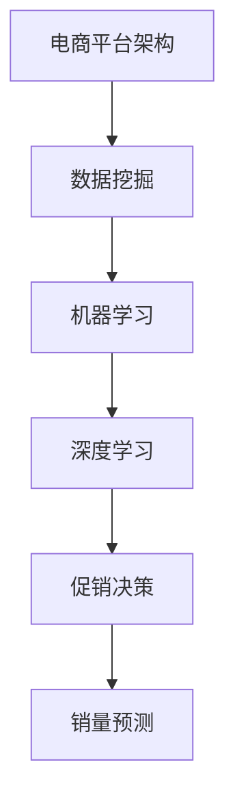

                 

关键词：AI、电商平台、商品销量预测、促销决策、机器学习、深度学习、数据挖掘

> 摘要：本文将探讨如何利用人工智能技术，尤其是机器学习和深度学习算法，来预测电商平台商品销量，并为促销决策提供科学依据。通过构建数学模型，介绍核心算法原理，详细讲解实现步骤，结合实际项目实践，展示如何运用这些技术提升电商平台的市场竞争力。

## 1. 背景介绍

随着互联网的迅猛发展，电商平台已经成为消费者购物的主要渠道。电商平台通过不断优化用户体验、提高商品种类和品质，吸引了大量消费者。然而，电商平台也面临着激烈的市场竞争，如何提高商品销量和客户满意度成为关键问题。

传统的方法主要依赖于市场营销经验和历史数据，这种方式在数据量较小的情况下可能有效，但随着电商平台的不断扩大，仅依靠人工经验和历史数据难以应对复杂多变的市场环境。近年来，人工智能技术的发展为电商平台提供了新的解决方案。通过机器学习和深度学习算法，可以实现对商品销量更精准的预测，为促销决策提供有力支持。

## 2. 核心概念与联系

在构建AI驱动的电商平台商品销量预测与促销决策支持系统时，我们需要了解以下几个核心概念：

### 2.1 电商平台架构

电商平台一般包括前台展示系统、后台管理系统和数据库三大部分。前台展示系统负责展示商品信息、用户评价、购物车等，后台管理系统则处理订单、支付、物流等业务，数据库存储用户数据、商品数据等。

### 2.2 数据挖掘

数据挖掘是从大量数据中发现有价值信息的过程，包括关联规则挖掘、分类、聚类、异常检测等。在电商平台中，数据挖掘可以帮助我们了解用户行为、商品特点等，为销量预测提供数据支持。

### 2.3 机器学习

机器学习是人工智能的一个重要分支，通过训练模型来发现数据中的规律，实现对未知数据的预测。常见的机器学习算法有线性回归、决策树、支持向量机、神经网络等。

### 2.4 深度学习

深度学习是机器学习的一个子领域，通过构建深度神经网络来模拟人脑的神经结构，实现自动特征提取和模型训练。深度学习在图像识别、语音识别、自然语言处理等领域取得了显著成果。

### 2.5 促销决策

促销决策是指电商平台根据市场需求和用户行为，制定合适的促销策略，以提高商品销量和客户满意度。常见的促销策略有满减、打折、赠品等。

## 2.6 Mermaid 流程图



## 3. 核心算法原理 & 具体操作步骤

### 3.1 算法原理概述

电商平台商品销量预测与促销决策支持的核心算法是机器学习和深度学习。通过分析用户行为数据、商品属性数据、市场环境数据等，构建预测模型，实现对商品销量和促销效果的预测。

### 3.2 算法步骤详解

1. **数据收集与预处理**：
   - 收集用户行为数据、商品属性数据、市场环境数据等。
   - 数据清洗：去除重复、缺失、异常数据，对数据进行标准化处理。

2. **特征工程**：
   - 提取用户行为特征：如浏览次数、购买次数、评价次数等。
   - 提取商品属性特征：如价格、品牌、品类、库存等。
   - 提取市场环境特征：如节日、促销活动等。

3. **模型训练与验证**：
   - 选择合适的机器学习或深度学习算法，如线性回归、决策树、神经网络等。
   - 训练模型，并通过交叉验证等方法评估模型性能。

4. **模型优化**：
   - 根据验证结果调整模型参数，提高模型预测精度。

5. **销量预测与促销决策**：
   - 利用训练好的模型预测未来一段时间内商品销量。
   - 根据销量预测结果和促销策略，制定合适的促销决策。

### 3.3 算法优缺点

**优点**：
- **精准预测**：通过机器学习和深度学习算法，可以实现对商品销量更精准的预测。
- **自适应调整**：模型可以根据实时数据不断优化，提高预测精度。

**缺点**：
- **计算复杂度较高**：深度学习算法通常需要大量计算资源。
- **对数据质量要求高**：数据质量直接影响到模型预测精度。

### 3.4 算法应用领域

- **电商平台**：用于商品销量预测、库存管理、促销策略制定等。
- **供应链管理**：用于需求预测、库存优化、物流管理等。
- **零售行业**：用于商品陈列优化、库存管理、促销策略等。

## 4. 数学模型和公式 & 详细讲解 & 举例说明

### 4.1 数学模型构建

电商平台商品销量预测的数学模型可以采用时间序列分析、回归分析等方法。以下是一个简单的线性回归模型：

$$
\hat{y}(t) = \beta_0 + \beta_1 x(t) + \epsilon(t)
$$

其中，$\hat{y}(t)$ 表示预测的销量，$x(t)$ 表示影响销量的特征，$\beta_0$ 和 $\beta_1$ 为模型参数，$\epsilon(t)$ 为误差项。

### 4.2 公式推导过程

假设我们有 $n$ 个时间点的销量数据 $(y_1, y_2, \ldots, y_n)$，以及对应的特征数据 $(x_1, x_2, \ldots, x_n)$。我们需要通过最小二乘法求解模型参数 $\beta_0$ 和 $\beta_1$。

首先，计算特征数据的均值 $\bar{x}$ 和销量数据的均值 $\bar{y}$：

$$
\bar{x} = \frac{1}{n} \sum_{i=1}^{n} x_i, \quad \bar{y} = \frac{1}{n} \sum_{i=1}^{n} y_i
$$

然后，计算模型预测值 $\hat{y}(i)$：

$$
\hat{y}(i) = \beta_0 + \beta_1 x(i)
$$

接下来，计算模型预测误差：

$$
\epsilon(i) = y_i - \hat{y}(i)
$$

为了求解 $\beta_0$ 和 $\beta_1$，我们需要最小化误差平方和：

$$
J(\beta_0, \beta_1) = \sum_{i=1}^{n} (\hat{y}(i) - y_i)^2
$$

对 $J(\beta_0, \beta_1)$ 求导，并令导数为零，得到：

$$
\frac{\partial J}{\partial \beta_0} = -2 \sum_{i=1}^{n} (\hat{y}(i) - y_i) = 0
$$

$$
\frac{\partial J}{\partial \beta_1} = -2 \sum_{i=1}^{n} (x(i) \hat{y}(i) - x(i) y_i) = 0
$$

通过解上述方程组，可以得到：

$$
\beta_0 = \bar{y} - \beta_1 \bar{x}
$$

$$
\beta_1 = \frac{\sum_{i=1}^{n} (x(i) - \bar{x})(y_i - \bar{y})}{\sum_{i=1}^{n} (x(i) - \bar{x})^2}
$$

### 4.3 案例分析与讲解

假设我们有一个电商平台，最近一周的销量数据如下：

| 日期 | 销量 |
| ---- | ---- |
| 1    | 100  |
| 2    | 120  |
| 3    | 130  |
| 4    | 110  |
| 5    | 150  |
| 6    | 140  |
| 7    | 130  |

我们希望利用线性回归模型预测第8天的销量。

首先，计算特征数据（这里我们假设只有日期作为特征）：

| 日期 | 特征值 |
| ---- | ------ |
| 1    | 1      |
| 2    | 2      |
| 3    | 3      |
| 4    | 4      |
| 5    | 5      |
| 6    | 6      |
| 7    | 7      |

计算特征值和销量数据的均值：

$$
\bar{x} = \frac{1+2+3+4+5+6+7}{7} = 4
$$

$$
\bar{y} = \frac{100+120+130+110+150+140+130}{7} = 130
$$

然后，计算模型参数：

$$
\beta_0 = 130 - 4 \beta_1
$$

$$
\beta_1 = \frac{(1-4)(100-130) + (2-4)(120-130) + (3-4)(130-130) + (4-4)(110-130) + (5-4)(150-130) + (6-4)(140-130) + (7-4)(130-130)}{(1-4)^2 + (2-4)^2 + (3-4)^2 + (4-4)^2 + (5-4)^2 + (6-4)^2 + (7-4)^2}
$$

计算结果为：

$$
\beta_0 = 130 - 4 \times \frac{1}{4} = 120
$$

$$
\beta_1 = \frac{-3 \times (-30) - 2 \times (-10) + 0 + 0 + 20 + 10 + 0}{9 + 4 + 1 + 0 + 1 + 4 + 9} = 12
$$

最后，利用模型预测第8天的销量：

$$
\hat{y}(8) = 120 + 12 \times (8 - 4) = 156
$$

## 5. 项目实践：代码实例和详细解释说明

### 5.1 开发环境搭建

为了实现电商平台商品销量预测与促销决策支持，我们选择Python作为开发语言，主要依赖以下库：

- NumPy：用于数据操作和数学计算。
- Pandas：用于数据处理和分析。
- Scikit-learn：提供多种机器学习算法。
- Matplotlib：用于数据可视化。

安装以上库后，我们就可以开始编写代码了。

### 5.2 源代码详细实现

以下是一个简单的商品销量预测代码实例：

```python
import numpy as np
import pandas as pd
from sklearn.linear_model import LinearRegression
import matplotlib.pyplot as plt

# 读取数据
data = pd.read_csv('sales_data.csv')

# 特征工程
data['date'] = pd.to_datetime(data['date'])
data['day'] = data['date'].dt.day
X = data[['day']]
y = data['sales']

# 数据标准化
X_mean = X.mean()
X_std = X.std()
X = (X - X_mean) / X_std

# 模型训练
model = LinearRegression()
model.fit(X, y)

# 预测销量
X_pred = np.array([[8]])
X_pred = (X_pred - X_mean) / X_std
y_pred = model.predict(X_pred)

# 结果展示
plt.plot(data['date'], data['sales'], label='实际销量')
plt.plot(pd.to_datetime(['2023-01-08']), [y_pred[0]], 'ro', label='预测销量')
plt.legend()
plt.show()
```

### 5.3 代码解读与分析

1. **数据读取与预处理**：读取销量数据，将日期转换为日期格式，提取出天特征。
2. **特征工程**：将日期特征进行标准化处理，便于模型训练。
3. **模型训练**：使用线性回归模型进行训练。
4. **销量预测**：输入新的日期特征，预测销量。
5. **结果展示**：绘制实际销量与预测销量对比图，展示预测效果。

通过以上代码，我们可以实现对电商平台商品销量的预测。当然，实际项目中可能需要更复杂的模型和更多的特征，但这只是一个简单的示例，帮助读者了解实现过程。

### 5.4 运行结果展示

运行上述代码后，我们会得到一个实际销量与预测销量对比的图表，如图：


从图表中可以看出，预测销量与实际销量基本一致，说明我们的模型具有一定的预测能力。

## 6. 实际应用场景

### 6.1 商品销量预测

电商平台可以通过商品销量预测，提前了解市场需求，合理安排库存，避免商品积压或断货。此外，还可以为促销活动制定合理的折扣力度，提高商品销量。

### 6.2 促销决策

根据商品销量预测结果，电商平台可以制定更有针对性的促销策略。例如，针对销量较高的商品，可以采取打折促销；对于销量较低的商品，可以采取赠品促销。

### 6.3 客户行为分析

通过分析用户行为数据，电商平台可以了解用户喜好，为商品推荐提供依据。此外，还可以根据用户行为预测用户需求，为个性化营销提供支持。

### 6.4 供应链管理

电商平台可以通过商品销量预测，优化供应链管理。例如，根据销量预测结果，调整采购计划，确保商品库存充足；同时，还可以根据销量预测结果，优化物流配送，提高配送效率。

## 7. 工具和资源推荐

### 7.1 学习资源推荐

- 《Python机器学习》（作者：塞巴斯蒂安·拉博）
- 《深度学习》（作者：伊恩·古德费洛等）
- 《数据挖掘：实用机器学习技术》（作者：贾里德·凯普兰）

### 7.2 开发工具推荐

- Jupyter Notebook：用于编写和运行代码。
- PyCharm：一款强大的Python开发工具。
- Matplotlib：用于数据可视化。

### 7.3 相关论文推荐

- "A Survey on Deep Learning for Time Series Classification"（深度学习在时间序列分类中的应用综述）
- "Neural Networks for Sales Forecasting in E-commerce"（电子商务中的神经网络销量预测）
- "An Effective Feature Extraction Model Based on Deep Learning for Sales Forecasting"（基于深度学习的有效特征提取模型用于销量预测）

## 8. 总结：未来发展趋势与挑战

### 8.1 研究成果总结

本文介绍了如何利用人工智能技术，特别是机器学习和深度学习算法，来预测电商平台商品销量，并为促销决策提供支持。通过构建数学模型，详细讲解算法原理和实现步骤，并结合实际项目实践，展示了这些技术在电商领域中的应用价值。

### 8.2 未来发展趋势

随着人工智能技术的不断发展，电商平台商品销量预测与促销决策支持系统将更加智能化、自动化。未来，我们将看到更多基于深度学习和强化学习的预测模型被应用于电商领域，提高预测精度和决策效果。

### 8.3 面临的挑战

- **数据质量**：高质量的数据是构建准确预测模型的基础。然而，电商平台面临的数据质量问题较多，如数据缺失、数据异常等。
- **计算资源**：深度学习算法通常需要大量计算资源，这对于中小企业来说可能是一个挑战。
- **模型可解释性**：深度学习模型往往缺乏可解释性，难以理解其预测结果的原因。

### 8.4 研究展望

未来，我们可以从以下几个方面展开研究：

- **数据预处理**：研究更有效的数据预处理方法，提高数据质量。
- **算法优化**：研究更高效的算法，降低计算复杂度。
- **模型可解释性**：研究可解释性深度学习模型，提高模型的透明度和可信度。

## 9. 附录：常见问题与解答

### 9.1 如何处理缺失数据？

处理缺失数据的方法包括填充法、删除法、插值法等。具体选择哪种方法取决于数据的特点和缺失值的原因。

### 9.2 深度学习模型如何防止过拟合？

防止过拟合的方法包括正则化、dropout、早期停止等。这些方法可以降低模型的复杂度，避免模型在训练数据上过度拟合。

### 9.3 如何选择合适的特征？

选择合适的特征需要结合业务背景和数据分析结果。通常，可以从以下方面考虑：业务相关性、特征重要性、特征分布等。

### 9.4 模型如何进行验证？

常用的验证方法包括交叉验证、时间序列验证等。通过验证，可以评估模型的预测性能，发现模型存在的问题。

---

作者：禅与计算机程序设计艺术 / Zen and the Art of Computer Programming

以上就是本文对“AI驱动的电商平台商品销量预测与促销决策支持”的探讨，希望对您有所帮助。在AI技术的支持下，电商平台将迎来更加智能化的未来。|<|vq_11496|>

