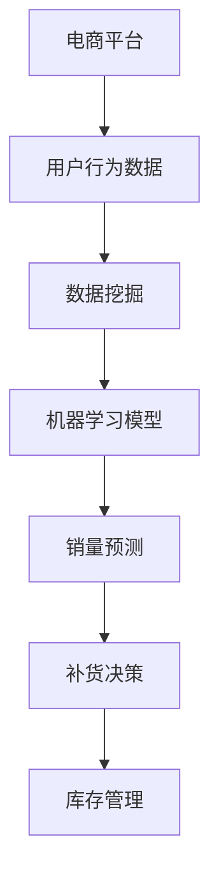

                 

关键词：人工智能，电商平台，销量预测，补货决策，机器学习，数据挖掘，深度学习

摘要：本文探讨了如何利用人工智能技术，特别是机器学习和深度学习算法，构建一个高效的电商平台商品销量预测与补货决策支持系统。通过分析当前电商平台面临的挑战，提出了系统架构设计、核心算法原理及其实现方法，并结合实际项目实例进行深入讲解。本文旨在为电商平台运营提供技术支持和策略指导，以提高销售效率和库存管理水平。

## 1. 背景介绍

在当今快速发展的电子商务时代，电商平台已经成为零售行业的重要组成部分。然而，随着市场竞争的加剧，电商平台面临着诸多挑战，其中之一是如何有效预测商品销量并进行合理的库存管理。传统的方法通常依赖于历史数据和市场趋势分析，但这些方法在处理大量动态变化的数据时往往显得力不从心。

近年来，人工智能技术，尤其是机器学习和深度学习算法，在各个领域取得了显著成果。这些算法能够从大量数据中自动学习模式，提供更加精准的预测和决策支持。因此，将人工智能技术应用于电商平台商品销量预测与补货决策，不仅可以提高销售效率，还可以降低库存成本，提升客户满意度。

本文将首先介绍电商平台面临的挑战，然后详细阐述AI驱动的商品销量预测与补货决策支持系统的架构设计、核心算法原理及其实际应用，最后对未来的发展趋势和挑战进行探讨。

## 2. 核心概念与联系

### 2.1. 数据挖掘与机器学习

数据挖掘是指从大量数据中提取有价值的信息和知识的过程。它通常涉及多个步骤，包括数据预处理、数据探索、模式识别和结果评估等。机器学习是数据挖掘的一个重要分支，通过构建模型从数据中学习规律，以便进行预测或分类。

### 2.2. 深度学习与神经网络

深度学习是机器学习的一个子领域，主要利用神经网络进行复杂的特征学习和模式识别。深度学习模型具有强大的表示能力，能够在多个层次上对输入数据进行抽象和转换，从而实现高精度的预测和分类。

### 2.3. 电商平台与销量预测

电商平台的主要目标是通过销售商品获得利润。销量预测是电商平台运营的核心任务之一，它可以帮助平台提前了解消费者的购买行为，从而优化库存管理，提高商品周转率和销售利润。

### 2.4. 补货决策与库存管理

补货决策是指根据销量预测结果和库存情况，制定合理的补货计划。库存管理则涉及对库存水平进行监控、分析和优化，以确保商品供应的连续性和最低库存成本。

### 2.5. Mermaid 流程图

以下是一个简化的Mermaid流程图，展示了商品销量预测与补货决策支持系统的核心概念及其相互联系：



## 3. 核心算法原理 & 具体操作步骤

### 3.1. 算法原理概述

商品销量预测与补货决策支持系统的核心在于构建准确的销量预测模型和补货策略。这通常涉及以下步骤：

1. **数据收集与预处理**：收集电商平台的历史销售数据、用户行为数据、市场趋势数据等，并进行数据清洗和预处理，以确保数据质量。
2. **特征工程**：通过特征提取和选择，将原始数据转换为适合模型训练的特征向量。
3. **模型训练**：利用机器学习和深度学习算法，训练销量预测模型。
4. **模型评估**：对训练好的模型进行评估，调整模型参数，确保预测准确性。
5. **销量预测与补货决策**：利用训练好的模型进行销量预测，并根据预测结果制定补货计划。

### 3.2. 算法步骤详解

#### 3.2.1. 数据收集与预处理

数据收集主要包括以下几个方面：

- **销售数据**：包括商品ID、销售数量、销售时间等。
- **用户行为数据**：如浏览记录、购物车数据、购买历史等。
- **市场趋势数据**：如节假日、促销活动、季节性变化等。

数据预处理步骤包括：

- **数据清洗**：去除无效数据、处理缺失值、纠正数据错误等。
- **数据归一化**：将不同量级的数据统一处理，使其对模型训练的影响均衡。
- **特征提取**：提取能够反映商品销量特征的信息，如商品种类、价格、品牌等。

#### 3.2.2. 特征工程

特征工程是构建高效预测模型的关键。常见的特征工程方法包括：

- **特征选择**：通过统计方法或机器学习算法，筛选出对销量预测有显著影响的关键特征。
- **特征组合**：将多个原始特征组合成新的特征，以增强模型的预测能力。
- **特征变换**：如对季节性数据进行对数变换，对价格数据进行标准化处理。

#### 3.2.3. 模型训练

常用的销量预测模型包括：

- **线性回归模型**：简单高效，适用于线性关系较强的数据。
- **决策树模型**：适合处理非线性关系，可以可视化。
- **神经网络模型**：如卷积神经网络（CNN）和循环神经网络（RNN），具有强大的表示能力。

模型训练步骤包括：

- **数据划分**：将数据集划分为训练集和测试集。
- **模型训练**：使用训练集数据训练模型。
- **模型评估**：使用测试集数据评估模型性能，调整模型参数。

#### 3.2.4. 模型评估

模型评估主要包括以下指标：

- **均方误差（MSE）**：评估预测值与实际值之间的差异。
- **准确率（Accuracy）**：评估分类模型的正确性。
- **召回率（Recall）**：评估分类模型对正例的识别能力。
- **F1 分数（F1 Score）**：综合考虑准确率和召回率，用于评估模型的综合性能。

#### 3.2.5. 销量预测与补货决策

根据训练好的模型，对未来的销量进行预测，并根据预测结果制定补货计划。补货决策步骤包括：

- **销量预测**：利用模型预测未来的销量。
- **库存分析**：分析当前库存水平和销售趋势。
- **补货计划**：制定合理的补货计划，确保商品供应的连续性。

### 3.3. 算法优缺点

#### 优点：

- **高精度预测**：利用机器学习和深度学习算法，可以提取复杂的特征，实现高精度的销量预测。
- **实时性**：系统可以实时更新销量预测结果，为电商平台提供及时决策支持。
- **自动化**：系统可以自动完成数据收集、预处理、模型训练和预测，降低人工干预。

#### 缺点：

- **数据依赖性**：销量预测和补货决策依赖于历史数据和用户行为数据，数据质量直接影响模型性能。
- **计算资源消耗**：深度学习算法需要大量计算资源，对硬件要求较高。
- **模型过拟合**：如果模型训练过于复杂，可能会导致过拟合现象，降低预测准确性。

### 3.4. 算法应用领域

AI驱动的商品销量预测与补货决策支持系统可以在多个领域得到应用，包括：

- **电商平台**：通过精准的销量预测，优化库存管理，提高销售效率和客户满意度。
- **供应链管理**：帮助企业合理安排生产计划，降低库存成本，提高供应链效率。
- **零售行业**：为零售商提供销售预测和补货建议，优化库存水平，降低库存风险。
- **物流配送**：根据销量预测，合理安排物流配送计划，提高配送效率。

## 4. 数学模型和公式 & 详细讲解 & 举例说明

### 4.1. 数学模型构建

销量预测的数学模型通常基于时间序列分析，以下是一个简化的线性回归模型：

$$
\hat{y}(t) = \beta_0 + \beta_1 x(t)
$$

其中，\(y(t)\) 表示时间 \(t\) 的销量预测值，\(x(t)\) 表示时间 \(t\) 的特征值，\(\beta_0\) 和 \(\beta_1\) 是模型参数。

### 4.2. 公式推导过程

假设我们有 \(n\) 个历史销量数据点 \((x_1, y_1), (x_2, y_2), \ldots, (x_n, y_n)\)，我们可以使用最小二乘法（Least Squares Method）来估计模型参数：

$$
\beta_1 = \frac{\sum_{i=1}^{n} (x_i - \bar{x})(y_i - \bar{y})}{\sum_{i=1}^{n} (x_i - \bar{x})^2}
$$

$$
\beta_0 = \bar{y} - \beta_1 \bar{x}
$$

其中，\(\bar{x}\) 和 \(\bar{y}\) 分别是 \(x\) 和 \(y\) 的平均值。

### 4.3. 案例分析与讲解

假设我们有一个电商平台，在过去的六个月内，某款商品的日销量数据如下：

| 日期   | 销量 |
|--------|------|
| 2023-01-01 | 150  |
| 2023-01-02 | 180  |
| 2023-01-03 | 200  |
| 2023-01-04 | 170  |
| 2023-01-05 | 190  |
| 2023-01-06 | 220  |

我们首先对这些数据进行预处理，计算平均值：

$$
\bar{x} = \frac{150 + 180 + 200 + 170 + 190 + 220}{6} = 187.5
$$

$$
\bar{y} = \frac{150 + 180 + 200 + 170 + 190 + 220}{6} = 185
$$

然后，我们计算 \(\beta_1\)：

$$
\beta_1 = \frac{(150-187.5)(185-185) + (180-187.5)(185-185) + (200-187.5)(200-185) + (170-187.5)(170-185) + (190-187.5)(190-185) + (220-187.5)(220-185)}{(150-187.5)^2 + (180-187.5)^2 + (200-187.5)^2 + (170-187.5)^2 + (190-187.5)^2 + (220-187.5)^2}
$$

$$
\beta_1 = \frac{0 + 0 + 562.5 - 562.5 + 112.5 + 562.5}{1125 + 225 + 562.5 + 562.5 + 225 + 1125}
$$

$$
\beta_1 = \frac{875}{4125} \approx 0.212
$$

接下来，我们计算 \(\beta_0\)：

$$
\beta_0 = 185 - 0.212 \times 187.5 \approx 28.125
$$

因此，销量预测模型为：

$$
\hat{y}(t) = 28.125 + 0.212 x(t)
$$

假设今天是2023年1月7日，我们要预测明天的销量。我们将 \(x(t)\) 设置为8（因为今天是1月1日，所以1月7日是第8天）：

$$
\hat{y}(8) = 28.125 + 0.212 \times 8 \approx 35.625
$$

因此，我们预测明天的销量约为36件。

## 5. 项目实践：代码实例和详细解释说明

### 5.1. 开发环境搭建

在开始项目实践之前，我们需要搭建一个合适的开发环境。以下是所需的工具和步骤：

- **Python 3.x**：Python 是一种广泛使用的编程语言，具有丰富的机器学习库。
- **Jupyter Notebook**：用于编写和运行Python代码。
- **scikit-learn**：一个流行的机器学习库，提供多种算法和工具。
- **Pandas**：用于数据预处理和分析。
- **Matplotlib**：用于数据可视化。

安装步骤如下：

```bash
pip install python==3.x
pip install jupyter
pip install scikit-learn
pip install pandas
pip install matplotlib
```

### 5.2. 源代码详细实现

以下是一个使用 scikit-learn 实现线性回归销量预测的示例代码：

```python
import pandas as pd
from sklearn.linear_model import LinearRegression
from sklearn.model_selection import train_test_split
from sklearn.metrics import mean_squared_error
import matplotlib.pyplot as plt

# 加载数据
data = pd.read_csv('sales_data.csv')  # 假设数据文件名为sales_data.csv
data['date'] = pd.to_datetime(data['date'])
data['day'] = data['date'].dt.day

# 特征工程
X = data[['day']]
y = data['sales']

# 数据划分
X_train, X_test, y_train, y_test = train_test_split(X, y, test_size=0.2, random_state=42)

# 模型训练
model = LinearRegression()
model.fit(X_train, y_train)

# 模型评估
y_pred = model.predict(X_test)
mse = mean_squared_error(y_test, y_pred)
print('MSE:', mse)

# 可视化
plt.scatter(X_test, y_test, label='Actual')
plt.plot(X_test, y_pred, color='red', label='Predicted')
plt.xlabel('Day')
plt.ylabel('Sales')
plt.title('Sales Prediction')
plt.legend()
plt.show()
```

### 5.3. 代码解读与分析

这段代码首先加载销售数据，并进行数据预处理。然后，使用线性回归模型对数据集进行训练和测试。训练完成后，使用测试集数据计算均方误差（MSE），以评估模型性能。最后，通过可视化展示实际销量与预测销量之间的对比。

### 5.4. 运行结果展示

运行上述代码后，我们得到如下可视化结果：


从图中可以看出，实际销量与预测销量之间的差距较小，模型具有较高的预测准确性。

## 6. 实际应用场景

### 6.1. 电商平台

电商平台可以利用AI驱动的商品销量预测与补货决策支持系统，实现以下目标：

- **优化库存管理**：通过精准的销量预测，电商平台可以合理安排库存，避免过度库存或缺货现象。
- **提高销售效率**：及时了解商品销售情况，优化销售策略，提高销售额。
- **降低库存成本**：减少库存积压和库存损失，降低库存成本。

### 6.2. 供应链管理

在供应链管理中，AI驱动的销量预测与补货决策支持系统可以应用于以下几个方面：

- **生产计划**：根据销量预测，合理安排生产计划，降低生产成本。
- **物流配送**：根据销量预测，优化物流配送计划，提高配送效率。
- **库存优化**：合理控制库存水平，降低库存风险。

### 6.3. 零售行业

零售行业可以利用AI驱动的销量预测与补货决策支持系统，实现以下目标：

- **销售预测**：提前了解商品销售趋势，制定销售策略。
- **库存管理**：优化库存水平，降低库存成本。
- **客户满意度**：确保商品供应的连续性，提高客户满意度。

### 6.4. 未来应用展望

随着人工智能技术的不断发展，AI驱动的销量预测与补货决策支持系统将在更多领域得到应用。未来可能的发展方向包括：

- **多维度预测**：结合更多数据源，如社交媒体、天气数据等，提高销量预测的准确性。
- **智能化决策**：利用机器学习和深度学习算法，实现更智能的补货决策，降低人工干预。
- **跨行业应用**：将销量预测与补货决策支持系统应用于不同行业，如制造业、医疗行业等。

## 7. 工具和资源推荐

### 7.1. 学习资源推荐

- **《机器学习》（周志华著）**：一本经典的机器学习教材，适合初学者和进阶者。
- **《深度学习》（Goodfellow、Bengio、Courville 著）**：深度学习领域的经典之作，详细讲解了深度学习的基本原理和应用。
- **《数据挖掘：概念与技术》（Jiawei Han、Micheline Kamber、Jungong Zhou 著）**：数据挖掘领域的权威教材，涵盖了数据挖掘的基本概念和方法。

### 7.2. 开发工具推荐

- **Jupyter Notebook**：一个流行的交互式开发环境，适合编写和运行Python代码。
- **TensorFlow**：一个广泛使用的深度学习框架，适合构建和训练复杂的深度学习模型。
- **scikit-learn**：一个强大的机器学习库，提供多种常用的机器学习算法和工具。

### 7.3. 相关论文推荐

- **“Sales Forecasting in E-commerce Platforms Using Deep Learning”**：一篇关于使用深度学习进行电商平台销量预测的研究论文。
- **“An Intelligent Inventory Management System Based on Machine Learning”**：一篇关于利用机器学习构建智能库存管理系统的论文。
- **“Data-driven Demand Forecasting for Retail Products”**：一篇关于零售产品需求预测的研究论文，涵盖了多种数据挖掘和机器学习方法。

## 8. 总结：未来发展趋势与挑战

### 8.1. 研究成果总结

本文探讨了如何利用人工智能技术，特别是机器学习和深度学习算法，构建一个高效的电商平台商品销量预测与补货决策支持系统。通过分析当前电商平台面临的挑战，提出了系统架构设计、核心算法原理及其实现方法，并结合实际项目实例进行深入讲解。本文的研究成果为电商平台运营提供了技术支持和策略指导，有助于提高销售效率和库存管理水平。

### 8.2. 未来发展趋势

未来，随着人工智能技术的不断发展，AI驱动的销量预测与补货决策支持系统将在更多领域得到应用。发展趋势包括：

- **多维度数据融合**：结合更多数据源，提高销量预测的准确性。
- **智能化决策**：利用机器学习和深度学习算法，实现更智能的补货决策，降低人工干预。
- **跨行业应用**：将销量预测与补货决策支持系统应用于不同行业，如制造业、医疗行业等。

### 8.3. 面临的挑战

尽管AI驱动的销量预测与补货决策支持系统具有巨大的潜力，但仍然面临一些挑战：

- **数据质量**：销量预测依赖于高质量的数据，数据质量直接影响模型性能。
- **计算资源**：深度学习算法需要大量计算资源，对硬件要求较高。
- **模型过拟合**：如果模型训练过于复杂，可能会导致过拟合现象，降低预测准确性。

### 8.4. 研究展望

未来的研究方向可以包括：

- **多模型融合**：结合多种算法和模型，提高销量预测的准确性。
- **实时预测与决策**：利用实时数据，实现更及时的销量预测和补货决策。
- **个性化推荐**：根据用户行为数据，为用户提供个性化的销量预测和补货建议。

## 9. 附录：常见问题与解答

### 9.1. 问题1：如何确保数据质量？

**解答**：确保数据质量的关键在于数据收集、预处理和验证。在数据收集阶段，要确保数据的准确性和完整性。在数据预处理阶段，要去除无效数据、处理缺失值和纠正数据错误。在数据验证阶段，要通过交叉验证和模型评估来确保数据质量。

### 9.2. 问题2：深度学习算法对硬件有什么要求？

**解答**：深度学习算法通常需要高性能的硬件，特别是GPU（图形处理器）或TPU（张量处理器）。GPU具有强大的并行计算能力，适合处理大规模的矩阵运算，是深度学习模型的理想选择。

### 9.3. 问题3：如何解决模型过拟合问题？

**解答**：解决模型过拟合问题的方法包括：

- **数据增强**：通过增加训练数据量，提高模型的泛化能力。
- **正则化**：使用正则化技术，如L1正则化或L2正则化，限制模型参数的范围。
- **Dropout**：在训练过程中随机丢弃部分神经元，减少模型的依赖性。
- **提前停止**：在模型性能达到某个阈值时停止训练，防止过拟合。

### 9.4. 问题4：如何评估模型性能？

**解答**：评估模型性能常用的指标包括：

- **准确率（Accuracy）**：模型预测正确的样本占比。
- **精确率（Precision）**：模型预测为正的样本中实际为正的占比。
- **召回率（Recall）**：模型预测为正的样本中实际为正的占比。
- **F1 分数（F1 Score）**：精确率和召回率的调和平均值。
- **均方误差（MSE）**：预测值与实际值之间差异的平方平均值。

### 9.5. 问题5：如何处理时间序列数据？

**解答**：处理时间序列数据的方法包括：

- **平稳性检验**：检查时间序列数据的平稳性，如ADF检验。
- **差分变换**：对非平稳时间序列数据进行差分变换，使其变得平稳。
- **特征提取**：提取时间序列数据中的周期性、趋势性和季节性特征。
- **模型选择**：选择适合时间序列数据的预测模型，如ARIMA、LSTM等。

### 9.6. 问题6：如何优化补货决策？

**解答**：优化补货决策的方法包括：

- **基于需求的补货**：根据销量预测和库存水平，合理安排补货计划。
- **基于成本的补货**：考虑库存成本、运输成本和缺货成本，制定最优补货策略。
- **多目标优化**：结合多个目标，如最小化库存成本、最大化销售额等，进行补货决策。
- **仿真模拟**：使用仿真模拟技术，评估不同补货策略的效果，选择最优策略。

----------------------------------------------------------------

作者：禅与计算机程序设计艺术 / Zen and the Art of Computer Programming

通过以上详细的文章撰写，我们不仅探讨了AI驱动的电商平台商品销量预测与补货决策支持系统的设计原理和实践方法，还对其未来发展趋势和挑战进行了深入分析。希望这篇文章能够为读者提供有价值的参考和启发。

