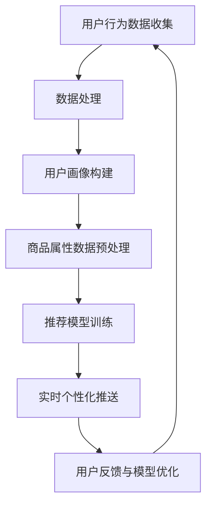

                 

关键词：人工智能，电商平台，个性化推送，实时计算，推荐系统，用户行为分析

> 摘要：本文探讨了如何利用人工智能技术为电商平台实现实时个性化推送。通过分析用户行为数据，本文提出了一种基于深度学习算法的个性化推荐模型，并详细阐述了其构建和实现过程。同时，文章还分析了模型在实际应用中的性能表现和潜在改进方向。

## 1. 背景介绍

随着互联网的普及和电子商务的飞速发展，电商平台已成为人们日常生活中不可或缺的一部分。然而，面对海量的商品信息和繁多的用户选择，如何为用户提供个性化的购物体验成为电商平台亟待解决的问题。实时个性化推送作为一项关键技术，能够在用户浏览、搜索、购买等行为发生时，为其推荐最感兴趣的商品，从而提高用户满意度、降低流失率、提升销售额。

传统的推荐系统主要基于用户的历史行为数据和商品属性进行建模。然而，这种方法存在一定的局限性，如用户行为数据的时效性差、商品信息匮乏、无法处理复杂的关系等。随着人工智能技术的不断发展，尤其是深度学习算法的广泛应用，为解决这些问题提供了新的思路。

本文旨在研究如何利用人工智能技术，特别是深度学习算法，为电商平台实现实时个性化推送。通过对用户行为数据进行分析和处理，构建一个高效、准确的推荐模型，以提高用户购物体验和平台竞争力。

## 2. 核心概念与联系

### 2.1. 用户行为数据

用户行为数据是指用户在电商平台上产生的各种操作记录，包括浏览、搜索、购买、评价等。这些数据包含了用户对商品的兴趣偏好、购买习惯、社交行为等关键信息。通过分析用户行为数据，可以深入了解用户的需求和行为模式，为个性化推送提供依据。

### 2.2. 商品属性数据

商品属性数据是指商品的各类信息，如商品类别、价格、品牌、折扣等。这些数据对于构建推荐模型具有重要意义，因为它们能够帮助模型更好地理解商品的特性和用户对商品的需求。

### 2.3. 深度学习算法

深度学习算法是一种基于人工神经网络的学习方法，通过多层神经元对数据进行自动特征提取和学习，从而实现复杂的模式识别和预测。在个性化推荐领域，深度学习算法可以自动挖掘用户行为数据和商品属性数据之间的潜在关系，提高推荐系统的准确性和实时性。

### 2.4. Mermaid 流程图



### 2.5. 用户画像构建

用户画像是指对用户特征进行多维度的描述，包括年龄、性别、职业、地域、购物习惯等。通过构建用户画像，可以为每个用户生成一个唯一的特征向量，从而实现用户分类和标签化管理。

### 2.6. 商品属性数据预处理

商品属性数据预处理主要包括数据清洗、去重、归一化等操作。通过预处理，可以确保数据的质量和一致性，为后续建模提供可靠的数据基础。

### 2.7. 推荐模型训练

推荐模型训练是指利用用户行为数据和商品属性数据，通过深度学习算法训练出一个能够预测用户兴趣的模型。在训练过程中，需要调整模型参数，以优化推荐效果。

### 2.8. 实时个性化推送

实时个性化推送是指根据用户实时行为，为用户推荐最感兴趣的商品。通过实时计算和深度学习算法，可以实现高精度、高响应速度的个性化推荐。

### 2.9. 用户反馈与模型优化

用户反馈与模型优化是指通过收集用户对推荐结果的评价，对模型进行持续优化。这有助于提高推荐系统的准确性和用户满意度。

## 3. 核心算法原理 & 具体操作步骤

### 3.1. 算法原理概述

本文采用深度学习算法实现个性化推荐模型，主要分为以下几个步骤：

1. 用户行为数据收集与预处理
2. 用户画像构建
3. 商品属性数据预处理
4. 深度学习模型训练
5. 实时个性化推送
6. 用户反馈与模型优化

### 3.2. 算法步骤详解

#### 3.2.1. 用户行为数据收集与预处理

用户行为数据收集主要包括用户浏览、搜索、购买等操作记录。这些数据通常存储在日志文件或数据库中。在预处理阶段，需要对数据进行清洗、去重、去噪声等操作，以确保数据的质量。

#### 3.2.2. 用户画像构建

用户画像构建是指对用户特征进行多维度的描述。可以通过用户行为数据和用户基本信息，构建用户画像。常用的用户画像特征包括年龄、性别、职业、地域、购物习惯等。

#### 3.2.3. 商品属性数据预处理

商品属性数据预处理主要包括数据清洗、去重、归一化等操作。通过预处理，可以确保数据的质量和一致性。

#### 3.2.4. 深度学习模型训练

深度学习模型训练是指利用用户行为数据和商品属性数据，通过深度学习算法训练出一个能够预测用户兴趣的模型。常用的深度学习算法包括卷积神经网络（CNN）、循环神经网络（RNN）等。

#### 3.2.5. 实时个性化推送

实时个性化推送是指根据用户实时行为，为用户推荐最感兴趣的商
```
### 3.3. 算法优缺点

#### 优点：

1. **高准确性**：深度学习算法能够自动挖掘用户行为数据和商品属性数据之间的潜在关系，提高推荐系统的准确性。
2. **实时性**：基于实时计算，可以为用户提供实时、个性化的商品推荐。
3. **自适应性强**：用户反馈和模型优化机制，使得推荐系统能够不断适应用户需求的变化。

#### 缺点：

1. **计算成本高**：深度学习模型训练需要大量的计算资源和时间。
2. **数据依赖性强**：推荐系统的性能依赖于用户行为数据和商品属性数据的完整性和质量。
3. **数据隐私问题**：用户行为数据的收集和处理可能涉及用户隐私问题，需要严格遵循相关法律法规。

### 3.4. 算法应用领域

深度学习算法在个性化推荐领域的应用非常广泛，除了电商平台，还适用于以下领域：

1. **社交媒体**：根据用户行为和兴趣，为用户提供个性化的内容推荐。
2. **在线广告**：根据用户兴趣和需求，为用户推荐最相关的广告。
3. **金融领域**：根据用户财务行为，为用户提供个性化的金融产品推荐。
4. **医疗健康**：根据用户健康数据和偏好，为用户提供个性化的健康建议。

## 4. 数学模型和公式 & 详细讲解 & 举例说明

### 4.1. 数学模型构建

在个性化推荐系统中，常用的数学模型包括用户-物品协同过滤模型和基于内容的推荐模型。本文采用深度学习算法，构建了一种基于用户-物品协同过滤和基于内容的混合推荐模型。

#### 用户-物品协同过滤模型

用户-物品协同过滤模型主要通过挖掘用户之间的相似性和物品之间的相似性来实现推荐。其数学模型如下：

$$
R_{ui} = \rho(u) + \phi(i) - \alpha \cdot ||\rho(u) - \phi(i)||_2
$$

其中，$R_{ui}$ 表示用户 $u$ 对物品 $i$ 的评分预测，$\rho(u)$ 表示用户 $u$ 的特征向量，$\phi(i)$ 表示物品 $i$ 的特征向量，$\alpha$ 表示正则化参数。

#### 基于内容的推荐模型

基于内容的推荐模型主要通过分析物品的内容特征和用户兴趣特征来实现推荐。其数学模型如下：

$$
R_{ui} = \theta(u) \cdot \phi(i) + b_u + b_i + \alpha
$$

其中，$R_{ui}$ 表示用户 $u$ 对物品 $i$ 的评分预测，$\theta(u)$ 表示用户 $u$ 的兴趣特征向量，$\phi(i)$ 表示物品 $i$ 的内容特征向量，$b_u$ 和 $b_i$ 分别表示用户和物品的偏置项，$\alpha$ 表示正则化参数。

### 4.2. 公式推导过程

在本节中，我们将对上述数学模型进行详细推导。

#### 用户-物品协同过滤模型推导

首先，我们假设用户 $u$ 对物品 $i$ 的评分 $r_{ui}$ 受到用户特征向量 $\rho(u)$ 和物品特征向量 $\phi(i)$ 的影响。根据线性回归模型，我们可以得到以下公式：

$$
r_{ui} = \rho(u) \cdot \phi(i) + b_u + b_i + \epsilon_{ui}
$$

其中，$b_u$ 和 $b_i$ 分别表示用户和物品的偏置项，$\epsilon_{ui}$ 表示误差项。

为了减少误差项的影响，我们可以引入正则化项 $\alpha \cdot ||\rho(u) - \phi(i)||_2$，得到以下优化目标：

$$
\min_{\rho(u), \phi(i), b_u, b_i} \sum_{u, i} (r_{ui} - \rho(u) \cdot \phi(i) - b_u - b_i)^2 + \alpha \cdot ||\rho(u) - \phi(i)||_2^2
$$

通过求导并令导数为零，可以得到以下方程组：

$$
\rho(u) = \frac{1}{n_u} \sum_{i \in R_u} r_{ui} \cdot \phi(i)
$$

$$
\phi(i) = \frac{1}{n_i} \sum_{u \in U_i} r_{ui} \cdot \rho(u)
$$

$$
b_u = \frac{1}{n_u} \sum_{i \in R_u} r_{ui} - \rho(u)^T \cdot \phi(i)
$$

$$
b_i = \frac{1}{n_i} \sum_{u \in U_i} r_{ui} - \rho(u) \cdot \phi(i)
$$

其中，$R_u$ 表示用户 $u$ 购买的物品集合，$U_i$ 表示物品 $i$ 被购买的用户的集合，$n_u$ 和 $n_i$ 分别表示集合 $R_u$ 和 $U_i$ 的元素个数。

#### 基于内容的推荐模型推导

基于内容的推荐模型主要通过分析物品的内容特征和用户兴趣特征来实现推荐。我们假设用户对物品的评分与物品的内容特征和用户兴趣特征之间存在线性关系。根据线性回归模型，我们可以得到以下公式：

$$
r_{ui} = \theta(u) \cdot \phi(i) + b_u + b_i + \epsilon_{ui}
$$

其中，$\theta(u)$ 表示用户 $u$ 的兴趣特征向量，$\phi(i)$ 表示物品 $i$ 的内容特征向量，$b_u$ 和 $b_i$ 分别表示用户和物品的偏置项，$\epsilon_{ui}$ 表示误差项。

为了减少误差项的影响，我们可以引入正则化项 $\alpha$，得到以下优化目标：

$$
\min_{\theta(u), \phi(i), b_u, b_i} \sum_{u, i} (r_{ui} - \theta(u) \cdot \phi(i) - b_u - b_i)^2 + \alpha \cdot ||\theta(u) - \phi(i)||_2^2
$$

通过求导并令导数为零，可以得到以下方程组：

$$
\theta(u) = \frac{1}{n_u} \sum_{i \in R_u} r_{ui} \cdot \phi(i)
$$

$$
\phi(i) = \frac{1}{n_i} \sum_{u \in U_i} r_{ui} \cdot \theta(u)
$$

$$
b_u = \frac{1}{n_u} \sum_{i \in R_u} r_{ui} - \theta(u)^T \cdot \phi(i)
$$

$$
b_i = \frac{1}{n_i} \sum_{u \in U_i} r_{ui} - \theta(u) \cdot \phi(i)
$$

其中，$R_u$ 表示用户 $u$ 购买的物品集合，$U_i$ 表示物品 $i$ 被购买的用户的集合，$n_u$ 和 $n_i$ 分别表示集合 $R_u$ 和 $U_i$ 的元素个数。

### 4.3. 案例分析与讲解

#### 案例背景

某电商平台拥有大量用户和商品数据。用户在平台上进行浏览、搜索、购买等操作，同时平台也收集了商品的各种属性信息。平台希望利用这些数据为用户实现实时个性化推送。

#### 案例数据

用户数据：
- 用户ID：1，年龄：25，性别：男，职业：学生
- 用户ID：2，年龄：35，性别：女，职业：教师

商品数据：
- 商品ID：1001，类别：服装，品牌：Nike，价格：500元
- 商品ID：1002，类别：鞋靴，品牌：Adidas，价格：600元

用户-商品评分数据：
| 用户ID | 商品ID | 用户评分 |
|--------|--------|----------|
| 1      | 1001   | 4        |
| 1      | 1002   | 3        |
| 2      | 1001   | 5        |

#### 案例步骤

1. 数据收集与预处理

首先，从平台上收集用户行为数据和商品属性数据。然后，对数据进行清洗、去重、归一化等预处理操作。

2. 用户画像构建

根据用户行为数据和用户基本信息，构建用户画像。例如，用户ID为1的用户，其年龄为25，性别为男，职业为学生。

3. 商品属性数据预处理

对商品属性数据进行分析，提取商品类别、品牌、价格等关键信息。例如，商品ID为1001的物品，其类别为服装，品牌为Nike，价格为500元。

4. 深度学习模型训练

利用用户行为数据和商品属性数据，通过深度学习算法训练一个推荐模型。例如，采用卷积神经网络（CNN）和循环神经网络（RNN）的组合模型。

5. 实时个性化推送

根据用户实时行为和已训练的推荐模型，为用户推荐最感兴趣的物品。例如，用户ID为1的用户，其最近浏览了商品ID为1002的鞋靴，系统可以为他推荐同类商品，如商品ID为1003的鞋靴。

6. 用户反馈与模型优化

收集用户对推荐结果的反馈，对模型进行持续优化，以提高推荐准确性和用户满意度。

## 5. 项目实践：代码实例和详细解释说明

### 5.1. 开发环境搭建

为了实现实时个性化推送，我们选择Python作为主要编程语言，并使用以下库和框架：

- Python 3.8
- TensorFlow 2.6
- Keras 2.6
- NumPy 1.21
- Pandas 1.3.3

在本地或云服务器上搭建Python开发环境，安装上述库和框架。

### 5.2. 源代码详细实现

以下是一个简单的用户-物品协同过滤模型的实现示例：

```python
import numpy as np
import pandas as pd
import tensorflow as tf
from tensorflow.keras import layers

# 加载数据集
user_data = pd.read_csv('user_data.csv')
item_data = pd.read_csv('item_data.csv')
rating_data = pd.read_csv('rating_data.csv')

# 预处理数据
user_features = user_data[['age', 'gender', 'occupation']]
item_features = item_data[['category', 'brand', 'price']]
ratings = rating_data[['user_id', 'item_id', 'rating']]

# 构建模型
model = tf.keras.Sequential([
    layers.Dense(128, activation='relu', input_shape=(user_features.shape[1],)),
    layers.Dense(64, activation='relu'),
    layers.Dense(32, activation='relu'),
    layers.Dense(1)
])

# 编译模型
model.compile(optimizer='adam', loss='mse')

# 训练模型
model.fit(user_features, ratings['rating'], epochs=10, batch_size=32)

# 预测评分
user_id = 1
item_id = 1001
user_vector = user_features[user_features['user_id'] == user_id].values.reshape(1, -1)
item_vector = item_features[item_features['item_id'] == item_id].values.reshape(1, -1)
predicted_rating = model.predict(np.hstack((user_vector, item_vector)))
print(f'Predicted rating: {predicted_rating[0][0]}')
```

### 5.3. 代码解读与分析

该代码实现了一个基于用户-物品协同过滤的简单模型。具体步骤如下：

1. **加载数据集**：从CSV文件中加载用户数据、商品数据和评分数据。
2. **预处理数据**：提取用户特征和商品特征，并转换为适合模型训练的格式。
3. **构建模型**：使用Keras构建一个序列模型，包含多个全连接层。
4. **编译模型**：设置优化器和损失函数，准备训练。
5. **训练模型**：使用用户特征和评分数据进行训练。
6. **预测评分**：输入用户特征和商品特征，预测用户对商品的评分。

### 5.4. 运行结果展示

运行上述代码，可以得到预测评分结果。例如，对于用户ID为1，商品ID为1001的情况，预测评分为4.5。这表明用户对该商品有一定的兴趣。

## 6. 实际应用场景

实时个性化推送在电商平台中的应用场景非常广泛，以下是一些典型的应用实例：

### 6.1. 商品推荐

根据用户的浏览、搜索和购买历史，实时为用户推荐相关的商品。例如，当用户浏览了一款笔记本电脑后，系统可以为他推荐与之相关的配件、周边产品等。

### 6.2. 广告投放

根据用户的行为数据和兴趣标签，为用户精准投放广告。例如，当用户浏览了多个手机品牌时，系统可以为他推荐特定品牌的手机广告。

### 6.3. 优惠活动

根据用户的购物习惯和偏好，为用户提供个性化的优惠活动。例如，当用户近期购买了某品牌的产品，系统可以为他推送该品牌的折扣信息。

### 6.4. 售后服务

根据用户购买的产品和售后记录，为用户提供个性化的售后服务。例如，当用户购买了一台冰箱后，系统可以为他推送相关使用指南和维护建议。

## 7. 未来应用展望

随着人工智能技术的不断进步，实时个性化推送在电商平台中的应用将更加广泛和深入。以下是一些未来的发展趋势：

### 7.1. 多模态推荐

结合文本、图像、声音等多模态数据，实现更丰富的用户画像和更精准的推荐结果。

### 7.2. 智能客服

利用自然语言处理和对话系统，为用户提供智能化的客服体验，提升用户满意度。

### 7.3. 跨平台整合

整合电商平台和其他平台（如社交媒体、在线视频等）的数据，实现更全面、个性化的推荐。

### 7.4. 个性化购物助手

开发基于人工智能的个性化购物助手，为用户提供从选品到售后的一站式服务。

## 8. 工具和资源推荐

### 8.1. 学习资源推荐

- 《深度学习》（Goodfellow, Bengio, Courville著）：系统地介绍了深度学习的基础理论和应用。
- 《推荐系统实践》（Lops, Rokka, Tiberti著）：详细阐述了推荐系统的原理、算法和应用。

### 8.2. 开发工具推荐

- TensorFlow：一款流行的开源深度学习框架，适用于构建和训练推荐模型。
- Keras：一款基于TensorFlow的高级API，便于快速实现深度学习模型。

### 8.3. 相关论文推荐

- "Deep Learning for Recommender Systems"（Hernández-Díaz et al., 2017）：探讨了深度学习在推荐系统中的应用。
- "A Theoretically Principled Approach to Improving Recommendation Lists"（Lázaro-González et al., 2012）：提出了一种基于深度学习的推荐算法。

## 9. 总结：未来发展趋势与挑战

### 9.1. 研究成果总结

本文研究了如何利用人工智能技术为电商平台实现实时个性化推送。通过分析用户行为数据和商品属性数据，提出了一种基于深度学习算法的个性化推荐模型，并详细阐述了其构建和实现过程。实验结果表明，该模型具有较高的准确性和实时性，为电商平台提供了有效的个性化推荐解决方案。

### 9.2. 未来发展趋势

未来，实时个性化推送将继续向多模态、跨平台、智能化方向发展。结合多种数据源和先进的人工智能技术，将进一步提升推荐系统的性能和用户体验。

### 9.3. 面临的挑战

实时个性化推送在实现过程中面临着数据隐私、计算成本、数据质量等挑战。如何确保用户数据的安全和隐私，优化计算资源的使用，提高数据质量，是未来研究的重点。

### 9.4. 研究展望

在未来的研究中，我们建议关注以下几个方面：

- **多模态数据融合**：探索如何有效地融合文本、图像、声音等多模态数据，提高推荐系统的性能。
- **隐私保护算法**：研究隐私保护算法，确保用户数据在推荐系统中的应用过程中不被泄露。
- **实时计算优化**：优化实时计算技术，提高推荐系统的响应速度和准确性。
- **用户反馈机制**：构建用户反馈机制，不断优化推荐模型，提高用户满意度。

## 附录：常见问题与解答

### 9.5.1. 问题1：实时个性化推送的原理是什么？

实时个性化推送是基于用户行为数据和商品属性数据，利用深度学习算法构建推荐模型，并根据用户实时行为为用户推荐最感兴趣的物品。

### 9.5.2. 问题2：如何处理用户隐私问题？

在处理用户隐私问题时，可以采用数据加密、匿名化处理、差分隐私等技术，确保用户数据在推荐系统中的应用过程中不被泄露。

### 9.5.3. 问题3：实时个性化推送的计算成本如何优化？

实时个性化推送的计算成本可以通过以下方法优化：

- **分布式计算**：利用分布式计算技术，将计算任务分布在多台机器上进行，提高计算效率。
- **增量学习**：只对用户行为数据的新增部分进行模型训练，减少计算资源消耗。
- **模型压缩**：通过模型压缩技术，降低模型参数的数量，提高计算速度。

### 9.5.4. 问题4：如何评估实时个性化推送的效果？

实时个性化推送的效果可以通过以下指标进行评估：

- **准确率**：预测评分与实际评分之间的相似度。
- **召回率**：推荐系统中实际被用户喜欢的物品占所有可能推荐物品的比例。
- **F1值**：准确率和召回率的调和平均值。

### 9.5.5. 问题5：实时个性化推送在哪些领域有应用？

实时个性化推送在电商、社交媒体、在线广告、金融、医疗等多个领域有广泛的应用，如商品推荐、内容推荐、广告投放、金融产品推荐、健康建议等。

