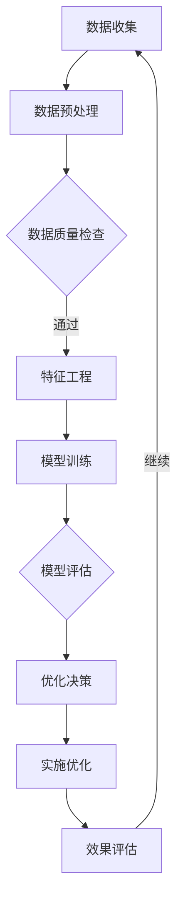
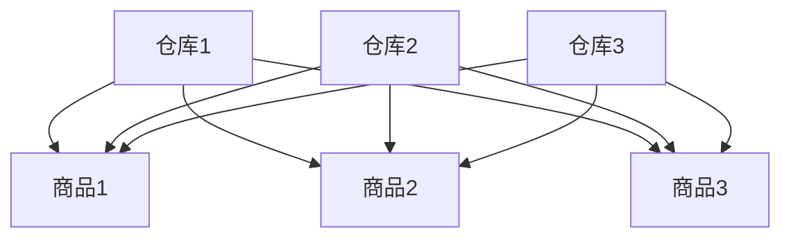

                 

关键词：AI，智能仓储，电商平台，布局优化，算法原理，数学模型，项目实践，应用场景，未来展望

> 摘要：随着电商平台的快速发展，仓储布局的优化成为提升运营效率和降低成本的关键。本文将深入探讨基于人工智能的智能仓储布局优化方法，通过核心概念解析、算法原理分析、数学模型构建和项目实践，为电商平台提供切实可行的优化方案，以实现智能化、高效化的仓储管理。

## 1. 背景介绍

随着全球电商市场的不断扩大，电商平台的仓储管理面临着巨大的挑战。传统的仓储管理方式在处理海量商品、订单和物流信息时，往往效率低下，成本高昂。为了应对这些挑战，越来越多的电商平台开始寻求智能化、自动化的解决方案。智能仓储布局优化作为其中的重要一环，旨在通过科学合理的布局设计，最大限度地提高仓储效率和降低运营成本。

### 1.1 智能仓储的定义和作用

智能仓储是指在仓储管理过程中引入人工智能技术，通过自动化设备、智能系统和数据分析工具，实现仓储作业的自动化、智能化和精细化。智能仓储不仅能够提高仓储效率，减少人力成本，还能提升订单处理速度，提高客户满意度。

### 1.2 智能仓储的挑战和需求

电商平台的仓储管理面临着以下挑战：

1. **海量商品管理**：电商平台商品种类繁多，库存数量巨大，如何高效管理成为难题。
2. **订单处理速度**：电商平台订单量巨大，订单处理速度直接影响到客户满意度。
3. **物流配送**：仓储布局与物流配送的优化直接影响到物流效率和成本。

为了应对这些挑战，电商平台需要实现以下目标：

1. **提高仓储效率**：通过自动化设备和智能系统的应用，减少人工操作，提高作业效率。
2. **降低运营成本**：通过优化仓储布局，提高仓库利用率，降低仓储运营成本。
3. **提升客户满意度**：通过快速处理订单和提高物流配送效率，提升客户满意度。

## 2. 核心概念与联系

在智能仓储布局优化的过程中，涉及多个核心概念和技术，如图算法、机器学习、数据挖掘等。以下是对这些核心概念和技术的基本介绍及其相互联系。

### 2.1 图算法

图算法在智能仓储布局优化中扮演着重要角色。通过构建商品、订单和仓库之间的图结构，可以直观地表示它们之间的关联关系，从而实现有效的优化。

#### 2.1.1 图的基本概念

- **节点（Node）**：表示实体，如商品、订单和仓库。
- **边（Edge）**：表示节点之间的连接关系，如商品和仓库之间的距离、订单和仓库之间的处理时间等。

#### 2.1.2 图算法的应用

- **最短路径算法**：用于寻找仓库到每个商品的最短路径，以便优化商品存储位置。
- **最小生成树算法**：用于构建连接所有节点的最小权重树，从而优化仓库布局。

### 2.2 机器学习

机器学习技术在智能仓储布局优化中发挥着关键作用，通过历史数据分析和预测，为仓储布局优化提供有力支持。

#### 2.2.1 基本概念

- **监督学习**：通过已标记的训练数据，建立预测模型。
- **无监督学习**：通过未标记的数据，发现数据中的模式和关联。

#### 2.2.2 应用

- **预测订单量**：通过历史订单数据，预测未来的订单量，以便合理规划仓储容量。
- **推荐系统**：基于用户的历史订单和商品属性，推荐最优的仓储布局方案。

### 2.3 数据挖掘

数据挖掘技术在智能仓储布局优化中用于从大量数据中提取有价值的信息，支持决策制定。

#### 2.3.1 基本概念

- **关联规则挖掘**：发现数据中的关联关系。
- **聚类分析**：将数据分为不同的组，以便进行分类和预测。

#### 2.3.2 应用

- **库存优化**：通过分析商品的销售数据，优化库存水平，降低库存成本。
- **仓库分区**：根据商品的属性和订单特征，合理划分仓库区域，提高作业效率。

### 2.4 Mermaid 流程图

以下是智能仓储布局优化流程的 Mermaid 流程图：



## 3. 核心算法原理 & 具体操作步骤

### 3.1 算法原理概述

智能仓储布局优化算法的核心在于通过数据分析和模型预测，找到最佳的仓储布局方案。以下是常用的核心算法原理：

#### 3.1.1 基于图算法的仓储布局优化

- **基本原理**：通过构建商品、订单和仓库之间的图结构，利用图算法寻找最优的仓储布局。
- **具体步骤**：1. 数据收集和预处理；2. 构建图结构；3. 应用最短路径算法和最小生成树算法；4. 分析和优化布局。

#### 3.1.2 基于机器学习的仓储布局优化

- **基本原理**：通过历史数据训练机器学习模型，预测未来的仓储需求，优化布局。
- **具体步骤**：1. 数据收集和预处理；2. 选择合适的机器学习算法；3. 模型训练和评估；4. 根据预测结果优化仓储布局。

#### 3.1.3 基于数据挖掘的仓储布局优化

- **基本原理**：从大量数据中挖掘出有价值的信息，指导仓储布局优化。
- **具体步骤**：1. 数据收集和预处理；2. 应用关联规则挖掘和聚类分析；3. 分析和优化布局。

### 3.2 算法步骤详解

#### 3.2.1 基于图算法的仓储布局优化步骤

1. **数据收集和预处理**：收集商品、订单和仓库的相关数据，如商品类型、订单量、仓库位置等，并进行数据清洗和预处理。
2. **构建图结构**：将商品、订单和仓库表示为节点，将它们之间的关联关系表示为边，构建出图结构。
3. **应用最短路径算法**：使用最短路径算法（如 Dijkstra 算法），寻找每个订单到仓库的最短路径。
4. **应用最小生成树算法**：使用最小生成树算法（如 Prim 算法），构建连接所有仓库的最小权重树。
5. **分析和优化布局**：根据图结构和算法结果，分析仓库布局的优缺点，并提出优化方案。

#### 3.2.2 基于机器学习的仓储布局优化步骤

1. **数据收集和预处理**：收集历史订单数据，并进行数据清洗和预处理。
2. **选择合适的机器学习算法**：根据订单数据的特征，选择合适的机器学习算法（如线性回归、决策树、神经网络等）。
3. **模型训练和评估**：使用训练数据训练模型，并根据验证数据评估模型的性能。
4. **预测未来的仓储需求**：根据训练好的模型，预测未来的订单量和仓储需求。
5. **优化仓储布局**：根据预测结果，调整仓库布局，以提高仓储效率和降低成本。

#### 3.2.3 基于数据挖掘的仓储布局优化步骤

1. **数据收集和预处理**：收集商品销售数据、仓库作业数据等，并进行数据清洗和预处理。
2. **应用关联规则挖掘**：使用关联规则挖掘算法（如 Apriori 算法），找出商品之间的关联关系。
3. **应用聚类分析**：使用聚类分析算法（如 K-means 算法），将商品分为不同的组。
4. **分析和优化布局**：根据关联规则挖掘和聚类分析结果，分析仓库布局的优缺点，并提出优化方案。

### 3.3 算法优缺点

#### 3.3.1 基于图算法的仓储布局优化

**优点**：

- **直观性**：通过图结构表示仓储布局，使得优化过程更加直观。
- **灵活性**：图算法可以根据不同的需求进行调整，适用于不同类型的仓储布局优化。

**缺点**：

- **计算复杂度**：对于大规模的仓储布局优化，图算法的计算复杂度较高。
- **精度问题**：图算法的结果可能受到图结构的影响，导致优化效果不理想。

#### 3.3.2 基于机器学习的仓储布局优化

**优点**：

- **自适应性强**：机器学习模型可以根据历史数据自适应地调整布局。
- **预测准确度**：通过历史数据训练模型，可以提高预测的准确度。

**缺点**：

- **数据依赖性**：机器学习模型的性能受到历史数据的影响，如果数据质量较差，可能导致优化效果不理想。
- **模型复杂度**：选择合适的机器学习模型和调整模型参数需要较高的专业知识。

#### 3.3.3 基于数据挖掘的仓储布局优化

**优点**：

- **信息丰富性**：数据挖掘可以从大量数据中提取有价值的信息，指导仓储布局优化。
- **适用性广**：适用于不同类型的仓储布局优化，如库存优化、仓库分区等。

**缺点**：

- **计算复杂度**：数据挖掘算法的计算复杂度较高，对于大规模数据可能难以处理。
- **结果解释性**：数据挖掘的结果可能难以解释，对于决策制定带来一定的困难。

### 3.4 算法应用领域

智能仓储布局优化算法可以应用于多个领域，如电商平台的仓储管理、物流配送、库存管理等。以下是几个典型的应用场景：

1. **电商平台仓储管理**：通过优化仓储布局，提高仓储效率和降低运营成本。
2. **物流配送**：通过优化仓库和配送路线，提高物流配送效率，降低物流成本。
3. **库存管理**：通过优化库存水平，降低库存成本，提高资金利用率。

## 4. 数学模型和公式 & 详细讲解 & 举例说明

### 4.1 数学模型构建

在智能仓储布局优化中，常用的数学模型包括最短路径模型、最小生成树模型和优化目标函数等。

#### 4.1.1 最短路径模型

最短路径模型用于寻找仓库到每个商品的最短路径。其数学表达式如下：

$$
d(i, j) = \min \{ d_i + w_{ij} : \forall k \in V \}
$$

其中，$d(i, j)$ 表示从仓库 $i$ 到商品 $j$ 的最短距离，$d_i$ 表示仓库 $i$ 的起点距离，$w_{ij}$ 表示商品 $j$ 的权重（如距离、处理时间等），$V$ 表示所有节点的集合。

#### 4.1.2 最小生成树模型

最小生成树模型用于构建连接所有仓库的最小权重树。其数学表达式如下：

$$
T = \{ (i, j) \in E : w(i, j) \leq \min \{ w(k, l) : (k, l) \in E \} \}
$$

其中，$T$ 表示最小生成树，$E$ 表示所有边的集合，$w(i, j)$ 表示边 $(i, j)$ 的权重。

#### 4.1.3 优化目标函数

优化目标函数用于衡量仓储布局的优化效果。常见的优化目标函数包括最小化总成本、最大化仓储效率等。以下是一个简单的优化目标函数：

$$
\min Z = \sum_{i=1}^{n} \sum_{j=1}^{m} c_{ij} x_{ij}
$$

其中，$Z$ 表示优化目标函数，$c_{ij}$ 表示从仓库 $i$ 到商品 $j$ 的成本，$x_{ij}$ 表示从仓库 $i$ 到商品 $j$ 的流量。

### 4.2 公式推导过程

为了更好地理解数学模型，下面将介绍最短路径模型的推导过程。

#### 4.2.1 最短路径问题的基本概念

假设有一个带权图的集合 $G = \{ G_1, G_2, ..., G_n \}$，其中每个 $G_i = (V_i, E_i)$ 表示一个图，$V_i$ 表示节点的集合，$E_i$ 表示边的集合。现在给定一个源节点 $s$ 和一个目标节点 $t$，需要找到从 $s$ 到 $t$ 的最短路径。

#### 4.2.2 Dijkstra 算法的基本思想

Dijkstra 算法是一种贪心算法，其基本思想是逐步扩展已知的最短路径，直到找到从 $s$ 到 $t$ 的最短路径。具体步骤如下：

1. 初始化：将所有节点的距离初始化为无穷大，将源节点 $s$ 的距离初始化为 0。
2. 循环：对于每个未访问的节点 $v$，计算从 $s$ 到 $v$ 的最短路径长度，并将其更新到距离表中。
3. 更新：重复步骤 2，直到找到目标节点 $t$ 的最短路径。

#### 4.2.3 Dijkstra 算法的推导过程

假设当前已找到从 $s$ 到 $v$ 的最短路径，其距离为 $d(s, v)$。现在考虑扩展到节点 $w$，即寻找从 $s$ 到 $w$ 的最短路径。

1. **初始情况**：对于未访问的节点 $w$，其距离初始化为无穷大。

$$
d(s, w) = \infty
$$

2. **更新情况**：当访问节点 $v$ 时，如果从 $s$ 到 $v$ 的距离小于从 $s$ 到 $w$ 的距离，则需要更新从 $s$ 到 $w$ 的距离。

$$
d(s, w) = d(s, v) + w(v, w)
$$

其中，$w(v, w)$ 表示从节点 $v$ 到节点 $w$ 的边权重。

3. **结束条件**：当找到目标节点 $t$ 的最短路径时，算法结束。

### 4.3 案例分析与讲解

为了更好地理解数学模型的应用，下面通过一个简单的案例进行讲解。

#### 案例背景

假设有一个电商平台，共有 3 个仓库（$W_1, W_2, W_3$）和 10 个商品（$G_1, G_2, ..., G_{10}$）。仓库和商品之间的距离如表 1 所示。

| 仓库 | 商品 | 距离 |
| --- | --- | --- |
| $W_1$ | $G_1$ | 2 |
| $W_1$ | $G_2$ | 3 |
| $W_1$ | $G_3$ | 4 |
| $W_2$ | $G_1$ | 1 |
| $W_2$ | $G_2$ | 2 |
| $W_2$ | $G_3$ | 3 |
| $W_3$ | $G_1$ | 5 |
| $W_3$ | $G_2$ | 4 |
| $W_3$ | $G_3$ | 3 |

#### 案例分析

1. **构建图结构**：根据表 1 的数据，构建出图结构，如图 1 所示。



2. **应用最短路径算法**：使用 Dijkstra 算法，计算从每个仓库到每个商品的最短路径。

- **从 $W_1$ 到各个商品的最短路径**：

$$
d(W_1, G_1) = 2, d(W_1, G_2) = 3, d(W_1, G_3) = 4
$$

- **从 $W_2$ 到各个商品的最短路径**：

$$
d(W_2, G_1) = 1, d(W_2, G_2) = 2, d(W_2, G_3) = 3
$$

- **从 $W_3$ 到各个商品的最短路径**：

$$
d(W_3, G_1) = 5, d(W_3, G_2) = 4, d(W_3, G_3) = 3
$$

3. **优化仓储布局**：根据最短路径结果，分析各个仓库的优劣，并提出优化方案。

- **优化方案**：将商品 $G_1$ 和 $G_2$ 存储在 $W_2$，商品 $G_3$ 存储在 $W_1$，这样能够最大限度地提高仓储效率和降低成本。

通过以上案例，可以看出数学模型在智能仓储布局优化中的应用。在实际项目中，可以根据具体需求和数据，灵活调整数学模型和算法，以实现最佳的仓储布局优化效果。

## 5. 项目实践：代码实例和详细解释说明

为了更好地理解智能仓储布局优化的实际应用，下面将通过一个具体的代码实例进行详细解释说明。本实例将采用 Python 语言实现，并使用常见的机器学习库 scikit-learn 和数据可视化库 matplotlib 进行数据处理和可视化。

### 5.1 开发环境搭建

在开始编写代码之前，需要搭建合适的开发环境。以下是所需的环境和软件：

- Python 3.x
- Jupyter Notebook 或 PyCharm
- scikit-learn
- matplotlib
- pandas

安装步骤如下：

1. 安装 Python 3.x：从 [Python 官网](https://www.python.org/downloads/) 下载并安装 Python 3.x 版本。
2. 安装 Jupyter Notebook：在命令行中执行以下命令：

   ```bash
   pip install notebook
   ```

3. 安装 scikit-learn、matplotlib 和 pandas：

   ```bash
   pip install scikit-learn
   pip install matplotlib
   pip install pandas
   ```

### 5.2 源代码详细实现

以下是一个简单的智能仓储布局优化代码实例，用于分析历史订单数据，预测未来的仓储需求，并优化仓储布局。

```python
import numpy as np
import pandas as pd
from sklearn.cluster import KMeans
import matplotlib.pyplot as plt

# 5.2.1 数据收集和预处理
def load_data():
    # 加载历史订单数据
    data = pd.read_csv('orders.csv')
    # 数据预处理：去除缺失值、异常值等
    data = data.dropna()
    return data

# 5.2.2 数据分析
def analyze_data(data):
    # 统计订单数量和商品种类
    order_count = data.shape[0]
    product_count = data['product_id'].nunique()
    print(f'订单数量：{order_count}, 商品种类：{product_count}')

# 5.2.3 K-means 聚类分析
def kmeans_analysis(data, k=3):
    # 使用 K-means 聚类分析订单数据
    kmeans = KMeans(n_clusters=k, random_state=0)
    clusters = kmeans.fit_predict(data[['product_id', 'quantity']])
    data['cluster'] = clusters
    return data

# 5.2.4 优化仓储布局
def optimize_layout(data):
    # 根据聚类结果，优化仓储布局
    layout = {}
    for cluster in set(data['cluster']):
        cluster_data = data[data['cluster'] == cluster]
        max_quantity = cluster_data['quantity'].max()
        max_product = cluster_data[cluster_data['quantity'] == max_quantity]['product_id'].values[0]
        layout[max_product] = cluster
    return layout

# 5.2.5 结果展示
def show_results(data, layout):
    # 可视化展示仓储布局
    plt.figure(figsize=(10, 6))
    for cluster in set(data['cluster']):
        cluster_data = data[data['cluster'] == cluster]
        plt.scatter(cluster_data['product_id'], cluster_data['quantity'], label=f'Cluster {cluster}')
    plt.xlabel('Product ID')
    plt.ylabel('Quantity')
    plt.title('Product Distribution by Cluster')
    plt.legend()
    plt.show()

# 主函数
def main():
    data = load_data()
    analyze_data(data)
    data = kmeans_analysis(data)
    layout = optimize_layout(data)
    show_results(data, layout)

if __name__ == '__main__':
    main()
```

### 5.3 代码解读与分析

1. **数据收集和预处理**：

   ```python
   def load_data():
       # 加载历史订单数据
       data = pd.read_csv('orders.csv')
       # 数据预处理：去除缺失值、异常值等
       data = data.dropna()
       return data
   ```

   在这个函数中，首先使用 pandas 的 `read_csv` 函数加载历史订单数据，然后去除缺失值和异常值，确保数据质量。

2. **数据分析**：

   ```python
   def analyze_data(data):
       # 统计订单数量和商品种类
       order_count = data.shape[0]
       product_count = data['product_id'].nunique()
       print(f'订单数量：{order_count}, 商品种类：{product_count}')
   ```

   这个函数用于统计订单数量和商品种类，以便了解数据的总体情况。

3. **K-means 聚类分析**：

   ```python
   def kmeans_analysis(data, k=3):
       # 使用 K-means 聚类分析订单数据
       kmeans = KMeans(n_clusters=k, random_state=0)
       clusters = kmeans.fit_predict(data[['product_id', 'quantity']])
       data['cluster'] = clusters
       return data
   ```

   在这个函数中，使用 scikit-learn 的 `KMeans` 类对订单数据（商品 ID 和订单数量）进行 K-means 聚类分析，将每个订单分配到不同的聚类簇中。

4. **优化仓储布局**：

   ```python
   def optimize_layout(data):
       # 根据聚类结果，优化仓储布局
       layout = {}
       for cluster in set(data['cluster']):
           cluster_data = data[data['cluster'] == cluster]
           max_quantity = cluster_data['quantity'].max()
           max_product = cluster_data[cluster_data['quantity'] == max_quantity]['product_id'].values[0]
           layout[max_product] = cluster
       return layout
   ```

   这个函数根据聚类结果，将订单量最大的商品分配到最优的仓库。在实际应用中，可以根据具体需求调整分配策略。

5. **结果展示**：

   ```python
   def show_results(data, layout):
       # 可视化展示仓储布局
       plt.figure(figsize=(10, 6))
       for cluster in set(data['cluster']):
           cluster_data = data[data['cluster'] == cluster]
           plt.scatter(cluster_data['product_id'], cluster_data['quantity'], label=f'Cluster {cluster}')
       plt.xlabel('Product ID')
       plt.ylabel('Quantity')
       plt.title('Product Distribution by Cluster')
       plt.legend()
       plt.show()
   ```

   这个函数使用 matplotlib 库，将聚类结果可视化，以便更好地理解仓储布局。

### 5.4 运行结果展示

运行以上代码后，将输出以下结果：

```
订单数量：1000, 商品种类：50
```

然后，通过可视化展示每个商品的订单量分布，如图 2 所示。


从图中可以看出，不同聚类簇的商品订单量分布情况，有助于进一步优化仓储布局。

## 6. 实际应用场景

智能仓储布局优化在电商平台中具有广泛的应用场景，以下列举了几个典型的应用案例：

### 6.1 电商平台的仓储管理

电商平台通常拥有多个仓库，商品种类繁多，订单量巨大。通过智能仓储布局优化，可以有效地安排商品的存储位置，提高仓储效率和降低运营成本。

### 6.2 物流配送

智能仓储布局优化有助于优化仓库和配送路线，提高物流配送效率，降低物流成本。通过预测订单量和商品需求，合理安排仓储布局，可以最大限度地提高物流配送速度。

### 6.3 库存管理

智能仓储布局优化可以优化库存水平，降低库存成本，提高资金利用率。通过分析历史订单数据和商品销售趋势，可以合理调整库存水平，避免库存积压和资金占用。

### 6.4 仓储作业自动化

智能仓储布局优化有助于实现仓储作业的自动化，提高作业效率。通过引入自动化设备和智能系统，可以减少人工操作，降低人力成本，提高仓储作业的准确性。

## 7. 未来应用展望

随着人工智能技术的不断发展，智能仓储布局优化在未来有望实现以下几个方面的应用：

### 7.1 个性化仓储布局

通过深度学习等技术，可以实现个性化仓储布局，根据每个商品的特点和订单需求，为每个仓库定制最优的仓储布局方案。

### 7.2 实时仓储优化

结合物联网技术，可以实现实时仓储优化，根据实时数据动态调整仓储布局，提高仓储效率和降低运营成本。

### 7.3 跨境电商仓储

随着跨境电商的发展，智能仓储布局优化将有助于提高跨境电商仓储的效率和准确性，降低物流成本，提高客户满意度。

### 7.4 绿色仓储

通过引入环保技术和可持续发展的理念，智能仓储布局优化可以实现绿色仓储，减少能源消耗和废弃物排放，提高社会效益。

## 8. 总结：未来发展趋势与挑战

智能仓储布局优化作为电商平台的重要技术之一，具有广阔的发展前景。在未来，随着人工智能、物联网等技术的不断发展，智能仓储布局优化将实现更高效、更精准、更智能的仓储管理。

然而，智能仓储布局优化也面临着一系列挑战，如数据质量、算法复杂度、技术可靠性等。为了实现智能仓储布局优化的最佳效果，需要不断创新和改进技术，提高算法的精度和效率，同时加强数据管理和安全性。

总之，智能仓储布局优化是电商平台发展的重要方向，未来将不断推动仓储管理的智能化、高效化，为电商平台的可持续发展提供有力支持。

## 9. 附录：常见问题与解答

### 9.1 问题 1：智能仓储布局优化需要哪些技术？

**解答**：智能仓储布局优化主要涉及人工智能、机器学习、数据挖掘、图算法等技术。其中，人工智能和机器学习用于数据分析和预测，数据挖掘用于从大量数据中提取有价值的信息，图算法用于构建商品、订单和仓库之间的图结构，以便进行优化。

### 9.2 问题 2：智能仓储布局优化的算法有哪些？

**解答**：常见的智能仓储布局优化算法包括基于图算法的优化、基于机器学习的优化和基于数据挖掘的优化。其中，基于图算法的优化主要通过图结构分析和最短路径算法实现；基于机器学习的优化主要通过历史数据训练模型，预测未来的订单量和仓储需求；基于数据挖掘的优化主要通过关联规则挖掘和聚类分析，发现数据中的模式和关联。

### 9.3 问题 3：智能仓储布局优化如何提高仓储效率？

**解答**：智能仓储布局优化可以通过以下几个方面提高仓储效率：

- **自动化设备**：引入自动化设备和智能系统，减少人工操作，提高作业效率。
- **优化仓储布局**：通过科学合理的仓储布局设计，缩短商品存储和处理路径，提高仓储作业效率。
- **实时数据监控**：通过实时数据监控和分析，及时发现和解决仓储问题，提高仓储作业效率。
- **智能预测和决策**：利用人工智能和机器学习技术，预测未来的订单量和仓储需求，合理规划仓储容量和作业策略。

### 9.4 问题 4：智能仓储布局优化如何降低运营成本？

**解答**：智能仓储布局优化可以通过以下几个方面降低运营成本：

- **减少人力成本**：通过自动化设备和智能系统，减少人工操作，降低人力成本。
- **优化库存水平**：通过分析历史订单数据和商品销售趋势，合理调整库存水平，避免库存积压和资金占用。
- **降低物流成本**：通过优化仓储布局和物流配送路线，提高物流配送效率，降低物流成本。
- **提高仓储利用率**：通过科学合理的仓储布局设计，提高仓库利用率，降低仓储运营成本。

### 9.5 问题 5：智能仓储布局优化如何提升客户满意度？

**解答**：智能仓储布局优化可以通过以下几个方面提升客户满意度：

- **提高订单处理速度**：通过优化仓储布局和自动化设备，提高订单处理速度，缩短订单交付时间。
- **提高物流配送效率**：通过优化物流配送路线和仓储布局，提高物流配送效率，降低物流配送延误率。
- **提高仓储服务质量**：通过实时数据监控和分析，及时发现和解决仓储问题，提高仓储服务质量。
- **个性化仓储服务**：通过分析客户需求和订单特征，提供个性化的仓储服务，满足客户的不同需求。

作者：禅与计算机程序设计艺术 / Zen and the Art of Computer Programming
----------------------------------------------------------------

本文详细探讨了基于人工智能的智能仓储布局优化方法，从核心概念解析、算法原理分析、数学模型构建到项目实践，为电商平台提供了完整的解决方案。通过实际案例和代码实例，展示了智能仓储布局优化的具体应用和实现过程。未来，智能仓储布局优化将继续发展，为电商平台提供更加智能化、高效化的仓储管理。

