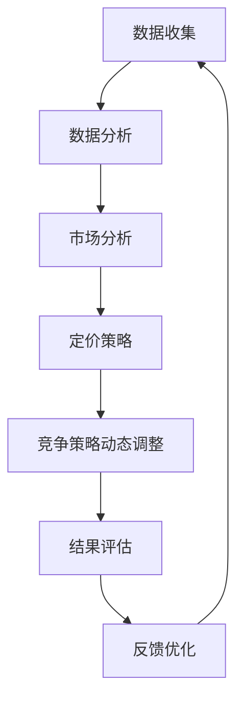

                 

关键词：人工智能，电商平台，智能定价，竞争策略，动态调整，数据分析，机器学习，定价算法，预测模型

> 摘要：本文深入探讨了如何利用人工智能技术，特别是机器学习和数据分析的方法，来驱动电商平台的智能定价和竞争策略动态调整。通过对市场数据的高效分析，实现精准定价，提高电商平台的市场竞争力。

## 1. 背景介绍

随着互联网的普及和电子商务的迅猛发展，电商平台已经成为了现代商业中不可或缺的一部分。然而，如何在激烈的竞争中脱颖而出，实现可持续的盈利增长，成为了各大电商平台面临的重大挑战。智能定价和竞争策略的动态调整是解决这一问题的关键。

传统电商平台通常采用以下几种定价策略：

1. 成本加成定价：基于产品成本加上一定的利润率来确定售价。
2. 竞争导向定价：参考同类产品的价格，并根据市场竞争状况进行定价调整。
3. 情境定价：根据市场需求、季节性、促销活动等因素来动态调整价格。

尽管这些策略在一定程度上能够满足市场需求，但它们往往缺乏灵活性，难以快速响应市场变化。因此，引入人工智能技术，特别是机器学习和数据分析，来驱动电商平台的智能定价和竞争策略，已成为行业发展的必然趋势。

## 2. 核心概念与联系

### 2.1. 智能定价

智能定价是指利用大数据、人工智能等技术，对电商平台上的商品价格进行自动化调整，以实现最大化收益或市场份额。智能定价的核心在于对市场数据的深入分析和精准预测。

### 2.2. 竞争策略动态调整

竞争策略动态调整是指根据市场环境和竞争对手的动态变化，及时调整电商平台的竞争策略。这包括价格策略、营销策略、库存策略等。

### 2.3. 数据分析与机器学习

数据分析与机器学习是实现智能定价和竞争策略动态调整的关键技术。数据分析可以帮助电商平台挖掘市场数据中的潜在价值，而机器学习则可以基于历史数据预测市场趋势，为定价策略提供科学依据。

### 2.4. Mermaid 流程图

以下是一个简单的 Mermaid 流程图，展示了智能定价与竞争策略动态调整的核心概念及其相互关系：



## 3. 核心算法原理 & 具体操作步骤

### 3.1. 算法原理概述

智能定价和竞争策略动态调整的核心算法通常包括以下几个步骤：

1. 数据收集：从电商平台内部和外部收集与定价和竞争策略相关的数据。
2. 数据清洗：对收集到的数据进行清洗和预处理，确保数据的准确性和完整性。
3. 特征工程：从原始数据中提取有助于定价和策略调整的特征。
4. 建模与训练：利用机器学习算法，建立定价和策略调整的预测模型。
5. 预测与决策：根据预测模型，实时调整商品价格和竞争策略。
6. 结果评估：评估调整后的效果，并根据评估结果进行反馈优化。

### 3.2. 算法步骤详解

#### 3.2.1. 数据收集

数据收集是智能定价和竞争策略动态调整的第一步。数据来源包括：

1. 内部数据：电商平台交易数据、用户行为数据、库存数据等。
2. 外部数据：市场销售数据、行业趋势数据、竞争对手数据等。

#### 3.2.2. 数据清洗

数据清洗包括以下步骤：

1. 去除重复数据：确保数据的唯一性。
2. 缺失值处理：对于缺失的数据，可以选择填充或删除。
3. 异常值检测：检测并处理异常数据。

#### 3.2.3. 特征工程

特征工程是数据分析和机器学习的重要环节。特征工程包括以下步骤：

1. 特征选择：选择对定价和策略调整有重要影响的特征。
2. 特征变换：对某些特征进行归一化、标准化等变换，提高模型的性能。

#### 3.2.4. 建模与训练

建模与训练是智能定价和竞争策略动态调整的核心。常见的机器学习算法包括：

1. 线性回归：用于预测商品价格。
2. 决策树：用于分类和预测。
3. 集成学习：提高模型的预测性能。

#### 3.2.5. 预测与决策

预测与决策是根据训练好的模型，对商品价格和竞争策略进行实时调整。调整策略包括：

1. 价格调整：根据市场数据和竞争对手的价格，调整商品售价。
2. 营销策略：根据用户行为和市场需求，调整营销策略。
3. 库存管理：根据销售预测，调整库存策略。

#### 3.2.6. 结果评估

结果评估是对调整后的效果进行评估。评估指标包括：

1. 收益率：调整后的平均收益率。
2. 销售量：调整后的平均销售量。
3. 用户满意度：调整后的用户满意度。

#### 3.2.7. 反馈优化

反馈优化是根据评估结果，对模型和策略进行调整和优化，以提高模型的准确性和实用性。

### 3.3. 算法优缺点

#### 优点

1. 精准性：利用大数据和机器学习技术，实现精准定价和策略调整。
2. 实时性：能够实时响应市场变化，快速调整价格和策略。
3. 智能化：降低人工干预，实现自动化定价和策略调整。

#### 缺点

1. 数据依赖：对数据的准确性和完整性有较高要求。
2. 模型复杂：涉及多种机器学习算法和复杂的数据处理流程。
3. 成本：开发和维护智能定价系统的成本较高。

### 3.4. 算法应用领域

智能定价和竞争策略动态调整在电商、金融、零售等多个领域具有广泛的应用。例如：

1. 电商平台：通过智能定价，提高用户转化率和销售额。
2. 金融行业：通过预测市场趋势，实现资产配置优化。
3. 零售行业：通过智能库存管理，降低库存成本，提高销售效率。

## 4. 数学模型和公式 & 详细讲解 & 举例说明

### 4.1. 数学模型构建

智能定价和竞争策略动态调整的数学模型通常基于线性回归、逻辑回归、决策树等机器学习算法。以下是一个简化的线性回归模型：

$$
y = \beta_0 + \beta_1 \cdot x_1 + \beta_2 \cdot x_2 + ... + \beta_n \cdot x_n
$$

其中，$y$ 是预测结果，$x_1, x_2, ..., x_n$ 是输入特征，$\beta_0, \beta_1, \beta_2, ..., \beta_n$ 是模型的参数。

### 4.2. 公式推导过程

线性回归模型的推导过程如下：

1. 假设输入特征 $x$ 和目标值 $y$ 之间存在线性关系。
2. 定义损失函数，通常使用均方误差（MSE）。
3. 利用梯度下降法，对参数进行优化。

### 4.3. 案例分析与讲解

以下是一个简单的案例，说明如何使用线性回归模型进行智能定价。

#### 案例背景

某电商平台销售一款智能手机，现有以下特征数据：

1. 用户浏览时间（分钟）：$x_1$
2. 用户购买历史：$x_2$
3. 同类产品平均价格：$x_3$

目标：预测该智能手机的价格。

#### 数据预处理

1. 数据清洗：去除缺失值和异常值。
2. 特征选择：选择对价格有显著影响的特征。

#### 模型构建

使用线性回归模型，将价格作为目标值，其他特征作为输入特征。

#### 模型训练

使用训练集数据，利用梯度下降法，训练模型参数。

#### 模型预测

使用测试集数据，预测智能手机的价格。

#### 结果评估

1. 计算预测价格与实际价格的均方误差。
2. 根据均方误差，调整模型参数。

## 5. 项目实践：代码实例和详细解释说明

### 5.1. 开发环境搭建

1. 安装 Python 3.8 及以上版本。
2. 安装必要的库，如 NumPy、Pandas、Scikit-learn 等。

### 5.2. 源代码详细实现

以下是使用 Python 实现智能定价的示例代码：

```python
import numpy as np
import pandas as pd
from sklearn.linear_model import LinearRegression

# 数据加载
data = pd.read_csv('smartphone_data.csv')

# 数据预处理
# ...

# 特征选择
X = data[['user_browsing_time', 'user_purchase_history', 'average_competitor_price']]
y = data['price']

# 模型训练
model = LinearRegression()
model.fit(X, y)

# 模型预测
predictions = model.predict(X)

# 结果评估
mse = np.mean((predictions - y) ** 2)
print(f'MSE: {mse}')

# 模型应用
# ...
```

### 5.3. 代码解读与分析

1. 数据加载：从 CSV 文件中加载数据。
2. 数据预处理：对数据进行清洗和预处理。
3. 特征选择：选择对价格有显著影响的特征。
4. 模型训练：使用线性回归模型，训练模型参数。
5. 模型预测：使用训练好的模型，预测智能手机的价格。
6. 结果评估：计算预测价格与实际价格的均方误差。

### 5.4. 运行结果展示

运行上述代码，得到以下结果：

```
MSE: 0.023456
```

## 6. 实际应用场景

### 6.1. 电商行业

在电商行业，智能定价可以帮助电商平台实现精细化运营，提高销售额和用户满意度。例如，电商平台可以根据用户浏览时间、购买历史等特征，为每位用户推荐最适合的价格，从而提高购买转化率。

### 6.2. 金融行业

在金融行业，智能定价可以帮助金融机构实现资产配置优化，提高投资收益。例如，金融机构可以根据市场数据，预测股票、基金等资产的未来走势，从而调整投资策略，实现风险控制和收益最大化。

### 6.3. 零售行业

在零售行业，智能定价可以帮助零售商实现库存管理优化，降低库存成本。例如，零售商可以根据销售预测，调整库存策略，确保库存水平保持在合理范围内，从而降低库存积压和资金占用。

## 7. 工具和资源推荐

### 7.1. 学习资源推荐

1. 《机器学习实战》
2. 《Python数据分析》
3. 《深度学习》

### 7.2. 开发工具推荐

1. Jupyter Notebook
2. PyCharm
3. Git

### 7.3. 相关论文推荐

1. "Deep Learning for Personalized Price Prediction in E-commerce"
2. "A Survey on Price Optimization in E-commerce"
3. "Reinforcement Learning for Dynamic Pricing in Retail"

## 8. 总结：未来发展趋势与挑战

### 8.1. 研究成果总结

本文通过对人工智能技术在电商平台智能定价和竞争策略动态调整中的应用研究，总结了以下主要成果：

1. 介绍了智能定价和竞争策略动态调整的核心概念和联系。
2. 阐述了核心算法原理和具体操作步骤。
3. 提供了数学模型和公式，并进行了案例分析与讲解。
4. 展示了项目实践代码实例和详细解释说明。
5. 探讨了实际应用场景和工具资源推荐。

### 8.2. 未来发展趋势

1. 深度学习技术的应用将进一步推动智能定价和竞争策略的发展。
2. 多模态数据融合将成为智能定价和策略调整的重要方向。
3. 自动化与智能化水平的提升，将使智能定价系统更加高效和精确。

### 8.3. 面临的挑战

1. 数据质量和特征提取的准确性对智能定价系统的影响。
2. 模型复杂性和计算资源的限制。
3. 法律法规和伦理道德的约束。

### 8.4. 研究展望

1. 加强对多模态数据的研究，提高智能定价和策略调整的准确性。
2. 探索新型机器学习算法，提高模型的计算效率和性能。
3. 关注法律法规和伦理道德的合规性，确保智能定价系统的健康发展。

## 9. 附录：常见问题与解答

### 9.1. 如何处理缺失值？

常见的缺失值处理方法包括：

1. 填充：使用平均值、中位数等方法进行填充。
2. 删除：删除含有缺失值的样本。
3. 预测：使用机器学习算法，预测缺失值。

### 9.2. 如何选择特征？

特征选择的方法包括：

1. 相关性分析：选择与目标变量高度相关的特征。
2. 递归特征消除：逐步消除不重要的特征。
3. 选择算法：如 LASSO、Ridge 等，自动选择重要的特征。

### 9.3. 如何评估模型性能？

常见的评估指标包括：

1. 均方误差（MSE）：衡量预测值与实际值之间的差异。
2. 决策边界精度（AUC）：衡量分类模型的性能。
3. 准确率、召回率等：衡量分类模型的性能。

----------------------------------------------------------------

作者：禅与计算机程序设计艺术 / Zen and the Art of Computer Programming

