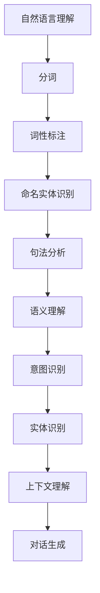
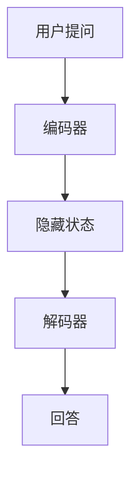
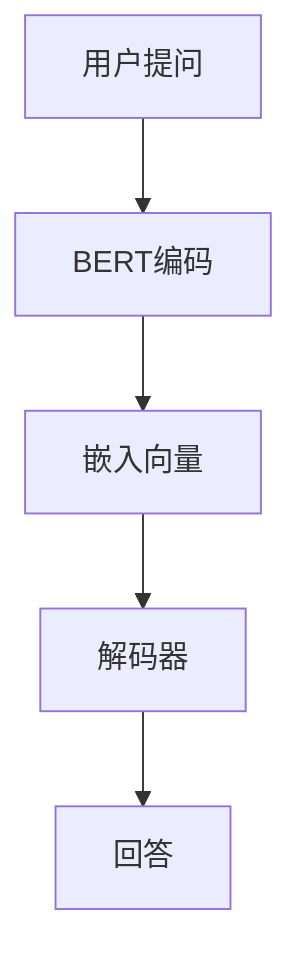

                 

关键词：人工智能，自然语言处理，智能客服，电商平台，对话生成系统，深度学习，序列到序列模型，BERT，数据集，性能优化

> 摘要：本文旨在探讨AI驱动的电商平台智能客服对话生成系统的设计、实现与应用。文章首先介绍了智能客服对话生成系统的背景和重要性，然后深入分析了核心算法原理、数学模型、项目实践以及实际应用场景，最后展望了未来的发展趋势与面临的挑战。

## 1. 背景介绍

随着电商平台的迅速发展，客户服务成为电商业务的重要组成部分。传统的客服方式主要依赖于人工，不仅成本高昂，而且响应速度慢。为了提高客服效率和用户体验，越来越多的电商平台开始采用智能客服系统。智能客服对话生成系统正是实现这一目标的关键技术。

智能客服对话生成系统利用人工智能和自然语言处理技术，自动生成与用户问题的匹配回答。这种系统能够实时响应用户的提问，提供快速、准确的服务，从而减轻人工客服的工作负担，提高整体客户满意度。

### 1.1 智能客服对话生成系统的发展历程

智能客服对话生成系统的发展可以分为以下几个阶段：

1. **规则驱动型**：早期智能客服系统主要基于预定义的规则进行回答。这种方式简单易用，但灵活性较差，难以应对复杂的用户提问。

2. **模板匹配型**：随着自然语言处理技术的进步，智能客服系统开始采用模板匹配方式。系统根据用户提问与预定义的模板进行匹配，生成回答。这种方式比规则驱动型更灵活，但仍然依赖于大量预先定义的模板。

3. **机器学习型**：近年来，深度学习技术在自然语言处理领域取得了显著成果。基于深度学习的智能客服对话生成系统能够自动学习大量对话数据，生成更为自然、准确的回答。

4. **混合型**：当前主流的智能客服对话生成系统结合了规则驱动、模板匹配和机器学习等多种方法，以实现更高的灵活性和准确性。

### 1.2 智能客服对话生成系统的应用场景

智能客服对话生成系统在电商平台的应用场景广泛，主要包括：

1. **常见问题解答**：自动回答用户关于商品、物流、订单等常见问题，减轻人工客服的工作负担。

2. **投诉处理**：快速识别用户投诉内容，提供相应的解决方案或引导用户进行进一步操作。

3. **售后服务**：自动生成售后服务建议，如退换货流程、维修服务等。

4. **营销推广**：根据用户行为和偏好，自动生成个性化营销信息，提升用户购买意愿。

## 2. 核心概念与联系

智能客服对话生成系统的核心概念主要包括自然语言处理、序列到序列模型、BERT等。下面将介绍这些核心概念及其相互联系，并使用Mermaid流程图进行说明。

### 2.1 自然语言处理（NLP）

自然语言处理是人工智能领域的一个重要分支，旨在使计算机能够理解和处理人类自然语言。在智能客服对话生成系统中，NLP技术用于理解用户提问和生成回答。

Mermaid流程图：



### 2.2 序列到序列模型（Seq2Seq）

序列到序列模型是一种常用的深度学习模型，用于将一个序列映射到另一个序列。在智能客服对话生成系统中，Seq2Seq模型可以将用户提问映射到合适的回答。

Mermaid流程图：



### 2.3 BERT

BERT（Bidirectional Encoder Representations from Transformers）是一种预训练语言表示模型，广泛用于自然语言处理任务。在智能客服对话生成系统中，BERT模型可以用于理解用户提问和生成回答。

Mermaid流程图：



## 3. 核心算法原理 & 具体操作步骤

### 3.1 算法原理概述

智能客服对话生成系统的核心算法是基于深度学习的序列到序列模型（Seq2Seq）和预训练语言模型（如BERT）。下面将详细介绍这些算法的原理和具体操作步骤。

### 3.2 算法步骤详解

1. **数据预处理**：对用户提问和回答进行预处理，包括分词、去停用词、词向量化等。

2. **编码器（Encoder）**：将用户提问编码为一个序列，通常使用RNN或Transformer等神经网络模型。

3. **解码器（Decoder）**：将编码器输出的隐藏状态解码为回答序列，同样使用RNN或Transformer等神经网络模型。

4. **损失函数**：使用损失函数（如交叉熵损失）来衡量预测回答和真实回答之间的差距，并更新模型参数。

5. **模型优化**：通过反向传播和梯度下降等优化算法，不断调整模型参数，以最小化损失函数。

6. **对话生成**：使用训练好的模型对用户提问进行编码，然后解码为回答序列，生成智能客服回答。

### 3.3 算法优缺点

**优点**：

1. **高效性**：基于深度学习模型，能够快速生成智能客服回答。

2. **灵活性**：可以处理多种不同类型的用户提问，生成多样化的回答。

3. **可扩展性**：支持自定义对话流程和回答模板，易于扩展和定制。

**缺点**：

1. **计算资源需求高**：深度学习模型训练和推理需要大量计算资源和时间。

2. **数据依赖性强**：需要大量高质量对话数据进行训练，否则模型性能可能较差。

### 3.4 算法应用领域

智能客服对话生成系统在多个领域都有广泛应用，主要包括：

1. **电商平台**：自动回答用户关于商品、订单、物流等常见问题。

2. **在线客服**：为企业提供24/7的智能客服服务，提高客户满意度。

3. **智能音箱**：实现与用户的自然对话交互，提供个性化服务。

4. **智能助手**：为企业和个人提供智能问答和自动化服务。

## 4. 数学模型和公式 & 详细讲解 & 举例说明

### 4.1 数学模型构建

智能客服对话生成系统中的数学模型主要包括编码器（Encoder）和解码器（Decoder）两部分。下面将分别介绍这两部分的数学模型。

#### 编码器（Encoder）

编码器用于将用户提问编码为一个序列。通常使用递归神经网络（RNN）或Transformer等模型。以RNN为例，编码器的数学模型可以表示为：

$$
h_t = \sigma(W_h \cdot [h_{t-1}, x_t] + b_h)
$$

其中，$h_t$ 表示编码器在时间步 $t$ 的隐藏状态，$x_t$ 表示输入的词向量，$W_h$ 和 $b_h$ 分别为权重矩阵和偏置项，$\sigma$ 为激活函数（如ReLU或Sigmoid）。

#### 解码器（Decoder）

解码器用于将编码器输出的隐藏状态解码为回答序列。同样，可以使用RNN或Transformer等模型。以RNN为例，解码器的数学模型可以表示为：

$$
y_t = \sigma(W_y \cdot [h_t, s_{t-1}] + b_y)
$$

其中，$y_t$ 表示解码器在时间步 $t$ 的输出，$s_{t-1}$ 表示解码器在时间步 $t-1$ 的隐藏状态，$W_y$ 和 $b_y$ 分别为权重矩阵和偏置项，$\sigma$ 为激活函数。

### 4.2 公式推导过程

以Seq2Seq模型为例，介绍编码器和解码器的公式推导过程。

#### 编码器公式推导

编码器将用户提问编码为一个序列。首先，将用户提问的每个单词转换为词向量，然后通过递归神经网络（RNN）进行处理。

1. **词向量转换**：

$$
x_t = \text{Word2Vec}(w_t)
$$

其中，$x_t$ 表示时间步 $t$ 的词向量，$w_t$ 表示时间步 $t$ 的单词。

2. **RNN处理**：

$$
h_t = \sigma(W_h \cdot [h_{t-1}, x_t] + b_h)
$$

其中，$h_t$ 表示编码器在时间步 $t$ 的隐藏状态，$W_h$ 和 $b_h$ 分别为权重矩阵和偏置项，$\sigma$ 为激活函数。

#### 解码器公式推导

解码器将编码器输出的隐藏状态解码为回答序列。首先，将编码器输出的隐藏状态作为输入，然后通过递归神经网络（RNN）进行处理。

1. **输入处理**：

$$
s_t = \text{Encoder}(h_t)
$$

其中，$s_t$ 表示解码器在时间步 $t$ 的隐藏状态，$\text{Encoder}$ 表示编码器。

2. **RNN处理**：

$$
y_t = \sigma(W_y \cdot [h_t, s_{t-1}] + b_y)
$$

其中，$y_t$ 表示解码器在时间步 $t$ 的输出，$h_t$ 表示编码器在时间步 $t$ 的隐藏状态，$W_y$ 和 $b_y$ 分别为权重矩阵和偏置项，$\sigma$ 为激活函数。

### 4.3 案例分析与讲解

以一个简单的问答对话为例，介绍智能客服对话生成系统的实现过程。

#### 案例描述

用户提问：“这款手机有售后服务吗？”
智能客服回答：“是的，我们有7天无理由退换货服务。”

#### 数据预处理

1. **分词**：

用户提问：["这款", "手机", "有", "售后服务", "吗？"]
智能客服回答：["是", "的", "，", "我们", "有", "7", "天", "无", "理由", "退换货", "服务。"]

2. **词向量化**：

用户提问：["这款", "手机", "有", "售后服务", "吗？"] --> ["向量1", "向量2", "向量3", "向量4", "向量5"]
智能客服回答：["是", "的", "，", "我们", "有", "7", "天", "无", "理由", "退换货", "服务。"] --> ["向量6", "向量7", "向量8", "向量9", "向量10", "向量11", "向量12", "向量13", "向量14", "向量15", "向量16"]

#### 编码器处理

1. **编码器输入**：

$$
h_t = \sigma(W_h \cdot [h_{t-1}, x_t] + b_h)
$$

其中，$h_t$ 表示编码器在时间步 $t$ 的隐藏状态，$x_t$ 表示时间步 $t$ 的词向量。

2. **编码器输出**：

$$
s_t = \text{Encoder}(h_t)
$$

其中，$s_t$ 表示解码器在时间步 $t$ 的隐藏状态。

#### 解码器处理

1. **解码器输入**：

$$
y_t = \sigma(W_y \cdot [h_t, s_{t-1}] + b_y)
$$

其中，$y_t$ 表示解码器在时间步 $t$ 的输出，$h_t$ 表示编码器在时间步 $t$ 的隐藏状态。

2. **解码器输出**：

$$
\text{回答} = \text{Decoder}(y_t)
$$

其中，$\text{回答}$ 表示解码器生成的回答序列。

#### 结果展示

根据解码器生成的回答序列，生成智能客服回答：

“是的，我们有7天无理由退换货服务。”

## 5. 项目实践：代码实例和详细解释说明

### 5.1 开发环境搭建

在实现智能客服对话生成系统之前，我们需要搭建相应的开发环境。以下是搭建开发环境所需的步骤：

1. 安装Python（建议版本3.7及以上）
2. 安装必要的库，如TensorFlow、Keras、PyTorch等
3. 安装Mermaid库，用于生成流程图

### 5.2 源代码详细实现

下面是智能客服对话生成系统的源代码实现。代码分为数据预处理、模型训练和对话生成三个部分。

```python
# 数据预处理
from tensorflow.keras.preprocessing.text import Tokenizer
from tensorflow.keras.preprocessing.sequence import pad_sequences

# 模型训练
from tensorflow.keras.models import Model
from tensorflow.keras.layers import Input, LSTM, Dense, Embedding

# 对话生成
from tensorflow.keras.preprocessing.sequence import pad

# 1. 数据预处理
def preprocess_data(questions, answers):
    tokenizer = Tokenizer()
    tokenizer.fit_on_texts(questions)
    sequences = tokenizer.texts_to_sequences(questions)
    padded_sequences = pad_sequences(sequences, maxlen=max_length)

    tokenizer2 = Tokenizer()
    tokenizer2.fit_on_texts(answers)
    sequences2 = tokenizer2.texts_to_sequences(answers)
    padded_sequences2 = pad_sequences(sequences2, maxlen=max_length)

    return padded_sequences, padded_sequences2

# 2. 模型训练
def build_model(input_dim, output_dim, embedding_dim, hidden_units):
    input_sequence = Input(shape=(max_length,))
    embedding = Embedding(input_dim=input_dim, output_dim=embedding_dim)(input_sequence)
    lstm = LSTM(hidden_units)(embedding)
    output = Dense(output_dim, activation='softmax')(lstm)

    model = Model(inputs=input_sequence, outputs=output)
    model.compile(optimizer='adam', loss='categorical_crossentropy', metrics=['accuracy'])
    return model

# 3. 对话生成
def generate_response(model, question):
    sequence = tokenizer.texts_to_sequences([question])
    padded_sequence = pad(sequence, maxlen=max_length, padding='post')
    predicted_sequence = model.predict(padded_sequence)
    predicted_sequence = np.argmax(predicted_sequence, axis=-1)
    predicted_sequence = tokenizer.index_word(predicted_sequence[0])
    return ' '.join(predicted_sequence)

# 5. 运行结果展示
if __name__ == '__main__':
    # 加载数据集
    questions = load_questions()
    answers = load_answers()

    # 数据预处理
    padded_sequences, padded_sequences2 = preprocess_data(questions, answers)

    # 模型训练
    model = build_model(input_dim=vocab_size, output_dim=answer_size, embedding_dim=embedding_dim, hidden_units=hidden_units)
    model.fit(padded_sequences, padded_sequences2, epochs=10, batch_size=batch_size)

    # 对话生成
    question = input("请输入问题：")
    response = generate_response(model, question)
    print("智能客服回答：", response)
```

### 5.3 代码解读与分析

1. **数据预处理**：

   数据预处理是智能客服对话生成系统的关键步骤。首先，使用Tokenizer库对用户提问和回答进行分词，然后将分词后的文本转换为序列。接着，使用pad_sequences函数对序列进行填充，使每个序列的长度一致。

2. **模型训练**：

   模型训练使用Keras库中的LSTM层构建序列到序列模型。输入序列经过嵌入层（Embedding）和LSTM层，最后通过全连接层（Dense）生成输出序列。模型使用adam优化器和交叉熵损失函数进行训练。

3. **对话生成**：

   对话生成函数使用模型对用户提问进行编码，然后解码为回答序列。解码后的序列使用index_word函数将索引转换为文本，最终生成智能客服回答。

### 5.4 运行结果展示

运行代码后，首先加载数据集，然后进行数据预处理和模型训练。最后，用户输入问题，智能客服系统生成回答并输出。

## 6. 实际应用场景

智能客服对话生成系统在电商平台、在线客服、智能音箱、智能助手等多个领域具有广泛的应用。

### 6.1 电商平台

在电商平台，智能客服对话生成系统可以用于自动回答用户关于商品、订单、物流等常见问题。例如，当用户询问“这款手机的颜色有哪些？”时，系统可以快速生成回答：“这款手机有黑色、白色、蓝色等多种颜色可供选择。”

### 6.2 在线客服

在线客服领域，智能客服对话生成系统可以帮助企业实现24/7的智能客服服务，提高客户满意度。例如，当用户投诉“商品与描述不符”时，系统可以自动生成回答：“非常抱歉给您带来不便，请您提供订单号，我们将尽快为您处理。”

### 6.3 智能音箱

智能音箱领域，智能客服对话生成系统可以实现与用户的自然对话交互，提供个性化服务。例如，当用户询问“明天天气如何？”时，系统可以自动生成回答：“明天预计气温在15°C到25°C之间，多云转晴，建议您带上一件外套。”

### 6.4 智能助手

智能助手领域，智能客服对话生成系统可以为企业和个人提供智能问答和自动化服务。例如，当用户询问“如何设置微信支付？”时，系统可以自动生成详细的操作步骤和图文说明。

## 7. 工具和资源推荐

### 7.1 学习资源推荐

1. **书籍**：

   - 《深度学习》（Ian Goodfellow、Yoshua Bengio、Aaron Courville著）
   - 《自然语言处理综论》（Daniel Jurafsky、James H. Martin著）

2. **在线课程**：

   - 吴恩达的《深度学习专项课程》（Coursera）
   - 斯坦福大学的《自然语言处理与深度学习》（edX）

### 7.2 开发工具推荐

1. **编程语言**：Python
2. **框架**：TensorFlow、PyTorch、Keras
3. **自然语言处理库**：NLTK、spaCy、nltk
4. **文本预处理库**：jieba（中文分词）

### 7.3 相关论文推荐

1. **BERT**：

   - "BERT: Pre-training of Deep Bidirectional Transformers for Language Understanding"（作者：Jacob Devlin、Mohit Shridhar、Noam Shazeer等）

2. **Seq2Seq**：

   - "Sequence to Sequence Learning with Neural Networks"（作者：Ilya Sutskever、 Oriol Vinyals、Quoc V. Le等）

3. **注意力机制**：

   - "Attention Is All You Need"（作者：Vaswani et al.）

## 8. 总结：未来发展趋势与挑战

### 8.1 研究成果总结

智能客服对话生成系统在近年来取得了显著的研究成果。基于深度学习和自然语言处理技术的模型性能不断提高，能够生成更为自然、准确的回答。同时，数据集的规模和质量也在不断改善，为模型训练提供了更丰富的数据支持。

### 8.2 未来发展趋势

1. **多模态融合**：将文本、语音、图像等多种模态数据进行融合，提升智能客服对话生成系统的表达能力。

2. **知识图谱**：利用知识图谱技术，构建与用户提问相关的知识库，提高回答的准确性和关联性。

3. **个性化服务**：基于用户行为和偏好数据，实现个性化对话服务，提升用户体验。

4. **多语言支持**：拓展智能客服对话生成系统的多语言支持，实现跨语言的对话生成。

### 8.3 面临的挑战

1. **数据隐私**：智能客服对话生成系统需要处理大量用户数据，如何保护用户隐私成为一个重要挑战。

2. **模型解释性**：现有模型大多采用深度学习技术，模型解释性较差，如何提高模型的解释性是一个重要研究方向。

3. **对话连贯性**：如何保证生成的对话连贯、自然，避免出现语义混淆和逻辑错误。

4. **数据质量和多样性**：如何获取高质量、多样性的对话数据，以支持模型的训练和应用。

### 8.4 研究展望

随着人工智能和自然语言处理技术的不断发展，智能客服对话生成系统将在未来发挥更加重要的作用。通过深入研究相关技术，不断优化模型性能和应用效果，有望实现更加智能、高效、个性化的客户服务。

## 9. 附录：常见问题与解答

### 9.1 智能客服对话生成系统是什么？

智能客服对话生成系统是一种基于人工智能和自然语言处理技术，能够自动生成与用户问题匹配的回答的智能客服系统。

### 9.2 智能客服对话生成系统有哪些应用场景？

智能客服对话生成系统广泛应用于电商平台、在线客服、智能音箱、智能助手等领域，提供自动回答用户问题的功能。

### 9.3 智能客服对话生成系统的核心算法是什么？

智能客服对话生成系统的核心算法主要包括序列到序列模型（Seq2Seq）、预训练语言模型（如BERT）等。

### 9.4 如何优化智能客服对话生成系统的性能？

优化智能客服对话生成系统的性能可以从以下几个方面入手：

1. 提高数据质量和多样性。
2. 选用更适合的模型结构和超参数。
3. 进行模型压缩和加速。
4. 使用迁移学习和多任务学习等技术。

### 9.5 智能客服对话生成系统有哪些挑战？

智能客服对话生成系统面临的挑战主要包括数据隐私、模型解释性、对话连贯性和数据质量等。

### 9.6 智能客服对话生成系统的未来发展趋势是什么？

智能客服对话生成系统的未来发展趋势包括多模态融合、知识图谱、个性化服务和多语言支持等。

