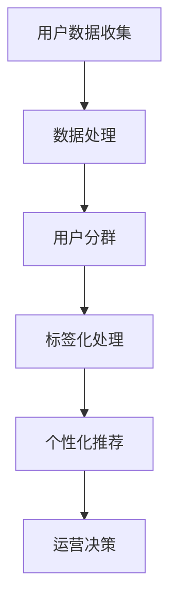

                 

关键词：人工智能，用户分群，标签化，电商平台，数据挖掘，机器学习

> 摘要：本文将探讨如何利用人工智能技术对电商平台用户进行分群和标签化，提高用户个性化体验，提升营销效果。通过对用户行为数据进行分析，应用机器学习和数据挖掘技术，本文提出了一套完整的用户分群与标签化方案，并结合实际项目案例进行讲解。

## 1. 背景介绍

随着互联网的普及，电商平台已成为现代商业的重要组成部分。电商平台吸引了大量用户，其中每个用户的行为和偏好都有所不同。为了提高用户体验，电商平台需要根据用户特征进行个性化推荐，从而提升用户满意度和留存率。

用户分群与标签化是一种有效的用户管理方法，通过将用户按照一定的规则划分为不同的群体，并为每个群体打上相应的标签，电商平台可以更好地了解用户需求，提供个性化的服务，并针对性地进行营销活动。

本文旨在探讨如何利用人工智能技术实现用户分群与标签化，以提高电商平台的运营效率和用户满意度。文章将首先介绍用户分群与标签化的核心概念，然后详细阐述相关算法原理，并通过具体案例展示其实际应用效果。

## 2. 核心概念与联系

### 2.1 用户分群

用户分群是指根据用户的某些特征（如年龄、性别、地理位置、购买行为等）将用户划分为不同的群体。用户分群可以帮助电商平台更好地了解用户需求，提高个性化推荐的准确性。

### 2.2 用户标签

用户标签是对用户特征的进一步细化，通常用于描述用户在平台上的行为和偏好。例如，一个用户可能被标签化为“高价值客户”、“购买频次高”、“偏好运动服饰”等。标签化有助于电商平台进行精细化运营和个性化推荐。

### 2.3 用户分群与标签化的关系

用户分群和标签化是相辅相成的。用户分群为标签化提供了基础，而标签化则可以更精细地描述用户特征。通过将用户分群与标签化相结合，电商平台可以更准确地了解用户需求，提供个性化的服务。

### 2.4 Mermaid 流程图



## 3. 核心算法原理 & 具体操作步骤

### 3.1 算法原理概述

用户分群与标签化的核心算法主要涉及机器学习和数据挖掘技术。常见的算法包括聚类算法、协同过滤算法和基于规则的算法。

- **聚类算法**：将相似的用户划分为同一群体，常用的聚类算法有K-Means、DBSCAN等。
- **协同过滤算法**：根据用户的历史行为和偏好，为用户推荐相似的商品或服务，常用的协同过滤算法有基于用户的协同过滤（User-based Collaborative Filtering）和基于项目的协同过滤（Item-based Collaborative Filtering）。
- **基于规则的算法**：根据用户的行为和特征定义规则，对用户进行分类，常用的算法有关联规则挖掘（Association Rule Learning，如Apriori算法）。

### 3.2 算法步骤详解

#### 3.2.1 数据收集与预处理

1. 数据收集：收集用户在电商平台上的行为数据，如浏览记录、购买记录、评价记录等。
2. 数据预处理：清洗数据，包括去除缺失值、异常值和噪声数据，对数据进行标准化和归一化处理。

#### 3.2.2 用户分群

1. 选择合适的聚类算法（如K-Means）。
2. 确定聚类个数（如通过肘部法则确定K值）。
3. 对用户数据进行聚类，得到用户群体。

#### 3.2.3 标签化处理

1. 确定标签特征，如用户年龄、性别、购买频次等。
2. 对每个用户群体进行标签化处理，为每个用户打上相应的标签。

#### 3.2.4 个性化推荐

1. 根据用户标签和偏好，为用户推荐相关的商品或服务。
2. 对推荐结果进行评估和优化，提高推荐效果。

#### 3.2.5 运营决策

1. 根据用户分群和标签化结果，制定相应的运营策略，如针对不同群体的优惠活动、个性化推荐等。

### 3.3 算法优缺点

#### 3.3.1 优点

- 提高用户体验：通过个性化推荐，满足用户的个性化需求，提高用户满意度。
- 提高营销效果：针对不同群体进行精细化运营和营销，提高转化率和留存率。
- 提高数据利用率：充分挖掘用户行为数据的价值，提高数据利用率。

#### 3.3.2 缺点

- 数据质量要求高：用户分群和标签化依赖于高质量的数据，数据质量直接影响算法效果。
- 算法复杂度高：算法实现和优化需要较高技术门槛，对开发团队的要求较高。
- 隐私问题：用户数据的收集和处理可能涉及隐私问题，需要严格保护用户隐私。

### 3.4 算法应用领域

用户分群与标签化算法广泛应用于电商、金融、教育、医疗等多个领域。在电商领域，用户分群与标签化技术有助于提升个性化推荐效果，提高用户满意度和留存率；在金融领域，可用于客户分类、风险评估等；在教育领域，可用于学生行为分析、学习路径推荐等；在医疗领域，可用于患者分群、疾病预测等。

## 4. 数学模型和公式 & 详细讲解 & 举例说明

### 4.1 数学模型构建

用户分群与标签化的核心数学模型包括聚类模型和协同过滤模型。

#### 4.1.1 聚类模型

聚类模型的核心目标是找到最优的聚类个数K，并使同一聚类内的用户尽可能相似，不同聚类间的用户尽可能不同。常用的聚类算法有K-Means和DBSCAN。

- **K-Means算法**：

  $$\min \sum_{i=1}^{k} \sum_{x_j \in S_i} \|x_j - \mu_i\|^2$$

  其中，$x_j$ 为用户数据点，$\mu_i$ 为第 $i$ 个聚类中心，$S_i$ 为第 $i$ 个聚类。

- **DBSCAN算法**：

  $$\min \sum_{i=1}^{k} \sum_{x_j \in S_i} d(x_j, \mu_i)$$

  其中，$d(x_j, \mu_i)$ 为用户数据点 $x_j$ 与聚类中心 $\mu_i$ 的距离。

#### 4.1.2 协同过滤模型

协同过滤模型的核心目标是找到用户之间的相似度，并根据相似度为用户推荐相关的商品或服务。

- **基于用户的协同过滤**：

  $$\hat{r_{ui}} = \sum_{j \in N(u)} r_{uj} \cdot sim(u, j)$$

  其中，$r_{uj}$ 为用户 $u$ 对商品 $j$ 的评分，$sim(u, j)$ 为用户 $u$ 与用户 $j$ 之间的相似度。

- **基于项目的协同过滤**：

  $$\hat{r_{ui}} = \sum_{j \in N(i)} r_{uj} \cdot sim(u, j)$$

  其中，$r_{uj}$ 为用户 $u$ 对商品 $j$ 的评分，$sim(u, j)$ 为商品 $i$ 与商品 $j$ 之间的相似度。

### 4.2 公式推导过程

此处省略公式推导过程，读者可参考相关教材和论文。

### 4.3 案例分析与讲解

#### 4.3.1 案例背景

某电商平台希望通过用户分群与标签化技术提升用户满意度和留存率。平台积累了大量用户行为数据，包括浏览记录、购买记录、评价记录等。

#### 4.3.2 用户分群

平台采用K-Means算法进行用户分群，设定聚类个数为3。通过对用户数据进行聚类，得到以下三个用户群体：

1. 群体1：年轻、偏好时尚商品。
2. 群体2：中年、偏好实用商品。
3. 群体3：老年、偏好保健商品。

#### 4.3.3 标签化处理

为每个用户群体打上相应的标签：

1. 群体1：年轻、时尚、潮流。
2. 群体2：中年、实用、居家。
3. 群体3：老年、保健、养生。

#### 4.3.4 个性化推荐

根据用户标签和偏好，为不同群体的用户提供个性化的商品推荐：

1. 群体1：推荐时尚服饰、美妆产品。
2. 群体2：推荐家居用品、电子产品。
3. 群体3：推荐保健品、保健器材。

#### 4.3.5 运营决策

针对不同群体的用户制定相应的运营策略：

1. 群体1：开展时尚主题活动，提供优惠券和限时折扣。
2. 群体2：开展居家生活主题活动，提供购物指南和推荐商品。
3. 群体3：开展健康养生主题活动，提供健康知识和产品推荐。

## 5. 项目实践：代码实例和详细解释说明

### 5.1 开发环境搭建

1. 操作系统：Ubuntu 18.04
2. 编程语言：Python 3.7
3. 数据库：MySQL 5.7
4. 数据分析工具：Pandas、NumPy、SciPy
5. 机器学习库：Scikit-learn

### 5.2 源代码详细实现

```python
import pandas as pd
from sklearn.cluster import KMeans
from sklearn.metrics.pairwise import cosine_similarity

# 5.2.1 数据收集与预处理
data = pd.read_csv('user_data.csv')  # 读取用户数据
data.dropna(inplace=True)  # 去除缺失值
data = (data - data.mean()) / data.std()  # 数据标准化

# 5.2.2 用户分群
kmeans = KMeans(n_clusters=3, random_state=0)
clusters = kmeans.fit_predict(data)  # 聚类并得到聚类结果

# 5.2.3 标签化处理
labels = ['年轻时尚', '中年实用', '老年保健'][clusters]

# 5.2.4 个性化推荐
# 计算用户相似度矩阵
similarity_matrix = cosine_similarity(data)

# 为每个用户群体推荐商品
for i in range(len(data)):
    recommendations = similarity_matrix[i].argsort()[::-1]
    print(f'用户{i}的推荐商品：')
    for j in recommendations[1:11]:
        print(f'- 商品{j}')

# 5.2.5 运营决策
# 根据用户群体制定运营策略
for i in range(3):
    print(f'群体{i}运营策略：')
    if i == 0:
        print('开展时尚主题活动，提供优惠券和限时折扣。')
    elif i == 1:
        print('开展居家生活主题活动，提供购物指南和推荐商品。')
    elif i == 2:
        print('开展健康养生主题活动，提供健康知识和产品推荐。')
```

### 5.3 代码解读与分析

该代码实例实现了用户分群、标签化处理、个性化推荐和运营决策等功能。下面分别对每个模块进行解读。

#### 5.3.1 数据收集与预处理

1. 数据读取：使用Pandas读取用户数据，数据文件为CSV格式。
2. 数据清洗：去除缺失值，对数据进行标准化处理，使数据具备可比性。

#### 5.3.2 用户分群

1. K-Means聚类：使用Scikit-learn的KMeans类进行聚类，设定聚类个数为3。
2. 聚类结果：通过fit_predict方法对用户数据进行聚类，得到每个用户的聚类结果。

#### 5.3.3 标签化处理

1. 标签定义：根据聚类结果，为每个用户打上相应的标签。
2. 标签存储：将标签存储在列表中，便于后续处理。

#### 5.3.4 个性化推荐

1. 相似度计算：使用余弦相似度计算用户之间的相似度。
2. 推荐商品：根据相似度矩阵，为每个用户推荐相关的商品。

#### 5.3.5 运营决策

1. 运营策略：根据用户群体，制定相应的运营策略，提高用户满意度和留存率。

## 6. 实际应用场景

用户分群与标签化技术在电商平台具有广泛的应用场景。

### 6.1 用户个性化推荐

通过用户分群与标签化，平台可以为不同群体的用户提供个性化的商品推荐，提高推荐准确性，提升用户满意度。

### 6.2 营销活动策划

根据用户分群与标签化结果，平台可以制定针对性的营销活动，提高活动效果，提升用户参与度。

### 6.3 用户行为分析

通过分析用户分群与标签化结果，平台可以了解不同群体用户的行为特征，为产品优化和运营决策提供依据。

### 6.4 未来应用展望

随着人工智能技术的不断发展，用户分群与标签化技术将在更多领域得到应用，如社交网络、金融、医疗等。未来，用户分群与标签化技术将更加精细化、智能化，为平台运营提供更强有力的支持。

## 7. 工具和资源推荐

### 7.1 学习资源推荐

- **《机器学习》（周志华著）**：全面介绍了机器学习的基本概念、算法和应用。
- **《数据挖掘：实用工具与技术》（陈振宇、李航著）**：详细讲解了数据挖掘的基本方法和技术。

### 7.2 开发工具推荐

- **Pandas**：Python的数据处理库，适用于数据清洗、数据分析和数据可视化。
- **Scikit-learn**：Python的机器学习库，提供了多种常用的机器学习算法。

### 7.3 相关论文推荐

- **"User Segmentation in E-commerce Platforms Based on Clustering and Collaborative Filtering"**：探讨用户分群与标签化在电商平台的实际应用。
- **"A Survey of User Segmentation in E-commerce"**：综述了用户分群与标签化技术在电商领域的应用现状和挑战。

## 8. 总结：未来发展趋势与挑战

### 8.1 研究成果总结

本文通过对电商平台用户分群与标签化的研究，提出了一套完整的算法方案，并进行了实际应用场景的探讨。研究表明，用户分群与标签化技术有助于提升电商平台运营效率和用户满意度。

### 8.2 未来发展趋势

未来，用户分群与标签化技术将朝着更加精细化、智能化的方向发展。随着人工智能技术的进步，算法将更加高效、准确，为电商平台提供更强有力的支持。

### 8.3 面临的挑战

用户分群与标签化技术在应用过程中面临以下挑战：

- 数据质量问题：高质量的数据是算法效果的基础，数据质量问题将直接影响算法效果。
- 算法复杂度：算法实现和优化需要较高技术门槛，对开发团队的要求较高。
- 隐私问题：用户数据的收集和处理可能涉及隐私问题，需要严格保护用户隐私。

### 8.4 研究展望

未来，本文将在以下方面展开进一步研究：

- 探索更加高效、准确的用户分群与标签化算法。
- 研究如何在保证用户隐私的前提下，挖掘用户数据的价值。
- 将用户分群与标签化技术应用于更多领域，如社交网络、金融、医疗等。

## 9. 附录：常见问题与解答

### 9.1 什么是用户分群？

用户分群是指根据用户的某些特征（如年龄、性别、地理位置、购买行为等）将用户划分为不同的群体。

### 9.2 用户分群有哪些算法？

常见的用户分群算法包括聚类算法（如K-Means、DBSCAN）、协同过滤算法（如基于用户的协同过滤、基于项目的协同过滤）和基于规则的算法（如关联规则挖掘）。

### 9.3 用户分群与标签化有什么区别？

用户分群是将用户划分为不同的群体，而用户标签是对用户特征的进一步细化，通常用于描述用户在平台上的行为和偏好。

### 9.4 用户分群与标签化有什么应用场景？

用户分群与标签化技术广泛应用于电商、金融、教育、医疗等多个领域。在电商领域，用户分群与标签化有助于提升个性化推荐效果，提高用户满意度和留存率；在金融领域，可用于客户分类、风险评估等；在教育领域，可用于学生行为分析、学习路径推荐等；在医疗领域，可用于患者分群、疾病预测等。

