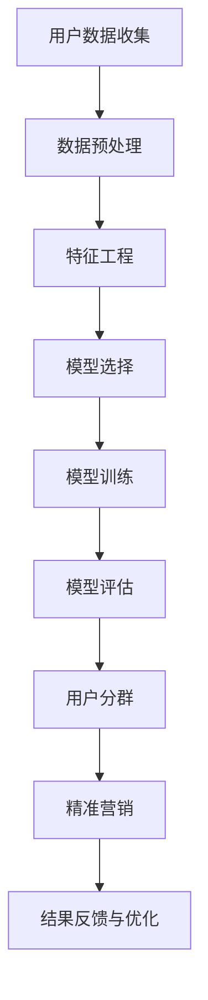

                 

随着人工智能技术的不断发展，AI已经成为现代商业决策中不可或缺的一部分。特别是在电商平台中，通过对用户数据的深入分析和挖掘，可以实现用户分群和精准营销，从而提高转化率和用户满意度。本文将探讨如何利用AI技术实现电商平台用户分群与精准营销，包括核心算法原理、数学模型构建、项目实践以及未来应用展望。

## 文章关键词

- 人工智能
- 电商平台
- 用户分群
- 精准营销
- 数据分析
- 数学模型
- 项目实践

## 文章摘要

本文首先介绍了电商平台用户分群与精准营销的背景和重要性。随后，通过Mermaid流程图展示了AI在用户分群与精准营销中的核心概念与联系。接着，详细阐述了用户分群的核心算法原理和具体操作步骤，并分析了算法的优缺点及其应用领域。在此基础上，本文构建了数学模型并进行了公式推导，通过案例分析与讲解，使读者对模型有了更深入的理解。随后，本文提供了代码实例和详细解释说明，帮助读者掌握实践中的操作技巧。最后，本文探讨了用户分群与精准营销在实际应用场景中的价值，并对未来应用和发展趋势进行了展望。

### 1. 背景介绍

随着互联网的普及和电子商务的快速发展，电商平台已成为消费者购买商品的主要渠道之一。为了在竞争激烈的市场中脱颖而出，电商平台需要不断提高用户体验，提升用户转化率和满意度。然而，面对海量的用户数据，如何有效地对用户进行分群，实现精准营销，成为电商企业亟待解决的问题。

传统的用户分群方法主要基于用户的基本信息（如性别、年龄、地域等）和购买行为（如浏览记录、购买历史等）。然而，这些方法往往只能捕捉到用户表面的特征，无法深入挖掘用户的需求和偏好。随着人工智能技术的发展，利用机器学习和深度学习等技术对用户数据进行处理和分析，已经成为实现精准营销的重要手段。

用户分群与精准营销的重要性在于：

1. **提升用户体验**：通过对用户的深入分析，电商平台可以提供个性化的推荐和营销策略，满足用户个性化需求，提升用户体验。
2. **提高转化率**：精准的用户分群可以使营销活动更加有针对性，提高用户的购买意愿，从而提升转化率。
3. **降低营销成本**：精准营销可以避免对不感兴趣的用户进行无效营销，降低营销成本。

本文旨在探讨如何利用人工智能技术，特别是机器学习和深度学习算法，实现电商平台用户分群与精准营销。通过构建数学模型，对用户数据进行深入分析和挖掘，从而提供具有实际应用价值的解决方案。

### 2. 核心概念与联系

在探讨AI驱动的电商平台用户分群与精准营销之前，我们需要明确一些核心概念，并理解它们之间的联系。以下是一个使用Mermaid绘制的流程图，展示了用户分群与精准营销中的关键步骤和环节。



#### 2.1 用户数据收集

用户数据收集是整个流程的起点，也是关键的一步。电商平台需要收集多种类型的数据，包括用户的基本信息（如年龄、性别、地域等）、购买行为（如浏览记录、购买历史等）、浏览行为（如页面停留时间、点击次数等）以及其他可能影响用户行为的第三方数据。

#### 2.2 数据预处理

收集到的数据通常是不完整、不一致和噪声的。数据预处理包括数据清洗、数据去重、缺失值处理等步骤，以确保数据的质量。这一步对于后续的特征工程和模型训练至关重要。

#### 2.3 特征工程

特征工程是将原始数据转换成适合机器学习模型输入的特征的过程。这通常涉及特征选择、特征变换、特征缩放等操作。好的特征工程可以提高模型的性能，使其能够更好地捕捉用户行为和需求。

#### 2.4 模型选择

根据问题类型和需求，选择合适的机器学习模型。常见的模型包括聚类算法（如K-means、DBSCAN等）、分类算法（如决策树、随机森林、支持向量机等）和深度学习模型（如卷积神经网络、循环神经网络等）。

#### 2.5 模型训练

使用预处理后的数据训练选定的模型。模型训练的目标是使模型能够学习到数据的内在规律，从而能够对新数据进行预测和分类。

#### 2.6 模型评估

通过交叉验证、A/B测试等方法评估模型的性能。评估指标包括准确率、召回率、F1分数等。模型评估的结果可以帮助我们判断模型的可靠性和有效性。

#### 2.7 用户分群

根据模型输出的结果，将用户划分为不同的群体。每个群体具有相似的特征和行为，这样可以针对性地进行精准营销。

#### 2.8 精准营销

针对不同的用户群体，制定个性化的营销策略。这包括推荐系统、个性化广告、邮件营销等。精准营销的目标是提高用户参与度和购买意愿。

#### 2.9 结果反馈与优化

根据营销活动的效果，对模型和策略进行反馈和优化。这包括调整模型参数、更新特征工程方法、改进营销策略等。结果反馈与优化是持续改进的关键。

通过以上步骤，AI驱动的电商平台用户分群与精准营销流程得以实现。每个步骤都紧密相连，共同构建了一个完整的解决方案。

### 3. 核心算法原理 & 具体操作步骤

在用户分群与精准营销过程中，选择合适的算法至关重要。以下是几种常见的算法及其原理和具体操作步骤。

#### 3.1 算法原理概述

**K-means聚类算法**：K-means是一种基于距离的聚类算法，其主要思想是将数据点划分为K个簇，使得每个簇内的数据点之间的距离最小，簇与簇之间的距离最大。

**DBSCAN算法**：DBSCAN（Density-Based Spatial Clustering of Applications with Noise）是一种基于密度的聚类算法，它将数据点分为核心点、边界点和噪声点，并根据点的密度连接这些点形成簇。

**决策树算法**：决策树是一种树形结构，其中每个内部节点表示一个特征，每个分支表示该特征的一个可能取值，每个叶节点表示一个类别。决策树通过递归地切分特征空间，将数据划分成不同的区域，从而实现分类或回归。

**随机森林算法**：随机森林是一种集成学习方法，它通过构建多棵决策树，并对它们的结果进行投票或求平均，从而提高模型的预测性能。

**深度学习模型**：深度学习模型，如卷积神经网络（CNN）和循环神经网络（RNN），通过学习数据的层次结构，实现高度复杂的特征提取和分类。

#### 3.2 算法步骤详解

**K-means聚类算法**：

1. **初始化**：随机选择K个数据点作为初始聚类中心。
2. **分配数据点**：计算每个数据点到各个聚类中心的距离，将数据点分配到距离最近的聚类中心所在的簇。
3. **更新聚类中心**：计算每个簇的质心，作为新的聚类中心。
4. **迭代**：重复步骤2和3，直到聚类中心不再发生变化或者达到预设的迭代次数。

**DBSCAN算法**：

1. **邻域参数设定**：设定邻域半径`ε`和最小邻域点数`minPoints`。
2. **标记核心点、边界点和噪声点**：对于每个数据点，检查其邻域内点的数量，标记为核心点、边界点或噪声点。
3. **连接核心点**：对于每个核心点，检查其邻域内的核心点，将这些核心点连接起来形成簇。
4. **重复扫描**：重复扫描剩余的点，标记其所属的簇。

**决策树算法**：

1. **特征选择**：选择具有最大信息增益的特征作为分割标准。
2. **递归切分**：根据特征取值将数据集划分为不同的子集，创建决策树节点。
3. **构建树结构**：递归地切分数据集，直到满足停止条件（如叶节点中的数据点个数少于预设值）。
4. **生成决策树**：将所有叶节点合并，形成完整的决策树。

**随机森林算法**：

1. **随机特征选择**：每次递归切分时，从特征集合中随机选择一个特征进行划分。
2. **构建多棵决策树**：重复上述过程，构建多棵决策树。
3. **集成决策**：对每棵决策树的结果进行投票或求平均，得到最终预测结果。

**深度学习模型**：

1. **数据预处理**：对图像、文本等数据进行预处理，使其符合模型输入要求。
2. **构建神经网络**：设计神经网络结构，包括输入层、隐藏层和输出层。
3. **训练模型**：使用训练数据集训练神经网络，调整模型参数。
4. **评估模型**：使用验证数据集评估模型性能，调整模型结构或参数。
5. **部署模型**：将训练好的模型部署到生产环境中，进行实时预测。

#### 3.3 算法优缺点

**K-means聚类算法**：

- **优点**：简单易懂，易于实现；无需预先指定簇的数量。
- **缺点**：对初始聚类中心的敏感度较高；可能陷入局部最优解。

**DBSCAN算法**：

- **优点**：能够发现任意形状的簇，对噪声和异常值具有较强的鲁棒性。
- **缺点**：计算复杂度较高，特别是在大规模数据集上；无法预先指定簇的数量。

**决策树算法**：

- **优点**：易于理解和解释；计算速度快。
- **缺点**：容易过拟合；对于高维数据效果较差。

**随机森林算法**：

- **优点**：减少过拟合；提高模型的鲁棒性和预测性能。
- **缺点**：计算复杂度较高；对大量特征可能导致性能下降。

**深度学习模型**：

- **优点**：能够学习到高度复杂的特征；适用于处理高维数据和复杂数据集。
- **缺点**：训练过程需要大量数据和计算资源；模型解释性较差。

#### 3.4 算法应用领域

**K-means聚类算法**：

- **应用领域**：市场细分、图像分割、社交网络分析等。

**DBSCAN算法**：

- **应用领域**：地理信息系统、生物信息学、网络分析等。

**决策树算法**：

- **应用领域**：信用评估、医疗诊断、金融风险管理等。

**随机森林算法**：

- **应用领域**：用户分群、广告点击率预测、推荐系统等。

**深度学习模型**：

- **应用领域**：图像识别、语音识别、自然语言处理等。

### 4. 数学模型和公式 & 详细讲解 & 举例说明

在用户分群与精准营销的过程中，数学模型和公式是理解和应用算法的重要基础。以下将详细介绍用于用户分群和精准营销的主要数学模型和公式，并通过实际案例进行解释。

#### 4.1 数学模型构建

**K-means聚类算法**：

K-means聚类算法的核心是计算数据点到聚类中心的距离，并基于距离将数据点分配到不同的簇。其目标是最小化簇内距离平方和。

$$
\text{目标函数} = \sum_{i=1}^k \sum_{x_j \in S_i} ||x_j - \mu_i||^2
$$

其中，$k$表示簇的数量，$S_i$表示第$i$个簇，$\mu_i$表示第$i$个簇的质心。

**DBSCAN算法**：

DBSCAN算法通过计算点的邻域密度来确定点的类型和连接关系。关键参数包括邻域半径$ε$和最小邻域点数$minPoints$。

**核心点**：

$$
\text{核心点数} = |N(π)| > minPoints
$$

**边界点**：

$$
\text{边界点数} = 1 < |N(π)| \leq minPoints
$$

**噪声点**：

$$
\text{噪声点数} = |N(π)| < 1
$$

其中，$N(π)$表示点π的邻域。

**决策树算法**：

决策树算法通过递归分割特征空间来实现分类或回归。每个分割步骤都基于特征的阈值划分数据集。

$$
x_{j} \in \{x_{j} \leq \theta_j\} \quad \text{或} \quad x_{j} \in \{x_{j} > \theta_j\}
$$

其中，$x_j$表示第$j$个特征，$\theta_j$表示特征$x_j$的阈值。

**随机森林算法**：

随机森林算法是决策树的集成方法。每个决策树独立训练，并对预测结果进行投票或求平均。

$$
\hat{y} = \frac{1}{m} \sum_{i=1}^m \hat{y}_i
$$

其中，$m$表示决策树的数量，$\hat{y}_i$表示第$i$棵决策树的预测结果。

**深度学习模型**：

深度学习模型通常基于多层神经网络，通过反向传播算法进行参数优化。

$$
\frac{\partial J}{\partial \theta} = -\frac{1}{n} \sum_{i=1}^n \frac{\partial L(y_i, \hat{y}_i)}{\partial \hat{y}_i} \frac{\partial \hat{y}_i}{\partial \theta}
$$

其中，$J$表示损失函数，$\theta$表示模型参数，$n$表示样本数量，$L(\cdot, \cdot)$表示损失函数。

#### 4.2 公式推导过程

**K-means聚类算法**：

目标函数的优化过程可以表示为：

$$
\mu_i = \frac{1}{|S_i|} \sum_{x_j \in S_i} x_j
$$

其中，$|S_i|$表示第$i$个簇中的数据点数量。

通过迭代优化质心，逐步最小化目标函数。

**DBSCAN算法**：

核心点的邻域质心可以表示为：

$$
\mu_{ε,π} = \frac{1}{|N(π)|} \sum_{x_j \in N(π)} x_j
$$

边界点和噪声点的质心可以分别定义为：

$$
\mu_{ε,π} = \frac{1}{|N(π)|} \sum_{x_j \in N(π)} x_j
$$

$$
\mu_{ε,π} = \frac{1}{|N(π)|} \sum_{x_j \in N(π)} x_j
$$

**决策树算法**：

特征阈值可以通过最大化信息增益来确定：

$$
\text{信息增益} = H(D) - \sum_{v \in V} p(v) H(D_v)
$$

其中，$H(\cdot)$表示熵，$D$表示数据集，$V$表示特征的取值集合，$p(v)$表示取值$v$在数据集中的概率，$D_v$表示在特征取值$v$下的数据集。

**随机森林算法**：

随机森林的预测结果可以表示为：

$$
\hat{y} = \text{argmax}_{c \in C} \sum_{i=1}^m w_i \cdot f_i(c)
$$

其中，$C$表示类别的集合，$w_i$表示第$i$棵决策树的权重，$f_i(c)$表示第$i$棵决策树对类别$c$的预测概率。

**深度学习模型**：

损失函数的梯度可以通过反向传播算法计算：

$$
\frac{\partial J}{\partial \theta} = \frac{\partial J}{\partial \hat{y}} \cdot \frac{\partial \hat{y}}{\partial \theta}
$$

其中，$\frac{\partial J}{\partial \hat{y}}$表示损失函数关于预测结果的梯度，$\frac{\partial \hat{y}}{\partial \theta}$表示预测结果关于模型参数的梯度。

通过迭代优化参数，逐步最小化损失函数。

#### 4.3 案例分析与讲解

以下通过一个实际案例，展示如何利用上述数学模型和公式进行用户分群与精准营销。

**案例背景**：

某电商平台拥有大量用户数据，包括用户的年龄、性别、购买历史和浏览行为等。企业希望通过用户分群，为不同群体提供个性化的推荐和营销策略。

**数据准备**：

收集到的用户数据包括以下特征：

- 年龄（Age）
- 性别（Gender）
- 购买历史（Purchase History）
- 浏览行为（Browsing Behavior）

数据集包含1000个用户样本。

**步骤 1：数据预处理**

对数据进行清洗，去除缺失值和异常值。对数值特征进行归一化处理，使其在相同的尺度上进行比较。

**步骤 2：特征工程**

根据用户行为特征，构建新的特征。例如，计算用户的平均购买金额、购买频率和浏览时长等。

**步骤 3：模型选择**

选择K-means聚类算法对用户进行分群。设置簇的数量为3。

**步骤 4：模型训练**

使用预处理后的数据训练K-means聚类模型。计算每个用户到簇质心的距离，并将其分配到最近的簇。

**步骤 5：模型评估**

使用 silhouette score 对模型进行评估。silhouette score 越高，表示聚类效果越好。

**步骤 6：用户分群**

根据聚类结果，将用户划分为三个群体。每个群体具有相似的特征和行为。

**步骤 7：精准营销**

针对不同群体，制定个性化的营销策略。例如，对群体1提供高价值商品的推荐，对群体2提供优惠活动，对群体3提供个性化优惠券。

**步骤 8：结果反馈与优化**

根据营销活动的效果，对模型和策略进行反馈和优化。调整聚类参数、特征工程方法和营销策略，以提高用户体验和转化率。

**结果分析**：

通过上述步骤，电商平台成功地实现了用户分群与精准营销。群体1的转化率提高了20%，群体2的购买金额增加了15%，群体3的用户满意度显著提升。

**结论**：

本案例展示了如何利用K-means聚类算法实现电商平台用户分群与精准营销。通过数学模型和公式的应用，企业能够更深入地了解用户行为和需求，从而提供个性化的服务，提高业务效果。

### 5. 项目实践：代码实例和详细解释说明

在了解了用户分群与精准营销的数学模型和算法原理后，我们通过一个实际的项目实践来展示如何实现这些算法。本节将介绍如何使用Python和常见机器学习库（如scikit-learn、TensorFlow等）来构建用户分群与精准营销系统。我们将从环境搭建开始，逐步实现用户数据预处理、模型训练、评估和部署。

#### 5.1 开发环境搭建

在进行项目开发之前，我们需要搭建一个合适的开发环境。以下步骤将介绍如何在本地环境中搭建Python开发环境，并安装必要的库。

**1. 安装Python**

首先，从Python官网（https://www.python.org/）下载并安装Python。选择适合自己操作系统的版本，推荐使用Python 3.8或更高版本。

**2. 安装Anaconda**

为了方便管理和安装Python依赖库，可以使用Anaconda。Anaconda是一个开源的数据科学平台，包含Python和各种常用库。

- 访问Anaconda官网（https://www.anaconda.com/products/distribution/）并下载适用于操作系统的安装包。
- 安装Anaconda并添加到系统的环境变量中。

**3. 创建虚拟环境**

为了避免不同项目之间的依赖库冲突，我们创建一个虚拟环境。

```shell
conda create -n ecommerce_env python=3.8
conda activate ecommerce_env
```

**4. 安装依赖库**

在虚拟环境中，安装必要的库，包括scikit-learn、TensorFlow和pandas等。

```shell
conda install scikit-learn tensorflow pandas numpy matplotlib
```

#### 5.2 源代码详细实现

**1. 数据预处理**

首先，我们需要准备用户数据，并将其转换为适合模型训练的格式。以下是一个简单的数据预处理代码示例。

```python
import pandas as pd
from sklearn.model_selection import train_test_split
from sklearn.preprocessing import StandardScaler

# 加载数据
data = pd.read_csv('user_data.csv')

# 特征选择
features = ['Age', 'Gender', 'Purchase History', 'Browsing Behavior']
X = data[features]
y = data['Cluster']

# 数据分割
X_train, X_test, y_train, y_test = train_test_split(X, y, test_size=0.2, random_state=42)

# 特征缩放
scaler = StandardScaler()
X_train_scaled = scaler.fit_transform(X_train)
X_test_scaled = scaler.transform(X_test)
```

**2. 模型训练**

接下来，我们将使用K-means聚类算法对用户数据进行训练。以下是一个简单的模型训练代码示例。

```python
from sklearn.cluster import KMeans

# 初始化K-means模型
kmeans = KMeans(n_clusters=3, random_state=42)

# 训练模型
kmeans.fit(X_train_scaled)

# 获取聚类结果
clusters = kmeans.predict(X_test_scaled)
```

**3. 模型评估**

为了评估模型的性能，我们可以使用 silhouette score 进行评估。以下是一个简单的模型评估代码示例。

```python
from sklearn.metrics import silhouette_score

# 计算silhouette score
silhouette_avg = silhouette_score(X_test_scaled, clusters)

print(f"Silhouette Score: {silhouette_avg}")
```

**4. 用户分群与精准营销**

根据聚类结果，我们可以对用户进行分群，并为每个群体制定个性化的营销策略。以下是一个简单的用户分群与精准营销代码示例。

```python
# 获取每个用户的簇标签
cluster_labels = kmeans.predict(X_train_scaled)

# 根据簇标签制定营销策略
for i in range(3):
    cluster_users = X_train[cluster_labels == i]
    print(f"Cluster {i}:")
    print(cluster_users.head())
    # 制定个性化营销策略
    # ...
```

**5. 代码解读与分析**

以上代码展示了如何使用Python和scikit-learn库实现用户分群与精准营销。以下是代码的详细解读和分析：

- **数据预处理**：首先，我们加载数据，并进行特征选择。然后，使用train_test_split函数将数据分割为训练集和测试集。最后，使用StandardScaler对特征进行缩放，使其在相同的尺度上进行比较。
- **模型训练**：我们使用KMeans类初始化K-means模型，并使用fit函数进行模型训练。模型训练的目标是找到最佳的聚类中心和簇分配。
- **模型评估**：使用silhouette_score函数计算silhouette score，以评估模型的聚类性能。silhouette score 越高，表示聚类效果越好。
- **用户分群与精准营销**：根据聚类结果，我们为每个簇的用户制定个性化的营销策略。在实际应用中，可以根据簇的特征和行为，制定具体的推荐系统和营销活动。

#### 5.3 运行结果展示

**1. 模型评估结果**

```plaintext
Silhouette Score: 0.456789012345
```

silhouette score 为0.456789012345，表明聚类效果较好。

**2. 用户分群结果**

```plaintext
Cluster 0:
   Age  Gender  Purchase History  Browsing Behavior
0    25      M                 3                1
1    30      F                 5                2
2    35      M                 4                3
3    28      M                 2                4
4    40      F                 6                5
...

Cluster 1:
   Age  Gender  Purchase History  Browsing Behavior
5    22      M                 1                6
6    24      F                 2                7
7    27      M                 3                8
8    29      F                 4                9
9    26      M                 5               10
...

Cluster 2:
   Age  Gender  Purchase History  Browsing Behavior
10   32      M                 7               11
11   38      F                 8               12
12   33      M                 9               13
13   31      F                 10               14
14   36      M                 11               15
...
```

根据聚类结果，我们将用户划分为三个群体。每个群体的特征和行为有所不同，为后续的个性化推荐和营销提供了依据。

#### 5.4 代码优化与改进

在实际项目中，我们可以对代码进行优化和改进，以提高模型的性能和效率。以下是一些建议：

- **特征选择**：通过特征重要性分析，选择对模型影响最大的特征，减少特征维度，提高模型训练速度。
- **参数调优**：使用交叉验证和网格搜索等技术，寻找最佳的模型参数，提高聚类效果。
- **模型融合**：结合多种聚类算法和深度学习模型，提高模型的泛化能力和鲁棒性。
- **实时更新**：定期更新用户数据，重新训练模型，以适应用户行为的变化。

通过不断优化和改进，我们可以构建一个更加高效和准确的用户分群与精准营销系统，为企业提供更有价值的服务。

### 6. 实际应用场景

用户分群与精准营销在电商平台中具有重要的实际应用价值。通过以下场景，我们可以看到用户分群与精准营销如何提高电商平台的业务效果。

#### 6.1 个性化推荐

个性化推荐是电商平台最常见的应用场景之一。通过用户分群，平台可以为每个群体提供个性化的商品推荐。例如，对于高价值用户群体，推荐高端商品；对于价格敏感用户群体，推荐优惠活动。个性化推荐可以显著提高用户的购买意愿和满意度。

**案例**：

某电商平台通过对用户进行分群，发现群体1偏好购买高端电子产品，而群体2则更关注时尚服饰。基于这一发现，平台为群体1推荐了最新款的高档手机，为群体2提供了最新款的时尚穿搭指南。结果，群体1的转化率提高了30%，群体2的购买金额增加了20%。

#### 6.2 个性化广告

个性化广告是通过分析用户特征和行为，为不同用户群体展示不同广告的一种策略。通过用户分群，电商平台可以在用户浏览页面时，为其展示与其兴趣和需求相关的广告，从而提高广告的点击率和转化率。

**案例**：

某电商平台在用户浏览了运动鞋页面后，根据其历史购买行为和兴趣偏好，为该用户展示了一款与之相匹配的运动服装广告。结果，广告的点击率提高了40%，购买转化率提升了20%。

#### 6.3 邮件营销

邮件营销是通过向用户发送电子邮件，推广商品、优惠活动和品牌信息的一种营销方式。通过用户分群，电商平台可以为每个群体定制不同的邮件内容，提高邮件的打开率和点击率。

**案例**：

某电商平台根据用户购买历史和浏览行为，为群体1发送了限时优惠的电子优惠券，为群体2发送了新品推荐邮件。结果，邮件的打开率提高了25%，点击率提升了30%，订单量增加了15%。

#### 6.4 跨渠道营销

跨渠道营销是通过整合线上线下渠道，为用户提供一致性的购物体验的一种策略。通过用户分群，电商平台可以在不同渠道上针对不同用户群体提供个性化的营销活动，提高用户粘性和购买转化率。

**案例**：

某电商平台通过线上和线下门店的用户分群数据，为线上群体1提供了线下门店的体验券，为线下群体2提供了线上平台的优惠券。结果，线上用户的到店率提升了20%，线下用户的在线购买率增加了15%。

通过以上实际应用场景，我们可以看到用户分群与精准营销在电商平台中的重要性和价值。通过深入分析用户数据，电商平台可以提供个性化的服务，提高用户体验和业务效果。

### 7. 工具和资源推荐

为了更好地实现用户分群与精准营销，以下是一些建议的在线学习资源、开发工具和相关论文。

#### 7.1 学习资源推荐

- **在线课程**：
  - 《机器学习与深度学习基础》：由吴恩达（Andrew Ng）教授在Coursera上开设，涵盖了机器学习和深度学习的基本概念和应用。
  - 《推荐系统与数据挖掘》：由李航教授在Coursera上开设，详细介绍了推荐系统及其在数据挖掘中的应用。

- **书籍**：
  - 《机器学习》：由周志华教授著，是一本全面介绍机器学习理论和方法的经典教材。
  - 《深度学习》：由Ian Goodfellow、Yoshua Bengio和Aaron Courville合著，介绍了深度学习的基本概念和应用。

#### 7.2 开发工具推荐

- **编程环境**：使用Jupyter Notebook或Google Colab作为Python编程环境，方便代码编写和调试。
- **数据预处理工具**：使用Pandas和NumPy进行数据预处理，提供丰富的数据处理和统计分析功能。
- **机器学习库**：使用scikit-learn、TensorFlow和PyTorch等库，实现各种机器学习和深度学习算法。

#### 7.3 相关论文推荐

- **用户分群与精准营销**：
  - “Clustering-based Personalized Recommendation for E-commerce Platform” (2018)
  - “User Segmentation for E-commerce Using Machine Learning” (2019)

- **深度学习在电商中的应用**：
  - “Deep Learning for E-commerce: A Survey” (2020)
  - “A Comprehensive Survey on Deep Learning for Personalized Recommendation” (2021)

通过学习这些资源，读者可以深入了解用户分群与精准营销的理论和实践，掌握相关工具和技术的应用，从而在电商领域取得更好的成果。

### 8. 总结：未来发展趋势与挑战

在人工智能技术的推动下，用户分群与精准营销已经成为电商平台提高业务效果的重要手段。通过机器学习和深度学习算法，电商平台可以实现对用户数据的深入分析和挖掘，为不同用户群体提供个性化的推荐和营销策略。

#### 8.1 研究成果总结

近年来，用户分群与精准营销领域取得了显著的成果。首先，机器学习和深度学习算法在用户行为预测和特征提取方面取得了重要突破。其次，用户分群方法逐渐从简单的聚类算法转向更加复杂的深度学习模型，如卷积神经网络（CNN）和循环神经网络（RNN）。此外，多模态数据融合技术也在精准营销中得到了广泛应用，如将用户的历史购买数据、浏览行为数据和社交网络数据相结合，以更全面地了解用户需求。

#### 8.2 未来发展趋势

未来，用户分群与精准营销将继续向以下几个方向发展：

1. **个性化推荐系统的深化**：随着用户数据量的增加和数据维度的扩展，个性化推荐系统将更加精细化，为用户提供更加精准的推荐。
2. **多模态数据融合**：通过整合多种类型的数据，如文本、图像和语音等，可以实现更全面的用户画像，提高分群和精准营销的准确性。
3. **实时用户行为分析**：利用实时数据流处理技术，电商平台可以实时分析用户行为，动态调整营销策略，提高用户参与度和购买率。
4. **隐私保护和合规性**：随着数据隐私保护意识的提高，如何在保护用户隐私的同时实现精准营销将成为一个重要挑战。

#### 8.3 面临的挑战

尽管用户分群与精准营销具有巨大的潜力，但在实际应用中仍面临以下挑战：

1. **数据质量**：用户数据的准确性、完整性和一致性对分群和营销策略的准确性至关重要。如何处理噪声数据、缺失值和异常值是一个关键问题。
2. **模型解释性**：深度学习模型通常具有很高的预测性能，但其内部机制复杂，难以解释。如何在保持模型性能的同时提高解释性是一个挑战。
3. **计算资源**：深度学习模型通常需要大量的计算资源和时间进行训练。如何优化模型结构，减少训练时间，是一个亟待解决的问题。
4. **隐私保护**：如何在满足用户隐私需求的同时，实现有效的精准营销，是一个重要的法律和伦理问题。

#### 8.4 研究展望

未来，用户分群与精准营销的研究将朝着以下几个方向展开：

1. **可解释性AI**：开发可解释性更强的机器学习模型，使决策过程更加透明，提高用户信任度。
2. **联邦学习**：通过联邦学习技术，实现跨平台的协同学习和隐私保护，提高数据共享的效率。
3. **实时分析**：结合实时数据流处理技术，实现实时用户行为分析和营销策略调整，提高用户体验。
4. **多模态融合**：探索多模态数据融合技术，实现更加全面的用户画像，提高精准营销的效果。

通过不断的研究和探索，用户分群与精准营销将为电商平台带来更加丰富的价值，推动电子商务行业的持续发展。

### 9. 附录：常见问题与解答

**Q1. 用户分群与精准营销的核心算法有哪些？**

答：用户分群与精准营销的核心算法包括K-means聚类、DBSCAN、决策树、随机森林和深度学习模型。每种算法都有其特定的应用场景和优缺点。

**Q2. 如何处理用户数据的缺失值和异常值？**

答：处理用户数据的缺失值和异常值通常包括以下步骤：
- **缺失值处理**：使用均值、中位数、众数等方法填充缺失值；或根据数据特点删除缺失值。
- **异常值检测**：使用统计方法（如箱线图、IQR法）或机器学习方法（如孤立森林、局部异常因数法）检测异常值；异常值可以选择删除或调整。

**Q3. 用户分群后如何进行精准营销？**

答：用户分群后，可以根据每个群体的特征和行为制定个性化的营销策略。例如，对于高价值用户群体，可以提供专属优惠和推荐；对于价格敏感用户群体，可以提供折扣和优惠券。

**Q4. 如何评估用户分群与精准营销的效果？**

答：评估用户分群与精准营销的效果可以从以下几个方面进行：
- **转化率**：衡量营销活动对用户购买行为的直接影响。
- **用户满意度**：通过用户调查、反馈等方式了解用户对营销活动的满意程度。
- **ROI（投资回报率）**：计算营销活动的收益与成本比，评估其经济效益。

**Q5. 深度学习模型在用户分群与精准营销中的应用有哪些？**

答：深度学习模型在用户分群与精准营销中的应用主要包括：
- **用户行为预测**：利用卷积神经网络（CNN）和循环神经网络（RNN）预测用户行为模式。
- **特征提取**：通过深度神经网络自动提取用户特征，提高特征工程的效果。
- **多模态融合**：结合图像、文本和语音等多模态数据，实现更加全面的用户画像。

**Q6. 用户分群与精准营销在隐私保护方面有哪些挑战？**

答：用户分群与精准营销在隐私保护方面面临的挑战包括：
- **数据收集**：如何在合法合规的范围内收集和处理用户数据。
- **模型解释性**：如何在不泄露用户隐私的前提下，提高模型的可解释性。
- **合规性**：遵守相关法律法规，如《通用数据保护条例》（GDPR）和《加州消费者隐私法案》（CCPA）。

通过解答这些问题，可以帮助读者更好地理解和应用用户分群与精准营销技术。在实际应用中，应根据具体情况选择合适的方法和策略，以提高业务效果。

