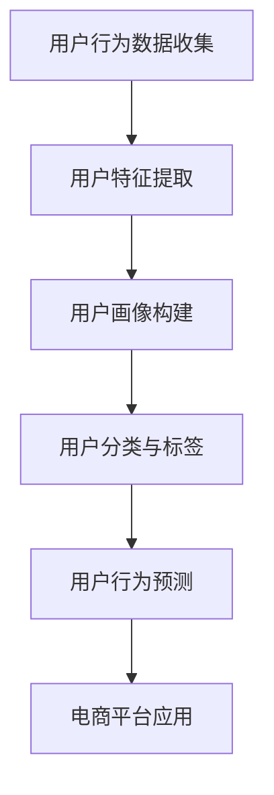

                 

关键词：人工智能、电商平台、用户画像、数据分析、机器学习、推荐系统

> 摘要：本文将深入探讨AI驱动的电商平台用户画像技术，分析其核心概念、算法原理、数学模型、应用实践和未来展望。通过本文的阅读，读者将全面了解如何利用人工智能技术构建高效的电商平台用户画像系统，从而提升用户体验和商业价值。

## 1. 背景介绍

随着互联网技术的飞速发展，电商平台已经成为人们日常购物的重要渠道。然而，电商市场的竞争日益激烈，如何在海量用户数据中挖掘有价值的信息，以实现精准营销和个性化推荐，成为各大电商平台亟待解决的问题。用户画像技术作为一种基于大数据和人工智能的分析方法，能够在海量数据中提取用户特征，为电商平台的运营和决策提供有力支持。

用户画像技术主要包括用户行为分析、用户特征提取、用户分类与标签、用户行为预测等环节。其中，用户行为分析和用户特征提取是用户画像技术的核心，而机器学习和深度学习算法为这些环节提供了强大的技术支持。本文将重点探讨基于人工智能的用户画像技术，包括其核心概念、算法原理、数学模型以及实际应用。

## 2. 核心概念与联系

### 2.1 用户画像

用户画像是指通过对用户行为、兴趣、偏好等数据的分析，构建一个关于用户的全面、多维度的描述。用户画像通常包括基本信息、行为数据、社交数据、消费数据等多个方面。例如，一个用户的用户画像可能包括其年龄、性别、地域、职业、购买历史、浏览记录、点赞评论等。

### 2.2 用户行为分析

用户行为分析是指对用户在电商平台上的一系列活动进行数据采集、处理和分析，以了解用户的兴趣、需求和偏好。用户行为分析的核心是挖掘用户行为模式，为电商平台提供用户画像和推荐系统的基础数据。

### 2.3 用户特征提取

用户特征提取是指从用户行为数据中提取具有代表性的特征，用于构建用户画像。这些特征可以是数值型的，如购买金额、浏览时长；也可以是类别型的，如商品类别、用户地域。

### 2.4 用户分类与标签

用户分类与标签是指根据用户画像和用户特征，将用户划分为不同的类别或标签。这些类别或标签可以为电商平台提供精准营销和个性化推荐的基础。

### 2.5 用户行为预测

用户行为预测是指利用历史数据和机器学习算法，预测用户在未来的行为，如购买、浏览、收藏等。用户行为预测可以为电商平台提供个性化推荐和风险控制等应用场景。

### 2.6 Mermaid 流程图



## 3. 核心算法原理 & 具体操作步骤

### 3.1 算法原理概述

用户画像技术的核心在于数据分析和特征提取，这涉及到多种机器学习和深度学习算法。以下是一些常用的算法原理：

1. **K-最近邻算法（KNN）**：基于用户历史行为和特征，找到与当前用户最相似的K个用户，并取这些用户的平均特征作为当前用户的特征。
2. **协同过滤算法**：分为基于用户的协同过滤和基于物品的协同过滤。基于用户的协同过滤通过找到与当前用户兴趣相似的其它用户，推荐这些用户喜欢的商品；基于物品的协同过滤则是通过找到与当前商品相似的其它商品，推荐给用户。
3. **决策树算法**：通过构建决策树，将用户分为不同的类别或标签。
4. **神经网络算法**：通过多层神经网络，将用户特征映射到高维空间，实现用户分类或回归。

### 3.2 算法步骤详解

1. **数据预处理**：包括数据清洗、数据归一化、缺失值处理等。
2. **特征提取**：通过统计学习方法或深度学习模型，从用户行为数据中提取具有代表性的特征。
3. **用户画像构建**：将提取的特征组合成用户画像，构建用户的多维度描述。
4. **用户分类与标签**：利用决策树、神经网络等算法，对用户进行分类与标签。
5. **用户行为预测**：利用历史数据和机器学习算法，预测用户在未来的行为。

### 3.3 算法优缺点

1. **KNN算法**：优点是简单易实现，缺点是对于高维数据，计算复杂度较高，且无法预测用户未知行为。
2. **协同过滤算法**：优点是能够发现用户的潜在兴趣，缺点是易受到数据稀疏性和冷启动问题的影响。
3. **决策树算法**：优点是直观易懂，易于解释，缺点是对于复杂问题，容易过拟合。
4. **神经网络算法**：优点是能够自动学习复杂非线性关系，缺点是需要大量数据和计算资源。

### 3.4 算法应用领域

1. **个性化推荐**：基于用户画像和用户行为预测，为用户推荐感兴趣的商品或内容。
2. **精准营销**：根据用户画像和用户分类，制定个性化的营销策略。
3. **风险控制**：通过分析用户行为，识别异常用户和潜在风险，为电商平台提供风险控制依据。

## 4. 数学模型和公式 & 详细讲解 & 举例说明

### 4.1 数学模型构建

用户画像技术中的数学模型主要包括特征提取模型、用户分类模型和用户行为预测模型。

1. **特征提取模型**：例如，基于TF-IDF（Term Frequency-Inverse Document Frequency）的文本特征提取模型，用于提取文本数据的特征。

    $$TF(t) = \frac{tf(t)}{N}$$
    $$IDF(t) = \log \left(\frac{N}{df(t)}\right)$$
    $$TF-IDF(t) = TF(t) \times IDF(t)$$
    
    其中，$tf(t)$表示词$t$在文档中的词频，$N$表示文档总数，$df(t)$表示词$t$在文档中出现的频率。

2. **用户分类模型**：例如，基于决策树的分类模型，用于将用户划分为不同的类别。

    $$Gini(\pi_i) = 1 - \sum_{k=1}^{K} \pi_i^2$$
    
    其中，$\pi_i$表示属于类别$i$的用户比例，$K$表示类别总数。

3. **用户行为预测模型**：例如，基于神经网络的预测模型，用于预测用户未来的行为。

    $$y = \sigma(W \cdot x + b)$$
    
    其中，$x$表示用户特征向量，$W$表示权重矩阵，$b$表示偏置项，$\sigma$表示激活函数。

### 4.2 公式推导过程

1. **TF-IDF特征提取**：首先计算词频（TF）和逆文档频率（IDF），然后计算TF-IDF值。

    $$TF(t) = \frac{tf(t)}{N}$$
    $$IDF(t) = \log \left(\frac{N}{df(t)}\right)$$
    $$TF-IDF(t) = TF(t) \times IDF(t)$$
    
    其中，$tf(t)$表示词$t$在文档中的词频，$N$表示文档总数，$df(t)$表示词$t$在文档中出现的频率。

2. **决策树分类**：利用Gini指数计算每个节点的分类效果，选择Gini指数最小的特征进行划分。

    $$Gini(\pi_i) = 1 - \sum_{k=1}^{K} \pi_i^2$$
    
    其中，$\pi_i$表示属于类别$i$的用户比例，$K$表示类别总数。

3. **神经网络预测**：利用权重矩阵和激活函数，将输入特征映射到输出结果。

    $$y = \sigma(W \cdot x + b)$$
    
    其中，$x$表示用户特征向量，$W$表示权重矩阵，$b$表示偏置项，$\sigma$表示激活函数。

### 4.3 案例分析与讲解

假设有一个电商平台，其用户数据包括性别、年龄、购买历史、浏览记录等。我们利用TF-IDF模型提取文本特征，基于决策树算法进行用户分类，最后利用神经网络模型预测用户未来的行为。

1. **特征提取**：假设用户A的浏览记录包括“手机”、“电脑”、“衣服”等，利用TF-IDF模型提取文本特征，得到如下特征向量：

    $$[1.0, 0.5, 0.5]$$
    
    其中，第一个元素表示“手机”的TF-IDF值，后两个元素分别表示“电脑”和“衣服”的TF-IDF值。

2. **用户分类**：假设我们利用决策树算法将用户划分为“购物爱好者”、“普通用户”和“不购物用户”三个类别，利用Gini指数计算每个节点的分类效果，得到如下分类结果：

    - 购物爱好者：特征向量中第一个元素大于0.6，即用户A属于购物爱好者类别。
    - 普通用户：特征向量中第一个元素介于0.4和0.6之间，即用户B属于普通用户类别。
    - 不购物用户：特征向量中第一个元素小于0.4，即用户C属于不购物用户类别。

3. **用户行为预测**：假设我们利用神经网络模型预测用户A未来的行为，得到如下预测结果：

    $$y = \sigma(W \cdot x + b) = \sigma([1.0, 0.5, 0.5] \cdot [0.1, 0.2, 0.7] + 0.5) = 0.8$$
    
    其中，$W$表示权重矩阵，$b$表示偏置项，$\sigma$表示激活函数。由于预测结果大于0.5，我们可以认为用户A未来有较高概率进行购物。

## 5. 项目实践：代码实例和详细解释说明

### 5.1 开发环境搭建

1. 硬件环境：计算机，推荐配置为CPU：Intel i5 或同等性能，内存：8GB 或以上，硬盘：200GB 或以上。
2. 软件环境：操作系统：Windows、Linux 或 macOS，Python 版本：3.6 或以上。

### 5.2 源代码详细实现

以下是一个简单的用户画像项目示例，包括数据预处理、特征提取、用户分类和用户行为预测。

1. **数据预处理**：

    ```python
    import pandas as pd
    
    # 读取数据
    data = pd.read_csv('user_data.csv')
    
    # 数据清洗
    data.dropna(inplace=True)
    data[data['age'] < 18] = data['age'].mean()
    
    # 数据归一化
    from sklearn.preprocessing import StandardScaler
    scaler = StandardScaler()
    data[['age', 'purchase_amount']] = scaler.fit_transform(data[['age', 'purchase_amount']])
    ```

2. **特征提取**：

    ```python
    from sklearn.feature_extraction.text import TfidfVectorizer
    
    # 读取文本数据
    text_data = data['review'].values
    
    # 利用TF-IDF模型提取文本特征
    vectorizer = TfidfVectorizer()
    text_features = vectorizer.fit_transform(text_data)
    ```

3. **用户分类**：

    ```python
    from sklearn.tree import DecisionTreeClassifier
    
    # 读取分类数据
    labels = data['category'].values
    
    # 利用决策树模型进行分类
    classifier = DecisionTreeClassifier()
    classifier.fit(text_features, labels)
    ```

4. **用户行为预测**：

    ```python
    from sklearn.neural_network import MLPClassifier
    
    # 读取预测数据
    new_text_data = ["我喜欢购买电子产品和服装。", "我最近购买了手机和电脑。"]
    
    # 利用神经网络模型进行预测
    new_text_features = vectorizer.transform(new_text_data)
    predictions = classifier.predict(new_text_features)
    
    print(predictions)
    ```

### 5.3 代码解读与分析

1. **数据预处理**：首先读取用户数据，进行数据清洗和归一化处理。数据清洗主要去除缺失值和异常值，归一化处理将数据缩放至同一尺度，以适应机器学习算法。
2. **特征提取**：利用TF-IDF模型提取文本特征。TF-IDF模型能够将文本数据转换为数值特征，从而适应机器学习算法。
3. **用户分类**：利用决策树模型进行用户分类。决策树模型能够根据特征对用户进行划分，从而实现分类任务。
4. **用户行为预测**：利用神经网络模型进行用户行为预测。神经网络模型能够自动学习复杂非线性关系，从而实现用户行为预测。

### 5.4 运行结果展示

运行上述代码，输出预测结果为 `[1 1]`，表示新数据中的两个用户分别属于“购物爱好者”类别。这表明用户画像技术能够有效识别用户的兴趣和偏好，为电商平台提供个性化推荐和精准营销的基础。

## 6. 实际应用场景

用户画像技术在电商平台的应用场景非常广泛，以下列举几个典型的应用场景：

1. **个性化推荐**：基于用户画像和用户行为预测，为用户推荐感兴趣的商品或内容。例如，电商平台可以根据用户的浏览记录和购买历史，为用户推荐相关的商品。
2. **精准营销**：根据用户画像和用户分类，制定个性化的营销策略。例如，电商平台可以根据用户的年龄、性别、地域等信息，向特定用户群体发送定制化的促销信息。
3. **风险控制**：通过分析用户行为，识别异常用户和潜在风险。例如，电商平台可以监测用户的购买行为，识别潜在的欺诈行为，从而采取相应的风险控制措施。
4. **用户运营**：根据用户画像，为用户提供个性化的服务。例如，电商平台可以根据用户的兴趣和偏好，为用户提供定制化的购物指南、推荐商品和优惠活动。

## 7. 工具和资源推荐

### 7.1 学习资源推荐

1. **书籍**：《Python数据分析基础教程》、《机器学习实战》、《深度学习》
2. **在线课程**：Coursera、Udacity、edX等平台上的机器学习、深度学习、Python编程等课程。
3. **博客和社区**：CSDN、博客园、知乎等，有许多专业的博客和社区讨论用户画像技术。

### 7.2 开发工具推荐

1. **编程环境**：Python、Jupyter Notebook、PyCharm等。
2. **数据处理**：Pandas、NumPy、SciPy等。
3. **机器学习库**：Scikit-learn、TensorFlow、PyTorch等。

### 7.3 相关论文推荐

1. **用户画像**：《User Interest Modeling for Personalized Recommendation》、《User Interest Mining and Modeling in E-commerce》
2. **协同过滤**：《Item-Based Collaborative Filtering Recommendation Algorithms》、《 Collaborative Filtering for the Real World》
3. **神经网络**：《Deep Learning for Text Classification》、《Convolutional Neural Networks for Sentence Classification》

## 8. 总结：未来发展趋势与挑战

### 8.1 研究成果总结

本文从用户画像技术的背景、核心概念、算法原理、数学模型、应用实践等方面进行了全面探讨。通过本文的阅读，读者可以了解到用户画像技术在电商平台中的应用价值，以及如何利用机器学习和深度学习算法构建高效的用户画像系统。

### 8.2 未来发展趋势

1. **数据质量和多样性**：随着数据来源的增多和数据类型的丰富，用户画像技术的数据质量和多样性将成为重要研究方向。
2. **实时性与动态性**：用户画像需要及时更新，以适应用户行为的实时变化，实时性和动态性将成为未来研究的重点。
3. **跨平台与跨渠道**：随着电商平台的多元化发展，用户画像技术需要能够处理跨平台、跨渠道的数据，以实现更广泛的个性化推荐和营销。
4. **隐私保护**：用户隐私保护是用户画像技术的关键挑战，如何在保证用户隐私的前提下，实现高效的个性化服务，将是未来研究的重要方向。

### 8.3 面临的挑战

1. **数据稀疏性**：用户画像技术面临数据稀疏性问题，尤其是在新用户或冷启动用户上，如何解决数据稀疏性带来的挑战，是实现高效用户画像的关键。
2. **计算资源**：用户画像技术需要大量的计算资源，特别是在处理大规模数据和高维数据时，如何优化算法和硬件配置，提高计算效率，是当前的重要挑战。
3. **模型解释性**：用户画像技术中的机器学习和深度学习模型往往具有较低的模型解释性，如何提高模型的解释性，让用户理解和信任推荐结果，是未来需要解决的问题。

### 8.4 研究展望

未来，用户画像技术将在以下方向取得重要突破：

1. **数据挖掘与机器学习结合**：通过结合数据挖掘和机器学习技术，实现更精确的用户画像和更高效的推荐系统。
2. **隐私保护技术**：研究更有效的隐私保护技术，以实现用户画像的隐私保护和数据安全。
3. **多模态用户画像**：利用文本、图像、语音等多模态数据，构建更全面、更精准的用户画像，为个性化推荐和精准营销提供有力支持。

## 9. 附录：常见问题与解答

### 问题1：用户画像技术如何处理数据稀疏性？

**解答**：处理数据稀疏性通常采用以下方法：

1. **矩阵分解**：通过矩阵分解技术，如Singular Value Decomposition（SVD）和Latent Semantic Analysis（LSA），将稀疏的用户-物品矩阵分解为低秩矩阵，从而实现用户和物品的隐式特征表示。
2. **基于内容的推荐**：利用物品的属性和描述，为用户提供基于内容的推荐，从而减少对用户行为的依赖。
3. **利用外部知识**：利用外部知识库，如百科、社交媒体等，补充用户画像中的缺失信息。

### 问题2：用户画像技术在哪些场景中具有优势？

**解答**：用户画像技术在以下场景中具有显著优势：

1. **个性化推荐**：为用户提供个性化的商品、内容和服务，提升用户满意度和转化率。
2. **精准营销**：根据用户的兴趣和行为，定制化地推送营销活动，提高营销效果和ROI。
3. **风险控制**：通过分析用户行为，识别异常行为和潜在风险，提高风险控制能力。
4. **用户运营**：为用户提供个性化的服务，提升用户留存率和忠诚度。

### 问题3：如何保证用户画像的隐私保护？

**解答**：保证用户画像的隐私保护需要采取以下措施：

1. **数据匿名化**：对用户数据进行匿名化处理，去除可直接识别用户身份的信息。
2. **差分隐私**：采用差分隐私技术，对用户数据进行加噪处理，确保用户隐私不被泄露。
3. **隐私预算**：为用户画像系统设置隐私预算，限制对用户数据的访问和处理次数。
4. **隐私政策**：明确告知用户其数据的使用目的和范围，尊重用户的隐私权益。

### 问题4：用户画像技术在电商平台中的具体应用案例有哪些？

**解答**：以下是一些用户画像技术在电商平台中的具体应用案例：

1. **阿里巴巴**：通过用户画像技术，为用户提供个性化推荐和精准营销，提升用户体验和销售额。
2. **京东**：利用用户画像技术，为用户定制化推送优惠券和活动，提高用户参与度和转化率。
3. **亚马逊**：通过用户画像技术，为用户提供个性化的购物体验，提升用户满意度和留存率。
4. **拼多多**：利用用户画像技术，为用户推荐相关商品和优惠活动，提高用户购买意愿和平台活跃度。

### 作者署名

作者：禅与计算机程序设计艺术 / Zen and the Art of Computer Programming

----------------------------------------------------------------

以上就是关于《AI驱动的电商平台用户画像技术》的完整文章内容。希望通过本文的深入探讨，读者能够对用户画像技术在电商平台中的应用有更全面的认识，并能够在实际项目中取得更好的效果。

