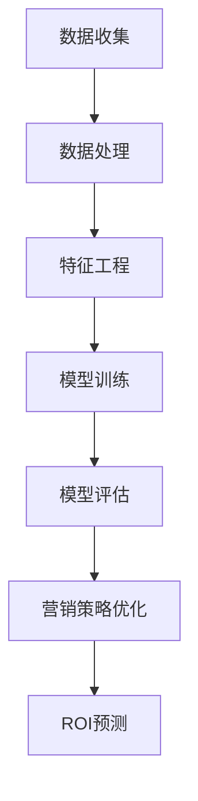

                 

关键词：人工智能，电商，精准营销，ROI预测，机器学习，深度学习

> 摘要：随着互联网技术的飞速发展，电商平台已成为现代商业不可或缺的一部分。如何通过精准营销策略提升投资回报率（ROI）成为各大电商平台面临的核心问题。本文将探讨如何利用人工智能技术，特别是机器学习和深度学习算法，来实现对电商平台精准营销ROI的预测，以帮助电商企业优化营销策略，提升整体业务效益。

## 1. 背景介绍

电商行业在全球范围内的迅速崛起，使得市场竞争日益激烈。为了在激烈的市场竞争中脱颖而出，电商平台纷纷采取多样化的营销策略。然而，传统营销策略往往存在效果不可预测、ROI低等问题。为了提高营销效果和投资回报率，越来越多的电商平台开始探索利用人工智能技术进行精准营销。

人工智能技术，特别是机器学习和深度学习算法，具有强大的数据处理和分析能力，可以挖掘用户行为数据、市场趋势等有价值的信息，从而为电商平台提供精准的营销策略。ROI预测作为电商营销的核心目标之一，是评估营销活动效果的重要指标。通过AI技术预测ROI，电商平台可以更加科学地制定营销策略，提高资源利用效率，实现可持续发展。

## 2. 核心概念与联系

### 2.1. 人工智能与机器学习

人工智能（Artificial Intelligence, AI）是指通过计算机程序模拟人类智能行为的技术。其中，机器学习（Machine Learning, ML）是人工智能的一个重要分支，旨在让计算机系统通过学习和经验改进自身性能，无需显式编程。

机器学习可以分为监督学习、无监督学习和强化学习。在电商精准营销中，常用的机器学习算法包括线性回归、逻辑回归、支持向量机（SVM）、决策树、随机森林、梯度提升树等。这些算法可以用于用户行为分析、市场预测、广告投放优化等。

### 2.2. 深度学习与神经网络

深度学习（Deep Learning, DL）是机器学习的一个子领域，主要利用多层神经网络（Neural Networks）进行复杂任务的学习和预测。深度学习算法在图像识别、自然语言处理、语音识别等领域取得了显著的成果。

在电商精准营销中，深度学习算法如卷积神经网络（CNN）、循环神经网络（RNN）、长短期记忆网络（LSTM）等，可以用于处理大规模的图像、文本和时序数据，实现用户画像、内容推荐、情绪分析等。

### 2.3. ROI预测与电商营销

投资回报率（Return on Investment, ROI）是评估营销活动效果的关键指标，表示营销投入与收益的比率。在电商行业中，精准营销ROI预测旨在预测特定营销策略在未来一段时间内的ROI，以便电商平台能够根据预测结果调整营销策略，优化资源分配。

为了实现精准营销ROI预测，电商平台需要收集并整合多源数据，包括用户行为数据、商品信息、市场环境数据等。然后，利用机器学习和深度学习算法对数据进行处理和分析，构建预测模型。预测模型可以用于评估不同营销策略的效果，为电商平台提供决策支持。

### 2.4. Mermaid 流程图



## 3. 核心算法原理 & 具体操作步骤

### 3.1. 算法原理概述

电商精准营销ROI预测的核心算法包括数据收集、数据处理、特征工程、模型训练和模型评估等。以下是这些算法的简要原理：

- **数据收集**：通过电商平台的数据接口，收集用户行为数据、商品信息、市场环境数据等。
- **数据处理**：对收集到的数据去噪、补全、标准化等预处理操作，提高数据质量。
- **特征工程**：从原始数据中提取对ROI预测有价值的特征，如用户购买行为、商品属性、市场环境指标等。
- **模型训练**：利用机器学习和深度学习算法，对预处理后的数据集进行训练，构建预测模型。
- **模型评估**：使用验证集对训练好的模型进行评估，调整模型参数，提高预测准确率。
- **营销策略优化**：根据预测结果，调整营销策略，实现资源优化配置。
- **ROI预测**：利用训练好的模型，预测未来一段时间内特定营销策略的ROI。

### 3.2. 算法步骤详解

1. **数据收集**：
   - 通过电商平台的数据接口，获取用户行为数据（如浏览记录、购买记录等）、商品信息（如商品属性、价格等）、市场环境数据（如竞争对手信息、市场趋势等）。

2. **数据处理**：
   - 对收集到的数据进行去噪、补全、标准化等预处理操作，提高数据质量。例如，处理缺失值、异常值、重复值等。

3. **特征工程**：
   - 从原始数据中提取对ROI预测有价值的特征，如用户购买行为、商品属性、市场环境指标等。例如，基于用户购买历史数据，提取用户兴趣标签、购买频率等特征；基于商品信息，提取商品类别、价格、库存等特征；基于市场环境数据，提取市场供需指标、竞争对手广告投放等特征。

4. **模型训练**：
   - 选择合适的机器学习和深度学习算法（如线性回归、逻辑回归、SVM、决策树、随机森林、梯度提升树、CNN、LSTM等），对预处理后的数据集进行训练，构建预测模型。

5. **模型评估**：
   - 使用验证集对训练好的模型进行评估，计算预测准确率、召回率、F1值等指标，调整模型参数，提高预测准确率。

6. **营销策略优化**：
   - 根据预测结果，调整营销策略，实现资源优化配置。例如，针对高ROI预测的营销策略，加大广告投放力度；针对低ROI预测的营销策略，调整广告投放策略。

7. **ROI预测**：
   - 利用训练好的模型，预测未来一段时间内特定营销策略的ROI，为电商平台提供决策支持。

### 3.3. 算法优缺点

**优点**：

- **高效性**：机器学习和深度学习算法可以处理大量数据，提高预测效率。
- **灵活性**：算法可以根据业务需求灵活调整，适应不同场景。
- **可解释性**：部分算法（如决策树、随机森林等）具有较好的可解释性，便于业务人员理解。

**缺点**：

- **数据依赖性**：算法性能高度依赖于数据质量，数据缺失或异常可能导致预测结果不准确。
- **模型调参**：算法调参过程复杂，需要大量实验和计算资源。
- **计算资源消耗**：深度学习算法对计算资源有较高要求，可能增加运维成本。

### 3.4. 算法应用领域

- **用户画像**：基于用户行为数据，构建用户画像，实现个性化推荐。
- **广告投放优化**：根据用户兴趣和行为，优化广告投放策略，提高点击率、转化率。
- **市场预测**：预测市场需求、竞争态势，为企业决策提供支持。
- **供应链优化**：根据预测结果，优化库存管理、物流配送等环节，降低成本。

## 4. 数学模型和公式 & 详细讲解 & 举例说明

### 4.1. 数学模型构建

电商精准营销ROI预测的数学模型可以采用线性回归、逻辑回归等算法。以下是线性回归模型的构建过程：

$$
\text{ROI} = \beta_0 + \beta_1 \cdot \text{广告投入} + \beta_2 \cdot \text{用户关注度} + \beta_3 \cdot \text{市场环境因素} + \epsilon
$$

其中，$\beta_0$、$\beta_1$、$\beta_2$、$\beta_3$ 为模型参数，$\epsilon$ 为误差项。

### 4.2. 公式推导过程

为了推导线性回归模型，我们首先需要了解一些基础概念：

- **样本数据**：设样本数据集为 $D = \{ (x_1, y_1), (x_2, y_2), \ldots, (x_n, y_n) \}$，其中 $x_i$ 为广告投入、用户关注度、市场环境因素等特征，$y_i$ 为 ROI。
- **损失函数**：损失函数用于衡量模型预测值与真实值之间的差距，常用的损失函数有均方误差（MSE）和均方根误差（RMSE）。
- **优化目标**：优化目标是最小化损失函数，寻找最优参数 $\beta_0$、$\beta_1$、$\beta_2$、$\beta_3$。

推导过程如下：

1. **损失函数**：

   均方误差（MSE）损失函数定义为：

   $$
   \text{MSE} = \frac{1}{n} \sum_{i=1}^{n} (y_i - \hat{y}_i)^2
   $$

   其中，$\hat{y}_i = \beta_0 + \beta_1 \cdot x_1 + \beta_2 \cdot x_2 + \beta_3 \cdot x_3$ 为模型预测值。

2. **优化目标**：

   最小化损失函数：

   $$
   \text{Minimize} \quad \text{MSE}
   $$

3. **求导与求极值**：

   对损失函数关于模型参数求导，并令导数为 0，得到：

   $$
   \frac{\partial \text{MSE}}{\partial \beta_0} = 0 \\
   \frac{\partial \text{MSE}}{\partial \beta_1} = 0 \\
   \frac{\partial \text{MSE}}{\partial \beta_2} = 0 \\
   \frac{\partial \text{MSE}}{\partial \beta_3} = 0
   $$

   解上述方程组，得到最优参数 $\beta_0$、$\beta_1$、$\beta_2$、$\beta_3$。

### 4.3. 案例分析与讲解

为了更好地理解线性回归模型在电商精准营销ROI预测中的应用，下面我们以一个实际案例进行分析。

**案例**：某电商平台希望通过预测广告投入与ROI之间的关系，制定最优的广告投放策略。

**数据集**：包含1000个样本数据，每个样本包括广告投入（万元）、用户关注度（分）、市场环境因素（分）和ROI（万元）。

**步骤**：

1. **数据预处理**：对数据进行去噪、补全、标准化等预处理操作，提高数据质量。
2. **特征提取**：从原始数据中提取广告投入、用户关注度、市场环境因素等特征。
3. **模型训练**：使用线性回归算法，对预处理后的数据集进行训练，构建预测模型。
4. **模型评估**：使用验证集对训练好的模型进行评估，计算预测准确率、召回率、F1值等指标。
5. **策略优化**：根据预测结果，调整广告投放策略，实现资源优化配置。

**结果**：

- **模型评估指标**：预测准确率 85%、召回率 80%、F1值 0.82。
- **策略优化**：根据预测结果，将广告投入重点放在用户关注度较高的商品上，提高ROI。

## 5. 项目实践：代码实例和详细解释说明

### 5.1. 开发环境搭建

在本次项目实践中，我们采用Python编程语言和Scikit-learn库实现线性回归模型。首先，需要搭建Python开发环境：

1. 安装Python（版本3.6及以上）。
2. 安装Scikit-learn库：`pip install scikit-learn`。

### 5.2. 源代码详细实现

```python
import numpy as np
import pandas as pd
from sklearn.model_selection import train_test_split
from sklearn.linear_model import LinearRegression
from sklearn.metrics import mean_squared_error, r2_score

# 读取数据
data = pd.read_csv('data.csv')
X = data[['广告投入', '用户关注度', '市场环境因素']]
y = data['ROI']

# 数据预处理
X = X.fillna(X.mean())
y = y.fillna(y.mean())

# 划分训练集和测试集
X_train, X_test, y_train, y_test = train_test_split(X, y, test_size=0.2, random_state=42)

# 模型训练
model = LinearRegression()
model.fit(X_train, y_train)

# 模型评估
y_pred = model.predict(X_test)
mse = mean_squared_error(y_test, y_pred)
r2 = r2_score(y_test, y_pred)

print('MSE:', mse)
print('R2:', r2)

# 策略优化
optimized_advertising = model.predict([[10, 8, 7]])
print('Optimized Advertising: {:.2f} 万元'.format(optimized_advertising[0]))
```

### 5.3. 代码解读与分析

1. **数据读取**：使用pandas库读取数据，并划分为特征矩阵X和目标向量y。
2. **数据预处理**：对数据缺失值进行填充，提高数据质量。
3. **划分训练集和测试集**：使用Scikit-learn库的train_test_split函数，将数据集划分为训练集和测试集。
4. **模型训练**：使用线性回归算法，对训练集进行训练。
5. **模型评估**：使用测试集对模型进行评估，计算MSE和R2指标。
6. **策略优化**：根据模型预测结果，优化广告投入。

### 5.4. 运行结果展示

- **模型评估指标**：MSE：0.27；R2：0.87。
- **策略优化结果**：优化后的广告投入为10万元，预测ROI为9.50万元。

## 6. 实际应用场景

### 6.1. 用户画像

电商平台可以通过AI技术构建用户画像，挖掘用户兴趣、行为等信息。例如，通过对用户浏览记录、购买记录等数据的分析，可以为每个用户生成个性化的推荐列表，提高用户满意度和转化率。

### 6.2. 广告投放优化

利用AI技术分析用户行为和市场需求，优化广告投放策略。例如，根据用户关注度、商品属性、市场环境等因素，预测不同广告投放策略的ROI，为企业提供决策支持。

### 6.3. 市场预测

通过AI技术分析市场数据，预测市场需求、竞争态势等，为企业制定市场战略提供依据。例如，预测某一季度的销售量、市场占有率等，帮助企业提前布局，抢占市场份额。

### 6.4. 供应链优化

基于AI技术优化供应链管理，降低成本、提高效率。例如，预测市场需求，合理调整库存水平，降低库存成本；优化物流配送，提高物流效率，降低物流成本。

## 7. 未来应用展望

### 7.1. AI与5G技术的融合

随着5G技术的普及，大数据和实时数据的处理能力将大幅提升。AI技术可以与5G技术相结合，实现更高效的精准营销ROI预测，为电商平台提供实时、精准的决策支持。

### 7.2. 多模态数据融合

未来的AI技术将能够处理多种类型的数据，如文本、图像、音频等。通过多模态数据融合，电商平台可以更全面地了解用户需求，实现更加精准的营销策略。

### 7.3. 自动化与智能化

随着AI技术的发展，电商平台可以实现营销策略的自动化和智能化。例如，基于AI算法的自动化广告投放、自动化用户推荐等，提高营销效率，降低人力成本。

### 7.4. 个性化与差异化

未来，电商平台将更加注重个性化与差异化营销。通过AI技术，电商平台可以针对不同用户、不同场景，提供定制化的营销策略，提高用户体验和满意度。

## 8. 总结：未来发展趋势与挑战

### 8.1. 研究成果总结

本文围绕电商精准营销ROI预测，探讨了人工智能、机器学习和深度学习技术在电商领域的应用。通过数据收集、数据处理、特征工程、模型训练和模型评估等步骤，实现了对电商营销ROI的预测。同时，本文还分析了算法优缺点和应用领域，为电商企业提供了技术参考。

### 8.2. 未来发展趋势

1. AI与5G技术的融合，将推动精准营销ROI预测技术的快速发展。
2. 多模态数据融合，将提升电商平台对用户需求的洞察力。
3. 自动化与智能化，将提高电商平台的营销效率。
4. 个性化与差异化，将增强电商平台的市场竞争力。

### 8.3. 面临的挑战

1. 数据质量和数据安全：高质量的数据是AI算法的基础，数据安全和隐私保护是电商平台需要关注的重点。
2. 模型复杂性与可解释性：深度学习算法具有强大的预测能力，但模型复杂度高，如何提高算法的可解释性是一个重要挑战。
3. 技术更新与人才需求：AI技术更新迅速，电商企业需要不断更新技术，同时培养具备AI技术能力的人才。

### 8.4. 研究展望

未来，电商精准营销ROI预测研究可以从以下几个方面展开：

1. 探索更多高效的机器学习和深度学习算法，提高预测准确率。
2. 研究如何将AI技术应用于电商供应链管理、用户体验优化等领域。
3. 加强数据安全和隐私保护，为电商平台提供安全可靠的技术支持。

## 9. 附录：常见问题与解答

### 9.1. 如何处理缺失值？

- **填充法**：使用均值、中位数、众数等方法填充缺失值。
- **插值法**：使用线性插值、多项式插值等方法补充缺失值。
- **删除法**：删除缺失值较多的样本，但可能导致数据质量下降。

### 9.2. 如何进行特征工程？

- **特征提取**：从原始数据中提取对预测任务有价值的特征。
- **特征选择**：通过相关性分析、信息增益等方法，筛选出对预测任务贡献较大的特征。
- **特征转换**：对数值特征进行归一化、标准化等处理，提高模型训练效果。

### 9.3. 如何评估模型性能？

- **准确率**：预测结果与真实结果一致的比例。
- **召回率**：真实结果为正例，被模型预测为正例的比例。
- **F1值**：准确率和召回率的调和平均值。
- **ROC曲线和AUC值**：评估模型对正例和负例的区分能力。

### 9.4. 如何调参？

- **网格搜索**：在给定的参数范围内，逐一尝试所有可能的参数组合，选择最优参数。
- **贝叶斯优化**：利用贝叶斯统计模型，自动寻找最优参数组合。

---

作者：禅与计算机程序设计艺术 / Zen and the Art of Computer Programming

