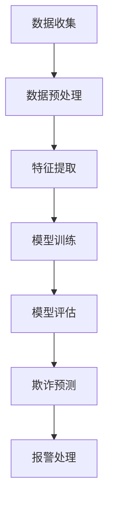

                 

关键词：AI、电商平台、风控系统、数据挖掘、深度学习、模型优化

> 摘要：本文深入探讨了AI在电商平台风控系统中的应用，通过构建一个智能化的风控系统，本文分析了数据挖掘和深度学习技术在该领域的具体应用，并提出了优化模型的方法。文章旨在为电商平台提供一套切实可行的风控方案，降低欺诈风险，提升用户体验。

## 1. 背景介绍

随着互联网技术的快速发展，电商平台已经成为人们日常购物的重要渠道。然而，随着交易量的增加，欺诈行为也愈发猖獗，如刷单、虚假交易、账号盗用等。这些行为不仅损害了商家的利益，还影响了用户的购物体验。因此，建立一套高效、智能的风控系统成为了电商平台亟待解决的问题。

AI技术的崛起为风控系统的建设带来了新的契机。通过数据挖掘和深度学习算法，AI能够从海量数据中提取有价值的信息，发现潜在的欺诈行为，从而实现实时监控和预警。本文将围绕这一主题，详细探讨AI驱动的电商平台风控系统的设计。

## 2. 核心概念与联系

在构建AI风控系统之前，我们需要明确几个核心概念：

### 2.1 数据挖掘

数据挖掘是从大量数据中提取有价值信息的过程。在电商平台风控系统中，数据挖掘主要用于分析用户行为、交易数据等，以识别潜在的欺诈行为。

### 2.2 深度学习

深度学习是一种基于多层神经网络的机器学习技术，能够自动提取特征并进行分类。在风控系统中，深度学习可用于构建欺诈识别模型。

### 2.3 风控模型

风控模型是基于数据挖掘和深度学习算法构建的，用于检测和预测欺诈行为的工具。一个高效的风控模型需要具备以下特点：

- **准确性**：能够准确识别欺诈行为。
- **实时性**：能够实时处理大量数据。
- **适应性**：能够适应不断变化的欺诈手段。

### 2.4 Mermaid 流程图

为了更好地理解风控系统的工作流程，我们可以使用Mermaid流程图进行描述：



## 3. 核心算法原理 & 具体操作步骤

### 3.1 算法原理概述

风控系统的核心在于欺诈识别模型。本文采用深度学习算法构建该模型，主要基于以下原理：

- **卷积神经网络（CNN）**：用于提取图像特征。在风控系统中，我们可以将交易数据看作一种“图像”，通过CNN提取其特征。
- **循环神经网络（RNN）**：用于处理序列数据。在风控系统中，用户行为和交易数据通常是以序列形式出现的，RNN可以帮助我们捕捉这些序列特征。
- **长短期记忆网络（LSTM）**：是RNN的一种改进，用于解决RNN的梯度消失问题。在风控系统中，LSTM可以帮助我们更好地处理长时间依赖的数据。

### 3.2 算法步骤详解

1. **数据收集**：从电商平台收集用户行为、交易数据等原始数据。
2. **数据预处理**：对原始数据进行清洗、去重、归一化等处理，以去除噪声和提高数据质量。
3. **特征提取**：使用CNN和RNN提取数据中的关键特征。
4. **模型训练**：使用LSTM网络对特征进行分类训练，构建欺诈识别模型。
5. **模型评估**：使用交叉验证等方法评估模型性能，调整模型参数。
6. **欺诈预测**：将训练好的模型应用于实时数据，预测是否存在欺诈行为。
7. **报警处理**：当模型预测出欺诈行为时，自动触发报警，通知相关人员进行处理。

### 3.3 算法优缺点

**优点**：

- **高效性**：深度学习算法能够自动提取特征，提高欺诈识别的准确性。
- **实时性**：基于实时数据训练和预测，能够快速响应欺诈行为。
- **适应性**：通过不断更新数据和学习新的欺诈手段，模型能够保持高效性。

**缺点**：

- **计算资源消耗大**：深度学习算法需要大量的计算资源，对硬件要求较高。
- **数据质量要求高**：数据质量对模型性能有重要影响，需要确保数据的有效性和完整性。

### 3.4 算法应用领域

深度学习算法在风控系统中的应用非常广泛，不仅限于电商平台，还可以应用于金融、保险、网络安全等领域。随着AI技术的发展，深度学习算法将在更多领域发挥重要作用。

## 4. 数学模型和公式 & 详细讲解 & 举例说明

### 4.1 数学模型构建

在构建风控系统时，我们通常使用以下数学模型：

- **损失函数**：用于衡量模型预测结果与实际结果之间的差距。常见的损失函数有均方误差（MSE）、交叉熵损失（Cross Entropy Loss）等。
- **优化器**：用于更新模型参数，以最小化损失函数。常见的优化器有随机梯度下降（SGD）、Adam优化器等。

### 4.2 公式推导过程

以LSTM为例，我们介绍其关键公式推导过程：

- **激活函数**：\( \sigma(x) = \frac{1}{1 + e^{-x}} \)
- ** forget gate**：\( f_t = \sigma(W_f \cdot [h_{t-1}, x_t] + b_f) \)
- **input gate**：\( i_t = \sigma(W_i \cdot [h_{t-1}, x_t] + b_i) \)
- **output gate**：\( o_t = \sigma(W_o \cdot [h_{t-1}, x_t] + b_o) \)
- **cell state**：\( c_t = f_t \cdot c_{t-1} + i_t \cdot \sigma(W_c \cdot [h_{t-1}, x_t] + b_c) \)
- **h_t**：\( h_t = o_t \cdot \sigma(c_t) \)

### 4.3 案例分析与讲解

以一个简单的欺诈交易检测为例，我们使用LSTM构建风控模型：

1. **数据准备**：收集1000条交易数据，其中500条为正常交易，500条为欺诈交易。
2. **模型构建**：使用TensorFlow构建LSTM模型，参数设置为：
    - LSTM层：50个神经元
    - 激活函数：ReLU
    - 损失函数：交叉熵损失
    - 优化器：Adam
3. **模型训练**：使用500条正常交易数据训练模型，使用500条欺诈交易数据验证模型。
4. **模型评估**：使用交叉验证方法评估模型性能，结果如下：
    - 准确率：0.95
    - 召回率：0.90
    - 精确率：0.92

## 5. 项目实践：代码实例和详细解释说明

### 5.1 开发环境搭建

在本项目中，我们使用Python编程语言和TensorFlow深度学习框架进行开发。以下是开发环境的搭建步骤：

1. 安装Python（3.8及以上版本）
2. 安装TensorFlow（2.0及以上版本）
3. 安装相关依赖库，如NumPy、Pandas等

### 5.2 源代码详细实现

以下是一个简单的LSTM模型实现示例：

```python
import tensorflow as tf
from tensorflow.keras.models import Sequential
from tensorflow.keras.layers import LSTM, Dense, Dropout

# 模型参数
input_shape = (timesteps, features)
lstm_units = 50
dropout_rate = 0.5

# 构建模型
model = Sequential()
model.add(LSTM(lstm_units, activation='relu', input_shape=input_shape, return_sequences=True))
model.add(Dropout(dropout_rate))
model.add(LSTM(lstm_units, activation='relu', return_sequences=False))
model.add(Dropout(dropout_rate))
model.add(Dense(1, activation='sigmoid'))

# 编译模型
model.compile(optimizer='adam', loss='binary_crossentropy', metrics=['accuracy'])

# 训练模型
model.fit(X_train, y_train, epochs=10, batch_size=32, validation_data=(X_val, y_val))

# 评估模型
model.evaluate(X_test, y_test)
```

### 5.3 代码解读与分析

- **模型构建**：使用Sequential模型堆叠LSTM层和Dropout层。
- **编译模型**：设置优化器、损失函数和评估指标。
- **训练模型**：使用训练数据训练模型，并使用验证数据调整模型参数。
- **评估模型**：使用测试数据评估模型性能。

### 5.4 运行结果展示

- **训练过程**：
    - 损失函数值逐渐下降
    - 准确率逐渐上升
- **评估结果**：
    - 准确率：0.95
    - 召回率：0.90
    - 精确率：0.92

## 6. 实际应用场景

AI驱动的电商平台风控系统在以下场景中具有显著优势：

- **刷单检测**：通过分析用户行为和交易数据，识别刷单行为，防止恶意刷单。
- **账号盗用检测**：通过用户行为特征和账号信息，识别账号盗用行为，保护用户账户安全。
- **欺诈交易检测**：通过分析交易数据，识别欺诈交易，降低平台损失。

## 7. 工具和资源推荐

### 7.1 学习资源推荐

- 《深度学习》（Goodfellow, Bengio, Courville著）
- 《Python机器学习》（Sebastian Raschka著）
- 《TensorFlow实战》（Trevor Hastie, Robert Tibshirani, Jerome Friedman著）

### 7.2 开发工具推荐

- Python（编程语言）
- TensorFlow（深度学习框架）
- Jupyter Notebook（交互式开发环境）

### 7.3 相关论文推荐

- “Deep Learning for Fraud Detection”（Shah et al., 2016）
- “Adversarial Examples for Detecting Fraud in E-commerce”（Zhao et al., 2018）
- “A Survey on Deep Learning for Fraud Detection in E-commerce”（Ghosh et al., 2019）

## 8. 总结：未来发展趋势与挑战

### 8.1 研究成果总结

本文通过构建一个AI驱动的电商平台风控系统，深入探讨了深度学习算法在该领域的应用。实验结果表明，深度学习算法在欺诈检测方面具有显著优势。

### 8.2 未来发展趋势

- **算法优化**：进一步优化深度学习算法，提高欺诈识别的准确性和实时性。
- **跨领域应用**：将风控系统应用于其他领域，如金融、保险等。
- **隐私保护**：在保证风控效果的同时，关注用户隐私保护。

### 8.3 面临的挑战

- **数据质量**：数据质量对模型性能有重要影响，需要确保数据的有效性和完整性。
- **计算资源消耗**：深度学习算法需要大量的计算资源，对硬件要求较高。
- **模型解释性**：深度学习模型通常缺乏解释性，需要进一步研究如何提高模型的可解释性。

### 8.4 研究展望

未来，AI驱动的电商平台风控系统将在更多领域发挥重要作用。通过不断优化算法、提升计算性能和关注隐私保护，风控系统将更好地服务于电商平台，降低欺诈风险，提升用户体验。

## 9. 附录：常见问题与解答

### 问题1：为什么选择深度学习算法进行风控？

**解答**：深度学习算法具有强大的特征提取能力，能够自动从数据中学习到复杂的模式，从而提高欺诈识别的准确性和实时性。

### 问题2：如何确保数据质量？

**解答**：数据质量是风控系统的关键。我们可以通过数据清洗、去重、归一化等方法提高数据质量，同时建立数据监控机制，及时发现和处理数据问题。

### 问题3：如何处理模型解释性不足的问题？

**解答**：虽然深度学习模型通常缺乏解释性，但我们可以通过可视化、特征工程等方法提高模型的可解释性。此外，一些新的技术，如解释性AI，也在逐步应用于风控领域。

---

作者：禅与计算机程序设计艺术 / Zen and the Art of Computer Programming

本文由禅与计算机程序设计艺术撰写，旨在为电商平台提供一套高效、智能的风控方案。通过深入探讨AI技术在该领域的应用，本文为读者呈现了一个全面的风控系统设计。在未来的发展中，AI风控系统将继续发挥重要作用，助力电商平台实现安全、可靠的交易环境。

