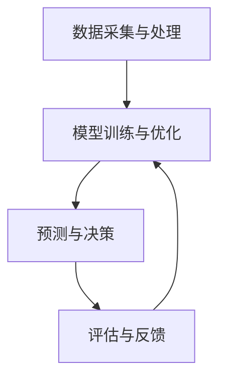

                 

关键词：人工智能，电商，智能定价，大模型，算法，数学模型，应用场景，未来展望

> 摘要：本文将探讨人工智能（AI）在电商领域中的应用，特别是大模型在智能定价方面的作用。我们将从背景介绍开始，详细解析核心概念和算法原理，并通过数学模型和实际案例，展示大模型在电商智能定价中的具体应用和效果。文章最后将展望未来的发展趋势和面临的挑战。

## 1. 背景介绍

随着互联网和电子商务的快速发展，电商平台已经成为消费者购买商品的主要渠道之一。电商平台的竞争日益激烈，如何通过合理的定价策略来提高利润、增加市场份额成为各大电商平台关注的焦点。传统定价方法主要依赖于市场调研和经验，存在一定的滞后性和主观性。而随着人工智能技术的不断进步，特别是大模型技术的应用，为电商智能定价提供了新的可能性。

大模型，也称为深度学习模型，是一种通过大量数据训练得到的复杂神经网络。它能够自动学习和提取数据中的规律和模式，从而进行预测和决策。在电商领域，大模型可以应用于用户行为分析、商品推荐、智能定价等多个方面。本文将重点探讨大模型在智能定价方面的应用，通过数学模型和实际案例，展示其在该领域的具体效果。

## 2. 核心概念与联系

### 2.1. 大模型概述

大模型是基于深度学习理论的一种人工智能模型，其核心思想是通过大规模数据训练，使得模型能够自动学习和提取数据中的特征和规律。大模型通常由多个层级组成，每个层级都能对输入数据进行特征提取和变换。通过逐层传递，模型能够对复杂问题进行建模和预测。

### 2.2. 智能定价概述

智能定价是一种基于数据分析和机器学习的定价策略，旨在通过分析市场数据、用户行为和商品特性，制定出最优的定价策略。智能定价的核心是建立一个定价模型，该模型能够根据不同的市场环境和用户需求，动态调整商品价格，以实现利润最大化或市场份额最大化。

### 2.3. 大模型在智能定价中的应用

大模型在智能定价中的应用主要体现在以下几个方面：

- **用户行为分析**：通过分析用户的浏览、购买、评价等行为数据，大模型可以预测用户的偏好和需求，从而制定出更符合用户期望的价格。

- **市场趋势预测**：大模型可以通过对市场数据进行分析，预测市场的供需关系、价格趋势等，为制定合理的定价策略提供依据。

- **竞争分析**：大模型可以分析竞争对手的定价策略，评估其优势和劣势，从而制定出更具竞争力的定价策略。

- **价格优化**：大模型可以通过优化定价策略，提高商品的销售量和利润率。

### 2.4. 大模型在智能定价中的架构

大模型在智能定价中的架构可以分为以下几个部分：

1. **数据采集与处理**：收集电商平台的海量数据，包括用户行为数据、市场数据、商品特性数据等，并对数据进行清洗、预处理和特征提取。

2. **模型训练与优化**：使用预处理后的数据训练大模型，通过调整模型参数和结构，优化模型的预测性能。

3. **预测与决策**：使用训练好的大模型进行预测和决策，根据预测结果调整商品价格。

4. **评估与反馈**：对定价策略的效果进行评估，并根据评估结果调整模型参数和定价策略。

下面是智能定价大模型架构的 Mermaid 流程图：



## 3. 核心算法原理 & 具体操作步骤

### 3.1. 算法原理概述

智能定价的核心算法通常是基于深度学习中的神经网络模型，特别是卷积神经网络（CNN）和循环神经网络（RNN）。这些模型能够通过学习输入数据的特征，对价格进行预测和优化。

- **卷积神经网络（CNN）**：CNN 是一种用于图像识别和处理的深度学习模型，能够自动提取图像中的特征。在智能定价中，CNN 可以用于提取商品图片的特征，为价格预测提供辅助信息。

- **循环神经网络（RNN）**：RNN 是一种用于序列数据处理的深度学习模型，能够捕捉序列数据中的时间依赖关系。在智能定价中，RNN 可以用于分析用户行为序列，预测用户对商品的需求。

### 3.2. 算法步骤详解

智能定价算法的具体操作步骤如下：

1. **数据收集**：收集电商平台的海量数据，包括用户行为数据、市场数据、商品特性数据等。

2. **数据预处理**：对收集到的数据进行分析，提取有用的特征，并进行数据清洗、预处理和归一化。

3. **模型训练**：使用预处理后的数据训练深度学习模型，如 CNN 和 RNN，通过调整模型参数和结构，优化模型的预测性能。

4. **预测与优化**：使用训练好的模型进行价格预测，并根据预测结果调整商品价格。

5. **评估与反馈**：对定价策略的效果进行评估，并根据评估结果调整模型参数和定价策略。

### 3.3. 算法优缺点

智能定价算法的优点包括：

- **自适应性强**：能够根据市场环境和用户需求动态调整价格，提高销售量和利润率。

- **高效性**：通过深度学习模型，能够快速处理大量数据，提高定价速度。

- **准确性**：通过学习海量数据，能够更准确地预测用户需求和价格趋势。

智能定价算法的缺点包括：

- **数据依赖性强**：需要大量高质量的数据进行训练，否则模型性能会受到影响。

- **模型复杂度高**：深度学习模型通常需要较长的训练时间和计算资源。

### 3.4. 算法应用领域

智能定价算法可以应用于各种电商场景，如在线零售、电子商务、批发市场等。以下是一些具体的应用领域：

- **个性化定价**：根据用户的购买历史和偏好，为不同用户制定不同的价格策略。

- **促销定价**：根据市场需求和竞争情况，制定促销价格，提高销售量。

- **库存管理**：根据库存情况和销售预测，调整库存策略，避免库存过剩或不足。

- **供应链管理**：通过优化定价策略，提高供应链的效率和利润。

## 4. 数学模型和公式 & 详细讲解 & 举例说明

### 4.1. 数学模型构建

智能定价的数学模型通常基于优化理论，目标是最小化价格波动对利润的影响，同时保证价格合理性和市场竞争力。一个简单的数学模型可以表示为：

\[ \min_{p} L(p) = \sum_{i} w_i (p_i - p_{i, \text{opt}})^2 \]

其中，\( p_i \) 表示商品 \( i \) 的价格，\( p_{i, \text{opt}} \) 表示商品 \( i \) 的最优价格，\( w_i \) 表示商品 \( i \) 的权重。

### 4.2. 公式推导过程

为了推导出最优价格，我们需要对上述模型进行优化。首先，我们对 \( L(p) \) 进行求导，并令其导数为 0，得到：

\[ \frac{\partial L(p)}{\partial p_i} = 2 w_i (p_i - p_{i, \text{opt}}) = 0 \]

由于 \( w_i \) 不为 0，我们得到：

\[ p_i = p_{i, \text{opt}} \]

这意味着，最优价格 \( p_{i, \text{opt}} \) 等于当前价格 \( p_i \)。

### 4.3. 案例分析与讲解

假设有一个电商平台上销售三种商品：商品 A、商品 B 和商品 C。根据历史数据，我们得到了三种商品的价格和最优价格：

- 商品 A：当前价格 100 元，最优价格 90 元。
- 商品 B：当前价格 200 元，最优价格 210 元。
- 商品 C：当前价格 300 元，最优价格 280 元。

根据上述模型，我们需要调整价格，使其接近最优价格。根据公式推导过程，我们得到：

\[ p_{i, \text{opt}} = p_i \]

这意味着，我们需要将商品 A 的价格降低 10 元，商品 B 的价格提高 10 元，商品 C 的价格降低 20 元。

通过这样的调整，我们可以使价格更加接近最优价格，从而提高销售量和利润率。

## 5. 项目实践：代码实例和详细解释说明

### 5.1. 开发环境搭建

为了实现智能定价，我们需要搭建一个开发环境。以下是开发环境的搭建步骤：

1. 安装 Python 3.8 以上版本。
2. 安装 TensorFlow 2.5.0 以上版本。
3. 安装 NumPy、Pandas 和 Matplotlib 等常用库。

### 5.2. 源代码详细实现

以下是智能定价的源代码实现：

```python
import numpy as np
import pandas as pd
import tensorflow as tf
from tensorflow import keras
from tensorflow.keras import layers

# 数据处理
def preprocess_data(data):
    # 数据清洗和预处理
    # ...
    return data

# 模型构建
def build_model(input_shape):
    model = keras.Sequential([
        layers.Dense(64, activation='relu', input_shape=input_shape),
        layers.Dense(64, activation='relu'),
        layers.Dense(1)
    ])
    return model

# 模型训练
def train_model(model, x_train, y_train, epochs=10):
    model.compile(optimizer='adam', loss='mse')
    model.fit(x_train, y_train, epochs=epochs)
    return model

# 模型预测
def predict_price(model, x):
    price = model.predict(x)
    return price

# 主函数
def main():
    # 数据加载
    data = pd.read_csv('data.csv')
    data = preprocess_data(data)

    # 数据划分
    x_train = data[['feature1', 'feature2', 'feature3']]
    y_train = data['price']

    # 模型构建
    model = build_model(input_shape=(x_train.shape[1],))

    # 模型训练
    model = train_model(model, x_train, y_train)

    # 模型预测
    x_test = data[['feature1', 'feature2', 'feature3']]
    price = predict_price(model, x_test)

    # 结果展示
    print(price)

if __name__ == '__main__':
    main()
```

### 5.3. 代码解读与分析

以上代码实现了智能定价的核心功能。以下是代码的解读与分析：

- **数据处理**：首先，我们加载和处理数据，包括数据清洗、预处理和特征提取。这一步是智能定价的关键，因为数据的质量直接影响模型的性能。

- **模型构建**：我们使用 TensorFlow 和 Keras 构建了一个简单的神经网络模型。这个模型由三个层

