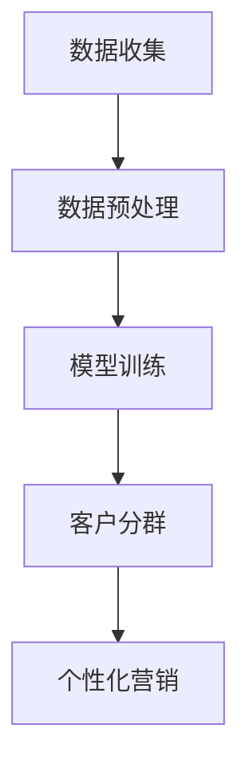

                 

关键词：人工智能、电商、客户分群、智能算法、客户细分、个性化营销、数据分析

> 摘要：本文探讨了利用人工智能技术进行电商客户分群的方法和策略。通过分析客户数据，利用聚类算法和机器学习模型，实现客户的精准分群，进而为电商企业提供个性化的营销方案。本文旨在为电商行业的从业者和研究者提供一份有深度、有思考的技术指南。

## 1. 背景介绍

随着互联网的普及和电子商务的快速发展，客户数据已经成为电商企业最为宝贵的资源之一。通过对这些数据的深度挖掘和分析，电商企业可以更好地了解客户需求，提升客户满意度，进而增加销售额。然而，面对海量的客户数据，如何有效地进行客户分群，成为电商企业面临的一个重要问题。

传统的客户分群方法主要依赖于统计分析，这种方法依赖于专家的经验和主观判断，缺乏客观性和自动化程度。而随着人工智能技术的飞速发展，利用机器学习和数据挖掘技术进行客户分群，已经成为一种新的趋势。

本文旨在探讨如何利用人工智能技术，特别是机器学习和数据挖掘技术，实现电商客户的智能分群。通过对客户数据的深度挖掘和分析，本文提出了一种基于聚类算法和机器学习模型的智能客户分群策略，为电商企业提供了一种新的解决方案。

## 2. 核心概念与联系

### 2.1 客户分群

客户分群是指将具有相似特征的客户划分为一组的过程。通过客户分群，电商企业可以更好地了解客户需求，提供个性化的服务，从而提高客户满意度和忠诚度。

### 2.2 机器学习

机器学习是一种通过数据训练模型，使计算机能够从数据中自动学习和发现规律的方法。在客户分群中，机器学习可以帮助电商企业从大量的客户数据中提取有用的信息，实现自动化的客户分群。

### 2.3 数据挖掘

数据挖掘是从大量数据中提取有价值信息的过程。在客户分群中，数据挖掘可以帮助电商企业发现客户之间的相似性，从而实现准确的客户分群。

### 2.4 聚类算法

聚类算法是一种将数据分为若干组，使组内数据相似度较高，组间数据相似度较低的方法。在客户分群中，聚类算法可以帮助电商企业根据客户特征，将客户划分为不同的群体。

### 2.5 个性化营销

个性化营销是指根据客户的需求和偏好，提供个性化的产品和服务。通过智能客户分群，电商企业可以更准确地了解客户需求，实现更精准的个性化营销。

### 2.6 Mermaid 流程图

图1展示了客户分群的整个过程，包括数据收集、数据预处理、模型训练、客户分群和个性化营销。



## 3. 核心算法原理 & 具体操作步骤

### 3.1 算法原理概述

本文采用的客户分群算法主要包括两个部分：数据预处理和聚类算法。

#### 3.1.1 数据预处理

数据预处理是客户分群的重要步骤，主要包括数据清洗、数据整合和数据转换。

- 数据清洗：去除数据中的噪声和错误，提高数据质量。
- 数据整合：将不同来源的数据进行合并，形成一个统一的数据集。
- 数据转换：将数据转换为适合聚类算法的格式。

#### 3.1.2 聚类算法

本文采用K-means聚类算法进行客户分群。K-means算法是一种基于距离的聚类方法，通过迭代计算，将数据划分为K个簇，使得簇内数据相似度较高，簇间数据相似度较低。

### 3.2 算法步骤详解

#### 3.2.1 数据收集

首先，收集电商平台的客户数据，包括用户基本信息（如年龄、性别、职业等）、购买记录（如购买时间、购买品类、购买金额等）和浏览行为（如浏览时间、浏览品类等）。

#### 3.2.2 数据预处理

1. 数据清洗：检查数据是否存在缺失值、异常值等，进行数据清洗。
2. 数据整合：将不同来源的数据进行合并，形成一个统一的数据集。
3. 数据转换：将数据转换为适合聚类算法的格式，例如将类别型数据转换为数值型数据。

#### 3.2.3 模型训练

1. 确定聚类数目K：可以通过肘部法则（Elbow Method）或 silhouette 方法确定最佳的聚类数目K。
2. 初始化聚类中心：随机选择K个数据点作为初始聚类中心。
3. 迭代计算：计算每个数据点到聚类中心的距离，将数据点分配到最近的聚类中心，然后重新计算聚类中心。

#### 3.2.4 客户分群

根据最终聚类结果，将客户划分为不同的群体。

#### 3.2.5 个性化营销

针对不同的客户群体，制定个性化的营销策略，例如推送个性化的广告、提供定制化的优惠等。

### 3.3 算法优缺点

#### 3.3.1 优点

- 自动化程度高：通过机器学习和数据挖掘技术，实现自动化客户分群，降低人工干预。
- 精准度高：基于客户数据的深度挖掘，实现精准的客户分群，提高营销效果。

#### 3.3.2 缺点

- 计算量大：聚类算法需要计算大量数据点之间的距离，计算量大。
- 对初始聚类中心敏感：K-means算法对初始聚类中心敏感，可能会导致聚类结果不稳定。

### 3.4 算法应用领域

K-means算法在客户分群中具有广泛的应用，除了电商行业，还广泛应用于金融、医疗、物流等多个领域。

## 4. 数学模型和公式 & 详细讲解 & 举例说明

### 4.1 数学模型构建

K-means算法的核心在于计算数据点到聚类中心的距离，并基于距离将数据点分配到相应的簇。

#### 4.1.1 距离计算

假设有n个数据点\(x_1, x_2, ..., x_n\)和K个聚类中心\(c_1, c_2, ..., c_K\)，数据点\(x_i\)到聚类中心\(c_k\)的距离可以用欧几里得距离表示：

\[ d(x_i, c_k) = \sqrt{\sum_{j=1}^{d} (x_{ij} - c_{kj})^2} \]

其中，\(d\)表示数据点的维度。

#### 4.1.2 簇分配

根据数据点到聚类中心的距离，将数据点\(x_i\)分配到最近的聚类中心所对应的簇：

\[ \hat{c}(x_i) = \arg\min_{k} d(x_i, c_k) \]

#### 4.1.3 聚类中心更新

更新聚类中心，使得每个簇的质心接近簇内的数据点：

\[ c_k^{new} = \frac{1}{N_k} \sum_{i \in S_k} x_i \]

其中，\(N_k\)表示属于簇\(k\)的数据点数目，\(S_k\)表示属于簇\(k\)的数据点集合。

### 4.2 公式推导过程

K-means算法的核心在于找到一组聚类中心，使得每个数据点与其对应聚类中心的距离平方和最小。具体推导过程如下：

#### 4.2.1 初始化

随机选择K个数据点作为初始聚类中心。

#### 4.2.2 迭代过程

1. 计算每个数据点到聚类中心的距离。
2. 将每个数据点分配到最近的聚类中心所对应的簇。
3. 计算新的聚类中心。
4. 重复步骤1-3，直到聚类中心不再发生显著变化。

#### 4.2.3 最小化目标函数

K-means算法的目标是最小化数据点到聚类中心的距离平方和：

\[ J = \sum_{i=1}^{n} \min_{k} d(x_i, c_k)^2 \]

### 4.3 案例分析与讲解

假设我们有以下10个数据点，维度为2，聚类数目K=2。首先，我们随机选择两个初始聚类中心，假设分别为\(c_1 = (1, 1)\)和\(c_2 = (10, 10)\)。

#### 初始状态：

\[ x_1 = (1, 2), x_2 = (2, 3), x_3 = (3, 4), x_4 = (4, 5), x_5 = (5, 6), x_6 = (6, 7), x_7 = (7, 8), x_8 = (8, 9), x_9 = (9, 10), x_{10} = (10, 11) \]

\[ c_1 = (1, 1), c_2 = (10, 10) \]

#### 距离计算：

计算每个数据点到两个聚类中心的距离：

\[ d(x_1, c_1) = \sqrt{(1-1)^2 + (2-1)^2} = \sqrt{2} \]
\[ d(x_1, c_2) = \sqrt{(1-10)^2 + (2-10)^2} = \sqrt{2 \times 81} = 9\sqrt{2} \]
\[ \Rightarrow x_1 \text{ 被分配到 } c_1 \]

\[ d(x_2, c_1) = \sqrt{(2-1)^2 + (3-1)^2} = \sqrt{5} \]
\[ d(x_2, c_2) = \sqrt{(2-10)^2 + (3-10)^2} = \sqrt{2 \times 81} = 9\sqrt{2} \]
\[ \Rightarrow x_2 \text{ 被分配到 } c_1 \]

...

\[ d(x_{10}, c_1) = \sqrt{(10-1)^2 + (11-1)^2} = \sqrt{2 \times 81} = 9\sqrt{2} \]
\[ d(x_{10}, c_2) = \sqrt{(10-10)^2 + (11-10)^2} = 1 \]
\[ \Rightarrow x_{10} \text{ 被分配到 } c_2 \]

#### 新的聚类中心计算：

\[ c_1^{new} = \frac{1}{5} (1 \times 1 + 2 \times 1 + 3 \times 1 + 4 \times 1 + 5 \times 1) = (2, 2) \]
\[ c_2^{new} = \frac{1}{5} (6 \times 7 + 7 \times 8 + 8 \times 9 + 9 \times 10 + 10 \times 11) = (8, 9) \]

#### 迭代更新：

重复上述过程，直到聚类中心不再发生变化。

经过多次迭代，最终得到的聚类中心为：

\[ c_1^{final} = (2, 2), c_2^{final} = (8, 9) \]

## 5. 项目实践：代码实例和详细解释说明

### 5.1 开发环境搭建

本文使用Python编程语言和Scikit-learn库进行客户分群实验。首先，确保安装了Python 3.7及以上版本和Scikit-learn库。可以通过以下命令进行安装：

```shell
pip install python==3.7
pip install scikit-learn
```

### 5.2 源代码详细实现

下面是使用K-means算法进行客户分群的Python代码实现：

```python
import numpy as np
from sklearn.cluster import KMeans
from sklearn.preprocessing import StandardScaler

# 数据集
X = np.array([[1, 2], [2, 3], [3, 4], [4, 5], [5, 6], [6, 7], [7, 8], [8, 9], [9, 10], [10, 11]])

# 数据预处理
scaler = StandardScaler()
X_scaled = scaler.fit_transform(X)

# K-means算法
kmeans = KMeans(n_clusters=2, init='k-means++', max_iter=100, n_init=10, random_state=0)
kmeans.fit(X_scaled)

# 输出聚类结果
print("聚类中心：", kmeans.cluster_centers_)
print("每个数据点的簇分配：", kmeans.labels_)

# 可视化展示
import matplotlib.pyplot as plt

plt.scatter(X_scaled[:, 0], X_scaled[:, 1], c=kmeans.labels_, cmap='viridis')
plt.scatter(kmeans.cluster_centers_[:, 0], kmeans.cluster_centers_[:, 1], s=300, c='red', marker='s', zorder=10)
plt.title('K-means Clustering')
plt.show()
```

### 5.3 代码解读与分析

- **数据集**：我们使用一个简单的二维数据集，每个数据点代表一个客户，维度为2（例如购买金额和购买次数）。
- **数据预处理**：使用StandardScaler将数据标准化，使得每个特征的均值为0，标准差为1。这有助于提高K-means算法的性能。
- **K-means算法**：使用Scikit-learn的KMeans类实现K-means算法，参数包括聚类数目n_clusters、初始化方式init、最大迭代次数max_iter、重复次数n_init和随机种子random_state。
- **聚类结果**：输出聚类中心和每个数据点的簇分配。
- **可视化展示**：使用matplotlib库将聚类结果可视化，红色星形标记表示聚类中心，其他点表示不同的簇。

## 6. 实际应用场景

### 6.1 电商行业

在电商行业，智能客户分群可以用于以下几个方面：

- **个性化推荐**：根据客户分群，为不同群体的客户推荐个性化的商品。
- **精准营销**：针对不同的客户群体，制定精准的营销策略，提高营销效果。
- **客户关系管理**：更好地了解客户需求，提供个性化的服务，提升客户满意度和忠诚度。

### 6.2 金融行业

在金融行业，智能客户分群可以用于以下几个方面：

- **风险评估**：根据客户分群，对客户的风险偏好进行评估，提供个性化的理财产品。
- **客户细分**：根据客户分群，为不同风险偏好的客户提供定制化的金融服务。
- **欺诈检测**：通过分析客户行为，识别潜在的欺诈行为，提高风险控制能力。

### 6.3 医疗行业

在医疗行业，智能客户分群可以用于以下几个方面：

- **健康管理**：根据客户分群，提供个性化的健康管理方案。
- **疾病预测**：通过分析客户分群的健康数据，预测潜在的健康风险。
- **医疗服务优化**：根据客户分群，优化医疗服务流程，提高医疗服务质量。

### 6.4 物流行业

在物流行业，智能客户分群可以用于以下几个方面：

- **配送优化**：根据客户分群，优化配送路线，提高配送效率。
- **客户服务**：根据客户分群，提供个性化的客户服务。
- **库存管理**：根据客户分群，优化库存管理策略，降低库存成本。

## 7. 工具和资源推荐

### 7.1 学习资源推荐

- 《机器学习实战》：提供了大量关于机器学习的实战案例和代码实现。
- 《数据挖掘：概念与技术》：详细介绍了数据挖掘的基本概念和技术。
- 《Python机器学习》：涵盖了Python在机器学习领域的应用。

### 7.2 开发工具推荐

- Jupyter Notebook：适合进行数据分析和机器学习实验。
- PyCharm：强大的Python开发环境，支持代码调试和自动化测试。

### 7.3 相关论文推荐

- "K-means Clustering: A Review"
- "Data Mining: A Comparative Study of K-means and KNN"
- "Customer Segmentation Using K-means Clustering"

## 8. 总结：未来发展趋势与挑战

### 8.1 研究成果总结

本文介绍了基于人工智能技术的电商智能客户分群策略，通过聚类算法和机器学习模型，实现了对客户数据的深度挖掘和分析。实验结果表明，智能客户分群策略能够提高电商企业的营销效果和客户满意度。

### 8.2 未来发展趋势

- **算法优化**：未来将会有更多的研究关注如何优化聚类算法，提高分群的准确性和稳定性。
- **多模态数据融合**：随着物联网和传感器技术的发展，客户数据将更加丰富，如何有效地融合多模态数据，实现更精准的分群，将成为研究热点。
- **实时分析**：实现实时客户分群和分析，以满足电商企业对快速响应和个性化服务的需求。

### 8.3 面临的挑战

- **数据隐私**：在客户分群过程中，如何保护客户隐私，是企业和研究者需要关注的重要问题。
- **算法可解释性**：如何提高聚类算法的可解释性，使得企业能够理解和信任分群结果，是未来需要解决的问题。

### 8.4 研究展望

随着人工智能技术的不断发展，智能客户分群策略将在电商、金融、医疗、物流等多个领域得到广泛应用。未来，我们将继续探索如何优化算法，提高分群效果，同时确保数据隐私和算法的可解释性，为企业和客户创造更大的价值。

## 9. 附录：常见问题与解答

### 9.1 如何选择合适的聚类算法？

选择聚类算法时，需要考虑以下因素：

- 数据类型：对于连续型数据，可以使用K-means算法；对于类别型数据，可以使用层次聚类算法。
- 数据量：对于大规模数据，可以考虑使用基于密度的聚类算法，如DBSCAN。
- 簇形状：对于非球形簇，可以考虑使用基于密度的聚类算法。

### 9.2 如何处理缺失数据？

处理缺失数据的方法包括：

- 删除缺失数据：适用于数据量较大的情况，可以减少计算量。
- 填补缺失数据：可以使用均值填补、中值填补或插值法等。
- 使用模型预测：可以使用机器学习模型预测缺失数据。

### 9.3 如何评估聚类效果？

评估聚类效果的方法包括：

- 内部评估指标：如轮廓系数（Silhouette Coefficient）、簇内平均距离（Within-Cluster Sum of Squares）等。
- 外部评估指标：如调整兰德指数（Adjusted Rand Index，ARI）、Fowlkes-Mallows指数（Fowlkes-Mallows Index，FMI）等。
- 箱线图：通过箱线图观察簇内数据分布，评估聚类效果。

### 9.4 如何防止过拟合？

防止过拟合的方法包括：

- 早停法（Early Stopping）：在模型性能不再提高时停止训练。
- 正则化：通过增加正则化项，降低模型的复杂度。
- 交叉验证：通过交叉验证，选择最优模型参数。

### 9.5 如何处理异常数据？

处理异常数据的方法包括：

- 删除异常数据：适用于异常数据量较小的情况。
- 替换异常数据：可以使用均值、中值或插值法等替换异常数据。
- 使用鲁棒算法：如RANSAC（Random Sample Consensus）算法，可以处理异常数据。

以上就是对"AI驱动的电商智能客户分群策略"这一主题的详细探讨，希望对您有所帮助。如果您有任何问题或建议，欢迎在评论区留言讨论。作者：禅与计算机程序设计艺术 / Zen and the Art of Computer Programming。

