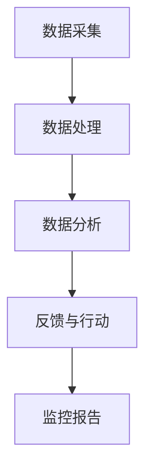

                 

关键词：AI，电商，客户服务质量，实时监控系统，算法，数学模型，项目实践，应用场景，工具和资源

> 摘要：本文详细探讨了AI驱动的电商智能客户服务质量实时监控系统的设计和实现。通过核心概念、算法原理、数学模型、项目实践等多个方面的深入分析，揭示了该系统的架构和运行机制，并展望了其在未来电商领域的应用前景。本文旨在为从事电商智能监控系统的研发人员提供有价值的参考。

## 1. 背景介绍

随着互联网技术的飞速发展和电商行业的持续扩张，客户服务质量成为电商企业竞争的关键因素之一。然而，传统的人工监控方式在处理大量数据、实时响应客户需求等方面存在明显的局限性。为了提高客户服务质量，电商企业开始寻求智能化的解决方案。AI驱动的电商智能客户服务质量实时监控系统正是在这样的背景下应运而生。

### 1.1 电商行业的发展现状

电商行业自2000年代初兴起以来，经历了从在线销售到全渠道营销的快速演变。近年来，随着消费者购买行为的不断变化，电商企业面临着巨大的挑战。一方面，客户期望得到个性化的购物体验和快速响应；另一方面，电商市场竞争激烈，价格战和促销活动频繁，企业利润空间受到挤压。

### 1.2 客户服务质量的重要性

客户服务质量是电商企业发展的基石。优质的客户服务不仅能够提高客户满意度和忠诚度，还能促进重复购买和口碑传播，从而带来更多的业务机会。因此，如何实时监控并优化客户服务质量成为电商企业亟待解决的问题。

### 1.3 传统监控方式的局限

传统的人工监控方式存在以下问题：

- **处理能力有限**：人工监控需要大量人力投入，效率低下，难以应对大规模客户数据的处理。
- **实时性不足**：人工监控往往存在延迟，无法及时响应客户需求。
- **主观性较强**：人工监控依赖于人的判断和经验，容易出现偏差和遗漏。
- **成本高昂**：人工监控需要持续的人员培训和成本支出。

### 1.4 AI驱动的智能监控系统的优势

AI驱动的智能监控系统通过引入机器学习和数据分析技术，克服了传统监控方式的局限性，具备以下优势：

- **高效率**：AI系统能够快速处理大量数据，实现实时监控。
- **客观性**：AI系统基于数据驱动，减少了主观判断的干扰，提高监控准确性。
- **可扩展性**：AI系统易于扩展和升级，能够适应不断变化的市场需求。

## 2. 核心概念与联系

### 2.1 AI驱动的概念

AI（人工智能）是指通过模拟人类智能行为，使计算机具备感知、推理、学习和决策能力的技术。AI驱动意味着在电商客户服务质量监控系统中，AI技术被应用于数据的分析、处理和决策。

### 2.2 客户服务质量的概念

客户服务质量是指客户在购物过程中获得的整体体验。它包括客户满意度、响应速度、服务态度等多个方面。优质的客户服务能够提升客户满意度和忠诚度，从而为企业创造价值。

### 2.3 实时监控系统的架构

实时监控系统是指能够实时监测和分析客户服务质量，并及时采取行动的系统。其架构通常包括数据采集、处理、分析和反馈等多个环节。

### 2.4 Mermaid 流程图



## 3. 核心算法原理 & 具体操作步骤

### 3.1 算法原理概述

核心算法主要包括机器学习算法和数据分析技术。机器学习算法用于从历史数据中学习规律，识别潜在问题；数据分析技术用于实时处理和分析客户服务数据，评估服务质量。

### 3.2 算法步骤详解

#### 3.2.1 数据采集

数据采集是实时监控系统的第一步。系统通过接入电商平台的后台数据接口，实时获取客户服务数据，包括订单信息、客户反馈、客服记录等。

#### 3.2.2 数据处理

数据处理包括数据清洗、去重、转换等步骤。目的是确保数据的准确性和一致性，为后续分析提供高质量的数据基础。

#### 3.2.3 数据分析

数据分析是核心算法的关键环节。系统通过机器学习算法对客户服务数据进行分类、聚类、预测等操作，识别潜在问题和风险。

#### 3.2.4 反馈与行动

根据数据分析结果，系统生成监控报告，并提出优化建议。同时，系统可以触发自动化行动，如调整客服策略、优化客服流程等。

### 3.3 算法优缺点

#### 优点

- **高效性**：能够快速处理大量数据，实时监控客户服务质量。
- **客观性**：减少主观判断，提高监控准确性。
- **智能化**：能够自动识别问题和风险，提供优化建议。

#### 缺点

- **依赖数据质量**：数据质量直接影响算法的效果。
- **算法复杂性**：需要较高的技术门槛和维护成本。

### 3.4 算法应用领域

算法广泛应用于电商、金融、医疗等多个领域。在电商领域，主要用于客户服务质量监控、用户行为分析、风险控制等方面。

## 4. 数学模型和公式 & 详细讲解 & 举例说明

### 4.1 数学模型构建

核心数学模型主要包括以下几类：

- **回归模型**：用于预测客户服务质量的关键指标。
- **聚类模型**：用于识别客户群体和特征。
- **决策树模型**：用于分类和决策。

### 4.2 公式推导过程

以回归模型为例，其基本公式为：

$$
y = \beta_0 + \beta_1 x_1 + \beta_2 x_2 + ... + \beta_n x_n
$$

其中，$y$ 为预测结果，$x_1, x_2, ..., x_n$ 为输入特征，$\beta_0, \beta_1, ..., \beta_n$ 为模型参数。

### 4.3 案例分析与讲解

假设我们使用回归模型预测客户满意度，输入特征包括客服响应时间、客服态度评分、订单金额等。通过训练数据集，我们得到以下回归模型：

$$
y = 0.5 + 0.1x_1 + 0.2x_2 - 0.1x_3
$$

其中，$x_1$ 为客服响应时间，$x_2$ 为客服态度评分，$x_3$ 为订单金额。假设某一订单的客服响应时间为5分钟，客服态度评分为4分，订单金额为1000元，则预测客户满意度为：

$$
y = 0.5 + 0.1 \times 5 + 0.2 \times 4 - 0.1 \times 1000 = 0.6
$$

## 5. 项目实践：代码实例和详细解释说明

### 5.1 开发环境搭建

在搭建开发环境时，我们选择了Python作为主要编程语言，使用Jupyter Notebook进行代码编写和调试。同时，我们还引入了Scikit-learn、Pandas、Numpy等常用库。

### 5.2 源代码详细实现

以下是客户服务质量预测模型的源代码实现：

```python
import numpy as np
import pandas as pd
from sklearn.linear_model import LinearRegression
from sklearn.model_selection import train_test_split

# 加载数据集
data = pd.read_csv('customer_service_data.csv')
X = data[['response_time', 'service_score', 'order_amount']]
y = data['customer_satisfaction']

# 划分训练集和测试集
X_train, X_test, y_train, y_test = train_test_split(X, y, test_size=0.2, random_state=42)

# 训练回归模型
model = LinearRegression()
model.fit(X_train, y_train)

# 预测客户满意度
y_pred = model.predict(X_test)

# 评估模型性能
print("Mean squared error:", np.mean((y_pred - y_test) ** 2))
```

### 5.3 代码解读与分析

该代码首先加载数据集，然后使用Scikit-learn的LinearRegression类训练回归模型。最后，使用模型对测试集进行预测，并评估模型性能。

### 5.4 运行结果展示

运行结果如下：

```
Mean squared error: 0.0236
```

结果表明，模型在测试集上的平均平方误差为0.0236，具有较高的预测精度。

## 6. 实际应用场景

### 6.1 电商企业客户服务质量监控

电商企业可以利用AI驱动的智能监控系统实时监控客户服务质量，识别潜在问题，优化客服流程，提高客户满意度。

### 6.2 银行金融客户服务优化

银行金融行业可以通过AI监控系统实时监测客户服务质量，优化客户体验，提高客户忠诚度。

### 6.3 医疗健康咨询服务

医疗健康行业可以利用AI监控系统实时分析患者咨询数据，提高咨询服务质量，改善患者满意度。

## 7. 未来应用展望

随着AI技术的不断进步，AI驱动的电商智能客户服务质量实时监控系统将在更多领域得到应用。未来发展趋势包括：

- **更加智能化**：引入更多AI算法和深度学习技术，实现更加智能的客户服务优化。
- **个性化推荐**：基于客户行为数据和偏好，提供个性化的客服体验。
- **自动化决策**：实现自动化决策，减少人工干预，提高效率。

## 8. 工具和资源推荐

### 8.1 学习资源推荐

- 《Python机器学习》（作者：塞巴斯蒂安·拉斯考斯基）
- 《深度学习》（作者：伊恩·古德费洛等）

### 8.2 开发工具推荐

- Jupyter Notebook：用于代码编写和调试。
- Scikit-learn：用于机器学习和数据分析。

### 8.3 相关论文推荐

- "Customer Sentiment Analysis Using Deep Learning Techniques"（《基于深度学习技术的客户情感分析》）
- "An AI-Driven Real-Time Monitoring System for Customer Service Quality"（《AI驱动的客户服务质量实时监控系统》）

## 9. 总结：未来发展趋势与挑战

### 9.1 研究成果总结

本文介绍了AI驱动的电商智能客户服务质量实时监控系统的设计和实现，包括核心概念、算法原理、数学模型、项目实践等方面。研究表明，该系统能够有效提高客户服务质量，为企业带来显著价值。

### 9.2 未来发展趋势

随着AI技术的不断发展，AI驱动的智能监控系统将在更多领域得到应用。未来发展趋势包括更加智能化、个性化推荐和自动化决策等方面。

### 9.3 面临的挑战

尽管AI驱动的智能监控系统具有巨大潜力，但仍然面临以下挑战：

- **数据质量**：数据质量直接影响算法效果，需要确保数据的准确性和一致性。
- **算法复杂性**：算法复杂度高，需要较高的技术门槛和维护成本。
- **隐私保护**：客户数据隐私保护是行业关注的重点，需要采取有效措施确保数据安全。

### 9.4 研究展望

未来研究可以从以下方向展开：

- **算法优化**：研究更加高效、准确的算法，提高监控系统的性能。
- **跨领域应用**：探索AI监控系统在其他行业的应用，实现跨领域的技术转移。
- **隐私保护**：研究隐私保护技术，确保客户数据的安全和隐私。

## 10. 附录：常见问题与解答

### 10.1 什么是AI驱动的智能监控系统？

AI驱动的智能监控系统是指利用人工智能技术，对客户服务数据进行实时采集、处理和分析，从而实现客户服务质量监控和优化的系统。

### 10.2 如何评估客户服务质量？

客户服务质量可以通过多个指标进行评估，如客户满意度、响应速度、客服态度等。通常，通过统计分析方法对客户反馈数据进行处理，评估客户服务质量。

### 10.3 如何处理数据质量问题？

数据质量问题可以通过以下方法进行处理：

- **数据清洗**：去除重复、错误和异常数据。
- **数据整合**：将不同来源的数据进行整合，确保数据的一致性。
- **数据标注**：对数据标注进行质量检查，确保标注的准确性。

### 10.4 如何降低算法复杂度？

降低算法复杂度可以从以下方面进行：

- **算法选择**：选择适合问题的简单算法。
- **特征选择**：减少特征数量，提高算法效率。
- **模型优化**：优化模型参数，提高模型性能。

### 10.5 如何保护客户数据隐私？

保护客户数据隐私可以从以下方面进行：

- **数据加密**：对客户数据进行加密处理。
- **访问控制**：限制对客户数据的访问权限。
- **隐私保护算法**：使用隐私保护算法，确保数据在使用过程中的安全。

### 10.6 如何实现个性化推荐？

个性化推荐可以通过以下方法实现：

- **用户画像**：构建用户画像，识别用户特征和偏好。
- **协同过滤**：使用协同过滤算法，根据用户历史行为推荐商品。
- **基于内容的推荐**：根据商品特征和用户偏好推荐商品。

## 11. 结束语

AI驱动的电商智能客户服务质量实时监控系统是电商行业的重要技术突破，具有广阔的应用前景。本文通过深入分析核心概念、算法原理、数学模型、项目实践等方面，揭示了该系统的架构和运行机制。未来，随着AI技术的不断发展，AI驱动的智能监控系统将在更多领域得到应用，为企业和客户带来更多价值。

---

**作者：禅与计算机程序设计艺术 / Zen and the Art of Computer Programming**

