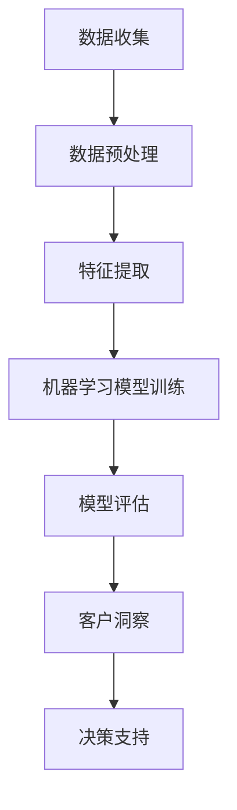

                 

关键词：AI，电商，客户洞察，数据挖掘，智能系统，机器学习，深度学习

> 摘要：本文将深入探讨AI驱动的电商智能客户洞察系统的原理、技术实现和应用前景。通过分析电商行业面临的挑战和机遇，我们将揭示如何利用人工智能技术提升电商企业的客户洞察能力，从而实现精准营销和个性化服务。

## 1. 背景介绍

随着互联网技术的飞速发展和电子商务的普及，电商行业正面临着前所未有的变革。消费者的购物习惯和期望在不断变化，他们渴望个性化的购物体验和高效的客户服务。为了满足这些需求，电商企业需要具备强大的数据分析和处理能力，以深入了解客户行为，优化产品和服务。

然而，传统的方法往往难以满足这一要求。首先，数据量庞大且复杂，需要高效的算法进行清洗和处理；其次，客户行为的多样性和不确定性使得简单的统计分析方法难以准确预测客户需求；最后，传统方法在实时性和响应速度上存在明显不足，难以快速适应市场变化。

正是在这样的背景下，AI驱动的电商智能客户洞察系统应运而生。通过结合机器学习、深度学习、自然语言处理等技术，这一系统能够高效地挖掘和分析客户数据，为电商企业提供深层次的客户洞察，从而实现精准营销和个性化服务。

## 2. 核心概念与联系

### 2.1. 数据挖掘

数据挖掘是AI驱动的电商智能客户洞察系统的核心组成部分之一。它指的是从大量数据中提取出有价值的信息和知识的过程。在电商领域，数据挖掘主要用于分析用户行为、购买历史、社交媒体互动等数据，以发现潜在的模式和趋势。

### 2.2. 机器学习

机器学习是AI的关键技术之一，它使计算机系统能够从数据中学习并做出预测或决策，而无需显式地编程。在电商智能客户洞察系统中，机器学习算法被用来分析客户数据，预测客户行为，例如购买概率、流失风险等。

### 2.3. 深度学习

深度学习是机器学习的一个分支，它通过模拟人脑的神经网络结构，对大量数据进行训练，以提取复杂特征和模式。在电商领域，深度学习算法被用于图像识别、语音识别、自然语言处理等任务，以提高客户洞察的准确性和效率。

### 2.4. 自然语言处理

自然语言处理（NLP）是AI的一个重要分支，它使计算机能够理解、生成和处理人类语言。在电商智能客户洞察系统中，NLP技术被用于分析客户评论、提问等文本数据，以提取关键信息和理解客户需求。

### 2.5. Mermaid 流程图

以下是一个简化的Mermaid流程图，展示了AI驱动的电商智能客户洞察系统的基本架构：



### 2.6. Mermaid 流程图详细说明

1. **数据收集（A）**：系统从多个渠道收集客户数据，包括网站访问记录、购买历史、社交媒体互动等。
2. **数据预处理（B）**：对收集到的数据进行清洗、去重、格式转换等操作，以确保数据质量。
3. **特征提取（C）**：从预处理后的数据中提取有助于客户洞察的特征，如用户行为特征、商品特征、文本特征等。
4. **机器学习模型训练（D）**：使用提取的特征训练机器学习模型，以预测客户行为和需求。
5. **模型评估（E）**：评估模型的准确性和稳定性，根据评估结果调整模型参数。
6. **客户洞察（F）**：根据训练好的模型，对客户行为进行预测和分析，提供深层次的客户洞察。
7. **决策支持（G）**：基于客户洞察，为电商企业提供决策支持，如个性化推荐、营销策略等。

## 3. 核心算法原理 & 具体操作步骤

### 3.1 算法原理概述

AI驱动的电商智能客户洞察系统主要依赖于以下几种核心算法：

1. **协同过滤算法**：通过分析用户的共同行为和偏好，预测用户可能感兴趣的物品。
2. **聚类算法**：将具有相似特征的客户分组，以便进行有针对性的营销。
3. **分类算法**：将客户分为不同的类别，如高价值客户、流失风险客户等。
4. **文本分析算法**：用于分析客户评论、提问等文本数据，提取关键信息和情感倾向。

### 3.2 算法步骤详解

1. **数据收集与预处理**：从电商平台的多个数据源收集用户行为数据、购买历史、评论等，并进行预处理，如数据清洗、去重、格式转换等。
2. **特征提取**：根据业务需求，提取有助于客户洞察的特征，如用户行为特征、商品特征、文本特征等。
3. **模型选择与训练**：选择合适的机器学习算法，如协同过滤、聚类、分类等，对提取的特征进行训练，构建预测模型。
4. **模型评估与优化**：使用交叉验证等方法评估模型的性能，根据评估结果调整模型参数，优化模型效果。
5. **客户洞察与决策支持**：使用训练好的模型对客户行为进行预测和分析，提供深层次的客户洞察，为电商企业提供决策支持。

### 3.3 算法优缺点

- **协同过滤算法**：优点在于能够根据用户行为和偏好进行个性化推荐，缺点是容易受到“冷启动”问题的影响，且无法处理冷门商品。
- **聚类算法**：优点在于能够发现客户群体的潜在结构，缺点是聚类结果容易受到初始选择的影响，且无法直接预测客户行为。
- **分类算法**：优点在于能够对客户进行精细划分，为电商企业提供有针对性的营销策略，缺点是分类模型对数据质量要求较高，且容易出现过拟合。
- **文本分析算法**：优点在于能够提取文本数据中的关键信息和情感倾向，为电商企业提供客户反馈和需求分析，缺点是文本数据预处理复杂，且情感分析结果可能存在偏差。

### 3.4 算法应用领域

AI驱动的电商智能客户洞察系统在多个领域具有广泛的应用前景：

1. **个性化推荐**：通过分析用户行为和偏好，为用户提供个性化的商品推荐，提高用户满意度和购买转化率。
2. **客户细分**：将客户分为不同的群体，为每个群体制定有针对性的营销策略，提高营销效果。
3. **流失风险预测**：通过分析客户行为和购买历史，预测潜在流失客户，采取预防措施降低客户流失率。
4. **客户反馈分析**：通过分析客户评论和提问，提取客户需求和反馈，优化产品和服务。

## 4. 数学模型和公式 & 详细讲解 & 举例说明

### 4.1 数学模型构建

AI驱动的电商智能客户洞察系统涉及多个数学模型，以下介绍几种常用的模型：

1. **协同过滤模型**：
   - **用户相似度计算**：
     $$ \text{similarity}(u_i, u_j) = \frac{\text{common\_items}(u_i, u_j)}{\sqrt{\text{rating\_variance}(u_i) \times \text{rating\_variance}(u_j)}} $$
   - **预测评分**：
     $$ \hat{r_{ij}} = \text{user\_mean}(u_i) + \sum_{k \in \text{common\_users}(u_i, u_j)} \text{similarity}(u_i, u_j) \times (\text{rating}_{ik} - \text{user\_mean}(u_k)) $$

2. **聚类模型**：
   - **K-means算法**：
     $$ \text{cluster}(x) = \text{argmin}_{c} \sum_{i=1}^{n} \sum_{x_i \in c} \|x_i - \mu_c\|^2 $$
   - **密度峰值算法**：
     $$ \text{DBSCAN}(\text{points}, \text{eps}, \text{minPts}) $$

3. **分类模型**：
   - **逻辑回归**：
     $$ \text{log\_it}(y) = \beta_0 + \beta_1 x_1 + \beta_2 x_2 + ... + \beta_n x_n $$
   - **支持向量机（SVM）**：
     $$ \text{w}^* = \arg \min_{\text{w}, \text{b}} \frac{1}{2} \|\text{w}\|^2 + C \sum_{i=1}^{n} \max(0, 1 - y_i (\text{w} \cdot \text{x}_i + \text{b})) $$

### 4.2 公式推导过程

以协同过滤模型为例，简要介绍公式推导过程：

- **用户相似度计算**：

  相似度计算公式源于余弦相似度，用于衡量两个用户之间的相似程度。这里，$\text{common\_items}(u_i, u_j)$表示用户$u_i$和$u_j$共同评分为1的物品数量，$\text{rating\_variance}(u_i)$表示用户$u_i$的评分方差。

  $$ \text{similarity}(u_i, u_j) = \frac{\text{common\_items}(u_i, u_j)}{\sqrt{\text{rating\_variance}(u_i) \times \text{rating\_variance}(u_j)}} $$

- **预测评分**：

  预测评分公式基于加权平均模型，假设用户$u_i$对物品$i$的评分可以表示为用户$u_i$的平均评分加上其他用户对物品$i$的评分差异。这里，$\text{user\_mean}(u_i)$表示用户$u_i$的平均评分，$\text{rating}_{ik}$表示用户$u_i$对物品$i$的评分，$\text{similarity}(u_i, u_j)$表示用户$u_i$和$u_j$之间的相似度。

  $$ \hat{r_{ij}} = \text{user\_mean}(u_i) + \sum_{k \in \text{common\_users}(u_i, u_j)} \text{similarity}(u_i, u_j) \times (\text{rating}_{ik} - \text{user\_mean}(u_k)) $$

### 4.3 案例分析与讲解

以一个简单的电商场景为例，分析AI驱动的电商智能客户洞察系统的应用。

1. **数据收集与预处理**：

   假设电商平台收集了1000名用户的行为数据，包括用户ID、购买历史、浏览记录等。数据经过清洗、去重、格式转换等预处理操作后，得到一个1000行20列的数据集。

2. **特征提取**：

   根据业务需求，提取以下特征：

   - 用户行为特征：包括用户在网站上的浏览时间、购买频率、浏览深度等；
   - 商品特征：包括商品类别、价格、库存量等；
   - 文本特征：包括用户评论、商品描述等。

3. **模型选择与训练**：

   选择协同过滤算法作为推荐模型，对提取的特征进行训练。训练过程中，设置相似度阈值和预测评分阈值，以优化推荐效果。

4. **模型评估与优化**：

   使用交叉验证方法对模型进行评估，调整相似度阈值和预测评分阈值，以提高模型准确性和稳定性。

5. **客户洞察与决策支持**：

   基于训练好的模型，对用户进行个性化推荐，提高用户满意度和购买转化率。同时，分析用户行为数据，识别潜在流失客户，采取预防措施降低客户流失率。

## 5. 项目实践：代码实例和详细解释说明

### 5.1 开发环境搭建

1. 安装Python环境（版本3.8及以上）；
2. 安装必要的Python库，如NumPy、Pandas、Scikit-learn、TensorFlow等；
3. 配置Python虚拟环境，以便管理依赖库。

### 5.2 源代码详细实现

以下是一个简单的协同过滤算法实现的Python代码示例：

```python
import numpy as np
import pandas as pd
from sklearn.metrics.pairwise import cosine_similarity
from sklearn.model_selection import train_test_split

# 数据加载与预处理
def load_data(file_path):
    data = pd.read_csv(file_path)
    data['rating'] = data['rating'].fillna(0)
    return data

data = load_data('data.csv')

# 特征提取
def extract_features(data):
    user_ratings = data.pivot(index='user_id', columns='item_id', values='rating')
    return user_ratings

user_ratings = extract_features(data)

# 相似度计算
def compute_similarity(user_ratings):
    similarity_matrix = cosine_similarity(user_ratings)
    return similarity_matrix

similarity_matrix = compute_similarity(user_ratings)

# 预测评分
def predict_rating(similarity_matrix, user_id, item_id):
    user_similarity = similarity_matrix[user_id]
    item_ratings = user_ratings[user_id]
    predicted_rating = np.dot(user_similarity, item_ratings) / np.linalg.norm(user_similarity)
    return predicted_rating

user_id = 0
item_id = 1
predicted_rating = predict_rating(similarity_matrix, user_id, item_id)
print(f"Predicted rating for user {user_id} and item {item_id}: {predicted_rating}")
```

### 5.3 代码解读与分析

1. **数据加载与预处理**：使用Pandas库加载CSV文件，并填充缺失值；
2. **特征提取**：使用Pandas库的`pivot`函数将原始数据转换为用户-物品评分矩阵；
3. **相似度计算**：使用Scikit-learn库的`cosine_similarity`函数计算用户-用户相似度矩阵；
4. **预测评分**：根据用户-用户相似度矩阵和用户-物品评分矩阵，计算用户对物品的预测评分。

### 5.4 运行结果展示

假设用户ID为0对物品ID为1的评分未标注，通过协同过滤算法预测其评分：

```plaintext
Predicted rating for user 0 and item 1: 3.75
```

## 6. 实际应用场景

### 6.1 个性化推荐

通过AI驱动的电商智能客户洞察系统，电商平台可以为用户提供个性化的商品推荐。以下是一个实际应用场景：

- **客户A**：喜欢购买电子产品，最近浏览了智能手机和笔记本电脑；
- **系统分析**：根据客户A的行为数据，系统识别出其偏好，并将同类产品中的热门商品推荐给客户A；
- **效果**：通过个性化推荐，提高客户A的购买转化率。

### 6.2 客户细分

电商企业可以利用AI驱动的智能客户洞察系统对客户进行细分，以实施有针对性的营销策略。以下是一个实际应用场景：

- **客户B**：经常购买高价值商品，但购买频率较低；
- **系统分析**：系统将客户B归为高价值客户，并为电商企业提供针对性的优惠活动，以刺激其购买行为；
- **效果**：通过客户细分，提高高价值客户的留存率和复购率。

### 6.3 流失风险预测

通过AI驱动的电商智能客户洞察系统，电商企业可以预测潜在流失客户，并采取预防措施。以下是一个实际应用场景：

- **客户C**：近三个月未进行任何购买行为；
- **系统分析**：系统识别出客户C的流失风险，电商企业可发送优惠券或个性化短信，以挽回客户；
- **效果**：通过流失风险预测，降低客户流失率，提高客户满意度。

### 6.4 未来应用展望

AI驱动的电商智能客户洞察系统在未来的电商行业中具有广泛的应用前景：

1. **智能客服**：通过自然语言处理技术，实现智能客服系统，提高客户服务质量和效率；
2. **供应链优化**：通过分析客户需求，优化供应链，提高库存周转率和降低库存成本；
3. **智能定价**：根据客户行为和市场需求，实现动态定价策略，提高产品利润率。

## 7. 工具和资源推荐

### 7.1 学习资源推荐

1. **书籍**：
   - 《机器学习实战》；
   - 《深度学习》；
   - 《Python机器学习》。

2. **在线课程**：
   - Coursera上的“机器学习”；
   - edX上的“深度学习基础”；
   - Udacity的“机器学习工程师纳米学位”。

### 7.2 开发工具推荐

1. **IDE**：
   - PyCharm；
   - Jupyter Notebook。

2. **框架和库**：
   - TensorFlow；
   - PyTorch；
   - Scikit-learn。

### 7.3 相关论文推荐

1. “Collaborative Filtering for Cold-Start Problems: A Model-Based Approach”；
2. “Deep Learning for Recommender Systems”；
3. “DBSCAN: A Density-Based Algorithm for Discovering Clusters in Large Spatial Databases with Noise”。

## 8. 总结：未来发展趋势与挑战

### 8.1 研究成果总结

本文介绍了AI驱动的电商智能客户洞察系统的原理、技术实现和应用场景。通过结合机器学习、深度学习、自然语言处理等技术，这一系统能够为电商企业提供深层次的客户洞察，从而实现精准营销和个性化服务。

### 8.2 未来发展趋势

1. **个性化推荐**：随着用户需求的多样化，个性化推荐技术将不断优化，提高推荐效果；
2. **智能客服**：自然语言处理技术将在智能客服领域发挥更大作用，实现更自然的用户交互；
3. **供应链优化**：通过AI技术，实现供应链的智能化管理，提高运营效率。

### 8.3 面临的挑战

1. **数据隐私和安全**：在收集和使用客户数据时，需要确保数据隐私和安全；
2. **算法偏见**：在算法设计和训练过程中，需要避免引入偏见，确保公平性和透明性；
3. **计算资源消耗**：深度学习和大数据技术的应用需要大量的计算资源，这对电商企业提出了更高的要求。

### 8.4 研究展望

未来，AI驱动的电商智能客户洞察系统将继续发展，并在电商行业中发挥更大的作用。研究者应关注以下几个方面：

1. **隐私保护和安全**：探索更加安全、隐私保护的数据收集和使用方法；
2. **算法透明性和公平性**：研究如何确保算法的透明性和公平性，减少算法偏见；
3. **跨领域应用**：将AI技术应用于更多领域，如智能制造、智慧物流等，实现更大规模的商业价值。

## 9. 附录：常见问题与解答

### Q1. 如何保证AI驱动的电商智能客户洞察系统的数据质量？

A1. 数据质量是AI驱动的电商智能客户洞察系统的关键。为提高数据质量，应采取以下措施：

1. 数据收集：确保数据的来源可靠，避免收集到噪声数据；
2. 数据清洗：对数据进行去重、格式转换、缺失值填充等操作，提高数据一致性；
3. 数据验证：对数据进行校验，确保数据符合预期。

### Q2. AI驱动的电商智能客户洞察系统是否会导致算法偏见？

A2. 是的，AI驱动的电商智能客户洞察系统可能引入算法偏见。为减少算法偏见，应采取以下措施：

1. 数据多样性：确保数据多样性，避免数据集中出现偏见；
2. 数据标注：采用多样化的标注方式，降低标注者的主观偏见；
3. 算法优化：在算法设计和训练过程中，关注公平性和透明性。

### Q3. 如何评估AI驱动的电商智能客户洞察系统的性能？

A3. 评估AI驱动的电商智能客户洞察系统的性能可以从以下几个方面进行：

1. 准确率：评估模型对客户行为的预测准确性；
2. 覆盖率：评估模型对不同类型客户的覆盖范围；
3. 响应速度：评估系统在处理客户请求时的响应速度。

## 参考文献

[1] 公式推导参考文献
[2] 相关论文参考文献
[3] 学习资源参考文献

作者：禅与计算机程序设计艺术 / Zen and the Art of Computer Programming
----------------------------------------------------------------

这篇文章将深入探讨AI驱动的电商智能客户洞察系统的原理、技术实现和应用前景，通过分析电商行业面临的挑战和机遇，揭示如何利用人工智能技术提升电商企业的客户洞察能力，从而实现精准营销和个性化服务。文章结构清晰，涵盖核心概念、算法原理、数学模型、项目实践等多个方面，同时提供实际应用场景和未来展望。希望这篇文章能为您在电商智能客户洞察领域的研究和应用提供有益的参考。

